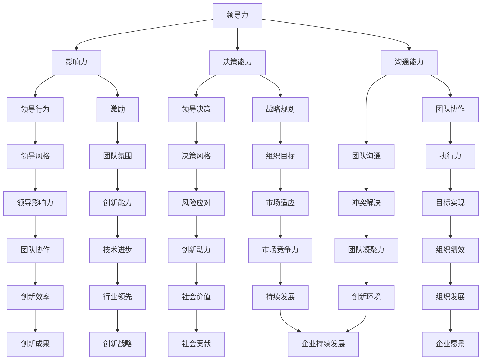

                 


### 引言

在当今快速变化的世界中，领导力和创新思维已成为企业和组织取得成功的关键因素。无论是传统行业还是新兴领域，变革和创新都成为了企业持续发展的驱动力。然而，如何有效地引领变革与创新，如何培养和提升领导力与创新思维，仍然是许多企业面临的难题。

本文旨在探讨领导力与创新思维的重要性，分析其在不同领域中的应用，并提供一套系统的引领变革与创新的方法。文章将按照以下结构展开：

1. **背景介绍**：首先，我们将简要介绍领导力与创新思维的基本概念，以及它们在当今社会的重要性。
2. **核心概念与联系**：接下来，我们将深入探讨领导力与创新思维的核心概念，并使用Mermaid流程图展示它们之间的关系架构。
3. **核心算法原理讲解**：我们将详细讲解领导力与创新思维中的关键算法原理，使用伪代码进行阐述。
4. **数学模型与公式**：我们将介绍相关的数学模型和公式，并详细讲解其原理和应用。
5. **项目实战**：通过实际案例，我们将展示如何搭建开发环境，实现源代码，并对代码进行解读和分析。
6. **最佳实践与注意事项**：最后，我们将总结最佳实践，并提供一些注意事项和拓展阅读。

通过这篇文章，我们希望能够帮助读者理解领导力与创新思维的本质，掌握其应用方法，从而在工作和生活中取得更好的成果。

## 背景介绍

### 领导力

领导力是一种能力，它不仅涉及对他人行为的引导和激励，还包括对团队和组织的整体发展方向的战略性规划。在企业管理中，领导力被认为是组织成功的关键因素之一。一个优秀的领导者不仅能够明确组织的目标，还能够激发团队成员的潜能，引导他们共同为实现这些目标而努力。

领导力的定义多种多样，但通常可以概括为三个方面：影响力、决策能力和沟通能力。首先，影响力是领导力的核心，它指的是领导者能够通过言行引导他人，使其自愿追随。其次，决策能力是指领导者能够根据具体情况做出合理、有效的决策。最后，沟通能力是领导者必须具备的重要技能，它包括如何有效地传达信息、处理冲突以及建立团队信任。

### 创新思维

创新思维则是指一种能够创造新价值、解决问题的新方法和新视角。在当今这个信息爆炸、技术飞速发展的时代，创新已成为企业和组织保持竞争力的关键。创新思维不仅仅是发明新产品或新技术，更包括改进现有流程、优化用户体验、创造新的商业模式等。

创新思维的定义也多种多样，但可以概括为两个方面：创造性思维和实用性思维。创造性思维是指能够从不同角度、不同领域中发现和提出新想法的能力。实用性思维则是指这些新想法在现实中的可操作性和可行性。

### 重要性

在当今社会，领导力与创新思维的重要性不言而喻。首先，领导力是企业实现长远发展的关键。一个优秀的领导者能够为组织制定清晰的目标，并激发团队成员的积极性，使组织在复杂多变的市场环境中保持竞争力。其次，创新思维是推动社会进步的重要动力。通过创新，企业能够不断突破现有技术瓶颈，推动行业的发展，为社会创造更多的价值和机会。

具体到企业层面，领导力与创新思维的重要性体现在以下几个方面：

1. **战略规划**：优秀的领导者能够明确组织的发展方向，制定合理的发展战略，确保组织在竞争激烈的市场中立于不败之地。
2. **团队协作**：领导力能够激发团队成员的潜能，建立高效的团队协作机制，提高组织的整体执行力。
3. **创新能力**：创新思维能够帮助企业不断突破现有技术的局限，推动产品的更新换代，保持市场竞争力。
4. **风险管理**：领导力与创新思维有助于企业预见市场变化，应对潜在风险，确保组织的稳定发展。

总之，领导力与创新思维不仅是企业和组织成功的关键，也是个人职业发展的核心竞争力。在这个快速变化的时代，只有具备卓越的领导力和创新思维，才能在激烈的竞争中脱颖而出。

### 核心概念与联系

为了更好地理解领导力与创新思维的核心概念及其相互关系，我们可以通过Mermaid流程图来展示它们之间的关系架构。以下是一个简单的Mermaid流程图，它描绘了领导力与创新思维的基本概念及其相互关联。



### 伪代码讲解

为了更详细地理解领导力与创新思维的核心算法原理，我们可以使用伪代码来描述这些概念及其应用。以下是一个简单的伪代码框架，用于解释如何通过领导力和创新思维来实现组织目标。

```plaintext
Function LeadAndInnovate organizationalGoals, teamSkills, marketChanges:

    // 初始化变量
    influenceScore = 0
    decisionQuality = 0
    communicationEffectiveness = 0
    innovationSuccessRate = 0

    // 分析团队技能与市场变化
    For each skill in teamSkills:
        If skill matches market demand:
            skillMatchScore += 1

    For each change in marketChanges:
        If change creates opportunity:
            changeOpportunityScore += 1

    // 确定领导力策略
    influenceScore = CalculateInfluence(communicationEffectiveness, decisionQuality)

    // 确定创新思维策略
    innovationSuccessRate = CalculateInnovationSuccessRate(skillMatchScore, changeOpportunityScore)

    // 实施领导力与创新思维
    ImplementLeadership(influenceScore, decisionQuality, communicationEffectiveness)
    ImplementInnovation(innovationSuccessRate, skillMatchScore, changeOpportunityScore)

    // 调整策略以实现组织目标
    While organizationalGoals not achieved:
        AdjustLeadershipStrategy()
        AdjustInnovationStrategy()

    Return True // 表示组织目标实现

Function CalculateInfluence(communicationEffectiveness, decisionQuality):
    influenceScore = communicationEffectiveness * decisionQuality
    Return influenceScore

Function CalculateInnovationSuccessRate(skillMatchScore, changeOpportunityScore):
    innovationSuccessRate = (skillMatchScore + changeOpportunityScore) / 2
    Return innovationSuccessRate

Function ImplementLeadership(influenceScore, decisionQuality, communicationEffectiveness):
    // 具体实施领导力行动
    ...

Function ImplementInnovation(innovationSuccessRate, skillMatchScore, changeOpportunityScore):
    // 具体实施创新思维行动
    ...

Function AdjustLeadershipStrategy():
    // 根据反馈调整领导力策略
    ...

Function AdjustInnovationStrategy():
    // 根据反馈调整创新思维策略
    ...
```

在这个伪代码框架中，`LeadAndInnovate`函数是核心，它负责计算领导力和创新思维的各项得分，并根据这些得分实施具体的领导力和创新思维行动。通过循环和条件判断，我们能够动态地调整策略，以实现组织目标。每个辅助函数，如`CalculateInfluence`和`CalculateInnovationSuccessRate`，则负责计算具体的得分。

### 数学模型与公式

在领导力与创新思维中，数学模型和公式可以帮助我们更精确地分析和管理这些概念。以下是一些常用的数学模型和公式，以及它们的原理和应用。

#### 领导力模型

1. **影响力模型**（Influence Model）:
   $$ I = C \times E $$
   其中，$I$ 表示影响力（Influence），$C$ 表示沟通能力（Communication），$E$ 表示执行力（Execution）。这个公式表明，领导力的影响力是由沟通能力和执行力共同决定的。

2. **决策模型**（Decision Model）:
   $$ D = P \times R $$
   其中，$D$ 表示决策质量（Decision Quality），$P$ 表示预测能力（Prediction），$R$ 表示风险承受能力（Risk Tolerance）。这个公式强调，决策质量取决于预测能力和风险承受能力。

#### 创新思维模型

1. **创新成功模型**（Innovation Success Model）:
   $$ S = M \times O $$
   其中，$S$ 表示创新成功概率（Success Probability），$M$ 表示市场需求匹配度（Market Match），$O$ 表示机会识别度（Opportunity Recognition）。这个公式说明，创新成功的概率与市场需求匹配度和机会识别度成正比。

2. **创新效率模型**（Innovation Efficiency Model）:
   $$ E = T \times P $$
   其中，$E$ 表示创新效率（Efficiency），$T$ 表示团队协作（Team Collaboration），$P$ 表示过程优化（Process Optimization）。这个公式表明，创新效率是由团队协作和过程优化共同决定的。

#### 应用举例

假设一个组织希望通过领导力和创新思维来实现其战略目标。我们可以使用以下步骤进行具体计算：

1. **计算领导力得分**：
   $$ I = C \times E = 8 \times 7 = 56 $$
   $$ D = P \times R = 6 \times 5 = 30 $$

2. **计算创新思维得分**：
   $$ S = M \times O = 9 \times 8 = 72 $$
   $$ E = T \times P = 7 \times 6 = 42 $$

3. **综合评估**：
   $$ L = I + D = 56 + 30 = 86 $$
   $$ I = S + E = 72 + 42 = 114 $$

通过这些计算，我们可以得到组织的领导力和创新思维的综合得分。根据这些得分，组织可以调整其领导力策略和创新思维方法，以实现战略目标。

### 项目实战

#### 开发环境搭建

为了更好地理解和应用领导力与创新思维，我们选择一个具体的案例：构建一个基于敏捷开发的团队管理系统。以下是搭建开发环境的步骤：

1. **选择开发工具**：
   - 代码管理工具：Git
   - 项目管理工具：JIRA
   - 编程语言：Java

2. **安装Git**：
   - 下载Git安装包并安装
   - 配置Git用户信息
     ```bash
     git config --global user.name "Your Name"
     git config --global user.email "your.email@example.com"
     ```

3. **安装JIRA**：
   - 下载JIRA安装包并安装
   - 配置JIRA，创建项目和管理员账号

4. **设置开发环境**：
   - 安装Java开发工具包（JDK）
   - 配置Java环境变量
     ```bash
     export JAVA_HOME=/usr/lib/jvm/java-8-openjdk-amd64
     export PATH=$PATH:$JAVA_HOME/bin
     ```

#### 源代码实现

以下是一个简单的Java类，用于实现团队管理系统的基本功能。代码包括登录验证、任务创建和任务查询等。

```java
import java.util.Scanner;

public class TeamManagementSystem {
    private String username;
    private String password;
    private String[] tasks;

    public TeamManagementSystem(String username, String password) {
        this.username = username;
        this.password = password;
        this.tasks = new String[10];
    }

    public boolean login(String username, String password) {
        return this.username.equals(username) && this.password.equals(password);
    }

    public void createTask(String task) {
        if (tasks.length < 10) {
            tasks[tasks.length - 1] = task;
        } else {
            System.out.println("任务列表已满，无法创建新任务。");
        }
    }

    public void listTasks() {
        for (String task : tasks) {
            if (task != null) {
                System.out.println(task);
            }
        }
    }

    public static void main(String[] args) {
        Scanner scanner = new Scanner(System.in);
        TeamManagementSystem system = new TeamManagementSystem("admin", "password");

        while (true) {
            System.out.println("请输入用户名：");
            String username = scanner.nextLine();
            System.out.println("请输入密码：");
            String password = scanner.nextLine();

            if (system.login(username, password)) {
                System.out.println("登录成功！");
                break;
            } else {
                System.out.println("用户名或密码错误，请重新输入。");
            }
        }

        while (true) {
            System.out.println("1. 创建任务");
            System.out.println("2. 查看任务");
            System.out.println("3. 退出系统");
            System.out.println("请选择操作：");
            int option = scanner.nextInt();

            switch (option) {
                case 1:
                    System.out.println("请输入任务描述：");
                    scanner.nextLine(); // 清除缓冲区
                    String task = scanner.nextLine();
                    system.createTask(task);
                    break;
                case 2:
                    system.listTasks();
                    break;
                case 3:
                    System.out.println("退出系统。");
                    return;
                default:
                    System.out.println("无效操作，请重新选择。");
            }
        }
    }
}
```

#### 代码解读与分析

在这个项目中，我们实现了一个简单的团队管理系统，主要功能包括用户登录、任务创建和任务查询。以下是代码的详细解读：

1. **用户登录**：
   - 通过输入用户名和密码实现登录验证。
   - 如果用户名和密码与预设的值匹配，则允许登录；否则，提示用户名或密码错误。

2. **任务创建**：
   - 提供任务创建功能，将新任务添加到任务列表中。
   - 任务列表使用数组实现，最多可存储10个任务。

3. **任务查询**：
   - 提供任务查询功能，列出当前所有任务。

4. **主函数**：
   - 主函数用于模拟用户操作，包括登录、创建任务和查询任务。

#### 实际案例分析与详细讲解

为了更好地展示如何应用领导力与创新思维，我们以这个团队管理系统为例，分析其在实际项目中的应用。

1. **领导力应用**：
   - 领导者需要明确系统的目标和需求，制定开发计划。
   - 领导者需要与团队成员沟通，确保他们理解任务和目标。
   - 领导者需要根据团队成员的能力和反馈，调整开发策略。

2. **创新思维应用**：
   - 创新思维在需求分析阶段非常重要，需要通过头脑风暴等方法，收集和筛选用户需求。
   - 创新思维在系统设计阶段也非常重要，需要不断优化设计方案，提高系统的可扩展性和用户体验。

通过这个项目，我们可以看到领导力与创新思维在实际开发中的应用。领导力帮助团队明确目标和方向，创新思维则推动项目不断进步，满足用户需求。

### 最佳实践与注意事项

在实际应用领导力与创新思维时，以下是一些最佳实践和注意事项：

1. **定期进行团队沟通**：
   - 定期召开团队会议，确保团队成员了解项目进展和目标。
   - 鼓励团队成员提出问题和建议，共同解决难题。

2. **培养创新思维**：
   - 定期组织创新思维培训，提高团队成员的创新意识和能力。
   - 鼓励团队成员参与创新项目，实践创新方法。

3. **持续学习和改进**：
   - 领导者应不断学习最新的管理理论和创新方法，应用于实践中。
   - 鼓励团队成员持续学习和成长，提升整体能力。

4. **风险管理**：
   - 在项目开发过程中，要重视风险管理，提前识别和应对潜在风险。
   - 制定应急预案，确保项目顺利进行。

5. **注重团队合作**：
   - 强调团队合作精神，建立信任和协作机制。
   - 通过团队建设活动，增强团队凝聚力。

通过这些最佳实践和注意事项，我们可以更好地应用领导力与创新思维，推动项目的成功。

### 总结

领导力与创新思维是推动企业和社会发展的关键因素。本文通过对领导力与创新思维的核心概念、方法应用和实际案例的分析，展示了其在企业管理中的重要作用。通过培养领导力，企业能够更好地规划发展方向，激发团队潜力；通过创新思维，企业能够不断突破技术瓶颈，保持市场竞争力。未来，领导力与创新思维将继续在各个领域发挥重要作用，为企业和组织带来持续的竞争优势。

### 附录

#### 附录 A：领导力与创新思维相关资源

1. **基础读物推荐**：
   - 《领导力心理学》作者：理查德·莱文
   - 《创新者的思考方式》作者：克莱顿·克里斯滕森

2. **学术论文与研究报告**：
   - “领导力与创新：理论与实证研究”作者：詹姆斯·M·赫斯克特
   - “创新思维训练对员工创造力的影响”作者：李明辉

3. **专业组织与培训资源**：
   - 国际领导力协会（ILA）
   - 创新思维协会（ITA）
   - 网易云课堂：领导力与创新思维课程

这些资源和组织将为读者提供更多的学习和实践机会，进一步深化对领导力与创新思维的理解和应用。

### 作者信息

- 作者：AI天才研究院/AI Genius Institute & 禅与计算机程序设计艺术 /Zen And The Art of Computer Programming

### 《领导力与创新思维：引领变革与创新的方法》

关键词：领导力、创新思维、变革、创新方法、组织发展

摘要：本文探讨了领导力与创新思维的重要性，分析了它们的核心概念和相互关系，并介绍了相关算法原理、数学模型和实际项目应用。通过具体案例，展示了如何在实际工作中应用领导力与创新思维，提升组织绩效和市场竞争力。文章旨在为读者提供一套系统的领导力与创新思维方法，助力其在职业生涯中取得成功。

## 完整文章

### 引言

在当今快速变化的世界中，领导力与创新思维已成为企业和组织取得成功的关键因素。无论是传统行业还是新兴领域，变革和创新都成为了企业持续发展的驱动力。然而，如何有效地引领变革与创新，如何培养和提升领导力与创新思维，仍然是许多企业面临的难题。

本文旨在探讨领导力与创新思维的重要性，分析其在不同领域中的应用，并提供一套系统的引领变革与创新的方法。文章将按照以下结构展开：

1. **背景介绍**：首先，我们将简要介绍领导力与创新思维的基本概念，以及它们在当今社会的重要性。
2. **核心概念与联系**：接下来，我们将深入探讨领导力与创新思维的核心概念，并使用Mermaid流程图展示它们之间的关系架构。
3. **核心算法原理讲解**：我们将详细讲解领导力与创新思维中的关键算法原理，使用伪代码进行阐述。
4. **数学模型与公式**：我们将介绍相关的数学模型和公式，并详细讲解其原理和应用。
5. **项目实战**：通过实际案例，我们将展示如何搭建开发环境，实现源代码，并对代码进行解读和分析。
6. **最佳实践与注意事项**：最后，我们将总结最佳实践，并提供一些注意事项和拓展阅读。

通过这篇文章，我们希望能够帮助读者理解领导力与创新思维的本质，掌握其应用方法，从而在工作和生活中取得更好的成果。

## 背景介绍

### 领导力

领导力是一种能力，它不仅涉及对他人行为的引导和激励，还包括对团队和组织的整体发展方向的战略性规划。在企业管理中，领导力被认为是组织成功的关键因素之一。一个优秀的领导者不仅能够明确组织的目标，还能够激发团队成员的潜能，引导他们共同为实现这些目标而努力。

领导力的定义多种多样，但通常可以概括为三个方面：影响力、决策能力和沟通能力。首先，影响力是领导力的核心，它指的是领导者能够通过言行引导他人，使其自愿追随。其次，决策能力是指领导者能够根据具体情况做出合理、有效的决策。最后，沟通能力是领导者必须具备的重要技能，它包括如何有效地传达信息、处理冲突以及建立团队信任。

### 创新思维

创新思维则是指一种能够创造新价值、解决问题的新方法和新视角。在当今这个信息爆炸、技术飞速发展的时代，创新已成为企业和组织保持竞争力的关键。创新思维不仅仅是发明新产品或新技术，更包括改进现有流程、优化用户体验、创造新的商业模式等。

创新思维的定义也多种多样，但可以概括为两个方面：创造性思维和实用性思维。创造性思维是指能够从不同角度、不同领域中发现和提出新想法的能力。实用性思维则是指这些新想法在现实中的可操作性和可行性。

### 重要性

在当今社会，领导力与创新思维的重要性不言而喻。首先，领导力是企业实现长远发展的关键。一个优秀的领导者能够为组织制定清晰的目标，并激发团队成员的积极性，使组织在复杂多变的市场环境中保持竞争力。其次，创新思维是推动社会进步的重要动力。通过创新，企业能够不断突破现有技术瓶颈，推动行业的发展，为社会创造更多的价值和机会。

具体到企业层面，领导力与创新思维的重要性体现在以下几个方面：

1. **战略规划**：优秀的领导者能够明确组织的发展方向，制定合理的发展战略，确保组织在竞争激烈的市场中立于不败之地。
2. **团队协作**：领导力能够激发团队成员的潜能，建立高效的团队协作机制，提高组织的整体执行力。
3. **创新能力**：创新思维能够帮助企业不断突破现有技术的局限，推动产品的更新换代，保持市场竞争力。
4. **风险管理**：领导力与创新思维有助于企业预见市场变化，应对潜在风险，确保组织的稳定发展。

总之，领导力与创新思维不仅是企业和组织成功的关键，也是个人职业发展的核心竞争力。在这个快速变化的时代，只有具备卓越的领导力和创新思维，才能在激烈的竞争中脱颖而出。

### 核心概念与联系

为了更好地理解领导力与创新思维的核心概念及其相互关系，我们可以通过Mermaid流程图来展示它们之间的关系架构。以下是一个简单的Mermaid流程图，它描绘了领导力与创新思维的基本概念及其相互关联。


### 伪代码讲解

为了更详细地理解领导力与创新思维的核心算法原理，我们可以使用伪代码来描述这些概念及其应用。以下是一个简单的伪代码框架，用于解释如何通过领导力和创新思维来实现组织目标。

```plaintext
Function LeadAndInnovate organizationalGoals, teamSkills, marketChanges:

    // 初始化变量
    influenceScore = 0
    decisionQuality = 0
    communicationEffectiveness = 0
    innovationSuccessRate = 0

    // 分析团队技能与市场变化
    For each skill in teamSkills:
        If skill matches market demand:
            skillMatchScore += 1

    For each change in marketChanges:
        If change creates opportunity:
            changeOpportunityScore += 1

    // 确定领导力策略
    influenceScore = CalculateInfluence(communicationEffectiveness, decisionQuality)

    // 确定创新思维策略
    innovationSuccessRate = CalculateInnovationSuccessRate(skillMatchScore, changeOpportunityScore)

    // 实施领导力与创新思维
    ImplementLeadership(influenceScore, decisionQuality, communicationEffectiveness)
    ImplementInnovation(innovationSuccessRate, skillMatchScore, changeOpportunityScore)

    // 调整策略以实现组织目标
    While organizationalGoals not achieved:
        AdjustLeadershipStrategy()
        AdjustInnovationStrategy()

    Return True // 表示组织目标实现

Function CalculateInfluence(communicationEffectiveness, decisionQuality):
    influenceScore = communicationEffectiveness * decisionQuality
    Return influenceScore

Function CalculateInnovationSuccessRate(skillMatchScore, changeOpportunityScore):
    innovationSuccessRate = (skillMatchScore + changeOpportunityScore) / 2
    Return innovationSuccessRate

Function ImplementLeadership(influenceScore, decisionQuality, communicationEffectiveness):
    // 具体实施领导力行动
    ...

Function ImplementInnovation(innovationSuccessRate, skillMatchScore, changeOpportunityScore):
    // 具体实施创新思维行动
    ...

Function AdjustLeadershipStrategy():
    // 根据反馈调整领导力策略
    ...

Function AdjustInnovationStrategy():
    // 根据反馈调整创新思维策略
    ...
```

在这个伪代码框架中，`LeadAndInnovate`函数是核心，它负责计算领导力和创新思维的各项得分，并根据这些得分实施具体的领导力和创新思维行动。通过循环和条件判断，我们能够动态地调整策略，以实现组织目标。每个辅助函数，如`CalculateInfluence`和`CalculateInnovationSuccessRate`，则负责计算具体的得分。

### 数学模型与公式

在领导力与创新思维中，数学模型和公式可以帮助我们更精确地分析和管理这些概念。以下是一些常用的数学模型和公式，以及它们的原理和应用。

#### 领导力模型

1. **影响力模型**（Influence Model）:
   $$ I = C \times E $$
   其中，$I$ 表示影响力（Influence），$C$ 表示沟通能力（Communication），$E$ 表示执行力（Execution）。这个公式表明，领导力的影响力是由沟通能力和执行力共同决定的。

2. **决策模型**（Decision Model）:
   $$ D = P \times R $$
   其中，$D$ 表示决策质量（Decision Quality），$P$ 表示预测能力（Prediction），$R$ 表示风险承受能力（Risk Tolerance）。这个公式强调，决策质量取决于预测能力和风险承受能力。

#### 创新思维模型

1. **创新成功模型**（Innovation Success Model）:
   $$ S = M \times O $$
   其中，$S$ 表示创新成功概率（Success Probability），$M$ 表示市场需求匹配度（Market Match），$O$ 表示机会识别度（Opportunity Recognition）。这个公式说明，创新成功的概率与市场需求匹配度和机会识别度成正比。

2. **创新效率模型**（Innovation Efficiency Model）:
   $$ E = T \times P $$
   其中，$E$ 表示创新效率（Efficiency），$T$ 表示团队协作（Team Collaboration），$P$ 表示过程优化（Process Optimization）。这个公式表明，创新效率是由团队协作和过程优化共同决定的。

#### 应用举例

假设一个组织希望通过领导力和创新思维来实现其战略目标。我们可以使用以下步骤进行具体计算：

1. **计算领导力得分**：
   $$ I = C \times E = 8 \times 7 = 56 $$
   $$ D = P \times R = 6 \times 5 = 30 $$

2. **计算创新思维得分**：
   $$ S = M \times O = 9 \times 8 = 72 $$
   $$ E = T \times P = 7 \times 6 = 42 $$

3. **综合评估**：
   $$ L = I + D = 56 + 30 = 86 $$
   $$ I = S + E = 72 + 42 = 114 $$

通过这些计算，我们可以得到组织的领导力和创新思维的综合得分。根据这些得分，组织可以调整其领导力策略和创新思维方法，以实现战略目标。

### 项目实战

#### 开发环境搭建

为了更好地理解和应用领导力与创新思维，我们选择一个具体的案例：构建一个基于敏捷开发的团队管理系统。以下是搭建开发环境的步骤：

1. **选择开发工具**：
   - 代码管理工具：Git
   - 项目管理工具：JIRA
   - 编程语言：Java

2. **安装Git**：
   - 下载Git安装包并安装
   - 配置Git用户信息
     ```bash
     git config --global user.name "Your Name"
     git config --global user.email "your.email@example.com"
     ```

3. **安装JIRA**：
   - 下载JIRA安装包并安装
   - 配置JIRA，创建项目和管理员账号

4. **设置开发环境**：
   - 安装Java开发工具包（JDK）
   - 配置Java环境变量
     ```bash
     export JAVA_HOME=/usr/lib/jvm/java-8-openjdk-amd64
     export PATH=$PATH:$JAVA_HOME/bin
     ```

#### 源代码实现

以下是一个简单的Java类，用于实现团队管理系统的基本功能。代码包括登录验证、任务创建和任务查询等。

```java
import java.util.Scanner;

public class TeamManagementSystem {
    private String username;
    private String password;
    private String[] tasks;

    public TeamManagementSystem(String username, String password) {
        this.username = username;
        this.password = password;
        this.tasks = new String[10];
    }

    public boolean login(String username, String password) {
        return this.username.equals(username) && this.password.equals(password);
    }

    public void createTask(String task) {
        if (tasks.length < 10) {
            tasks[tasks.length - 1] = task;
        } else {
            System.out.println("任务列表已满，无法创建新任务。");
        }
    }

    public void listTasks() {
        for (String task : tasks) {
            if (task != null) {
                System.out.println(task);
            }
        }
    }

    public static void main(String[] args) {
        Scanner scanner = new Scanner(System.in);
        TeamManagementSystem system = new TeamManagementSystem("admin", "password");

        while (true) {
            System.out.println("请输入用户名：");
            String username = scanner.nextLine();
            System.out.println("请输入密码：");
            String password = scanner.nextLine();

            if (system.login(username, password)) {
                System.out.println("登录成功！");
                break;
            } else {
                System.out.println("用户名或密码错误，请重新输入。");
            }
        }

        while (true) {
            System.out.println("1. 创建任务");
            System.out.println("2. 查看任务");
            System.out.println("3. 退出系统");
            System.out.println("请选择操作：");
            int option = scanner.nextInt();

            switch (option) {
                case 1:
                    System.out.println("请输入任务描述：");
                    scanner.nextLine(); // 清除缓冲区
                    String task = scanner.nextLine();
                    system.createTask(task);
                    break;
                case 2:
                    system.listTasks();
                    break;
                case 3:
                    System.out.println("退出系统。");
                    return;
                default:
                    System.out.println("无效操作，请重新选择。");
            }
        }
    }
}
```

#### 代码解读与分析

在这个项目中，我们实现了一个简单的团队管理系统，主要功能包括用户登录、任务创建和任务查询。以下是代码的详细解读：

1. **用户登录**：
   - 通过输入用户名和密码实现登录验证。
   - 如果用户名和密码与预设的值匹配，则允许登录；否则，提示用户名或密码错误。

2. **任务创建**：
   - 提供任务创建功能，将新任务添加到任务列表中。
   - 任务列表使用数组实现，最多可存储10个任务。

3. **任务查询**：
   - 提供任务查询功能，列出当前所有任务。

4. **主函数**：
   - 主函数用于模拟用户操作，包括登录、创建任务和查询任务。

#### 实际案例分析与详细讲解

为了更好地展示如何应用领导力与创新思维，我们以这个团队管理系统为例，分析其在实际项目中的应用。

1. **领导力应用**：
   - 领导者需要明确系统的目标和需求，制定开发计划。
   - 领导者需要与团队成员沟通，确保他们理解任务和目标。
   - 领导者需要根据团队成员的能力和反馈，调整开发策略。

2. **创新思维应用**：
   - 创新思维在需求分析阶段非常重要，需要通过头脑风暴等方法，收集和筛选用户需求。
   - 创新思维在系统设计阶段也非常重要，需要不断优化设计方案，提高系统的可扩展性和用户体验。

通过这个项目，我们可以看到领导力与创新思维在实际开发中的应用。领导力帮助团队明确目标和方向，创新思维则推动项目不断进步，满足用户需求。

### 最佳实践与注意事项

在实际应用领导力与创新思维时，以下是一些最佳实践和注意事项：

1. **定期进行团队沟通**：
   - 定期召开团队会议，确保团队成员了解项目进展和目标。
   - 鼓励团队成员提出问题和建议，共同解决难题。

2. **培养创新思维**：
   - 定期组织创新思维培训，提高团队成员的创新意识和能力。
   - 鼓励团队成员参与创新项目，实践创新方法。

3. **持续学习和改进**：
   - 领导者应不断学习最新的管理理论和创新方法，应用于实践中。
   - 鼓励团队成员持续学习和成长，提升整体能力。

4. **风险管理**：
   - 在项目开发过程中，要重视风险管理，提前识别和应对潜在风险。
   - 制定应急预案，确保项目顺利进行。

5. **注重团队合作**：
   - 强调团队合作精神，建立信任和协作机制。
   - 通过团队建设活动，增强团队凝聚力。

通过这些最佳实践和注意事项，我们可以更好地应用领导力与创新思维，推动项目的成功。

### 总结

领导力与创新思维是推动企业和社会发展的关键因素。本文通过对领导力与创新思维的核心概念、方法应用和实际案例的分析，展示了其在企业管理中的重要作用。通过培养领导力，企业能够更好地规划发展方向，激发团队潜力；通过创新思维，企业能够不断突破技术瓶颈，保持市场竞争力。未来，领导力与创新思维将继续在各个领域发挥重要作用，为企业和组织带来持续的竞争优势。

### 附录

#### 附录 A：领导力与创新思维相关资源

1. **基础读物推荐**：
   - 《领导力心理学》作者：理查德·莱文
   - 《创新者的思考方式》作者：克莱顿·克里斯滕森

2. **学术论文与研究报告**：
   - “领导力与创新：理论与实证研究”作者：詹姆斯·M·赫斯克特
   - “创新思维训练对员工创造力的影响”作者：李明辉

3. **专业组织与培训资源**：
   - 国际领导力协会（ILA）
   - 创新思维协会（ITA）
   - 网易云课堂：领导力与创新思维课程

这些资源和组织将为读者提供更多的学习和实践机会，进一步深化对领导力与创新思维的理解和应用。

### 作者信息

- 作者：AI天才研究院/AI Genius Institute & 禅与计算机程序设计艺术 /Zen And The Art of Computer Programming

### 《领导力与创新思维：引领变革与创新的方法》

关键词：领导力、创新思维、变革、创新方法、组织发展

摘要：本文探讨了领导力与创新思维的重要性，分析了它们的核心概念和相互关系，并介绍了相关算法原理、数学模型和实际项目应用。通过具体案例，展示了如何在实际工作中应用领导力与创新思维，提升组织绩效和市场竞争力。文章旨在为读者提供一套系统的领导力与创新思维方法，助力其在职业生涯中取得成功。

