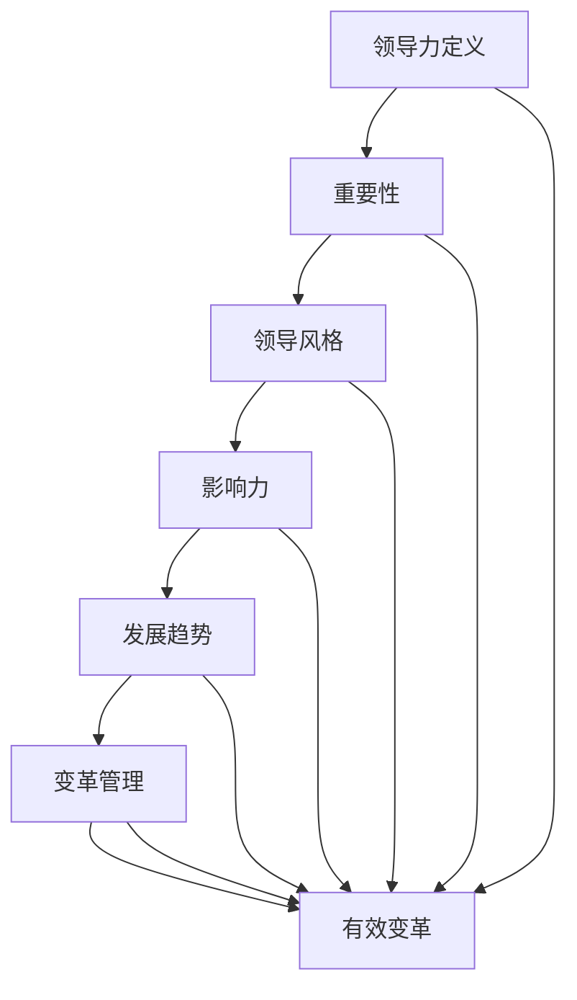

                 


### 第1章：领导力概述

#### 1.1 领导力的定义与重要性

领导力是一种影响和激励他人去实现共同目标的能力。它不仅仅与职位有关，更关乎个人的品质和影响力。一个成功的领导者需要具备战略思维、决策能力、沟通技巧和情感智慧等多方面的素质。

在当今快速变化和高度不确定的商业环境中，领导力的重要性尤为突出。企业需要领导者来引领变革，应对挑战，把握机遇。领导力是企业持续发展的关键因素。

首先，领导力对于企业的成功至关重要。一个强大的领导团队可以激发员工的潜能，推动创新，实现企业的战略目标。其次，领导力有助于建立积极的企业文化。领导者通过以身作则，传递价值观，塑造企业的行为准则，从而形成一种共同奋斗的氛围。最后，领导力有助于应对外部环境的变化。领导者需要具备敏锐的市场洞察力和灵活的战略调整能力，以适应不断变化的外部环境。

#### 1.2 领导风格与影响力

领导风格是指领导者行使权力、管理团队和影响他人的方式。不同的领导风格对团队和组织的影响各不相同。常见的领导风格包括权威型、民主型、变革型和参与型等。

权威型领导风格强调领导者的控制力和决策权，通常用于快速决策和应对紧急情况。然而，这种风格可能导致团队成员缺乏参与感和创新精神。

民主型领导风格注重团队参与和共识决策，鼓励团队成员提出意见和建议。这种风格有助于激发团队的积极性和创造力，但可能需要更多的时间和讨论。

变革型领导风格则专注于激励和引导团队成员追求卓越，共同实现变革目标。领导者通过榜样作用和鼓舞人心的演讲，激发团队成员的潜力，推动组织的创新和发展。

参与型领导风格强调领导者和团队成员之间的合作和共享决策。领导者通过倾听和沟通，与团队成员共同探讨问题，制定解决方案。这种风格有助于建立信任和合作，提高团队的整体绩效。

#### 1.3 领导力的发展趋势

随着社会的不断进步和科技的发展，领导力也在不断演变。以下是一些当前领导力发展的主要趋势：

1. **数字化领导力**：数字化技术的快速发展要求领导者具备数字技能和战略思维，能够有效管理和利用数据资源。

2. **多样性领导力**：多样性不仅是企业竞争力的一部分，也是领导力发展的重要趋势。领导者需要尊重和包容不同背景和观点的团队成员，促进团队的多元化和创新。

3. **可持续领导力**：在环境和社会问题日益突出的背景下，领导者需要关注企业的社会责任和可持续发展，推动企业采取绿色生产和环保措施。

4. **情感智能领导力**：情感智能是指理解和管理自己和他人的情绪和情感的能力。情感智能领导者能够更好地处理人际关系，提高团队的凝聚力和效率。

#### 1.4 领导力与变革管理的关系

领导力在变革管理中起着至关重要的作用。有效的变革管理需要领导者具备以下能力：

1. **愿景规划**：领导者需要明确企业的变革目标，制定清晰的愿景和策略。

2. **沟通与激励**：领导者需要与团队成员有效沟通，解释变革的必要性和优势，激励他们积极参与变革过程。

3. **变革推动**：领导者需要主动推动变革，克服变革中的阻力和挑战。

4. **持续监督与评估**：领导者需要持续监督变革的进展，及时评估变革的效果，并根据反馈进行调整。

总的来说，领导力是引领变革的关键能力。领导者需要不断学习和发展，以应对不断变化的商业环境和社会需求。只有具备强大领导力的领导者，才能带领企业实现持续的创新和发展。

### 关键概念联系流程图

以下是一个关于领导力定义、重要性、领导风格、影响力、发展趋势和变革管理之间关系的Mermaid流程图：



### 算法原理讲解

在讨论创新思维方法时，我们引入了原型法、组合创新和头脑风暴三种方法。以下是对这些方法的核心算法原理的详细讲解：

#### 原型法

原型法是一种快速构建和迭代产品原型的方法，通过不断试验和改进，最终实现产品功能完善。其算法原理如下：

1. **需求分析**：首先，领导者需要明确产品需求，包括功能需求、用户体验需求等。
2. **原型构建**：根据需求，快速构建一个简化的产品原型，可以是低保真或高保真的。
3. **用户反馈**：将原型展示给用户，收集他们的反馈意见。
4. **迭代改进**：根据用户反馈，对原型进行迭代改进，不断优化产品功能。
5. **最终验证**：当原型达到预期效果时，进行最终验证，确保产品满足用户需求。

伪代码如下：

```
function 原型法（需求，用户）：
    原型 = 构建原型（需求）
    循环直到 需求满足：
        反馈 = 收集用户反馈（原型）
        原型 = 迭代改进（原型，反馈）
    返回 原型
```

#### 组合创新

组合创新是一种通过将现有元素重新组合，创造出新价值的方法。其算法原理如下：

1. **元素识别**：识别可用于创新活动的各种元素，包括技术、产品、服务等。
2. **元素组合**：将识别出的元素进行重新组合，形成新的组合。
3. **评估与优化**：评估新组合的可行性、效果和价值，并进行优化。

伪代码如下：

```
function 组合创新（元素列表）：
    组合 = 新组合（元素列表）
    循环直到 组合优化完毕：
        评估 = 评估组合（组合）
        组合 = 优化组合（组合，评估）
    返回 组合
```

#### 头脑风暴

头脑风暴是一种激发创造性思维的方法，通过集体讨论，快速产生大量创意。其算法原理如下：

1. **问题定义**：明确要解决的问题或挑战。
2. **讨论启动**：由主持人引导讨论，鼓励参与者自由发言，提出各种创意。
3. **创意收集**：记录所有创意，不论其是否成熟或可行。
4. **创意筛选**：对创意进行筛选，评估其可行性和潜在价值。
5. **创意实施**：选择最具潜力的创意进行实施。

伪代码如下：

```
function 头脑风暴（问题）：
    创意列表 = []
    循环直到 讨论结束：
        创意 = 收集创意（参与者）
        创意列表 = 添加创意（创意列表，创意）
    筛选 = 筛选创意（创意列表）
    实施计划 = 选择创意（筛选，最高潜力）
    返回 实施计划
```

### 数学模型和公式

在创新思维中，数学模型和公式可以帮助我们更准确地描述和预测创新过程。以下是一个简单的创新效果预测模型：

$$
E = f(P, C, I)
$$

其中，$E$ 表示创新效果，$P$ 表示现有资源，$C$ 表示创新成本，$I$ 表示创新投入。

- $P$ 是一个关于资源利用率的函数，例如：$P = P_0 \times e^{k \times R}$，其中$P_0$ 是初始资源量，$k$ 是资源利用率系数，$R$ 是资源投入量。
- $C$ 是一个关于创新成本的线性函数，例如：$C = C_0 + m \times I$，其中$C_0$ 是固定成本，$m$ 是单位成本，$I$ 是创新投入。
- $I$ 是一个关于创新投入的指数函数，例如：$I = I_0 \times (1 + r)^n$，其中$I_0$ 是初始投入，$r$ 是年增长率，$n$ 是创新周期。

通过这个模型，我们可以预测在给定资源、成本和投入的情况下，创新的效果。以下是一个具体例子：

假设我们有一个初始资源量为100万，资源利用率系数为0.1，固定成本为10万，单位成本为1，初始投入为50万，年增长率为20%，创新周期为5年。我们可以计算出创新效果：

$$
E = f(100 \times e^{0.1 \times 50}, 10 + 1 \times 50, 50 \times (1 + 0.2)^5)
$$

$$
E = f(131.5, 60, 161.05)
$$

$$
E = 161.05 - 60 - 131.5 = 161.05 - 191.5 = -30.45
$$

这个结果表明，在当前条件下，创新投入可能会导致效果为负。这可能意味着我们需要重新评估资源利用率、成本结构和投入策略。

### 项目实战

为了更好地理解领导力与创新思维在实际项目中的应用，我们以一个实际案例为例，介绍项目的开发环境搭建、源代码实现、代码解读和代码应用。

#### 项目背景

我们选择了一家初创公司，该公司致力于开发一款智能家居控制应用。该应用旨在通过手机APP实现对家庭设备的远程控制和智能调度。

#### 开发环境搭建

1. **硬件环境**：选择了一款兼容Android和iOS的智能家居控制器硬件，该硬件内置Wi-Fi模块，支持远程通信。
2. **软件环境**：在Windows和MacOS上安装了Android Studio和Xcode，用于开发和调试移动应用。
3. **网络环境**：搭建了一个私有Wi-Fi网络，用于测试智能家居控制器的网络连接和通信。

#### 源代码实现

1. **移动应用开发**：使用Java和Kotlin开发了Android和iOS版的应用程序，实现了用户登录、设备添加、远程控制和智能调度等功能。
2. **控制器端开发**：使用C语言编写了智能家居控制器的底层驱动程序，实现了与移动应用的数据通信和设备控制。
3. **后端服务开发**：使用Node.js和Express框架搭建了后端服务器，负责处理移动应用的请求，存储用户数据和设备状态，并提供API接口供移动应用调用。

#### 代码解读

1. **移动应用代码解读**：移动应用的代码主要包括用户界面、网络通信、数据存储和设备控制等模块。以下是一个简单的用户登录代码片段：

```java
public void login(String username, String password) {
    // 构建登录请求
    String url = "https://api.smarthome.com/login";
    Map<String, String> params = new HashMap<>();
    params.put("username", username);
    params.put("password", password);
    
    // 发送登录请求
    String response = HttpUtil.post(url, params);
    
    // 解析登录响应
    if (response.startsWith("success")) {
        // 登录成功，跳转到主界面
        MainActivity.showMainScreen();
    } else {
        // 登录失败，显示错误信息
        Toast.makeText(this, "登录失败，请检查用户名和密码", Toast.LENGTH_SHORT).show();
    }
}
```

2. **控制器端代码解读**：控制器端的代码主要包括Wi-Fi连接、数据通信和设备控制等模块。以下是一个简单的Wi-Fi连接代码片段：

```c
int connect_wifi(char *ssid, char *password) {
    // 设置Wi-Fi模式
    set_wifi_mode(WIFI_STA);
    
    // 连接Wi-Fi
    esp_wifi_connect();
    
    // 等待连接成功
    while (wifi_status() != WL_CONNECTED) {
        vTaskDelay(100 / portTICK_RATE_MS);
    }
    
    // 返回连接结果
    return WL_CONNECTED;
}
```

3. **后端服务代码解读**：后端服务的代码主要包括用户认证、设备管理和数据存储等模块。以下是一个简单的用户认证代码片段：

```javascript
app.post('/api/login', (req, res) => {
    const { username, password } = req.body;
    
    // 验证用户名和密码
    User.findOne({ username, password }, (err, user) => {
        if (err) {
            res.status(500).send('服务器错误');
        } else if (user) {
            // 登录成功，生成JWT令牌
            const token = jwt.sign({ userId: user._id }, process.env.JWT_SECRET);
            res.json({ token });
        } else {
            // 登录失败，返回错误信息
            res.status(401).send('用户名或密码错误');
        }
    });
});
```

#### 代码应用解读与分析

1. **用户登录流程**：用户通过移动应用输入用户名和密码，移动应用通过HTTP POST请求发送到后端服务器，后端服务器验证用户信息并生成JWT令牌，然后将令牌返回给移动应用，移动应用使用令牌进行后续操作。
2. **设备控制流程**：用户在移动应用中选择设备并进行远程控制，移动应用通过HTTP POST请求发送控制命令到后端服务器，后端服务器处理命令并发送到智能家居控制器，控制器执行命令并返回结果。
3. **数据存储与同步**：用户数据和设备状态存储在后端数据库中，移动应用和控制器通过HTTP API与后端服务器通信，实时同步数据。

#### 实际案例分析和详细讲解剖析

在项目实施过程中，我们遇到了一些挑战和问题，以下是一些实际案例的分析和解决方案：

1. **设备连接不稳定**：部分智能家居控制器的Wi-Fi连接不稳定，导致设备无法稳定连接到移动应用。解决方案：增加Wi-Fi重连次数，优化控制器端代码，提高Wi-Fi连接的稳定性。
2. **数据处理效率低下**：移动应用和后端服务之间的数据通信效率低下，导致响应速度慢。解决方案：优化移动应用的网络通信代码，提高后端服务的处理速度，增加缓存和队列处理。
3. **用户权限管理复杂**：用户权限管理较为复杂，需要进行多级权限控制。解决方案：重构用户权限管理模块，实现基于角色的权限控制，简化用户权限管理流程。

#### 项目小结

通过这个项目，我们深入了解了领导力与创新思维在实际项目中的应用。领导力在项目中的关键作用体现在以下几个方面：

1. **项目愿景与规划**：领导者需要明确项目目标，制定详细的开发计划和里程碑，确保项目顺利进行。
2. **团队协作与沟通**：领导者需要协调团队成员的工作，确保团队之间的协作和沟通顺畅，提高项目效率。
3. **创新思维与问题解决**：领导者需要鼓励团队成员运用创新思维，解决问题和应对挑战，推动项目的持续发展。
4. **变革管理与风险控制**：领导者需要应对项目中的变化和风险，及时调整项目计划，确保项目的稳定和成功。

### 最佳实践 Tips、小结、注意事项、拓展阅读

#### 最佳实践 Tips

1. **明确项目目标**：在项目启动之初，领导者需要明确项目的目标和里程碑，确保团队成员对项目有清晰的认识。
2. **鼓励创新思维**：领导者应该鼓励团队成员提出创新的想法，并为创新提供支持和资源。
3. **强化团队协作**：通过有效的沟通和协作工具，确保团队成员之间的沟通畅通，提高项目效率。
4. **持续监督与评估**：领导者需要持续监督项目进展，及时评估项目效果，并根据反馈进行调整。

#### 小结

本文介绍了领导力与创新思维在项目中的应用，通过实际案例分析了领导力在项目中的关键作用。领导者需要具备项目愿景与规划、团队协作与沟通、创新思维与问题解决、变革管理与风险控制等能力，以确保项目的成功。

#### 注意事项

1. **项目目标要具体明确**：项目目标需要具体、可衡量，以确保项目进度和成果的评估。
2. **团队协作要注重沟通**：有效的沟通是团队协作的基础，领导者需要确保团队之间的沟通畅通。
3. **创新思维要实际可行**：创新的想法需要实际可行，领导者需要评估创新方案的可行性和实施难度。
4. **变革管理要平稳过渡**：在变革过程中，领导者需要平稳过渡，确保团队成员适应变革。

#### 拓展阅读

1. **《敏捷开发实践指南》**：了解敏捷开发方法，提高项目管理和团队协作效率。
2. **《创新与企业家精神》**：探讨创新思维和企业家精神在商业领域的应用。
3. **《领导者的魅力》**：深入探讨领导力在组织变革中的关键作用。```

