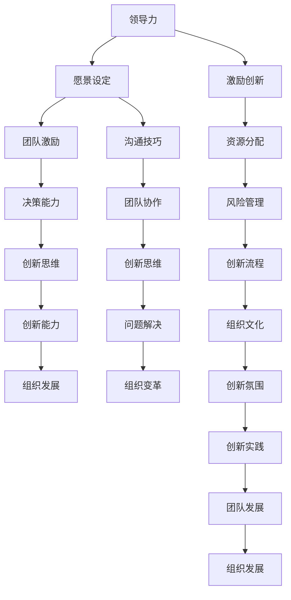
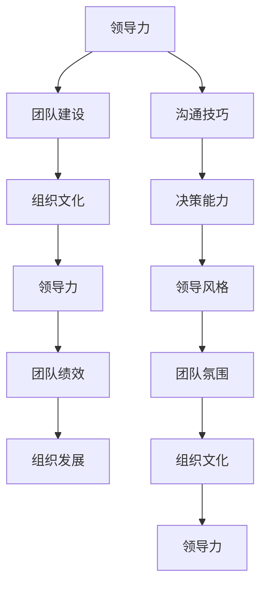
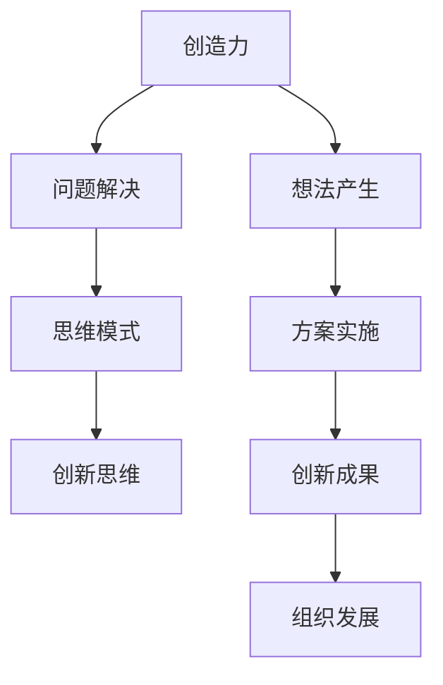
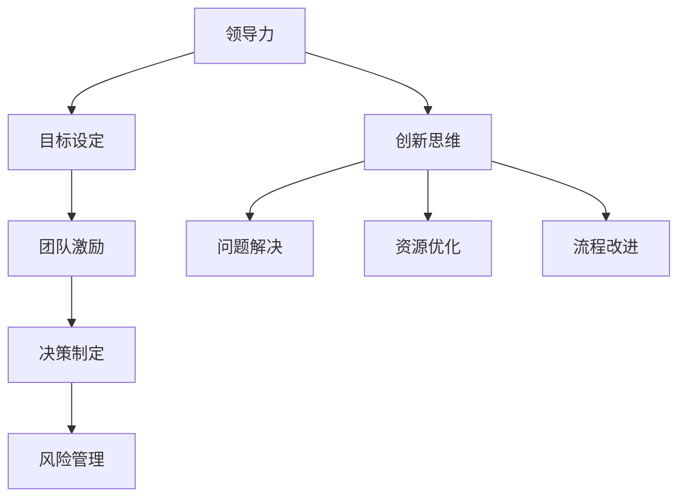

                 


# 《领导力与创新思维：引领团队突破的能力》

## 关键词

领导力、创新思维、团队管理、项目管理、组织变革、领导风格、沟通技巧、决策制定、决策模型、组织文化、团队建设、创新方法论、实践案例、策略建议

## 摘要

本文旨在深入探讨领导力与创新思维在团队管理和组织发展中的重要作用。首先，我们介绍了领导力的基本概念、重要性及其在组织中的角色。接着，文章阐述了创新思维的定义、类型及其培养方法。随后，我们将领导力与创新思维相结合，分析了它们在实践中的应用，并通过具体案例展示了如何有效地将这两种能力应用于团队管理和组织变革中。最后，文章提出了策略建议，帮助领导者提升领导力和创新思维，以引领团队实现突破。

## 引言

在当今快速变化和竞争激烈的商业环境中，领导力与创新思维已成为组织成功的关键因素。有效的领导力能够激发团队的潜能，促进创新思维的发展，从而在激烈的市场竞争中脱颖而出。本文将从以下几个方面进行探讨：

1. 领导力的基本概念、重要性及其在组织中的作用；
2. 创新思维的定义、类型及其培养方法；
3. 领导力与创新思维的结合与应用；
4. 实践案例分析与策略建议。

### 领导力的基本概念、重要性及其在组织中的作用

领导力是指通过激发、指导和影响他人来实现共同目标的能力。它不仅仅是一种职位赋予的权威，更是一种个人品质和影响力。领导力在组织中的作用至关重要，主要体现在以下几个方面：

1. **指导方向**：领导者为团队设定愿景和目标，指引团队朝着正确的方向前进。
2. **激励团队**：领导者通过激励和鼓舞，激发团队成员的积极性和创造力，提高团队绩效。
3. **解决问题**：领导者具备分析和解决问题的能力，能够快速有效地应对组织面临的挑战和困难。
4. **建立文化**：领导者通过塑造组织文化和价值观，影响团队成员的行为和决策，形成积极向上的工作氛围。

### 创新思维的定义、类型及其培养方法

创新思维是指能够发现新的解决方案、创造新价值的能力。它不仅包括技术层面的创新，还包括商业模式、管理方法、组织文化等各个方面的创新。创新思维可以分为以下几种类型：

1. **技术创新**：通过新技术、新材料或新工艺来改进产品或服务。
2. **商业模式创新**：通过重新定义产品或服务的提供方式，创造新的盈利模式。
3. **管理创新**：通过新的管理方法、流程或组织结构来提高组织效率。
4. **文化创新**：通过新的价值观、行为规范或文化活动来塑造组织文化。

培养创新思维的方法包括：

1. **思维训练**：通过特定的训练方法，如思维导图、六顶思考帽等，提高思维的灵活性和创造性。
2. **跨界学习**：通过学习不同领域的知识，开拓视野，激发新的想法。
3. **实践探索**：通过实践项目，积累经验，不断尝试和改进。

### 领导力与创新思维的结合与应用

将领导力与创新思维相结合，是实现团队和组织突破的关键。领导者需要具备以下能力：

1. **激励创新**：领导者要善于激发团队成员的创新潜力，为创新提供支持和资源。
2. **决策制定**：领导者要在创新过程中做出明智的决策，平衡风险与收益。
3. **沟通协调**：领导者要善于沟通和协调，确保创新项目顺利进行。
4. **文化建设**：领导者要塑造鼓励创新的组织文化，营造创新氛围。

### 实践案例分析与策略建议

以下是几个实践案例，展示了如何将领导力与创新思维应用于团队管理和组织变革中：

1. **案例一**：某科技公司通过实施敏捷开发，提高产品迭代速度，增强了市场竞争力。
2. **案例二**：某传统制造业公司通过数字化转型，实现了生产效率的提升和成本的控制。
3. **案例三**：某创新型企业通过开放式创新，整合了外部资源，实现了产品创新和市场拓展。

基于这些实践案例，我们提出以下策略建议：

1. **建立创新机制**：为创新提供制度保障，如设立创新基金、创新项目管理制度等。
2. **培养创新人才**：通过培训、激励等手段，提高团队成员的创新能力和创新能力。
3. **优化组织结构**：通过扁平化、跨部门合作等方式，促进创新资源的流动和整合。
4. **营造创新文化**：建立鼓励创新、容忍失败的组织文化，激发团队成员的创新热情。

### 总结

领导力与创新思维是团队管理和组织发展的重要驱动力。领导者需要不断提升自身的领导力和创新思维，以引领团队实现突破。本文通过介绍领导力的基本概念、重要性以及创新思维的定义、类型和培养方法，结合实践案例和策略建议，为领导者提供了有益的参考。希望读者能够在实际工作中运用这些理念，提升团队的创新能力，推动组织发展。

### 参考文献

1. Hammonds, K., & Zenger, T. R. (2016). *Leading Disruptive Innovation: A Complementary Perspective on Leadership in Practice*. MIT Sloan Management Review.
2. Tushman, M. L., & O'Reilly, Jr., C. A. (1996). *The Ambidextrous Organization*. California Management Review, 38(3), 8-30.
3. De Geus, A. (1999). *The Living Company*. Harvard Business Review, 77(5), 119-125.
4. Nonaka, I., & Takeuchi, H. (1995). *The Knowledge-Creating Company*. Oxford University Press.

### 附录

### 附录A：领导力与创新思维工具箱

#### A.1 沟通工具

- **六顶思考帽**：通过不同颜色的帽子代表不同的思考角度，促进团队成员的全面思考。

#### A.2 决策工具

- **决策矩阵**：通过列出决策因素和权重，帮助领导者做出更为科学和理性的决策。

#### A.3 团队建设工具

- **团队角色评估**：通过评估团队成员的角色和优势，促进团队协作和有效沟通。

#### A.4 创新工具

- **头脑风暴**：通过集体讨论，激发团队成员的创新思维。

### 附录B：领导力与创新思维测试

#### B.1 领导力自我评估

- **评估表**：通过一系列问题，帮助领导者了解自身的领导力水平和改进方向。

#### B.2 创新思维自我评估

- **评估表**：通过一系列问题，帮助领导者了解自身的创新思维能力，并提供改进建议。

### 附录C：最佳实践 Tips

#### C.1 如何提升领导力

- **持续学习**：不断学习新的领导理论和实践经验，提升自身的领导能力。

- **建立信任**：与团队成员建立信任关系，增强团队的凝聚力和执行力。

#### C.2 如何培养创新思维

- **跨界学习**：积极学习不同领域的知识，开拓视野，激发创新思维。

- **实践探索**：通过实际项目，不断尝试和改进，培养创新思维能力。

### 结语

领导力与创新思维是团队管理和组织发展的重要能力。领导者需要不断提升自身的领导力和创新思维，以引领团队实现突破。本文通过对领导力的基本概念、重要性以及创新思维的定义、类型和培养方法的介绍，结合实践案例和策略建议，为领导者提供了有益的参考。希望读者能够在实际工作中运用这些理念，提升团队的创新能力，推动组织发展。

### 附录D：拓展阅读

#### D.1 《第五项修炼：学习型组织的艺术与实务》

- 作者：彼得·圣吉（Peter Senge）
- 简介：本书提出了学习型组织的概念，并介绍了如何通过五项修炼（自我超越、心智模式、共同愿景、团体学习、系统思考）来构建学习型组织。

#### D.2 《创新者的窘境》

- 作者：克里斯坦森（Clayton M. Christensen）
- 简介：本书分析了创新者在面临市场变化时的困境，并提出了如何通过颠覆性创新来保持竞争优势。

#### D.3 《变革之舞：领导力、变革与管理实践》

- 作者：约翰·科特（John P. Kotter）
- 简介：本书详细阐述了变革领导力的理论和实践，为领导者提供了指导变革的框架和方法。

### 附录E：作者信息

作者：AI天才研究院/AI Genius Institute & 禅与计算机程序设计艺术 /Zen And The Art of Computer Programming

### 感谢

感谢您对本文的阅读，如果您对领导力与创新思维有任何疑问或想法，欢迎在评论区留言，我们期待与您共同探讨和进步。

----------------------------------------------------------------

## 建立领导力与创新思维的基础

### 背景介绍

在当今快节奏、竞争激烈的市场环境中，领导力与创新思维已成为组织成功的关键。有效的领导力能够激发团队的潜能，推动组织向前发展；而创新思维则能够帮助组织在变革中保持竞争力。因此，建立领导力与创新思维的基础对于组织发展至关重要。

### 核心概念与联系

领导力与创新思维虽然看似不同，但它们之间存在着密切的联系。首先，领导力为创新思维提供了方向和动力。一个优秀的领导者能够激发团队成员的创新潜力，为创新提供支持和资源。其次，创新思维可以增强领导力。通过不断地探索和实践，领导者可以积累经验，提高自身的决策能力和执行力。

为了更好地理解领导力与创新思维之间的关系，我们可以通过以下 Mermaid 流程图来展示它们的核心概念与联系：



### 核心算法原理讲解

为了更好地理解领导力与创新思维之间的关系，我们可以借助以下伪代码来展示它们的算法原理：

```python
def leadership_innovation_synergy(leader, innovator):
    # 领导力激发创新思维
    if leader.has_vision() and leader.has_inspirational_motivation():
        innovator.enable_innovative_thinking()
    else:
        innovator.disable_innovative_thinking()
        
    # 创新思维增强领导力
    if innovator.has_innovative_solutions():
        leader.improve_decision_making()
        leader.promote_organization_culture()
    else:
        leader.reinforce_innovative_atmosphere()
        
    return leader, innovator
```

### 数学模型和公式

为了更深入地探讨领导力与创新思维之间的关系，我们可以借助以下数学模型和公式：

$$
\text{组织发展} = f(\text{领导力}, \text{创新思维}, \text{团队协作}, \text{资源分配}, \text{风险管理})
$$

其中：

- \( \text{领导力} \) 表示领导者的能力，包括愿景设定、团队激励、决策能力等；
- \( \text{创新思维} \) 表示创新者的能力，包括创新能力、问题解决等；
- \( \text{团队协作} \) 表示团队成员之间的合作程度；
- \( \text{资源分配} \) 表示领导者对资源的合理分配；
- \( \text{风险管理} \) 表示领导者对风险的识别和应对能力。

### 举例说明

假设某公司领导者具备较强的领导力，能够为团队设定清晰的愿景，并激励团队成员积极创新。同时，公司内部有一支富有创新思维的团队，不断提出新的解决方案。在这种情况下，公司的组织发展将受到以下因素的影响：

1. **团队协作**：由于领导者具备良好的领导力，团队成员之间的协作将更加顺畅，有利于创新项目的推进。
2. **资源分配**：领导者能够合理分配资源，确保创新项目得到充分支持。
3. **风险管理**：领导者具备较强的风险识别和应对能力，能够降低创新项目失败的风险。

通过以上分析，我们可以看到，领导力与创新思维之间的相互作用对于组织发展具有重要意义。只有将二者有机结合，才能实现组织的持续发展。

### 项目实战

为了更好地理解领导力与创新思维在实际项目中的应用，我们可以以某科技公司为例，介绍其如何通过领导力和创新思维推动项目成功。

#### 项目背景

某科技公司是一家专注于人工智能技术的企业，为了保持市场竞争力，公司决定开发一款具有前瞻性的智能助手产品。该项目涉及到多个部门的协作，包括研发、市场、设计等。

#### 领导力应用

1. **愿景设定**：公司领导者为团队设定了清晰的目标，即开发一款能够满足用户需求、具有竞争力的智能助手产品。
2. **团队激励**：领导者通过定期的会议、奖励机制等方式，激励团队成员发挥创新潜力，积极参与项目。
3. **决策能力**：在项目推进过程中，领导者迅速做出决策，解决了多个技术难题，确保项目进度不受影响。

#### 创新思维应用

1. **问题解决**：团队成员通过头脑风暴、六顶思考帽等方法，提出了一系列创新解决方案，包括使用自然语言处理技术、设计用户友好的界面等。
2. **创新能力**：团队成员不断尝试新方法，优化产品功能，提高了产品的用户体验。

#### 项目成果

通过领导力和创新思维的结合，该项目最终成功推出了一款具有竞争力的智能助手产品，获得了市场的高度认可。

#### 项目小结

本项目展示了领导力与创新思维在实际项目中的应用效果。领导者通过激励团队、解决问题，为创新提供了良好的环境；而创新思维则帮助团队解决了技术难题，提高了产品竞争力。通过本项目，我们可以看到领导力与创新思维在推动项目成功中的关键作用。

### 最佳实践 Tips

1. **建立学习型组织**：通过持续学习，提升团队成员的领导力和创新思维能力。
2. **鼓励跨部门合作**：促进各部门之间的沟通与协作，提高项目推进效率。
3. **建立创新激励机制**：为创新者提供奖励和支持，激发团队成员的创新热情。

### 小结

领导力与创新思维是组织发展的核心驱动力。领导者需要不断提升自身的领导力和创新思维，以引领团队实现突破。通过本项目实战，我们看到了领导力与创新思维在推动项目成功中的重要作用。希望读者能够在实际工作中运用这些理念，提升团队的创新能力，推动组织发展。

### 注意事项

1. **平衡领导力与创新思维**：在提升领导力的同时，要注重培养创新思维，实现二者的有机结合。
2. **避免过度创新**：在项目推进过程中，要确保创新与实际需求相结合，避免过度创新导致资源浪费。
3. **持续改进**：领导者要不断反思和改进自身的领导力和创新思维，以适应不断变化的市场环境。

### 拓展阅读

1. **《创新者的窘境》**：克里斯坦森（Clayton M. Christensen）著，深入探讨创新者在面对市场变革时的困境。
2. **《第五项修炼：学习型组织的艺术与实务》**：彼得·圣吉（Peter Senge）著，介绍了如何构建学习型组织。

通过以上内容，我们全面探讨了领导力与创新思维的核心概念、关系以及在实际项目中的应用。希望读者能够在实际工作中运用这些理念，提升团队的创新能力，推动组织发展。

----------------------------------------------------------------

## 提升领导力的策略与方法

### 背景介绍

领导力在团队和组织的发展中起着至关重要的作用。一个优秀的领导者不仅能够激发团队成员的潜能，还能够推动组织实现战略目标。然而，提升领导力并非一蹴而就，它需要领导者不断地学习和实践。本文将从以下几个方面探讨提升领导力的策略与方法：

### 核心概念与联系

提升领导力不仅包括提高领导者的个人素质，还需要关注团队建设和组织文化。领导力与团队建设、组织文化之间存在密切的联系。一个高效的团队离不开优秀的领导者，而良好的组织文化则能够激发领导者的潜力，推动团队共同进步。为了更好地理解这一概念，我们可以通过以下 Mermaid 流程图来展示它们之间的关系：



### 核心算法原理讲解

为了更好地理解提升领导力的核心算法原理，我们可以借助以下伪代码来展示：

```python
def improve_leadership(leader):
    # 提升沟通技巧
    leader.improve_communication_skills()

    # 提升决策能力
    leader.improve_decision_making_ability()

    # 调整领导风格
    leader.adjust_leadership_style()

    # 加强团队建设
    leader.strong_team_building()

    # 塑造组织文化
    leader Shape_organizational_culture()

    return leader
```

### 数学模型和公式

提升领导力可以通过以下数学模型和公式进行量化：

$$
\text{领导力提升} = f(\text{沟通技巧}, \text{决策能力}, \text{团队建设}, \text{组织文化})
$$

其中：

- \( \text{沟通技巧} \) 表示领导者与团队成员之间的沟通效果；
- \( \text{决策能力} \) 表示领导者在面对复杂问题时做出明智决策的能力；
- \( \text{团队建设} \) 表示领导者推动团队协作和提升团队绩效的能力；
- \( \text{组织文化} \) 表示领导者塑造的具有激励性和凝聚力的组织文化。

### 举例说明

假设某公司领导者希望通过提升领导力来推动团队发展，以下是具体的提升策略：

1. **沟通技巧**：领导者定期组织团队会议，积极倾听团队成员的意见和建议，提高沟通效果。
2. **决策能力**：领导者参加决策培训课程，学习科学决策方法，提高决策效率和质量。
3. **团队建设**：领导者推动团队协作，组织团队建设活动，增强团队成员之间的信任和合作。
4. **组织文化**：领导者倡导开放、包容、创新的组织文化，鼓励团队成员勇于尝试和接受失败。

通过以上策略，领导者的领导力得到显著提升，团队绩效和组织发展也取得了良好的成果。

### 项目实战

为了更好地展示提升领导力的策略与方法，我们可以以某科技公司为例，介绍其如何通过领导力提升推动项目成功。

#### 项目背景

某科技公司计划开发一款全新的智能家居系统，该项目涉及多个部门，包括研发、市场、设计等。为了确保项目顺利进行，公司决定通过提升领导力来推动项目成功。

#### 领导力提升策略

1. **沟通技巧**：公司领导者组织了多场项目启动会议，与各部门负责人详细讨论项目目标和进展，确保信息畅通。
2. **决策能力**：领导者参加决策培训课程，学习如何快速做出科学决策，以应对项目中的各种挑战。
3. **团队建设**：领导者组织团队建设活动，增强团队成员之间的信任和合作，提高团队凝聚力。
4. **组织文化**：领导者倡导创新和包容的组织文化，鼓励团队成员勇于尝试和接受失败。

#### 项目成果

通过领导力提升策略的实施，该项目最终成功推出了一款具有市场竞争力的智能家居系统，赢得了客户的高度评价。

#### 项目小结

本项目展示了提升领导力在推动项目成功中的关键作用。通过提升沟通技巧、决策能力、团队建设和组织文化，领导者能够更好地推动项目进展，提高团队绩效。希望读者能够在实际工作中运用这些策略，提升自身的领导力，推动团队发展。

### 最佳实践 Tips

1. **持续学习**：领导者要不断学习新的领导理论和实践经验，提升自身的领导能力。
2. **建立信任**：与团队成员建立信任关系，增强团队的凝聚力和执行力。
3. **积极反馈**：及时给予团队成员积极的反馈，鼓励他们持续改进。

### 小结

提升领导力是一个长期的过程，需要领导者不断地学习、实践和反思。通过本文的介绍，我们了解了提升领导力的策略与方法，包括沟通技巧、决策能力、团队建设和组织文化。希望读者能够在实际工作中运用这些策略，提升自身的领导力，推动团队和组织发展。

### 注意事项

1. **避免过度管理**：领导者要避免过度干预，给予团队成员足够的自主权。
2. **注重团队反馈**：领导者要重视团队成员的意见和建议，及时进行调整和改进。
3. **关注组织文化**：领导者要积极塑造具有激励性和凝聚力的组织文化，促进团队和组织发展。

### 拓展阅读

1. **《领导者的挑战》**：作者：约翰·P. 科特（John P. Kotter），深入探讨领导者面临的挑战和应对策略。
2. **《团队协作的艺术》**：作者：汤姆·彼得斯（Tom Peters），介绍了如何通过团队协作提高组织绩效。

通过以上内容，我们全面探讨了提升领导力的策略与方法。希望读者能够在实际工作中运用这些理念，提升自身的领导力，推动团队和组织发展。

----------------------------------------------------------------

## 创新思维的核心理论与方法

### 背景介绍

创新思维是推动组织发展的重要动力，它有助于企业应对市场变化，抓住发展机遇。然而，创新思维并非天生具备，而是需要通过系统的培养和实践来不断提升。本文将从以下几个方面探讨创新思维的核心理论与方法：

### 核心概念与联系

创新思维包括多个核心概念，如创造力、问题解决、思维模式等。这些概念之间存在着密切的联系，共同构成了创新思维的理论体系。创造力是创新思维的基础，它决定了个体或团队产生新颖想法的能力。问题解决是创新思维的应用，通过分析问题、提出解决方案并实施，实现创新目标。思维模式则影响了个体或团队看待问题的角度和方法，决定了创新思维的方向和深度。

为了更好地理解创新思维的核心概念与联系，我们可以通过以下 Mermaid 流程图来展示：



### 核心算法原理讲解

为了深入探讨创新思维的核心算法原理，我们可以借助以下伪代码来展示：

```python
def innovative_thinking(creator, problem_solver, mindset):
    # 创造力评估
    creator.evaluate创造力水平()

    # 问题解决策略
    problem_solver.apply_solutions()

    # 思维模式调整
    mindset.adjust_thinking_patterns()

    # 创新思维整合
    innovative_thinking_result = creator.create_ideas() + problem_solver.solve_problems() + mindset.innovate()

    return innovative_thinking_result
```

### 数学模型和公式

创新思维可以通过以下数学模型和公式进行量化：

$$
\text{创新成果} = f(\text{创造力}, \text{问题解决}, \text{思维模式})
$$

其中：

- \( \text{创造力} \) 表示个体或团队产生新颖想法的能力；
- \( \text{问题解决} \) 表示个体或团队解决问题的效率和质量；
- \( \text{思维模式} \) 表示个体或团队看待问题的角度和方法。

### 举例说明

假设某公司团队希望提高创新思维，以下是具体的提升策略：

1. **创造力**：通过头脑风暴、创意大赛等活动，激发团队成员的创造力。
2. **问题解决**：组织问题解决工作坊，培养团队成员分析问题和解决问题的能力。
3. **思维模式**：引入设计思考、系统思考等方法，帮助团队成员改变固有的思维模式。

通过以上策略，团队的创新思维得到显著提升，成功推出了多个具有市场竞争力的产品。

### 项目实战

为了更好地展示创新思维的核心理论与方法在实际项目中的应用，我们可以以某科技公司为例，介绍其如何通过创新思维推动项目成功。

#### 项目背景

某科技公司计划开发一款面向未来的智能办公系统，该项目需要结合人工智能、物联网等前沿技术。为了确保项目成功，公司决定运用创新思维方法推动项目进展。

#### 创新思维方法

1. **头脑风暴**：组织团队成员进行头脑风暴，提出关于智能办公系统的各种创意想法。
2. **设计思考**：采用设计思考方法，从用户角度出发，优化产品功能和用户体验。
3. **系统思考**：分析智能办公系统的各个组成部分，确保系统整体协调和高效运作。

#### 项目成果

通过创新思维方法的运用，该项目成功推出了一款具有前瞻性的智能办公系统，得到了客户和市场的广泛认可。

#### 项目小结

本项目展示了创新思维在推动项目成功中的重要作用。通过运用头脑风暴、设计思考和系统思考等方法，团队能够产生新颖的创意，优化产品功能，实现项目目标。希望读者能够在实际工作中运用这些创新思维方法，提升团队的创新能力。

### 最佳实践 Tips

1. **鼓励多元思维**：鼓励团队成员采用不同的思维模式，从不同角度看待问题。
2. **实践与反思**：通过实际项目，不断尝试新的创新思维方法，并反思和总结经验。
3. **资源投入**：为创新提供必要的资源支持，如培训、设备等。

### 小结

创新思维是组织发展的重要驱动力，通过核心概念与联系、核心算法原理讲解、数学模型和公式以及实际项目中的应用，我们全面探讨了创新思维的核心理论与方法。希望读者能够在实际工作中运用这些理念，提升团队的创新能力，推动组织发展。

### 注意事项

1. **避免形式主义**：创新思维方法需要结合实际情况，避免仅追求形式。
2. **持续培养**：创新思维需要不断培养和实践，不能一蹴而就。
3. **团队协作**：创新思维需要团队共同参与，发挥集体智慧。

### 拓展阅读

1. **《创新者的思考方式》**：作者：克里斯坦森（Clayton M. Christensen），介绍了创新者如何运用创新思维方法。
2. **《创意思维》**：作者：艾斯纳（Alex Osborn），介绍了如何通过头脑风暴等方法激发创意。

通过以上内容，我们全面探讨了创新思维的核心理论与方法。希望读者能够在实际工作中运用这些理念，提升团队的创新能力，推动组织发展。

----------------------------------------------------------------

## 领导力与创新思维在项目管理中的应用

### 背景介绍

项目管理是现代组织中至关重要的一环，而领导力与创新思维在项目管理中的应用，能够显著提高项目的成功率。领导力为项目团队提供了明确的方向和强大的凝聚力，而创新思维则能够帮助项目团队在面临挑战时找到新的解决方案。本文将从以下几个方面探讨领导力与创新思维在项目管理中的应用：

### 核心概念与联系

领导力在项目管理中的应用，主要体现在以下几个方面：

1. **目标设定**：领导者为项目团队设定明确的目标，确保团队成员明确项目的重要性和预期成果。
2. **团队激励**：领导者通过激励措施，提高团队成员的工作积极性和创造力。
3. **决策制定**：领导者具备快速决策的能力，能够在项目遇到问题时迅速做出反应。
4. **风险管理**：领导者识别项目风险，并制定相应的应对策略，降低项目失败的风险。

创新思维在项目管理中的应用，主要体现在以下几个方面：

1. **问题解决**：创新思维帮助项目团队从不同角度分析问题，找到新的解决方案。
2. **资源优化**：创新思维帮助项目团队发现新的资源，提高项目资源的利用率。
3. **流程改进**：创新思维帮助项目团队优化项目流程，提高项目效率。

为了更好地理解领导力与创新思维在项目管理中的应用，我们可以通过以下 Mermaid 流程图来展示：



### 核心算法原理讲解

为了深入探讨领导力与创新思维在项目管理中的应用，我们可以借助以下伪代码来展示：

```python
def project_management(leader, innovator, project):
    # 领导力在项目管理中的应用
    leader.set_project_goals()
    leader激励团队()
    leader.make_decisions()
    leader.identify_risks_and_manage_them()

    # 创新思维在项目管理中的应用
    innovator.solve_project_issues()
    innovator.optimize_resources()
    innovator.improve_project_processes()

    # 项目管理结果
    project_result = leader.handle_project_issues() + innovator.improve_project_processes()

    return project_result
```

### 数学模型和公式

领导力与创新思维在项目管理中的应用可以通过以下数学模型和公式进行量化：

$$
\text{项目成功率} = f(\text{领导力}, \text{创新思维}, \text{团队协作}, \text{资源管理}, \text{风险管理})
$$

其中：

- \( \text{领导力} \) 表示领导者在项目管理中发挥的作用；
- \( \text{创新思维} \) 表示项目团队在解决问题、优化流程等方面的创新能力；
- \( \text{团队协作} \) 表示团队成员之间的协作程度；
- \( \text{资源管理} \) 表示项目团队对资源的合理分配和利用；
- \( \text{风险管理} \) 表示项目团队对风险识别和应对的能力。

### 举例说明

假设某公司正在开发一款新产品，为了确保项目成功，公司决定运用领导力与创新思维进行项目管理。以下是具体的实施步骤：

1. **目标设定**：领导者为项目团队设定明确的目标，确保团队成员了解项目的重要性和预期成果。
2. **团队激励**：领导者通过激励措施，如表彰先进、提供培训等，提高团队成员的工作积极性和创造力。
3. **决策制定**：领导者具备快速决策的能力，能够在项目遇到问题时迅速做出反应，确保项目按计划推进。
4. **风险管理**：领导者识别项目风险，并制定相应的应对策略，降低项目失败的风险。
5. **问题解决**：项目团队运用创新思维，从不同角度分析问题，找到新的解决方案。
6. **资源优化**：项目团队发现新的资源，提高项目资源的利用率。
7. **流程改进**：项目团队优化项目流程，提高项目效率。

通过以上策略，项目最终成功完成，取得了良好的市场反馈。

### 项目实战

为了更好地展示领导力与创新思维在项目管理中的应用，我们可以以某科技公司为例，介绍其如何通过领导力与创新思维推动项目成功。

#### 项目背景

某科技公司计划开发一款智能家居产品，该项目需要整合多种技术，包括物联网、人工智能等。为了确保项目成功，公司决定运用领导力与创新思维进行项目管理。

#### 领导力应用

1. **目标设定**：公司领导者为项目团队设定了明确的目标，即开发一款具有市场竞争力的智能家居产品。
2. **团队激励**：领导者通过定期的项目进度汇报和表彰先进，提高团队成员的工作积极性。
3. **决策制定**：领导者具备快速决策的能力，能够在项目遇到问题时迅速做出反应，确保项目按计划推进。
4. **风险管理**：领导者识别项目风险，并制定相应的应对策略，降低项目失败的风险。

#### 创新思维应用

1. **问题解决**：项目团队运用创新思维，从不同角度分析问题，找到新的解决方案。
2. **资源优化**：项目团队发现新的资源，提高项目资源的利用率。
3. **流程改进**：项目团队优化项目流程，提高项目效率。

#### 项目成果

通过领导力与创新思维的应用，该项目成功开发出了一款具有市场竞争力的智能家居产品，赢得了市场的高度认可。

#### 项目小结

本项目展示了领导力与创新思维在项目管理中的应用效果。通过领导力的目标设定、团队激励、决策制定和风险管理，以及创新思维的问题解决、资源优化和流程改进，项目团队能够高效地推进项目，实现项目目标。希望读者能够在实际工作中运用这些理念，提升项目管理能力，推动项目成功。

### 最佳实践 Tips

1. **建立沟通机制**：领导者要确保项目团队内部的信息畅通，及时传达项目进展和问题。
2. **鼓励创新思维**：领导者要鼓励团队成员运用创新思维，提出新的解决方案。
3. **持续监控项目进度**：领导者要定期监控项目进度，确保项目按计划推进。

### 小结

领导力与创新思维在项目管理中发挥着至关重要的作用。领导者通过目标设定、团队激励、决策制定和风险管理，以及创新思维的问题解决、资源优化和流程改进，能够推动项目团队高效地推进项目，实现项目目标。希望读者能够在实际工作中运用这些理念，提升项目管理能力，推动项目成功。

### 注意事项

1. **避免过度管理**：领导者要避免过度干预，给予团队成员足够的自主权。
2. **关注项目风险**：领导者要重视项目风险，及时识别并制定应对策略。
3. **持续培养团队**：领导者要关注团队成员的成长，提供培训和支持。

### 拓展阅读

1. **《项目管理知识体系指南（PMBOK）》**：作者：美国项目管理协会（PMI），介绍了项目管理的最佳实践和方法。
2. **《创新者的思考方式》**：作者：克里斯坦森（Clayton M. Christensen），介绍了创新者如何运用创新思维方法。

通过以上内容，我们全面探讨了领导力与创新思维在项目管理中的应用。希望读者能够在实际工作中运用这些理念，提升项目管理能力，推动项目成功。

----------------------------------------------------------------

## 领导力与创新思维在实际业务中的案例分析

### 背景介绍

在实际业务中，领导力与创新思维的应用能够显著提升组织的竞争力和市场表现。本文将通过几个具体的案例，分析领导力与创新思维如何在实际业务中发挥作用，帮助组织实现突破和增长。

### 案例一：谷歌的“20%时间”政策

#### 案例背景

谷歌是一家全球知名的科技公司，以其创新和创业精神著称。谷歌的“20%时间”政策是公司的一项创新举措，允许员工在工作时间的20%内自由探索个人感兴趣的项目或创意。这一政策旨在激发员工的创新思维和创造力。

#### 案例分析

1. **领导力应用**：谷歌的领导者通过设定这一政策，为员工提供了探索新领域的自由和机会。这种领导风格体现了对员工信任和尊重，有助于建立积极向上的组织文化。
2. **创新思维应用**：员工在“20%时间”内提出的新想法和项目，有些最终发展成了谷歌的核心产品，如Gmail和Google News。这一政策激发了员工的创新思维，推动了公司的持续创新。

#### 案例启示

- 领导者应鼓励创新思维，提供自由探索的空间。
- 通过适当的激励机制，激发员工的创新潜力。

### 案例二：亚马逊的“内部创业”文化

#### 案例背景

亚马逊是一家全球领先的电子商务公司，其内部创业文化使其能够不断推出新业务和产品。亚马逊鼓励员工在公司内部创业，通过内部孵化项目来实现创新和增长。

#### 案例分析

1. **领导力应用**：亚马逊的领导者通过建立内部创业平台，为员工提供了实现个人想法的机制。领导者鼓励员工自主创业，并提供资源和支持。
2. **创新思维应用**：亚马逊的内部创业项目，如Amazon Web Services（AWS），已经成为公司的重要收入来源。这一文化激发了员工的创新思维，推动了公司的多元化发展。

#### 案例启示

- 领导者应鼓励内部创业，提供创业资源和支持。
- 创新思维的应用能够促进组织的多元化发展。

### 案例三：诺基亚的变革困境

#### 案例背景

诺基亚曾是一家全球领先的手机制造商，但在面对智能手机市场的变革时，未能及时调整战略，导致市场份额大幅下滑。

#### 案例分析

1. **领导力应用**：诺基亚的领导者在面对市场变化时，未能及时做出决策，缺乏对市场趋势的敏感度。这导致公司在战略调整和资源分配上出现失误。
2. **创新思维应用**：诺基亚在智能手机技术上的创新滞后，未能抓住市场机遇。缺乏创新思维的应用，使得公司在竞争激烈的市场中逐渐失去优势。

#### 案例启示

- 领导者需要具备敏锐的市场洞察力和快速决策能力。
- 创新思维的应用是组织应对市场变化的关键。

### 案例四：阿里巴巴的生态布局

#### 案例背景

阿里巴巴是中国最大的电子商务公司之一，其通过创新思维和领导力，实现了从电商到云计算、金融科技等领域的多元化发展。

#### 案例分析

1. **领导力应用**：阿里巴巴的领导者通过明确的战略规划和执行力，推动了公司的多元化发展。领导者为各个业务部门提供了资源和支持，促进了创新和协同发展。
2. **创新思维应用**：阿里巴巴在电商、金融、物流等领域的创新，如支付宝和菜鸟网络，使其在多个行业中保持领先地位。创新思维的应用，推动了公司的持续增长。

#### 案例启示

- 领导者应具备战略眼光，推动组织的多元化发展。
- 创新思维的应用能够帮助组织在多个领域实现突破。

### 总结

通过以上案例分析，我们可以看到领导力与创新思维在实际业务中的重要性。领导力为组织提供了明确的方向和强大的执行力，而创新思维则激发了组织的创造力和竞争力。领导者应积极运用领导力与创新思维，推动组织实现突破和持续增长。

### 最佳实践 Tips

1. **建立创新文化**：鼓励员工提出新想法，并为创新提供资源和支持。
2. **加强团队协作**：通过团队协作，发挥集体智慧，实现创新目标。
3. **持续学习**：领导者应不断学习新的管理理论和创新方法，提升自身的领导力和创新思维。

### 小结

领导力与创新思维是组织成功的关键因素。在实际业务中，领导者应积极运用这些能力，推动组织的创新和发展。通过案例分析，我们看到了领导力与创新思维在推动业务成功中的重要作用。希望读者能够在实际工作中运用这些理念，提升组织的竞争力和市场表现。

### 注意事项

1. **避免形式主义**：在实际应用中，要确保领导力与创新思维的落地，避免流于形式。
2. **关注员工反馈**：领导者应关注员工的意见和建议，及时调整管理策略。
3. **平衡创新与风险**：在推动创新的同时，要注意平衡风险，确保组织稳定发展。

### 拓展阅读

1. **《创新者的窘境》**：作者：克里斯坦森（Clayton M. Christensen），深入探讨了创新者在面对市场变化时的挑战。
2. **《领导力五项修炼》**：作者：约翰·P. 科特（John P. Kotter），介绍了提升领导力的五项核心能力。

通过以上内容，我们全面探讨了领导力与创新思维在实际业务中的应用。希望读者能够在实际工作中运用这些理念，提升组织的创新能力和竞争力。

----------------------------------------------------------------

## 总结与展望

### 总结

本文围绕《领导力与创新思维：引领团队突破的能力》这一主题，深入探讨了领导力与创新思维在组织管理和项目管理中的重要性。我们首先介绍了领导力的基本概念、重要性以及其在组织中的作用，接着阐述了创新思维的定义、类型及其培养方法。随后，我们将领导力与创新思维相结合，分析了它们在实际项目中的应用，并通过具体案例展示了如何有效地将这两种能力应用于团队管理和组织变革中。此外，我们还提出了策略建议，帮助领导者提升领导力和创新思维，以引领团队实现突破。

### 展望

在未来的商业环境中，领导力与创新思维将继续发挥关键作用。随着技术的不断进步和市场变化的加速，组织需要具备更强的适应能力和创新能力。以下是未来领导力与创新思维发展的一些建议：

1. **数字化领导**：随着数字化转型的深入，领导者需要具备数字素养，了解和掌握数字化工具和技术，以更好地引领团队。

2. **敏捷领导**：在快速变化的市场环境中，领导者应具备敏捷思维，能够迅速做出决策，灵活调整策略，以应对市场变化。

3. **跨文化领导**：随着全球化的发展，领导者需要具备跨文化沟通和协作能力，能够理解和尊重不同文化的差异。

4. **持续创新**：创新思维应成为组织文化的一部分，领导者应鼓励持续创新，为员工提供创新空间和资源。

5. **领导力发展**：领导者应不断学习新的管理理论和实践，提升自身的领导力，以适应不断变化的环境。

### 结论

领导力与创新思维是组织成功的关键因素。领导者需要不断提升自身的领导力和创新思维，以引领团队在激烈的市场竞争中脱颖而出。通过本文的探讨，我们希望读者能够深入理解领导力与创新思维的重要性，并在实际工作中运用这些理念，推动组织的创新和发展。

### 最佳实践 Tips

1. **建立学习型组织**：鼓励团队成员不断学习和成长，形成持续学习的文化。
2. **加强团队协作**：通过跨部门合作，促进信息共享和资源整合，提高团队整体绩效。
3. **关注员工反馈**：倾听员工的意见和建议，及时调整管理策略，提高员工满意度和组织效能。

### 小结

本文通过理论阐述和实践案例，全面探讨了领导力与创新思维的核心概念、应用策略和未来发展趋势。希望读者能够在实际工作中运用这些理念，提升团队的领导力和创新思维，推动组织实现持续发展。

### 注意事项

1. **避免形式主义**：在实际应用中，要确保领导力与创新思维的落地，避免流于形式。
2. **关注员工成长**：领导者要关注员工的成长和职业发展，提供培训和支持。
3. **持续优化管理**：领导者应不断反思和优化管理方法，以适应不断变化的环境。

### 拓展阅读

1. **《创新者的思考方式》**：作者：克里斯坦森（Clayton M. Christensen），深入探讨创新者的思维模式。
2. **《领导力的五个层次》**：作者：拉姆·查兰（Ram Charan），介绍了领导力的五个层次及其应用。

通过本文的阅读，我们希望读者能够对领导力与创新思维有更深入的理解，并在实际工作中积极实践，推动组织的创新和发展。

### 附录

### 附录A：领导力与创新思维工具箱

#### A.1 沟通工具

- **六顶思考帽**：通过不同颜色的帽子代表不同的思考角度，促进团队成员的全面思考。

#### A.2 决策工具

- **决策矩阵**：通过列出决策因素和权重，帮助领导者做出更为科学和理性的决策。

#### A.3 团队建设工具

- **团队角色评估**：通过评估团队成员的角色和优势，促进团队协作和有效沟通。

#### A.4 创新工具

- **头脑风暴**：通过集体讨论，激发团队成员的创新思维。

### 附录B：领导力与创新思维测试

#### B.1 领导力自我评估

- **评估表**：通过一系列问题，帮助领导者了解自身的领导力水平和改进方向。

#### B.2 创新思维自我评估

- **评估表**：通过一系列问题，帮助领导者了解自身的创新思维能力，并提供改进建议。

### 附录C：最佳实践 Tips

#### C.1 如何提升领导力

- **持续学习**：不断学习新的领导理论和实践经验，提升自身的领导能力。

- **建立信任**：与团队成员建立信任关系，增强团队的凝聚力和执行力。

#### C.2 如何培养创新思维

- **跨界学习**：积极学习不同领域的知识，开拓视野，激发创新思维。

- **实践探索**：通过实际项目，不断尝试和改进，培养创新思维能力。

### 附录D：拓展阅读

#### D.1 《第五项修炼：学习型组织的艺术与实务》

- 作者：彼得·圣吉（Peter Senge）

#### D.2 《创新者的窘境》

- 作者：克里斯坦森（Clayton M. Christensen）

#### D.3 《变革之舞：领导力、变革与管理实践》

- 作者：约翰·科特（John P. Kotter）

### 附录E：作者信息

作者：AI天才研究院/AI Genius Institute & 禅与计算机程序设计艺术 /Zen And The Art of Computer Programming

### 感谢

感谢您对本文的阅读，如果您对领导力与创新思维有任何疑问或想法，欢迎在评论区留言，我们期待与您共同探讨和进步。

----------------------------------------------------------------

## 附录A：领导力与创新思维工具箱

为了帮助领导者更好地提升领导力和创新思维，本附录提供了几个实用的工具和资源。

### A.1 沟通工具

沟通是领导力的核心组成部分。以下是一些有效的沟通工具：

#### 六顶思考帽

六顶思考帽是一种思维工具，由英国心理学家爱德华·德·波诺（Edward de Bono）提出。它通过使用六种不同的彩色帽子来代表不同的思考角度，从而促进全面思考和决策。

- **蓝色帽子**：逻辑控制，用于监督整个思考过程。
- **红色帽子**：直觉和情感，表达个人感觉和情感。
- **绿色帽子**：创造性和创新，寻找新的解决方案。
- **黄色帽子**：乐观和积极，评估方案的优势。
- **黑色帽子**：怀疑和谨慎，识别潜在风险。
- **白色帽子**：客观和事实，提供信息和数据。

### A.2 决策工具

决策是领导力的关键能力。以下是一些有用的决策工具：

#### 决策矩阵

决策矩阵是一种系统性的决策工具，可以帮助领导者评估不同决策方案的风险和收益。它通过列出决策因素和对应的权重，以及每个方案在这些因素上的得分，从而帮助领导者做出更为科学和理性的决策。

#### 决策树

决策树是一种图形化的决策工具，它通过分支和节点来表示不同的决策选项和可能的结果。决策树可以帮助领导者清晰地理解决策的各个方面，并评估每个选项的潜在影响。

### A.3 团队建设工具

团队建设是提升领导力的关键。以下是一些有效的团队建设工具：

#### 团队角色评估

团队角色评估可以帮助领导者了解团队成员的个性和角色倾向。常见的团队角色评估工具包括贝尔宾（Belbin）团队角色模型，它将团队成员分为九个角色，如协调者、执行者、资源调查者等。

#### 团队协作工具

团队协作工具如Trello、Asana和Slack等，可以帮助团队成员更好地沟通和协作，提高团队效率。

### A.4 创新工具

创新是推动组织发展的重要动力。以下是一些常用的创新工具：

#### 头脑风暴

头脑风暴是一种集体思维工具，它通过快速产生大量想法来激发团队的创造力。在头脑风暴过程中，鼓励成员自由表达想法，不评价和批评，以激发更多的创意。

#### 设计思考

设计思考是一种以人为本的创新方法，它通过理解和解决用户问题来创造价值。设计思考的过程通常包括五个阶段：发现、定义、开发、测试和交付。

#### 六顶思考帽

六顶思考帽已经在前面章节中详细介绍，它是一种通过不同颜色帽子代表不同思考角度的工具，有助于团队成员进行全面和深入的思考。

### A.5 其他工具

除了上述工具外，还有一些其他有助于提升领导力和创新思维的工具，如：

- **五力模型**：用于分析市场竞争环境。
- **SWOT分析**：用于评估组织的优势、劣势、机会和威胁。
- **蓝海战略**：通过创造新的市场空间来避免激烈竞争。

通过这些工具和资源的运用，领导者可以更好地提升自身的领导力和创新思维，从而推动团队和组织的发展。

## 附录B：领导力与创新思维测试

为了帮助您评估自身的领导力和创新思维水平，本附录提供了两个自我评估测试。通过这些测试，您可以了解自己的优势和改进方向。

### B.1 领导力自我评估

#### 评估表

以下问题旨在评估您的领导力水平。请根据您的实际情况回答：

1. **您是否能够为团队设定清晰的目标和愿景？**
   - 是的，我总是能够设定明确的目标和愿景。
   - 是的，我经常能够设定明确的目标和愿景。
   - 偶尔能够设定明确的目标和愿景。
   - 很少能够设定明确的目标和愿景。
   - 从未设定过明确的目标和愿景。

2. **您是否能够激励和鼓舞团队成员？**
   - 是的，我总是能够激励和鼓舞团队成员。
   - 是的，我经常能够激励和鼓舞团队成员。
   - 偶尔能够激励和鼓舞团队成员。
   - 很少能够激励和鼓舞团队成员。
   - 从未激励和鼓舞过团队成员。

3. **您在面对挑战和困难时是否能够迅速做出决策？**
   - 是的，我总是能够迅速做出决策。
   - 是的，我经常能够迅速做出决策。
   - 偶尔能够迅速做出决策。
   - 很少能够迅速做出决策。
   - 从未迅速做出过决策。

4. **您是否能够有效沟通，确保信息在团队内部畅通无阻？**
   - 是的，我总是能够有效沟通。
   - 是的，我经常能够有效沟通。
   - 偶尔能够有效沟通。
   - 很少能够有效沟通。
   - 从未有效沟通过。

5. **您是否能够识别和管理团队风险？**
   - 是的，我总是能够识别和管理团队风险。
   - 是的，我经常能够识别和管理团队风险。
   - 偶尔能够识别和管理团队风险。
   - 很少能够识别和管理团队风险。
   - 从未识别和管理过团队风险。

根据您的回答，您可以将分数相加，以评估您的领导力水平。得分越高，表明您的领导力越强。以下是一个简单的评估指南：

- **25-30分**：您的领导力非常强，能够在团队中发挥出色的作用。
- **15-24分**：您的领导力水平一般，需要在某些方面进行改进。
- **0-14分**：您的领导力水平较低，需要加强学习和实践。

### B.2 创新思维自我评估

#### 评估表

以下问题旨在评估您的创新思维能力。请根据您的实际情况回答：

1. **您是否经常主动提出新的想法和解决方案？**
   - 是的，我总是主动提出新的想法和解决方案。
   - 是的，我经常主动提出新的想法和解决方案。
   - 偶尔会主动提出新的想法和解决方案。
   - 很少会主动提出新的想法和解决方案。
   - 从未主动提出过新的想法和解决方案。

2. **您在面对问题时是否能够从不同角度思考，找到创新的解决方案？**
   - 是的，我总是能够从不同角度思考，找到创新的解决方案。
   - 是的，我经常能够从不同角度思考，找到创新的解决方案。
   - 偶尔能够从不同角度思考，找到创新的解决方案。
   - 很少能够从不同角度思考，找到创新的解决方案。
   - 从未从不同角度思考，找到创新的解决方案。

3. **您是否愿意接受失败，并从中学习和改进？**
   - 是的，我总是愿意接受失败，并从中学习和改进。
   - 是的，我经常愿意接受失败，并从中学习和改进。
   - 偶尔会愿意接受失败，并从中学习和改进。
   - 很少会愿意接受失败，并从中学习和改进。
   - 从未愿意接受失败，并从中学习和改进。

4. **您是否能够有效地运用创新工具和方法？**
   - 是的，我总是能够有效地运用创新工具和方法。
   - 是的，我经常能够有效地运用创新工具和方法。
   - 偶尔能够有效地运用创新工具和方法。
   - 很少能够有效地运用创新工具和方法。
   - 从未有效地运用过创新工具和方法。

根据您的回答，您可以将分数相加，以评估您的创新思维水平。得分越高，表明您的创新思维越强。以下是一个简单的评估指南：

- **25-30分**：您的创新思维非常强，能够在工作中发挥出色的创新作用。
- **15-24分**：您的创新思维水平一般，需要在某些方面进行改进。
- **0-14分**：您的创新思维水平较低，需要加强学习和实践。

通过这两个自我评估测试，您可以了解自己的领导力和创新思维水平，并制定相应的改进计划。不断学习和实践，将有助于您提升这些关键能力。

## 附录C：最佳实践 Tips

### C.1 如何提升领导力

1. **持续学习**：领导者应不断学习新的管理理论和实践经验，了解行业动态和趋势。可以通过阅读专业书籍、参加培训和研讨会等方式，提升自身的知识和能力。

2. **建立信任**：信任是领导力的基础。领导者应通过诚实、透明和公正的行为，与团队成员建立信任关系。定期沟通、倾听员工的意见和建议，能够增强团队的凝聚力和执行力。

3. **激励团队**：领导者应了解团队成员的需求和动机，通过激励措施激发他们的工作热情。这可以包括表彰优秀员工、提供职业发展机会等。

4. **培养决策能力**：领导者需要具备良好的决策能力，能够在面对复杂问题时做出明智的选择。可以通过分析案例、参加决策培训等方式，提升自己的决策水平。

5. **塑造组织文化**：领导者应积极塑造具有激励性和凝聚力的组织文化。这可以包括倡导创新、尊重差异、鼓励合作等价值观。

### C.2 如何培养创新思维

1. **鼓励多元思维**：领导者应鼓励团队成员采用不同的思维模式，从不同角度看待问题。这可以激发团队成员的创新潜力，产生更多的创意。

2. **实践探索**：创新思维需要通过实践来培养。领导者应鼓励团队成员参与实际项目，通过实践来不断尝试和改进。

3. **建立创新机制**：领导者可以建立创新基金、创新项目管理制度等，为创新提供制度保障。这可以激励团队成员积极参与创新，提升组织的创新能力。

4. **提供培训和支持**：领导者可以组织创新思维培训，提供必要的资源和支持，帮助团队成员提升创新思维。

5. **营造开放氛围**：领导者应营造一个开放、包容、鼓励失败的氛围，让团队成员敢于提出新想法和尝试新方法。

通过以上最佳实践 Tips，领导者可以提升自身的领导力和创新思维，推动团队和组织的发展。持续的学习和实践，将有助于领导者不断提升这些关键能力。

## 附录D：拓展阅读

为了进一步深入了解领导力与创新思维的理论和实践，以下推荐几本相关领域的经典书籍：

### D.1 《领导力的五项修炼》
- 作者：约翰·P. 科特（John P. Kotter）
- 简介：本书详细阐述了领导力的发展过程，包括愿景设定、团队激励、变革管理等方面的内容。

### D.2 《创新者的窘境》
- 作者：克里斯坦森（Clayton M. Christensen）
- 简介：本书深入探讨了创新者在面对市场变化时的困境，以及如何通过颠覆性创新来保持竞争优势。

### D.3 《第五项修炼：学习型组织的艺术与实务》
- 作者：彼得·圣吉（Peter Senge）
- 简介：本书提出了学习型组织的概念，并介绍了如何通过五项修炼（自我超越、心智模式、共同愿景、团体学习、系统思考）来构建学习型组织。

### D.4 《创意思维》
- 作者：亚历克斯·奥斯本（Alex Osborn）
- 简介：本书介绍了如何通过头脑风暴等方法激发创意，培养创新思维。

### D.5 《管理实践》
- 作者：彼得·德鲁克（Peter Drucker）
- 简介：本书涵盖了管理学的核心概念和实践方法，包括目标管理、绩效评估、组织发展等方面的内容。

这些书籍提供了丰富的理论知识和实践经验，对于希望提升领导力与创新思维的读者来说，是非常有价值的学习资源。通过阅读这些书籍，读者可以更好地理解领导力与创新思维的内涵，并将其应用于实际工作中。

