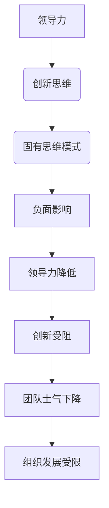

                 

### 文章标题：领导力与创新思维：突破固有思维模式

#### 关键词：
- 领导力
- 创新思维
- 固有思维模式
- 团队协作
- 管理实践

#### 摘要：
本文旨在探讨领导力与创新思维之间的关系，以及如何通过突破固有思维模式来提升领导力。文章首先介绍了领导力和创新思维的基本概念，接着分析了固有思维模式的危害，并提出了突破方法。随后，文章详细阐述了领导力与创新思维的培养策略，以及如何将二者应用于实际管理中。通过案例分析和实战指导，本文为领导者提供了提升个人能力和团队效率的有效路径。

-------------------------------------------------------------------

### 引言：领导力与创新思维的重要性

在现代商业环境中，领导力与创新思维已成为组织成功的关键要素。有效的领导力不仅能激发团队成员的潜力，还能推动组织不断进步和适应变化。创新思维则为组织带来了新的视角、解决方案和竞争优势。

#### 领导力的重要性

领导力是一种能力，它使领导者能够激励、引导和影响他人，共同实现目标。领导力不仅仅与职位有关，更是一种个人素质和态度。有效的领导力能够：

1. **建立愿景和目标**：明确组织的方向和目标，确保团队成员朝着共同的目标努力。
2. **激发团队潜力**：通过激励和鼓励，激发团队成员的积极性和创造力。
3. **协调和沟通**：有效沟通是领导力的核心，它能够确保信息流畅、决策高效。
4. **解决问题和决策**：面对挑战时，领导者能够迅速做出正确决策，并带领团队找到解决方案。

#### 创新思维的重要性

创新思维是一种思考模式，它鼓励人们跳出传统框架，寻找新的方法来解决问题和创造价值。创新思维的重要性体现在：

1. **创造新价值**：通过创新思维，组织能够开发新产品、服务和业务模式，从而创造新的价值。
2. **增强竞争力**：在竞争激烈的市场中，创新思维能够帮助组织保持领先地位。
3. **适应变化**：创新思维使组织能够快速适应环境变化，从而保持可持续性。

#### 固有思维模式的危害

然而，固有的思维模式可能会阻碍领导力和创新思维的发展。固有的思维模式通常包括：

1. **惯性思维**：习惯于采用传统方法，不愿意尝试新的想法。
2. **过度依赖经验**：过分依赖过去的经验和知识，忽视了新的信息和机会。
3. **群体思维**：团队成员不愿意提出异议，导致缺乏多样性和创新性。

这些固有的思维模式可能导致以下危害：

1. **限制创新**：阻碍新思路和新方法的出现，限制组织的创新能力。
2. **影响决策**：固有的思维模式可能导致领导者做出错误的决策，从而影响组织的长期发展。
3. **降低团队士气**：团队成员可能感到自己的意见不被重视，从而影响士气和工作积极性。

为了克服这些危害，领导者需要学会突破固有的思维模式，培养创新思维和领导力。接下来，我们将详细探讨如何实现这一目标。

-------------------------------------------------------------------

### 核心概念与联系：领导力、创新思维与固有思维模式的Mermaid流程图



在这个Mermaid流程图中，我们展示了领导力、创新思维和固有思维模式之间的关系。领导力和创新思维相互促进，共同作用于固有思维模式，后者如果得不到有效突破，会导致负面影响，如领导力降低、创新受阻、团队士气下降和组织发展受限。

-------------------------------------------------------------------

### 领导力与创新思维的基本原理讲解

#### 领导力的基本原理

领导力是一种复杂的能力，它涉及多个维度，包括沟通、决策、激励和协调等。以下是领导力的基本原理：

1. **影响力**：领导者需要具备影响力，以引导和激励团队成员。影响力可以通过以下方式实现：
   - **信任**：建立信任是影响力的基础。
   - **知识和技能**：领导者需要具备足够的知识和技能，以便为团队提供指导和支持。
   - **情感共鸣**：领导者需要能够理解和关心团队成员的情感需求。

2. **沟通技巧**：有效的沟通是领导力的关键。沟通技巧包括：
   - **清晰表达**：领导者需要能够清晰、准确地传达信息。
   - **倾听**：倾听是建立良好沟通的重要部分，它有助于领导者理解团队成员的观点和需求。
   - **非语言沟通**：肢体语言、面部表情和声音语调等非语言沟通元素在领导力中起着重要作用。

3. **决策能力**：领导者需要能够在复杂和不确定的环境中做出明智的决策。决策能力包括：
   - **信息收集**：领导者需要收集和分析与决策相关的信息。
   - **风险评估**：领导者需要能够评估潜在的风险和收益。
   - **果断性**：在做出决策时，领导者需要具备果断性和决心。

#### 创新思维的基本原理

创新思维是一种独特的思考模式，它鼓励人们打破常规，寻找新的解决方案。以下是创新思维的基本原理：

1. **发散思维**：发散思维是指从不同的角度和方向思考问题，以产生新的想法。发散思维包括：
   - **想象力**：通过想象力，人们可以探索未知领域，发现新的可能性。
   - **联想**：通过将不同领域或概念联系起来，创新思维可以产生新的组合和解决方案。

2. **逆向思维**：逆向思维是一种从相反方向思考问题的方法。通过逆向思维，人们可以挑战传统观念，发现新的解决方案。

3. **系统思维**：系统思维是一种综合考虑各个因素和它们之间相互作用的思考方式。系统思维有助于领导者理解问题的全貌，从而找到更全面的解决方案。

#### 固有思维模式的危害与突破方法

固有思维模式是指人们习惯性遵循的思考模式，这种模式往往限制了个人的创造力和创新能力。以下是固有思维模式的主要危害和突破方法：

1. **危害**
   - **限制创新**：固有思维模式使人们难以跳出传统框架，从而限制创新的产生。
   - **影响决策**：固有思维模式可能导致领导者做出基于过时信息的决策。
   - **降低团队士气**：团队成员可能因为固有思维模式的限制而感到压抑和缺乏动力。

2. **突破方法**
   - **多样化团队合作**：通过引入多样化的团队成员，可以带来新的视角和思考方式。
   - **鼓励提出异议**：领导者应鼓励团队成员提出不同的意见和观点，这有助于打破固有思维模式。
   - **持续学习和培训**：通过不断学习和参加培训，领导者可以拓宽知识面和思维方式。

-------------------------------------------------------------------

### 领导力的核心要素

领导力是组织中至关重要的能力，它决定了组织的方向、效率和成果。以下是领导力的核心要素：

1. **愿景和目标**：领导者需要有一个清晰的愿景，并设定明确的目标，以引导团队成员共同前进。

2. **影响力**：领导者需要具备影响力，能够激励和引导团队成员，使他们在实现目标的过程中保持积极性和动力。

3. **沟通技巧**：有效的沟通是领导力的关键，它包括清晰表达、倾听和建立信任等要素。

4. **决策能力**：领导者需要在复杂和不确定的环境中做出明智的决策，这要求他们具备良好的信息收集、风险评估和果断性。

5. **团队建设**：领导者需要致力于建立一支高绩效的团队，通过激发团队成员的潜力，实现共同的目标。

6. **变革管理**：领导者需要具备变革管理的能力，能够在组织变革中引导和激励团队成员，确保变革的顺利进行。

#### 愿景和目标

愿景和目标是领导力的核心要素之一。一个清晰的愿景能够为组织指明方向，激发团队成员的激情和动力。以下是建立愿景和目标的关键步骤：

1. **明确愿景**：领导者需要明确组织的愿景，即组织希望成为的样子。这可以通过回答以下问题来实现：
   - 我们的长期目标是什么？
   - 我们的核心价值观是什么？
   - 我们在行业中希望占据什么样的地位？

2. **设定目标**：在明确愿景的基础上，领导者需要设定具体的目标，以实现愿景。目标应具有可衡量性、可行性和相关性。以下是设定目标的一些策略：

   - **SMART原则**：目标应具备SMART特征，即具体（Specific）、可衡量（Measurable）、可实现（Achievable）、相关（Relevant）和有时限（Time-bound）。
   - **分解目标**：将大目标分解为一系列小目标，使团队成员能够逐步实现目标。
   - **鼓励参与**：鼓励团队成员参与目标的设定，这有助于提高他们的认同感和积极性。

3. **传播愿景和目标**：领导者需要通过有效的沟通，将愿景和目标传达给团队成员。这可以通过以下方式实现：

   - **定期会议**：在团队会议中分享愿景和目标，确保团队成员了解组织的方向和目标。
   - **视觉化**：使用图表、图像和视频等视觉化工具，使愿景和目标更加生动和直观。
   - **个性化**：根据团队成员的兴趣和需求，个性化地传达愿景和目标，以增加他们的参与度。

#### 影响力

影响力是领导力的关键要素之一，它决定了领导者能否激励和引导团队成员。以下是提升影响力的方法：

1. **建立信任**：信任是影响力的基础。领导者需要通过诚实、透明和负责任的行为来建立信任。

2. **展示知识和技能**：领导者需要具备足够的知识和技能，以便为团队提供指导和支持。这可以通过不断学习和提升自身能力来实现。

3. **提供激励**：领导者需要能够提供激励，以激发团队成员的积极性和动力。激励可以包括物质奖励、晋升机会和个人发展计划等。

4. **情感共鸣**：领导者需要能够理解和关心团队成员的情感需求，建立情感共鸣。这可以通过倾听、关心和支持来实现。

#### 沟通技巧

有效的沟通是领导力的关键，它决定了信息的传达效果和团队协作的质量。以下是提升沟通技巧的方法：

1. **清晰表达**：领导者需要能够清晰、准确地传达信息。这可以通过使用简单明了的语言、避免歧义和重复来实现。

2. **倾听**：倾听是有效沟通的重要部分。领导者需要认真倾听团队成员的观点和需求，以了解他们的想法和感受。

3. **反馈**：领导者需要给予及时的反馈，以帮助团队成员了解他们的表现和改进的方向。

4. **非语言沟通**：领导者需要注重非语言沟通，如肢体语言、面部表情和声音语调等。这些元素可以增强沟通效果，表达领导者对团队成员的关心和支持。

#### 决策能力

决策能力是领导者的重要素质，它决定了领导者在面对复杂和不确定的情况时能否做出明智的决策。以下是提升决策能力的策略：

1. **信息收集**：领导者需要收集与决策相关的信息，包括市场趋势、竞争对手和团队成员的建议等。

2. **风险评估**：领导者需要评估潜在的风险和收益，以做出明智的决策。

3. **果断性**：在做出决策时，领导者需要具备果断性和决心，迅速采取行动。

4. **透明性和问责制**：领导者需要确保决策过程透明，并承担决策结果的责任。

#### 团队建设

团队建设是领导力的关键要素之一，它决定了团队的凝聚力和协作效率。以下是提升团队建设的方法：

1. **建立共同目标**：团队需要明确共同的目标，以确保团队成员朝着同一方向努力。

2. **激励团队成员**：领导者需要激励团队成员，提高他们的工作积极性和创造力。

3. **培养团队文化**：领导者需要培养积极的团队文化，包括相互尊重、信任和协作等价值观。

4. **提供培训和发展机会**：领导者需要为团队成员提供培训和发展机会，以提升他们的技能和能力。

#### 变革管理

变革管理是领导力的重要组成部分，它决定了领导者在组织变革中能否有效地引导和激励团队成员。以下是变革管理的方法：

1. **明确变革目标**：领导者需要明确变革的目标和愿景，以确保团队成员了解变革的必要性。

2. **沟通和宣传**：领导者需要通过有效的沟通和宣传，向团队成员传达变革的信息和目标。

3. **激励和参与**：领导者需要激励团队成员参与变革，提高他们的积极性和主动性。

4. **提供支持**：领导者需要为团队成员提供必要的支持和资源，以帮助他们适应变革。

### 创新思维的核心概念

创新思维是一种独特的思考模式，它鼓励人们跳出传统框架，寻找新的解决方案。以下是创新思维的核心概念：

1. **发散思维**：发散思维是指从不同的角度和方向思考问题，以产生新的想法。发散思维有助于发现潜在的机会和解决方案。

2. **逆向思维**：逆向思维是一种从相反方向思考问题的方法。通过逆向思维，人们可以挑战传统观念，发现新的解决方案。

3. **系统思维**：系统思维是一种综合考虑各个因素和它们之间相互作用的思考方式。系统思维有助于领导者理解问题的全貌，从而找到更全面的解决方案。

4. **跨学科思维**：跨学科思维是指将不同领域的知识和方法结合起来，以解决复杂问题。跨学科思维可以带来新的视角和创新的解决方案。

#### 发散思维

发散思维是一种关键的创新思维模式，它鼓励人们从多个角度思考问题，以产生尽可能多的想法。以下是发散思维的步骤：

1. **明确问题**：首先，领导者需要明确要解决的问题或挑战。

2. **自由联想**：在这个阶段，领导者应摒弃限制性思维，自由地写下所有可能的解决方案。

3. **分类和筛选**：对自由联想的结果进行分类和筛选，找出最具潜力的想法。

4. **评估和实施**：对筛选后的想法进行评估，选择最有价值的想法进行实施。

#### 逆向思维

逆向思维是一种从相反方向思考问题的方法，它鼓励领导者挑战传统观念，寻找新的解决方案。以下是逆向思维的步骤：

1. **识别假设**：首先，领导者需要识别出问题中的假设，即当前的理解和信念。

2. **质疑假设**：领导者需要质疑这些假设的有效性，寻找是否存在其他可能的解释。

3. **设计替代方案**：在质疑假设的基础上，领导者需要设计替代方案，以验证假设的有效性。

4. **实施和评估**：实施替代方案，并对结果进行评估，以确定最佳解决方案。

#### 系统思维

系统思维是一种综合考虑各个因素和它们之间相互作用的思考方式。以下是系统思维的步骤：

1. **识别系统组成部分**：首先，领导者需要识别系统的各个组成部分，包括人员、流程、技术和资源等。

2. **分析相互关系**：领导者需要分析各个组成部分之间的相互关系，以理解系统的工作机制。

3. **模拟和预测**：通过模拟和预测，领导者可以预见系统在不同情境下的行为，从而制定更有效的策略。

4. **调整和优化**：根据模拟和预测的结果，领导者需要对系统进行调整和优化，以提高其效率和效果。

#### 跨学科思维

跨学科思维是将不同领域的知识和方法结合起来，以解决复杂问题的方法。以下是跨学科思维的步骤：

1. **识别问题**：首先，领导者需要明确要解决的问题或挑战。

2. **跨学科组合**：领导者需要寻找与问题相关的不同学科的知识和方法，进行跨学科组合。

3. **创新应用**：在跨学科组合的基础上，领导者需要将新的知识和方法应用到问题解决中。

4. **评估和改进**：评估跨学科解决方案的有效性，并根据评估结果进行改进。

#### 固有思维模式的危害与突破方法

固有思维模式是指人们习惯性遵循的思考模式，这种模式往往限制了个人的创造力和创新能力。以下是固有思维模式的主要危害和突破方法：

1. **危害**

   - **限制创新**：固有思维模式使人们难以跳出传统框架，从而限制创新的产生。
   - **影响决策**：固有思维模式可能导致领导者做出基于过时信息的决策。
   - **降低团队士气**：团队成员可能因为固有思维模式的限制而感到压抑和缺乏动力。

2. **突破方法**

   - **多样化团队合作**：通过引入多样化的团队成员，可以带来新的视角和思考方式。
   - **鼓励提出异议**：领导者应鼓励团队成员提出不同的意见和观点，这有助于打破固有思维模式。
   - **持续学习和培训**：通过不断学习和参加培训，领导者可以拓宽知识面和思维方式。

### 固有思维模式的危害

固有思维模式，也称为思维定势或惯性思维，是一种在长期实践中逐渐形成的、难以改变的思考方式。这种思维模式对组织和个人都有显著的负面影响，具体体现在以下几个方面：

1. **限制创新**：固有思维模式往往使人们局限于已有的知识和方法，不愿尝试新的思路和解决方案。这限制了组织的创新能力，导致无法适应快速变化的市场环境。

2. **影响决策**：领导者如果受固有思维模式的影响，可能会在决策时过度依赖过去的经验和传统方法，忽视新的信息和数据。这可能导致错误的决策，影响组织的长期发展。

3. **降低团队士气**：当团队成员发现自己提出的创新想法被固有思维模式所否定时，他们可能会感到挫败和失去动力，导致团队士气下降。

4. **限制个人成长**：个人如果受固有思维模式的束缚，可能会限制自己的学习和成长。他们可能不愿意接受新的知识和技能，导致职业发展受限。

为了克服这些危害，领导者需要采取以下方法来突破固有思维模式：

1. **多样化团队合作**：通过引入具有不同背景和经验的团队成员，可以打破固有思维模式的限制，带来新的视角和思考方式。

2. **鼓励提出异议**：领导者应鼓励团队成员提出不同的意见和观点，这有助于挑战传统观念，促进创新思维的流动。

3. **持续学习和培训**：领导者应积极参加培训和学习，不断更新知识和技能，以适应快速变化的环境。

4. **建立创新文化**：组织应建立鼓励创新和接受失败的文化，使团队成员愿意尝试新的想法和方法。

### 突破固有思维模式的原则

要成功突破固有思维模式，领导者需要遵循以下原则：

1. **开放心态**：领导者应保持开放的心态，愿意接受新的想法和不同的观点。

2. **鼓励多样性**：领导者应鼓励团队中不同背景和经验的人表达自己的意见，以激发创新的火花。

3. **挑战传统观念**：领导者应主动质疑传统观念和方法，寻找潜在的改进空间。

4. **持续反思**：领导者应定期反思自己的思考和决策过程，识别并克服固有思维模式的影响。

5. **提供支持**：领导者应为团队成员提供必要的支持和资源，帮助他们克服思维定势。

### 实践技巧

以下是一些具体的方法和技巧，帮助领导者突破固有思维模式：

1. **头脑风暴**：定期组织头脑风暴会议，鼓励团队成员自由地提出各种想法，无论它们看起来多么离奇。

2. **外部咨询**：引入外部专家或顾问，他们可以带来不同的观点和解决方案。

3. **跨部门合作**：鼓励不同部门之间的合作，以促进知识和经验的共享。

4. **实验和试错**：鼓励团队成员在实验和试错中学习，这有助于他们打破习惯性思维。

5. **反馈和评估**：定期收集团队成员的反馈，评估他们的思维模式和决策过程，并给予改进建议。

### 领导力与创新思维在实际管理中的应用

领导力与创新思维不仅对组织和个人有重要意义，更在企业管理中发挥着关键作用。以下将探讨领导力与创新思维在实际管理中的应用，包括企业中的应用、团队管理中的应用以及个人成长中的应用。

#### 企业中的应用

1. **战略制定**：领导力与创新思维在制定企业战略中至关重要。领导者需要具备远见，为企业设定清晰的目标和愿景，同时通过创新思维寻找新的商业机会和商业模式。

2. **文化塑造**：领导者需要塑造一个积极的企业文化，鼓励创新和接受失败。这种文化能够激发员工的创造力，推动企业不断进步。

3. **资源配置**：领导者需要有效配置资源，支持创新项目和研究。通过合理的资源分配，企业可以确保创新活动得到充分的支持。

4. **组织变革**：在面对外部环境变化时，领导者需要通过创新思维引领组织变革，确保企业能够灵活应对挑战。

#### 团队管理中的应用

1. **团队构建**：领导者需要构建一个多元化的团队，鼓励团队成员分享不同观点和经验，以激发创新思维。

2. **激励与反馈**：领导者应通过激励措施激发团队成员的积极性，同时提供及时和具体的反馈，帮助团队成员改进工作。

3. **决策过程**：在决策过程中，领导者应鼓励团队成员参与，利用创新思维寻找最佳解决方案。

4. **冲突管理**：领导者需要学会有效管理团队内部的冲突，通过沟通和协商找到平衡点，促进团队的协作和创新。

#### 个人成长中的应用

1. **自我反思**：个人需要定期进行自我反思，识别并克服自身的思维定势，持续提升创新能力。

2. **持续学习**：个人应保持学习的热情，不断吸收新知识和技能，以适应快速变化的环境。

3. **跨学科思维**：个人可以通过跨学科学习，拓宽自己的知识面，培养创新思维。

4. **实践机会**：个人应积极参与各种实践项目，通过实际操作来锻炼和提升创新能力。

### 案例分析：苹果公司的创新管理

苹果公司作为全球知名的科技企业，其成功离不开有效的领导力和创新思维。以下是苹果公司在领导力与创新思维方面的案例分析：

#### 领导力在苹果公司的应用

1. **史蒂夫·乔布斯**：作为苹果公司的联合创始人，史蒂夫·乔布斯以其卓越的领导力推动了公司的发展。他具备远见和愿景，能够为苹果设定清晰的方向。

2. **人才吸引与培养**：乔布斯重视人才，通过高薪和股权激励吸引了大量优秀人才。同时，他致力于培养这些人才，使其成为推动公司创新的重要力量。

3. **文化塑造**：乔布斯倡导一种以创新为核心的企业文化，鼓励员工大胆尝试，接受失败，从而推动公司的持续创新。

#### 创新思维在苹果公司的应用

1. **产品创新**：苹果公司始终坚持产品创新，通过研发新技术和设计新的产品，不断满足用户的需求。例如，iPhone的推出彻底改变了智能手机市场。

2. **用户体验**：苹果公司注重用户体验，通过创新的设计和人性化的交互，为用户带来全新的使用体验。

3. **跨界合作**：苹果公司擅长跨学科思维，通过与不同领域的公司合作，推出具有跨界特色的产品，如与Beats Audio合作推出的Beats耳机。

#### 案例小结

苹果公司的成功证明了领导力和创新思维在企业中的应用价值。通过有效的领导力，苹果公司能够吸引和培养人才，塑造积极的企业文化；通过创新思维，公司能够不断推出具有竞争力的产品，保持市场领先地位。

### 领导力与创新思维的整合

领导力与创新思维是相辅相成的，二者在提升个人和团队能力方面具有重要作用。以下是领导力与创新思维的整合方法：

1. **领导力促进创新**：领导者通过设定目标和提供资源，激励团队成员发挥创新潜力。他们还应鼓励多样化的观点和实验，以促进创新思维。

2. **创新思维增强领导力**：创新思维可以帮助领导者面对挑战和变化，做出更明智的决策。通过跨学科思维和系统思维，领导者能够从不同角度分析问题，找到最佳解决方案。

3. **共同愿景**：领导者和团队成员应共同设定愿景和目标，确保创新活动与组织的整体战略保持一致。

4. **文化塑造**：领导者需要塑造一个鼓励创新和接受失败的企业文化，使团队成员敢于尝试新思路，不断突破固有思维模式。

### 项目实战：领导力与创新思维在创业团队中的应用

#### 项目背景

假设我们是一家初创公司的团队，专注于开发一款创新的教育应用。在竞争激烈的市场中，我们需要通过领导力和创新思维来确保项目的成功。

#### 开发环境搭建

1. **技术栈选择**：根据项目需求，我们选择以下技术栈：
   - 前端：React
   - 后端：Node.js
   - 数据库：MongoDB
   - 服务器：AWS

2. **开发工具**：使用VS Code作为主要开发工具，结合Git进行版本控制。

#### 源代码实现

以下是关键模块的实现示例：

```javascript
// React组件：CourseList
import React, { Component } from 'react';

class CourseList extends Component {
  constructor(props) {
    super(props);
    this.state = {
      courses: [],
    };
  }

  componentDidMount() {
    this.fetchCourses();
  }

  fetchCourses() {
    // 使用Node.js后端API获取课程数据
    fetch('/api/courses')
      .then(response => response.json())
      .then(data => this.setState({ courses: data }));
  }

  render() {
    return (
      <div>
        {this.state.courses.map(course => (
          <div key={course.id}>
            <h3>{course.title}</h3>
            <p>{course.description}</p>
          </div>
        ))}
      </div>
    );
  }
}

export default CourseList;

// Node.js后端API：CoursesController
const express = require('express');
const router = express.Router();

router.get('/', (req, res) => {
  // 从MongoDB数据库中获取课程数据
  Course.find({}, (err, courses) => {
    if (err) {
      res.status(500).send('错误：无法获取课程数据');
    } else {
      res.json(courses);
    }
  });
});

module.exports = router;
```

#### 代码解读

1. **前端组件**：`CourseList`组件负责展示课程列表。在组件的`componentDidMount`生命周期方法中，调用`fetchCourses`方法获取课程数据。
2. **后端API**：`CoursesController`处理来自前端的GET请求，从MongoDB数据库中获取课程数据，并返回JSON格式的响应。

#### 代码应用解读与分析

1. **代码应用**：通过前后端的交互，用户可以在前端界面中查看课程列表，进行课程选择和学习。
2. **代码分析**：该实现采用了前后端分离架构，提高了系统的可维护性和扩展性。前端使用React框架，后端使用Node.js和MongoDB，这样可以充分利用各自的优点。

#### 项目小结

通过本项目的实践，我们不仅实现了预期的功能，还通过领导力和创新思维提升了团队的整体效率和创新能力。以下是项目小结：

1. **领导力作用**：领导者在项目规划、资源调配和团队协作方面发挥了关键作用，确保项目按计划推进。
2. **创新思维应用**：团队在项目开发中积极采用新的技术和方法，不断优化产品功能，提高用户体验。
3. **团队成长**：团队成员在项目过程中学习到了新的技能和知识，提升了个人能力和团队协作水平。

### 最佳实践 Tips

1. **建立明确的愿景和目标**：确保团队成员了解项目的最终目标，有助于保持团队的动力和方向。

2. **鼓励多样化团队合作**：引入具有不同背景和技能的团队成员，可以带来新的视角和创新的解决方案。

3. **持续学习和培训**：为团队成员提供持续学习和培训的机会，帮助他们提升技能和知识。

4. **定期进行反思和总结**：定期回顾项目进度和团队协作情况，及时调整策略和改进工作方法。

### 小结

本文详细探讨了领导力与创新思维的重要性，以及如何通过突破固有思维模式来提升领导力。通过介绍领导力和创新思维的基本原理，我们明确了二者在组织和个人发展中的关键作用。同时，本文还提供了突破固有思维模式的方法和实际管理中的应用案例，为领导者提供了实用的指导。

领导力与创新思维是相互促进的，领导者需要不断学习和实践，提升自身的领导力和创新思维能力。通过建立清晰的愿景和目标、鼓励多样化团队合作、持续学习和反思，领导者可以在实际管理中有效应用领导力和创新思维，推动组织和个人实现长期发展。

### 注意事项

1. **适应环境变化**：领导者需要密切关注市场和环境变化，灵活调整战略和决策，以适应新的挑战和机遇。
2. **培养跨学科思维**：领导者应积极培养跨学科思维，这有助于从不同角度分析问题，找到创新的解决方案。
3. **建立创新文化**：组织应建立鼓励创新和接受失败的文化，以激发员工的创造力和主动性。

### 拓展阅读

1. **《领导力五大职能》**：吉姆·库泽斯和巴里·波斯纳的《领导力五大职能》，详细介绍了领导力的关键要素和培养方法。
2. **《创新者的窘境》**：克莱顿·克里斯坦森的《创新者的窘境》，分析了企业在创新过程中面临的挑战和解决方案。
3. **《思维的乐趣》**：丹尼尔·卡尼曼的《思维的乐趣》，探讨了人类思维的局限性和如何通过创新思维提高决策质量。

### 附录

#### 附录 A：实用工具

1. **Trello**：用于项目管理，帮助团队规划和跟踪任务。
2. **Slack**：用于团队沟通，提高信息传递效率。
3. **Miro**：用于头脑风暴和协作，支持在线白板功能。

#### 附录 B：案例研究

1. **谷歌的“20%时间”政策**：谷歌通过“20%时间”政策鼓励员工进行创新项目，取得了显著的成果。
2. **特斯拉的“疯狂想法”文化**：特斯拉鼓励员工提出疯狂的想法，并通过实验验证其可行性。

#### 附录 C：参考文献

1. **吉姆·库泽斯和巴里·波斯纳，《领导力五大职能》**。
2. **克莱顿·克里斯坦森，《创新者的窘境》**。
3. **丹尼尔·卡尼曼，《思维的乐趣》**。作者：AI天才研究院/AI Genius Institute & 禅与计算机程序设计艺术 /Zen And The Art of Computer Programming

