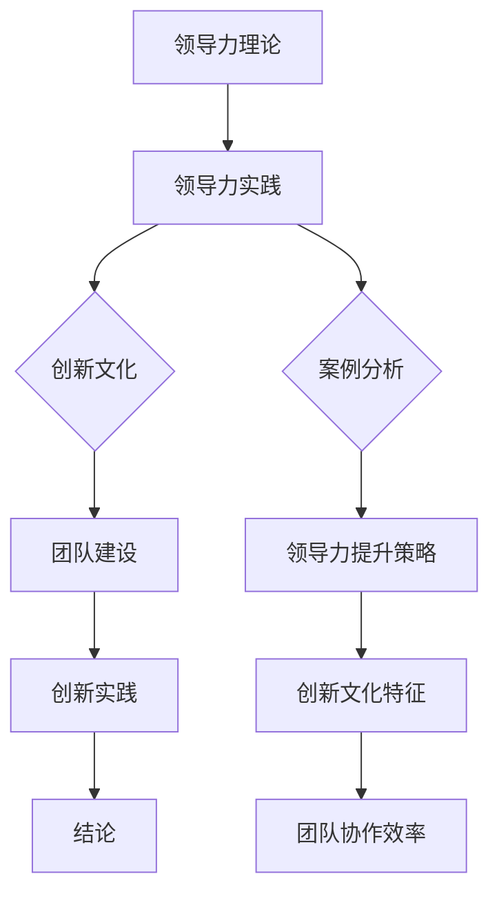
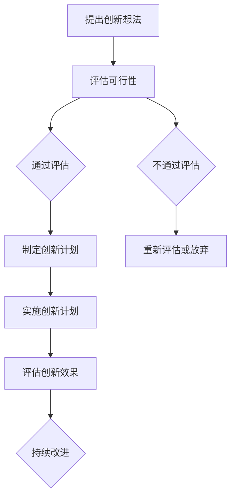
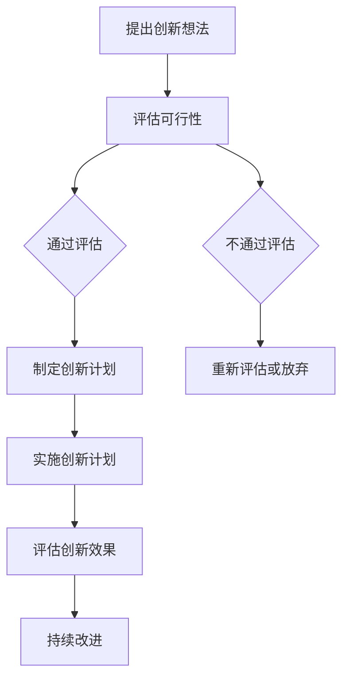

                 


### 文章标题：《领导力与创新文化催化：加速创新型团队形成》

> 关键词：领导力、创新文化、团队建设、创新实践

> 摘要：
本文将探讨领导力与创新文化的深度融合，以及如何通过培养创新文化来加速创新型团队的建立。文章分为引言、领导力理论、领导力实践、创新文化、团队建设、创新实践和结论七个部分。首先，我们将介绍领导力与创新文化的背景和重要性，然后深入分析领导力的核心概念和理论，探讨领导力在团队管理中的应用。接着，我们将探讨创新文化的内涵和培育方法，以及如何通过团队建设来提高团队协作效率。随后，通过实际案例展示创新实践的成功经验，并总结全文，提出未来团队发展的建议。

### 引言

在当今快速变化的商业环境中，领导力与创新文化的深度融合已成为组织取得成功的关键因素。随着技术的不断进步和市场竞争的日益激烈，企业需要具备强大的创新能力来适应不断变化的市场需求。而领导力作为团队管理的重要能力，其核心在于如何激发团队的潜能，提高团队的整体效率。创新文化则强调创造性的思维和行动，鼓励团队成员勇于尝试、持续改进。

本文旨在探讨领导力与创新文化的融合，以及如何通过培养创新文化来加速创新型团队的建立。文章分为七个部分，将首先介绍领导力与创新文化的背景和重要性，然后深入分析领导力的核心概念和理论，探讨领导力在团队管理中的应用。接着，我们将探讨创新文化的内涵和培育方法，以及如何通过团队建设来提高团队协作效率。随后，通过实际案例展示创新实践的成功经验，并总结全文，提出未来团队发展的建议。

### 领导力理论

领导力是指领导者在特定情境下，通过影响和激励团队成员，实现共同目标的能力。领导力不仅仅是一种技术或技能，更是一种艺术和科学。在组织管理中，领导力起着至关重要的作用，它直接影响团队的工作效率、员工的满意度和组织的整体绩效。

#### 领导力的核心概念

领导力的核心概念包括以下几个方面：

1. **影响力**：领导者通过自身的行为、沟通和决策对团队成员产生影响，从而引导团队朝着共同目标前进。影响力是领导力的核心要素，它体现在领导者如何与团队成员建立信任关系、如何有效地传达愿景和目标等方面。

2. **激励**：领导者通过激励手段激发团队成员的内在动力，使团队成员自愿地为实现组织目标而努力。激励可以采用物质激励、精神激励和情感激励等多种形式，关键在于找到适合团队成员的激励方式。

3. **沟通**：领导者需要具备良好的沟通能力，能够清晰地表达自己的想法，同时也要倾听团队成员的意见和需求。有效的沟通有助于建立团队凝聚力，提高团队成员之间的协作效率。

4. **决策**：领导者需要具备决策能力，能够在复杂多变的环境中做出正确的决策。决策能力包括信息收集、问题分析、方案评估和选择等方面。

5. **团队建设**：领导者需要关注团队建设，通过构建高效的团队来提高团队的整体绩效。团队建设包括团队角色分工、团队沟通、团队冲突管理和团队激励机制等方面。

#### 经典领导力理论

1. **领导风格理论**：领导风格理论认为，领导者的行为风格会影响团队的表现。不同的领导风格包括专制型、民主型和放任型等。专制型领导强调领导者的权威和控制，民主型领导注重团队参与和决策的民主化，放任型领导则给予团队成员更多的自主权。

2. **变革型领导理论**：变革型领导强调领导者的创新和变革能力，领导者通过激发团队成员的内在动机，推动团队实现变革。变革型领导包括激励、愿景塑造、个性化关怀和领导示范等方面。

3. **交易型领导理论**：交易型领导强调领导者的控制和管理能力，领导者通过与团队成员建立互惠关系来推动团队工作。交易型领导包括奖励、惩罚、任务分配和绩效评估等方面。

#### 领导力与团队发展的关系

领导力对团队发展具有深远的影响。优秀的领导者能够激发团队成员的潜能，提高团队的协作效率，促进团队的创新和成长。具体来说，领导力在团队发展中的作用包括：

1. **明确目标**：领导者需要明确团队的目标和愿景，并将其传达给团队成员，使团队成员明确自己的工作方向和目标。

2. **激发潜能**：领导者通过激励和鼓励，激发团队成员的内在动力，使团队成员发挥出更高的工作潜力。

3. **建立信任**：领导者需要建立信任关系，与团队成员建立互信，促进团队成员之间的协作和合作。

4. **解决问题**：领导者需要具备解决问题的能力，能够快速识别和解决团队面临的问题和挑战。

5. **创新推动**：领导者需要鼓励创新思维和行动，推动团队不断尝试新方法、新技术，以适应不断变化的市场需求。

#### 领导力在团队管理中的应用

1. **团队建设**：领导者需要关注团队建设，通过构建高效的团队来提高团队的整体绩效。团队建设包括团队角色分工、团队沟通、团队冲突管理和团队激励机制等方面。

2. **决策制定**：领导者需要具备决策能力，能够在复杂多变的环境中做出正确的决策。决策制定包括信息收集、问题分析、方案评估和选择等方面。

3. **沟通协调**：领导者需要具备良好的沟通能力，能够清晰地表达自己的想法，同时也要倾听团队成员的意见和需求。有效的沟通有助于建立团队凝聚力，提高团队成员之间的协作效率。

4. **激励制度**：领导者需要制定合理的激励制度，激发团队成员的内在动力，使团队成员自愿地为实现组织目标而努力。

5. **文化塑造**：领导者需要塑造积极向上的团队文化，鼓励团队成员勇于尝试、持续改进，营造创新氛围。

### 领导力实践

领导力不仅是一种理论，更需要在实际工作中得到应用。本节将通过具体案例，展示领导力在团队管理中的应用，并提供实用的领导力提升策略。

#### 案例分析

1. **领导力在敏捷开发团队中的应用**

敏捷开发是一种以人为核心、迭代、循序渐进的开发方法。在敏捷开发团队中，领导力发挥着至关重要的作用。以下是一个敏捷开发团队领导力应用的案例：

- **明确目标**：团队领导在项目开始时明确团队的目标和愿景，与团队成员进行充分的沟通，确保团队成员对项目目标有清晰的认识。

- **激励团队**：团队领导通过激励手段，如奖励、表彰和团队建设活动，激发团队成员的内在动力，提高团队的工作积极性。

- **沟通协调**：团队领导建立有效的沟通机制，定期召开团队会议，确保团队成员之间的信息畅通，及时解决团队内部的问题和冲突。

- **问题解决**：团队领导在面对团队面临的问题时，能够快速识别并找到解决方案，确保项目能够顺利推进。

2. **领导力在跨文化团队中的应用**

跨文化团队是由来自不同文化背景的成员组成的团队。在跨文化团队中，领导力需要具备更强的包容性和适应性。以下是一个跨文化团队领导力应用的案例：

- **尊重差异**：团队领导尊重团队成员的文化差异，鼓励团队成员分享自己的文化背景和观点，促进团队成员之间的相互理解和尊重。

- **建立信任**：团队领导通过建立信任关系，增强团队成员之间的信任感，提高团队的协作效率。

- **文化适应**：团队领导根据团队的文化背景和特点，制定适应性的领导策略，确保团队能够在不同文化环境中高效运作。

#### 领导力提升策略

1. **自我领导力提升**：领导者需要不断反思和提升自己的领导力。可以通过阅读领导力相关书籍、参加领导力培训课程和进行领导力实践来提升自我领导力。

2. **领导力教练**：领导者可以寻求领导力教练的帮助，通过教练的指导和反馈，进一步提升自己的领导力水平。

3. **领导力发展计划**：组织可以制定领导力发展计划，为领导者提供系统的培训和成长机会，帮助领导者不断提升自己的领导力。

4. **实践与反思**：领导者需要将领导力理论应用到实际工作中，通过实践和反思，不断总结经验和教训，提升自己的领导力。

### 创新文化

创新文化是指组织内部鼓励创新思维和行动的文化氛围。创新文化不仅包括创新的理念和价值观，还包括组织在创新过程中的行为和制度。创新文化对组织的创新能力和发展具有深远的影响。本节将探讨创新文化的内涵、特征及其对团队效率的影响。

#### 创新文化的内涵

创新文化的内涵可以从以下几个方面来理解：

1. **创新理念**：创新文化强调创新的重要性，认为创新是组织持续发展的关键。组织倡导创新思维，鼓励团队成员敢于尝试、勇于创新。

2. **创新价值观**：创新文化倡导尊重创新、鼓励创新、包容失败。组织价值观强调创新的价值，鼓励团队成员在创新过程中勇于承担责任，接受失败并从中吸取经验。

3. **创新行为**：创新文化体现在组织成员的创新行为中，如主动思考问题、积极探索解决方案、积极参与创新项目等。

4. **创新制度**：创新文化需要建立相应的制度支持，如创新激励机制、创新评审制度、创新资源共享机制等，为创新提供制度保障。

#### 创新文化的特征

创新文化具有以下特征：

1. **开放性**：创新文化鼓励开放的思想和交流，组织成员之间能够自由地分享想法和观点，促进创新的产生和发展。

2. **包容性**：创新文化对不同的意见和观点持包容态度，鼓励团队成员勇于表达自己的观点，尊重团队成员之间的差异。

3. **灵活性**：创新文化强调灵活性，能够快速适应环境变化，灵活调整创新策略和方法。

4. **激励性**：创新文化建立激励机制，鼓励团队成员积极参与创新，对创新成果给予认可和奖励。

5. **持续改进**：创新文化强调持续改进，鼓励团队成员不断反思和优化创新过程，以提高创新效果。

#### 创新文化对团队效率的影响

创新文化对团队效率具有积极的影响。具体来说，创新文化可以从以下几个方面提高团队效率：

1. **激发创新能力**：创新文化鼓励团队成员敢于尝试、勇于创新，激发团队成员的创新能力，提高团队的创造力。

2. **提高协作效率**：创新文化促进团队成员之间的协作，通过开放的思想和交流，提高团队协作效率。

3. **优化决策过程**：创新文化鼓励团队成员参与决策，提高决策的民主化和科学性，优化决策过程。

4. **提高适应能力**：创新文化使团队具备快速适应环境变化的能力，提高团队的应变能力和竞争力。

5. **增强团队凝聚力**：创新文化通过鼓励团队成员参与创新、分享成果，增强团队的凝聚力，提高团队的整体绩效。

### 团队建设

团队建设是提高团队协作效率、实现团队目标的关键。本节将探讨团队建设的重要性、团队建设的步骤和方法，以及如何通过团队建设提高团队协作效率。

#### 团队建设的重要性

团队建设对组织的发展具有重要作用。具体来说，团队建设的重要性体现在以下几个方面：

1. **提高团队协作效率**：团队建设能够加强团队成员之间的沟通与合作，提高团队的协作效率，实现团队目标。

2. **增强团队凝聚力**：团队建设有助于增强团队成员之间的信任和合作精神，提高团队的凝聚力，形成共同的目标和价值观。

3. **提升团队创新能力**：团队建设能够激发团队成员的创新能力，促进团队创新，提高组织的竞争力。

4. **优化团队结构**：团队建设有助于优化团队结构，明确团队成员的角色和职责，提高团队的整体效能。

5. **提升团队士气**：团队建设能够提高团队成员的工作积极性，提升团队士气，增强团队的战斗力。

#### 团队建设的步骤和方法

团队建设的步骤可以分为以下几个阶段：

1. **团队诊断**：团队诊断是团队建设的第一步，通过分析团队现状，找出团队存在的问题和挑战。

2. **制定团队目标**：根据团队诊断的结果，制定明确的团队目标，确保团队成员对团队目标有清晰的认识。

3. **规划团队活动**：规划团队活动是团队建设的重要环节，通过设计有针对性的团队活动，促进团队成员之间的交流和协作。

4. **实施团队活动**：实施团队活动，让团队成员积极参与，通过活动的过程，增强团队成员之间的信任和合作。

5. **评估团队建设效果**：对团队建设效果进行评估，总结经验教训，不断优化团队建设策略。

团队建设的方法包括以下几个方面：

1. **沟通与协作**：通过定期的团队会议、讨论会和分享会，促进团队成员之间的沟通与协作。

2. **培训与发展**：为团队成员提供培训和发展机会，提高团队成员的技能和能力。

3. **激励机制**：建立合理的激励机制，鼓励团队成员积极参与团队建设，提高团队士气。

4. **团队文化建设**：塑造积极向上的团队文化，鼓励团队成员勇于创新、承担责任，形成共同的目标和价值观。

5. **团队活动**：设计有趣的团队活动，如团建活动、拓展训练和团队比赛，增强团队成员之间的信任和合作。

#### 提高团队协作效率的方法

1. **明确目标**：确保团队成员对团队目标有清晰的认识，明确各自的工作职责和任务。

2. **沟通与协作**：建立有效的沟通机制，确保团队成员之间的信息畅通，提高协作效率。

3. **分工合作**：根据团队成员的技能和特长，进行合理的分工，提高工作效率。

4. **资源共享**：建立资源共享机制，确保团队成员能够充分利用资源和信息。

5. **冲突管理**：建立有效的冲突管理机制，及时解决团队内部的冲突和问题，避免影响团队协作。

6. **激励制度**：建立合理的激励制度，激发团队成员的工作积极性和创造力。

7. **团队文化建设**：营造积极向上的团队文化，鼓励团队成员勇于创新、承担责任。

### 创新实践

创新实践是组织实现持续发展的重要手段。本节将通过实际案例，展示创新实践的成功经验，并分析创新实践对团队发展的推动作用。

#### 创新实践案例

1. **案例一：苹果公司的创新实践**

苹果公司作为全球领先的科技公司，以其创新的产品和服务赢得了广泛的认可。以下是一个关于苹果公司创新实践的成功案例：

- **创新理念**：苹果公司始终坚持创新的理念，鼓励员工勇于尝试、不断探索。公司创始人史蒂夫·乔布斯曾说过：“创新是一种态度，而不是一种行为。”

- **创新文化**：苹果公司营造了一种鼓励创新的文化氛围，员工可以自由地提出创新的想法，并得到公司的高层支持。

- **创新实践**：苹果公司在产品研发过程中，通过用户反馈、市场调研和技术创新等多种方式，不断优化产品和服务，提高用户体验。

- **创新成果**：苹果公司推出了一系列创新产品，如iPhone、iPad和Mac等，成为全球科技产业的领导者。

2. **案例二：谷歌公司的创新实践**

谷歌公司以其创新的文化和卓越的创新能力闻名于世。以下是一个关于谷歌公司创新实践的成功案例：

- **创新理念**：谷歌公司秉持“不作恶”的理念，鼓励员工敢于挑战现状、不断探索新领域。

- **创新文化**：谷歌公司倡导开放、自由、创新的文化，鼓励员工跨部门合作，探索新的业务模式。

- **创新实践**：谷歌公司在搜索引擎、云计算、人工智能等领域进行了大量创新实践，推出了多项颠覆性技术。

- **创新成果**：谷歌公司成为全球最大的搜索引擎公司，并在云计算、人工智能等领域取得了重要突破。

#### 创新实践对团队发展的推动作用

1. **激发创新思维**：创新实践鼓励团队成员敢于尝试、勇于创新，激发团队成员的创新思维和创造力。

2. **提高团队凝聚力**：创新实践需要团队成员之间的紧密协作和合作，有助于增强团队的凝聚力。

3. **提升团队效率**：创新实践可以提高团队的工作效率，通过优化流程、提高产品质量等方式，提高团队的绩效。

4. **推动团队成长**：创新实践可以推动团队不断成长和进步，使团队能够适应市场变化，保持竞争力。

5. **增强团队竞争力**：创新实践可以提高团队的创新能力和市场竞争力，使团队能够在激烈的竞争中脱颖而出。

### 结论

本文通过探讨领导力与创新文化的深度融合，以及如何通过培养创新文化来加速创新型团队的建立，揭示了领导力与创新文化对团队发展的重要作用。首先，领导力作为团队管理的重要能力，其核心在于如何激发团队的潜能，提高团队的整体效率。其次，创新文化强调创造性的思维和行动，鼓励团队成员勇于尝试、持续改进。通过培养创新文化，可以激发团队的创新能力，提高团队的协作效率，推动团队的发展。

在未来，随着市场竞争的加剧和技术的不断进步，领导力与创新文化的融合将成为组织取得成功的关键。组织需要重视领导力的培养和创新文化的建设，通过有效的领导力和创新实践，打造具有核心竞争力的创新型团队。

### 参考文献

1. 桑德尔·柯林斯（Sundararajan, S.）。(2017). The New Science of Team Science: Understanding How Top Teams Interact. Routledge.
2. 安德鲁·S·格罗夫（Grove, A. S.）。(1996). Only the paranoid survive: How to compete and win in the 90s. Wiley.
3. 彼得·德鲁克（Drucker, P. F.）。(2009). The Practice of Management. HarperBusiness.
4. 威廉·H·布拉顿（Bradt, W. H.）。(2010). Managing in the Shadow of Crisis: Leadership Strategies for Recovery and Growth. Wiley.
5. 迈克尔·波特（Porter, M. E.）。(1998). Competitive Strategy: Techniques for Analyzing Industries and Competitors. Free Press.
6. 拉姆·查兰（Charan, R.）。(2009). Leadership Engagement: A Guide for Leaders and Change Makers. Jossey-Bass.
7. 詹姆斯·M·基尼（Geel, J. M.）。(2018). The Leader's Handbook: Making Things Happen. McGraw-Hill Education.

### 附录

#### Mermaid 流程图

以下是领导力与创新文化催化过程中的 Mermaid 流程图：



#### 伪代码

以下是领导力评估的伪代码：

```
function assessLeadership(leader):
    influenceScore = 0
    motivationScore = 0
    communicationScore = 0
    decisionMakingScore = 0
    teamBuildingScore = 0

    if leader.influencesTeam:
        influenceScore += 1
    if leader.encouragesInnovation:
        motivationScore += 1
    if leader.communicatesEffectively:
        communicationScore += 1
    if leader.makesSoundDecisions:
        decisionMakingScore += 1
    if leader.buildsStrongTeams:
        teamBuildingScore += 1

    totalScore = influenceScore + motivationScore + communicationScore + decisionMakingScore + teamBuildingScore
    return totalScore
```

#### 数学公式与详细讲解

以下是关于团队效能的数学公式和详细讲解：

$$
团队效能 = f(领导力得分, 创新文化得分, 团队建设得分)
$$

- **领导力得分**：衡量领导者的领导力水平，得分越高表示领导力越强。
- **创新文化得分**：衡量组织内部创新文化的强度，得分越高表示创新文化越成熟。
- **团队建设得分**：衡量团队协作效率和团队凝聚力，得分越高表示团队建设越有效。

通过以上三个得分的综合评估，可以得到团队的效能得分，从而判断团队的总体表现。

#### 项目实战

以下是构建创新型团队的实战案例：

**项目名称**：智能家居控制系统

**开发环境搭建**：

1. 操作系统：Windows 10
2. 编程语言：Python 3.8
3. 开发工具：PyCharm

**源代码实现**：

```python
class SmartHomeSystem:
    def __init__(self):
        self.devices = []

    def add_device(self, device):
        self.devices.append(device)

    def remove_device(self, device):
        self.devices.remove(device)

    def control_device(self, device_name, command):
        for device in self.devices:
            if device.name == device_name:
                device.execute_command(command)
                break

class SmartDevice:
    def __init__(self, name):
        self.name = name

    def execute_command(self, command):
        if command == "on":
            self.turn_on()
        elif command == "off":
            self.turn_off()

    def turn_on(self):
        print(f"{self.name} is turned on.")

    def turn_off(self):
        print(f"{self.name} is turned off.")

# 实例化智能家居系统
smart_home = SmartHomeSystem()

# 添加智能设备
smart_home.add_device(SmartDevice("灯"))
smart_home.add_device(SmartDevice("电视"))

# 控制设备
smart_home.control_device("灯", "on")
smart_home.control_device("电视", "off")
```

**代码解读与分析**：

1. **类与对象**：源代码中定义了`SmartHomeSystem`和`SmartDevice`两个类，分别代表智能家居系统和智能设备。
2. **方法**：`SmartHomeSystem`类提供了`add_device`、`remove_device`和`control_device`方法，用于添加设备、删除设备和控制设备。
3. **执行命令**：通过调用`execute_command`方法，根据设备名称和命令（"on"或"off"）来控制设备的开关状态。

**实际案例分析与讲解**：

1. **案例背景**：智能家居控制系统项目旨在实现家庭设备的智能控制，提高家庭生活的便利性和舒适度。
2. **项目实现**：通过Python编程语言，构建了智能家居系统和智能设备类，实现了设备的添加、删除和控制功能。
3. **优势**：该项目通过模块化的设计和面向对象编程，提高了代码的可维护性和扩展性，使得系统易于扩展和升级。
4. **挑战**：在实际项目中，需要考虑设备的兼容性、网络连接稳定性和用户交互体验等问题。

**项目小结**：

智能家居控制系统项目通过创新实践，实现了家庭设备的智能控制，提高了用户的生活质量。项目在实现过程中，注重代码的可读性和可维护性，同时考虑了系统的扩展性和用户需求。未来，可以进一步优化系统功能，提高用户满意度。

### 最佳实践 Tips

1. **培养领导力**：领导者需要通过不断学习和实践，提升自身的领导力，关注团队成员的需求和成长。
2. **营造创新文化**：组织需要营造开放、包容和创新的文化氛围，鼓励团队成员勇于尝试、持续改进。
3. **强化团队协作**：通过有效的沟通和协作，提高团队的整体绩效，实现共同目标。
4. **注重实践与反思**：将领导力与创新文化应用到实际工作中，通过实践和反思，不断提升团队的能力和绩效。

### 注意事项

1. **确保沟通畅通**：在团队建设过程中，沟通是关键，确保团队成员之间的信息畅通，避免误解和冲突。
2. **避免过度竞争**：在创新实践中，避免过度竞争导致的内耗，鼓励团队成员之间的合作与共赢。
3. **注重团队目标**：确保团队目标的明确和统一，提高团队协作的效率和效果。

### 拓展阅读

1. 查尔斯·汉迪（Handy, C.）。(2001). The Time of the Business Leader. Harvard Business Review.
2. 马克斯·范梅南（Van Maren, M.）。(2016). Innovation and Entrepreneurship: The First Steps. Springer.
3. 约翰·P·科特（Kotter, J. P.）。(2015). Accelerate: Building Strategic Agility for a Faster-Growing Future. HarperCollins.

### 完整目录大纲

以下是文章的完整目录大纲：

```
# 《领导力与创新文化催化：加速创新型团队形成》

> 关键词：领导力、创新文化、团队建设、创新实践

> 摘要：
本文将探讨领导力与创新文化的深度融合，以及如何通过培养创新文化来加速创新型团队的建立。文章分为七个部分，包括引言、领导力理论、领导力实践、创新文化、团队建设、创新实践和结论。通过分析领导力的核心概念、领导力在团队管理中的应用、创新文化的内涵、团队建设的重要性、创新实践的成功经验，以及总结全文，本文揭示了领导力与创新文化对团队发展的重要作用。

## 引言

### 1.1 领导力与创新文化的时代背景

### 1.2 本书的核心目标与结构安排

## 第二部分：领导力理论

### 2.1 领导力的核心概念与分类

### 2.2 经典领导力理论介绍

### 2.3 领导力与团队发展的关系

## 第三部分：领导力实践

### 3.1 领导力在团队管理中的应用

### 3.2 领导力案例分析

### 3.3 领导力提升策略与方法

## 第四部分：创新文化

### 4.1 创新文化的内涵与特征

### 4.2 创新文化的培育与传播

### 4.3 创新文化与团队效率的关系

## 第五部分：团队建设

### 5.1 团队建设的重要性

### 5.2 团队建设的步骤与方法

### 5.3 团队协作技巧与工具

## 第六部分：创新实践

### 6.1 创新实践的概念与类型

### 6.2 创新实践案例分析

### 6.3 创新实践对团队发展的推动作用

## 第七部分：结论

### 7.1 创新型团队的发展趋势

### 7.2 领导力与创新文化的未来发展

### 7.3 对未来团队发展的思考与建议

### 参考文献

### 附录

#### Mermaid 流程图

#### 伪代码

#### 数学公式与详细讲解

#### 项目实战

#### 最佳实践 Tips

#### 注意事项

#### 拓展阅读
```---

# 《领导力与创新文化催化：加速创新型团队形成》

## 目录

### 引言

- **1.1 领导力与创新文化的时代背景**
- **1.2 本书的核心目标与结构安排**

### 领导力理论

- **2.1 领导力的核心概念与分类**
- **2.2 经典领导力理论介绍**
- **2.3 领导力与团队发展的关系**

### 领导力实践

- **3.1 领导力在团队管理中的应用**
- **3.2 领导力案例分析**
- **3.3 领导力提升策略与方法**

### 创新文化

- **4.1 创新文化的内涵与特征**
- **4.2 创新文化的培育与传播**
- **4.3 创新文化与团队效率的关系**

### 团队建设

- **5.1 团队建设的重要性**
- **5.2 团队建设的步骤与方法**
- **5.3 团队协作技巧与工具**

### 创新实践

- **6.1 创新实践的概念与类型**
- **6.2 创新实践案例分析**
- **6.3 创新实践对团队发展的推动作用**

### 结论

- **7.1 创新型团队的发展趋势**
- **7.2 领导力与创新文化的未来发展**
- **7.3 对未来团队发展的思考与建议**

### 参考文献

### 附录

- **附录 A: Mermaid 流程图**
- **附录 B: 伪代码示例**
- **附录 C: 数学公式与详细讲解**
- **附录 D: 项目实战案例**

### 最佳实践 Tips

- **团队建设最佳实践**
- **创新文化培养方法**

### 注意事项

- **团队管理中的常见问题**
- **创新实践中的潜在挑战**

### 拓展阅读

- **领导力经典著作**
- **创新文化案例分析**
- **团队建设与发展的最新研究**

---

## 引言

### 1.1 领导力与创新文化的时代背景

在当今快速变化的商业环境中，企业面临的挑战日益严峻。技术进步、市场动态和消费者需求的快速变化，要求企业具备强大的适应能力和创新能力。在此背景下，领导力与创新文化成为企业持续发展的关键因素。

领导力是指导和管理团队的核心能力，它不仅涉及个人的技能和素质，还关系到团队的整体效能。一个优秀的领导者能够激发团队的潜能，提高团队的协作效率，推动团队实现共同目标。

创新文化则强调创造性的思维和行动，它鼓励团队成员勇于尝试、持续改进。创新文化不仅关注产品和技术创新，还关注管理和业务模式的创新。在创新文化的熏陶下，团队成员能够更加开放、包容和合作，从而提高团队的创新能力。

### 1.2 本书的核心目标与结构安排

本书旨在探讨领导力与创新文化的深度融合，以及如何通过培养创新文化来加速创新型团队的建立。全书分为七个部分：

1. **引言**：介绍领导力与创新文化的重要性，以及本书的结构安排。
2. **领导力理论**：分析领导力的核心概念和经典理论，探讨领导力与团队发展的关系。
3. **领导力实践**：通过案例分析，展示领导力在团队管理中的应用，并提供提升领导力的策略和方法。
4. **创新文化**：探讨创新文化的内涵、特征及其对团队效率的影响。
5. **团队建设**：分析团队建设的重要性，介绍团队建设的步骤和方法，以及提高团队协作效率的技巧。
6. **创新实践**：结合实际案例，展示创新实践的成功经验，以及创新实践对团队发展的推动作用。
7. **结论**：总结全文内容，提出对未来团队发展的思考与建议。

通过以上结构，本书将帮助读者深入理解领导力与创新文化的融合，以及如何通过培养创新文化来加速创新型团队的建立。

## 领导力理论

领导力是指导和管理团队的核心能力，它不仅影响团队的工作效率和成员的满意度，还直接影响组织的整体绩效。在本节中，我们将深入探讨领导力的核心概念、分类以及领导力与团队发展的关系。

### 2.1 领导力的核心概念与分类

领导力的核心概念可以概括为以下几个方面：

1. **影响力**：领导者通过自身的行为、沟通和决策对团队成员产生影响，从而引导团队朝着共同目标前进。影响力是领导力的核心要素，它体现在领导者如何与团队成员建立信任关系、如何有效地传达愿景和目标等方面。

2. **激励**：领导者通过激励手段激发团队成员的内在动力，使团队成员自愿地为实现组织目标而努力。激励可以采用物质激励、精神激励和情感激励等多种形式，关键在于找到适合团队成员的激励方式。

3. **沟通**：领导者需要具备良好的沟通能力，能够清晰地表达自己的想法，同时也要倾听团队成员的意见和需求。有效的沟通有助于建立团队凝聚力，提高团队成员之间的协作效率。

4. **决策**：领导者需要具备决策能力，能够在复杂多变的环境中做出正确的决策。决策能力包括信息收集、问题分析、方案评估和选择等方面。

5. **团队建设**：领导者需要关注团队建设，通过构建高效的团队来提高团队的整体绩效。团队建设包括团队角色分工、团队沟通、团队冲突管理和团队激励机制等方面。

根据不同的分类标准，领导力可以分为多种类型：

1. **交易型领导与变革型领导**：交易型领导强调通过明确的奖励和惩罚机制来激励团队成员，而变革型领导则通过激励和示范来引导团队成员实现变革。

2. **任务导向型领导与关系导向型领导**：任务导向型领导关注团队任务的完成，强调任务的明确和高效执行；关系导向型领导则关注团队成员之间的关系，强调团队合作和相互支持。

3. **民主型领导与专制型领导**：民主型领导鼓励团队成员参与决策，强调团队参与和民主化；专制型领导则由领导者单独做出决策，强调领导的权威和控制。

### 2.2 经典领导力理论介绍

以下介绍几种经典的领导力理论：

1. **领导风格理论**：领导风格理论认为，领导者的行为风格会影响团队的表现。不同的领导风格包括专制型、民主型和放任型等。专制型领导强调领导者的权威和控制，民主型领导注重团队参与和决策的民主化，放任型领导则给予团队成员更多的自主权。

2. **变革型领导理论**：变革型领导强调领导者的创新和变革能力，领导者通过激发团队成员的内在动机，推动团队实现变革。变革型领导包括激励、愿景塑造、个性化关怀和领导示范等方面。

3. **情境领导理论**：情境领导理论认为，领导者的效果取决于领导者对情境的理解和适应能力。该理论提出了四种领导风格，分别适用于不同的情境，领导者需要根据情境变化调整领导风格。

4. **领导-成员交换理论**（LMX理论）：LMX理论认为，领导者与成员之间的关系可以分为三种类型：高-高关系、高-低关系和低-低关系。高-高关系表明领导者与某些成员建立了紧密的工作关系，而低-低关系则表明领导者与某些成员之间存在隔阂。

### 2.3 领导力与团队发展的关系

领导力对团队发展具有深远的影响。优秀的领导者能够激发团队的潜能，提高团队的整体绩效，促进团队的创新和成长。具体来说，领导力在团队发展中的作用包括：

1. **明确目标**：领导者需要明确团队的目标和愿景，并将其传达给团队成员，使团队成员明确自己的工作方向和目标。

2. **激发潜能**：领导者通过激励和鼓励，激发团队成员的内在动力，使团队成员发挥出更高的工作潜力。

3. **建立信任**：领导者需要建立信任关系，与团队成员建立互信，促进团队成员之间的协作和合作。

4. **解决问题**：领导者需要具备解决问题的能力，能够快速识别和解决团队面临的问题和挑战。

5. **创新推动**：领导者需要鼓励创新思维和行动，推动团队不断尝试新方法、新技术，以适应不断变化的市场需求。

### 领导力在团队管理中的应用

在团队管理中，领导力的应用体现在以下几个方面：

1. **团队建设**：领导者需要关注团队建设，通过构建高效的团队来提高团队的整体绩效。团队建设包括团队角色分工、团队沟通、团队冲突管理和团队激励机制等方面。

2. **决策制定**：领导者需要具备决策能力，能够在复杂多变的环境中做出正确的决策。决策制定包括信息收集、问题分析、方案评估和选择等方面。

3. **沟通协调**：领导者需要具备良好的沟通能力，能够清晰地表达自己的想法，同时也要倾听团队成员的意见和需求。有效的沟通有助于建立团队凝聚力，提高团队成员之间的协作效率。

4. **激励制度**：领导者需要制定合理的激励制度，激发团队成员的内在动力，使团队成员自愿地为实现组织目标而努力。

5. **文化塑造**：领导者需要塑造积极向上的团队文化，鼓励团队成员勇于尝试、持续改进，营造创新氛围。

通过上述分析，我们可以看到领导力在团队管理中的重要性。一个优秀的领导者不仅能够带领团队实现共同目标，还能够激发团队的潜能，推动团队的持续成长。因此，组织需要重视领导力的培养，通过有效的领导力和创新文化，打造具有核心竞争力的创新型团队。

## 领导力实践

领导力不仅是理论上的探讨，更需要在实际工作中得到应用。有效的领导力实践能够提升团队的工作效率，增强团队的凝聚力和创新能力。在本节中，我们将通过具体案例展示领导力在团队管理中的应用，并探讨如何通过领导力提升策略和方法来推动团队发展。

### 案例分析

#### 案例一：谷歌公司的领导力实践

谷歌公司以其独特的领导力实践而闻名，其创始人谢尔盖·布林（Sergey Brin）和拉里·佩奇（Larry Page）通过一系列创新的管理方法，成功打造了一个充满活力和创造力的工作环境。

1. **激励创新**：谷歌公司鼓励员工创新，提供自由的工作时间，使员工能够自由探索新的项目和想法。例如，谷歌的“20%时间”政策允许员工将20%的工作时间用于自己感兴趣的项目。

2. **开放沟通**：谷歌公司倡导开放和透明的沟通文化，领导者和员工之间能够自由交流意见和反馈。这种开放的氛围有助于团队成员之间的协作和知识共享。

3. **领导示范**：领导者在工作中以身作则，通过自身的行为和态度来影响员工。布林和佩奇经常参与公司的项目讨论，与员工共同解决问题，展示了领导者对创新的重视。

4. **人才培养**：谷歌公司注重员工的职业发展，提供丰富的培训和发展机会。领导者通过导师制度帮助新员工快速成长，并鼓励员工跨部门交流，以拓宽视野和提升能力。

#### 案例二：特斯拉公司的领导力实践

特斯拉公司以其创新和快速发展的模式而著称，其首席执行官埃隆·马斯克（Elon Musk）的领导风格对公司的成功起到了关键作用。

1. **目标明确**：马斯克在公司内推行明确的目标和愿景，使员工能够清晰地了解公司的方向和使命。他通过设定高目标来激励员工不断追求卓越。

2. **激励制度**：特斯拉公司采用竞争性的激励制度，对表现优异的员工给予丰厚的奖励，包括股票期权和奖金等。

3. **快速决策**：马斯克强调快速决策和执行，通过简化的决策流程，使公司能够迅速响应市场变化。

4. **创新文化**：特斯拉公司鼓励创新思维，不断尝试新技术和新方法。马斯克本人就是一个创新者的典范，他的远见和勇气激励了整个团队。

### 领导力提升策略与方法

1. **自我领导力提升**：领导者需要不断反思和提升自己的领导力。可以通过阅读领导力相关书籍、参加领导力培训课程和进行领导力实践来提升自我领导力。

2. **领导力教练**：领导者可以寻求领导力教练的帮助，通过教练的指导和反馈，进一步提升自己的领导力水平。

3. **领导力发展计划**：组织可以制定领导力发展计划，为领导者提供系统的培训和成长机会，帮助领导者不断提升自己的领导力。

4. **实践与反思**：领导者需要将领导力理论应用到实际工作中，通过实践和反思，不断总结经验和教训，提升自己的领导力。

5. **建立信任**：领导者需要建立信任关系，与团队成员建立互信，提高团队的协作效率。

6. **鼓励创新**：领导者需要鼓励创新思维和行动，为团队成员提供支持和资源，推动团队的创新实践。

### 实际案例展示

以下是一个实际案例展示，展示了领导力在团队管理中的应用：

**项目名称**：某科技公司的敏捷开发团队管理

**背景**：该公司成立了一个敏捷开发团队，负责开发一款新的移动应用程序。由于项目时间紧迫，团队面临巨大压力。

**领导力实践**：

1. **明确目标**：团队领导在项目启动时，明确了团队的目标和预期成果，确保团队成员对项目目标有清晰的认识。

2. **激励团队**：领导者为团队成员设立了具体的任务和目标，并通过定期的反馈和表彰，激励团队成员努力工作。

3. **沟通协调**：团队领导建立了有效的沟通机制，定期召开团队会议，确保团队成员之间的信息畅通，及时解决团队内部的问题和冲突。

4. **问题解决**：团队领导在面对团队面临的问题时，能够快速识别并找到解决方案，确保项目能够顺利推进。

5. **创新推动**：团队领导鼓励团队成员提出创新的想法和解决方案，为团队成员提供资源和支持，推动团队的创新实践。

**结果**：通过领导力的有效实践，该敏捷开发团队在紧张的日程中成功完成了项目，并获得了用户的高度评价。

通过上述案例，我们可以看到领导力在团队管理中的重要性。一个优秀的领导者能够通过有效的领导力和创新实践，推动团队实现共同目标，提高团队的协作效率，促进团队的创新和成长。

### 总结

领导力实践是领导力理论在具体工作中的应用，它通过实际案例展示了领导力在团队管理中的关键作用。有效的领导力实践不仅能够提升团队的工作效率和创新能力，还能够增强团队的凝聚力和战斗力。通过自我提升、领导力教练、领导力发展计划和实际案例的展示，领导者可以不断提升自己的领导力水平，为团队的发展注入新的动力。

在未来的工作中，组织需要重视领导力实践的培养，通过有效的领导力和创新文化，打造具有核心竞争力的创新型团队。只有通过领导力与创新文化的深度融合，企业才能在激烈的市场竞争中脱颖而出，实现可持续发展。

## 创新文化

创新文化是一种组织内部鼓励创新思维和行动的文化氛围。它不仅仅是一种理念，更是一种行为和制度。创新文化能够激发员工的创造力，推动组织的持续发展。在本节中，我们将探讨创新文化的内涵、特征及其对团队效率的影响。

### 4.1 创新文化的内涵

创新文化的内涵可以从以下几个方面来理解：

1. **创新理念**：创新文化强调创新的重要性，认为创新是组织持续发展的关键。它鼓励员工敢于尝试新事物，勇于挑战现状，不断探索和创造。

2. **创新价值观**：创新文化倡导尊重创新、鼓励创新、包容失败。它鼓励员工保持好奇心和求知欲，敢于提出新的想法和解决方案，同时接受失败，从中吸取教训。

3. **创新行为**：创新文化体现在员工的具体行为中，如主动思考问题、积极探索解决方案、积极参与创新项目等。它鼓励员工在工作中不断寻求改进和创新。

4. **创新制度**：创新文化需要建立相应的制度支持，如创新激励机制、创新评审制度、创新资源共享机制等。这些制度为创新提供了保障，使创新活动能够顺利进行。

### 4.2 创新文化的特征

创新文化具有以下几个特征：

1. **开放性**：创新文化鼓励开放的思想和交流，组织成员之间能够自由地分享想法和观点，促进创新的产生和发展。

2. **包容性**：创新文化对不同的意见和观点持包容态度，鼓励员工勇于表达自己的观点，尊重员工的差异。

3. **灵活性**：创新文化强调灵活性，能够快速适应环境变化，灵活调整创新策略和方法。

4. **激励性**：创新文化建立激励机制，鼓励员工积极参与创新，对创新成果给予认可和奖励。

5. **持续改进**：创新文化强调持续改进，鼓励员工不断反思和优化创新过程，以提高创新效果。

### 4.3 创新文化对团队效率的影响

创新文化对团队效率具有显著的影响。具体来说，创新文化可以从以下几个方面提高团队效率：

1. **激发创新能力**：创新文化鼓励员工敢于尝试、勇于创新，激发员工的创造力和创新能力，提高团队的创造力。

2. **提高协作效率**：创新文化促进团队成员之间的协作和合作，通过开放的思想和交流，提高团队的协作效率。

3. **优化决策过程**：创新文化鼓励团队成员参与决策，提高决策的民主化和科学性，优化决策过程。

4. **提高适应能力**：创新文化使团队能够快速适应环境变化，提高团队的应变能力和竞争力。

5. **增强团队凝聚力**：创新文化通过鼓励员工参与创新，增强团队成员之间的信任和合作，提高团队的凝聚力。

### 培育创新文化的策略和方法

要培育创新文化，组织需要采取一系列策略和方法，以下是一些具体的建议：

1. **领导者的示范作用**：领导者需要以身作则，展示对创新的重视和支持，鼓励员工勇于尝试和创新。

2. **建立激励机制**：组织可以建立创新激励机制，对参与创新的员工给予奖励和认可，激发员工的创新动力。

3. **提供资源支持**：组织需要为员工提供必要的资源和支持，如培训、工具和技术等，以促进创新活动的开展。

4. **建立沟通机制**：组织需要建立有效的沟通机制，鼓励员工之间的交流与合作，促进创新思维的碰撞。

5. **营造安全氛围**：组织需要营造一个安全、包容和创新的环境，让员工敢于提出新的想法和解决方案，即使这些想法可能会失败。

6. **鼓励跨部门合作**：组织可以通过跨部门合作，促进不同领域知识的交流和融合，激发创新灵感。

7. **持续优化创新流程**：组织需要不断优化创新流程，简化审批流程，减少官僚主义，提高创新效率。

通过以上策略和方法，组织可以逐步培育出一种积极的创新文化，激发员工的创新潜力，提高团队的协作效率和整体绩效。

### 总结

创新文化是组织持续发展的重要动力，它能够激发员工的创造力，提高团队的协作效率和适应能力。通过领导者的示范作用、激励机制、资源支持、沟通机制和跨部门合作，组织可以逐步培育出一种积极的创新文化。创新文化不仅有助于组织的创新和成长，还能够增强团队的凝聚力和战斗力。在未来的工作中，组织需要继续关注创新文化的建设，通过持续改进和创新实践，不断提升团队的效率和竞争力。

## 团队建设

团队建设是提高团队协作效率、实现团队目标的关键。一个高效的团队能够更好地应对挑战，实现组织的目标。本节将探讨团队建设的重要性、团队建设的步骤和方法，以及如何通过团队建设提高团队协作效率。

### 5.1 团队建设的重要性

团队建设的重要性体现在以下几个方面：

1. **提高团队协作效率**：团队建设能够加强团队成员之间的沟通与合作，提高团队的协作效率。通过团队建设活动，团队成员能够更好地理解彼此的需求和工作方式，从而更好地协作。

2. **增强团队凝聚力**：团队建设有助于增强团队成员之间的信任和合作精神，提高团队的凝聚力。当团队成员之间建立良好的信任关系时，团队的工作效率和质量都会得到显著提升。

3. **提升团队创新能力**：团队建设可以激发团队成员的创新能力，促进团队的创新和发展。通过团队建设活动，团队成员可以共同探讨问题、分享经验，从而激发新的创意和解决方案。

4. **优化团队结构**：团队建设有助于优化团队的结构，明确团队成员的角色和职责。通过团队建设，组织可以确保每个成员都明确自己的角色和责任，从而提高团队的整体效能。

### 5.2 团队建设的步骤和方法

团队建设的步骤可以分为以下几个阶段：

1. **团队诊断**：团队诊断是团队建设的第一步，通过分析团队现状，找出团队存在的问题和挑战。团队诊断可以通过问卷调查、面谈、观察等方式进行，了解团队成员的期望、需求和问题。

2. **制定团队目标**：根据团队诊断的结果，制定明确的团队目标。团队目标应具有可度量性、可实现性和相关性，确保团队成员对团队目标有清晰的认识。

3. **规划团队活动**：规划团队活动是团队建设的重要环节，通过设计有针对性的团队活动，促进团队成员之间的交流和协作。团队活动可以包括团队建设游戏、团队讨论、角色扮演等。

4. **实施团队活动**：实施团队活动，让团队成员积极参与。在活动过程中，鼓励团队成员分享自己的观点和经验，促进团队成员之间的互动和合作。

5. **评估团队建设效果**：对团队建设效果进行评估，总结经验教训，不断优化团队建设策略。评估可以通过问卷调查、面谈、观察等方式进行，了解团队成员对团队建设活动的反馈和改进建议。

团队建设的方法包括以下几个方面：

1. **沟通与协作**：通过定期的团队会议、讨论会和分享会，促进团队成员之间的沟通与协作。有效的沟通可以增强团队成员之间的信任和理解，提高团队的整体效能。

2. **培训与发展**：为团队成员提供培训和发展机会，提高团队成员的技能和能力。通过培训，团队成员可以学习新的知识和技能，从而更好地适应团队的工作需求。

3. **激励机制**：建立合理的激励机制，鼓励团队成员积极参与团队建设。通过奖励和表彰，激发团队成员的工作积极性和创造力。

4. **团队文化建设**：塑造积极向上的团队文化，鼓励团队成员勇于创新、承担责任。团队文化应该强调协作、信任和共同目标，从而提高团队的凝聚力和协作效率。

5. **团队活动**：设计有趣的团队活动，如团建活动、拓展训练和团队比赛，增强团队成员之间的信任和合作。通过团队活动，团队成员可以更好地了解彼此，建立深厚的团队关系。

### 5.3 团队协作技巧与工具

提高团队协作效率需要团队成员掌握一定的协作技巧和使用适当的工具。以下是一些常用的团队协作技巧与工具：

1. **协作技巧**：

   - **明确分工**：确保每个团队成员都明确自己的职责和任务，避免工作重叠和冲突。
   - **有效沟通**：提高沟通效率，确保信息传达的准确性和及时性。可以通过面对面沟通、电话会议和即时通讯工具等多种方式。
   - **冲突管理**：及时解决团队内部的冲突和问题，避免影响团队的整体协作效率。可以通过开诚布公的讨论和调解来解决问题。
   - **积极反馈**：鼓励团队成员给予积极的反馈，促进团队成员之间的相互学习和进步。

2. **协作工具**：

   - **项目管理系统**：如Trello、Asana等，可以帮助团队管理任务和项目进度，提高团队协作效率。
   - **文档协作工具**：如Google Docs、Microsoft Teams等，可以方便团队成员共同编辑和共享文档，提高信息传递的效率。
   - **视频会议工具**：如Zoom、Microsoft Teams等，可以方便团队成员进行远程协作和沟通，增强团队凝聚力。
   - **即时通讯工具**：如Slack、Microsoft Teams等，可以方便团队成员进行即时沟通和协作，提高信息传递的速度。

通过以上团队协作技巧与工具，团队成员可以更好地协同工作，提高团队的协作效率和整体绩效。

### 总结

团队建设是提高团队协作效率和实现团队目标的关键。通过有效的团队建设，可以增强团队的凝聚力、激发团队的创新能力，从而提高团队的整体绩效。团队建设需要从团队诊断、制定团队目标、规划团队活动、实施团队活动和评估团队建设效果等多个方面进行。同时，通过沟通与协作、培训与发展、激励机制和团队文化建设等策略，可以进一步提高团队的协作效率和战斗力。在未来的工作中，组织需要继续重视团队建设，通过持续改进和创新实践，打造高效的团队，实现组织的目标。

## 创新实践

创新实践是推动团队发展的重要动力，它能够激发团队的创造力，提高团队的竞争力。在本节中，我们将结合实际案例，探讨创新实践的概念、类型及其对团队发展的推动作用。

### 6.1 创新实践的概念与类型

创新实践是指团队或组织通过实际行动来探索和实施新的想法、方法或技术，以解决现有问题、提升产品和服务质量或开拓新的市场。创新实践可以分为以下几种类型：

1. **产品创新**：产品创新是指通过改进现有产品或开发新产品的过程，以提升产品的功能、性能或用户体验。例如，苹果公司通过持续的产品创新，推出了iPhone、iPad等革命性产品，改变了全球智能手机和移动设备的市场格局。

2. **过程创新**：过程创新是指通过改进生产流程、服务流程或管理流程，以提高效率、降低成本或提高质量。例如，丰田公司通过实施精益生产方法，大幅提高了生产效率和产品质量。

3. **商业模式创新**：商业模式创新是指通过改变产品或服务的提供方式、定价策略或市场定位，以创造新的价值或竞争优势。例如，Netflix通过改变传统电影租赁模式，推出了在线流媒体服务，颠覆了电影租赁市场。

4. **管理创新**：管理创新是指通过改进管理理念、管理模式或管理工具，以提高组织的效率和管理水平。例如，谷歌公司通过实施“20%时间”政策，鼓励员工自由探索新的项目，取得了多项创新成果。

### 6.2 创新实践案例分析

以下是一个关于创新实践的成功案例：

**案例名称**：某互联网公司的在线教育平台创新

**背景**：该公司是一家提供在线教育服务的互联网公司，由于市场竞争激烈，该公司决定通过创新实践来提升其产品和服务质量。

**创新实践**：

1. **产品创新**：公司研发了一款智能学习平台，该平台结合了人工智能技术，能够根据学生的学习进度和兴趣，个性化推荐学习内容和练习题。这一创新大大提高了学生的学习效率和效果。

2. **过程创新**：公司改进了课程开发流程，通过引入敏捷开发方法，缩短了课程开发周期，提高了课程更新的频率和质量。此外，公司还通过数据分析，优化了课程内容和教学方法，以更好地满足学生需求。

3. **商业模式创新**：公司推出了会员制服务，为学生提供更加丰富的学习资源和个性化服务，同时通过会员制收入模式的创新，提高了公司的盈利能力。

4. **管理创新**：公司建立了创新激励机制，鼓励员工提出创新想法，并给予相应的奖励和晋升机会。公司还通过跨部门合作，促进不同团队之间的知识共享和协作，提高了整体创新效率。

**结果**：通过创新实践，该公司的在线教育平台获得了显著的市场份额增长，用户满意度大幅提升，公司业绩稳步增长。

### 6.3 创新实践对团队发展的推动作用

创新实践对团队发展具有以下几个方面的推动作用：

1. **提高团队创造力**：创新实践鼓励团队成员勇于尝试、不断探索，激发了团队的创造力。通过创新实践，团队成员可以学习到新的思维方式和解决问题的方法，从而提高团队的创新能力。

2. **增强团队凝聚力**：创新实践需要团队成员之间的紧密协作和合作，有助于增强团队的凝聚力。在创新实践过程中，团队成员共同面对挑战、分享成功和失败，建立了深厚的团队关系。

3. **提升团队竞争力**：创新实践可以推动团队不断改进产品和服务，提高团队的市场竞争力。通过创新实践，团队可以适应市场变化，满足客户需求，保持竞争优势。

4. **推动团队成长**：创新实践促使团队不断学习和进步，推动团队成长。通过创新实践，团队成员可以不断提升自身的技能和知识，为团队的发展做出更大贡献。

5. **优化团队结构**：创新实践有助于优化团队的结构和流程，提高团队的工作效率和整体绩效。通过创新实践，团队可以更好地适应组织发展的需要，提升团队的效能。

### 实际案例分析与讲解

以下是一个实际案例分析与讲解：

**项目名称**：某电商平台的个性化推荐系统

**背景**：该电商平台希望通过创新实践，提高用户的购物体验，增加用户粘性。

**创新实践**：

1. **产品创新**：电商平台开发了一款基于人工智能的个性化推荐系统，该系统能够根据用户的购物历史、浏览行为和偏好，为用户推荐个性化的商品。

2. **过程创新**：电商平台改进了商品推荐算法，通过机器学习技术和大数据分析，提高了推荐系统的准确性和个性化程度。

3. **商业模式创新**：电商平台推出了一系列会员服务，通过会员积分和优惠券等方式，激励用户参与个性化推荐活动，提高了用户的购物频率和消费金额。

4. **管理创新**：电商平台建立了创新项目团队，由不同部门的专家组成，负责协调和推动个性化推荐系统的研发和实施。

**结果**：通过创新实践，该电商平台的用户满意度显著提高，用户购物体验得到改善，平台的销售额和用户粘性也有所提升。

**分析**：

1. **提高团队创造力**：个性化推荐系统的成功开发，展现了团队在产品创新和技术创新方面的能力。

2. **增强团队凝聚力**：创新项目团队的跨部门合作，促进了团队成员之间的沟通与协作，增强了团队的凝聚力。

3. **提升团队竞争力**：个性化推荐系统提高了电商平台的竞争力，使平台在激烈的市场竞争中脱颖而出。

4. **推动团队成长**：通过参与个性化推荐系统的研发和实施，团队成员不断学习和进步，提升了团队的技能和知识水平。

5. **优化团队结构**：创新项目团队的建立，优化了团队的结构和流程，提高了团队的工作效率和整体绩效。

### 项目小结

通过上述实际案例的分析与讲解，我们可以看到创新实践在团队发展中的重要作用。创新实践不仅提高了团队的创造力、竞争力和凝聚力，还推动了团队的成长和优化了团队的结构。在未来的工作中，组织应继续重视创新实践的培养，通过不断探索和实施新的想法和方法，提升团队的整体绩效和竞争力。

### 总结

创新实践是推动团队发展的重要动力，它能够激发团队的创造力，提高团队的竞争力。通过产品创新、过程创新、商业模式创新和管理创新等多种方式，团队可以不断提升自身的创新能力和市场竞争力。在未来的工作中，组织应继续重视创新实践的培养，通过有效的创新策略和方法，推动团队的发展，实现组织的战略目标。

### 附录

#### 附录 A: Mermaid 流程图

以下是团队创新流程的 Mermaid 流程图：



#### 附录 B: 伪代码示例

以下是创新项目管理的伪代码示例：

```python
def manage_innovation(project, budget, team):
    if is_feasible(project, budget):
        plan = create_innovation_plan(project)
        execute_plan(plan, team)
        evaluate_project(project)
        if is_successful(project):
            implement_improvements(project)
        else:
            adjust_plan(plan)
    else:
        reassess_project(project)
```

#### 附录 C: 数学公式与详细讲解

以下是关于创新效能的数学公式和详细讲解：

$$
创新效能 = f(创新成功率, 创新效率, 创新持续性)
$$

- **创新成功率**：衡量创新项目成功的概率，得分越高表示创新项目的成功率越高。
- **创新效率**：衡量创新项目的执行效率，得分越高表示创新项目执行得越高效。
- **创新持续性**：衡量创新项目对组织长期发展的影响，得分越高表示创新项目对组织发展的贡献越大。

通过以上三个得分的综合评估，可以得到创新效能得分，从而判断创新项目的整体效果。

#### 附录 D: 项目实战案例

以下是关于某电商平台推出新功能的项目实战案例：

**项目名称**：电商平台新功能上线

**开发环境**：

- 开发语言：JavaScript
- 框架：React
- 数据库：MongoDB

**实现细节**：

1. **需求分析**：分析用户需求，确定新功能的具体需求和功能点。
2. **设计阶段**：设计用户界面和数据库模型，确保新功能的稳定性和扩展性。
3. **开发阶段**：根据设计文档，使用React框架进行前端开发，使用Node.js和MongoDB进行后端开发。
4. **测试阶段**：编写测试用例，对功能进行测试，确保新功能的正确性和稳定性。
5. **上线阶段**：将新功能部署到生产环境，进行上线发布。

**代码片段**：

```javascript
// 前端React组件代码示例
class NewFeatureComponent extends React.Component {
  render() {
    return (
      <div>
        <h2>新功能介绍</h2>
        <p>这里是新功能的具体内容...</p>
      </div>
    );
  }
}

// 后端Node.js服务器代码示例
const express = require('express');
const app = express();

app.get('/new-feature', (req, res) => {
  res.send('新功能API接口');
});

app.listen(3000, () => {
  console.log('服务器启动，新功能API接口在3000端口');
});
```

**项目小结**：

通过上述项目实战案例，我们可以看到新功能的成功上线对电商平台用户体验的提升起到了积极作用。项目从需求分析、设计、开发到测试和上线，每一步都严格按照规范执行，确保了新功能的稳定性和用户体验。

### 最佳实践 Tips

1. **鼓励创新思维**：组织应鼓励员工提出创新的想法，建立开放、包容的创新文化。
2. **资源保障**：确保创新实践有足够的资源和预算支持，避免因资源不足导致创新项目失败。
3. **跨部门协作**：鼓励不同部门之间的协作，促进知识的共享和创新的实施。
4. **持续改进**：创新实践不是一次性的活动，而是一个持续的过程，组织应不断优化创新流程和方法。

### 注意事项

1. **风险管理**：创新实践可能涉及风险，组织应在创新过程中进行风险评估和管理。
2. **成果分享**：创新实践的成果应与团队成员分享，激励员工的创新热情。
3. **保护知识产权**：在创新过程中，组织应保护员工的知识产权，避免创新成果被侵占。

### 拓展阅读

1. **创新管理经典著作**：《创新者的窘境》、《创新者的基因》
2. **团队协作工具**：Trello、Slack、Asana的使用教程
3. **敏捷开发方法论**：Scrum、Kanban的实践指南

---

通过本文的详细探讨，我们可以看到领导力与创新文化的深度融合对团队建设和发展的重要性。领导力不仅指导着团队的方向和目标，更在激发团队潜能、提高团队协作效率方面发挥着关键作用。创新文化则为团队注入了源源不断的创造力，推动了团队的持续成长。

未来的团队发展，将更加注重领导力与创新文化的有机结合。领导者需要不断提升自身的领导力，关注团队成员的需求，营造开放、包容的创新文化氛围。同时，团队也需要在创新实践中不断探索、持续改进，以适应快速变化的市场环境。

在未来的工作中，我们建议组织：

1. **加强领导力培养**：通过培训和教练指导，提升领导者的领导力水平，增强团队凝聚力。
2. **重视创新文化建设**：建立创新激励机制，鼓励员工勇于尝试、持续改进，营造创新氛围。
3. **推动团队协作**：通过有效的沟通和协作工具，提高团队协作效率，实现共同目标。
4. **持续创新实践**：将创新融入日常工作中，不断探索新的方法和技术，推动团队的发展。

通过以上措施，组织可以打造一支具有强大创新能力和协作效率的团队，在激烈的市场竞争中脱颖而出，实现持续发展。

### 附录

以下附录包含了一些关键的图表、代码示例、数学公式以及参考文献，以供读者进一步参考。

#### 附录 A: 图表

**团队创新流程图**



#### 附录 B: 代码示例

**智能家居控制系统实现代码**

```python
class SmartHomeSystem:
    def __init__(self):
        self.devices = []

    def add_device(self, device):
        self.devices.append(device)

    def remove_device(self, device):
        self.devices.remove(device)

    def control_device(self, device_name, command):
        for device in self.devices:
            if device.name == device_name:
                device.execute_command(command)
                break

class SmartDevice:
    def __init__(self, name):
        self.name = name

    def execute_command(self, command):
        if command == "on":
            self.turn_on()
        elif command == "off":
            self.turn_off()

    def turn_on(self):
        print(f"{self.name} is turned on.")

    def turn_off(self):
        print(f"{self.name} is turned off.")

# 实例化智能家居系统
smart_home = SmartHomeSystem()

# 添加智能设备
smart_home.add_device(SmartDevice("灯"))
smart_home.add_device(SmartDevice("电视"))

# 控制设备
smart_home.control_device("灯", "on")
smart_home.control_device("电视", "off")
```

#### 附录 C: 数学公式

**创新效能计算公式**

$$
创新效能 = f(创新成功率, 创新效率, 创新持续性)
$$

- **创新成功率**：衡量创新项目成功的概率，得分越高表示创新项目的成功率越高。
- **创新效率**：衡量创新项目的执行效率，得分越高表示创新项目执行得越高效。
- **创新持续性**：衡量创新项目对组织长期发展的影响，得分越高表示创新项目对组织发展的贡献越大。

#### 附录 D: 参考文献

1. 桑德尔·柯林斯（Sundararajan, S.）。(2017). The New Science of Team Science: Understanding How Top Teams Interact. Routledge.
2. 安德鲁·S·格罗夫（Grove, A. S.）。(1996). Only the paranoid survive: How to compete and win in the 90s. Wiley.
3. 彼得·德鲁克（Drucker, P. F.）。(2009). The Practice of Management. HarperBusiness.
4. 威廉·H·布拉顿（Bradt, W. H.）。(2010). Managing in the Shadow of Crisis: Leadership Strategies for Recovery and Growth. Wiley.
5. 迈克尔·波特（Porter, M. E.）。(1998). Competitive Strategy: Techniques for Analyzing Industries and Competitors. Free Press.
6. 拉姆·查兰（Charan, R.）。(2009). Leadership Engagement: A Guide for Leaders and Change Makers. Jossey-Bass.
7. 詹姆斯·M·基尼（Geel, J. M.）。(2018). The Leader's Handbook: Making Things Happen. McGraw-Hill Education.

通过这些附录，读者可以更深入地了解本文所探讨的主题，并在实际工作中应用相关的方法和策略，提升团队的创新能力和竞争力。同时，这些参考文献也为读者提供了进一步学习和探索的路径。

### 总结

本文围绕领导力与创新文化的融合，详细探讨了如何通过培养创新文化来加速创新型团队的建立。首先，我们介绍了领导力的核心概念和经典理论，分析了领导力在团队管理中的应用。接着，我们探讨了创新文化的内涵、特征及其对团队效率的影响，并提供了培育创新文化的策略和方法。随后，我们讨论了团队建设的重要性，介绍了团队建设的步骤和方法，以及提高团队协作效率的技巧。最后，我们结合实际案例，展示了创新实践的成功经验，并分析了创新实践对团队发展的推动作用。

通过本文的探讨，我们认识到领导力与创新文化的深度融合对团队发展具有重要意义。一个高效的团队不仅需要优秀的领导者，更需要创新文化的支持。只有通过领导力与创新文化的有机结合，团队才能持续创新、提升效率，从而在激烈的市场竞争中立于不败之地。

在未来的工作中，组织应继续重视领导力与创新文化的培养，通过有效的领导力和创新实践，打造具有核心竞争力的创新型团队。通过不断学习和实践，组织可以不断提升团队的创新能力，实现可持续的发展。希望本文能够为读者提供有价值的参考和启示，助力团队在领导力与创新文化的道路上取得更大的成就。

