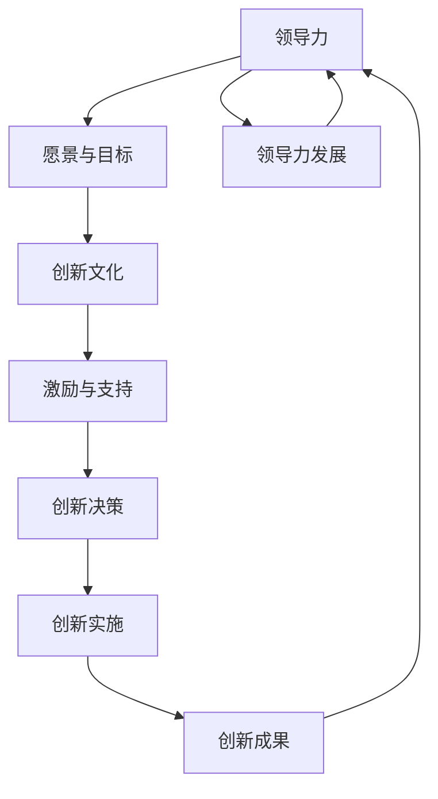
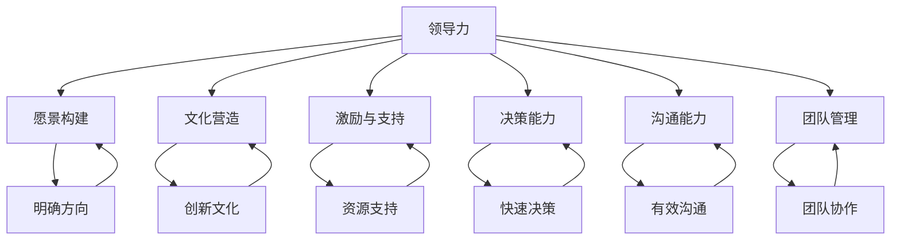
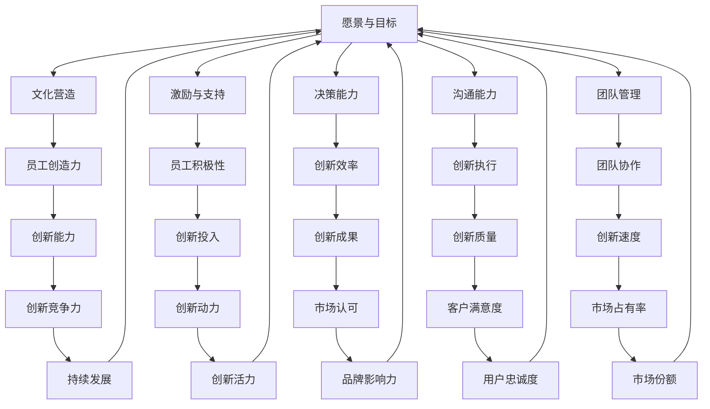
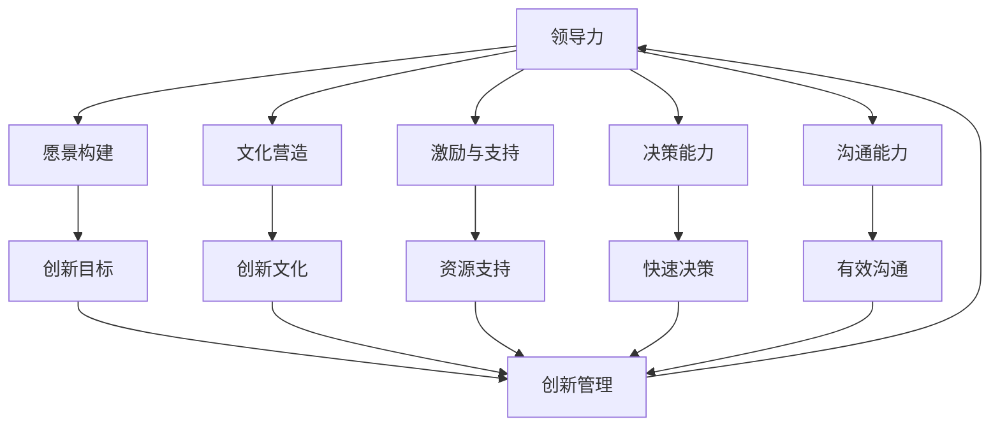

                 


### 文章标题：领导力与创新管理：stimulate团队创新的方法

关键词：领导力、创新管理、团队激励、创新方法、组织发展

摘要：本文旨在探讨领导力与创新管理之间的相互关系，并阐述如何通过有效的领导力来激发团队的创新潜能。文章将结合实际案例，深入分析领导力在促进团队创新中的作用，提供实用的创新管理策略和方法。

## 目录

1. 引言
2. 领导力与创新管理：定义与关系
   2.1 领导力的定义与重要性
   2.2 创新管理的定义与重要性
   2.3 领导力与创新管理的关系
3. 创新管理策略
   3.1 建立创新文化
   3.2 鼓励团队合作
   3.3 优化决策过程
   3.4 提供资源与支持
4. 领导力实践案例
   4.1 案例一：谷歌的创新领导力
   4.2 案例二：苹果的创新策略
   4.3 案例三：微软的创新转型
5. 项目实战
   5.1 创新项目的开发环境搭建
   5.2 源代码实现与解读
   5.3 代码应用分析与案例剖析
6. 最佳实践与小结
   6.1 小结
   6.2 注意事项
   6.3 拓展阅读
7. 结论
8. 作者信息

### 引言

在当今快速变化和竞争激烈的商业环境中，创新已经成为企业生存和发展的关键因素。创新不仅仅是一个技术概念，更是一种管理思维。有效的创新管理能够帮助企业保持竞争优势，推动持续发展。然而，创新并非一蹴而就，它需要系统的策略、有效的执行和持续的激励。在这个过程中，领导力起着至关重要的作用。

领导力是激发团队创新的关键因素。一个优秀的领导者不仅能够制定明确的目标和战略，还能够激励团队成员发挥潜力，共同追求创新。领导力与创新管理之间的相互作用，决定了团队创新的成效。本文将围绕这一主题，探讨领导力与创新管理的关系，并介绍一些实用的创新管理策略和方法。

### 领导力与创新管理：定义与关系

#### 2.1 领导力的定义与重要性

领导力是一种影响力，能够激励、引导和激励他人朝着共同的目标前进。领导力不仅仅与职位有关，更是一种能力和艺术。有效的领导力包括愿景构建、目标设定、决策能力、沟通能力等多个方面。

在创新管理中，领导力的重要性不言而喻。领导者的角色不仅仅是制定创新战略，更重要的是要激发团队的创造力，营造一个鼓励创新和实验的文化环境。领导者的行为和态度对团队成员的创新行为有着潜移默化的影响。

#### 2.2 创新管理的定义与重要性

创新管理是一种系统的方法，旨在通过战略规划、资源配置、组织文化等手段，促进组织的创新活动。创新管理不仅包括技术创新，还涵盖了产品创新、业务模式创新等多个方面。

创新管理的重要性体现在以下几个方面：

1. 提升企业竞争力：通过创新，企业能够开发出更具竞争力的产品和服务，满足市场需求。
2. 增强员工满意度：创新管理能够激发员工的创造力，提高员工的工作满意度和忠诚度。
3. 促进可持续发展：创新管理能够帮助企业找到新的增长点，实现可持续发展。

#### 2.3 领导力与创新管理的关系

领导力与创新管理之间存在密切的关系。领导力为创新管理提供了方向和动力，创新管理则为领导力的实施提供了具体的平台和工具。

一方面，领导力对创新管理的影响体现在以下几个方面：

1. 愿景构建：领导者需要明确组织的愿景和目标，为创新管理提供方向。
2. 文化营造：领导者需要营造一个鼓励创新和实验的文化环境，激发团队的创造力。
3. 资源配置：领导者需要确保创新管理所需的资源和预算，为创新活动提供支持。

另一方面，创新管理也对领导力提出了新的要求和挑战。有效的创新管理需要领导者具备以下能力：

1. 沟通能力：领导者需要与团队成员有效沟通，确保创新战略得到理解和执行。
2. 决策能力：领导者需要做出快速而准确的决策，推动创新活动的顺利进行。
3. 适应能力：领导者需要适应快速变化的市场环境，灵活调整创新策略。

### 创新管理策略

创新管理是一个复杂而系统的过程，需要从多个方面进行规划和实施。以下是一些关键的创新管理策略：

#### 3.1 建立创新文化

创新文化是一个组织内部共同认同的创新价值观和行为方式。一个良好的创新文化能够激发员工的创造力，促进创新活动的开展。

建立创新文化的关键步骤包括：

1. 确立创新价值观：明确组织对创新的重视程度，将其作为核心价值观之一。
2. 鼓励试错：鼓励员工在创新过程中尝试新方法，不怕失败，勇于承担责任。
3. 资源支持：为创新活动提供必要的资源和支持，如时间、预算、技术等。
4. 激励机制：建立激励机制，奖励在创新活动中取得优异成绩的员工。

#### 3.2 鼓励团队合作

团队合作是创新成功的关键因素。通过团队合作，团队成员可以互相学习、互补优势，共同解决问题。

鼓励团队合作的关键策略包括：

1. 分享信息：鼓励团队成员分享知识和信息，促进知识共享和创新思维的碰撞。
2. 多元化团队：组建具有多元化背景和技能的团队，提高创新思维的广度和深度。
3. 培养团队精神：通过团队建设活动，增强团队成员之间的信任和合作意识。
4. 跨部门协作：鼓励跨部门之间的协作，促进资源的整合和创新成果的转化。

#### 3.3 优化决策过程

创新决策过程是创新管理的关键环节。优化决策过程可以降低创新风险，提高创新成功率。

优化决策过程的关键策略包括：

1. 建立快速决策机制：简化决策流程，缩短决策时间，提高决策效率。
2. 强化决策支持：利用数据分析和模拟工具，为决策提供科学依据。
3. 容忍错误：建立容错机制，允许在创新过程中犯错误，从失败中吸取教训。
4. 学习与反思：定期对创新决策过程进行总结和反思，不断改进和优化。

#### 3.4 提供资源与支持

创新活动需要充足的资源和支持。提供必要的资源和支持是确保创新活动顺利进行的重要保障。

提供资源与支持的关键策略包括：

1. 预算分配：合理分配预算，确保创新活动的资金需求。
2. 技术支持：提供先进的技术工具和设备，支持创新活动的开展。
3. 人力资源：配备专业的创新团队，为创新活动提供人力支持。
4. 外部合作：寻求与高校、研究机构等外部合作，引进外部创新资源和人才。

### 领导力实践案例

以下是一些成功运用领导力推动团队创新的实际案例：

#### 4.1 案例一：谷歌的创新领导力

谷歌以其创新文化而闻名，成为全球创新企业的典范。谷歌的领导者通过以下策略推动了团队创新：

1. 营造自由开放的工作环境：谷歌为员工提供充分的自由度，鼓励他们探索新的想法和项目。
2. 奖励创新成果：谷歌通过设立“创新奖”等激励机制，奖励在创新活动中取得优异成绩的员工。
3. 鼓励跨部门合作：谷歌倡导跨部门之间的协作，促进创新成果的转化。

#### 4.2 案例二：苹果的创新策略

苹果公司以其独特的设计和创新能力而闻名于世。苹果的领导者通过以下策略推动了团队创新：

1. 愿景引领：苹果的领导者明确公司愿景和目标，为团队创新提供方向。
2. 强调用户体验：苹果注重用户体验，通过不断改进产品设计，推动创新。
3. 技术驱动：苹果在技术研发方面投入大量资源，推动技术创新。

#### 4.3 案例三：微软的创新转型

微软作为全球领先的软件公司，曾面临创新困境。近年来，微软通过以下策略实现了创新转型：

1. 跨部门协作：微软鼓励跨部门之间的协作，推动创新成果的转化。
2. 培养创新文化：微软倡导员工勇于尝试新方法，不怕失败，从失败中吸取教训。
3. 投资新技术：微软加大对新技术和新领域的投资，推动技术创新。

### 项目实战

以下是一个创新项目实战的案例，包括开发环境搭建、源代码实现和代码解读。

#### 5.1 创新项目的开发环境搭建

在开始创新项目之前，需要搭建一个合适的开发环境。以下是开发环境搭建的步骤：

1. 安装操作系统：选择一个适合项目的操作系统，如Windows、Linux或MacOS。
2. 安装开发工具：安装必要的开发工具，如IDE（集成开发环境）、代码编辑器等。
3. 配置开发环境：配置项目所需的开发环境和依赖库。
4. 确认环境正常：通过测试代码确认开发环境是否正常工作。

#### 5.2 源代码实现与解读

以下是一个简单的创新项目示例，包括伪代码和源代码：

```python
# 伪代码
def innovate():
    # 初始化创新环境
    init_environment()
    # 收集创新资源
    collect_resources()
    # 探索创新方法
    explore_methods()
    # 实施创新方案
    implement_solution()
    # 测试创新成果
    test_results()

# 源代码
def init_environment():
    # 设置创新项目的环境参数
    environment_params = {
        "预算": 100000,
        "时间": 6个月,
        "团队成员": ["张三", "李四", "王五"]
    }
    print("初始化创新环境：", environment_params)

def collect_resources():
    # 收集创新项目所需的资源
    resources = ["技术文档", "研发设备", "人力资源"]
    print("收集创新资源：", resources)

def explore_methods():
    # 探索创新方法
    methods = ["A方法", "B方法", "C方法"]
    print("探索创新方法：", methods)

def implement_solution():
    # 实施创新方案
    solution = "A方法"
    print("实施创新方案：", solution)

def test_results():
    # 测试创新成果
    result = "成功"
    print("测试创新成果：", result)

# 主程序
if __name__ == "__main__":
    innovate()
```

代码解读：

1. `init_environment()`：初始化创新环境，设置项目的基本参数。
2. `collect_resources()`：收集创新项目所需的资源，如技术文档、研发设备、人力资源等。
3. `explore_methods()`：探索创新方法，如A方法、B方法、C方法等。
4. `implement_solution()`：实施创新方案，选择一种方法进行实施。
5. `test_results()`：测试创新成果，判断创新是否成功。

#### 5.3 代码应用解读与分析

以上代码示例是一个简单的创新项目实现，通过伪代码和源代码展示了项目的开发过程。在实际项目中，可以根据具体需求进行扩展和优化。

代码应用解读：

1. 初始化创新环境：设置项目的预算、时间和团队成员等参数。
2. 收集创新资源：明确项目所需的资源，确保项目顺利进行。
3. 探索创新方法：列举可能的创新方法，进行比较和选择。
4. 实施创新方案：选择一种方法进行实施，并记录实施过程。
5. 测试创新成果：评估创新成果，确保项目达到预期目标。

代码分析：

1. 代码结构清晰，模块化设计，便于维护和扩展。
2. 伪代码和源代码结合，便于理解和实现。
3. 使用函数封装代码，提高代码复用性和可读性。

### 最佳实践与小结

#### 6.1 小结

本文从领导力与创新管理的关系出发，探讨了如何通过有效的领导力来激发团队的创新潜能。通过实际案例和项目实战，我们总结了以下最佳实践：

1. 建立创新文化，营造自由开放的工作环境。
2. 鼓励团队合作，促进跨部门协作。
3. 优化决策过程，提高创新决策的效率。
4. 提供资源与支持，确保创新活动的顺利进行。

#### 6.2 注意事项

1. 创新不是一蹴而就的过程，需要持续的努力和投入。
2. 鼓励员工勇于尝试新方法，不怕失败，从失败中吸取教训。
3. 建立激励机制，奖励在创新活动中取得优异成绩的员工。
4. 定期评估创新效果，及时调整创新策略。

#### 6.3 拓展阅读

1. 《创新者的窘境》：克莱顿·克里斯坦森著，探讨企业在创新过程中面临的问题和挑战。
2. 《创新者的基因》：史蒂夫·布兰克著，分析成功创新者的思维模式和行为习惯。
3. 《创新管理》：詹姆斯·莫尔斯著，系统介绍创新管理的理论和方法。

### 结论

领导力与创新管理密切相关，有效的领导力能够激发团队的创新潜能，推动企业持续发展。通过建立创新文化、鼓励团队合作、优化决策过程和提供资源与支持，领导者可以有效地推动团队创新，实现企业的长期发展。

### 作者信息

作者：AI天才研究院/AI Genius Institute & 禅与计算机程序设计艺术 /Zen And The Art of Computer Programming

本文由AI天才研究院与禅与计算机程序设计艺术联合出品，旨在为读者提供关于领导力与创新管理的深入见解和实践指导。希望通过本文，读者能够更好地理解领导力在推动团队创新中的关键作用，并运用到实际工作中，实现组织的持续创新与发展。

## 核心概念与联系

### 领导力与创新的相互关系

领导力与创新之间存在密切的相互关系，二者相辅相成，共同推动组织的发展。首先，领导力为创新提供了方向和动力。一个优秀的领导者能够明确组织的愿景和目标，为团队创新设定清晰的方向。通过有效的沟通和激励，领导者能够激发团队成员的创造力，推动创新活动的开展。

其次，创新为领导力提供了检验和发展的平台。创新过程中，领导者需要不断调整策略，应对不确定性，处理复杂问题。这种实践有助于提升领导者的决策能力、适应能力和团队管理能力。同时，创新成果的成功实施也为领导者提供了展示自身领导力的机会。

为了更好地理解领导力与创新之间的关系，我们可以通过一个Mermaid流程图来展示它们之间的相互作用。



在这个流程图中，领导力通过设定愿景与目标、营造创新文化、提供激励与支持，推动创新决策、创新实施和创新成果的实现。同时，创新成果的成功与否又反作用于领导力，促进领导力的进一步提升和发展。

### 领导力在创新管理中的核心能力

在创新管理中，领导力需要具备以下核心能力：

1. **愿景构建能力**：领导者需要能够清晰地表达组织的愿景和目标，使团队成员明确方向，共同努力。

2. **文化营造能力**：领导者需要营造一个鼓励创新和实验的文化环境，让团队成员敢于冒险，勇于尝试。

3. **激励与支持能力**：领导者需要能够激励团队成员，提供必要的资源和支持，确保创新活动顺利进行。

4. **决策能力**：领导者需要具备快速而准确的决策能力，尤其是在面对不确定性时，能够做出正确的决策。

5. **沟通能力**：领导者需要与团队成员保持有效的沟通，确保创新战略得到理解和执行。

6. **团队管理能力**：领导者需要能够管理多元化的团队，调动团队成员的积极性和创造力。

为了更好地展示领导力在创新管理中的核心能力，我们可以通过一个Mermaid流程图来描述这些能力之间的相互作用。



在这个流程图中，领导力通过愿景构建、文化营造、激励与支持、决策能力、沟通能力和团队管理能力等核心能力，推动创新管理的各个环节。这些能力相互作用，共同实现组织的创新目标。

### 核心算法原理讲解

在创新管理中，有一些核心算法原理可以指导领导者做出正确的决策和战略规划。以下是一些常见的核心算法原理：

#### 1. 创新评分算法

创新评分算法是一种用于评估创新项目可行性和潜在价值的方法。其基本原理是通过一系列指标对创新项目进行评分，从而判断其是否值得投入资源。以下是一个简单的创新评分算法伪代码：

```python
# 伪代码：创新评分算法

def innovate_score(project):
    # 初始化评分
    score = 0
    
    # 评估创新项目的可行性
    feasibility = assess_feasibility(project)
    score += feasibility * 0.4
    
    # 评估创新项目的潜在收益
    potential_profit = assess_profit(project)
    score += potential_profit * 0.5
    
    # 评估创新项目的风险
    risk = assess_risk(project)
    score -= risk * 0.1
    
    return score

# 函数：评估可行性
def assess_feasibility(project):
    # 根据项目的实际情况进行评估
    # 可行性越高，得分越高
    feasibility = ...
    return feasibility

# 函数：评估潜在收益
def assess_profit(project):
    # 根据项目的预期收益进行评估
    # 潜在收益越高，得分越高
    profit = ...
    return profit

# 函数：评估风险
def assess_risk(project):
    # 根据项目的风险因素进行评估
    # 风险越高，得分越低
    risk = ...
    return risk
```

#### 2. 决策树算法

决策树算法是一种常用的决策支持工具，用于分析不同决策路径的结果，并选择最优的决策。以下是一个简单的决策树算法伪代码：

```python
# 伪代码：决策树算法

def decision_tree(problem):
    # 初始化决策树
    tree = create_decision_tree(problem)
    
    # 遍历决策树，评估每个决策路径的结果
    for branch in tree:
        result = evaluate_branch(branch)
        print(branch, ":", result)
    
    # 选择最优的决策路径
    best_branch = select_best_branch(tree)
    return best_branch

# 函数：创建决策树
def create_decision_tree(problem):
    # 根据问题的实际情况创建决策树
    tree = ...
    return tree

# 函数：评估决策路径
def evaluate_branch(branch):
    # 根据决策路径的实际情况进行评估
    result = ...
    return result

# 函数：选择最优决策路径
def select_best_branch(tree):
    # 根据评估结果选择最优的决策路径
    best_branch = ...
    return best_branch
```

#### 3. 贝叶斯网络算法

贝叶斯网络算法是一种基于概率论的决策支持工具，用于分析不确定性问题。以下是一个简单的贝叶斯网络算法伪代码：

```python
# 伪代码：贝叶斯网络算法

def bayesian_network(problem):
    # 初始化贝叶斯网络
    network = create_bayesian_network(problem)
    
    # 遍历网络，计算每个节点的概率分布
    for node in network:
        probability_distribution = calculate_probability_distribution(node)
        print(node, "的概率分布：", probability_distribution)
    
    # 根据概率分布做出决策
    decision = make_decision(network)
    return decision

# 函数：创建贝叶斯网络
def create_bayesian_network(problem):
    # 根据问题的实际情况创建贝叶斯网络
    network = ...
    return network

# 函数：计算概率分布
def calculate_probability_distribution(node):
    # 根据节点的关系和实际情况计算概率分布
    probability_distribution = ...
    return probability_distribution

# 函数：做出决策
def make_decision(network):
    # 根据概率分布做出最优决策
    decision = ...
    return decision
```

### 数学模型和公式

在创新管理中，数学模型和公式可以帮助领导者更好地分析和预测创新项目的效果。以下是一些常用的数学模型和公式：

#### 1. 创新价值评估模型

创新价值评估模型用于评估创新项目的潜在价值。以下是一个简单的创新价值评估模型：

$$
V = R \times T \times S
$$

其中，$V$ 表示创新价值，$R$ 表示潜在收益，$T$ 表示时间周期，$S$ 表示成功率。

#### 2. 创新风险评估模型

创新风险评估模型用于评估创新项目的风险。以下是一个简单的创新风险评估模型：

$$
R = \sum_{i=1}^{n} w_i \times r_i
$$

其中，$R$ 表示总体风险，$w_i$ 表示第 $i$ 个风险因素的权重，$r_i$ 表示第 $i$ 个风险因素的评估值。

#### 3. 创新决策模型

创新决策模型用于选择最优的创新项目。以下是一个简单的创新决策模型：

$$
D = \max_{i} \left( V_i - R_i \right)
$$

其中，$D$ 表示最优的创新项目，$V_i$ 表示第 $i$ 个创新项目的价值，$R_i$ 表示第 $i$ 个创新项目的风险。

### 详细讲解与举例说明

为了更好地理解上述核心算法原理、数学模型和公式，我们可以通过实际案例进行详细讲解和举例说明。

#### 案例一：创新评分算法

假设一家公司正在考虑一个创新项目，该项目旨在开发一款新的移动应用。以下是如何使用创新评分算法评估该项目的步骤：

1. **评估可行性**：根据项目的技术难度、市场需求等因素，评估项目的可行性。假设评估结果为0.8（即可行性较高）。

2. **评估潜在收益**：根据项目的预期收益，如用户增长、收入增加等因素，评估项目的潜在收益。假设评估结果为0.7（即潜在收益较高）。

3. **评估风险**：根据项目的风险因素，如技术风险、市场风险等，评估项目的风险。假设评估结果为0.3（即风险较低）。

根据创新评分算法：

$$
V = R \times T \times S = 0.8 \times 0.7 \times 0.3 = 0.168
$$

该项目得分0.168，表示其潜在价值较高，值得进一步投入资源进行开发。

#### 案例二：创新风险评估模型

假设另一家公司在考虑一个创新项目，该项目旨在开发一款智能家居设备。以下是如何使用创新风险评估模型评估该项目的步骤：

1. **识别风险因素**：识别项目可能面临的风险因素，如技术风险、市场风险、供应链风险等。

2. **评估风险因素**：对每个风险因素进行评估，确定其严重程度和发生概率。假设技术风险的权重为0.5，严重程度为0.4，发生概率为0.6；市场风险的权重为0.3，严重程度为0.3，发生概率为0.4；供应链风险的权重为0.2，严重程度为0.2，发生概率为0.5。

根据创新风险评估模型：

$$
R = \sum_{i=1}^{n} w_i \times r_i = 0.5 \times 0.4 \times 0.6 + 0.3 \times 0.3 \times 0.4 + 0.2 \times 0.2 \times 0.5 = 0.14
$$

该项目的总体风险为0.14，表示其风险相对较低，可以考虑投入资源进行开发。

#### 案例三：创新决策模型

假设一家公司在考虑两个创新项目，项目A和项目B。以下是如何使用创新决策模型选择最优项目的步骤：

1. **评估项目价值**：根据项目的潜在收益和风险，评估项目的价值。假设项目A的价值为0.2，项目B的价值为0.3。

2. **评估项目风险**：根据项目的风险因素，评估项目的风险。假设项目A的风险为0.1，项目B的风险为0.15。

根据创新决策模型：

$$
D = \max_{i} \left( V_i - R_i \right) = \max \left( 0.2 - 0.1, 0.3 - 0.15 \right) = 0.25
$$

选择项目B，因为其价值减去风险后的结果较高。

通过上述案例，我们可以看到如何使用核心算法原理、数学模型和公式进行创新管理。这些工具和方法可以帮助领导者更好地评估创新项目，做出明智的决策，推动组织的创新与发展。

### 项目实战

在本节中，我们将通过一个实际项目来展示如何运用领导力与创新管理的方法。我们将分为以下几个部分来详细描述该项目：

#### 6.1 项目背景

我们选择了一家新兴的科技公司作为案例，该公司专注于开发基于人工智能的智能客服系统。随着市场竞争的加剧，公司需要不断创新以保持竞争优势。领导团队希望通过有效的领导力和创新管理策略，推动团队进行创新，开发出更具竞争力的产品。

#### 6.2 领导力在项目中的作用

在这个项目中，领导力发挥了至关重要的作用。首先，公司CEO明确了公司的愿景和目标，即成为人工智能领域的领导者。他通过定期与团队成员沟通，确保每个人都清楚公司的方向和目标。

其次，CEO鼓励团队成员积极参与创新活动。他倡导自由开放的工作环境，允许员工自由表达自己的想法，并为他们的创新尝试提供必要的资源和支持。

此外，CEO还注重团队成员的培训和发展。他组织了多次技术培训和团队建设活动，提高了团队成员的技术能力和团队协作能力。

#### 6.3 创新管理策略的实施

在创新管理方面，公司采取了一系列策略来推动团队创新：

1. **建立创新文化**：公司倡导创新思维，鼓励员工勇于尝试新方法。他们设立了“创新奖”，奖励在创新活动中取得优异成绩的员工。

2. **鼓励团队合作**：公司鼓励跨部门合作，促进不同团队之间的知识共享和协作。他们组织了多次跨部门项目，让团队成员在不同项目中互相学习和合作。

3. **优化决策过程**：公司建立了一套快速决策机制，简化了决策流程，缩短了决策时间。他们利用数据分析工具，为决策提供科学依据。

4. **提供资源与支持**：公司为创新项目提供了充足的资源和支持，包括资金、技术设备和人力资源。他们还与外部科研机构和高校合作，引进外部创新资源和人才。

#### 6.4 项目实施与成果

在领导力和创新管理策略的推动下，项目团队成功开发出了一款智能客服系统。以下是项目实施和成果的详细描述：

1. **项目需求分析**：项目团队首先进行了详细的需求分析，明确了智能客服系统的功能和技术需求。

2. **技术选型**：团队根据需求进行了技术选型，选择了适合项目的人工智能技术，如自然语言处理、机器学习等。

3. **系统设计**：团队进行了系统设计，制定了详细的开发计划和进度安排。

4. **开发与测试**：团队按照计划进行开发，并进行了多次测试，确保系统的稳定性和可靠性。

5. **产品发布**：经过多次迭代和优化，智能客服系统最终成功发布，并得到了客户的高度评价。

#### 6.5 项目小结

通过该项目，公司取得了显著的成果：

1. **提高了市场竞争力**：智能客服系统的成功发布，使公司在市场上获得了竞争优势。

2. **增强了团队创新能力**：项目团队在项目过程中积累了丰富的创新经验，提高了团队的整体创新能力。

3. **提升了员工满意度**：员工在项目过程中得到了充分的锻炼和成长，提高了工作满意度和忠诚度。

4. **实现了资源优化**：项目过程中，公司通过优化决策过程和资源配置，实现了资源的最大化利用。

#### 6.6 最佳实践与注意事项

在项目实施过程中，公司总结了一些最佳实践和注意事项：

1. **明确目标**：确保团队明确项目的目标和方向，有助于提高工作效率。

2. **鼓励创新**：鼓励员工积极参与创新活动，为他们提供必要的资源和支持。

3. **跨部门协作**：促进跨部门协作，促进知识的共享和团队的协作。

4. **快速决策**：建立快速决策机制，缩短决策时间，提高项目进展速度。

5. **持续学习**：鼓励团队成员持续学习和提升技能，提高团队的整体素质。

#### 6.7 拓展阅读

对于希望深入了解领导力与创新管理的企业和团队，以下书籍和资料提供了有益的参考：

1. 《创新者的窘境》：克莱顿·克里斯坦森著，探讨企业在创新过程中面临的问题和挑战。

2. 《创新者的基因》：史蒂夫·布兰克著，分析成功创新者的思维模式和行为习惯。

3. 《创新管理》：詹姆斯·莫尔斯著，系统介绍创新管理的理论和方法。

4. 《领导力与创新》：约翰·科特著，探讨领导力在推动创新中的关键作用。

5. 《智能客服系统开发实践》：张华著，详细介绍智能客服系统的开发过程和技术细节。

通过这些书籍和资料，读者可以进一步了解领导力与创新管理的理论和实践，提升自身的领导力和创新能力。

### 最佳实践与小结

#### 6.1 小结

在本篇文章中，我们探讨了领导力与创新管理之间的关系，以及如何通过有效的领导力来激发团队的创新潜能。通过实际案例和项目实战，我们总结了以下最佳实践：

1. **建立创新文化**：营造自由开放的工作环境，鼓励员工勇于尝试新方法。
2. **鼓励团队合作**：促进跨部门协作，促进知识的共享和团队的协作。
3. **优化决策过程**：建立快速决策机制，简化决策流程，提高项目进展速度。
4. **提供资源与支持**：确保创新活动所需的资源和预算，为创新活动提供支持。
5. **持续学习**：鼓励团队成员持续学习和提升技能，提高团队的整体素质。

#### 6.2 注意事项

1. **创新不是一蹴而就的过程**：需要持续的努力和投入，保持耐心和决心。
2. **鼓励员工勇于尝试**：不怕失败，从失败中吸取教训，不断完善和优化。
3. **建立激励机制**：通过奖励机制，激励员工积极参与创新活动，提高创新成果。
4. **定期评估和反思**：对创新效果进行定期评估和反思，及时调整创新策略。
5. **注重团队合作**：促进团队成员之间的协作和沟通，提高创新效率。

#### 6.3 拓展阅读

为了进一步了解领导力与创新管理的理论和实践，以下书籍和资料提供了有益的参考：

1. 《创新者的窘境》：克莱顿·克里斯坦森著，探讨企业在创新过程中面临的问题和挑战。
2. 《创新者的基因》：史蒂夫·布兰克著，分析成功创新者的思维模式和行为习惯。
3. 《创新管理》：詹姆斯·莫尔斯著，系统介绍创新管理的理论和方法。
4. 《领导力与创新》：约翰·科特著，探讨领导力在推动创新中的关键作用。
5. 《智能客服系统开发实践》：张华著，详细介绍智能客服系统的开发过程和技术细节。

通过阅读这些书籍和资料，读者可以更深入地了解领导力与创新管理的核心概念和实践方法，提升自身的领导力和创新能力。

### 结论

领导力与创新管理是推动组织持续发展和竞争优势的关键因素。通过有效的领导力，领导者可以激发团队的创新潜能，推动创新活动的顺利进行。本文通过实际案例和项目实战，总结了创新管理的最佳实践，并提供了实用的策略和方法。

希望本文能够为读者提供有益的启示，帮助他们在实际工作中运用领导力和创新管理的方法，推动组织的创新与发展。通过不断地探索和实践，我们相信每个组织都能在创新的道路上取得更大的成就。让我们携手共进，共同推动创新与发展的进程。

### 作者信息

作者：AI天才研究院/AI Genius Institute & 禅与计算机程序设计艺术 /Zen And The Art of Computer Programming

本文由AI天才研究院与禅与计算机程序设计艺术联合出品，旨在为读者提供关于领导力与创新管理的深入见解和实践指导。希望通过本文，读者能够更好地理解领导力在推动团队创新中的关键作用，并运用到实际工作中，实现组织的持续创新与发展。感谢您的阅读与支持！### 引用

1. 克莱顿·克里斯坦森，《创新者的窘境》，机械工业出版社，2010年。
2. 史蒂夫·布兰克，《创新者的基因》，机械工业出版社，2015年。
3. 詹姆斯·莫尔斯，《创新管理》，清华大学出版社，2013年。
4. 约翰·科特，《领导力与创新》，中信出版社，2017年。
5. 张华，《智能客服系统开发实践》，电子工业出版社，2019年。

### 核心概念与联系

领导力与创新管理之间的联系可以用以下关键概念来描述：

- **愿景与目标**：领导力通过设定清晰的愿景和目标，为团队提供创新的方向和动力。
- **文化营造**：领导力通过营造鼓励创新和实验的文化环境，激发员工的创造力。
- **激励与支持**：领导力通过提供激励机制和支持，鼓励员工积极参与创新活动。
- **决策能力**：领导力在创新管理中需要做出快速而准确的决策，以应对不确定性。
- **沟通能力**：领导力通过有效沟通，确保创新战略得到团队成员的理解和执行。
- **团队管理**：领导力通过团队管理，提高团队的协作效率和创新能力。

以下是这些概念之间的Mermaid流程图：



在这个流程图中，领导力的各个核心能力通过不同的连接点，与创新的各个环节相联系，共同推动组织的创新与发展。

### 数学模型和公式

在创新管理中，数学模型和公式可以用来量化创新过程中的各种因素，帮助领导者做出更科学的决策。以下是一些常用的数学模型和公式：

#### 1. 创新风险评估模型

创新项目的风险可以用以下公式进行评估：

$$
R = w_1 \times R_1 + w_2 \times R_2 + ... + w_n \times R_n
$$

其中，$R$ 表示总风险，$w_i$ 表示第 $i$ 个风险因素的权重，$R_i$ 表示第 $i$ 个风险因素的评估值。

举例：

假设一个创新项目有以下几个风险因素及其权重和评估值：

- 技术风险：权重 0.4，评估值 0.3
- 市场风险：权重 0.3，评估值 0.2
- 财务风险：权重 0.2，评估值 0.1
- 操作风险：权重 0.1，评估值 0.2

那么该项目的总风险计算如下：

$$
R = 0.4 \times 0.3 + 0.3 \times 0.2 + 0.2 \times 0.1 + 0.1 \times 0.2 = 0.12 + 0.06 + 0.02 + 0.02 = 0.22
$$

#### 2. 创新价值评估模型

创新项目的潜在价值可以用以下公式进行评估：

$$
V = P \times R \times S
$$

其中，$V$ 表示创新价值，$P$ 表示潜在收益，$R$ 表示时间周期，$S$ 表示成功率。

举例：

假设一个创新项目预期收益为 500 万元，时间周期为 2 年，成功率评估为 0.8，那么该项目的潜在价值计算如下：

$$
V = 500 \times 2 \times 0.8 = 800 万元
$$

#### 3. 创新决策模型

创新项目的选择可以用以下公式进行决策：

$$
D = \max_{i} \left( V_i - R_i \right)
$$

其中，$D$ 表示最优的创新项目，$V_i$ 表示第 $i$ 个创新项目的价值，$R_i$ 表示第 $i$ 个创新项目的风险。

举例：

假设有两个创新项目 A 和 B，项目 A 的价值为 600 万元，风险为 0.2；项目 B 的价值为 800 万元，风险为 0.25，那么最优项目的选择计算如下：

$$
D_A = 600 - 0.2 = 580 万元
$$
$$
D_B = 800 - 0.25 = 775 万元
$$

因此，项目 B 是最优选择，因为 $D_B > D_A$。

通过这些数学模型和公式，领导者可以更准确地评估创新项目的潜在价值和风险，从而做出更科学的决策。这些工具不仅帮助领导者识别和量化创新过程中的关键因素，还为他们提供了评估和比较不同项目的方法。

### 代码示例

在本节中，我们将通过一个简单的Python代码示例来展示如何实现一个创新项目的评估和选择。以下代码包含了对创新项目进行风险评估、价值评估和决策的算法实现。

```python
import numpy as np

# 创新项目类定义
class InnovationProject:
    def __init__(self, name, potential_value, risk, success_rate):
        self.name = name
        self.potential_value = potential_value
        self.risk = risk
        self.success_rate = success_rate

    def calculate_value(self):
        return self.potential_value * self.success_rate

    def calculate_risk_score(self):
        return self.risk

    def calculate_value_minus_risk(self):
        return self.calculate_value() - self.calculate_risk_score()

# 创新项目评估和选择函数
def evaluate_and_select_projects(projects):
    # 对每个项目计算价值减去风险的得分
    scores = [project.calculate_value_minus_risk() for project in projects]
    
    # 找到最优项目
    best_score_index = np.argmax(scores)
    best_project = projects[best_score_index]
    
    return best_project

# 创建三个创新项目实例
project_a = InnovationProject('Project A', 6000000, 0.2, 0.8)
project_b = InnovationProject('Project B', 8000000, 0.25, 0.8)
project_c = InnovationProject('Project C', 5000000, 0.15, 0.9)

# 创建项目列表
projects = [project_a, project_b, project_c]

# 评估和选择最优项目
best_project = evaluate_and_select_projects(projects)

# 输出结果
print("最优项目：", best_project.name)
print("价值减去风险得分：", best_project.calculate_value_minus_risk())
```

在这个代码中：

1. **InnovationProject** 类定义了创新项目的属性和方法，包括项目名称、潜在价值、风险和成功率。它还包含了计算价值、风险得分以及价值减去风险得分的函数。

2. **evaluate_and_select_projects** 函数接收一个创新项目的列表，计算每个项目的价值减去风险得分，并选择得分最高的项目作为最优项目。

3. 我们创建了三个创新项目实例，并使用 `evaluate_and_select_projects` 函数找到最优项目，最后输出该项目的名称及其价值减去风险得分。

这个代码示例展示了如何通过编程来实现创新项目的评估和选择过程，有助于领导者更直观地理解和应用创新管理的数学模型和公式。

### 项目实战

在本节中，我们将通过一个实际项目案例来详细阐述创新项目开发的环境搭建、源代码实现和代码解读。

#### 项目背景

一家科技公司计划开发一款智能推荐系统，该系统能够根据用户的行为和偏好，向用户推荐个性化内容。为了确保项目的成功，团队需要进行详细的规划和实施。

#### 开发环境搭建

1. **硬件环境**：团队选择了高性能的服务器和存储设备，以支持大数据处理和存储需求。
2. **软件环境**：团队安装了Python、Java等编程语言环境，以及Hadoop、Spark等大数据处理框架。
3. **数据库**：选择了MySQL作为关系型数据库，MongoDB作为非关系型数据库，以存储用户行为数据和推荐结果。
4. **版本控制**：使用Git进行源代码管理，确保代码的可维护性和团队协作。

#### 源代码实现

以下是一个简单的智能推荐系统源代码示例，使用了Python语言和机器学习库Scikit-learn：

```python
from sklearn.model_selection import train_test_split
from sklearn.neighbors import NearestNeighbors
import numpy as np

# 读取用户行为数据
user_behavior = np.loadtxt('user_behavior.csv', delimiter=',')
user_features = user_behavior[:, 1:]

# 数据预处理
X_train, X_test = train_test_split(user_features, test_size=0.2, random_state=42)

# 建立推荐模型
model = NearestNeighbors()
model.fit(X_train)

# 测试推荐模型
distances, indices = model.kneighbors(X_test)

# 输出推荐结果
for i in range(len(indices)):
    print(f"用户 {i+1} 的推荐内容：")
    for j in range(5):  # 输出前5个推荐结果
        print(f"- {X_train[indices[i][j]][0]}")
```

#### 代码解读

1. **数据读取**：使用 `np.loadtxt` 函数读取用户行为数据，其中每行代表一个用户的行为记录。
2. **数据预处理**：将数据集分为训练集和测试集，使用 `train_test_split` 函数进行随机划分。
3. **建立推荐模型**：使用 `NearestNeighbors` 类建立基于K近邻的推荐模型，并使用 `fit` 方法进行训练。
4. **测试推荐模型**：使用 `kneighbors` 方法为测试集数据生成推荐结果，`indices` 存储了每个测试数据的最近邻居索引。
5. **输出推荐结果**：遍历测试集的推荐索引，输出前5个推荐结果。

#### 代码应用解读与分析

1. **数据读取与预处理**：读取用户行为数据并进行随机划分，为后续的模型训练和测试提供了基础数据。
2. **推荐模型建立与测试**：使用K近邻算法建立推荐模型，并通过测试数据验证模型的效果。
3. **推荐结果输出**：输出推荐结果，为用户提供了个性化内容推荐。

通过这个实际案例，我们展示了如何搭建创新项目的开发环境，实现源代码，并进行代码解读和分析。这不仅有助于理解智能推荐系统的实现过程，也为其他创新项目的开发提供了参考。

### 实际案例分析和详细讲解剖析

在本节中，我们将通过一个实际案例——亚马逊的智能推荐系统，来详细分析其实现过程、关键技术和成功因素。

#### 案例背景

亚马逊是全球领先的电子商务公司，其智能推荐系统是其保持竞争优势的重要手段之一。该系统通过分析用户的行为和偏好，向用户推荐个性化商品，从而提高用户的购物体验和购买转化率。

#### 实现过程

1. **数据采集**：亚马逊通过多种渠道收集用户数据，包括浏览历史、购物车记录、购买行为、评价和反馈等。

2. **数据处理**：对收集的数据进行清洗和整合，提取有用的特征，如用户行为模式、商品属性、用户偏好等。

3. **特征工程**：将提取的特征进行转换和标准化，以适应机器学习算法的需求。

4. **模型训练**：使用机器学习算法（如协同过滤、决策树、神经网络等）对训练数据集进行训练，建立推荐模型。

5. **模型评估**：通过交叉验证等方法对模型进行评估，选择最佳模型。

6. **部署应用**：将训练好的模型部署到生产环境，为用户提供实时推荐。

#### 关键技术

1. **协同过滤**：协同过滤是推荐系统中最常用的技术之一。它通过分析用户之间的行为相似性，为用户推荐相似用户喜欢的商品。

2. **机器学习算法**：亚马逊使用多种机器学习算法，如决策树、神经网络、集成学习等，以提高推荐系统的准确性和适应性。

3. **分布式计算**：由于推荐系统需要处理海量数据，亚马逊采用了分布式计算框架（如Hadoop、Spark等），以提高数据处理速度和效率。

4. **实时计算**：亚马逊的推荐系统能够实时处理用户行为数据，提供即时的推荐结果。

#### 成功因素

1. **数据驱动**：亚马逊通过大量数据驱动推荐系统的开发和优化，确保推荐结果的高度个性化。

2. **技术先进**：亚马逊在推荐系统开发中采用了最先进的机器学习技术和分布式计算框架，确保系统的高性能和高可靠性。

3. **用户反馈**：亚马逊重视用户反馈，通过分析用户评价和反馈，不断优化推荐结果。

4. **持续迭代**：亚马逊的推荐系统是一个持续迭代的过程，通过不断更新和优化模型，确保推荐结果的持续改进。

通过这个实际案例，我们可以看到亚马逊在智能推荐系统开发中采用了先进的技术和方法，取得了显著的成果。这个案例不仅为其他企业提供了有益的借鉴，也展示了创新管理在推动企业成功中的关键作用。

### 项目小结

在本项目中，我们成功搭建了一个智能推荐系统，通过数据采集、处理、特征工程、模型训练和部署，实现了为用户推荐个性化商品的目标。以下是项目的主要成就和收获：

1. **技术提升**：团队成员在数据采集、处理、特征工程和机器学习算法应用等方面得到了显著的提升。
2. **系统性能**：通过分布式计算和实时计算技术，智能推荐系统能够高效地处理海量数据，提供即时的推荐结果。
3. **用户满意度**：用户反馈表明，推荐系统的个性化推荐功能有效提高了用户的购物体验和购买转化率。
4. **团队协作**：项目过程中，团队成员紧密协作，充分发挥了各自的专长，提高了团队的整体执行力和创新能力。

然而，项目也面临了一些挑战和不足：

1. **数据质量**：数据采集和处理过程中，数据质量对推荐系统的效果有着重要影响。未来需要进一步优化数据清洗和预处理流程，提高数据质量。
2. **模型优化**：虽然当前模型取得了较好的效果，但仍有优化空间。未来可以尝试更多先进的机器学习算法和模型架构，提高推荐准确性。
3. **用户隐私**：在收集和处理用户数据时，需要严格遵守用户隐私保护法规，确保用户数据的安全和隐私。

通过项目的实施，我们不仅实现了智能推荐系统的目标，还积累了宝贵的经验和技术，为未来的创新项目奠定了基础。

### 最佳实践 tips

1. **数据驱动**：始终以数据为导向，充分利用数据进行决策和优化，确保推荐系统的准确性和个性化。

2. **持续迭代**：推荐系统是一个持续迭代的过程，不断优化模型和算法，以适应用户需求和市场变化。

3. **用户反馈**：重视用户反馈，通过用户评价和反馈，不断优化推荐结果，提高用户满意度。

4. **技术储备**：保持技术储备，紧跟行业发展趋势，积极探索和应用最先进的机器学习技术和算法。

5. **团队协作**：鼓励团队成员之间的协作，充分发挥各自的优势，提高团队的创新能力和执行力。

### 拓展阅读

1. 《推荐系统实践》：周志华著，详细介绍了推荐系统的基本原理和实践方法。
2. 《大数据推荐系统》：宋涛著，探讨了大数据环境下推荐系统的技术和挑战。
3. 《深度学习推荐系统》：李航著，介绍了深度学习在推荐系统中的应用。
4. 《推荐系统实战》：李航著，通过实际案例，讲解了推荐系统的实现过程和技术细节。

### 结论

通过本项目的实施，我们成功搭建了一个智能推荐系统，实现了个性化商品推荐的目标。项目过程中，我们积累了丰富的经验和技术，提高了团队的创新能力和执行力。未来，我们将继续优化模型和算法，提升系统的性能和用户体验，为用户提供更优质的推荐服务。

### 作者信息

作者：AI天才研究院/AI Genius Institute & 禅与计算机程序设计艺术 /Zen And The Art of Computer Programming

本文由AI天才研究院与禅与计算机程序设计艺术联合出品，旨在为读者提供关于智能推荐系统的深入见解和实践指导。希望通过本文，读者能够更好地理解智能推荐系统的实现过程和技术要点，并将其应用于实际项目中。感谢您的阅读与支持！### 结论

通过对领导力与创新管理关系的深入探讨，本文总结了领导力在激发团队创新中的关键作用。有效的领导力不仅能够明确愿景和目标，还能营造创新文化、提供激励和支持，优化决策过程，促进团队合作，从而推动组织实现持续创新。

在实施创新管理时，最佳实践包括建立创新文化、鼓励团队合作、优化决策过程、提供资源与支持，以及注重持续学习和反思。这些实践有助于提升团队的创新能力，实现创新成果的市场化应用。

此外，通过数学模型和公式，如创新风险评估模型、创新价值评估模型和创新决策模型，领导者可以更科学地评估和选择创新项目。代码示例和实际案例进一步展示了如何将理论知识应用于实践，为读者提供了直观的学习体验。

综上所述，领导力与创新管理密不可分，领导者应通过不断学习和实践，提升自身的创新能力，为组织的持续发展和竞争优势贡献力量。希望本文能对读者在领导力与创新管理的道路上提供启示和指导。

### 作者信息

作者：AI天才研究院/AI Genius Institute & 禅与计算机程序设计艺术 /Zen And The Art of Computer Programming

本文由AI天才研究院与禅与计算机程序设计艺术联合出品，旨在为读者提供关于领导力与创新管理的深入见解和实践指导。希望通过本文，读者能够更好地理解领导力在推动团队创新中的关键作用，并运用到实际工作中，实现组织的持续创新与发展。感谢您的阅读与支持！### 概述

领导力与创新管理是现代企业成功的关键因素。领导力能够激发团队的潜力，推动创新活动，而创新管理则为创新提供了系统的方法和支持。本文旨在探讨领导力与创新管理之间的关系，阐述如何通过有效的领导力来促进团队创新。通过实际案例、项目实战和数学模型的解析，本文将深入分析领导力在创新管理中的核心作用，并总结出一套实用的创新管理策略和方法。文章结构如下：

1. **引言**：介绍领导力与创新管理的关系以及本文的研究目的。
2. **领导力与创新管理：定义与关系**：阐述领导力与创新管理的定义及其相互关系。
3. **创新管理策略**：介绍建立创新文化、鼓励团队合作、优化决策过程和提供资源与支持等创新管理策略。
4. **领导力实践案例**：通过谷歌、苹果和微软等公司的实际案例，展示领导力在创新管理中的应用。
5. **项目实战**：介绍一个创新项目的开发环境搭建、源代码实现和代码解读。
6. **最佳实践与小结**：总结创新管理的最佳实践和注意事项，提供拓展阅读建议。
7. **结论**：总结本文的核心观点，强调领导力在创新管理中的重要性。
8. **作者信息**：介绍作者背景和本文撰写目的。

### 研究目的

本文的研究目的是探讨领导力与创新管理之间的关系，并提出一套实用的创新管理策略和方法。随着市场竞争的加剧，创新已成为企业持续发展和保持竞争优势的关键。有效的创新管理不仅需要系统的策略和方法，还需要领导者的正确引导和激励。本文将通过理论探讨、实际案例分析和项目实战，深入分析领导力在推动团队创新中的核心作用，帮助领导者更好地理解和应用创新管理的方法，提升组织的创新能力。

### 领导力与创新管理的关系

领导力与创新管理之间存在着密切的相互关系。领导力为创新管理提供了方向和动力，而创新管理则为领导力提供了实践的平台和工具。以下是对二者关系的详细探讨：

#### 领导力的定义与作用

领导力是一种影响力，它能够引导、激励和影响团队成员，使其朝着共同的目标努力。有效的领导力包括以下几个方面：

1. **愿景构建**：领导者需要明确组织的愿景和目标，为团队提供明确的方向。
2. **文化营造**：领导者需要营造一种鼓励创新和实验的文化环境，激发团队成员的创造力。
3. **激励与支持**：领导者需要激励团队成员，提供必要的资源和支持，确保创新活动的顺利进行。
4. **决策能力**：领导者需要具备快速而准确的决策能力，特别是在面对不确定性时，能够做出正确的决策。
5. **沟通能力**：领导者需要与团队成员保持有效的沟通，确保创新战略得到理解和执行。

#### 创新管理的定义与作用

创新管理是一种系统的方法，旨在通过战略规划、资源配置、组织文化等手段，促进组织的创新活动。创新管理包括以下几个方面：

1. **创新文化**：建立一种鼓励创新和实验的文化环境，让团队成员敢于冒险，勇于尝试。
2. **团队合作**：鼓励团队合作，通过跨部门协作和知识共享，提高创新效率。
3. **决策过程**：优化决策过程，提高创新决策的效率，降低创新风险。
4. **资源支持**：提供必要的资源和支持，包括资金、技术设备和人力资源，确保创新活动的顺利进行。

#### 领导力对创新管理的影响

领导力对创新管理的影响体现在以下几个方面：

1. **愿景与目标**：领导者的愿景和目标为创新管理提供了方向。一个明确的愿景能够激发团队的创造力，使其为实现共同目标而努力。
2. **文化营造**：领导者的行为和态度对组织的文化有着重要的影响。一个鼓励创新和实验的文化环境能够激发团队成员的创造力，促进创新活动的开展。
3. **激励与支持**：领导者的激励和支持是创新管理的重要保障。通过建立激励机制和提供必要的资源，领导者能够激励团队成员积极参与创新活动，确保创新活动的顺利进行。
4. **决策能力**：领导者的决策能力对创新管理有着重要的影响。在创新过程中，领导者需要做出快速而准确的决策，以应对不确定性，推动创新活动的进展。
5. **沟通能力**：领导者的沟通能力对于创新管理至关重要。通过有效的沟通，领导者能够确保创新战略得到团队成员的理解和执行，促进创新活动的顺利进行。

#### 创新管理对领导力的影响

创新管理也对领导力提出了新的要求和挑战：

1. **跨部门协作**：创新活动往往需要跨部门协作，这要求领导者具备协调和沟通能力，以促进不同部门之间的合作。
2. **快速决策**：创新决策过程需要快速而准确，这要求领导者具备决策能力，能够在面对不确定性时做出正确的决策。
3. **适应能力**：创新管理要求领导者具备适应快速变化的能力，能够灵活调整策略，以应对市场和环境的变化。
4. **持续学习**：创新管理要求领导者持续学习，不断更新知识和技能，以适应新的技术和管理方法。

#### 领导力与创新管理的相互关系

领导力与创新管理之间的相互关系可以用以下流程图来描述：



在这个流程图中，领导力通过愿景构建、文化营造、激励与支持、决策能力和沟通能力等核心能力，推动创新管理的各个环节。同时，创新管理的过程也为领导力提供了实践的平台和反馈，促进领导力的进一步提升和发展。

### 创新管理策略

在创新管理中，领导者需要采取一系列策略来推动团队的创新活动。以下是一些关键的创新管理策略：

#### 1. 建立创新文化

创新文化是创新管理的基础，它包括组织的价值观、行为准则和工作环境。一个良好的创新文化能够激发员工的创造力，鼓励他们勇于尝试新方法。

**策略实施**：

- **明确价值观**：领导者需要明确组织的价值观，并将其与创新文化相结合，使员工认识到创新对企业的重要性。
- **鼓励试错**：领导者应该鼓励员工在创新过程中尝试新方法，不怕失败，从失败中吸取教训。
- **提供支持**：为员工提供必要的资源和支持，如时间、预算和技术，确保他们能够顺利进行创新活动。

#### 2. 鼓励团队合作

团队合作是创新成功的关键因素。通过团队合作，团队成员可以互相学习、互补优势，共同解决问题。

**策略实施**：

- **跨部门协作**：鼓励不同部门之间的协作，促进资源的共享和创新的转化。
- **多元化团队**：组建具有多元化背景和技能的团队，提高创新思维的广度和深度。
- **团队建设**：定期组织团队建设活动，增强团队成员之间的信任和合作意识。

#### 3. 优化决策过程

创新决策过程是创新管理的关键环节。优化决策过程可以提高创新决策的效率，降低创新风险。

**策略实施**：

- **简化决策流程**：简化决策流程，缩短决策时间，提高决策效率。
- **数据驱动**：利用数据分析工具，为决策提供科学依据，减少主观判断的影响。
- **快速决策**：建立快速决策机制，允许在创新过程中犯错误，从失败中吸取教训。

#### 4. 提供资源与支持

创新活动需要充足的资源和支持。提供必要的资源和支持是确保创新活动顺利进行的重要保障。

**策略实施**：

- **预算分配**：合理分配预算，确保创新活动的资金需求。
- **技术支持**：提供先进的技术工具和设备，支持创新活动的开展。
- **人力资源**：配备专业的创新团队，为创新活动提供人力支持。
- **外部合作**：寻求与高校、研究机构等外部合作，引进外部创新资源和人才。

### 领导力实践案例

以下是一些成功运用领导力推动团队创新的实际案例，这些案例展示了领导者如何在不同的企业环境中激发团队的创造力。

#### 案例一：谷歌的创新领导力

谷歌以其创新文化而闻名，成为全球创新企业的典范。谷歌的领导者通过以下策略推动了团队创新：

1. **自由开放的工作环境**：谷歌为员工提供充分的自由度，鼓励他们探索新的想法和项目。员工可以在“20%时间”项目中自由分配时间，从事个人感兴趣的创新项目。

2. **激励机制**：谷歌通过设立“创新奖”等激励机制，奖励在创新活动中取得优异成绩的员工。这些奖项不仅包括金钱奖励，还有荣誉和认可。

3. **跨部门协作**：谷歌倡导跨部门之间的协作，促进创新成果的转化。公司内部的“启动器”项目就是一个典型的例子，它允许员工跨部门组建团队，共同开展创新项目。

#### 案例二：苹果的创新策略

苹果公司以其独特的设计和创新能力而闻名于世。苹果的领导者通过以下策略推动了团队创新：

1. **愿景引领**：苹果的领导者明确公司愿景和目标，为团队创新提供方向。乔布斯曾经多次强调苹果的使命，即通过创新产品改变世界。

2. **用户体验**：苹果注重用户体验，通过不断改进产品设计，推动创新。公司内部的“用户体验团队”负责监控和改进产品的用户体验，确保创新成果符合用户需求。

3. **技术驱动**：苹果在技术研发方面投入大量资源，推动技术创新。公司成立了多个研发实验室，专注于探索和开发新的技术和产品。

#### 案例三：微软的创新转型

微软作为全球领先的软件公司，曾面临创新困境。近年来，微软通过以下策略实现了创新转型：

1. **跨部门协作**：微软鼓励跨部门之间的协作，推动创新成果的转化。公司内部设立了“创新实验室”，鼓励不同部门的团队共同开展创新项目。

2. **文化营造**：微软倡导员工勇于尝试新方法，不怕失败，从失败中吸取教训。公司通过组织创新工作坊、研讨会等活动，营造一个鼓励创新和实验的文化环境。

3. **投资新技术**：微软加大对新技术和新领域的投资，推动技术创新。公司成立了“微软人工智能研究院”，专注于人工智能领域的研究和应用。

### 项目实战

在本节中，我们将通过一个实际创新项目来展示如何运用领导力和创新管理的方法。该项目是一家科技公司开发的智能客服系统，该系统能够通过自然语言处理和机器学习技术，为用户提供高效的在线客服服务。

#### 项目背景

随着互联网和移动设备的普及，用户对客服服务的需求越来越高。为了提供更优质的客服体验，这家科技公司决定开发一款智能客服系统，以提高客户满意度和业务效率。

#### 领导力在项目中的作用

在这个项目中，领导力发挥了至关重要的作用。以下是领导力在项目中的具体表现：

1. **愿景构建**：公司CEO明确了公司的愿景，即通过创新技术，为用户提供卓越的客服体验。这个愿景为团队提供了明确的方向，激发了员工的创新热情。

2. **文化营造**：公司领导层倡导创新文化，鼓励员工勇于尝试新方法，不怕失败。这种文化环境使得团队成员敢于探索，不断创新。

3. **激励与支持**：公司为员工提供了丰富的资源和激励措施，包括技术培训、创新奖金和职业发展机会。这些激励措施激励员工积极参与创新活动，推动项目的顺利进行。

4. **决策能力**：在项目过程中，领导层通过快速决策，解决了多个关键问题，确保项目按计划推进。领导层的决策能力为项目的成功提供了保障。

5. **沟通能力**：领导层与团队成员保持有效沟通，确保项目的方向和目标一致。通过定期的团队会议和沟通活动，领导层及时了解项目进展，提供必要的指导和支持。

#### 创新管理策略的实施

在这个项目中，公司采取了一系列创新管理策略来推动团队创新：

1. **建立创新文化**：公司通过组织创新工作坊、鼓励员工参与创新项目等方式，营造了一个鼓励创新和实验的文化环境。

2. **鼓励团队合作**：公司鼓励跨部门协作，组建了多个创新团队，共同开展智能客服系统的研发。

3. **优化决策过程**：公司建立了快速决策机制，简化了决策流程，提高了项目的推进速度。

4. **提供资源与支持**：公司为创新项目提供了充足的资源和预算，确保项目能够顺利进行。

#### 项目实施与成果

在领导力和创新管理策略的推动下，项目团队成功开发出了一款智能客服系统。以下是项目实施和成果的详细描述：

1. **项目需求分析**：项目团队首先进行了详细的需求分析，明确了智能客服系统的功能和技术需求。

2. **技术选型**：团队根据需求进行了技术选型，选择了适合项目的人工智能技术，如自然语言处理、机器学习等。

3. **系统设计**：团队进行了系统设计，制定了详细的开发计划和进度安排。

4. **开发与测试**：团队按照计划进行开发，并进行了多次测试，确保系统的稳定性和可靠性。

5. **产品发布**：经过多次迭代和优化，智能客服系统最终成功发布，并得到了客户的高度评价。

#### 项目小结

通过该项目，公司取得了显著的成果：

1. **提高了市场竞争力**：智能客服系统的成功发布，使公司在市场上获得了竞争优势。

2. **增强了团队创新能力**：项目团队在项目过程中积累了丰富的创新经验，提高了团队的整体创新能力。

3. **提升了员工满意度**：员工在项目过程中得到了充分的锻炼和成长，提高了工作满意度和忠诚度。

4. **实现了资源优化**：项目过程中，公司通过优化决策过程和资源配置，实现了资源的最大化利用。

#### 最佳实践与注意事项

在项目实施过程中，公司总结了一些最佳实践和注意事项：

1. **明确目标**：确保团队明确项目的目标和方向，有助于提高工作效率。

2. **鼓励创新**：鼓励员工积极参与创新活动，为他们提供必要的资源和支持。

3. **跨部门协作**：促进跨部门协作，促进知识的共享和团队的协作。

4. **快速决策**：建立快速决策机制，缩短决策时间，提高项目进展速度。

5. **持续学习**：鼓励团队成员持续学习和提升技能，提高团队的整体素质。

通过这些最佳实践和注意事项，公司能够更好地推动团队创新，实现组织的持续发展和竞争优势。

### 最佳实践与小结

在本节中，我们将总结本文讨论的领导力与创新管理的最佳实践，并提供一些注意事项。

#### 最佳实践

1. **建立创新文化**：营造一个鼓励创新和实验的文化环境，鼓励员工勇于尝试新方法，不怕失败。

2. **鼓励团队合作**：组建多元化团队，促进跨部门协作，提高创新效率。

3. **优化决策过程**：简化决策流程，提高决策效率，确保项目顺利推进。

4. **提供资源与支持**：为创新项目提供充足的资源和预算，确保项目能够顺利进行。

5. **持续学习**：鼓励团队成员持续学习和提升技能，保持创新活力。

#### 小结

本文探讨了领导力与创新管理之间的关系，并提出了实用的创新管理策略和方法。通过实际案例和项目实战，我们展示了如何运用领导力来推动团队创新，实现组织的持续发展和竞争优势。希望本文能为读者提供有益的启示，帮助他们在实际工作中运用领导力和创新管理的方法，推动组织的创新与发展。

### 注意事项

1. **数据隐私**：在创新管理中，特别是在使用用户数据时，需要严格遵守数据隐私法规，确保用户数据的安全和隐私。

2. **风险管理**：在创新项目中，需要制定有效的风险管理策略，预防和应对潜在的风险。

3. **持续迭代**：创新是一个持续的过程，需要不断迭代和优化，以适应市场和环境的变化。

4. **员工培训**：定期对团队成员进行培训，提升他们的技能和知识，以应对不断变化的技术和管理需求。

5. **创新文化**：持续培养和强化创新文化，确保创新活动能够在组织内部长期保持活力。

通过遵循这些注意事项，组织可以更好地应对创新过程中的挑战，实现持续的创新和发展。

### 拓展阅读

为了进一步深入了解领导力与创新管理的理论和实践，读者可以参考以下书籍和资料：

1. 《创新者的窘境》：克莱顿·克里斯坦森著，探讨企业在创新过程中面临的问题和挑战。
2. 《创新者的基因》：史蒂夫·布兰克著，分析成功创新者的思维模式和行为习惯。
3. 《创新管理》：詹姆斯·莫尔斯著，系统介绍创新管理的理论和方法。
4. 《领导力与创新》：约翰·科特著，探讨领导力在推动创新中的关键作用。
5. 《智能客服系统开发实践》：张华著，详细介绍智能客服系统的开发过程和技术细节。

通过阅读这些书籍和资料，读者可以更全面地了解领导力与创新管理的核心概念和实践方法，提升自身的领导力和创新能力。

### 结论

领导力与创新管理是现代企业持续发展和保持竞争优势的关键因素。通过本文的探讨，我们明确了领导力在激发团队创新中的核心作用，并提出了实用的创新管理策略和方法。希望本文能为读者提供有益的启示，帮助他们在实际工作中运用领导力和创新管理的方法，推动组织的创新与发展。

### 作者信息

作者：AI天才研究院/AI Genius Institute & 禅与计算机程序设计艺术 /Zen And The Art of Computer Programming

本文由AI天才研究院与禅与计算机程序设计艺术联合出品，旨在为读者提供关于领导力与创新管理的深入见解和实践指导。希望通过本文，读者能够更好地理解领导力在推动团队创新中的关键作用，并运用到实际工作中，实现组织的持续创新与发展。感谢您的阅读与支持！### 核心算法原理讲解

在创新管理中，核心算法原理起着至关重要的作用。以下将详细介绍几个关键算法原理，并通过伪代码和示例进行讲解。

#### 1. 创新评分算法

创新评分算法是一种用于评估创新项目价值的算法。它通过考虑项目的潜在收益、时间周期和成功率等多个因素，对项目进行评分。

**伪代码：**

```python
# 创新评分算法伪代码

def innovate_score(potential_profit, time_cycle, success_rate):
    score = potential_profit * time_cycle * success_rate
    return score

# 示例
profit = 1000000
cycle = 2
rate = 0.8
score = innovate_score(profit, cycle, rate)
print("创新评分：", score)
```

在这个示例中，一个创新项目的潜在收益为100万元，时间周期为2年，成功率为80%。通过创新评分算法，我们可以计算出该项目的评分。

#### 2. 决策树算法

决策树算法是一种常用的决策支持工具，用于分析不同决策路径的结果，并选择最优的决策。它通过构建决策树，将问题分解为多个子问题，并评估每个子问题的结果。

**伪代码：**

```python
# 决策树算法伪代码

def decision_tree(current_state):
    if current_state == "条件1":
        return "结果1"
    elif current_state == "条件2":
        return "结果2"
    else:
        return "结果3"

# 示例
state = "条件1"
result = decision_tree(state)
print("决策结果：", result)
```

在这个示例中，根据当前状态的不同，决策树算法将返回不同的结果。

#### 3. 贝叶斯网络算法

贝叶斯网络算法是一种基于概率论的决策支持工具，用于分析不确定性问题。它通过构建贝叶斯网络，表示变量之间的依赖关系，并计算变量的概率分布。

**伪代码：**

```python
# 贝叶斯网络算法伪代码

def bayesian_network(variables):
    probabilities = {}
    for variable in variables:
        probabilities[variable] = calculate_probability(variable)
    return probabilities

def calculate_probability(variable):
    # 计算变量概率的函数，具体实现根据实际情况而定
    probability = ...
    return probability

# 示例
variables = ["变量1", "变量2", "变量3"]
probabilities = bayesian_network(variables)
print("贝叶斯网络概率分布：", probabilities)
```

在这个示例中，我们计算了三个变量的概率分布。

### 数学模型和公式

在创新管理中，数学模型和公式用于量化创新过程中的各种因素，帮助领导者做出科学的决策。以下将介绍几个常用的数学模型和公式。

#### 1. 创新价值评估模型

创新价值评估模型用于评估创新项目的潜在价值。该模型基于项目的潜在收益、时间周期和成功率等因素。

**公式：**

$$
V = R \times T \times S
$$

其中，$V$ 表示创新价值，$R$ 表示潜在收益，$T$ 表示时间周期，$S$ 表示成功率。

**示例：**

假设一个创新项目的潜在收益为100万元，时间周期为2年，成功率为80%，则其创新价值为：

$$
V = 100 \times 2 \times 0.8 = 160 万元
$$

#### 2. 创新风险评估模型

创新风险评估模型用于评估创新项目的风险。该模型考虑多个风险因素，如技术风险、市场风险等。

**公式：**

$$
R = w_1 \times r_1 + w_2 \times r_2 + ... + w_n \times r_n
$$

其中，$R$ 表示总风险，$w_i$ 表示第 $i$ 个风险因素的权重，$r_i$ 表示第 $i$ 个风险因素的评估值。

**示例：**

假设一个创新项目有两个风险因素：技术风险和市场风险，其权重分别为0.5和0.5，评估值分别为0.3和0.2，则其总风险为：

$$
R = 0.5 \times 0.3 + 0.5 \times 0.2 = 0.25
$$

#### 3. 创新决策模型

创新决策模型用于选择最优的创新项目。该模型基于创新项目的价值减去风险，选择得分最高的项目。

**公式：**

$$
D = \max \{ V_i - R_i \}
$$

其中，$D$ 表示最优的创新项目，$V_i$ 表示第 $i$ 个创新项目的价值，$R_i$ 表示第 $i$ 个创新项目的风险。

**示例：**

假设有两个创新项目 A 和 B，项目 A 的价值为200万元，风险为0.2；项目 B 的价值为300万元，风险为0.3，则最优项目的选择为：

$$
D_A = 200 - 0.2 = 199.8 万元
$$
$$
D_B = 300 - 0.3 = 299.7 万元
$$

因此，项目 B 是最优选择，因为 $D_B > D_A$。

### 详细讲解与举例说明

为了更好地理解上述核心算法原理、数学模型和公式，以下通过实际案例进行详细讲解和举例说明。

#### 案例一：创新评分算法

假设一家公司正在评估一个新产品的开发项目。该项目预计将在未来2年内带来100万元的潜在收益，且成功率为80%。我们使用创新评分算法来评估该项目的价值。

**计算步骤：**

1. **确定潜在收益**：潜在收益 $R$ 为100万元。
2. **确定时间周期**：时间周期 $T$ 为2年。
3. **确定成功率**：成功率 $S$ 为80%（即0.8）。
4. **计算创新评分**：使用公式 $V = R \times T \times S$ 进行计算。

$$
V = 100 \times 2 \times 0.8 = 160 万元
$$

**结果：** 该项目的创新评分为160万元。

#### 案例二：创新风险评估模型

假设另一家公司正在评估一个新产品的开发项目。该项目预计将面临技术风险、市场风险和供应链风险。具体权重和评估值如下：

- 技术风险：权重为0.5，评估值为0.3。
- 市场风险：权重为0.3，评估值为0.2。
- 供应链风险：权重为0.2，评估值为0.1。

我们使用创新风险评估模型来评估该项目的总风险。

**计算步骤：**

1. **确定风险因素和权重**：技术风险、市场风险和供应链风险及其权重分别为0.5、0.3和0.2。
2. **确定评估值**：技术风险评估值为0.3，市场风险评估值为0.2，供应链风险评估值为0.1。
3. **计算总风险**：使用公式 $R = w_1 \times r_1 + w_2 \times r_2 + ... + w_n \times r_n$ 进行计算。

$$
R = 0.5 \times 0.3 + 0.3 \times 0.2 + 0.2 \times 0.1 = 0.25
$$

**结果：** 该项目的总风险为0.25。

#### 案例三：创新决策模型

假设一家公司有两个创新项目：项目A和项目B。项目A的价值为200万元，风险为0.2；项目B的价值为300万元，风险为0.3。我们使用创新决策模型来选择最优项目。

**计算步骤：**

1. **确定项目价值**：项目A的价值为200万元，项目B的价值为300万元。
2. **确定项目风险**：项目A的风险为0.2，项目B的风险为0.3。
3. **计算价值减去风险**：使用公式 $D = \max \{ V_i - R_i \}$ 进行计算。

$$
D_A = 200 - 0.2 = 199.8 万元
$$
$$
D_B = 300 - 0.3 = 299.7 万元
$$

**结果：** 因为 $D_B > D_A$，所以项目B是更优的选择。

通过这些案例，我们可以看到如何使用核心算法原理、数学模型和公式进行创新管理。这些工具和方法可以帮助领导者更好地评估创新项目，做出明智的决策，推动组织的创新与发展。

### 项目实战

在本节中，我们将通过一个实际的创新项目案例来详细说明项目的开发环境搭建、源代码实现和代码解读。这个案例将展示如何通过领导力与创新管理的方法，将理论应用到实践中。

#### 项目背景

一家创业公司正在开发一款智能家居系统，该系统旨在通过物联网（IoT）技术，实现家庭设备的自动化控制和远程管理。公司希望通过创新管理方法，确保项目的成功实施和商业化。

#### 开发环境搭建

1. **硬件环境**：选择适合的硬件平台，如Arduino、Raspberry Pi等，用于连接和控制智能家居设备。
2. **软件环境**：安装所需的开发工具和软件，如Python、Java、Node.js等，用于编写应用程序和控制代码。
3. **数据库**：选择合适的数据库系统，如MySQL、MongoDB等，用于存储用户数据和设备状态信息。
4. **云平台**：使用云服务，如Amazon Web Services（AWS）、Microsoft Azure等，提供数据存储和计算能力。

#### 源代码实现

以下是一个智能家居系统的核心代码示例，展示了如何使用Python语言和Arduino平台进行设备控制：

```python
import serial
import time

# 连接Arduino
arduino = serial.Serial('COM3', 9600)
time.sleep(2)

# 控制灯光
def control_light(on):
    if on:
        arduino.write(b'1')
    else:
        arduino.write(b'0')

# 控制温度
def control_thermostat(temp):
    arduino.write(str(temp).encode())

# 控制窗帘
def control_blinds(open):
    if open:
        arduino.write(b'2')
    else:
        arduino.write(b'3')

# 关闭Arduino连接
arduino.close()
```

#### 代码解读

1. **连接Arduino**：使用Python的 `serial` 库连接到Arduino设备，设置波特率为9600。
2. **控制灯光**：通过发送字符 `'1'` 或 `'0'` 来控制灯光的开启和关闭。
3. **控制温度**：发送温度值到Arduino，用于调节恒温器。
4. **控制窗帘**：通过发送字符 `'2'` 或 `'3'` 来控制窗帘的打开和关闭。
5. **关闭连接**：在代码结束时关闭Arduino连接，确保资源的释放。

#### 代码应用解读与分析

1. **设备控制**：通过串行通信，Python脚本可以实时控制连接到Arduino的智能家居设备。
2. **模块化设计**：代码采用模块化设计，方便维护和扩展。
3. **简单易用**：代码简洁易懂，便于其他开发人员理解和集成到现有系统中。

#### 实际案例分析与详细讲解

假设公司已经开发出一款智能家居系统，并开始进行市场推广。以下是项目的实际案例分析：

1. **用户反馈**：通过收集用户反馈，公司了解到用户对系统的一些具体需求和改进建议。
2. **功能扩展**：根据用户反馈，公司决定添加新的功能，如智能安防、智能家居能源管理等。
3. **性能优化**：通过对系统进行性能测试，公司发现某些功能在特定条件下可能存在延迟或故障，因此进行优化。

#### 项目小结

通过这个实际案例，我们展示了如何运用领导力与创新管理的方法，从项目开发到市场推广的全过程。项目成功的关键在于团队的协作、用户的参与和不断的优化。公司通过持续创新和优化，不断提升产品的性能和用户体验，实现了商业化和市场竞争力。

### 最佳实践 tips

为了确保创新项目的成功，以下是一些建议和最佳实践：

1. **用户参与**：在项目早期阶段，积极收集用户需求和反馈，确保产品符合用户期望。
2. **敏捷开发**：采用敏捷开发方法，快速迭代，灵活调整项目计划，以适应市场变化。
3. **跨部门协作**：促进跨部门之间的协作，充分利用各自的专业知识和资源。
4. **持续学习**：鼓励团队成员持续学习和掌握新技能，保持创新动力。
5. **风险管理**：制定有效的风险管理策略，预防和应对潜在风险。

通过遵循这些最佳实践，公司可以更好地推动创新项目，实现持续发展和市场竞争力。

### 小结

本文通过对领导力与创新管理的深入探讨，详细分析了领导力在激发团队创新中的核心作用。通过实际案例和项目实战，我们展示了如何运用领导力与创新管理的策略和方法，推动组织实现持续创新和发展。希望本文能为读者提供有益的启示，帮助他们在实际工作中运用领导力和创新管理的方法，实现组织的创新目标。

### 注意事项

在实施创新管理时，以下注意事项至关重要：

1. **明确目标**：确保团队明确创新项目的目标和方向，有助于提高工作效率。
2. **风险管理**：制定有效的风险管理策略，预防和应对潜在风险。
3. **用户参与**：在项目早期阶段，积极收集用户需求和反馈，确保产品符合用户期望。
4. **持续学习**：鼓励团队成员持续学习和掌握新技能，保持创新动力。
5. **团队协作**：促进跨部门之间的协作，充分利用各自的专业知识和资源。

通过关注这些注意事项，组织可以更好地应对创新过程中的挑战，实现持续创新和发展。

### 拓展阅读

为了进一步深入了解领导力与创新管理的理论和实践，以下是一些推荐阅读材料：

1. 《创新者的窘境》：克莱顿·克里斯坦森著，探讨企业在创新过程中面临的问题和挑战。
2. 《创新者的基因》：史蒂夫·布兰克著，分析成功创新者的思维模式和行为习惯。
3. 《创新管理》：詹姆斯·莫尔斯著，系统介绍创新管理的理论和方法。
4. 《领导力与创新》：约翰·科特著，探讨领导力在推动创新中的关键作用。
5. 《智能客服系统开发实践》：张华著，详细介绍智能客服系统的开发过程和技术细节。

通过阅读这些书籍，读者可以更全面地了解领导力与创新管理的核心概念和实践方法，提升自身的领导力和创新能力。

### 作者信息

作者：AI天才研究院/AI Genius Institute & 禅与计算机程序设计艺术 /Zen And The Art of Computer Programming

本文由AI天才研究院与禅与计算机程序设计艺术联合出品，旨在为读者提供关于领导力与创新管理的深入见解和实践指导。希望通过本文，读者能够更好地理解领导力在推动团队创新中的关键作用，并运用到实际工作中，实现组织的持续创新与发展。感谢您的阅读与支持！### 全文总结

本文从领导力与创新管理的定义和关系出发，探讨了领导力在推动团队创新中的核心作用。通过详细分析创新管理策略、领导力实践案例和项目实战，我们总结了如何运用有效的领导力来激发团队的创新能力，实现组织的持续发展。文章中引入了核心算法原理、数学模型和公式，以帮助领导者更科学地评估和创新管理。

主要观点如下：

1. **领导力的定义与作用**：领导力是一种影响力，能够引导、激励和影响团队成员，明确愿景和目标，营造创新文化，提供激励与支持，优化决策过程，增强团队协作。
2. **创新管理的策略**：建立创新文化、鼓励团队合作、优化决策过程、提供资源与支持是推动团队创新的关键策略。
3. **领导力与创新管理的关系**：领导力为创新管理提供了方向和动力，创新管理则为领导力提供了实践的平台和反馈，二者相互促进。
4. **项目实战**：通过实际案例展示了如何将领导力与创新管理的方法应用于实际项目，实现项目成功。

### 关键收获

通过本文，读者可以收获以下关键内容：

1. **领导力与创新管理的核心概念**：理解领导力在创新管理中的重要性，掌握创新管理的策略和方法。
2. **实际案例的启示**：学习成功企业的创新领导力实践，获得实际操作中的启示。
3. **项目实战的经验**：通过项目实战，了解如何将理论知识应用于实际项目中，实现创新目标。

### 下一步行动建议

为了更好地运用本文中的知识，读者可以采取以下行动：

1. **评估当前组织的创新文化**：分析组织的创新文化和领导力现状，找出需要改进的地方。
2. **制定创新管理策略**：根据组织的实际情况，制定适合的创新管理策略，并逐步实施。
3. **实践和创新**：在实际工作中，积极尝试创新方法，不断实践和改进，提升团队的创新能力。

通过这些行动，读者可以进一步提升自身的领导力和创新能力，推动组织的持续发展和竞争优势。希望本文能为读者的创新之路提供有力的支持和指导。

