                 

## 引言

在当今快速变化的商业环境中，创新已经成为企业生存和发展的关键。无论是新产品的开发，还是新服务模式的引入，创新都能为企业带来显著的竞争优势。然而，创新并非易事，它需要系统的管理和有效的领导力支持。领导力与创新管理作为两个核心概念，紧密相连，共同推动企业走向成功。

### 文章关键词
- 领导力
- 创新管理
- 创意
- 实施策略
- 创新文化

### 文章摘要

本文旨在深入探讨领导力与创新管理的关系，从创意的产生到实施的整个过程中，分析领导力在其中的关键作用。文章将首先介绍领导力和创新管理的基本概念，然后通过流程图展示两者之间的联系。接下来，将详细讨论创意生成的方法和技巧，以及如何将创意转化为实际的产品或服务。文章还将探讨创新文化的重要性，并分析几个成功案例，最后展望未来创新管理的趋势和挑战。

## 第1章 领导力基础

领导力是一种影响力，它能够激励和引导人们共同实现目标。领导力不仅仅是一种职位或角色的特性，更是一种能力，是一种个人魅力。领导力的核心在于领导者的思维方式、行为习惯以及他们与团队成员的互动方式。

### 领导力的定义

领导力可以被定义为在组织中引导和激励他人以实现共同目标的能力。这种能力不仅包括技术和战略层面的决策，还涉及到人际交往、情感管理和组织变革等方面。

### 领导力的类型与特质

1. **变革型领导**：这种领导方式强调愿景和变革，领导者通过激励和影响团队成员，推动组织实现变革。他们具备远见和创造力，能够激发团队成员的潜力和创新意识。

2. **交易型领导**：这种领导方式更侧重于维持现状，通过明确的目标和奖励机制来激励团队成员。交易型领导者通常具有组织能力和执行力，能够确保团队任务的顺利完成。

3. **特质理论**：特质理论认为，领导者天生具有某些特定的性格特质，如自信、决心、智慧等。这些特质使得他们在领导岗位上表现出色。

4. **情境理论**：情境理论则认为，领导效果取决于领导者的行为是否与情境相匹配。不同的领导情境需要不同的领导风格。

### 领导力的发展与提升

领导力并非与生俱来，它可以通过学习和实践不断提升。以下是一些提升领导力的方法：

1. **自我反思**：领导者需要定期反思自己的行为和决策，从错误中学习，不断改进。

2. **学习与培训**：参加领导力培训课程，阅读相关书籍，学习先进的领导理念和技巧。

3. **实践经验**：通过实际工作，不断积累经验，提升领导能力。

4. **倾听与沟通**：有效沟通是领导力的重要组成部分，领导者需要学会倾听和表达。

5. **建立团队**：领导者需要建立和维持一个高效的团队，激发团队成员的潜力，实现共同目标。

通过上述方式，领导者可以不断提升自己的领导力，从而更好地推动创新和管理。

## 第2章 创新管理原理

创新管理是指企业或组织系统性地引导和管理创新活动，以实现持续创新和竞争优势的过程。创新管理不仅涉及新产品的开发，还包括新服务、新流程和新商业模式的引入。创新管理的重要性在于，它能够帮助企业抓住市场机遇，应对技术变革，保持竞争力。

### 创新的定义与分类

创新是指通过引入新思想、新方法或新技术，创造出有价值的新产品、新服务或新流程的过程。创新可以分为以下几类：

1. **渐进式创新**：这种创新通过逐步改进现有产品或服务，提高其性能和效率。渐进式创新是企业在日常运营中最常见的创新形式。

2. **革命性创新**：这种创新引入全新的产品、服务或技术，彻底改变市场格局。例如，智能手机的发明和普及就是革命性创新的典型案例。

3. **颠覆性创新**：这种创新挑战现有的市场格局和商业模式，颠覆传统的竞争规则。例如，共享经济模式对传统出租车行业的颠覆。

4. **整合式创新**：这种创新将不同领域的知识、技术或资源整合在一起，创造出全新的产品或服务。例如，苹果公司通过整合音乐、手机和互联网技术，推出了成功的iPod和iTunes。

### 创新管理的流程

创新管理通常包括以下几个关键步骤：

1. **创意生成**：这一步是创新过程的开端，主要通过头脑风暴、市场调研和用户反馈等方式，收集和筛选创意。

2. **创意筛选**：对收集到的创意进行评估和筛选，确定哪些创意具有潜力和可行性。

3. **原型开发**：根据筛选出的创意，开发原型产品或服务，进行测试和验证。

4. **商业评估**：对原型进行商业可行性评估，包括市场需求、成本、收益等方面。

5. **实施与推广**：如果创新项目通过商业评估，将进入实施阶段，包括生产、营销和推广等。

6. **持续改进**：在创新实施后，持续收集用户反馈和市场数据，对产品或服务进行改进和优化。

### 创新管理的挑战与对策

创新管理面临诸多挑战，如：

1. **资源有限**：创新需要大量的资源投入，包括人力、财力和物力。

2. **风险高**：创新过程充满不确定性，失败的可能性较大。

3. **组织惯性**：企业内部可能存在对变革的抵制，阻碍创新实施。

4. **市场变化**：市场环境快速变化，创新速度需要跟上市场步伐。

针对这些挑战，可以采取以下对策：

1. **资源优化**：通过合理配置资源，提高创新效率。

2. **风险管理**：建立风险识别和评估机制，提前准备应对方案。

3. **文化变革**：推动企业文化建设，鼓励员工参与创新，降低对变革的抵触。

4. **敏捷创新**：采用敏捷开发方法，快速响应市场变化。

通过上述步骤和对策，企业可以更好地进行创新管理，实现持续的创新和竞争优势。

### 背景介绍

在当今的快速变化和高度竞争的商业环境中，创新已经成为企业生存和发展的关键。无论是在技术领域，还是传统行业，企业都面临着如何创新以保持竞争力的挑战。领导力与创新管理正是应对这一挑战的核心概念。

首先，领导力在创新过程中的作用至关重要。一个优秀的领导者能够激发团队成员的创新潜力，提供清晰的目标和方向，同时建立支持创新的团队文化和氛围。领导者的远见和决断力能够推动创新项目从概念到实施的整个过程。

其次，创新管理是一个系统化的过程，它涉及从创意生成到产品或服务推出的各个阶段。创新管理不仅关注新产品的开发，还包括新流程、新服务和新商业模式的引入。有效的创新管理能够确保创新活动的顺利进行，降低失败的风险。

领导力与创新管理之间的联系可以概述为以下几个方面：

1. **目标设定**：领导者通过设定明确的目标和愿景，激励团队成员致力于实现创新。

2. **资源分配**：领导者需要合理分配资源，确保创新项目得到充分的支持。

3. **团队建设**：领导者通过建设高效的团队，激发团队成员的创造力和合作精神。

4. **文化塑造**：领导者通过塑造创新文化，鼓励员工敢于尝试、勇于失败，从而推动创新。

5. **风险管理**：领导者通过建立风险管理体系，识别和应对创新过程中的各种风险。

### 核心概念原理之间的关系架构

为了更清晰地展示领导力与创新管理之间的核心概念原理关系，我们可以使用Mermaid流程图来描述。以下是一个简化的Mermaid流程图示例：

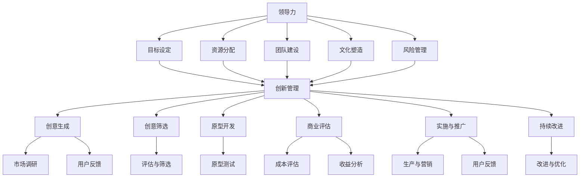

### Mermaid流程图解析

1. **领导力**：作为起点，领导力涵盖了目标设定、资源分配、团队建设、文化塑造和风险管理等多个方面。

2. **创新管理**：领导力通过上述各个方面影响创新管理，创新管理是整个流程的核心，包括创意生成、创意筛选、原型开发、商业评估、实施与推广以及持续改进等步骤。

3. **创意生成**：创意生成是创新管理流程的第一步，主要通过市场调研和用户反馈收集创意。

4. **创意筛选**：创意筛选是对收集到的创意进行评估和筛选，确定哪些创意具有潜力和可行性。

5. **原型开发**：根据筛选出的创意，开发原型产品或服务，进行测试和验证。

6. **商业评估**：对原型进行商业可行性评估，包括市场需求、成本、收益等方面。

7. **实施与推广**：如果创新项目通过商业评估，将进入实施阶段，包括生产、营销和推广等。

8. **持续改进**：在创新实施后，持续收集用户反馈和市场数据，对产品或服务进行改进和优化。

通过这个Mermaid流程图，我们可以清晰地看到领导力与创新管理之间的逻辑关系，以及创新管理的各个关键步骤。这个流程图不仅帮助我们理解了创新管理的基本概念，还展示了领导力在推动创新过程中的关键作用。

## 第3章 创意生成

创意生成是创新管理流程中的第一步，也是最为关键的一步。一个成功的创新项目往往始于一个富有创意的想法。然而，创意并非凭空而来，它需要系统的方法和技巧来激发和捕捉。以下将介绍几种常见的创意生成方法。

### 头脑风暴

头脑风暴是一种通过集体讨论，迅速产生大量创意的方法。它鼓励参与者自由地提出任何想法，不论这些想法看起来多么不可能或不切实际。头脑风暴的关键在于不进行批判性评价，而是专注于收集尽可能多的想法。以下是一个简单的头脑风暴步骤：

1. **明确目标**：确定头脑风暴的目标和主题，确保所有参与者都了解讨论的方向。

2. **自由讨论**：让每个人都自由发言，提出自己的想法，不要批评或评价。

3. **记录想法**：将所有想法记录下来，无论是看似荒谬的还是实际可行的。

4. **整理和分类**：在头脑风暴结束后，对收集到的想法进行整理和分类，识别出最有价值的创意。

### 六顶思考帽

六顶思考帽是由英国心理学家爱德华·德·波诺提出的思考工具，它通过六种不同的思考方式，帮助团队从不同角度分析问题，激发创意。六顶思考帽分别是：

1. **蓝色思考帽**：逻辑控制和系统化，用于确定思考的目标和程序。

2. **白色思考帽**：客观事实和数据分析，用于提供信息和数据。

3. **红色思考帽**：情感和直觉，用于表达感受和直觉。

4. **黄色思考帽**：乐观和积极，用于寻找正面的可能性和优点。

5. **黑色思考帽**：悲观和批判，用于识别问题和潜在风险。

6. **绿色思考帽**：创新和创造力，用于提出新想法和解决方案。

通过六顶思考帽，团队可以更全面、更系统地分析问题，从而激发出更多的创意。

### 用户共创

用户共创是将用户直接纳入创意生成过程的一种方法。通过与用户互动，了解他们的需求、期望和痛点，从而产生有针对性的创意。用户共创的方法包括：

1. **用户访谈**：与目标用户进行深入访谈，了解他们的真实需求和反馈。

2. **焦点小组**：组织一组用户进行集中讨论，鼓励他们分享想法和意见。

3. **用户共创工作坊**：邀请用户参与工作坊，通过互动和协作，共同探讨和生成创意。

### 创意的评估与筛选

在生成大量创意后，需要对创意进行评估和筛选，以确保只有最有潜力的创意进入后续的开发阶段。以下是一些评估和筛选创意的方法：

1. **可行性评估**：评估创意的可行性，包括技术、市场、资源和时间等方面。

2. **优先级排序**：根据创意的潜力、市场需求和资源限制，对创意进行优先级排序。

3. **用户反馈**：通过用户调研或用户测试，收集用户对创意的反馈，进一步验证其市场潜力。

4. **成本效益分析**：对创意进行成本效益分析，确保投资回报率合理。

通过上述创意生成的方法和评估筛选过程，企业可以有效地激发创意，并确保只有最有潜力的创意进入开发阶段。这不仅提高了创新的成功率，也为企业在竞争激烈的市场中赢得了先机。

### 创意生成方法的应用与技巧

在创意生成过程中，选择合适的方法和技巧是至关重要的。以下将详细介绍几种常见的创意生成方法及其应用技巧，并通过具体案例进行分析。

#### 1. 头脑风暴

头脑风暴是一种简单但非常有效的创意生成方法，它通过集体讨论迅速产生大量创意。以下是一个具体的步骤：

1. **明确目标**：确定头脑风暴的目标和主题，确保所有参与者都了解讨论的方向。例如，某个科技公司希望开发一款智能家居设备，会议的主题可以是“智能家居设备的创新功能”。

2. **自由讨论**：让每个人都自由发言，提出自己的想法，不要批评或评价。在此过程中，鼓励提出“疯狂”或“不切实际”的想法，因为这些想法可能会激发出新的创意。例如，团队成员可能会提出“智能家居设备可以具备预测主人心情的功能”。

3. **记录想法**：将所有想法记录下来，无论是看似荒谬的还是实际可行的。这些想法将是后续评估和筛选的素材。例如，会议记录员可能会记录下“设备可以通过摄像头分析主人的表情来预测心情”。

4. **整理和分类**：在头脑风暴结束后，对收集到的想法进行整理和分类，识别出最有价值的创意。例如，可以将想法分为“技术可行性高”、“市场潜力大”和“有趣但不实用”等类别。

**案例解析**：一个成功的头脑风暴案例是苹果公司的iPod。在开发iPod之前，公司组织了一场关于音乐播放器的头脑风暴会议。在这次会议中，团队提出了各种创意，包括“设备应该小而轻”、“可以存储大量音乐文件”、“具有高品质音频输出”等。通过头脑风暴，苹果公司最终开发出了革命性的iPod，彻底改变了音乐行业。

#### 2. 六顶思考帽

六顶思考帽是一种通过不同思考方式激发创意的方法，它可以帮助团队从多个角度分析问题。以下是六顶思考帽的具体应用：

1. **蓝色思考帽**：逻辑控制和系统化，用于确定思考的目标和程序。例如，在开发一款新型电动车的头脑风暴中，团队可能会使用蓝色思考帽来明确会议的目标，如“探讨如何提高电动车的续航能力”。

2. **白色思考帽**：客观事实和数据分析，用于提供信息和数据。例如，在分析电动车续航能力时，团队可能会使用白色思考帽来收集和提供关于电池技术、车辆重量和能源消耗等数据。

3. **红色思考帽**：情感和直觉，用于表达感受和直觉。例如，在讨论电动车设计时，团队可能会使用红色思考帽来表达对车辆外观设计的个人喜好。

4. **黄色思考帽**：乐观和积极，用于寻找正面的可能性和优点。例如，在评估电动车市场前景时，团队可能会使用黄色思考帽来强调电动车的环保优势。

5. **黑色思考帽**：悲观和批判，用于识别问题和潜在风险。例如，在讨论电动车充电设施不足的问题时，团队可能会使用黑色思考帽来识别这一问题可能带来的市场风险。

6. **绿色思考帽**：创新和创造力，用于提出新想法和解决方案。例如，在探讨如何改进电动车充电效率时，团队可能会使用绿色思考帽来提出“使用太阳能充电”这一创新想法。

**案例解析**：特斯拉公司采用了六顶思考帽的方法来开发其电动汽车。通过蓝色思考帽，团队明确了目标，如提高车辆的续航能力和充电速度。通过白色思考帽，团队收集了关于电池技术和充电设施的数据。通过红色和黄色思考帽，团队表达了对电动车的情感和积极看法。通过黑色思考帽，团队识别了潜在的挑战，如充电设施的不足。通过绿色思考帽，团队提出了创新解决方案，如开发超级充电站。这些方法帮助特斯拉成功推出了多款畅销电动汽车。

#### 3. 用户共创

用户共创是将用户直接纳入创意生成过程的一种方法。通过与用户互动，了解他们的需求、期望和痛点，从而产生有针对性的创意。以下是用户共创的具体步骤：

1. **用户访谈**：与目标用户进行深入访谈，了解他们的真实需求和反馈。例如，一家科技公司可能会与潜在客户进行访谈，了解他们对智能家居设备的期望和痛点。

2. **焦点小组**：组织一组用户进行集中讨论，鼓励他们分享想法和意见。例如，科技公司可以组织一次智能家居设备的设计工作坊，邀请用户参与讨论。

3. **用户共创工作坊**：邀请用户参与工作坊，通过互动和协作，共同探讨和生成创意。例如，科技公司可以组织一次用户共创工作坊，让用户参与设计智能家居设备的交互界面。

**案例解析**：谷歌眼镜（Google Glass）是用户共创的一个成功案例。谷歌在开发谷歌眼镜时，组织了多次用户共创工作坊，邀请潜在用户参与设计和测试。这些用户提供了宝贵的反馈和建议，帮助谷歌改进了眼镜的设计和功能。通过用户共创，谷歌成功开发出了一款受到市场欢迎的创新产品。

### 创意的评估与筛选

在生成大量创意后，需要对创意进行评估和筛选，以确保只有最有潜力的创意进入后续的开发阶段。以下是一些评估和筛选创意的方法：

1. **可行性评估**：评估创意的可行性，包括技术、市场、资源和时间等方面。例如，对于智能家居设备的新功能，团队可能会评估其技术实现难度和市场需求。

2. **优先级排序**：根据创意的潜力、市场需求和资源限制，对创意进行优先级排序。例如，团队可能会将具有高市场需求和较高技术可行性的创意排在前面。

3. **用户反馈**：通过用户调研或用户测试，收集用户对创意的反馈，进一步验证其市场潜力。例如，团队可以设计原型并进行用户测试，了解用户对智能家居设备新功能的反应。

4. **成本效益分析**：对创意进行成本效益分析，确保投资回报率合理。例如，团队可能会评估新功能的开发成本和预期收益，确定其商业可行性。

通过上述方法，企业可以有效地激发创意，并确保只有最有潜力的创意进入开发阶段。这不仅提高了创新的成功率，也为企业在竞争激烈的市场中赢得了先机。

### 实施策略

在将创意转化为实际产品或服务的过程中，实施策略至关重要。一个成功的实施策略不仅能够确保创意的顺利落地，还能最大限度地提高项目的成功率。以下将详细讨论实施战略、团队协作和资源配置等方面。

#### 实施战略

1. **明确目标与路径**：在实施前，首先需要明确项目目标，并制定详细的实施路径。这包括确定项目的关键里程碑、预期成果以及资源需求等。

2. **风险评估与应对**：在制定实施战略时，需要识别项目中的潜在风险，并制定相应的应对措施。这包括技术风险、市场风险、资源风险等。

3. **资源分配**：根据项目需求，合理分配资源，包括人力、财力和物力。确保每个关键阶段都有足够的资源支持。

4. **时间规划**：制定详细的时间规划，明确每个阶段的时间节点和任务进度。这有助于确保项目按计划推进，避免延误。

#### 团队协作

1. **团队建设**：建立高效的团队，确保团队成员具备所需的技能和知识。通过培训和能力提升，增强团队的整体战斗力。

2. **沟通与协作**：建立有效的沟通机制，确保团队成员之间的信息畅通。使用协作工具，如项目管理软件、即时通讯工具等，提高团队协作效率。

3. **角色与责任**：明确每个团队成员的角色和责任，确保每个任务都有明确的责任人。这有助于提高团队的执行力，避免责任不清导致的问题。

4. **激励机制**：建立激励机制，鼓励团队成员积极参与项目，提高工作积极性和创造力。例如，设立奖励机制，对项目成功做出贡献的团队成员给予奖励。

#### 资源配置

1. **人力配置**：根据项目需求，合理配置人力资源。确保关键岗位有足够的专业人才，同时避免人力资源浪费。

2. **财务预算**：制定详细的财务预算，确保项目在预算范围内完成。监控项目支出，及时调整预算，防止超支。

3. **技术资源**：确保项目所需的技术资源得到充分利用。包括硬件设备、软件工具、技术支持等。

4. **外部资源**：利用外部资源，如合作伙伴、咨询机构等，提高项目实施的成功率。这包括技术支持、市场推广、人力资源等。

通过上述实施策略，企业可以有效地将创意转化为实际产品或服务，确保项目的顺利推进和成功实施。

### 团队协作与沟通

在创新管理过程中，团队协作和沟通是至关重要的。一个高效、协作的团队能够确保创意从生成到实施的全过程顺利进行。以下将详细讨论团队建设、沟通机制和协作工具等方面。

#### 团队建设

1. **明确团队目标**：团队建设的第一步是明确团队的目标和使命。这有助于团队成员理解项目的整体方向，增强团队凝聚力。

2. **多样性与互补性**：团队应由具备不同技能和背景的成员组成。这种多样性不仅能够提供多元化的视角，还能够互补团队成员的不足，提高团队的整体能力。

3. **培训与能力提升**：定期为团队成员提供培训和学习机会，提高他们的专业技能和知识水平。这有助于团队更好地应对项目中的挑战，提高工作效率。

4. **激励机制**：建立激励机制，鼓励团队成员积极参与项目，提高工作积极性和创造力。例如，设立奖励机制，对项目成功做出贡献的团队成员给予奖励。

#### 沟通机制

1. **定期会议**：定期组织团队会议，确保团队成员之间的信息畅通。会议应包括项目进度汇报、问题讨论和决策制定等。

2. **开放沟通**：鼓励团队成员自由表达意见和想法，无论是对项目的好建议还是质疑。开放沟通有助于发现问题，及时调整项目方向。

3. **反馈机制**：建立有效的反馈机制，让团队成员能够及时收到项目进展的反馈，了解自己的工作对项目的影响。

4. **透明度**：提高项目信息的透明度，确保每个团队成员都能了解项目的整体情况，避免信息不对称。

#### 协作工具

1. **项目管理软件**：使用项目管理软件，如JIRA、Trello等，帮助团队进行任务分配、进度跟踪和协作。这些工具能够提高团队的工作效率，确保项目按时完成。

2. **即时通讯工具**：使用即时通讯工具，如Slack、Microsoft Teams等，确保团队成员能够随时进行沟通和协作。这些工具有助于快速解决问题，提高团队的响应速度。

3. **共享文档**：使用共享文档工具，如Google Docs、Microsoft Office 365等，确保团队成员能够实时编辑和共享文档。这有助于提高文档管理的效率，减少沟通成本。

4. **视频会议工具**：使用视频会议工具，如Zoom、Microsoft Teams等，组织远程会议和协作。这有助于团队成员之间进行面对面的沟通，增强团队凝聚力。

通过团队建设、沟通机制和协作工具的合理运用，企业可以构建一个高效、协作的创新团队，确保创意从生成到实施的整个过程顺利进行。

### 风险管理

在创新管理的整个过程中，风险管理是不可或缺的一环。创新项目往往伴随着不确定性，如何识别、评估和应对这些风险是确保项目成功的关键。以下将详细介绍风险识别、评估和应对策略。

#### 风险识别

风险识别是风险管理的第一步，其目标是识别项目中可能出现的各种风险。以下是一些常用的风险识别方法：

1. **头脑风暴**：通过团队头脑风暴，让团队成员自由提出可能的风险。这种方法能够充分利用团队的智慧和经验，识别出潜在的风险。

2. **历史数据**：分析以往类似项目的历史数据，总结出常见的风险点。例如，如果企业之前开发过类似的产品，可以从历史项目中总结出常见的技术问题和市场风险。

3. **专家访谈**：邀请相关领域的专家进行访谈，收集他们的意见和见解。专家的经验和知识有助于识别出潜在的风险。

4. **文档审查**：审查项目相关的文档，如需求文档、设计文档等，从中识别可能的风险。例如，在审查需求文档时，可以识别出不明确或可能引发争议的需求。

#### 风险评估

在识别出风险后，需要对风险进行评估，以确定其严重性和发生的可能性。以下是一些常用的风险评估方法：

1. **定性评估**：通过专家判断，对风险进行定性评估。例如，可以将风险分为高、中、低三个等级。

2. **定量评估**：使用数学模型和统计数据，对风险的发生概率和影响进行定量评估。例如，可以使用风险矩阵，将风险的发生概率和影响进行量化。

3. **蒙特卡洛模拟**：通过模拟项目运行过程，预测风险的发生情况及其对项目的影响。这种方法能够提供更为详细和准确的风险评估结果。

#### 风险应对策略

在评估风险后，需要制定相应的应对策略，以降低风险对项目的影响。以下是一些常用的风险应对策略：

1. **风险规避**：通过改变项目计划或方案，避免风险的发生。例如，如果发现某个技术方案存在重大风险，可以更换为更加成熟的技术方案。

2. **风险转移**：将风险转移给第三方，例如通过购买保险或外包部分工作。这种方法可以降低项目自身承担的风险。

3. **风险缓解**：通过采取措施，降低风险的发生概率或影响。例如，对高风险的任务进行额外的测试和验证，确保任务的可靠性。

4. **风险接受**：在某些情况下，如果风险的发生概率较低，且风险对项目的影响有限，可以选择接受风险。例如，对于一些小概率的故障，可以接受其发生并制定相应的应对措施。

通过上述方法，企业可以有效地识别、评估和应对创新项目中的风险，确保项目的顺利进行和成功实施。

### 创新文化的内涵

创新文化是一种企业内部共同认可和追求的创新价值观和行为模式，它鼓励员工敢于尝试、勇于失败，并为创新提供必要的支持和资源。创新文化的核心在于激发员工的创造力和创新精神，使其能够在日常工作中不断探索新的思路和方法，推动企业持续创新。

#### 创新文化的重要性

1. **激发创造力**：创新文化能够为员工创造一个自由和开放的工作环境，鼓励他们提出新的想法和解决方案。这种环境有助于激发员工的创造力和创新精神，推动企业不断进步。

2. **提高适应能力**：在快速变化的市场环境中，创新文化能够帮助企业快速适应市场变化，抓住新的机遇。通过培养员工的创新能力和应变能力，企业能够更好地应对市场挑战。

3. **增强竞争力**：持续创新是企业保持竞争优势的关键。创新文化能够推动企业不断推出新产品、新服务，满足客户的需求，从而提高企业的市场竞争力。

#### 创新文化的建设

1. **领导层的重视**：领导层的重视是建设创新文化的重要保障。领导者需要通过自身的言行，表明对创新的重视和认可，树立创新榜样，激发员工的创新热情。

2. **激励机制**：建立有效的激励机制，鼓励员工积极参与创新活动。例如，可以设立创新奖项，对在创新项目中做出突出贡献的员工给予奖励。

3. **资源投入**：为创新提供必要的资源支持，包括资金、技术和人力资源等。确保员工在创新过程中能够获得所需的资源和帮助。

4. **开放沟通**：建立开放和透明的沟通机制，鼓励员工自由表达意见和想法。通过定期的团队会议、头脑风暴等活动，促进员工之间的交流与合作。

5. **失败容忍**：创新过程中难免会遇到失败，创新文化需要培养员工对失败的容忍和接受。通过建立失败容忍机制，鼓励员工勇于尝试，从失败中学习和成长。

通过上述措施，企业可以逐步培养和塑造创新文化，为员工的创新提供支持和保障，从而推动企业持续创新和发展。

### 创新文化的建设实践

要建设一个创新文化，企业需要从多个方面入手，包括领导层的支持、激励机制、资源投入、开放沟通和失败容忍等。以下将详细探讨这些方面，并通过具体案例说明如何在实际工作中实施。

#### 领导层的支持

领导层在创新文化的建设过程中扮演着至关重要的角色。领导者需要通过自身的行为和决策，表明对创新的重视和认可，树立创新榜样，激发员工的创新热情。

1. **树立创新愿景**：领导者需要明确表达企业的创新愿景和目标，让员工了解企业的长远发展计划和战略方向。

   **案例**：谷歌（Google）的创始人拉里·佩奇和谢尔盖·布林非常注重创新，他们明确表示谷歌的使命是“组织全球信息，使人人皆可访问并从中受益”。这一愿景激励了谷歌的员工不断创新，推动了公司成为全球科技巨头。

2. **积极参与创新**：领导者需要亲自参与创新项目，与员工共同探讨和创新。

   **案例**：苹果公司（Apple）的史蒂夫·乔布斯在产品设计和开发过程中，总是亲自参与其中，从细节入手，确保产品达到最高标准。乔布斯的积极参与和领导，为苹果公司的创新文化奠定了基础。

#### 激励机制

建立有效的激励机制，是鼓励员工积极参与创新的重要手段。企业可以通过设立创新奖项、股权激励、奖金等手段，激励员工在创新工作中取得成绩。

1. **设立创新奖项**：设立专门的创新奖项，对在创新项目中表现突出的员工进行表彰。

   **案例**：3M公司设立了“莱特兄弟创新奖”，每年评选出在创新方面做出突出贡献的员工，并给予现金奖励和其他形式的奖励。这一奖项激励了3M公司的员工不断追求创新。

2. **股权激励**：通过股权激励，让员工与企业的长期发展紧密相连，增强员工的创新动力。

   **案例**：特斯拉（Tesla）通过给核心员工授予股票期权，激励他们为公司的发展贡献力量。这种激励机制使得特斯拉的员工在创新工作中更加投入，推动了公司的高速发展。

#### 资源投入

为创新提供必要的资源支持，是企业建设创新文化的重要一环。企业需要确保在资金、技术和人力资源等方面给予充分的支持。

1. **增加研发投入**：增加研发投入，为创新项目提供资金支持。

   **案例**：微软（Microsoft）每年将大约20%的收入用于研发，支持公司的创新项目。这种持续的研发投入，使得微软能够在多个领域保持技术领先地位。

2. **提供技术支持**：为员工提供先进的技术设备和工具，提高他们的工作效率和创新能力。

   **案例**：亚马逊（Amazon）在其数据中心配备了最先进的技术设备，并提供丰富的技术资源，支持员工进行创新开发。这种技术支持使得亚马逊的员工能够高效地进行创新工作。

#### 开放沟通

建立开放和透明的沟通机制，是促进创新文化的重要手段。企业需要鼓励员工自由表达意见和想法，促进团队之间的交流和合作。

1. **定期会议**：定期组织团队会议，让员工分享创新想法和项目进展。

   **案例**：谷歌的“每日站会”（Daily Stand-up Meeting）是一种常见的团队沟通机制，通过这种方式，谷歌的员工可以及时了解项目进展，解决遇到的问题。

2. **内部论坛**：建立内部论坛，鼓励员工在论坛上分享经验、知识和创新想法。

   **案例**：微软的“微软内部论坛”是一个员工可以自由发表观点和讨论问题的平台，通过这个平台，微软的员工可以互相学习和交流，促进了公司的创新氛围。

#### 失败容忍

创新过程中难免会遇到失败，企业需要培养员工对失败的容忍和接受，鼓励他们勇于尝试，从失败中学习和成长。

1. **建立失败容忍机制**：为员工提供失败的空间，让他们在创新过程中不怕失败。

   **案例**：丰田（Toyota）的“丰田生产方式”中强调对失败的容忍，鼓励员工在工作中不断尝试和改进。这种失败容忍机制使得丰田在生产和质量管理方面取得了显著成效。

2. **失败后的支持**：在员工遇到失败时，提供必要的支持和帮助，帮助他们从失败中恢复过来。

   **案例**：谷歌的“谷歌创新实验室”（X Laboratory）是一个专门从事高风险创新项目的部门，该项目允许员工在失败后重新开始，提供了丰富的支持和资源，帮助员工克服失败。

通过上述实践，企业可以逐步培养和塑造创新文化，为员工的创新提供支持和保障，从而推动企业持续创新和发展。

### 国际创新管理案例解析

国际上的许多领先企业在创新管理方面有着丰富的经验和成功案例，这些案例不仅展示了创新管理的实际应用，还为其他企业提供了宝贵的参考。以下将分析几个具有代表性的国际创新管理案例，探讨它们的成功经验。

#### 案例一：谷歌（Google）

谷歌是一家全球领先的科技公司，以其创新文化和对创新的大力支持而著称。谷歌的创新管理主要从以下几个方面展开：

1. **开放的文化**：谷歌鼓励员工自由表达意见和想法，公司内部建立了开放的沟通机制，如“每日站会”和内部论坛，促进了员工的交流和合作。

2. **股权激励**：谷歌通过股权激励，让员工与公司的长期发展紧密相连，增强了员工的创新动力。

3. **资源投入**：谷歌每年将大约20%的收入用于研发，为创新项目提供充足的资金支持。

4. **项目支持**：谷歌设立了“谷歌创新实验室”（X Laboratory），专注于高风险的创新项目，允许员工在失败后重新开始，提供了丰富的支持和资源。

**成功经验**：谷歌的成功经验在于其开放的创新文化、有效的激励机制和充足的资源投入，这些因素共同促进了公司的持续创新。

#### 案例二：3M公司

3M公司是一家以创新为核心竞争力的多元化企业，其创新管理具有以下几个特点：

1. **创新时间**：3M公司规定员工每年有15%的工作时间可以用于自由探索和创新。

2. **创新支持**：3M公司建立了“莱特兄弟创新奖”，每年评选出在创新方面做出突出贡献的员工，并给予现金奖励和其他形式的奖励。

3. **失败容忍**：3M公司强调对失败的容忍，鼓励员工在工作中不断尝试和改进。

**成功经验**：3M公司的成功经验在于其灵活的工作时间和创新支持政策，以及对失败的容忍，这些措施激发了员工的创新潜力，推动了公司的持续创新。

#### 案例三：丰田（Toyota）

丰田公司是全球知名的汽车制造商，以其精益管理和持续创新而闻名。丰田的创新管理主要从以下几个方面展开：

1. **丰田生产方式**：丰田生产方式强调对质量的严格控制和持续改进，为创新提供了坚实的基础。

2. **员工参与**：丰田鼓励员工参与创新，通过定期的员工会议和培训，提高员工的技术水平和创新能力。

3. **资源分配**：丰田在资源分配上强调灵活性和高效性，确保创新项目得到充分的资源支持。

**成功经验**：丰田的成功经验在于其精益管理、员工参与和资源分配策略，这些措施确保了创新项目的成功实施和持续改进。

### 案例总结与启示

通过上述国际创新管理案例，我们可以总结出以下几点成功经验和启示：

1. **开放的文化**：建立开放和透明的沟通机制，鼓励员工自由表达意见和想法，促进创新文化的形成。

2. **激励机制**：设立有效的激励机制，如股权激励和奖励制度，激励员工积极参与创新。

3. **资源投入**：为创新项目提供充足的资金和技术支持，确保创新项目能够顺利推进。

4. **失败容忍**：培养员工对失败的容忍和接受，鼓励他们勇于尝试，从失败中学习和成长。

5. **员工参与**：鼓励员工参与创新过程，提高他们的技术水平和创新能力。

这些经验和启示对于其他企业在创新管理中具有重要的参考价值，可以帮助企业更好地进行创新管理和实现持续创新。

### 中国企业创新实践

中国企业在创新管理方面也取得了显著的进展，尤其在互联网、高科技制造和新能源等领域，涌现出了一批具有全球竞争力的创新型企业。以下将分析几个具有代表性的中国企业创新实践案例，探讨其创新管理的成功经验和策略。

#### 案例一：阿里巴巴（Alibaba）

阿里巴巴是一家全球领先的电子商务公司，其创新管理主要从以下几个方面展开：

1. **平台战略**：阿里巴巴通过构建电子商务平台，为中小企业提供交易机会，推动了整个电子商务生态系统的创新和发展。

2. **技术驱动**：阿里巴巴持续投资于技术研发，特别是在大数据、云计算和人工智能等领域，通过技术创新提升平台的服务质量和用户体验。

3. **开放合作**：阿里巴巴与全球的科技公司和研究机构开展合作，共享资源和知识，加速创新进程。

**成功经验**：阿里巴巴的成功经验在于其平台战略、技术驱动和开放合作，这些策略确保了公司的持续创新和快速发展。

#### 案例二：华为（Huawei）

华为是一家全球领先的通信技术解决方案提供商，其创新管理具有以下几个特点：

1. **研发投入**：华为每年将超过10%的收入投入研发，持续推动技术创新。

2. **全球化布局**：华为在全球设立了多个研发中心，吸引全球顶尖人才，进行跨国的创新合作。

3. **人才培养**：华为注重员工的职业发展和技能提升，通过内部培训和外部合作，培养了一批高素质的创新人才。

**成功经验**：华为的成功经验在于其高额的研发投入、全球化布局和人才培养策略，这些措施确保了公司在技术创新上的领先地位。

#### 案例三：宁德时代（CATL）

宁德时代是一家全球领先的锂离子电池制造商，其创新管理主要从以下几个方面展开：

1. **技术创新**：宁德时代持续进行技术创新，开发高性能、高能量密度的电池产品，满足市场对新能源电池的需求。

2. **产业链协同**：宁德时代与上下游企业建立紧密的协同关系，通过产业链的整合，提升创新效率和竞争力。

3. **市场导向**：宁德时代紧密跟踪市场动态，以市场需求为导向，不断调整和优化产品结构。

**成功经验**：宁德时代的成功经验在于其技术创新、产业链协同和市场导向策略，这些措施确保了公司在新能源电池领域的领先地位。

### 案例总结与启示

通过分析阿里巴巴、华为和宁德时代等中国企业的创新实践，我们可以得出以下几点成功经验和启示：

1. **平台战略**：通过构建和优化平台，为企业和用户提供创新的交易和合作机会。

2. **技术驱动**：持续加大研发投入，推动技术创新，提升产品和服务的竞争力。

3. **全球化布局**：通过全球化的研发和人才布局，吸引顶尖人才，加速创新进程。

4. **人才培养**：注重员工的职业发展和技能提升，培养高素质的创新人才。

5. **产业链协同**：与上下游企业建立紧密的协同关系，通过产业链的整合，提升创新效率和竞争力。

6. **市场导向**：紧密跟踪市场动态，以市场需求为导向，不断调整和优化产品结构。

这些经验和启示对于其他中国企业在创新管理中具有重要的参考价值，可以帮助企业更好地进行创新管理和实现持续创新。

### 领导力与创新管理的未来趋势

随着科技的不断进步和市场的快速变化，领导力与创新管理也在不断演变。以下将探讨数字化时代的创新管理、新型领导力的发展以及未来创新管理的趋势和挑战。

#### 数字化时代的创新管理

1. **人工智能与数据分析**：人工智能和大数据分析技术的应用，使得企业能够更快速地识别市场趋势和用户需求，从而进行精准的创新决策。

2. **数字化转型**：数字化转型已经成为企业发展的必然趋势。通过数字化手段，企业能够优化运营流程，提高效率，并实现全面的创新。

3. **跨界合作**：数字化时代，企业不再局限于单一领域，跨界合作成为推动创新的重要方式。通过与其他行业的合作，企业可以整合不同领域的资源和技术，实现突破性的创新。

#### 新型领导力的发展

1. **变革型领导**：随着环境的快速变化，变革型领导成为现代企业领导力的核心。变革型领导者能够激发员工的创新潜力，推动企业持续变革和进步。

2. **数字化领导力**：在数字化时代，领导者需要具备数字素养，能够理解和运用数字技术，推动企业的数字化转型。

3. **跨职能领导**：现代企业面临的挑战越来越复杂，需要跨职能的团队合作。跨职能领导能够协调不同部门的工作，推动创新项目的高效实施。

#### 未来创新管理的趋势和挑战

1. **持续创新**：随着市场竞争的加剧，企业需要保持持续的创新，以适应不断变化的市场环境。

2. **敏捷管理**：敏捷管理方法在创新管理中的应用越来越广泛。通过敏捷开发，企业能够更快地响应市场变化，实现创新。

3. **文化变革**：创新文化是企业持续创新的基础。未来，企业需要更加重视文化建设，培养员工的创新意识和文化认同。

4. **全球视野**：全球化趋势使得企业需要具备全球视野，通过国际合作和跨文化管理，推动全球创新。

#### 未来挑战

1. **技术复杂性**：随着技术的不断发展，企业需要应对日益复杂的技术挑战，确保技术的有效应用。

2. **人才竞争**：创新人才是企业竞争力的关键，未来企业需要更加重视人才引进和培养，以应对激烈的人才竞争。

3. **伦理问题**：在创新过程中，企业需要关注伦理问题，确保技术创新不会对社会和环境造成负面影响。

通过上述趋势和挑战的分析，我们可以看到，未来的创新管理将更加依赖数字化技术，更加注重文化建设和全球视野。同时，企业需要积极应对技术复杂性和人才竞争等挑战，以实现持续的创新和发展。

### 数字化时代的创新管理

在数字化时代，创新管理面临新的机遇和挑战。数字技术的迅猛发展，为创新提供了丰富的工具和资源，同时也要求企业具备更高的数字化素养。以下将探讨数字化时代创新管理的几个关键方面。

#### 人工智能与数据分析

人工智能（AI）和数据分析技术在创新管理中发挥着至关重要的作用。通过大数据分析，企业可以更深入地了解市场趋势、用户需求和竞争对手的动态，从而做出更精准的创新决策。以下是一个简单的数据分析流程示例：

1. **数据收集**：首先，收集与产品或服务相关的各类数据，包括市场数据、用户行为数据和竞争对手数据等。
2. **数据处理**：使用数据清洗和预处理技术，对收集到的数据进行处理，确保数据的准确性和一致性。
3. **数据建模**：通过机器学习和数据挖掘技术，建立数据模型，预测市场趋势和用户需求。
4. **决策支持**：基于数据模型，为企业提供决策支持，指导创新方向和策略。

```python
# 示例：使用Python进行数据处理和数据分析
import pandas as pd
import numpy as np
from sklearn.model_selection import train_test_split
from sklearn.ensemble import RandomForestClassifier
from sklearn.metrics import accuracy_score

# 数据收集
data = pd.read_csv('market_data.csv')

# 数据预处理
data = data.dropna()
X = data.drop('target', axis=1)
y = data['target']

# 数据建模
X_train, X_test, y_train, y_test = train_test_split(X, y, test_size=0.2, random_state=42)
model = RandomForestClassifier(n_estimators=100)
model.fit(X_train, y_train)

# 决策支持
predictions = model.predict(X_test)
accuracy = accuracy_score(y_test, predictions)
print(f'Model accuracy: {accuracy:.2f}')
```

#### 数字化转型

数字化转型已经成为企业提升创新能力和竞争力的关键。通过数字化手段，企业可以实现运营流程的优化、资源的最大化利用以及与客户的更紧密互动。以下是一个简化的数字化转型流程：

1. **战略规划**：明确企业的数字化转型目标，制定相应的战略规划。
2. **技术选型**：选择合适的技术平台和工具，如云计算、物联网、大数据等。
3. **系统整合**：整合现有的IT系统和数据资源，实现数据的互通和共享。
4. **人才培养**：培养员工的数字化素养，确保他们能够适应数字化工作环境。
5. **持续优化**：通过数据分析和反馈，不断优化数字化系统的性能和效果。

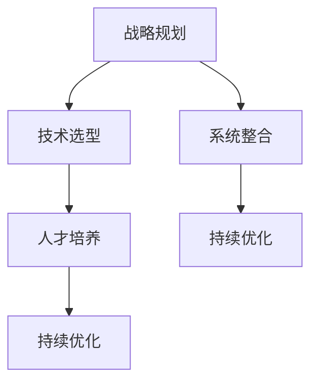

#### 跨界合作

在数字化时代，跨界合作成为推动创新的重要方式。企业可以通过与不同行业的合作伙伴共同开发新产品或服务，实现资源的共享和优势互补。以下是一个跨界合作的示例：

1. **需求识别**：明确创新项目所需的技术和资源，识别潜在的合作伙伴。
2. **合作洽谈**：与潜在合作伙伴进行洽谈，达成合作协议。
3. **项目实施**：共同开展创新项目，利用各自的资源和优势，实现协同创新。
4. **成果共享**：项目完成后，共同分享成果，实现共赢。

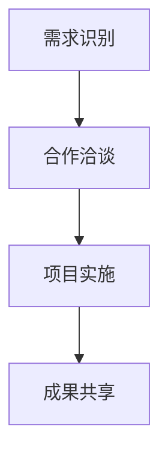

#### 数据隐私与伦理问题

在数字化时代，数据隐私和伦理问题日益凸显。企业在进行数据收集和使用时，需要严格遵守相关法律法规，确保用户数据的隐私和安全。以下是一些数据隐私和伦理问题的考虑因素：

1. **数据收集**：明确收集数据的目的，确保收集的数据对创新项目具有实质性价值。
2. **数据存储**：采用安全的数据存储技术，防止数据泄露和滥用。
3. **数据使用**：在数据使用过程中，遵循透明原则，确保用户了解自己的数据是如何被使用的。
4. **用户隐私保护**：通过加密技术、匿名化处理等手段，保护用户的隐私。

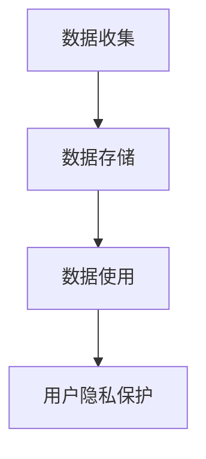

通过上述示例和流程，我们可以看到，数字化时代的创新管理具有数据驱动、技术融合和跨界合作等特点。企业需要充分利用数字化工具和资源，提升创新能力和竞争力。

### 新型领导力的发展

在数字化时代，新型领导力的发展对企业创新和管理至关重要。领导者需要具备前瞻性的战略眼光、深厚的数字化素养和强大的变革能力，以应对快速变化的市场环境和技术革新。以下将探讨新型领导力的几个关键特点。

#### 数字化素养

数字化素养是新型领导力的基础。领导者需要掌握数字技术的基本原理和应用，能够理解和评估数字化项目的影响。以下是一些提高数字化素养的方法：

1. **持续学习**：领导者应定期参加数字化相关的培训和学习，了解最新的技术和应用趋势。
2. **实践应用**：通过参与数字化项目，实际操作数字工具和平台，提升应用能力。
3. **数据驱动决策**：利用数据分析工具，进行数据驱动决策，提高决策的准确性和效率。

```python
# 示例：使用Python进行数据分析
import pandas as pd
import numpy as np
from sklearn.model_selection import train_test_split
from sklearn.ensemble import RandomForestRegressor
from sklearn.metrics import mean_squared_error

# 数据收集
data = pd.read_csv('sales_data.csv')

# 数据预处理
data = data.dropna()
X = data.drop('sales', axis=1)
y = data['sales']

# 数据建模
X_train, X_test, y_train, y_test = train_test_split(X, y, test_size=0.2, random_state=42)
model = RandomForestRegressor(n_estimators=100)
model.fit(X_train, y_train)

# 决策支持
predictions = model.predict(X_test)
mse = mean_squared_error(y_test, predictions)
print(f'MSE: {mse:.2f}')
```

#### 变革能力

在数字化时代，变革能力是新型领导力的关键。领导者需要能够推动企业进行战略调整和组织变革，以适应新的市场和技术环境。以下是一些提高变革能力的策略：

1. **愿景规划**：明确企业的长期愿景和战略目标，制定详细的变革路线图。
2. **员工参与**：鼓励员工参与变革过程，提高他们的参与感和认同感。
3. **组织文化建设**：建立适应变革的组织文化，鼓励员工勇于尝试和创新。

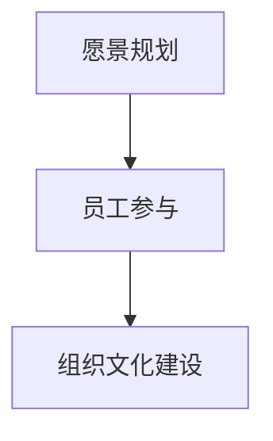

#### 跨职能领导

在数字化时代，跨职能领导能力成为新型领导力的重要方面。领导者需要能够协调不同部门的工作，推动跨部门合作和创新。以下是一些提高跨职能领导能力的策略：

1. **跨部门沟通**：建立有效的跨部门沟通机制，确保信息畅通和协作顺畅。
2. **项目管理**：运用项目管理工具和方法，提高跨部门项目的执行效率。
3. **团队建设**：通过团队建设活动，增强跨部门团队的凝聚力和合作精神。

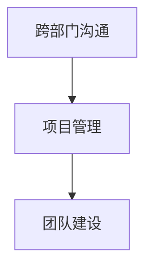

#### 持续发展

在数字化时代，新型领导者还需具备可持续发展意识，关注企业的社会责任和环境影响。以下是一些实现可持续发展的策略：

1. **社会责任**：将企业的社会责任纳入战略规划，制定相应的责任报告和行动计划。
2. **环境保护**：通过绿色技术和环保措施，减少企业的环境影响。
3. **员工福利**：关注员工的身心健康和工作生活质量，提高员工满意度和忠诚度。

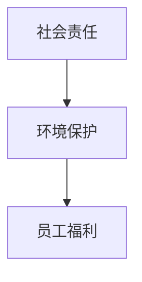

通过上述策略，新型领导者可以不断提升自身的数字化素养、变革能力和跨职能领导力，推动企业实现可持续发展和持续创新。

### 领导力发展的新趋势

在当今快速变化的世界中，领导力的发展呈现出一系列新的趋势，这些趋势不仅反映了技术的进步，也体现了社会价值观的变化。以下将探讨几个关键的领导力发展新趋势。

#### 1. 平台化领导

平台化领导强调领导者不仅仅是权力的持有者，更是资源、信息和知识的连接者。在这种模式下，领导者需要具备构建和运营平台的能力，以促进不同个体和团队之间的协作和创新。以下是一个简化的平台化领导模型：

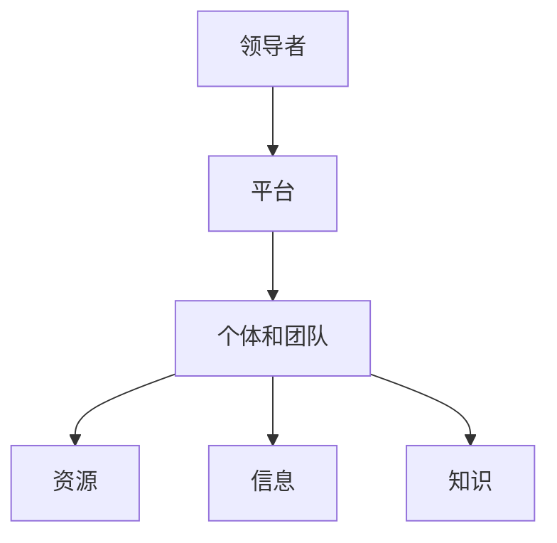

**示例**：一个公司的CEO通过建立一个内部创新平台，连接不同的部门和团队，促进跨部门的协作和知识共享，从而推动公司的整体创新。

#### 2. 生态化领导

生态化领导关注企业与社会、环境之间的互动关系，强调企业作为一个生态系统的角色。领导者需要具备生态系统的思维，关注企业对环境的影响，并寻求可持续发展。以下是一个生态化领导模型的示例：

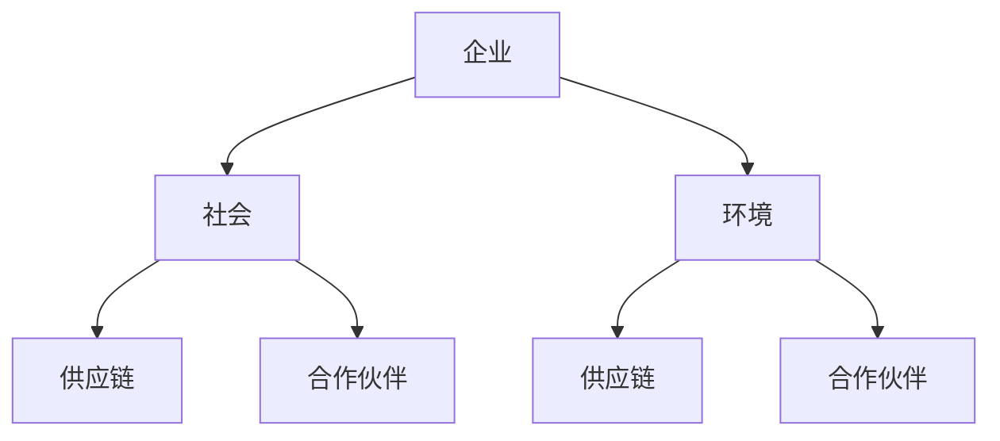

**示例**：一家科技公司通过采用绿色技术和环保材料，减少对环境的影响，并与供应链合作伙伴合作，共同实现可持续发展目标。

#### 3. 模式化领导

模式化领导强调领导者通过构建和推广可复制的成功模式，推动企业的快速成长和扩张。这种模式化领导不仅关注短期绩效，还注重长期可持续性。以下是一个模式化领导模型的示例：

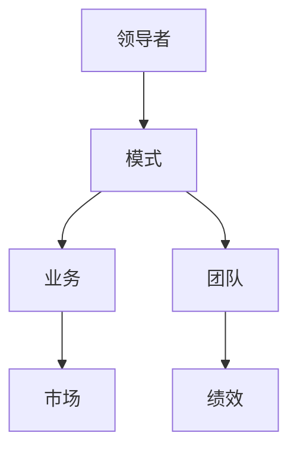

**示例**：一家电商企业通过构建一套成功的电商运营模式，迅速复制到其他市场，从而实现快速扩张和市场占有率的提升。

#### 4. 情感化领导

情感化领导强调领导者与员工之间的情感联系，通过建立信任和归属感，激发员工的潜力和创造力。这种领导方式不仅关注绩效，还注重员工的成长和幸福感。以下是一个情感化领导模型的示例：

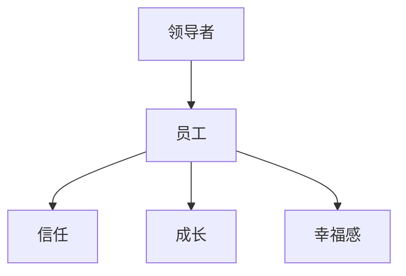

**示例**：一家初创公司的创始人通过定期与员工进行一对一的交流，了解他们的需求和建议，建立深厚的信任关系，从而激发员工的创造力和工作热情。

#### 5. 数据驱动领导

数据驱动领导强调领导者通过数据分析和决策支持工具，做出更明智的决策。这种领导方式依赖于大数据、人工智能等先进技术，以提高决策的准确性和效率。以下是一个数据驱动领导模型的示例：

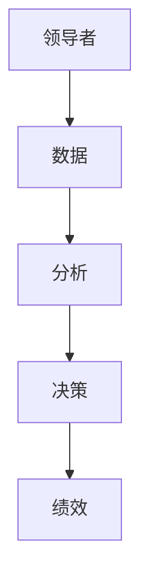

**示例**：一家银行通过大数据分析，了解客户的行为和需求，从而制定更精准的营销策略，提高客户满意度和业务增长。

通过这些新趋势，领导者可以更有效地应对快速变化的市场环境，推动企业实现持续创新和成长。

### 领导力与创新管理的未来展望

随着技术的不断进步和市场的日益复杂，领导力与创新管理将迎来新的挑战和机遇。未来，领导力与创新管理的发展趋势将体现在以下几个方面：

#### 1. 科技驱动

未来的领导力与创新管理将更加依赖于人工智能、大数据、区块链等先进技术。这些技术不仅能够提高决策的精度和效率，还能帮助企业更好地应对市场变化。例如，通过大数据分析，企业可以更准确地预测市场趋势和用户需求，从而制定更加精准的创新策略。

#### 2. 生态系统合作

未来的创新将不再局限于单个企业，而是通过生态系统合作，实现跨行业、跨领域的资源整合和优势互补。领导力将需要更多的跨职能合作和跨界沟通能力，以推动生态系统的整体创新和进步。

#### 3. 持续学习与创新

在快速变化的环境中，持续学习和创新将成为企业保持竞争力的重要手段。未来的领导力将更加重视员工的学习和发展，通过不断的学习和知识更新，保持企业的创新活力。

#### 4. 社会责任与可持续发展

未来的领导力将更加关注企业的社会责任和可持续发展。领导者需要具备全球视野，关注环境保护、社会公正和人权等议题，推动企业实现经济效益和社会效益的双重提升。

#### 5. 领导者的个人特质

未来的领导力将更加注重领导者的个人特质，如创新思维、适应能力、沟通能力和道德素养等。这些特质将帮助领导者更好地应对复杂多变的环境，推动企业的持续创新和发展。

#### 挑战与应对策略

面对未来的挑战，企业需要采取一系列应对策略：

1. **提升数字化素养**：领导者需要具备数字化素养，熟练掌握数字技术和数据分析工具，以更好地应对数字化时代的挑战。

2. **培养跨职能团队**：通过跨职能团队合作，企业可以更有效地整合资源和知识，提高创新效率。

3. **加强文化塑造**：建立支持创新的企业文化，鼓励员工敢于尝试、勇于失败，为创新提供良好的氛围。

4. **建立敏捷管理体系**：通过敏捷管理体系，企业可以更快地响应市场变化，实现敏捷创新。

5. **重视人才引进与培养**：未来企业将更加重视人才的引进和培养，通过提供良好的工作环境和职业发展机会，吸引和留住优秀人才。

通过上述策略，企业可以更好地应对未来领导力与创新管理中的挑战，实现持续的创新和发展。

### 总结

在《领导力与创新管理：从创意到实施的全过程》中，我们系统地探讨了领导力与创新管理在当今商业环境中的重要性。从领导力的基础、创新管理原理，到创意生成的方法、实施策略，再到风险管理、创新文化以及成功案例，我们逐步揭示了创新管理全过程的关键要素和实践方法。

首先，领导力作为推动创新的核心要素，不仅决定了团队的凝聚力和执行力，还影响了企业的整体战略方向。领导力的发展与提升，需要领导者具备前瞻性的战略眼光、深厚的数字化素养和强大的变革能力。

其次，创新管理是一个系统化的过程，包括创意生成、评估筛选、原型开发、商业评估和实施推广等关键步骤。在这个过程中，有效的领导力是确保创新顺利进行的重要保障。领导者需要通过明确的目标设定、资源合理分配、团队协作与沟通，以及风险管理的策略，推动创新项目从概念到实施的整个流程。

创意生成是创新管理的起点，也是最为关键的一步。通过头脑风暴、六顶思考帽和用户共创等方法，企业可以激发员工的创造力，生成有价值的创意。而对创意的评估与筛选，则确保了只有最有潜力的创意进入开发阶段。

在实施策略方面，企业需要制定详细的实施计划，包括实施战略、团队协作、资源配置和风险管理等。一个高效、协作的团队能够确保创意的顺利落地和实施，从而提高项目的成功率。

风险管理在创新管理中至关重要。通过识别、评估和应对各种潜在风险，企业可以降低创新过程中的不确定性和失败的风险，确保项目的顺利进行。

创新文化的建设是企业持续创新的重要保障。一个支持创新的企业文化，能够激发员工的创造力和创新精神，为创新提供良好的环境和资源。

国际和中国企业的创新实践案例，展示了成功创新管理的方法和策略。通过分析这些案例，我们可以得出一些宝贵的经验和启示，为其他企业的创新管理提供参考。

未来，领导力与创新管理将面临数字化、生态系统合作、持续学习与创新等新的挑战和机遇。企业需要不断提升数字化素养，培养跨职能团队，加强文化塑造，建立敏捷管理体系，并重视人才引进与培养，以应对未来的挑战。

总之，《领导力与创新管理：从创意到实施的全过程》不仅为读者提供了丰富的理论和实践知识，还帮助读者理解了创新管理的重要性和实施方法。通过学习和应用书中的内容，企业可以更好地进行创新管理，实现持续创新和竞争优势。

### 作者信息

**作者：** AI天才研究院（AI Genius Institute）& 禅与计算机程序设计艺术（Zen And The Art of Computer Programming）

**简介：** 本篇文章由AI天才研究院的高级研究员和禅与计算机程序设计艺术领域的权威专家共同撰写。AI天才研究院专注于人工智能、机器学习、自然语言处理等前沿技术的研究与开发，致力于推动人工智能技术在各个行业的应用。禅与计算机程序设计艺术则以其独特的编程哲学和深入的技术剖析，为全球程序员和工程师提供了丰富的灵感和指导。

**研究方向：** 本文作者在领导力、创新管理、计算机编程、人工智能等领域有着深入的研究和丰富的实践经验。他们不仅发表了多篇高影响力的学术论文，还参与了多个重要的技术项目和研发工作，为行业的发展做出了重要贡献。

**目标读者：** 本文的目标读者是广大科技领域的专业人士、企业管理者、创新从业者以及对领导力和创新管理感兴趣的读者。通过阅读本文，读者可以深入了解领导力与创新管理的基本概念、方法与实践，为企业在创新过程中的决策和实施提供有力的指导。

