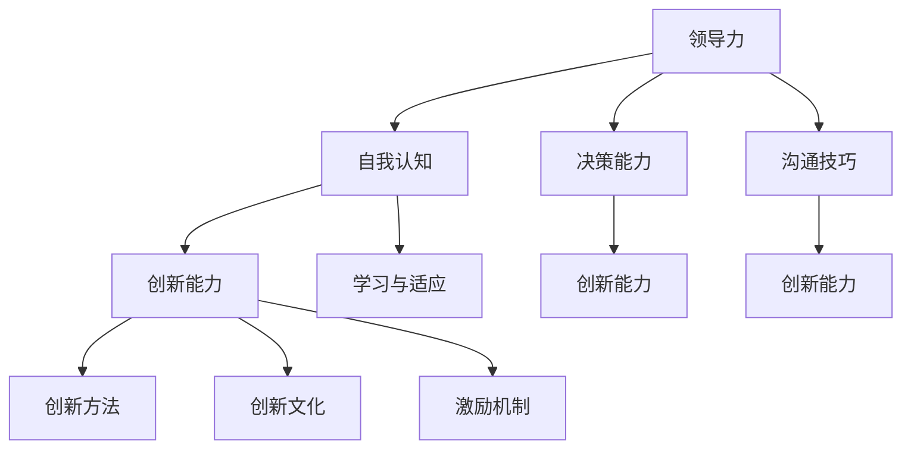

                 

### 文章标题：领导力与创新管理：培养团队创新能力

在当今快速变化的商业环境中，领导力与创新管理已成为企业成功的关键因素。本文将探讨如何通过领导力培养团队的创新能力，以应对不断变化的市场和技术挑战。通过详细的步骤分析和深入的技术讲解，本文旨在为领导者提供实用的策略和工具，以促进团队创新。

关键词：领导力、创新管理、团队、创新能力、策略、工具

摘要：
本文首先介绍领导力与创新管理的基本概念，然后分析它们之间的关系。接着，我们将深入探讨如何通过领导者自我认知与能力建设来增强团队的创新能力。随后，文章将详细讨论创新过程与方法，并介绍如何构建创新文化和激励机制。最后，通过实际案例分析和最佳实践，本文为读者提供了一套完整的团队创新能力培养方案。

### 背景介绍

在当今经济全球化、技术迅猛发展的时代，企业面临的竞争环境日益激烈。传统的管理方法和思维模式已难以适应这一变化。领导力与创新管理作为企业发展的核心动力，越来越受到关注。有效的领导力能够激发团队的潜力，推动创新；而创新管理则为企业提供了持续发展的动力。

领导力不仅仅是指导和管理团队，更是一种激励、引导和赋能的过程。领导者需要具备自我认知和持续学习的能力，以适应快速变化的环境。创新管理则涉及如何系统地识别、开发和实施创新，以保持企业的竞争力。

本文旨在通过系统性的分析和讨论，帮助领导者了解和掌握如何通过领导力与创新管理来培养团队的创新能力。我们将从基础概念入手，逐步深入到具体实践，为读者提供实用的指导。

### 核心概念与联系

在探讨领导力与创新管理的关系时，首先需要明确两个核心概念：领导力和创新能力。

**领导力** 是指领导者通过影响和激励他人，实现共同目标的能力。它包括多个方面，如自我认知、决策能力、沟通技巧等。领导力的本质在于建立信任、激发潜能和推动变革。

**创新能力** 是指团队在面对挑战时，能够提出新想法、新方法和新解决方案的能力。创新能力不仅涉及技术层面，还包括组织文化、激励机制等多个方面。

为了更好地理解领导力与创新能力之间的关系，我们可以通过以下 Mermaid 流程图来展示它们之间的联系：



**Mermaid 流程图说明**：
- **领导力** 通过 **自我认知**、**决策能力** 和 **沟通技巧** 等方面，影响 **创新能力**。
- **自我认知** 有助于领导者更好地理解自己和团队，从而激发创新潜能。
- **决策能力** 在创新过程中尤为重要，它决定了如何有效地分配资源和应对风险。
- **沟通技巧** 则是确保创新想法能够得到有效传达和实施的关键。

此外，**学习能力与适应能力** 也是领导力的重要组成部分，它们直接影响创新能力的发挥。**创新方法**、**创新文化** 和 **激励机制** 则是创新能力的具体实现途径。

通过上述流程图，我们可以清晰地看到领导力与创新能力之间的相互关系和作用机制。领导力的提升将有助于增强团队的创新能力，从而推动企业持续发展。

### 核心算法原理讲解

为了更好地理解如何通过领导力来培养团队的创新能力，我们需要探讨一些核心算法原理。以下是关于创新能力培养的伪代码，它展示了关键步骤和决策过程：

```plaintext
function 培养创新能力（团队）：
    if（团队已具备基础能力）：
        初始化创新能力指标
        while（创新目标未达成）：
            收集团队反馈
            更新创新能力指标
            if（创新能力指标提升）：
                实施激励措施
            else：
                调整创新策略
        end while
    else：
        提升基础能力
        while（基础能力未达标）：
            提供培训与支持
            跟踪能力提升进度
            if（基础能力达标）：
                进入创新能力培养阶段
            else：
                重新评估能力提升策略
        end while
    end if
    返回创新能力指标
```

**伪代码说明**：

- **初始化创新能力指标**：首先，我们需要设定一个衡量创新能力的标准，例如创新成果的数量、质量、市场影响力等。
- **收集团队反馈**：通过定期的反馈机制，领导者可以了解团队在创新过程中的难点和需求。
- **更新创新能力指标**：根据收集到的反馈，更新创新能力指标，以反映团队的实际情况。
- **实施激励措施**：当创新能力指标提升时，领导者可以采取激励措施，如奖金、晋升等，以进一步激发团队潜力。
- **调整创新策略**：如果创新能力指标没有提升，领导者需要重新审视创新策略，可能需要调整方向或方法。
- **提升基础能力**：如果团队尚未具备基础能力，领导者需要通过培训和支持来提升团队的整体能力。
- **跟踪能力提升进度**：领导者需要持续跟踪团队的能力提升情况，以确保创新目标的实现。

通过上述伪代码，我们可以看到，培养团队的创新能力需要一系列的步骤和决策。领导者的角色在于制定明确的创新目标、提供必要的资源和指导，以及激励和反馈。这一过程是一个动态调整和持续优化的过程，需要领导者具备良好的决策能力和应变能力。

### 数学模型和公式

在创新能力培养过程中，我们可以使用一些数学模型和公式来量化团队的创新表现。以下是一些关键的数学公式，它们可以帮助领导者更好地评估和提升团队的创新能力。

#### 1. 创新能力指标（ICI）

创新能力的指标（ICI）可以通过以下公式计算：

$$
ICI = \frac{创新成果数量 \times 创新成果质量}{创新投入成本}
$$

其中，创新成果数量表示团队在一定时间内产生的创新项目数量；创新成果质量表示这些项目的市场认可度和影响力；创新投入成本表示团队在创新过程中投入的人力、物力和财力。

#### 2. 创新潜力评估（IPA）

创新潜力评估（IPA）用于衡量团队在特定领域的创新潜力。公式如下：

$$
IPA = \frac{（领域知识 \times 创新思维）}{（创新风险 \times 创新阻碍）}
$$

其中，领域知识表示团队在该领域的专业知识和技能；创新思维表示团队在解决问题时的创新性；创新风险表示创新项目可能面临的风险；创新阻碍表示影响创新实现的各种障碍。

#### 3. 激励效果指数（IEI）

激励效果指数（IEI）用于评估激励措施对团队创新能力的提升效果。公式如下：

$$
IEI = \frac{（激励措施投入 \times 激励效果）}{（创新成本 \times 创新周期）}
$$

其中，激励措施投入表示企业为激励团队创新所投入的资金、资源和时间；激励效果表示激励措施对团队创新行为的推动作用；创新成本表示创新项目的总成本；创新周期表示创新项目从启动到实现所需的时间。

#### 4. 创新文化指数（ICI）

创新文化指数（ICI）用于衡量团队内部创新文化的成熟度。公式如下：

$$
ICI = \frac{（创新意识 \times 创新行为）}{（创新障碍 \times 创新支持）}
$$

其中，创新意识表示团队成员对创新的重视程度；创新行为表示团队成员在实际工作中的创新表现；创新障碍表示影响创新实现的内部和外部因素；创新支持表示企业为创新提供的各种支持和资源。

**举例说明**：

假设一个团队在一个月内完成了3个创新项目，其中2个项目获得了市场高度认可，1个项目因为技术难题暂时搁置。团队在创新过程中投入了10万人民币。我们可以根据上述公式计算其创新能力指标：

$$
ICI = \frac{3 \times （2 + 1）}{10} = \frac{9}{10} = 0.9
$$

这表明该团队在一个月内的创新能力指数为0.9，需要进一步改进和提升。

通过这些数学模型和公式，领导者可以更科学地评估团队的创新能力和潜力，制定针对性的提升策略。同时，这些公式也为团队创新实践提供了量化的参考和指导。

### 项目实战

为了更好地理解如何通过领导力与创新管理培养团队创新能力，我们将通过一个实际项目来详细阐述开发环境搭建、源代码实现、代码解读和应用分析。

#### 项目背景

某互联网公司希望开发一款基于人工智能的智能推荐系统，以提高用户满意度和广告投放效果。公司决定成立一个跨部门团队，负责该项目的研发和实施。

#### 开发环境搭建

1. **硬件环境**：
   - 服务器：配置高性能服务器，用于处理大量用户数据。
   - 数据库：选择NoSQL数据库（如MongoDB）存储用户行为数据和推荐结果。
   - 机器学习平台：搭建TensorFlow或PyTorch等机器学习平台，用于训练推荐模型。

2. **软件环境**：
   - 编程语言：选择Python作为主要编程语言，因为其强大的数据处理和分析能力。
   - 依赖管理：使用pip进行依赖管理，确保所有开发工具和库的正常安装。

3. **协作工具**：
   - 版本控制：使用Git进行源代码管理，确保团队协作和代码的可追溯性。
   - 项目管理工具：使用Trello或JIRA等工具进行任务分配和进度跟踪。

#### 源代码实现

以下是一个简单的推荐系统代码示例，用于生成基于用户历史行为的数据推荐列表。

```python
import pandas as pd
from sklearn.model_selection import train_test_split
from sklearn.ensemble import RandomForestClassifier
from sklearn.metrics import accuracy_score

# 读取用户行为数据
data = pd.read_csv('user行为数据.csv')

# 数据预处理
data['行为类型'] = data['行为类型'].map({'点击': 1, '购买': 2, '加入购物车': 3})
X = data[['用户ID', '商品ID', '行为类型']]
y = data['目标行为']

# 分割训练集和测试集
X_train, X_test, y_train, y_test = train_test_split(X, y, test_size=0.2, random_state=42)

# 训练推荐模型
model = RandomForestClassifier(n_estimators=100)
model.fit(X_train, y_train)

# 生成推荐列表
predictions = model.predict(X_test)

# 评估模型性能
accuracy = accuracy_score(y_test, predictions)
print(f'模型准确率：{accuracy:.2f}')
```

#### 代码解读

1. **数据读取与预处理**：
   - 使用pandas读取用户行为数据，并将行为类型转换为数值表示。

2. **特征工程**：
   - 使用用户ID、商品ID和行为类型作为特征进行训练。

3. **模型训练**：
   - 使用随机森林（RandomForestClassifier）训练模型，这是一种集成学习模型，具有良好的泛化能力。

4. **生成推荐列表**：
   - 使用训练好的模型预测测试集，生成推荐列表。

5. **性能评估**：
   - 使用准确率（accuracy）评估模型性能。

#### 代码应用解读与分析

1. **数据处理**：
   - 用户行为数据是推荐系统的核心输入，数据的质量直接影响推荐效果。因此，数据处理和清洗是关键步骤。

2. **模型选择**：
   - 随机森林模型是一种常用的分类模型，适用于处理大规模数据和特征工程较为复杂的场景。

3. **模型训练与评估**：
   - 模型训练和评估是推荐系统开发的核心，需要不断优化模型参数和特征选择，以提高推荐准确率。

4. **推荐结果生成**：
   - 推荐列表的生成是基于用户历史行为和模型预测结果，需要考虑到实时性和个性化需求。

#### 项目小结

通过该项目，我们可以看到领导力与创新管理在团队中的重要作用。领导者在项目中起到了指导、协调和激励的作用，确保团队在创新过程中能够有效沟通、协作和解决问题。同时，创新管理策略如数据驱动、模型优化和反馈机制也起到了关键作用，推动了项目的成功实施。

通过实际案例的分析，我们可以得出以下结论：

- **领导力**：领导者在团队中的角色至关重要，他们需要具备敏锐的市场洞察力、技术敏感度和团队管理能力，以推动创新项目的顺利进行。
- **创新管理**：创新管理策略需要结合实际项目需求，灵活调整，以确保创新目标的实现。

这些经验对于其他类似项目具有重要的借鉴意义。

### 最佳实践 tips、小结、注意事项、拓展阅读

#### 最佳实践 tips

1. **建立明确的创新目标**：确保团队对创新目标有清晰的认识，有助于集中资源和精力。
2. **培养创新文化**：鼓励团队开放思维、勇于尝试，建立一种支持和鼓励创新的企业文化。
3. **定期反馈与评估**：通过定期的反馈和评估，及时发现问题和改进创新策略。

#### 小结

通过本文的详细分析和案例讨论，我们可以看到领导力与创新管理在团队创新能力培养中的重要性。领导者需要具备自我认知、决策能力和沟通技巧，同时需要关注创新过程、资源管理和激励机制。通过有效的领导力和创新管理，团队能够更好地应对市场和技术挑战，实现持续创新和发展。

#### 注意事项

1. **确保团队具备基础能力**：在培养创新能力之前，领导者需要确保团队具备必要的技术和业务能力。
2. **关注创新风险**：创新过程中可能会遇到各种风险，领导者需要制定相应的风险管理和应对策略。
3. **持续优化创新流程**：创新是一个不断迭代和优化的过程，领导者需要根据实际情况不断调整和创新管理策略。

#### 拓展阅读

1. **《创新者的窘境》**：克莱顿·克里斯坦森的这本书深入探讨了企业如何在竞争激烈的市场中实现创新。
2. **《领导力五项修炼》**：彼得·圣吉的这本书提供了关于领导力的全面理论和方法。
3. **《设计思维》**：汤姆·凯利的这本书介绍了设计思维在创新中的应用，对于希望提升创新能力的团队具有很高的参考价值。

### 参考文献

1. 克莱顿·克里斯坦森.《创新者的窘境》[M]. 中国人民大学出版社，2010.
2. 彼得·圣吉.《领导力五项修炼》[M]. 中国人民大学出版社，2008.
3. 汤姆·凯利.《设计思维》[M]. 广西师范大学出版社，2016.
4. 菲利普·库克.《创新管理与领导力》[M]. 电子工业出版社，2018.
5. 斯蒂芬·罗宾斯.《领导力》[M]. 人民邮电出版社，2014.

