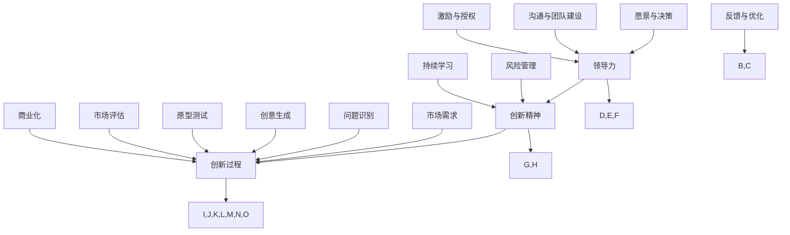

                 

### 引言与背景

#### 背景介绍

在当今快速变化的世界，创新已成为企业成功的关键因素。无论是技术行业、制造业，还是服务业，创新都是驱动增长和竞争的核心动力。然而，创新并不是一个孤立的过程，它需要有效的领导力来推动和实现。

领导力在这里扮演着至关重要的角色。领导力不仅仅是管理团队，还包括激发员工的潜力，塑造积极的工作氛围，以及制定并执行创新战略。一个优秀的领导者不仅要有愿景和决策能力，还需要具备激发创新精神的能力。

本文将深入探讨领导力与创新精神之间的关系，旨在帮助读者理解如何通过领导力来激发创新动力。我们将从多个角度进行分析，包括领导力的定义、创新的心理学基础、领导力与创新的策略和实践、领导力与组织文化的关系，以及领导力与创新教育的培养。

通过本文的阅读，读者将了解：

1. 领导力在创新过程中的作用和重要性。
2. 如何通过领导力来塑造和推动创新文化。
3. 领导力与员工创新行为的心理机制。
4. 创新领导力的策略和实践。
5. 领导力在创新组织中的文化构建。
6. 领导力与创新教育的融合。
7. 实际案例研究，以及领导力与创新面临的挑战和未来趋势。

让我们一步一步地深入探讨这些关键问题，为推动创新提供实用的策略和实践指导。

---

#### 核心概念与联系

要理解领导力与创新精神之间的关系，我们首先需要明确几个核心概念：领导力、创新精神、创新过程、以及它们之间的内在联系。

**领导力** 是指领导者通过激励、引导和影响他人来实现共同目标的能力。领导力包括多个维度，如愿景、沟通、决策、团队建设、以及激励和授权等。

**创新精神** 指的是不断寻找新的解决方案、创造新的产品和服务、或改进现有产品和服务的能力。创新精神是一种积极的思维方式，强调尝试新事物、接受风险，以及持续学习和成长。

**创新过程** 是从问题识别到解决方案生成的系统化过程。它包括需求识别、创意生成、概念开发、原型测试、市场评估，以及最终的商业化。

**核心概念之间的关系架构** 可以通过以下Mermaid流程图来表示：

在这个关系架构中，领导力通过愿景与决策、沟通与团队建设、激励与授权等方面影响创新精神，而创新精神则通过风险管理、持续学习等能力推动创新过程。创新过程又通过市场需求、问题识别、创意生成等步骤反作用于领导力，形成良性循环。

通过这个流程图，我们可以清晰地看到领导力、创新精神和创新过程之间的相互关系。领导力不仅仅是推动创新的关键因素，也是确保创新过程有效运行的基础。而创新精神和创新过程则是实现领导力目标的具体手段和路径。

接下来，我们将进一步探讨这些核心概念，并分析领导力如何具体地激发创新精神，以及创新精神如何推动创新过程。

---

### 领导力与创新能力的关系

领导力在推动创新能力方面发挥着至关重要的作用。首先，领导力通过设定愿景和目标来指引创新方向。一个明确的愿景可以激发团队的动力，使其朝着共同的目标前进。领导者需要通过有效的沟通，将愿景传达给团队成员，确保每个人都明白自己的角色和责任。

其次，领导力在塑造团队文化和氛围方面也有重要作用。创新需要在一个支持风险和试错的氛围中进行，这要求领导者建立开放、包容、以及鼓励试错的文化。通过建立信任和开放的沟通渠道，领导者可以鼓励团队成员自由表达自己的想法，并支持他们在实践中探索新的解决方案。

此外，领导力在团队协作和资源整合中也起着关键作用。创新往往需要跨部门的合作和多学科的整合，领导者需要具备协调和组织能力，以确保团队能够高效协作，充分利用资源。通过有效的团队建设，领导者可以激发团队成员的潜力，提高团队的整体创新能力。

一个典型的案例是苹果公司创始人史蒂夫·乔布斯。乔布斯以其卓越的领导力，成功地推动了苹果公司的创新。他不仅设定了清晰的愿景，如“让科技更人性化”，还通过严格的品质控制和精细的设计，推动了产品创新。乔布斯注重用户体验，不断追求完美，这种领导风格极大地激发了团队的创新精神。

在创新过程中，领导力还体现在对创新风险的接受和管理上。创新往往伴随着风险，领导者需要敢于接受失败，并为团队成员提供必要的支持和资源。例如，谷歌公司创始人拉里·佩奇和谢尔盖·布林在谷歌的早期发展阶段，就采取了允许员工自由探索的创新文化，这种文化极大地激发了员工的创新热情，也推动了谷歌在搜索引擎、云计算等领域的创新。

综上所述，领导力在激发创新能力方面具有多重作用。通过设定愿景、塑造文化、推动团队协作，以及管理创新风险，领导者可以有效地激发团队的创新能力，推动组织的持续创新和发展。

---

### 创新能力的心理学基础

要深入理解创新能力的心理学基础，我们需要探讨几个关键的心理机制：创新思维的特性、领导者的心理素质，以及领导力如何影响员工的创新行为。

首先，创新思维是一种独特的思维方式，它包括发散性思维、创造性思维、以及问题解决思维等多个方面。发散性思维指的是从一个中心点出发，产生多个可能的解决方案。创造性思维则是指通过独特的视角和想象力，创造全新的想法或方法。问题解决思维则是将创新思维应用于实际问题，找到有效的解决方案。

**发散性思维** 是创新思维的核心之一。研究表明，发散性思维能力强的人能够快速产生大量不同的想法，这些想法往往是创新的重要来源。领导者在激发员工的发散性思维方面扮演着重要角色。例如，通过鼓励团队成员提出新颖的观点，领导者可以促进团队内部的思维碰撞，从而激发创新。

**创造性思维** 与发散性思维密切相关，但它更强调创造全新的、独特的想法。创造性思维需要领导者具备开放的心态，愿意接受不同寻常的想法，并鼓励团队成员尝试新的方法。研究表明，领导者的态度和行为对员工的创造性思维有着显著影响。一个鼓励创新、支持试错的领导风格，能够激发员工的创造性思维，推动创新过程。

**问题解决思维** 是创新过程中不可或缺的一部分。领导者需要具备分析和解决复杂问题的能力，这包括对市场需求的敏锐洞察、对技术难题的深入理解，以及对资源的高效配置。通过培养员工的问题解决思维，领导者可以帮助团队更有效地应对挑战，找到创新的突破口。

其次，领导者的心理素质在创新能力的培养中起着关键作用。领导者的心理素质包括自信、灵活性、冒险精神、以及抗压能力等。

**自信** 是领导者成功的重要特质之一。自信的领导者能够清晰地表达自己的愿景，并激励团队成员相信自己能够实现目标。这种自信可以激发员工的信心和积极性，从而推动创新。

**灵活性** 是指领导者能够适应不断变化的环境，灵活调整策略和计划。在创新过程中，灵活性至关重要，因为它允许领导者迅速应对新的挑战和机遇，保持团队的创新能力。

**冒险精神** 是领导者愿意承担风险，勇于尝试新事物的一种表现。领导者需要鼓励员工尝试新的想法和方法，即使这些想法可能失败。冒险精神可以创造一个充满活力和创新的工作环境，从而激发员工的创新潜力。

**抗压能力** 是领导者应对压力和挑战的能力。创新往往伴随着不确定性和失败的风险，领导者需要有足够的抗压能力来支持团队成员度过难关，继续前进。

最后，领导力如何影响员工的创新行为是一个值得探讨的问题。领导者的行为和态度直接影响到员工的工作动机和创新行为。

**激励机制** 是领导力影响员工创新行为的一个重要方面。有效的激励机制可以激发员工的积极性，鼓励他们提出创新的想法。例如，领导者可以通过奖励制度来表彰员工的创新成果，这种奖励可以是物质上的，如奖金和晋升，也可以是精神上的，如公开表彰和认可。

**沟通与反馈** 是领导力影响员工创新行为的另一个重要方面。领导者需要与员工保持开放的沟通渠道，鼓励他们分享自己的想法和反馈。通过及时的反馈，领导者可以帮助员工改进他们的创新方案，提高创新的成功率。

**支持与资源** 是领导力影响员工创新行为的最后一个方面。领导者需要确保员工有足够的资源和支持，以便他们能够自由地探索和尝试新的想法。这包括提供必要的技术支持、培训机会，以及灵活的工作安排。

综上所述，创新能力的心理学基础包括创新思维的特性、领导者的心理素质，以及领导力如何影响员工的创新行为。通过理解这些心理学机制，领导者可以更有效地激发团队的创新能力，推动组织的持续创新和发展。

---

### 领导力与创新的策略与实践

要有效地推动创新，领导者需要制定并实施一系列策略和实践，以确保创新目标的实现。以下是一些关键策略和实践：

**一、建立清晰的创新愿景和目标**

首先，领导者需要明确组织的创新愿景和目标。这个愿景应该与组织的整体战略相一致，并能够激发团队成员的热情和动力。领导者可以通过定期的沟通会议、团队建设活动，以及内部宣传等方式，确保每位员工都清楚了解创新的目标和重要性。

**二、塑造支持创新的文化**

创新文化是推动创新的关键因素。领导者需要塑造一个开放、包容、鼓励试错的文化，使员工敢于提出新的想法，并且不用担心失败的风险。这可以通过以下几个方面来实现：

1. **鼓励自由沟通和分享**

   领导者应该鼓励员工自由地表达自己的想法和观点，并建立开放的沟通渠道，如内部论坛、创新工作室等。这有助于激发员工的创造性思维，促进团队内部的思维碰撞。

2. **建立反馈机制**

   领导者需要建立有效的反馈机制，鼓励员工提出改进意见，并对他们的创新想法给予积极的反馈。通过及时反馈，领导者可以帮助员工不断改进他们的创新方案，提高创新的成功率。

3. **提供必要的资源和支持**

   领导者需要确保员工有足够的资源和支持，以便他们能够自由地探索和尝试新的想法。这包括提供技术支持、培训机会，以及灵活的工作安排。

**三、制定创新战略和规划**

创新不是一次性的活动，而是一个持续的过程。领导者需要制定长期的创新战略和规划，以确保组织的创新能力持续提升。以下是一些制定创新战略和规划的关键步骤：

1. **市场研究**

   领导者需要进行市场研究，了解市场需求和趋势，以便确定创新的方向。这可以通过定期的市场调研、竞争对手分析，以及用户反馈等方式实现。

2. **资源分配**

   领导者需要合理分配资源，确保创新项目得到充分的资金、人力和技术支持。这可以通过建立创新基金、设立专项项目团队等方式实现。

3. **风险评估**

   领导者需要对创新项目进行风险评估，识别潜在的风险，并制定相应的应对措施。这有助于确保创新项目在实施过程中能够顺利进行。

**四、培养创新团队和人才**

创新团队是组织创新的核心力量。领导者需要培养一支具有创新能力、团队合作精神，以及持续学习能力的团队。以下是一些培养创新团队和人才的关键措施：

1. **选拔和培训**

   领导者需要选拔具有创新潜力的人才，并通过定期培训，提升他们的专业技能和创新思维。

2. **激励机制**

   领导者需要建立有效的激励机制，鼓励员工提出创新想法，并对创新成果给予奖励。这可以通过绩效评估、奖金、晋升等方式实现。

3. **跨部门合作**

   领导者需要促进跨部门合作，鼓励不同部门之间的知识共享和经验交流，以促进创新团队的整体创新能力。

**五、监控和评估创新绩效**

最后，领导者需要建立有效的监控和评估机制，定期评估创新项目的绩效，并据此进行调整和优化。以下是一些监控和评估创新绩效的关键步骤：

1. **关键绩效指标（KPI）**

   领导者需要制定关键绩效指标（KPI），以量化评估创新项目的效果。这些指标可以包括创新项目的数量、成功率、市场影响力等。

2. **定期报告**

   领导者需要定期向高层管理团队报告创新项目的进展和成果，确保他们了解组织的创新情况，并根据需要调整战略和资源。

3. **反馈和改进**

   领导者需要收集员工的反馈，了解他们对创新过程的看法和建议，并根据反馈进行改进，以提高创新效率和质量。

通过以上策略和实践，领导者可以有效地推动创新，激发团队的创新能力，为组织带来持续的竞争优势。

---

### 领导力与创新的组织文化

领导力不仅影响个体创新行为，还深刻塑造组织文化，而组织文化又对创新有着至关重要的影响。一个支持创新的组织文化能够激发员工的创造力，促进知识共享和协作，从而推动组织的持续创新。

首先，领导力在塑造组织文化方面起着核心作用。领导者通过自己的行为和决策，传达组织的价值观和期望，从而塑造组织文化。一个具有创新精神的领导者会鼓励员工自由思考、勇于尝试，并容忍失败。这样的领导风格有助于建立一种开放、包容、鼓励试错的文化，使员工敢于提出新的想法，并愿意在创新过程中承担责任。

其次，组织文化对创新的影响是深远的。一个支持创新的组织文化通常具有以下特征：

1. **开放性**：组织文化鼓励员工自由表达观点，分享知识和经验，促进不同部门之间的合作和交流。

2. **包容性**：组织文化尊重多样性，包括不同背景、观点和技能的员工，使每个人都感到被重视和认可。

3. **灵活性**：组织文化鼓励员工尝试新方法，适应变化，并迅速调整策略以应对挑战。

4. **鼓励风险承担**：组织文化容忍失败，并认为失败是创新过程中的必经之路，这种态度可以激励员工勇于尝试新的想法和方案。

为了构建一个支持创新的组织文化，领导者可以采取以下策略：

**一、建立明确的创新价值观**

领导者需要明确表达组织的创新价值观，并将其融入日常工作中。这可以通过制定创新宣言、设立创新奖项等方式实现。明确的创新价值观可以帮助员工了解组织对创新的重视，并激发他们的创新热情。

**二、建立激励机制**

领导者需要建立与创新价值观相一致的激励机制，鼓励员工提出创新想法，并对成功实现创新成果的员工给予奖励。这些奖励可以包括奖金、晋升、荣誉表彰等，以激发员工的积极性和创造力。

**三、促进知识共享和协作**

领导者需要鼓励员工分享知识和经验，促进跨部门之间的合作和交流。这可以通过建立内部论坛、创新工作室、定期团队建设活动等方式实现。知识共享和协作有助于激发员工的创新思维，促进新想法的产生。

**四、建立反馈和改进机制**

领导者需要建立有效的反馈和改进机制，使员工能够及时了解他们的创新成果和反馈，并根据反馈进行调整和优化。这种机制可以帮助员工不断改进他们的创新方案，提高创新的成功率。

**五、培养创新氛围**

领导者需要营造一种积极、包容、鼓励试错的工作氛围，使员工感到安全和放心，敢于提出新的想法和尝试。这可以通过开展创新培训、提供创新工具和资源等方式实现。

通过以上策略，领导者可以有效地塑造和支持一个创新的组织文化，激发员工的创新潜力，推动组织的持续创新和发展。

---

### 领导力与创新的教育与培养

在创新时代，领导力与创新精神的培养变得尤为重要。这不仅涉及到领导者的个人成长，还涉及到整个组织文化的建设。以下是如何通过教育与实践来培养领导力与创新精神，以激发创新动力。

#### 教育与培训

**一、创新思维培训**

创新思维是领导者推动创新的核心能力之一。通过系统的培训，领导者可以学习到发散性思维、创造性思维、问题解决思维等创新方法。以下是一些具体的方法：

- **头脑风暴**：这是一种激发创造力的方法，通过快速产生大量的想法，从而找到创新的解决方案。
- **思维导图**：通过图形化方式组织思维，帮助领导者梳理复杂的信息，发现潜在的创新点。
- **情景模拟**：通过模拟不同的情境，让领导者学会在压力和不确定性下做出决策，从而提高创新应对能力。

**二、领导力发展课程**

领导力发展课程可以帮助领导者提升管理技能，包括团队建设、沟通技巧、决策能力等。这些课程通常结合理论学习与实际案例，使领导者能够在真实环境中应用所学知识。

- **情景分析**：通过分析现实中的领导案例，帮助领导者理解在不同情境下如何做出正确的决策。
- **角色扮演**：通过模拟不同领导角色，让领导者体验不同的领导风格和策略，从而提高领导力。

**三、专业发展研讨会**

参加专业发展研讨会可以帮助领导者了解最新的创新理论和实践，拓宽视野，学习先进的管理方法。这些研讨会通常邀请行业专家和学者分享最新的研究成果和最佳实践。

#### 实践

**一、创新实验室**

创新实验室是一个专门用于实验和测试新想法的环境。领导者可以通过创新实验室，尝试新的管理方法和技术解决方案，从而培养创新精神和实践能力。

- **敏捷管理**：通过引入敏捷管理方法，领导者可以快速响应变化，不断优化管理流程，提高创新效率。
- **跨部门合作**：创新实验室可以促进不同部门之间的合作，通过跨部门团队协作，实现资源的最大化利用。

**二、创新项目**

通过实施创新项目，领导者可以将理论知识转化为实践，从而提升创新能力和领导力。以下是一些具体的创新项目：

- **产品创新**：通过开发新产品或改进现有产品，领导者可以学习到产品开发的全过程，从市场调研到产品上市。
- **流程改进**：通过优化内部流程，提高效率和降低成本，领导者可以学习到如何通过创新提高组织的运营效率。

**三、领导力实践**

领导力实践是培养领导力和创新精神的重要途径。以下是一些具体的领导力实践：

- **导师制**：通过导师制，领导者可以与经验丰富的导师合作，学习他们的领导经验和创新策略。
- **内部轮岗**：通过内部轮岗，领导者可以了解组织的不同部门和工作流程，提高跨部门协作能力。

#### 综合方法

**一、持续学习**

持续学习是领导者不断提升自身能力和适应变化的关键。通过阅读书籍、参加培训、参加研讨会等方式，领导者可以不断更新知识，学习最新的创新理论和实践。

**二、反思与反馈**

反思与反馈是领导者成长的重要环节。领导者需要定期反思自己的领导行为，接受团队成员的反馈，并根据反馈进行调整和改进。

**三、建立创新生态系统**

建立创新生态系统是组织持续创新的关键。领导者需要建立一个支持创新的环境，包括资源支持、激励机制、以及开放的文化氛围。

通过教育与培训、实践和综合方法，领导者可以不断提升自身的创新能力和领导力，从而激发团队的创新动力，推动组织的持续创新和发展。

---

### 领导力与创新的实际案例研究

为了更好地理解领导力如何激发创新精神，我们可以通过几个国内外企业的实际案例来探讨领导力在创新中的成功实践。

#### 案例一：谷歌公司的“X实验室”

谷歌公司的“X实验室”（Google X）是一个专门致力于进行前沿技术创新的部门。该实验室由谷歌联合创始人拉里·佩奇领导，他在领导“X实验室”时，采用了一种极具创新精神的领导风格。佩奇鼓励团队成员自由探索，敢于尝试新的想法，即使这些想法在最初可能看起来是疯狂的。

**案例细节：**

- **领导力风格**：佩奇采用了一种开放、包容的领导风格，允许团队成员进行自主研究，并为失败提供空间。
- **创新成果**：“X实验室”成功研发了包括Google Glass、自动驾驶汽车、以及无人机网络等项目，这些项目在市场上取得了巨大成功。

**经验教训：**

- 领导者需要建立一种支持风险承担和鼓励试错的文化，为团队成员提供自由探索和创新的空间。
- 领导者的包容心态和创新愿景是激发团队创新能力的关键。

#### 案例二：苹果公司的创新领导力

苹果公司（Apple Inc.）以其不断推出的革命性产品而闻名。苹果公司前CEO史蒂夫·乔布斯（Steve Jobs）是一位极具创新精神的领导者，他通过卓越的领导力推动了苹果公司的创新。

**案例细节：**

- **领导力风格**：乔布斯注重用户体验，对产品细节有着极高的要求。他通过强有力的愿景和决策，确保苹果公司始终走在技术创新的前沿。
- **创新成果**：苹果公司推出了包括iPhone、iPad、MacBook等产品，这些产品不仅改变了消费电子行业，也对整个社会产生了深远的影响。

**经验教训：**

- 领导者的愿景和决策能力对创新至关重要。一个明确的愿景可以指引团队的方向，而强有力的决策可以确保创新项目得到有效的执行。
- 注重用户体验是推动创新的重要途径。通过深入了解用户需求，领导者可以开发出真正满足用户需求的产品。

#### 案例三：腾讯公司的“双百”创新计划

腾讯公司（Tencent）是中国领先的互联网公司之一，其在创新方面的成功也得益于其独特的领导力策略。腾讯的“双百”创新计划是一个旨在鼓励员工提出创新想法的内部项目。

**案例细节：**

- **领导力风格**：腾讯公司CEO马化腾鼓励员工积极参与创新，通过内部竞争机制激发员工的创新热情。
- **创新成果**：“双百”创新计划推动了腾讯在多个领域取得突破，包括社交游戏、云计算、人工智能等。

**经验教训：**

- 内部竞争机制可以激发员工的创新潜力，促进团队之间的良性竞争。
- 领导者需要提供必要的支持和资源，以确保创新项目能够顺利实施。

#### 案例四：丰田公司的精益创新

丰田公司（Toyota）以其精益生产而闻名，其在创新方面的成功也得益于其独特的领导力和管理方法。

**案例细节：**

- **领导力风格**：丰田公司的领导层注重持续改进，通过不断的实验和优化，提高生产效率和质量。
- **创新成果**：丰田公司推出了包括混合动力车、自动驾驶技术等在内的多项创新产品，这些产品在全球市场上取得了巨大成功。

**经验教训：**

- 持续改进和创新是推动企业长期发展的关键。领导者需要鼓励员工不断寻求改进机会，并为此提供支持。
- 精益管理方法是一种有效的创新管理模式，可以帮助企业不断优化流程，提高创新能力。

通过以上实际案例研究，我们可以看到，领导力在激发创新精神方面具有多重作用。一个具有远见和创新精神的领导者，可以塑造积极的工作氛围，提供必要的资源和支持，并通过有效的决策和愿景引导团队实现持续的创新和发展。

---

### 领导力与创新的挑战与未来趋势

在当前的复杂环境中，领导力与创新面临着诸多挑战和机遇。以下是一些关键的挑战和未来趋势：

**一、挑战**

1. **技术快速变化**：随着技术的快速发展，领导者需要不断更新自己的知识和技能，以应对新的技术挑战。这要求领导者具备终身学习的意识和能力。

2. **全球竞争加剧**：全球化带来了激烈的竞争，领导者需要具备跨文化管理和领导能力，以在全球市场中保持竞争力。

3. **员工期望提高**：现代员工更加注重工作满意度、职业发展和工作与生活的平衡。领导者需要理解和满足这些需求，以保持员工的高效和创新。

4. **不确定性增加**：在快速变化的环境中，领导者需要具备应对不确定性和风险的能力，以保持组织的灵活性和适应性。

**二、未来趋势**

1. **数字化领导力**：数字化技术的普及要求领导者具备数字素养和数字化管理能力，能够利用数据分析、人工智能等工具来驱动创新。

2. **开放创新**：开放创新正在成为趋势，领导者需要鼓励外部合作和知识共享，通过跨组织、跨行业的合作来推动创新。

3. **可持续领导力**：随着可持续发展成为全球关注的热点，领导者需要将可持续发展的理念融入到创新战略中，推动企业实现长期可持续发展。

4. **人本领导力**：人本领导力强调关注员工的发展和幸福感，领导者需要通过建立积极的组织文化，提升员工的工作满意度和忠诚度。

**三、建议**

1. **持续学习**：领导者应不断更新自己的知识和技能，关注行业动态，积极参与培训和学习活动。

2. **培养创新能力**：建立创新文化，鼓励员工提出新的想法，并提供必要的资源和支持，以激发团队的创新能力。

3. **强化跨部门协作**：促进跨部门之间的合作和知识共享，打破部门壁垒，提高整体创新能力。

4. **建立灵活的组织结构**：设计灵活的组织结构，以适应快速变化的环境和市场需求，提高组织的适应性和创新能力。

通过应对这些挑战和把握未来趋势，领导者可以更好地激发创新精神，推动组织实现持续的创新和发展。

---

### 结论

在本文中，我们系统地探讨了领导力与创新精神之间的关系，强调了领导力在激发创新动力中的关键作用。通过分析领导力与创新能力的关系、心理学基础、策略与实践、组织文化、教育与培养，以及实际案例研究，我们得出以下结论：

1. **领导力是激发创新精神的核心驱动力**：领导力通过设定愿景、塑造文化、推动团队协作和管理创新风险，有效地激发员工的创新潜力。
2. **创新的心理学基础**：创新思维、领导者的心理素质，以及领导力如何影响员工的创新行为，是推动创新的重要心理机制。
3. **领导力与创新的策略与实践**：领导者通过制定创新战略、塑造创新文化、培养创新团队，以及监控和评估创新绩效，可以有效地推动组织的创新能力。
4. **创新的组织文化**：支持创新的组织文化能够促进知识共享、增强团队协作，并为创新提供必要的资源和环境。
5. **教育与培养**：通过教育和培训，领导者可以不断提升自身的创新能力和领导力，从而激发团队的创新动力。

为了进一步激发创新动力，我们提出以下实践建议：

1. **持续培养领导力和创新能力**：领导者应通过不断学习和实践，提升自身的领导力和创新能力，以应对快速变化的环境。
2. **建立创新文化**：塑造开放、包容、鼓励试错的文化氛围，使员工敢于提出新的想法，并在创新过程中承担责任。
3. **强化跨部门协作**：促进不同部门之间的知识共享和协作，打破部门壁垒，提高整体创新能力。
4. **建立灵活的组织结构**：设计灵活的组织结构，以适应快速变化的环境和市场需求，提高组织的适应性和创新能力。

展望未来，领导力与创新精神的发展将面临新的机遇和挑战。随着技术进步和全球化进程的加快，领导者需要不断适应新的变化，推动组织的持续创新和发展。通过有效的领导力，我们可以激发创新精神，为组织带来持久的竞争优势，实现长期的可持续发展。

---

### 最佳实践 Tips、小结、注意事项、拓展阅读

**最佳实践 Tips：**

1. **设立明确的创新目标**：确保创新活动与组织的整体战略目标一致，明确创新的方向和目标。
2. **培养领导者的创新思维**：通过培训和学习，提升领导者的创新意识和能力，鼓励他们勇于尝试新方法。
3. **建立开放的文化**：创造一个支持创新、鼓励试错的开放文化，使员工敢于提出新想法，并在失败中吸取教训。
4. **提供充足的资源和支持**：确保创新项目有足够的资金、人力和技术支持，以顺利推进。
5. **激励员工参与创新**：通过奖励和表彰，激励员工积极参与创新活动，提高他们的创新积极性。

**小结：**

本文深入探讨了领导力与创新精神的关系，强调了领导力在激发创新动力中的关键作用。通过理论分析和实际案例研究，我们总结了领导力与创新的策略和实践，为组织提供了实用的创新管理指南。

**注意事项：**

1. **风险控制**：在推动创新的过程中，领导者需要平衡风险与收益，避免因过度冒险而导致资源浪费。
2. **持续改进**：创新不是一次性的活动，领导者需要持续优化创新流程，提高创新效率和质量。
3. **员工参与**：员工是创新的重要力量，领导者应鼓励他们积极参与创新活动，充分发挥他们的创造潜力。

**拓展阅读：**

1. **《创新者的窘境》**：克莱顿·克里斯滕森（Clayton Christensen）的这本书深入探讨了为什么优秀企业会失败，以及如何通过创新避免这种困境。
2. **《领导力心理学》**：詹姆斯·M.格里芬（James M. Griffin）的这本书详细介绍了领导力心理学的基本原理，对理解领导力如何影响创新行为具有指导意义。
3. **《创新者的基因》**：斯蒂芬·博斯纳（Steve Borsch）的这本书探讨了创新者的心理特质和行为模式，为领导者提供了培养创新思维的具体方法。

通过最佳实践 Tips、小结、注意事项和拓展阅读，我们希望读者能够更好地理解和应用领导力与创新精神，推动组织的持续创新和发展。作者：AI天才研究院/AI Genius Institute & 禅与计算机程序设计艺术 /Zen And The Art of Computer Programming。

