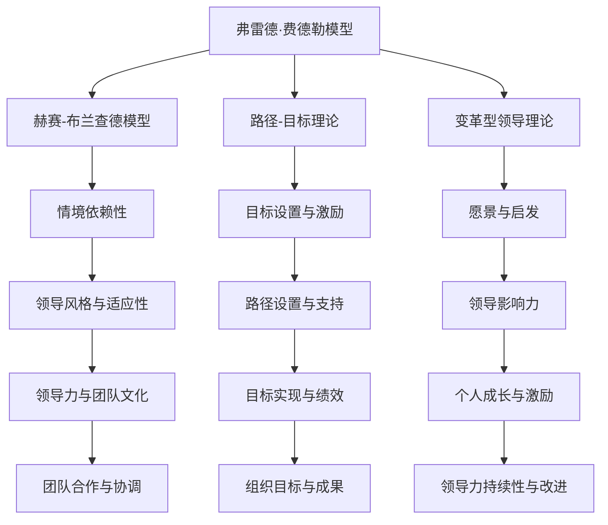

                 

### 引言：领导力与创新的必要性

在当今快速变化和竞争激烈的技术领域，领导力与创新成为了推动组织前进和取得成功的关键要素。领导力不仅是管理团队和分配资源的能力，更是激发团队成员潜力、推动创新思维和实现长远目标的核心力量。创新则是持续进步和突破传统限制的动力源泉，它能够帮助组织在技术变革和市场波动中保持竞争力。

首先，领导力在团队中的角色至关重要。一位出色的领导者不仅能够制定清晰的目标和战略，还能够建立积极的团队文化，提升团队协作效率。领导力包括一系列技能，如沟通能力、激励能力、决策能力和情绪管理能力。这些技能在带领团队解决复杂问题和应对挑战时尤为重要。

创新思维则强调跳出传统框架，以新颖的方式解决问题。在技术领域，创新可以帮助组织开发出革命性的产品和服务，从而在市场中占据优势。创新思维工具，如头脑风暴、思维导图和快速原型设计等，为团队提供了多种探索和试验新想法的方法。

本文将从以下几个方面探讨领导力与创新的关系及其在团队中的应用：

1. **领导力基础**：介绍领导力的定义、特点及其在团队中的作用。
2. **创新思维与方法**：探讨创新思维的重要性，介绍常用的创新思维工具和方法。
3. **领导力与创新结合**：分析领导力在创新过程中的角色，以及领导者如何激发团队创新。
4. **案例分析**：通过成功和失败的案例，展示领导力与创新在实际项目中的应用和效果。
5. **未来趋势与挑战**：讨论未来领导力与创新的发展趋势以及可能面临的挑战。
6. **实践与行动**：提供具体的实践建议和行动策略，帮助领导者提升团队的创新能力和领导力。

通过本文的探讨，我们将深入理解领导力与创新在技术领域的核心作用，并为读者提供实际可行的指导和方法，以推动团队走向未来。

## 第1章：领导力基础

### 1.1 领导力的定义与特点

领导力是一种复杂且多层次的能力，它不仅仅涉及指挥和控制，更重要的是激发和引导。首先，我们来看领导力的定义。领导力可以被理解为在不确定性和变化的环境中，通过愿景、价值观和策略，影响和激励他人共同实现目标的能力。这种定义强调了领导力不仅是技术层面的管理，更是一种心理和社会互动。

领导力的特点可以从多个维度来描述。首先，领导力具有情境性，即不同的情境需要不同的领导风格和策略。例如，在危机时刻，领导者可能需要采用更加果断和决断的风格，而在团队建设中，则需要更加温和和支持的领导风格。

其次，领导力具有持续性。领导力不仅仅是在特定时刻的表现，更是一个长期的过程。优秀的领导者能够通过持续的沟通、反馈和指导，建立起团队的信任和合作氛围。

接下来，我们探讨领导力的几种核心特点：

**愿景**：愿景是领导力的核心。一个强有力的愿景能够激励团队追求更高的目标，并为之努力奋斗。愿景不仅仅是目标的描述，更是一种对未来的憧憬和期待。

**影响力**：领导者的影响力是通过行为和决策来影响他人。这种影响力不仅仅体现在决策过程中，还体现在日常的沟通和互动中。一个有影响力的领导者能够激发团队成员的潜力，引导他们达成共同的目标。

**沟通能力**：沟通是领导力的关键。领导者需要能够清晰地传达愿景和目标，同时也需要倾听团队成员的意见和建议。有效的沟通能够减少误解和冲突，提升团队的协作效率。

**适应能力**：在快速变化的环境中，领导者的适应能力尤为重要。领导者需要能够迅速识别变化，调整策略，并引导团队应对新的挑战。这种适应能力不仅体现在技术层面，还包括心理层面的适应。

**激励能力**：激励能力是领导者引导和激发团队潜力的关键。领导者需要了解团队成员的需求和动机，并采取相应的激励措施，如奖励、认可和挑战等。

### 1.2 领导力模型与理论

为了更好地理解和应用领导力，学者和研究者们提出了多种领导力模型和理论。以下是一些重要的领导力模型：

**弗雷德·费德勒模型（Fiedler's Contingency Model）**：该模型认为，领导力效果取决于领导者、团队和环境三个因素之间的互动。领导者需要根据不同的环境选择最合适的领导风格。

**赫赛-布兰查德模型（Hersey-Blanchard Situational Leadership Model）**：该模型将领导风格分为四种，分别是指导型、推销型、参与型和授权型。领导者需要根据团队成员的成熟度选择合适的领导风格。

**路径-目标理论（Path-Goal Theory）**：该理论认为，领导者的主要任务是帮助团队成员实现目标，并提供清晰的路径和适当的支持。领导者需要根据团队成员的需求和环境条件调整领导行为。

**变革型领导理论（Transformational Leadership Theory）**：该理论强调领导者通过激励、启发和愿景来影响团队成员。变革型领导者能够激发团队成员的积极性和创造力，推动组织实现重大变革。

### 1.3 领导力与团队文化

领导力与团队文化之间存在着密切的关系。团队文化是团队成员共同持有的价值观、信念和行为方式。一个健康的团队文化能够提升团队的整体绩效和创新能力。

**领导力对团队文化的影响**：领导者通过其行为和决策塑造团队文化。领导者的价值观和态度直接影响团队成员的行为。例如，一个注重创新和学习的领导者能够培养出创新型和学习型的团队文化。

**团队文化对领导力的影响**：团队文化也会反过来影响领导力。一个开放和包容的团队文化能够促进领导者的成长和改进。相反，一个保守和封闭的团队文化可能会限制领导者的发挥。

**如何建立积极的团队文化**：
1. **明确价值观**：领导者需要明确团队的价值观，并将其融入日常管理和决策中。
2. **以身作则**：领导者需要通过自己的行为树立榜样，体现团队价值观。
3. **鼓励沟通与反馈**：领导者需要建立开放的沟通渠道，鼓励团队成员分享意见和建议。
4. **奖励与认可**：领导者需要通过奖励和认可来强化积极的行为和价值观。

### 结论

领导力是团队成功的关键要素，它不仅涉及个人的能力，还与团队文化和价值观密切相关。通过理解和应用不同的领导力模型和理论，领导者可以更好地激发团队的潜力，推动创新，实现长远目标。在下一章中，我们将探讨创新思维的重要性和常用方法，帮助领导者更好地应对技术领域的挑战。

### 1.1 领导力的定义与特点

#### 领导力的定义

领导力是一种综合能力，它不仅包含管理技能，还涵盖影响力和激励力。定义领导力时，我们可以将其视为一种能够通过愿景、价值观和行动引导他人共同实现目标的能力。具体来说，领导力涉及以下几个方面：

1. **愿景和目标**：领导者需要具备清晰的愿景和目标，这不仅是领导力的核心，也是团队前进的方向标。一个明确的愿景能够激励团队成员共同努力，克服困难，实现预期目标。

2. **影响力**：领导力的重要特征之一是影响力。领导者通过其行为、决策和沟通，影响和引导团队成员。影响力不仅仅是职位赋予的权威，更多的是基于领导者的人格魅力、知识和经验。

3. **激励和激发**：领导者的一个关键任务是激发团队成员的潜力，使其超越自我，实现更高的绩效。激励包括物质激励和非物质激励，如奖励、认可、培训等。

4. **沟通和协调**：有效的沟通是领导力的基础。领导者需要能够清晰地传达愿景和目标，同时倾听和理解团队成员的需求和意见。良好的沟通能够减少误解和冲突，增强团队凝聚力。

5. **决策和应对变化**：领导者需要具备快速决策和应对变化的能力。在技术领域，变化是常态，领导者必须能够灵活调整策略，以适应不断变化的环境。

#### 领导力的特点

1. **情境依赖性**：领导力并不是一成不变的，它依赖于具体情境。在不同的环境中，领导者需要采取不同的策略和风格。例如，在高度不确定的环境中，领导者可能需要更加果断和决断；而在稳定的环境中，领导者则可以更加注重团队合作和长期规划。

2. **持续性**：领导力不仅仅是短期的表现，更是一个持续的过程。一个优秀的领导者不仅能够在短期内取得成效，还能够通过持续的努力和改进，建立长期的组织能力。

3. **多元性**：领导力涵盖多个方面，包括个人品质、技能和经验。领导者需要具备多元化的能力，如技术能力、人际交往能力、决策能力等。

4. **价值观和使命感**：领导力建立在领导者个人的价值观和使命感上。一个有远见的领导者能够将个人的价值观融入到组织文化和战略中，从而推动组织的长期发展。

5. **合作与协调**：领导力不仅仅是个人能力的体现，更是团队合作和协调的结果。一个优秀的领导者能够激发团队成员的潜力，建立协作机制，实现团队目标。

### 1.2 领导力模型与理论

为了更好地理解和应用领导力，学者和研究者们提出了多种领导力模型和理论。以下是一些重要的领导力模型：

**弗雷德·费德勒模型（Fiedler's Contingency Model）**：该模型认为，领导力效果取决于领导者、团队和环境三个因素之间的互动。领导者需要根据不同的环境选择最合适的领导风格。

- **领导者特征**：包括领导者的人格特质、技能和经验。
- **团队特征**：包括团队的结构、成员的能力和动机。
- **环境特征**：包括任务的结构性、领导者的职位权力和团队面临的外部压力。

根据这些特征，费德勒模型将领导风格分为任务导向型（任务驱动、关注目标）和关系导向型（关系驱动、关注团队）。领导者需要根据具体情境调整领导风格，以最大化领导效果。

**赫赛-布兰查德模型（Hersey-Blanchard Situational Leadership Model）**：该模型将领导风格分为四种，分别是指导型、推销型、参与型和授权型。领导者需要根据团队成员的成熟度选择合适的领导风格。

- **指导型**：领导者明确指导团队成员的任务和行为。
- **推销型**：领导者通过说服和激励来引导团队成员。
- **参与型**：领导者与团队成员共同参与决策和任务。
- **授权型**：领导者给予团队成员自主权和责任。

**路径-目标理论（Path-Goal Theory）**：该理论认为，领导者的主要任务是帮助团队成员实现目标，并提供清晰的路径和适当的支持。领导者需要根据团队成员的需求和环境条件调整领导行为。

- **路径设置**：领导者明确团队成员的目标和实现路径。
- **目标激励**：领导者通过激励措施激发团队成员的积极性。
- **支持与指导**：领导者提供必要的支持和指导，帮助团队成员克服障碍。

**变革型领导理论（Transformational Leadership Theory）**：该理论强调领导者通过激励、启发和愿景来影响团队成员。变革型领导者能够激发团队成员的积极性和创造力，推动组织实现重大变革。

- **愿景**：领导者提出具有远见的愿景，激励团队成员追求更高的目标。
- **激励**：领导者通过认可和奖励激励团队成员。
- **启发**：领导者通过启发和激励团队成员，使其实现个人和组织的成长。

### 领导力模型的应用与联系

领导力模型并不是孤立存在的，它们之间存在内在联系。例如，变革型领导理论中的愿景和激励元素可以与路径-目标理论中的路径设置和目标激励相结合，以实现更高效的领导效果。同时，不同的领导力模型可以相互补充，根据具体情境灵活应用。

在技术领域，领导力模型的应用尤为重要。技术领域的快速变化和复杂性要求领导者具备高度的战略眼光和灵活应对能力。以下是一个简化的Mermaid流程图，展示了不同领导力模型之间的联系和应用：

这个流程图帮助我们更直观地理解不同领导力模型之间的关系和应用，从而为技术领域的领导者提供指导。

### 总结

领导力是一个复杂且多层次的概念，它不仅仅是管理技能的体现，更是一种影响力和激励力的结合。通过理解不同的领导力模型和理论，领导者可以更好地应对技术领域的挑战，提升团队的整体绩效和创新能力。在下一章中，我们将探讨创新思维的重要性和常用方法，帮助领导者进一步推动团队的发展。

### 1.3 领导力与团队文化

领导力与团队文化之间存在着密切的关联，它们相互作用，共同塑造组织的氛围和绩效。团队文化是团队成员在长期互动过程中形成的共同价值观、信念和行为方式。一个健康的团队文化能够促进创新和协作，提升团队的凝聚力和创造力。而领导力则在其中扮演着至关重要的角色，通过领导者的行为和决策，塑造和强化团队文化。

#### 领导力对团队文化的影响

1. **价值观和信念**：领导者的价值观和信念直接影响团队文化的形成。领导者通过自身的言行，将组织的核心价值观和信念传递给团队成员，使其成为团队文化的核心。

2. **行为和决策**：领导者的行为和决策是团队文化的重要体现。一个注重创新和学习的领导者会培养出一个创新型和学习型的团队文化，而一个强调效率和执行力的领导者则会塑造出高效和严谨的团队文化。

3. **沟通与互动**：领导者的沟通方式也影响着团队文化的形成。开放和诚实的沟通能够促进团队间的信任和理解，从而形成一个积极向上的团队文化。

4. **奖励和认可**：领导者的奖励和认可机制是团队文化的重要组成部分。通过公正和透明的奖励体系，领导者可以强化团队中的积极行为和价值观，从而塑造健康的团队文化。

#### 团队文化对领导力的影响

团队文化不仅受到领导力的影响，同时也对领导力产生反作用。一个积极的团队文化可以增强领导者的效能，而一个消极的团队文化则可能削弱领导力。

1. **支持与挑战**：一个支持性的团队文化可以为领导者提供强大的支持，使其能够更有效地实现组织目标。而一个充满挑战和竞争的团队文化则可能对领导力提出更高的要求，促使领导者不断改进和提升自己的能力。

2. **适应与变革**：团队文化也影响领导者应对变化的能力。一个开放和适应变化的团队文化能够帮助领导者更迅速地应对外部挑战，推动组织的变革和创新。

3. **信任与协作**：团队文化中的信任和协作氛围对领导力至关重要。一个高度信任的团队环境能够减少沟通成本，提高协作效率，从而增强领导者的领导效能。

#### 如何建立积极的团队文化

1. **明确价值观**：领导者需要明确团队的价值观，并将其融入到日常管理和决策中。这可以通过团队会议、内部培训等方式实现。

2. **以身作则**：领导者需要通过自己的行为来树立榜样，体现团队的价值观。例如，领导者可以通过积极参与团队活动、主动承担责任等方式，展示对团队的重视和关爱。

3. **鼓励沟通与反馈**：领导者需要建立开放的沟通渠道，鼓励团队成员分享意见和建议。定期的团队反馈和沟通会议可以增强团队成员之间的理解和信任。

4. **奖励与认可**：领导者需要通过奖励和认可来强化积极的行为和价值观。这可以通过设立团队奖励计划、公开表扬等方式实现。

5. **持续改进**：团队文化是一个动态的过程，需要领导者的持续关注和改进。领导者可以通过定期评估团队文化的现状，发现和解决存在的问题，以保持团队文化的健康和活力。

### 结论

领导力与团队文化之间存在紧密的互动关系。领导者不仅通过其行为和决策塑造团队文化，同时团队文化也反作用于领导力。一个积极的团队文化能够促进创新和协作，提升组织的整体绩效。通过明确价值观、以身作则、鼓励沟通与反馈、奖励与认可以及持续改进，领导者可以有效地建立和维护一个健康的团队文化。在下一章中，我们将探讨创新思维的重要性和常用方法，以帮助领导者进一步推动团队的发展。

### 1.3 领导力与团队文化

#### 领导力对团队文化的影响

领导力在塑造团队文化方面发挥着至关重要的作用。一个有远见的领导者能够通过自身的价值观、信念和行为，将团队引向积极的方向。以下是一些具体的例子：

1. **价值观传递**：领导者通过日常的言行和决策，将组织的核心价值观传递给团队成员。例如，一位注重创新和学习的领导者会通过鼓励团队成员尝试新方法和持续学习，来培养一个创新型的团队文化。

2. **榜样作用**：领导者的行为往往成为团队成员的榜样。一个关心团队、公平公正的领导者能够激发团队成员的信任和归属感，从而形成一个积极的团队文化。

3. **沟通渠道**：领导者通过建立开放的沟通渠道，鼓励团队成员表达意见和分享想法。定期的团队会议、反馈环节以及开放的办公环境等，都有助于团队成员之间的相互理解和信任，从而促进团队文化的健康发展。

4. **激励机制**：领导者通过奖励和认可来强化团队成员的积极行为和价值观。例如，设立团队奖励计划、公开表扬优秀成员等，能够激发团队成员的积极性和创造力，增强团队凝聚力。

#### 团队文化对领导力的影响

团队文化不仅受到领导力的影响，同时也会反作用于领导力。一个健康的团队文化能够为领导者提供支持和激励，提高领导效能。以下是一些具体的例子：

1. **支持与挑战**：一个支持性的团队文化可以为领导者提供强大的支持，使其能够更有效地实现组织目标。团队成员之间的信任和协作氛围，能够减少领导者的沟通成本，提高决策效率。

2. **适应与变革**：团队文化也影响领导者应对变化的能力。一个开放和适应变化的团队文化能够帮助领导者更迅速地应对外部挑战，推动组织的变革和创新。

3. **信任与协作**：团队文化中的信任和协作氛围对领导力至关重要。一个高度信任的团队环境能够减少沟通成本，提高协作效率，从而增强领导者的领导效能。

#### 如何建立积极的团队文化

建立积极的团队文化是一个长期的过程，需要领导者的持续努力和关注。以下是一些具体的建议：

1. **明确价值观**：领导者需要明确团队的价值观，并将其融入到日常管理和决策中。这可以通过团队会议、内部培训等方式实现。

2. **以身作则**：领导者需要通过自己的行为来树立榜样，体现团队的价值观。例如，领导者可以通过积极参与团队活动、主动承担责任等方式，展示对团队的重视和关爱。

3. **鼓励沟通与反馈**：领导者需要建立开放的沟通渠道，鼓励团队成员分享意见和建议。定期的团队反馈和沟通会议可以增强团队成员之间的理解和信任，从而促进团队文化的健康发展。

4. **奖励与认可**：领导者需要通过奖励和认可来强化积极的行为和价值观。这可以通过设立团队奖励计划、公开表扬等方式实现。

5. **持续改进**：团队文化是一个动态的过程，需要领导者的持续关注和改进。领导者可以通过定期评估团队文化的现状，发现和解决存在的问题，以保持团队文化的健康和活力。

#### 成功案例

一个成功的团队文化案例是谷歌。谷歌以其开放和创新的团队文化而闻名。谷歌的领导者通过鼓励员工自由探索新项目和尝试新想法，建立了高度信任和协作的团队氛围。谷歌的“20%时间”政策允许员工将20%的工作时间用于自己感兴趣的项目，这激发了员工的主观能动性和创新精神。此外，谷歌还通过定期的员工反馈会议和公开的沟通渠道，确保团队成员之间的信息畅通和相互理解。这些举措共同塑造了谷歌独特的团队文化，使其在技术领域保持了持续的创新和竞争力。

### 结论

领导力与团队文化之间存在密切的互动关系。领导者通过其行为和决策塑造团队文化，而团队文化也反作用于领导力。一个积极的团队文化能够促进创新和协作，提升组织的整体绩效。通过明确价值观、以身作则、鼓励沟通与反馈、奖励与认可以及持续改进，领导者可以有效地建立和维护一个健康的团队文化。在下一章中，我们将探讨创新思维的重要性和常用方法，以帮助领导者进一步推动团队的发展。

### 2.1 创新的重要性

在技术领域，创新是推动进步和竞争力的关键驱动力。它不仅能够带来新的技术和产品，还能为企业带来竞争优势，提升市场地位。以下是创新在技术领域中的重要性：

#### 1. 提升竞争力

创新是企业在激烈市场竞争中脱颖而出的重要手段。通过不断创新，企业可以开发出独特的产品和服务，满足市场需求，从而在竞争中占据有利地位。例如，苹果公司通过不断推出创新的产品和服务，如iPhone、iPad和Apple Watch，持续保持了在科技领域的领先地位。

#### 2. 开拓新市场

创新能够帮助企业发现新的市场和机会。在技术领域，新的技术突破和产品创新可以打开全新的市场空间，为企业带来巨大的商业价值。例如，5G技术的推出为移动通信行业带来了新的机遇，催生了一系列相关的产品和服务。

#### 3. 提高生产效率

创新能够提高生产效率，降低成本。通过引入新的技术和管理方法，企业可以优化生产流程，提高生产效率，从而降低生产成本。例如，精益生产方法和自动化技术的应用，极大地提高了制造业的生产效率。

#### 4. 促进可持续发展

创新对于可持续发展也具有重要意义。通过开发环保技术和可持续产品，企业可以减少资源消耗和环境污染，推动社会的可持续发展。例如，特斯拉公司通过推出电动汽车和太阳能产品，推动了能源领域的可持续发展。

#### 5. 激发员工潜力

创新能够激发员工的创造力和潜力。一个鼓励创新的组织文化可以激发员工的积极性和创造力，使其在实现个人成长的同时，也为企业创造价值。例如，谷歌的“20%时间”政策允许员工将20%的工作时间用于自己感兴趣的项目，这激发了员工的创新精神，产生了许多创新成果。

### 2.2 创新思维工具

为了有效地进行创新，组织和个人需要运用各种创新思维工具。以下是一些常用的创新思维工具：

#### 1. 头脑风暴

头脑风暴是一种激发创意的方法，通过集体讨论和自由联想，产生大量的创意点子。这种方法强调数量而非质量，鼓励参与者不要对任何想法进行评判，而是尽量多想。

#### 2. 思维导图

思维导图是一种图形化的思维工具，通过将想法和概念以节点和连接线的形式进行可视化，帮助人们更好地理解和组织复杂的信息。思维导图可以用于项目规划、问题解决和创新思维等。

#### 3. 六顶思考帽

六顶思考帽是一种思维工具，通过分别使用六种不同的思考方式（白色、红色、黑色、黄色、绿色和蓝色帽子）来分析问题，从而实现全面和深入的理解。这种方法有助于避免思维偏见，促进创造性思考。

#### 4. 设计思维

设计思维是一种以人为本的创新方法，强调通过理解用户需求、探索解决方案和快速迭代来创造有价值的产品和服务。设计思维过程包括 empathy（同理心）、define（定义问题）、ideate（创意生成）、prototype（原型设计）和test（测试验证）等步骤。

#### 5. SWOT分析

SWOT分析是一种用于评估企业或项目的优势和劣势、机会和威胁的方法。通过分析内部和外部环境，SWOT分析可以帮助组织制定更有针对性的创新策略。

### 2.3 创新方法与实践

创新不仅仅是一种思维方式，更是一种可以实际操作的过程。以下是一些具体的创新方法和实践：

#### 1. 快速原型设计

快速原型设计是一种快速构建和测试产品原型的方法。通过快速迭代和反馈，团队可以不断改进产品，缩短产品开发周期，提高市场竞争力。

#### 2. 开放创新

开放创新是指企业通过与其他组织合作，共同开发和利用创新资源。这种方法可以借助外部智慧和资源，加速创新过程，降低创新成本。

#### 3. 跨学科合作

跨学科合作是指不同领域的专家和团队合作，共同解决复杂问题。通过跨学科的视角和方法，可以产生更多创新的想法和解决方案。

#### 4. 竞赛和挑战

组织内部或外部的竞赛和挑战活动可以激发团队的创造力和竞争意识，鼓励团队成员提出创新的想法和解决方案。

#### 5. 持续学习和知识共享

持续学习和知识共享是保持创新能力的重要手段。通过不断学习新知识和技能，团队可以不断更新和创新，为组织的发展提供持续的动力。

### 结论

创新在技术领域中具有重要地位，它不仅能够提升企业的竞争力，还能带来新的市场机会和可持续发展的潜力。通过运用各种创新思维工具和方法，组织和个人可以更有效地进行创新，推动技术进步和业务发展。在下一章中，我们将探讨领导力在创新过程中的关键角色，以及领导者如何激发团队创新。

### 2.1 创新的重要性

在技术领域，创新不仅是进步的驱动力，更是企业获得竞争优势和持续发展的关键因素。以下是创新在技术领域中的几个重要方面：

#### 1. 促进技术进步

创新是技术进步的重要推动力。通过不断地探索和开发新的技术，企业能够推动整个行业向前发展。例如，互联网技术的发展极大地改变了全球的通信和商业模式。

#### 2. 提升竞争力

创新能够帮助企业建立和维持竞争优势。通过开发新的产品和服务，企业可以满足市场需求，吸引更多的客户，从而在竞争激烈的市场中脱颖而出。例如，特斯拉通过推出创新的电动汽车技术，改变了传统汽车行业的竞争格局。

#### 3. 开拓新市场

创新能够帮助企业发现和开拓新的市场机会。通过开发新的技术或产品，企业可以进入新的市场领域，开辟新的商业空间。例如，5G技术的推出为通信行业带来了新的市场机会。

#### 4. 增强用户体验

创新能够提升用户体验，使产品和服务更加贴近用户需求。通过改进技术和设计，企业可以提供更优质的产品和服务，从而增强用户的满意度和忠诚度。

#### 5. 促进可持续发展

创新对于可持续发展也具有重要意义。通过开发环保技术和可持续产品，企业可以减少资源消耗和环境污染，推动社会的可持续发展。例如，许多公司正在通过创新来减少碳排放，实现碳中和目标。

#### 6. 激发员工创造力

创新能够激发员工的创造力和主动性。在一个鼓励创新的组织中，员工更有机会提出新的想法和解决方案，从而实现个人成长和职业发展。

#### 7. 提高生产效率

创新能够提高生产效率，降低成本。通过引入新的技术和流程，企业可以优化生产流程，减少资源浪费，提高生产效率。

### 创新的重要性总结

创新在技术领域中具有不可替代的重要性。它不仅能够推动技术进步和业务发展，还能为企业带来竞争优势和可持续发展。通过持续的创新，企业可以保持市场竞争力，满足用户需求，实现长期发展。因此，创新是每个技术领域企业都必须重视和投入的关键领域。

### 2.2 创新思维工具

在技术领域，有效的创新思维工具和方法是提升创新能力和实现技术突破的关键。以下是一些常用的创新思维工具：

#### 1. 头脑风暴

**定义**：头脑风暴是一种集体创意思维方法，通过鼓励参与者自由表达想法，产生大量的创意点子。

**步骤**：
- **准备阶段**：确定讨论主题，确保所有参与者熟悉讨论内容。
- **自由表达**：每个参与者可以无拘无束地提出自己的想法，不要评判或否定。
- **记录想法**：将所有提出的点子记录下来，无论其是否可行。
- **筛选和改进**：对记录的想法进行筛选和改进，识别出最有潜力的创意。

**优点**：头脑风暴能够快速产生大量创意，激发团队的创造力和想象力。

**应用示例**：在产品开发初期，通过头脑风暴讨论可能的用户需求和功能点，为后续设计提供灵感。

#### 2. 思维导图

**定义**：思维导图是一种利用节点和连接线展示思维过程的图形化工具，有助于组织和理解复杂信息。

**步骤**：
- **确定中心主题**：在中心位置确定讨论的主题或问题。
- **分支展开**：从中心主题出发，绘制出相关的子主题和关键词。
- **连接节点**：用线条将相关的节点连接起来，形成完整的思维导图。

**优点**：思维导图能够直观地展示信息结构，促进思维过程的可视化和系统化。

**应用示例**：在项目规划阶段，通过思维导图梳理项目目标和任务，明确工作分工和时间安排。

#### 3. 六顶思考帽

**定义**：六顶思考帽是一种思维工具，通过分别使用六种不同的思考方式（白色、红色、黑色、黄色、绿色和蓝色帽子）来分析问题，从而实现全面和深入的理解。

**步骤**：
- **白色帽子**：客观分析事实和数据。
- **红色帽子**：表达情感和直觉。
- **黑色帽子**：评估潜在问题和风险。
- **黄色帽子**：考虑积极面和优点。
- **绿色帽子**：提出创新和创意。
- **蓝色帽子**：控制思考和讨论流程。

**优点**：六顶思考帽能够避免思维偏见，促进多样化的思考。

**应用示例**：在团队决策过程中，通过六顶思考帽的方法，确保每个方面都被充分考虑。

#### 4. 设计思维

**定义**：设计思维是一种以人为本的创新方法，强调通过理解用户需求、探索解决方案和快速迭代来创造有价值的产品和服务。

**步骤**：
- **同理心（Empathy）**：深入了解用户的需求和痛点。
- **定义问题（Define）**：明确要解决的问题和目标。
- **创意生成（Ideate）**：产生多种可能的解决方案。
- **原型设计（Prototype）**：构建和测试原型，收集用户反馈。
- **测试验证（Test）**：根据反馈不断改进产品。

**优点**：设计思维注重用户需求和实际应用，能够快速迭代和改进。

**应用示例**：在开发新产品时，通过设计思维方法，确保产品满足用户需求，并具有良好的用户体验。

#### 5. SWOT分析

**定义**：SWOT分析是一种用于评估企业或项目的优势和劣势、机会和威胁的方法。

**步骤**：
- **优势（Strengths）**：分析企业的内部优势。
- **劣势（Weaknesses）**：识别企业的内部劣势。
- **机会（Opportunities）**：分析外部环境中的机会。
- **威胁（Threats）**：识别外部环境中的威胁。

**优点**：SWOT分析能够帮助企业全面了解自身状况，制定更有针对性的创新策略。

**应用示例**：在项目启动前，通过SWOT分析评估项目的潜在优势和风险，为项目规划和决策提供依据。

### 总结

创新思维工具和方法为技术领域的创新提供了有力的支持。通过头脑风暴、思维导图、六顶思考帽、设计思维和SWOT分析等工具，组织和个人可以更加系统地、结构化地进行创新思考和实践。这些工具不仅能够激发创造力，还能确保创新过程高效且具有实际应用价值。在下一章中，我们将探讨领导力在创新过程中的关键角色，以及领导者如何激发团队创新。

### 2.2 创新思维工具

在技术领域中，创新思维工具是提升创新能力和推动技术进步的关键。以下将详细介绍几种常用的创新思维工具，包括头脑风暴、思维导图、六顶思考帽、设计思维和SWOT分析，以及这些工具的实际应用和操作步骤。

#### 头脑风暴

**定义**：头脑风暴是一种集体创意思维方法，旨在通过自由表达和联想，快速产生大量创意点子。

**步骤**：
1. **准备阶段**：确定讨论的主题，确保所有参与者熟悉讨论内容，并准备好记录工具。
2. **自由表达**：每个参与者可以无拘无束地提出自己的想法，不进行评判或否定，时间控制在10-20分钟。
3. **记录想法**：将所有提出的点子记录下来，无论其是否可行，确保不遗漏任何创意。
4. **筛选和改进**：对记录的想法进行筛选和改进，识别出最有潜力的创意，进行进一步的讨论和评估。

**优点**：头脑风暴能够快速产生大量创意，激发团队的创造力和想象力。

**应用示例**：在项目开发初期，通过头脑风暴讨论可能的用户需求和功能点，为后续设计提供灵感。

#### 思维导图

**定义**：思维导图是一种图形化的思维工具，通过将想法和概念以节点和连接线的形式进行可视化，帮助人们更好地理解和组织复杂信息。

**步骤**：
1. **确定中心主题**：在中心位置确定讨论的主题或问题。
2. **分支展开**：从中心主题出发，绘制出相关的子主题和关键词。
3. **连接节点**：用线条将相关的节点连接起来，形成完整的思维导图。
4. **迭代和优化**：根据讨论和反馈，对思维导图进行迭代和优化，确保其能够准确反映思考和问题。

**优点**：思维导图能够直观地展示信息结构，促进思维过程的可视化和系统化。

**应用示例**：在项目规划阶段，通过思维导图梳理项目目标和任务，明确工作分工和时间安排。

#### 六顶思考帽

**定义**：六顶思考帽是一种思维工具，通过分别使用六种不同的思考方式（白色、红色、黑色、黄色、绿色和蓝色帽子）来分析问题，从而实现全面和深入的理解。

**步骤**：
1. **白色帽子**：客观分析事实和数据。
2. **红色帽子**：表达情感和直觉。
3. **黑色帽子**：评估潜在问题和风险。
4. **黄色帽子**：考虑积极面和优点。
5. **绿色帽子**：提出创新和创意。
6. **蓝色帽子**：控制思考和讨论流程。

**优点**：六顶思考帽能够避免思维偏见，促进多样化的思考。

**应用示例**：在团队决策过程中，通过六顶思考帽的方法，确保每个方面都被充分考虑。

#### 设计思维

**定义**：设计思维是一种以人为本的创新方法，强调通过理解用户需求、探索解决方案和快速迭代来创造有价值的产品和服务。

**步骤**：
1. **同理心（Empathy）**：深入了解用户的需求和痛点。
2. **定义问题（Define）**：明确要解决的问题和目标。
3. **创意生成（Ideate）**：产生多种可能的解决方案。
4. **原型设计（Prototype）**：构建和测试原型，收集用户反馈。
5. **测试验证（Test）**：根据反馈不断改进产品。

**优点**：设计思维注重用户需求和实际应用，能够快速迭代和改进。

**应用示例**：在开发新产品时，通过设计思维方法，确保产品满足用户需求，并具有良好的用户体验。

#### SWOT分析

**定义**：SWOT分析是一种用于评估企业或项目的优势和劣势、机会和威胁的方法。

**步骤**：
1. **优势（Strengths）**：分析企业的内部优势。
2. **劣势（Weaknesses）**：识别企业的内部劣势。
3. **机会（Opportunities）**：分析外部环境中的机会。
4. **威胁（Threats）**：识别外部环境中的威胁。

**优点**：SWOT分析能够帮助企业全面了解自身状况，制定更有针对性的创新策略。

**应用示例**：在项目启动前，通过SWOT分析评估项目的潜在优势和风险，为项目规划和决策提供依据。

### 总结

创新思维工具为技术领域的创新提供了有力的支持。通过头脑风暴、思维导图、六顶思考帽、设计思维和SWOT分析等工具，组织和个人可以更加系统地、结构化地进行创新思考和实践。这些工具不仅能够激发创造力，还能确保创新过程高效且具有实际应用价值。在下一章中，我们将探讨领导力在创新过程中的关键角色，以及领导者如何激发团队创新。

### 2.3 领导力与创新结合

在技术领域，领导力与创新之间存在着密切的联系。一个成功的领导者不仅需要具备优秀的领导力技能，还需要能够有效地推动创新，带领团队在快速变化的环境中保持竞争力。以下从多个方面探讨领导力在创新过程中的角色，以及领导者如何激发团队创新。

#### 2.3.1 领导力在创新过程中的角色

1. **设定愿景和目标**：领导者在创新过程中扮演着关键的愿景设定者角色。一个清晰的愿景能够为团队指明方向，激励团队成员追求更高的目标。例如，苹果公司的史蒂夫·乔布斯通过设定清晰的愿景，推动了公司的一系列革命性产品开发，如iPhone、iPad等。

2. **提供资源和支持**：领导者需要为创新提供必要的资源和支持。这包括资金、技术、人力资源等。例如，谷歌的“20%时间”政策允许员工将20%的工作时间用于自己感兴趣的项目，为创新提供了时间和资源上的支持。

3. **建立创新文化**：领导者的行为和决策对团队文化具有重要影响。一个鼓励创新和实验的团队文化能够激发团队成员的创新精神。例如，3M公司通过推行“15%时间”政策，鼓励员工将15%的工作时间用于个人兴趣项目，成功培养出了许多创新成果。

4. **激发团队成员的潜力**：领导者需要了解每个团队成员的特长和潜力，并通过适当的激励和挑战，激发其最大潜力。例如，特斯拉公司的埃隆·马斯克通过设立高目标和挑战，激发了团队成员的积极性和创造力。

5. **引导和解决冲突**：在创新过程中，冲突是不可避免的。领导者需要具备处理冲突的能力，以确保团队能够在和谐的氛围中持续创新。例如，谷歌通过设立冲突解决机制，帮助团队在出现分歧时找到共同点，继续前进。

#### 2.3.2 领导者如何激发团队创新

1. **鼓励开放沟通**：领导者需要建立开放的沟通渠道，鼓励团队成员分享自己的想法和意见。通过定期的团队会议、内部论坛和开放问答环节，领导者可以确保信息的畅通和团队的凝聚力。

2. **提供培训和学习机会**：领导者需要为团队成员提供培训和学习的资源，帮助其提升技能和知识。通过培训课程、研讨会和在线学习平台，团队成员可以不断更新自己的知识和技能，为创新提供支持。

3. **设立创新目标和奖励机制**：领导者可以通过设立明确的目标和奖励机制，激励团队成员积极参与创新。例如，设立创新竞赛、奖励创新成果等，可以激发团队成员的创新热情。

4. **鼓励跨学科合作**：领导者可以鼓励团队成员跨学科合作，通过多样化的视角和知识背景，激发创新的火花。例如，组织跨部门的项目小组，鼓励不同领域的专家共同探讨和解决问题。

5. **提供失败容忍文化**：领导者需要建立一种容忍失败的文化，鼓励团队成员在创新过程中勇于尝试和失败。通过提供必要的支持和资源，帮助团队成员从失败中学习，不断改进和创新。

#### 2.3.3 领导者推动创新的关键能力

1. **洞察力和战略眼光**：领导者需要具备敏锐的洞察力和战略眼光，能够识别和把握创新机会，为团队指明方向。

2. **决策能力**：领导者需要能够快速做出决策，并承担相应的责任。在创新过程中，决策能力尤为重要，它直接关系到创新的成败。

3. **沟通能力**：领导者需要具备优秀的沟通能力，能够有效地传达愿景和目标，同时倾听和理解团队成员的意见和建议。

4. **激励能力**：领导者需要具备激励能力，能够通过奖励、认可和挑战等方式，激发团队成员的潜力和积极性。

5. **适应能力**：领导者需要具备适应能力，能够快速调整策略和风格，以应对不断变化的环境和挑战。

### 总结

领导力在创新过程中扮演着至关重要的角色。通过设定愿景和目标、提供资源和支持、建立创新文化、激发团队成员的潜力以及引导和解决冲突，领导者可以有效地推动团队创新。领导者需要通过鼓励开放沟通、提供培训和学习机会、设立创新目标和奖励机制、鼓励跨学科合作以及提供失败容忍文化等方式，激发团队创新。同时，领导者还需要具备洞察力、决策能力、沟通能力、激励能力和适应能力等关键能力，以推动团队在创新道路上取得成功。

### 2.3.1 领导力在创新过程中的角色

领导力在创新过程中扮演着至关重要的角色，它的核心在于通过愿景引导、资源支持、文化塑造、团队激励和冲突解决，推动团队在不确定和变化的环境中不断前进。以下将详细探讨领导力在创新过程中的具体角色：

**1. 设定愿景和目标**

领导者的首要任务是设定清晰的愿景和目标，为团队提供明确的方向。愿景不仅是对未来的一种憧憬，更是激励团队成员为之奋斗的动力源泉。通过设定高远且切实可行的目标，领导者能够激发团队成员的内在动机，使其在创新过程中保持高昂的斗志和持续的努力。

例如，乔布斯在苹果公司的发展过程中，通过设定一系列具有前瞻性和挑战性的目标，如推出iPhone、iPad等革命性产品，不仅引领了科技行业的发展，还激励了无数员工投入创新实践中。

**2. 提供资源和支持**

创新需要大量的资源支持，包括资金、技术、人力资源等。领导者需要确保团队在创新过程中能够获得充足的资源，并提供必要的技术支持和人力保障。通过合理的资源配置和有效的资源管理，领导者能够为团队创造一个良好的创新环境，提高创新的成功率。

例如，谷歌通过推出“20%时间”政策，允许员工将20%的工作时间用于自己感兴趣的项目，这一政策为员工提供了充足的资源和支持，激发了无数创新灵感和实践。

**3. 建立创新文化**

团队文化对创新过程有着深远的影响。领导者需要通过自己的行为和决策，塑造一个鼓励创新、容忍失败、开放沟通的团队文化。这样的文化能够激发团队成员的创造力和积极性，使他们在面对挑战和问题时，更加勇于尝试和探索。

例如，3M公司通过推行“15%时间”政策，鼓励员工将15%的工作时间用于个人兴趣项目，这一政策不仅推动了公司的创新，还形成了独特的创新文化，使得3M在多个领域保持领先地位。

**4. 激发团队成员的潜力**

领导者需要深入了解每个团队成员的特长和潜力，并通过适当的激励和挑战，激发其最大潜力。这包括提供培训和学习机会、设立明确的目标和奖励机制，以及为团队成员创造一个公平、公正和积极的工作环境。

例如，特斯拉公司的埃隆·马斯克通过设立高目标和挑战，激发了员工在技术创新和产品开发中的积极性，推动了公司的快速发展。

**5. 引导和解决冲突**

在创新过程中，冲突是不可避免的。领导者需要具备处理冲突的能力，以确保团队能够在和谐的氛围中持续创新。这包括理解冲突的根源、找到冲突的解决方案，以及通过有效的沟通和协调，促进团队的协作和合作。

例如，谷歌通过设立冲突解决机制，帮助团队在出现分歧时找到共同点，继续前进，保持了团队的创新活力。

通过以上五个方面，领导者能够在创新过程中发挥关键作用，推动团队在技术领域取得突破性进展。在下一部分，我们将探讨领导者如何具体地激发团队创新。

### 2.3.2 领导者如何激发团队创新

领导者激发团队创新的核心在于为团队成员提供必要的支持和创造一个有利于创新的环境。以下是一些具体的策略：

**1. 鼓励开放沟通**

开放沟通是创新的重要基础。领导者需要建立开放的沟通渠道，鼓励团队成员分享自己的想法和意见。这可以通过定期的团队会议、内部论坛和开放问答环节来实现。通过这些方式，团队成员可以自由地表达观点，碰撞出创新的火花。

- **具体措施**：
  - **定期团队会议**：定期召开团队会议，讨论项目的进展、存在的问题和新的想法。
  - **内部论坛**：建立内部论坛，鼓励团队成员发表文章、分享经验和技术见解。
  - **开放问答环节**：在团队会议或项目中设立开放问答环节，让团队成员有机会提问和讨论。

**2. 提供培训和学习机会**

培训和学习是提升团队成员技能和知识的重要手段。领导者需要为团队成员提供丰富的培训和学习资源，帮助他们不断更新知识和技能，为创新提供支持。

- **具体措施**：
  - **内部培训**：组织内部培训课程，涵盖新技术、新方法和创新思维工具。
  - **外部培训**：鼓励团队成员参加外部培训和学习活动，如研讨会、讲座和工作坊。
  - **在线学习平台**：提供在线学习平台，方便团队成员随时学习新知识。

**3. 设立创新目标和奖励机制**

设立明确的目标和奖励机制是激励团队成员积极参与创新的重要手段。领导者需要设定具体、可衡量的创新目标，并为达成目标的团队成员提供奖励和认可。

- **具体措施**：
  - **创新竞赛**：组织创新竞赛，鼓励团队成员提出创新方案，并进行评选和奖励。
  - **项目奖金**：对在项目中提出和实现创新成果的团队成员给予奖金或其他形式的奖励。
  - **荣誉表彰**：在年度总结和表彰会议上，对在创新方面有突出贡献的团队成员进行表彰。

**4. 鼓励跨学科合作**

跨学科合作能够带来多样化的视角和知识背景，激发创新的灵感。领导者需要鼓励团队成员跨学科合作，通过共同探讨和解决问题，推动创新。

- **具体措施**：
  - **跨部门项目小组**：组建跨部门的项目小组，由不同领域的专家共同参与。
  - **知识分享会**：定期举办知识分享会，邀请不同领域的专家分享经验和见解。
  - **团队互动**：鼓励团队成员在项目中相互合作，共同探讨解决方案。

**5. 提供失败容忍文化**

创新过程中失败是难免的。领导者需要建立一种容忍失败的文化，鼓励团队成员在创新过程中勇于尝试和失败。通过提供必要的支持和资源，帮助团队成员从失败中学习，不断改进和创新。

- **具体措施**：
  - **失败反思**：组织失败反思会议，让团队成员分享失败的原因和教训。
  - **资源重置**：在项目失败后，提供必要的资源重置和重新开始的机会。
  - **心理支持**：为失败后的团队成员提供心理支持和鼓励，帮助他们恢复信心。

### 结论

通过鼓励开放沟通、提供培训和学习机会、设立创新目标和奖励机制、鼓励跨学科合作以及提供失败容忍文化，领导者可以有效地激发团队创新。这些策略不仅能够提升团队成员的积极性和创造力，还能为团队在技术领域中取得突破性进展提供强有力的支持。

### 2.3.3 领导者推动创新的关键能力

领导者在推动团队创新的过程中需要具备一系列关键能力，这些能力不仅关系到个人素质，更影响到整个团队的创新氛围和效率。以下是领导者推动创新所需的关键能力及其详细解释：

**1. 洞察力和战略眼光**

**定义**：洞察力是指领导者对市场趋势、技术发展、竞争对手等方面的敏锐感知和深度理解。战略眼光则是指领导者能够从长远和全局的角度看待问题，制定和调整战略方向。

**重要性**：在技术领域，市场和技术变化迅速，领导者需要具备洞察力和战略眼光，以识别潜在的创新机会，把握行业发展趋势。例如，通过洞察用户需求和市场变化，领导者可以及时调整产品策略，推动技术突破。

**2. 决策能力**

**定义**：决策能力是指领导者能够在复杂多变的环境中，快速做出正确决策并承担相应责任的能力。

**重要性**：创新过程充满不确定性，领导者需要具备果断的决策能力，迅速做出决策并付诸行动。例如，在项目开发过程中，领导者需要决定优先级、资源分配和风险控制，以确保项目顺利进行。

**3. 沟通能力**

**定义**：沟通能力是指领导者能够清晰、有效地传达愿景、目标和决策，同时能够倾听和理解团队成员的意见和需求。

**重要性**：在创新过程中，领导者需要与团队成员、管理层和外部合作伙伴进行有效沟通。良好的沟通能力有助于建立信任、减少误解、提高团队协作效率。例如，通过定期的项目会议和团队沟通，领导者可以确保团队成员对项目目标和进展有清晰的认识。

**4. 激励能力**

**定义**：激励能力是指领导者能够通过奖励、认可和挑战等方式，激发团队成员的积极性和创造力。

**重要性**：创新需要团队成员的投入和努力，领导者需要具备激励能力，激发团队成员的内在动机，使其在创新过程中保持高昂的斗志。例如，通过设立创新竞赛和奖励机制，领导者可以激励团队成员积极参与创新项目。

**5. 适应能力**

**定义**：适应能力是指领导者能够迅速适应环境变化，灵活调整策略和风格，以应对新的挑战。

**重要性**：技术领域变化迅速，领导者需要具备适应能力，能够迅速识别并应对环境变化，带领团队保持竞争力。例如，在技术趋势和市场变化时，领导者需要灵活调整项目方向和资源分配，确保团队能够及时应对。

### 结论

领导者推动创新的关键能力包括洞察力和战略眼光、决策能力、沟通能力、激励能力和适应能力。这些能力不仅有助于领导者更好地把握创新机会，还能提升团队的整体创新效率和效果。通过不断提升这些关键能力，领导者可以更好地引领团队在技术领域中取得突破性进展。

### 2.4 案例分析

在技术领域，领导力与创新的实际应用和效果往往通过具体案例得到验证。以下将分析两个成功案例和一个失败案例，从中总结出经验和启示，帮助领导者更好地应用领导力和创新思维。

#### 2.4.1 成功案例：谷歌

**背景**：谷歌作为全球领先的科技公司，以其卓越的领导力和创新精神闻名。谷歌的成功不仅在于其开发了一系列革命性的产品和服务，如Google Search、Google Maps和Gmail等，还在于其持续的创新能力。

**领导力应用**：
- **明确愿景和目标**：谷歌的创始人拉里·佩奇和谢尔盖·布林设定了清晰的愿景，即通过互联网为用户提供高质量的信息和服务。
- **提供资源和支持**：谷歌通过其“20%时间”政策，为员工提供了大量时间和资源，鼓励他们探索自己的项目和创新想法。
- **建立创新文化**：谷歌营造了一种鼓励创新和实验的企业文化，允许员工自由地表达自己的想法，并在失败中学习和成长。

**创新实践**：
- **头脑风暴和设计思维**：谷歌在产品开发过程中广泛应用头脑风暴和设计思维方法，通过多轮迭代和用户反馈，不断优化产品。
- **跨学科合作**：谷歌鼓励不同领域的专家合作，共同解决复杂问题，推动技术创新。

**启示**：
- **明确的愿景和目标**：领导者需要设定清晰的愿景和目标，为团队提供明确的方向。
- **资源和支持**：领导者需要提供必要的资源和支持，为创新提供保障。
- **创新文化**：建立鼓励创新和实验的企业文化，为团队成员创造一个安全、自由的创新环境。

#### 2.4.2 成功案例：特斯拉

**背景**：特斯拉作为电动汽车行业的先锋，以其创新技术和环保理念赢得了全球消费者的认可。特斯拉的成功不仅在于其推出的革命性产品，如Model S、Model 3和Model X等，还在于其持续的技术创新。

**领导力应用**：
- **愿景和目标**：特斯拉的创始人埃隆·马斯克通过设定明确的愿景，即推动全球向可持续能源转型，为团队提供了强大的动力。
- **激励和挑战**：马斯克通过设立高目标和挑战，激发了团队成员的积极性和创造力。
- **创新文化**：特斯拉倡导一种开放和透明的文化，鼓励员工自由表达意见和建议，推动持续创新。

**创新实践**：
- **快速原型设计和迭代**：特斯拉在产品开发过程中广泛应用快速原型设计和迭代方法，通过多次测试和优化，确保产品的高质量和用户体验。
- **跨学科合作**：特斯拉鼓励不同领域的专家合作，共同攻克技术难题，推动技术创新。

**启示**：
- **愿景和激励**：领导者需要通过愿景和激励手段，激发团队成员的内在动力。
- **快速迭代和优化**：领导者需要推动快速迭代和优化，确保产品在市场中的竞争力。
- **跨学科合作**：领导者需要鼓励跨学科合作，通过多样化的视角和知识背景，推动技术创新。

#### 2.4.3 失败案例：诺基亚

**背景**：诺基亚曾是手机行业的领军企业，但在面对智能手机的兴起时，未能及时转型和创新，最终导致市场地位大幅下滑。

**领导力应用**：
- **缺乏清晰愿景**：诺基亚在智能手机时代未能及时调整战略，缺乏明确的创新方向。
- **资源分配不当**：诺基亚在创新项目上的资源分配不足，未能有效地支持新技术的研发。
- **创新文化不足**：诺基亚的企业文化缺乏鼓励创新和容忍失败的氛围，导致员工创新动力不足。

**失败原因**：
- **市场趋势判断失误**：诺基亚未能准确判断智能手机市场的趋势，错失了转型机遇。
- **内部创新不足**：诺基亚在内部创新机制上存在缺陷，未能有效激发员工的创新潜力。
- **组织惯性**：诺基亚长期处于市场领导地位，组织惯性和官僚作风抑制了创新。

**启示**：
- **及时调整战略**：领导者需要敏锐地判断市场趋势，及时调整战略和方向。
- **资源有效分配**：领导者需要确保创新项目的资源得到有效分配和支持。
- **鼓励创新文化**：领导者需要营造鼓励创新和容忍失败的文化，激发员工的创新潜力。

### 结论

通过分析成功和失败案例，我们可以总结出领导力与创新在实际项目中的应用效果。成功的案例表明，领导者需要具备明确的愿景和目标，提供充足的资源和支持，建立鼓励创新的团队文化。同时，领导者需要通过快速迭代和跨学科合作，推动持续创新。而失败的案例则提醒我们，领导者需要敏锐判断市场趋势，及时调整战略，并确保内部创新机制的有效运行。通过这些经验和启示，领导者可以更好地应用领导力和创新思维，推动团队在技术领域中取得成功。

### 2.5 未来趋势与挑战

在技术飞速发展的今天，领导力和创新面临着新的机遇和挑战。未来的趋势和挑战将对领导者和团队提出更高的要求，以下将探讨未来领导力与创新的发展趋势以及可能面临的挑战。

#### 2.5.1 未来领导力的发展趋势

1. **数字化转型**：随着数字化技术的普及，领导力将更加注重数字化转型和数字文化的建设。领导者需要具备数字素养，能够理解和应用数字化工具和方法，推动组织数字化转型。

2. **全球化领导**：全球化的加深使得领导力需要跨越文化、语言和地域的障碍。领导者需要具备全球视野，能够有效管理多元化的团队，并在全球市场中取得成功。

3. **可持续领导**：随着可持续发展的重视，领导力需要包含可持续发展的理念。领导者需要推动绿色创新，减少环境影响，实现经济、社会和环境的可持续发展。

4. **技术赋能**：随着人工智能和机器学习等技术的发展，领导力将更加依赖技术工具和数据分析。领导者需要学会利用技术手段提升决策效率和团队协作能力。

5. **敏捷领导**：敏捷方法的普及使得领导者需要更加灵活和适应变化。领导者需要推动敏捷文化，建立快速响应和迭代的团队工作机制。

#### 2.5.2 未来创新的挑战

1. **技术复杂性**：随着技术不断复杂化，创新将面临更大的技术挑战。领导者需要具备技术背景，能够理解复杂的科技问题，并推动技术突破。

2. **竞争激烈**：市场的竞争日益激烈，创新的速度和质量成为企业成功的关键。领导者需要具备快速决策和执行的能力，以应对快速变化的市场环境。

3. **人才短缺**：全球范围内，高素质技术人才短缺，尤其是具备跨学科能力和创新精神的人才。领导者需要制定有效的人才培养和引进策略，以应对人才短缺的问题。

4. **伦理和道德**：随着技术的发展，伦理和道德问题日益凸显。领导者需要关注技术的伦理和道德影响，确保创新活动不会对社会和环境造成负面影响。

5. **变革管理**：创新往往伴随着变革，领导者需要具备变革管理的能力，能够推动组织适应变革，实现持续创新。

#### 2.5.3 面对未来挑战的策略

1. **持续学习**：领导者需要具备持续学习的意识，不断提升自己的知识水平和技能，以适应未来技术的发展。

2. **多元化团队**：建立多元化团队，吸引不同背景和技能的人才，通过多样化的视角和知识，推动创新。

3. **灵活管理**：领导者需要采用灵活的管理方法，鼓励团队自主学习和创新，建立开放和包容的工作环境。

4. **技术投资**：加大技术投资，引进和开发先进的技术工具和方法，提升团队的创新能力和效率。

5. **社会责任**：将社会责任纳入创新战略，确保技术发展和商业活动符合伦理和道德标准，实现可持续发展。

### 结论

未来领导力和创新的发展将面临新的机遇和挑战。领导者需要具备数字化转型、全球化领导、可持续领导、技术赋能和敏捷领导等能力，同时应对技术复杂性、竞争激烈、人才短缺、伦理和道德等问题。通过持续学习、多元化团队、灵活管理、技术投资和承担社会责任，领导者可以更好地应对未来挑战，推动组织持续创新和成功。

### 2.5.1 未来领导力的发展趋势

在技术飞速发展的未来，领导力将继续演变，以适应快速变化的环境和新兴挑战。以下是未来领导力发展的几个主要趋势：

**1. 数字化领导力**

随着数字化技术的普及，领导者需要具备数字素养和技能，能够理解和应用数字化工具和方法。数字化领导力包括数据驱动决策、云计算和大数据分析、网络安全等方面的知识。例如，领导者需要能够利用数据分析来识别市场趋势、优化运营流程，并预测未来的挑战和机遇。

**2. 全球化领导**

全球化的加深使得领导者需要具备跨文化沟通和管理能力。全球化领导力要求领导者能够理解和尊重不同文化的价值观、行为和工作习惯，并能够有效管理多元化的团队。这种能力不仅有助于提升团队的凝聚力和创新能力，还能帮助企业更好地进入国际市场。

**3. 可持续领导**

可持续领导力将更加受到重视。领导者需要将可持续发展的理念融入到组织战略和运营中，推动绿色创新，减少环境影响，并确保企业的长期生存和发展。这包括推动可再生能源的使用、减少碳排放、提高资源利用效率等。

**4. 技术赋能领导力**

随着人工智能、机器学习等技术的发展，领导者需要学会利用技术手段来提升决策效率和团队协作能力。技术赋能领导力强调领导者如何利用智能工具来优化业务流程、提高生产效率和推动创新。

**5. 敏捷领导力**

敏捷领导力强调灵活性和快速响应。领导者需要推动敏捷文化，建立快速迭代和适应变化的工作机制。这包括采用敏捷项目管理方法、鼓励员工自主学习和创新，以及快速适应市场变化。

**6. 人本领导力**

人本领导力强调领导者关注团队成员的个人发展和幸福感。未来，领导者需要更加关注员工的身心健康、职业发展和工作生活平衡。通过提供个性化的职业发展机会、培养员工的领导力，领导者可以激发团队成员的潜力和创造力。

**7. 数据驱动领导力**

数据驱动领导力是未来领导力的一个重要方面。领导者需要具备分析数据、从中提取洞察并做出明智决策的能力。通过利用数据来评估绩效、优化流程和预测趋势，领导者可以更有效地管理组织。

### 总结

未来领导力的发展趋势将受到数字化、全球化、可持续发展、技术赋能、敏捷性、人本主义和数据驱动等多方面因素的影响。领导者需要不断学习和适应这些变化，以保持竞争力并推动组织成功。通过提升数字素养、跨文化沟通能力、可持续性意识、技术应用能力、敏捷性和关注团队成员的发展，领导者可以更好地应对未来领导力的发展趋势。

### 2.5.2 未来创新的挑战

随着技术的不断进步和市场的快速变化，创新面临着新的挑战。未来，领导者将需要在多个领域应对这些挑战，以确保组织的持续发展。以下是未来创新可能面临的主要挑战：

**1. 技术复杂性**

技术的复杂性日益增加，使得创新过程变得更加困难。新兴技术如人工智能、区块链和量子计算等，不仅需要领导者具备深厚的专业知识，还需要能够理解这些技术的潜在应用和风险。复杂性还可能导致创新项目的时间和成本超支，从而影响组织的竞争力。

**2. 竞争激烈**

在全球化背景下，市场竞争日益激烈，创新的速度和质量成为企业成功的关键。领导者需要保持敏锐的市场洞察力，及时调整战略，以应对快速变化的市场环境。同时，竞争激烈也意味着创新成果的商业化速度必须加快，否则可能错失市场机会。

**3. 人才短缺**

全球范围内，高素质技术人才短缺，尤其是具备跨学科能力和创新精神的人才。领导者需要制定有效的人才培养和引进策略，以吸引和留住顶尖人才。此外，组织内部也需要建立良好的学习和创新文化，以激发员工的潜力。

**4. 伦理和道德问题**

随着技术的发展，伦理和道德问题日益凸显。创新活动可能涉及隐私保护、数据安全和社会责任等方面的问题。领导者需要关注这些伦理和道德问题，确保创新活动符合社会规范，避免潜在的法律风险和社会负面影响。

**5. 变革管理**

创新往往伴随着变革，领导者需要具备变革管理的能力，能够推动组织适应变革，实现持续创新。变革管理包括变革沟通、员工参与、组织结构调整等方面，领导者需要通过有效的策略和手段，确保变革顺利进行。

**6. 资源和资金限制**

创新项目通常需要大量的资源和资金支持，而资源和资金的限制可能成为创新的最大障碍。领导者需要通过合理的资源配置和有效的财务管理，确保创新项目能够获得必要的资金和资源。

**7. 技术安全和隐私**

随着技术的普及，技术安全和隐私问题成为创新的重要挑战。领导者需要确保创新项目在开发和应用过程中遵循最佳的安全标准和隐私保护措施，避免数据泄露和安全漏洞。

### 应对策略

为了应对未来创新面临的挑战，领导者可以采取以下策略：

**1. 增强数字素养**：提升领导者的数字素养，使其能够理解和应用最新的技术趋势和工具。

**2. 培养跨学科团队**：建立跨学科团队，通过多样化的视角和知识背景，推动创新。

**3. 加强伦理和合规培训**：确保创新项目符合伦理和法律规定，减少法律风险和社会负面影响。

**4. 推动敏捷管理和迭代**：采用敏捷管理和迭代方法，快速响应市场变化，提高创新效率。

**5. 优化资源配置**：通过有效的资源管理和财务管理，确保创新项目获得必要的资金和资源。

**6. 加强人才培养和引进**：制定有效的人才培养和引进策略，吸引和留住顶尖人才。

**7. 构建安全和文化**：建立安全的文化和隐私保护措施，确保创新项目在技术安全和隐私方面得到有效管理。

### 结论

未来创新将面临技术复杂性、竞争激烈、人才短缺、伦理和道德问题、变革管理、资源和资金限制以及技术安全和隐私等挑战。领导者需要具备前瞻性思维和应对能力，通过增强数字素养、培养跨学科团队、加强伦理和合规培训、推动敏捷管理和迭代、优化资源配置、加强人才培养和引进以及构建安全和文化等措施，有效应对未来创新挑战，推动组织持续创新和发展。

### 2.5.3 未来领导力与创新的最佳实践

在应对未来领导力与创新挑战的过程中，领导者可以借鉴以下最佳实践，以提升团队的创新能力和领导力。

**1. 培养跨学科思维**

跨学科思维能够促进创新，提高问题解决能力。领导者应鼓励团队成员学习不同领域的知识，培养跨学科合作的能力。具体实践包括：
- **跨部门项目**：建立跨部门项目团队，由不同领域的专家共同参与，推动项目创新。
- **内部知识共享**：定期举办知识分享会，邀请不同领域的专家分享经验和见解，促进知识交流。

**2. 促进员工自主学习和成长**

自主学习和成长能够激发员工的创新潜力。领导者可以采取以下措施：
- **定制化培训计划**：根据员工的发展需求和兴趣，提供定制化的培训和学习机会。
- **职业发展指导**：为员工提供职业发展指导，帮助其设定职业目标，并提供实现目标的路径。

**3. 建立敏捷和迭代的文化**

敏捷和迭代的文化能够提高团队的响应速度和创新能力。领导者可以采取以下实践：
- **敏捷项目管理**：采用敏捷项目管理方法，通过迭代和增量开发，快速响应市场需求。
- **快速原型设计**：推动快速原型设计，通过多次迭代和用户反馈，优化产品和服务。

**4. 建立创新的激励机制**

激励机制能够激励团队成员积极参与创新。领导者可以采取以下措施：
- **创新竞赛和奖励**：组织创新竞赛，奖励创新成果，鼓励团队成员提出和实现创新想法。
- **股权激励**：为有突出贡献的团队成员提供股权激励，使其与企业的长期发展目标保持一致。

**5. 强化伦理和合规意识**

在创新过程中，伦理和合规问题至关重要。领导者可以采取以下措施：
- **伦理培训**：定期开展伦理培训，提高员工的伦理意识和道德标准。
- **合规审查**：在项目开发和实施过程中，进行定期合规审查，确保创新活动符合相关法律法规。

**6. 建立开放和透明的沟通机制**

开放和透明的沟通机制能够促进团队协作和创新。领导者可以采取以下措施：
- **定期的团队会议**：定期召开团队会议，讨论项目的进展、存在的问题和新的想法。
- **内部论坛和问答环节**：建立内部论坛和问答环节，鼓励团队成员分享经验和见解，促进知识交流。

**7. 强化团队合作和领导力发展**

团队合作和领导力发展是创新成功的关键。领导者可以采取以下措施：
- **领导力培训**：为团队成员提供领导力培训，提升其领导能力和团队合作精神。
- **团队合作活动**：定期组织团队合作活动，如团队建设工作坊和团队拓展训练，增强团队凝聚力。

### 结论

通过培养跨学科思维、促进员工自主学习和成长、建立敏捷和迭代的文化、建立创新的激励机制、强化伦理和合规意识、建立开放和透明的沟通机制以及强化团队合作和领导力发展，领导者可以有效地提升团队的创新能力和领导力，应对未来领导力与创新的挑战，推动组织持续创新和发展。

### 3.1 成功案例：苹果公司

苹果公司作为全球领先的科技公司，其成功不仅在于其卓越的产品设计，更在于其强大的领导力和创新文化。以下是苹果公司在领导力和创新方面的成功案例：

**背景**：苹果公司成立于1976年，由史蒂夫·乔布斯、史蒂夫·沃兹尼亚克和罗纳德·韦恩共同创立。自成立以来，苹果公司以其创新精神和卓越的产品设计引领了科技行业的发展。

**领导力应用**：
- **明确愿景和目标**：乔布斯通过设定清晰的愿景，如“让科技更加人性化”，为团队提供了明确的方向。他强调产品设计的极致体验，推动团队不断追求更高的目标。
- **提供资源和支持**：苹果公司投入大量资源支持创新项目，包括研发资金、人力资源和技术支持。这为团队创造了良好的创新环境，使员工能够专注于产品开发。

**创新实践**：
- **设计思维**：苹果公司广泛应用设计思维方法，从用户需求出发，进行多轮迭代和优化。例如，在开发iPhone时，乔布斯亲自参与设计，确保产品满足用户的需求和期望。
- **跨学科合作**：苹果公司鼓励不同领域的专家合作，共同推动技术创新。例如，硬件工程师、软件工程师和设计师之间的紧密合作，使得苹果的产品在用户体验和技术创新方面领先于竞争对手。

**启示**：
- **明确的愿景和目标**：领导者需要设定清晰的愿景和目标，为团队提供明确的方向。
- **资源和支持**：领导者需要提供必要的资源和支持，为创新提供保障。
- **设计思维**：领导者可以推动设计思维方法，确保产品满足用户需求和期望。
- **跨学科合作**：领导者可以鼓励跨学科合作，通过多样化的视角和知识背景，推动技术创新。

### 3.2 失败案例：诺基亚

诺基亚曾是手机行业的领军企业，但在面对智能手机的兴起时，未能及时转型和创新，最终导致市场地位大幅下滑。以下是诺基亚在领导力和创新方面的失败案例：

**背景**：诺基亚成立于1865年，最初是一家木材和造纸公司。20世纪90年代，诺基亚转型进入手机市场，迅速成为全球最大的手机制造商之一。

**领导力应用**：
- **缺乏清晰愿景**：诺基亚在智能手机时代未能及时调整战略，缺乏明确的创新方向。诺基亚的领导层在技术创新和市场趋势上犹豫不决，导致错失了发展机遇。
- **资源分配不当**：诺基亚在创新项目上的资源分配不足，未能有效地支持新技术的研发。例如，诺基亚在研发智能手机操作系统时，投入的资源远不如竞争对手。

**创新实践**：
- **技术落后**：诺基亚在智能手机技术上未能保持领先，其Symbian操作系统逐渐落后于iOS和Android。诺基亚未能及时开发出具有竞争力的新操作系统，导致市场份额大幅下滑。
- **市场反应迟缓**：诺基亚在应对市场变化时反应迟缓，未能迅速调整产品策略。例如，诺基亚在iPhone推出后，仍坚持使用Symbian系统，未能及时推出具有竞争力的智能手机。

**启示**：
- **及时调整战略**：领导者需要敏锐地判断市场趋势，及时调整战略和方向，以应对快速变化的市场环境。
- **资源有效分配**：领导者需要确保创新项目的资源得到有效分配和支持。
- **持续创新**：领导者需要推动持续创新，保持技术领先地位，以应对市场挑战。
- **快速反应**：领导者需要具备快速反应能力，及时调整产品策略，以应对市场变化。

### 总结

通过分析苹果公司和诺基亚的案例，我们可以总结出领导力和创新在不同情境下的应用和效果。苹果公司的成功在于其明确的愿景、充足的资源支持、设计思维和跨学科合作，而诺基亚的失败则源于缺乏清晰愿景、资源分配不当、技术落后和反应迟缓。这些案例为我们提供了宝贵的经验，指导领导者如何更好地应用领导力和创新思维，以推动团队和组织的持续发展。

### 3.3 启示与反思

通过对苹果公司和诺基亚的案例分析，我们可以得出以下启示与反思，以指导未来领导力与创新实践：

#### 3.3.1 明确愿景和目标

**启示**：苹果公司的成功在于其明确的愿景和目标，这为团队提供了清晰的方向和动力。领导者需要设定明确的愿景和目标，确保团队一致努力，共同追求卓越。

**反思**：诺基亚的失败部分原因是其缺乏明确的愿景和目标。在市场和技术快速变化的环境下，领导者必须具备前瞻性，及时调整战略，以适应新的发展趋势。

**建议**：领导者应定期审视和更新愿景和目标，确保其与市场和技术发展保持一致。通过明确的目标，激发团队的内在动力，推动持续创新。

#### 3.3.2 提供资源和支持

**启示**：苹果公司通过提供充足的资源和支持，为团队创造了良好的创新环境。领导者需要确保团队在创新过程中获得必要的资源，包括资金、技术和人力资源。

**反思**：诺基亚在资源分配上存在缺陷，未能为新技术的研发提供足够的支持，导致创新失败。

**建议**：领导者应制定明确的资源分配策略，确保创新项目得到充分支持。通过合理配置资源，提高创新效率和成功率。

#### 3.3.3 推动持续创新

**启示**：苹果公司通过持续创新，保持了在科技行业的领先地位。设计思维和跨学科合作等方法，有助于推动持续创新，满足用户需求。

**反思**：诺基亚在技术发展和市场反应上过于保守，未能保持技术创新，导致市场份额下滑。

**建议**：领导者应鼓励持续创新，推动设计思维和跨学科合作。通过不断优化产品和服务，提升用户体验，保持市场竞争力。

#### 3.3.4 快速响应市场变化

**启示**：苹果公司具备快速响应市场变化的能力，使其能够在竞争激烈的市场中保持领先。领导者需要具备敏捷性，及时调整产品策略和运营模式。

**反思**：诺基亚在市场变化面前反应迟缓，未能迅速推出具有竞争力的产品，导致市场份额下降。

**建议**：领导者应建立敏捷的管理机制，提高市场响应速度。通过及时调整战略和产品策略，确保企业能够迅速适应市场变化。

#### 3.3.5 强化团队协作和领导力

**启示**：苹果公司的跨学科合作和设计思维方法，增强了团队的协作和创新能力。领导者通过培养团队合作精神和领导力，推动了组织的持续发展。

**反思**：诺基亚在团队协作和领导力培养上存在不足，导致创新乏力。

**建议**：领导者应注重团队协作和领导力培养。通过建立良好的团队文化和领导力发展机制，提升团队的整体效能和创新能力。

### 总结

通过苹果公司和诺基亚的案例，我们认识到领导力和创新在组织成功中的关键作用。明确的愿景和目标、充足的资源支持、持续的创新实践、快速的市场响应以及团队协作和领导力培养，都是领导者成功推动创新和团队发展的关键要素。领导者应从这些启示和反思中汲取经验，不断提升自身的领导力和创新能力，以应对未来挑战，推动组织持续发展。

### 3.4 深入剖析领导力与创新的关系

在技术领域中，领导力与创新之间的关系是密不可分的。领导力不仅仅是管理和控制团队，更是激发创新思维和推动技术突破的关键因素。以下将深入剖析领导力与创新之间的相互关系，并通过具体的案例和理论支持，展示领导力如何影响创新过程。

#### 3.4.1 领导力对创新思维的影响

创新思维是指通过独特和创造性的方式解决问题和发现新机会的能力。领导力在激发和创新思维中起到了至关重要的作用。以下是几个方面：

1. **激励和鼓舞**：领导者的激励和鼓舞能够激发团队成员的创新潜力。通过设定高目标、认可员工的努力和成就，领导者可以增强团队成员的积极性和自信心，从而促进创新思维的发展。

   **案例**：谷歌的创始人拉里·佩奇和谢尔盖·布林通过设立“20%时间”政策，鼓励员工将20%的工作时间用于个人感兴趣的项目。这一政策激发了员工的创新思维，产生了许多革命性的产品和服务，如Google News和Gmail。

2. **文化塑造**：领导者的行为和决策塑造了组织的文化氛围。一个鼓励创新和容忍失败的文化能够促进团队成员的创造性和探索精神。

   **理论支持**：组织行为学中的“文化黏合剂”理论指出，领导者的行为和价值观对组织文化的形成具有决定性影响。一个重视创新和学习的领导者能够培养出一个具有创新精神的文化氛围。

3. **资源分配**：领导者对资源的分配直接影响创新思维的实现。领导者需要确保团队在创新过程中获得必要的资金、技术和人力资源，以支持创新活动的开展。

   **案例**：特斯拉的创始人埃隆·马斯克通过设立高目标和挑战，并为团队提供充足的资源支持，激发了员工的创新思维。特斯拉的成功不仅在于其卓越的技术，还在于其强大的创新文化和领导力。

#### 3.4.2 创新对领导力的影响

创新过程反过来也影响着领导力的发展和提升。以下是几个方面：

1. **动态适应性**：创新往往需要领导者具备快速适应和调整策略的能力。在快速变化的环境中，领导者需要能够迅速识别新的机遇和挑战，并采取相应的措施。

   **理论支持**：动态系统理论指出，领导者在面对动态环境时，需要具备灵活性和适应性，以应对不确定性和变化。

2. **学习与成长**：创新是一个不断学习和成长的过程。领导者需要通过创新实践不断学习和更新自己的知识和技能，以更好地应对未来的挑战。

   **案例**：苹果公司的史蒂夫·乔布斯通过不断的创新和实验，不断更新自己的技术知识和设计理念，推动了苹果公司的发展和技术的进步。

3. **领导风格的变化**：随着创新的深入，领导者的风格也需要相应调整。从指令型领导到支持型领导，领导者需要根据不同的创新阶段和团队成员的需求，灵活调整领导风格。

   **理论支持**：领导力发展理论指出，领导者的风格和策略需要根据不同情境进行变化，以最大化领导效果。

#### 3.4.3 领导力与创新的双向互动

领导力与创新之间的互动是一个动态和双向的过程。领导力的提升可以推动创新，而创新的成功又反过来提升领导力。以下是几个方面：

1. **共同目标**：领导力和创新都需要共同的目标和愿景。领导者通过设定清晰的目标和愿景，为团队成员指明方向，激发他们的创新动力。

2. **信任与协作**：创新需要团队成员之间的信任和协作。领导者通过建立开放和信任的团队环境，促进团队成员之间的合作，从而推动创新。

3. **持续改进**：领导力和创新都需要持续改进。领导者需要不断评估和创新团队的工作流程和模式，以适应不断变化的环境和需求。

### 结论

领导力与创新在技术领域中相互影响，共同推动组织的进步和发展。领导力通过激励、文化塑造和资源分配等方面，激发团队成员的创新思维；而创新过程则要求领导者具备动态适应性和持续学习的能力，以应对快速变化的环境。通过深入剖析领导力与创新之间的关系，我们可以更好地理解如何通过提升领导力来推动创新，并通过创新来提升领导力，实现组织的持续发展和成功。

### 3.5 结论与未来展望

通过对领导力与创新在技术领域中的深入研究，我们可以得出以下核心结论和未来展望。

#### 核心结论

1. **领导力是创新的引擎**：领导力通过设定愿景、提供资源、塑造文化和激励团队，推动了创新思维的发展。优秀的领导者不仅能够明确方向，还能够激发团队成员的创造力和主动性。

2. **创新是领导力的体现**：创新过程要求领导者具备敏捷性、持续学习和适应变化的能力。通过不断尝试和实验，领导者能够提升自己的领导力，同时推动组织的进步。

3. **领导力与创新的双向互动**：领导力和创新是相互促进、相互影响的关系。领导力的提升可以推动创新，而创新的成功又反过来提升领导力。这种双向互动是组织持续发展的关键。

4. **技术与人文的融合**：在未来的技术发展中，领导力需要更加注重技术与人文的结合。领导者需要具备跨学科的知识和技能，同时关注员工的情感和心理健康，以实现可持续的创新和领导。

#### 未来展望

1. **数字化领导力的崛起**：随着数字化技术的普及，领导力将更加依赖数字素养和数据驱动的决策。未来的领导者需要具备深入理解数字化工具和方法的能力，以推动组织的数字化转型。

2. **全球化领导力的挑战**：全球化的加深使得领导者需要具备跨文化的沟通和管理能力。未来的领导者需要更加关注全球化背景下的团队协作和多元化管理，以实现全球市场的成功。

3. **可持续领导力的重视**：随着可持续发展成为全球共识，领导者需要将可持续发展的理念融入到组织战略和运营中。未来的领导力将更加注重环境保护、社会贡献和经济的平衡。

4. **敏捷领导力的普及**：敏捷方法的普及将推动敏捷领导力的普及。未来的领导者需要具备灵活性和快速响应能力，以适应快速变化的市场和技术环境。

5. **人本领导力的深化**：未来的领导力将更加注重员工的发展和幸福感。领导者需要通过提供个性化的职业发展机会和关注员工的身心健康，激发员工的潜力和创造力。

#### 结语

领导力与创新是技术领域中不可或缺的关键要素。通过不断探索和提升领导力和创新能力，领导者可以引领团队在快速变化的环境中取得成功。未来的领导力将更加注重数字化、全球化、可持续性和敏捷性，同时也需要更加关注技术与人文的结合。让我们共同努力，推动领导力和创新的发展，引领团队走向更加辉煌的未来。

### 附录

#### 附录 A：推荐阅读与资源

为了进一步深化对领导力与创新的理解，以下是一些建议的书籍、网站和其他资源：

**书籍推荐：**
1. 《领导力5要素》（John C. Maxfield）
2. 《创新者的窘境》（Clayton M. Christensen）
3. 《精益创业》（Eric Ries）
4. 《设计思维》（David Kelley & Tom Kelley）
5. 《变革之舞》（Warren Bennis & Burt Nanus）

**在线资源：**
1. **Harvard Business Review**（https://hbr.org/）：提供关于领导力和创新的高质量文章和研究。
2. **Medium**（https://medium.com/）：一个广泛讨论领导力和创新的平台，涵盖不同行业和领域的见解。
3. **MIT Sloan Management Review**（https://sloanreview.mit.edu/）：涵盖商业、管理和创新领域的深度分析和案例研究。
4. **LinkedIn Learning**（https://www.linkedin.com/learning/）：提供一系列关于领导力和创新的专业课程和教程。

#### 附录 B：领导力与创新实践工具

**工具推荐：**
1. **Miro**（https://miro.com/）：一个在线协作白板工具，适合团队头脑风暴和设计思维活动。
2. **Trello**（https://trello.com/）：一个项目管理工具，帮助团队跟踪项目进度和任务分配。
3. **Slack**（https://slack.com/）：一个即时通讯工具，用于团队沟通和协作。
4. **Google Workspace**（https://workspace.google.com/）：包括Google Docs、Sheets、Slides等，用于文档共享和协作。

#### 附录 C：参考文献

1. John C. Maxfield. (2019). "The Five Dysfunctions of a Team: A Leadership Fable." Wiley.
2. Clayton M. Christensen. (1997). "The Innovator's Dilemma." Harvard Business Review.
3. Eric Ries. (2011). "The Lean Startup." Crown Business.
4. David Kelley & Tom Kelley. (2013). "The Art of Innovation: Lessons in Creativity from IDEO, America’s Leading Design Firm." HarperBusiness.
5. Warren Bennis & Burt Nanus. (1985). "Leaders: The Best Leaders of Today and What You Can Learn from Them." HarperCollins.

通过阅读这些书籍和访问这些资源，读者可以进一步探索领导力与创新的理论和实践，提升自身的领导力和创新能力。

### 结论：领导力与创新的力量

领导力与创新是推动组织持续发展的核心力量。通过有效的领导力，领导者能够激发团队的潜力，推动创新思维，引领团队在复杂多变的环境中取得成功。创新则是组织突破传统、实现长远目标的关键，它能够带来新的技术和产品，提升竞争力，开拓新的市场机会。

本文通过深入探讨领导力与创新的关系，提供了多个成功和失败的案例，总结了最佳实践和策略。通过明确愿景和目标、提供资源和支持、建立创新文化、培养跨学科思维、促进员工自主学习和成长、建立敏捷和迭代的文化、创新的激励机制、强化伦理和合规意识、建立开放和透明的沟通机制以及强化团队合作和领导力发展，领导者可以有效地提升团队的创新能力和领导力。

未来的领导力将更加注重数字化、全球化、可持续发展、技术赋能和敏捷性。领导者需要不断学习和适应这些变化，以应对未来的挑战。通过持续学习、多元化团队、灵活管理、技术投资和承担社会责任，领导者可以更好地引领团队在技术领域中取得成功。

让我们共同努力，提升领导力，激发创新，引领团队走向更加辉煌的未来。

