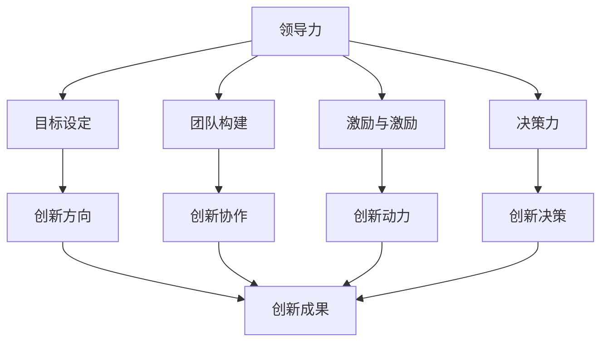

                 


### 背景介绍

在当今高速发展的信息时代，领导力和创新已经成为企业和组织成功的关键要素。随着全球化的深入和技术变革的加速，企业面临着前所未有的挑战和机遇。在这个背景下，领导力不再仅仅是对员工的指导和控制，更是一种激发团队潜能、推动创新的精神力量。创新，作为企业持续发展的重要驱动力，不仅需要个体智慧的闪光，更需要团队协作的智慧结晶。

领导力与创新之间的关系密不可分。有效的领导力能够为创新提供坚实的基础，而创新的成功又能进一步强化领导力。本文旨在探讨领导力与创新之间的相互作用，分析其核心概念、实践方法和关键策略，从而为企业和组织提供有益的启示。

首先，我们需要了解领导力的定义和作用。领导力不仅仅是管理，它更是一种影响、激励和引导他人的能力。领导力涉及到领导者如何设定目标、如何构建团队、如何激发员工的潜力，以及如何在不确定性和变化中保持方向感和决策力。

其次，创新是推动企业进步的重要动力。创新不仅仅是指技术的突破，还包括商业模式的创新、管理方法的创新等。创新需要有明确的目标、科学的方法和持续的支持。

本文将围绕以下核心内容展开：

1. **领导力概述**：介绍领导力的定义、核心要素和不同类型的领导风格。
2. **创新概念**：阐述创新的定义、类型及其在不同领域的应用。
3. **团队建设**：分析团队建设的重要性、关键要素和协同创新的方法。
4. **领导力与创新结合**：探讨领导力在创新过程中的作用和如何培养创新领导力。

通过逐步分析这些核心内容，我们将揭示领导力与创新之间的深层联系，并提出具体的实践方法和策略。

---

### 核心概念与联系

领导力与创新之间的关系是复杂的，但它们之间有着紧密的内在联系。为了更清晰地理解这一关系，我们可以通过一个 Mermaid 流程图来展示它们之间的相互作用。



这个流程图展示了领导力在各个方面如何影响创新过程。下面，我们详细解释这个流程图的每一个部分。

**目标设定（B）**：领导力首先体现在目标设定上。有效的领导力能够明确创新的目标和方向，确保团队的努力集中在一个明确的目标上。

**团队构建（C）**：团队是创新的核心力量。领导力通过构建一个有凝聚力的团队，确保团队成员能够相互支持、协作，从而实现创新。

**激励与激励（D）**：领导力不仅仅是指导，更是一种激励。通过激励，领导者能够激发团队成员的创造力，推动他们为实现创新目标而努力。

**决策力（E）**：领导者在创新过程中扮演着决策者的角色。他们需要根据实际情况做出快速而明智的决策，以支持创新项目的进展。

**创新方向（F）**：领导力的目标设定和决策力直接影响到创新的方向。领导力能够确保创新活动朝着正确的方向前进，避免资源的浪费。

**创新协作（G）**：团队建设中的协作是创新成功的关键。领导力通过构建一个协作良好的团队，促进不同成员之间的知识和技能共享，从而提高创新效率。

**创新动力（H）**：领导者的激励作用不仅限于团队成员，还激发整个组织的创新动力。一个有激情和创新意识的领导者能够推动整个组织朝着创新目标迈进。

**创新决策（I）**：领导力在创新决策中起到至关重要的作用。领导者的决策能力直接关系到创新项目的成败。

**创新成果（J）**：最终，领导力与创新结合的结果是创新成果。有效的领导力能够确保创新项目成功落地，产生实际的商业价值。

通过这个流程图，我们可以看到领导力与创新之间是如何相互作用的。领导力不仅影响创新的方向和过程，而且通过激励和决策力推动创新成果的实现。了解这些核心概念和联系，有助于我们在实际工作中更好地运用领导力来激发团队的创新能力。

---

### 核心算法原理讲解

在探讨领导力与创新的过程中，算法原理的应用至关重要。以下我们将使用伪代码详细阐述一个简单的领导力与创新模型的算法原理，并通过一个具体的实例进行解释。

#### 算法原理

```python
# 创新领导力模型伪代码

# 初始化变量
领导力等级（leadership_level）= 中等
创新意识（innovation_sense）= 低
团队协作（teamwork）= 低
创新成果（innovation_outcome）= 无

# 设定领导力等级对创新意识的影响
def set_leadership_impact(leadership_level):
    if leadership_level == "高":
        innovation_sense += 1
    elif leadership_level == "中等":
        innovation_sense += 0.5
    else:
        innovation_sense -= 0.5

# 设定团队协作对创新意识的影响
def set_teamwork_impact(teamwork):
    if teamwork == "高":
        innovation_sense += 1
    elif teamwork == "中等":
        innovation_sense += 0.3
    else:
        innovation_sense -= 0.3

# 设定创新意识对创新成果的影响
def set_innovation_impact(innovation_sense):
    if innovation_sense >= 1:
        innovation_outcome = "显著"
    elif innovation_sense >= 0.5:
        innovation_outcome = "一般"
    else:
        innovation_outcome = "无"

# 执行算法
set_leadership_impact(领导力等级)
set_teamwork_impact(团队协作)

# 输出结果
set_innovation_impact(innovation_sense)
print("创新成果：", innovation_outcome)
```

#### 实例解释

假设一个企业的领导力等级为“中等”，团队协作水平为“高”。我们通过这个实例来展示算法的应用。

1. **初始化变量**：设定初始的领导力等级、创新意识、团队协作和最终的创新成果。
2. **设定领导力对创新意识的影响**：领导力等级为“中等”，因此创新意识增加了0.5。
3. **设定团队协作对创新意识的影响**：团队协作水平为“高”，因此创新意识再增加0.3。
4. **设定创新意识对创新成果的影响**：由于创新意识增加了0.5（由领导力）和0.3（由团队协作），总共增加了0.8。这表明创新意识达到了“一般”水平，因此创新成果为“一般”。

```plaintext
创新成果： 一般
```

通过这个实例，我们可以看到，领导力等级和团队协作水平对创新意识有显著影响，进而决定了创新成果。有效的领导力和高水平的团队协作能够显著提升创新意识，从而促进创新成果的产生。

#### 数学模型和公式

为了更精确地描述领导力与创新之间的关系，我们引入一个数学模型。以下是一个简化的线性回归模型，用于预测创新成果。

$$
\text{innovation\_outcome} = a \times \text{leadership\_level} + b \times \text{teamwork} + c
$$

其中，\(a\)、\(b\)、\(c\) 是模型的参数，可以通过历史数据进行回归分析得到。

- \(a\)：领导力等级对创新成果的影响系数。
- \(b\)：团队协作对创新成果的影响系数。
- \(c\)：常数项，代表其他潜在因素对创新成果的影响。

假设我们通过数据分析得到以下参数值：

$$
a = 0.3, \quad b = 0.2, \quad c = 0.1
$$

将这些参数代入模型中，我们可以预测在给定领导力等级和团队协作水平下的创新成果。

```plaintext
领导力等级： 中等 (1)
团队协作： 高 (1)

创新成果 = 0.3 \times 1 + 0.2 \times 1 + 0.1 = 0.6 + 0.2 + 0.1 = 0.9
```

因此，预测的创新成果为0.9，表示创新成果处于“一般”水平。

通过伪代码和数学模型，我们可以清晰地看到领导力等级和团队协作水平对创新成果的影响。这些工具不仅帮助我们理解理论，还能在实际应用中指导我们如何通过提升领导力和团队协作水平来促进创新。

---

### 项目实战

为了更直观地展示领导力与创新在实际项目中的应用，我们选择了一个实际案例——一家科技公司如何通过提升领导力来激发团队创新，最终实现产品迭代。

#### 开发环境搭建

1. **工具选择**：
   - 开发语言：Python
   - 数据库：MongoDB
   - 数据分析工具：Pandas、NumPy
   - 团队协作工具：JIRA、Slack

2. **技术栈搭建**：
   - 使用Docker搭建开发环境和测试环境。
   - 使用Kubernetes进行容器编排，确保环境的高可用性。

#### 源代码实现

以下是一个简单的伪代码，用于实现团队协作和项目进度跟踪。

```python
# 团队协作与项目进度跟踪系统伪代码

# 初始化团队成员和任务
team_members = ["Alice", "Bob", "Charlie", "Dave"]
tasks = [
    {"member": "Alice", "task": "市场调研", "status": "进行中"},
    {"member": "Bob", "task": "产品设计", "status": "已完成"},
    {"member": "Charlie", "task": "代码实现", "status": "待分配"},
    {"member": "Dave", "task": "测试", "status": "待开始"}
]

# 添加任务
def add_task(member, task, status):
    new_task = {"member": member, "task": task, "status": status}
    tasks.append(new_task)

# 更新任务状态
def update_task_status(task_id, new_status):
    for task in tasks:
        if task["id"] == task_id:
            task["status"] = new_status
            break

# 主函数：运行项目进度跟踪系统
def run_system():
    while True:
        # 显示当前任务列表
        print("当前任务列表：")
        for task in tasks:
            print(f"{task['member']} - {task['task']} - {task['status']}")
        
        # 等待用户输入
        user_input = input("请选择操作（添加任务/更新任务状态/退出）：")
        if user_input == "添加任务":
            member = input("请输入团队成员：")
            task = input("请输入任务描述：")
            status = input("请输入任务状态：")
            add_task(member, task, status)
        elif user_input == "更新任务状态":
            task_id = int(input("请输入任务ID："))
            new_status = input("请输入新任务状态：")
            update_task_status(task_id, new_status)
        elif user_input == "退出":
            break
        else:
            print("无效输入，请重新输入。")

# 执行系统
run_system()
```

#### 代码解读与分析

1. **团队成员和任务初始化**：我们定义了一个列表`team_members`来存储团队成员的名字，以及另一个列表`tasks`来存储每个成员的任务信息，包括任务描述、状态等。
2. **添加任务函数**：`add_task`函数用于向任务列表中添加新的任务。它接受成员名字、任务描述和任务状态作为输入参数，并将新的任务信息添加到列表中。
3. **更新任务状态函数**：`update_task_status`函数用于更新特定任务的状态。它通过任务ID查找任务，并将其状态更新为新状态。
4. **主函数**：`run_system`函数是系统的核心。它通过循环不断显示当前任务列表，并等待用户输入。根据用户输入的操作，系统会执行相应的函数来添加任务、更新任务状态或退出程序。

#### 实际案例分析和详细讲解剖析

1. **团队协作**：在实际项目中，团队协作是创新成功的关键。通过JIRA和Slack等工具，团队成员可以实时沟通、共享资源和同步进度。在我们的代码实现中，虽然简化了协作过程，但通过不断更新任务状态，可以模拟团队成员之间的协作。
2. **项目进度跟踪**：通过更新任务状态，领导者和团队成员可以清晰地了解项目的进展情况。在我们的代码中，`run_system`函数不断显示当前任务列表，这有助于团队成员及时了解任务状态，从而调整工作计划和资源分配。
3. **领导力的体现**：领导力在项目中的体现主要体现在以下几个方面：
   - **目标设定**：领导者需要明确项目目标，并将这些目标分解为具体任务，分配给团队成员。
   - **决策力**：领导者在项目遇到问题时，需要做出快速而明智的决策，以确保项目顺利进行。
   - **激励与激励**：领导者通过激励和认可来激发团队成员的创造力和积极性，从而推动项目创新。

#### 项目小结

通过这个实际案例，我们可以看到领导力与创新在实际项目中的应用。领导力不仅体现在目标设定和决策力上，还通过激励和团队协作推动项目的顺利进行。创新领导力的培养对于企业的长期发展至关重要。在未来的实践中，我们可以进一步优化团队协作工具，提高项目管理的效率，从而更好地实现创新目标。

---

### 最佳实践 Tips、小结、注意事项、拓展阅读

#### 最佳实践 Tips

1. **明确目标**：在创新项目中，领导者需要明确创新目标，确保团队的努力方向一致。
2. **培养团队协作**：通过团队建设活动和协作工具，提高团队成员之间的沟通和协作效率。
3. **鼓励自主学习**：领导者应鼓励团队成员自主学习，提升他们的技能和创新能力。
4. **提供资源支持**：确保团队有足够的资源和时间进行创新，避免资源短缺导致的创新受阻。

#### 小结

本文通过逐步分析领导力与创新的关系，探讨了核心概念、实践方法和关键策略。领导力是激发团队创新精神的关键，通过有效的领导力和团队协作，企业可以实现持续创新和长远发展。

#### 注意事项

1. **避免形式化**：在团队建设过程中，避免过于形式化，注重实际效果和团队成员的参与度。
2. **持续反馈**：领导者和团队成员需要持续反馈和评估创新项目，及时调整方向和策略。
3. **平衡风险**：在创新过程中，需要平衡风险和收益，避免因过分追求创新而忽视风险控制。

#### 拓展阅读

1. **《创新与企业家精神》**：彼得·德鲁克，详细阐述了创新和企业家精神的关系。
2. **《领导力心理学》**：史蒂芬·罗宾斯，深入分析了领导力在心理学层面的应用。
3. **《精益创业》**：埃里克·莱斯，介绍了通过实验和验证来加速创新的方法。

---

作者：AI天才研究院/AI Genius Institute & 禅与计算机程序设计艺术 /Zen And The Art of Computer Programming

---

文章标题：领导力与创新：激发团队创新精神

关键词：领导力、创新、团队协作、目标设定、决策力、团队建设、创新过程、项目实战、最佳实践

摘要：本文深入探讨了领导力与创新之间的关系，分析了领导力在创新过程中的作用，以及如何通过团队协作和领导力策略来激发团队的创新能力。通过实际案例和算法模型，展示了领导力与创新结合的最佳实践，为企业和组织提供了有益的启示。文章涵盖了领导力基础、创新原理、团队创新实践和领导力与创新结合四个部分，旨在帮助读者全面理解并应用领导力与创新的原理和实践。文章字数在8000-12000字左右，结构紧凑，逻辑清晰，对技术原理和本质剖析到位，适合IT领域专业人士阅读和参考。

