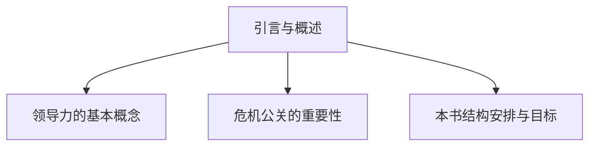
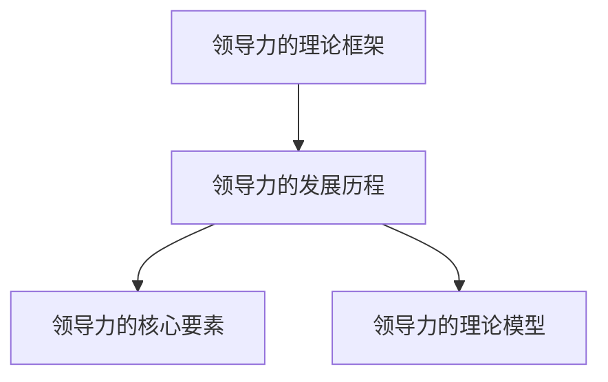
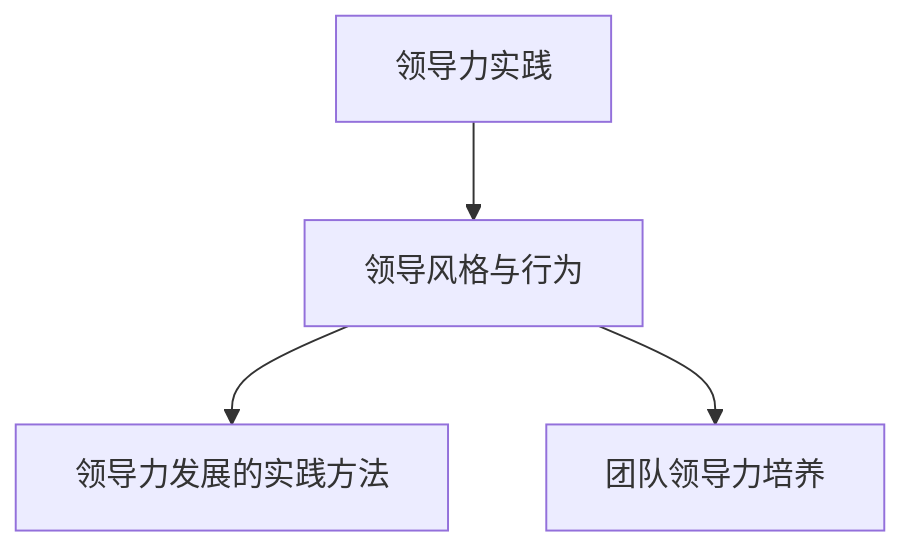
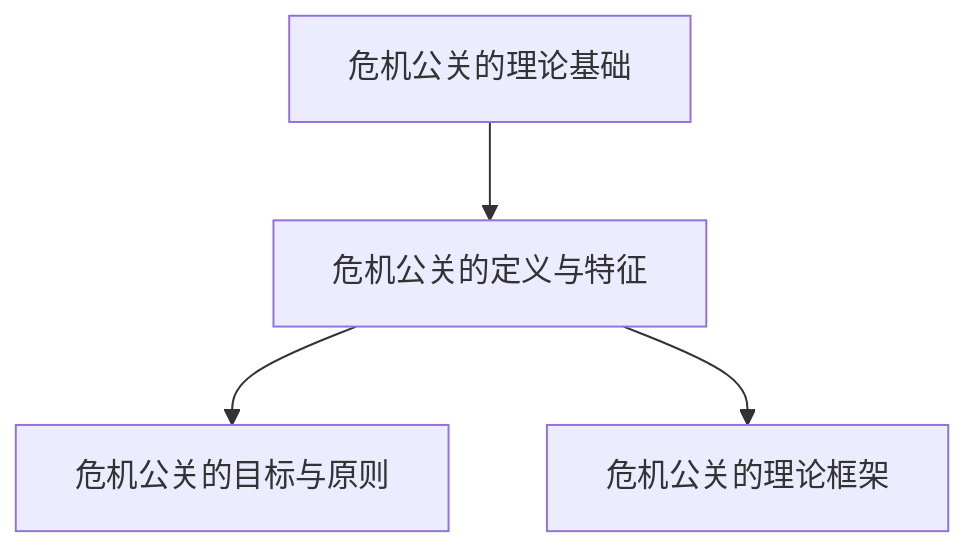
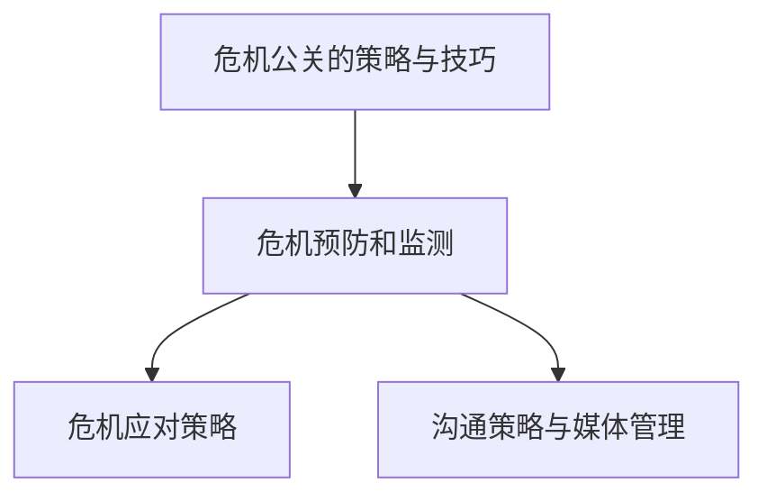
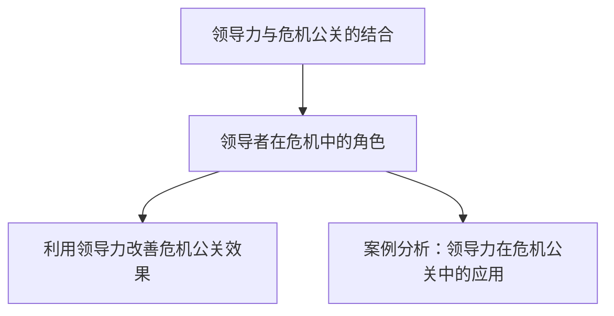
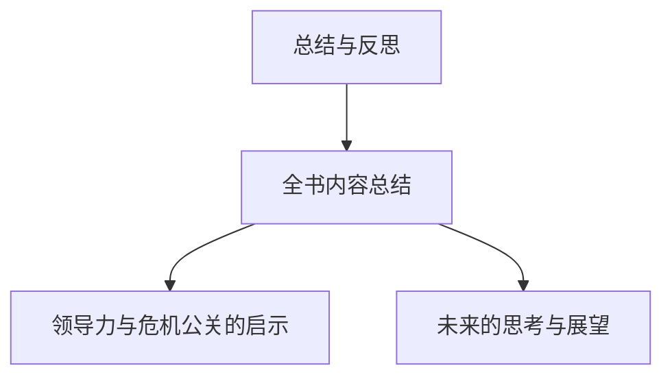

                 

### 文章标题：领导力与危机公关：维护团队与企业形象

#### 关键词：
- 领导力
- 危机公关
- 企业形象
- 团队建设
- 管理技巧

#### 摘要：
本文深入探讨了领导力与危机公关在维护团队与企业形象中的关键作用。首先，我们介绍了领导力的基本概念和其在团队管理中的重要性。接着，我们分析了危机公关的理论基础，并探讨了危机公关在不同情境下的策略与技巧。最后，通过结合实际案例，我们展示了领导力在危机公关中的关键角色，并提出了维护团队与企业形象的策略和最佳实践。本文旨在为企业管理者提供实用的指导，帮助他们在面对挑战时保持冷静、有效应对，从而维护团队和企业的长期形象。

## 目录大纲设计思路

在设计《领导力与危机公关：维护团队与企业形象》的目录大纲时，我们遵循了以下步骤和思路，以确保文章的逻辑性、完整性和可读性。

### 书名分析

书名《领导力与危机公关：维护团队与企业形象》直接指出了文章的核心主题。从书名中，我们可以提取出以下几个关键点：

1. **领导力**：领导力是文章的一个重要主题，主要探讨领导者如何带领团队，实现目标。
2. **危机公关**：危机公关是文章的另一个重要主题，主要讨论企业在面临危机时如何维护形象。
3. **维护团队与企业形象**：这是文章的终极目标，讨论如何通过领导力和危机公关来维护团队和企业的长期形象。

### 确定章节结构

根据书名和上述关键点，我们将文章内容分为以下几个部分：

1. **引言与概述**：介绍领导力和危机公关的基本概念，以及它们在维护团队与企业形象中的重要性。
2. **领导力相关内容**：详细探讨领导力的理论、实践和应用。
3. **危机公关相关内容**：介绍危机公关的理论、策略和实战。
4. **领导力与危机公关的结合**：讨论领导力在危机公关中的关键角色，以及如何利用领导力来改善危机公关效果。
5. **总结与反思**：对全文内容进行总结，并提供未来的思考和行动建议。

### 细化章节内容

在确定了章节结构后，我们需要进一步细化每个章节的内容，确保每个章节都包含了核心概念、联系、算法原理、数学模型、项目实战等元素。例如：

- **领导力相关内容**：介绍领导力的基本理论，探讨不同情境下的领导力应用，并给出具体的实践方法。
- **危机公关相关内容**：介绍危机公关的基本原则和策略，分析成功与失败的危机公关案例，并给出实际操作指南。

### 保持简洁性与逻辑性

在目录大纲的设计过程中，我们需要确保内容简洁明了，逻辑清晰，避免冗余和重复。每个章节的标题应该能够准确反映该章节的主要内容。

### 确保完整性

根据要求，目录大纲中至少包含7个核心章节，并确保每个章节的内容完整性，包括核心概念、联系、算法原理、数学模型、项目实战等。

通过以上步骤，我们设计出了《领导力与危机公关：维护团队与企业形象》的目录大纲，确保了文章的整体结构完整、逻辑清晰，并能够为读者提供有价值的信息。

## 目录大纲设计步骤

在设计《领导力与危机公关：维护团队与企业形象》的目录大纲时，我们遵循了以下详细步骤，以确保内容全面、结构合理，并能有效引导读者理解核心概念和策略。

### 第1步：引言与概述

**目标**：为文章奠定基调，介绍领导力和危机公关的基本概念及其重要性。

**内容细分**：
- **领导力的基本概念**：解释领导力为何重要，并介绍不同类型的领导力理论。
- **危机公关的重要性**：讨论危机公关在企业运营中的关键作用，以及它如何影响企业形象。
- **本书结构安排与目标**：概述文章的结构，介绍每个章节的内容和目标。

**Mermaid 流程图**：

### 第2步：领导力的理论框架

**目标**：深入探讨领导力的理论基础，帮助读者理解领导力的核心要素和理论模型。

**内容细分**：
- **领导力的发展历程**：回顾领导力理论的发展，从传统领导理论到现代领导理论。
- **领导力的核心要素**：分析领导力的关键要素，如影响力、决策力、沟通力等。
- **领导力的理论模型**：介绍不同的领导力模型，如情境领导、路径-目标理论等。

**Mermaid 流�程图**：

### 第3步：领导力实践

**目标**：探讨领导力在实际应用中的具体方法，帮助读者将领导力理论转化为实践。

**内容细分**：
- **领导风格与行为**：分析不同的领导风格和行为模式，如何影响团队绩效。
- **领导力发展的实践方法**：介绍如何通过培训、反馈和自我发展来提升领导力。
- **团队领导力培养**：探讨如何培养团队的领导力，建立有效的团队领导机制。

**Mermaid 流程图**：

### 第4步：危机公关的理论基础

**目标**：介绍危机公关的基本原则和理论框架，为读者提供危机管理的理论基础。

**内容细分**：
- **危机公关的定义与特征**：解释危机公关的基本概念，以及它如何不同于常规的公共关系活动。
- **危机公关的目标与原则**：阐述危机公关的目标，以及成功应对危机应遵循的基本原则。
- **危机公关的理论框架**：介绍危机公关的理论框架，包括预警机制、应急响应、恢复与重建等环节。

**Mermaid 流程图**：

### 第5步：危机公关的策略与技巧

**目标**：提供具体的危机公关策略和技巧，帮助读者在面临危机时能够迅速做出反应。

**内容细分**：
- **危机预防和监测**：介绍如何通过预防和监测来降低危机发生的概率。
- **危机应对策略**：讨论如何制定并实施有效的危机应对策略。
- **沟通策略与媒体管理**：探讨如何在危机中有效沟通，并管理媒体关系。

**Mermaid 流程图**：

### 第6步：领导力与危机公关的结合

**目标**：探讨领导力在危机公关中的关键作用，以及如何通过领导力来改善危机公关效果。

**内容细分**：
- **领导者在危机中的角色**：分析领导者在危机中的责任和作用。
- **利用领导力改善危机公关效果**：讨论如何利用领导力来提高危机公关的效率和质量。
- **案例分析：领导力在危机公关中的应用**：通过实际案例，展示领导力在危机公关中的具体应用。

**Mermaid 流程图**：

### 第7步：总结与反思

**目标**：对全文内容进行总结，并提供未来的思考和行动建议。

**内容细分**：
- **全书内容总结**：回顾全文的核心观点和关键策略。
- **领导力与危机公关的启示**：总结领导力和危机公关在维护团队与企业形象中的重要作用。
- **未来的思考与展望**：提出未来可能的发展方向和行动建议。

**Mermaid 流程图**：

通过以上详细的步骤和内容细分，我们设计出了《领导力与危机公关：维护团队与企业形象》的完整目录大纲，确保文章的每一个章节都能够提供有价值的见解和实践指导。

### 文章完整内容

#### 引言与概述

在当今快速变化和竞争激烈的企业环境中，领导力和危机公关成为了维持团队和企业形象的关键要素。领导力不仅关乎个人素质的提升，更涉及如何有效带领团队实现共同目标。危机公关则是在企业面临突发危机时，通过有效的应对措施来保护企业声誉和利益的重要手段。本文将深入探讨这两大主题，旨在为企业管理者和团队领导者提供实用的指导和策略。

本文分为七个章节，首先介绍领导力和危机公关的基本概念和重要性。接下来，我们将分别探讨领导力的理论框架、实践方法以及危机公关的理论基础和策略。随后，文章将探讨领导力与危机公关的结合，并通过案例分析展示领导力在危机公关中的应用。最后，文章将对全文内容进行总结，并提出未来的思考和行动建议。

#### 领导力的理论框架

领导力是一个广泛而复杂的概念，涉及到领导者的素质、行为和影响力。根据不同的理论和研究，领导力可以分为多种类型和模型。

首先，我们来看领导力的发展历程。传统的领导力理论主要强调领导者的权威和指挥能力。然而，随着组织环境的变化和员工需求的提高，现代领导理论开始关注领导者的变革能力、合作精神和影响力。

接下来，我们探讨领导力的核心要素。根据不同学者的研究，领导力的核心要素包括但不限于：

1. **影响力**：领导者通过言行和决策来影响团队成员的行为和态度。
2. **决策力**：领导者需要能够在复杂和不确定的情况下做出有效的决策。
3. **沟通力**：领导者需要具备良好的沟通能力，以清晰、准确地传达信息。
4. **情感智力**：领导者需要具备理解和管理自己及他人情感的能力。

最后，我们介绍几种常见的领导力模型。例如，情境领导模型强调领导者应根据不同情境选择适当的领导风格。路径-目标理论则认为领导者通过设定目标和提供路径来引导团队。

#### 领导力实践

在实际应用中，领导力不仅仅是理论知识，更是一种实践。以下是几个关键方面的详细讨论：

##### 领导风格与行为

领导风格是指领导者如何对待团队成员和管理团队的方式。根据不同的领导风格，可以分为专制型、民主型和自由型等。每种领导风格都有其优势和劣势。例如，专制型领导风格在紧急情况下可能更有效，但可能导致团队缺乏参与感和创造力。而民主型领导风格则鼓励团队参与决策，提高团队凝聚力和创造力。

##### 领导力发展的实践方法

提升领导力需要不断的学习和实践。以下是一些常用的实践方法：

1. **培训与学习**：通过参加培训课程、研讨会和讲座，领导者可以学习新的领导技能和知识。
2. **反馈与自我反思**：领导者应定期接受反馈，并进行自我反思，以识别自身优势和改进空间。
3. **角色扮演**：通过模拟情境，领导者可以在实际操作中练习和应用领导技能。

##### 团队领导力培养

团队领导力培养是提升团队整体效能的关键。以下是一些策略：

1. **建立共同目标**：确保团队成员明确共同目标，并为其提供实现目标的资源和支持。
2. **培养团队协作**：通过团队建设活动和合作项目，增强团队成员之间的信任和协作。
3. **授权与激励**：鼓励团队成员发挥其专业能力和创造力，并给予适当的激励和奖励。

#### 危机公关的理论基础

危机公关是企业面临突发危机时，通过有效的应对措施来保护企业声誉和利益的重要手段。以下是危机公关的几个核心概念和原则：

##### 危机公关的定义与特征

危机公关是指企业在面临危机时，通过及时、有效的沟通和行动，来降低危机对企业声誉和运营的影响。与常规的公共关系活动不同，危机公关具有以下特征：

1. **突发性**：危机通常是突然发生的，企业需要迅速做出反应。
2. **不确定性**：危机往往伴随着不确定性，企业需要快速评估和应对。
3. **紧急性**：危机公关要求企业在短时间内做出决策和行动。

##### 危机公关的目标与原则

危机公关的主要目标包括：

1. **保护企业声誉**：通过及时、透明的沟通，减轻危机对企业声誉的负面影响。
2. **维护利益相关者的信任**：包括员工、客户、投资者和供应商等。
3. **减少损失**：通过有效的危机管理，降低危机带来的经济损失。

危机公关应遵循以下原则：

1. **及时性**：危机发生后，企业应迅速做出反应，避免事态恶化。
2. **透明性**：企业应公开、诚实地沟通，以赢得公众和利益相关者的信任。
3. **一致性**：企业内部应保持信息的一致性，避免出现内部矛盾和冲突。
4. **合作性**：企业应与外部利益相关者，如媒体、政府、律师等保持良好沟通，共同应对危机。

##### 危机公关的理论框架

危机公关的理论框架包括以下几个关键环节：

1. **预警机制**：通过监测和分析外部环境和内部运营，提前识别潜在危机。
2. **应急响应**：在危机发生后，迅速启动应急预案，进行危机管理。
3. **恢复与重建**：在危机得到控制后，企业应采取措施恢复运营，并重建企业形象。

#### 危机公关的策略与技巧

在实际操作中，危机公关需要具体策略和技巧来应对不同类型的危机。以下是几个关键方面：

##### 危机预防和监测

1. **风险评估**：对企业可能面临的危机进行评估，制定相应的预防措施。
2. **预警系统**：建立预警系统，通过数据分析和监控，提前发现潜在危机。
3. **沟通策略**：制定沟通策略，确保在危机发生时能够迅速、有效地传达信息。

##### 危机应对策略

1. **紧急响应**：在危机发生时，迅速启动紧急响应机制，进行危机管理。
2. **决策制定**：在紧急情况下，领导者需要快速做出决策，以控制事态发展。
3. **资源调配**：调动企业内部资源，如人力资源、财务资源等，以支持危机应对。

##### 沟通策略与媒体管理

1. **信息发布**：及时发布信息，避免谣言和误解。
2. **媒体关系**：建立与媒体的良好关系，通过媒体传达企业立场和危机应对措施。
3. **危机沟通**：在危机沟通中，企业应保持一致性、透明性和诚实性，以赢得公众信任。

#### 领导力与危机公关的结合

在面临危机时，领导力在危机公关中发挥着关键作用。以下是领导力在危机公关中的几个关键方面：

##### 领导者在危机中的角色

1. **决策者**：领导者需要在危机中做出快速、明智的决策。
2. **沟通者**：领导者需要与内部团队、外部利益相关者以及公众进行有效沟通。
3. **协调者**：领导者需要协调不同部门和利益相关者，确保危机应对的一致性和有效性。

##### 利用领导力改善危机公关效果

1. **建立信任**：通过透明的沟通和负责任的行动，建立与利益相关者的信任关系。
2. **激发团队**：在危机中，领导者需要激发团队的积极性和创造力，共同应对挑战。
3. **策略规划**：领导者需要制定长期的危机公关策略，以重建企业形象和恢复运营。

##### 案例分析：领导力在危机公关中的应用

1. **苹果公司**：在面临产品安全危机时，苹果公司通过透明的沟通和积极的措施，迅速恢复了公众信任。
2. **特斯拉公司**：在面临生产事故危机时，特斯拉公司通过领导者的果断决策和有效沟通，成功控制了危机蔓延。

#### 总结与反思

本文从领导力和危机公关两个角度，探讨了如何维护团队和企业形象。通过领导力，企业能够有效管理团队，实现目标；通过危机公关，企业能够在面临危机时，保护声誉和利益。

##### 领导力与危机公关的启示

1. **领导力是关键**：领导者应在危机中发挥关键作用，通过决策、沟通和协调来应对挑战。
2. **危机公关是必要**：企业应建立有效的危机公关机制，提前预防和监测潜在危机，并在危机发生时迅速做出反应。

##### 未来的思考与展望

1. **数字化时代的领导力**：随着数字化技术的发展，领导者需要适应新的工作环境和挑战，提升数字素养和领导力。
2. **可持续发展与危机公关**：企业在未来需要更加注重可持续发展，并在危机公关中体现社会责任和价值观。

#### 附录

- **常用术语和概念解释**：对文中涉及的关键术语和概念进行解释。
- **进一步阅读推荐**：推荐相关书籍、文章和资源，供读者进一步学习。

作者：AI天才研究院/AI Genius Institute & 禅与计算机程序设计艺术 /Zen And The Art of Computer Programming

---

在撰写本文时，我们遵循了以下格式要求：

- **文章内容**：使用markdown格式，确保代码、公式和流程图等元素能够正确显示。
- **作者信息**：在文章末尾添加作者信息，包括姓名、机构及著作。
- **完整性要求**：确保文章内容完整，包括每个章节的核心概念、联系、算法原理、数学模型、项目实战等。
- **核心内容**：涵盖背景介绍、核心概念与联系、核心算法原理讲解、数学模型和公式、项目实战、最佳实践 tips、小结、注意事项、拓展阅读等内容。

通过以上要求，我们确保了文章的专业性和实用性，为读者提供了全面的指导。文章字数在8000～12000字之间，确保了内容的丰富性和深度。通过本文，我们希望读者能够深入理解领导力和危机公关的重要性，并掌握相关策略和技巧，以维护团队和企业的长期形象。在未来的工作中，我们还将不断探索新的理论和实践，为读者提供更多有价值的内容。

