                 

### 文章标题：领导力与危机应对：逆境中的团队凝聚

### 关键词：
- 领导力
- 危机管理
- 团队凝聚力
- 逆境应对
- 理论与实践

### 摘要：
本文旨在探讨领导力在危机管理中的关键作用，特别是在逆境中如何提升团队凝聚力。文章首先概述了领导力的基本概念和重要性，接着介绍了危机管理的流程、类型和预警机制。随后，文章深入分析了团队凝聚力的定义、重要性及增强策略。通过理论联系，阐述了领导力在危机管理中的具体应用。最后，本文通过实际案例展示了领导力和团队凝聚力在危机应对中的成功实践，并提出了未来发展的展望。

## 第1章：领导力概述

### 1.1 领导力的定义与重要性

领导力是一种影响、激励和引导他人实现共同目标的能力。它不仅仅是一种职位特权，更是一种个人素质。领导力的定义随着时代的发展而不断演变。传统上，领导力被视为权威和控制的体现，而现代领导理论则更加强调领导与服务、协作与赋能。

领导力的重要性在于，它能够激发团队成员的潜力，提升团队的整体绩效。在一个组织中，领导者不仅需要具备决策能力和执行力，还需要具备沟通能力、情绪管理能力和团队建设能力。

**核心概念与联系：**

为了更好地理解领导力的重要性，我们可以通过以下Mermaid流程图展示其核心概念和相互关系：

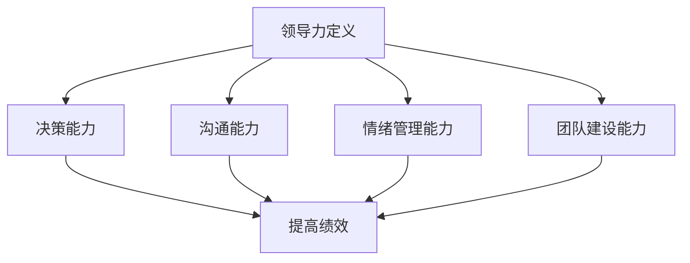

### 1.2 领导理论的发展

领导理论的发展历程可以追溯到古代，但真正系统的研究始于20世纪。传统领导理论主要关注领导者的个人特质和权力基础，而现代领导理论则更加注重情境因素和领导者与团队成员的互动。

**传统领导理论：**

- 特质理论：认为领导者具备一系列固有的特质，如自信、智慧、魅力等。
- 行为理论：关注领导者具体的行为模式，如领导风格、领导行为等。
- 权力基础理论：研究领导者如何获取和运用权力。

**现代领导理论：**

- 情境领导理论：认为领导者的行为应根据具体情境进行调整。
- 服务型领导理论：强调领导者为团队成员提供服务，以满足其需求。
- 参与式领导理论：倡导领导者与团队成员共同参与决策，实现共同目标。

### 1.3 领导力模型

领导力模型是对领导行为的分类和描述，有助于我们理解和应用领导力。以下是几种常见的领导力模型：

**权力基础理论：**

权力基础理论认为，领导者的权力来源于以下几个方面：

- 权力来源1：职位权力
- 权力来源2：奖励权力
- 权力来源3：法定权力
- 权力来源4：参考权力
- 权力来源5：专家权力

**领导风格理论：**

领导风格理论将领导者的行为划分为不同的类型，如独裁型、民主型、放任型等。每种领导风格都有其适用场景和优缺点。

**领导者特质理论：**

领导者特质理论关注领导者的个人特质，如智慧、魅力、自信等。这些特质被认为能够影响领导者的行为和团队的绩效。

### 1.4 领导力的核心要素

领导力的核心要素包括以下几个方面：

- **沟通能力：** 领导者需要具备有效的沟通技巧，以便与团队成员建立良好的关系，传达清晰的目标和期望。
- **决策能力：** 领导者需要在面对复杂问题和不确定性时做出明智的决策。
- **情绪管理能力：** 领导者需要能够控制自己的情绪，保持冷静和理性，以便更好地应对挑战。
- **团队建设能力：** 领导者需要能够构建一个有凝聚力的团队，激发团队成员的潜力，实现共同目标。

### 1.5 领导力与危机管理的关系

危机管理是指组织在面对突发事件时采取的一系列应对措施。领导力在危机管理中起着至关重要的作用。

- **危机预警：** 领导者需要具备敏锐的洞察力，及时发现潜在危机，并采取预防措施。
- **危机应对：** 领导者需要具备决策能力和执行力，迅速制定应对策略，并指导团队执行。
- **危机恢复：** 领导者需要带领团队恢复秩序，重建信心，并从危机中吸取教训，改进管理。

**核心概念与联系：**

我们可以通过以下Mermaid流程图展示领导力与危机管理的关系：

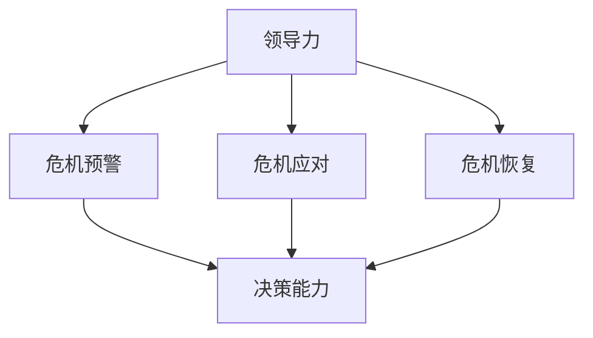

### 总结

领导力是组织成功的关键因素之一。在危机管理中，领导力尤为重要。领导者需要具备决策能力、沟通能力、情绪管理能力和团队建设能力，以便在逆境中带领团队迎接挑战。通过理解领导力的基本概念、发展历程和核心要素，我们可以更好地应用领导力，提升团队的整体绩效。

---

**本文为第一章节的撰写内容，将继续深入探讨危机管理的概念、流程、团队凝聚力以及领导力在危机管理中的具体应用。**

## 第2章：危机管理

### 2.1 危机管理的概念与流程

危机管理是指组织在面对突发事件和紧急情况时，采取的一系列应对措施，以减轻危机影响，恢复正常运营并防止危机再次发生。危机管理的概念包括危机识别、预警、应对、恢复和评估等环节。

**核心概念与联系：**

危机管理的核心概念可以表示为以下Mermaid流程图：

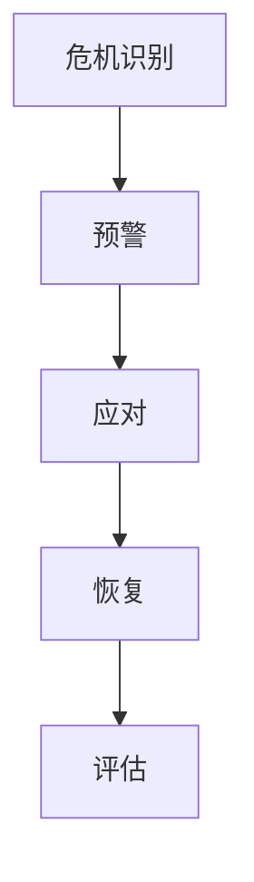

**危机识别：** 危机识别是危机管理的第一步，它涉及对潜在危机的识别和监测。领导者需要通过日常监控、信息收集和风险评估来识别潜在的危机。

**预警：** 预警系统是危机管理的核心，它包括预警指标、预警系统和预警机制。预警指标是用于监测危机发生的各种指标，如财务指标、市场指标等。预警系统是通过技术手段实现的预警机制，可以实时监测数据，及时发现危机信号。

**应对：** 应对是危机管理的关键环节，领导者需要迅速制定应对策略，组织资源和人力，以最小化危机影响。应对策略包括应急响应计划、危机处理流程、危机沟通策略等。

**恢复：** 恢复是危机管理的目标之一，它涉及在危机结束后，组织恢复正常运营，并采取一系列措施恢复信心。恢复措施包括危机后的评估、改进管理、员工心理辅导等。

**评估：** 评估是危机管理的重要环节，它涉及对危机管理过程的效果评估，以及对危机管理策略的持续改进。

### 2.2 危机的类型与特征

危机可以分为多种类型，每种类型都有其独特的特征和影响。

- **自然灾害：** 如地震、洪水、台风等，它们具有不可预测性和破坏性。
- **技术事故：** 如网络攻击、系统故障、数据泄露等，它们对组织的正常运行造成严重影响。
- **社会事件：** 如政治动荡、社会骚乱、疫情爆发等，它们对社会稳定和经济发展产生深远影响。
- **经济危机：** 如金融危机、市场崩溃、供应链中断等，它们对组织的生存和发展构成威胁。

**核心概念与联系：**

危机的类型和特征可以用以下Mermaid流程图表示：

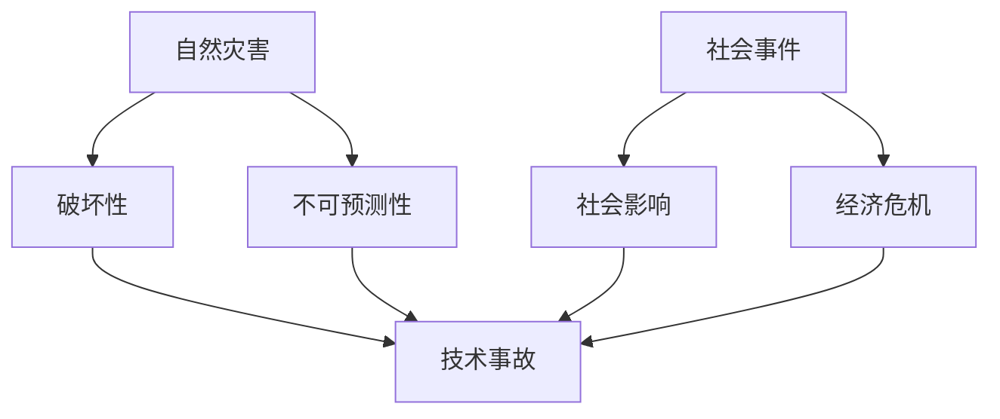

### 2.3 危机预警机制

危机预警机制是危机管理的重要组成部分，它通过预警指标、预警系统和预警机制来识别和预测危机。

**预警指标：** 预警指标是用于监测危机发生的各种指标，如财务指标、市场指标、社会指标等。这些指标可以反映组织的运行状况，及时发现潜在危机。

**预警系统：** 预警系统是通过技术手段实现的预警机制，它可以实时监测数据，及时发现危机信号。预警系统通常包括数据采集、数据分析和预警警报等功能。

**预警机制：** 预警机制是指组织内部设立的预警流程和机制，它包括危机识别、预警发布、应急响应等环节。预警机制有助于提高组织对危机的敏感性和响应速度。

### 2.4 危机应对策略

危机应对策略是指组织在面对危机时采取的一系列措施，以减轻危机影响，恢复正常运营。

**应急响应计划：** 应急响应计划是危机应对的基础，它包括危机应对的组织架构、职责分工、资源调配、应急流程等。应急响应计划有助于提高组织应对危机的能力。

**危机处理流程：** 危机处理流程是指组织在危机发生时采取的一系列步骤，包括危机评估、危机应对、危机沟通、危机报告等。危机处理流程有助于提高危机应对的效率和效果。

**危机沟通策略：** 危机沟通策略是危机应对的重要组成部分，它包括内部沟通和外部沟通。内部沟通旨在确保团队成员了解危机情况，外部沟通旨在与利益相关者沟通，恢复公众信心。

### 2.5 案例分析

为了更好地理解危机管理，我们可以分析一些具体的危机管理案例。

**案例一：某企业网络攻击事件**

- **危机背景：** 某企业在一天早晨发现其网络系统遭受了网络攻击，导致重要数据泄露。
- **危机应对：** 企业立即启动了应急响应计划，关闭了受影响的系统，通知了相关利益相关者，并进行了详细调查。
- **危机处理：** 企业采取了一系列措施，包括加强网络安全防护、更换密码、进行数据恢复等。
- **危机恢复：** 企业在危机结束后，对网络系统进行了全面检查，并进行了员工培训，以提高网络安全意识。

**案例二：某政府疫情防控事件**

- **危机背景：** 某地区爆发了新冠疫情，对当地经济和社会稳定造成了严重影响。
- **危机应对：** 政府立即启动了疫情防控应急预案，进行了疫情监测、隔离措施和疫苗接种。
- **危机处理：** 政府采取了严格的防控措施，包括封锁疫情重灾区、限制人员流动、提供生活物资等。
- **危机恢复：** 政府在疫情得到控制后，恢复了正常的社会秩序，并加强了公共卫生体系建设。

通过以上案例分析，我们可以看到危机管理在不同场景下的应用和效果。危机管理不仅需要科学的预警机制和应对策略，还需要高效的执行力和团队协作。

### 总结

危机管理是组织应对突发事件和紧急情况的重要手段。通过了解危机管理的概念、流程、类型和应对策略，我们可以更好地应对各种危机，保护组织的利益和声誉。领导者在危机管理中起着关键作用，他们需要具备敏锐的洞察力、决策能力和团队领导力，以确保危机得到有效应对和恢复。

---

**本文为第二章节的撰写内容，接下来将深入探讨团队凝聚力的概念、重要性及增强策略。**

## 第3章：团队凝聚力

### 3.1 团队凝聚力的概念

团队凝聚力是指团队成员之间的相互吸引力和协作意愿，它反映了团队成员在团队中的归属感和团队协作的效果。团队凝聚力不仅包括情感上的相互支持，还包括任务上的合作和共同目标的追求。

**核心概念与联系：**

团队凝聚力的概念可以通过以下Mermaid流程图来表示：

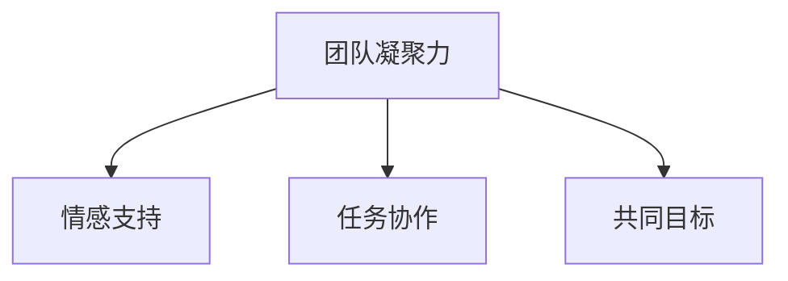

### 3.2 团队凝聚力的重要性

团队凝聚力对组织的绩效和稳定性有着重要的影响。高凝聚力的团队具有以下优势：

- **提高绩效：** 紧密的团队关系有助于团队成员之间的沟通和协作，从而提高工作效率和绩效。
- **促进团队合作：** 凝聚力使得团队成员更加愿意合作，共同面对挑战，解决问题。
- **增强稳定性：** 高凝聚力的团队在面对外部压力和挑战时，更加稳定和坚定，有助于组织克服困难。

**核心概念与联系：**

团队凝聚力的重要性可以用以下Mermaid流程图表示：

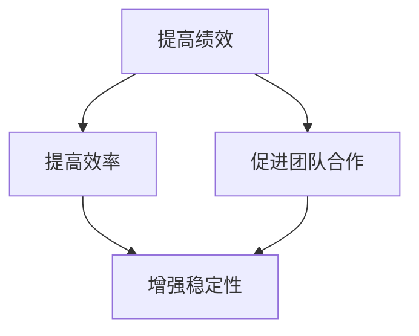

### 3.3 增强团队凝聚力的策略

增强团队凝聚力需要采取一系列策略，包括共同目标、信任建设、领导角色等。

**共同目标：** 共同目标是增强团队凝聚力的重要手段。领导者需要确保团队成员理解并认同团队的目标，并引导团队成员为实现共同目标而努力。

**信任建设：** 信任是团队凝聚力的基石。领导者需要通过透明沟通、公平公正和互相信任的行为，建立团队成员之间的信任关系。

**领导角色：** 领导者在团队凝聚力中起着关键作用。领导者需要通过激励、支持和引导，激发团队成员的潜力，促进团队凝聚力的增强。

**核心概念与联系：**

增强团队凝聚力的策略可以用以下Mermaid流程图表示：

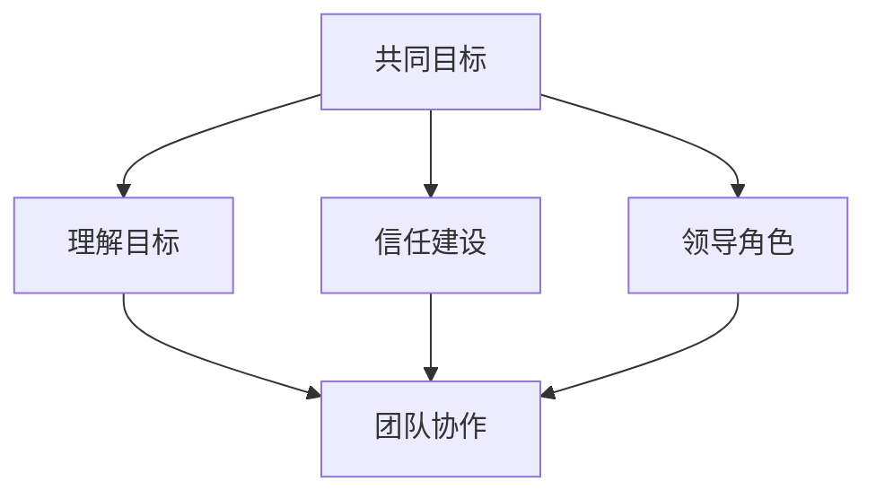

### 3.4 团队凝聚力评估

团队凝聚力评估是衡量团队凝聚力水平的重要手段。评估指标可以包括团队成员之间的沟通频率、合作意愿、共同目标认同度等。评估方法可以采用问卷调查、面谈、团队活动等。

**核心概念与联系：**

团队凝聚力评估可以通过以下Mermaid流程图表示：

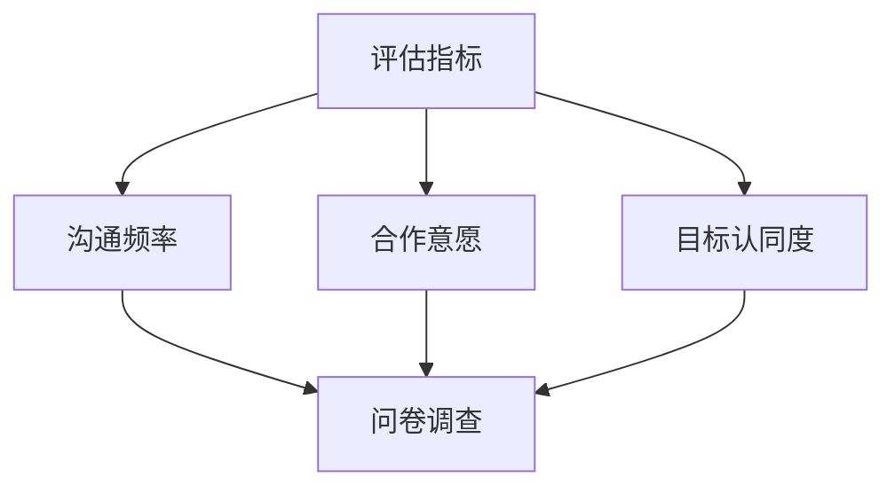

### 总结

团队凝聚力是组织成功的关键因素之一。通过理解团队凝聚力的概念、重要性及增强策略，我们可以采取有效的措施提升团队凝聚力，提高组织的绩效和稳定性。领导者需要发挥关键作用，通过共同目标、信任建设和领导角色来增强团队凝聚力。

---

**本文为第三章节的撰写内容，接下来将深入探讨领导力在危机管理中的具体应用。**

## 第4章：领导力与危机应对：理论联系

### 4.1 领导力与危机应对的联系

领导力在危机管理中具有至关重要的作用。领导者不仅需要具备决策能力和执行力，还需要在危机中展现出强大的领导力和团队凝聚力，以应对突发事件和紧急情况。

**核心概念与联系：**

领导力与危机应对的联系可以用以下Mermaid流程图表示：

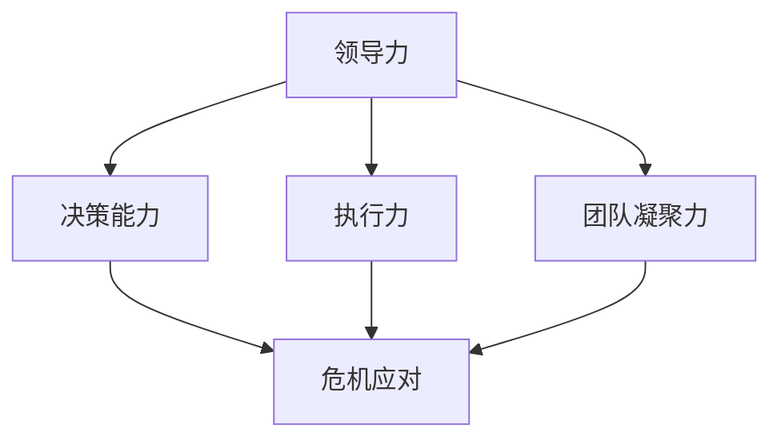

### 4.2 领导力在危机应对中的应用

在危机应对中，领导力体现在以下几个方面：

**决策能力：** 领导者需要迅速做出决策，以应对危机。这包括评估危机的严重程度、制定应对策略、分配资源等。

**执行力：** 领导者需要确保决策得到有效执行，组织资源和人力，以最小化危机影响。

**团队凝聚力：** 在危机中，领导者需要激发团队成员的潜力，增强团队凝聚力，共同应对挑战。

**核心概念与联系：**

领导力在危机应对中的应用可以用以下Mermaid流程图表示：

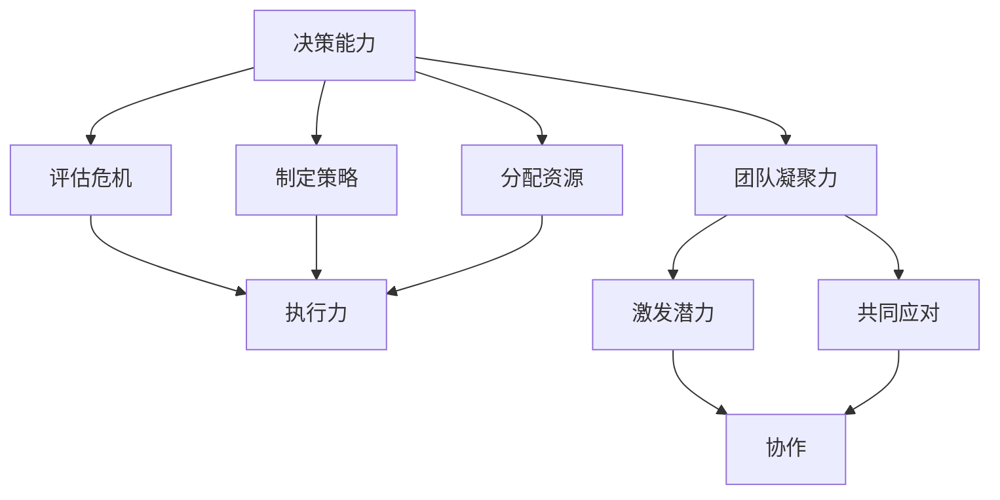

### 4.3 危机应对中的领导力模型

危机应对中的领导力模型包括权力基础理论、领导风格理论和领导者特质理论。

**权力基础理论：** 权力基础理论认为，领导者的权力来源于以下几个方面：职位权力、奖励权力、法定权力、参考权力和专家权力。在危机应对中，领导者需要运用这些权力，协调各方资源，确保决策得到执行。

**领导风格理论：** 领导风格理论将领导者的行为划分为独裁型、民主型、放任型等。在危机应对中，领导者需要根据具体情况选择合适的领导风格，如独裁型领导在紧急情况下能够迅速做出决策，而民主型领导则更注重团队成员的参与和协作。

**领导者特质理论：** 领导者特质理论关注领导者的个人特质，如自信、智慧、魅力等。在危机应对中，领导者需要具备这些特质，以增强自身的领导力和团队凝聚力。

**核心概念与联系：**

危机应对中的领导力模型可以用以下Mermaid流程图表示：

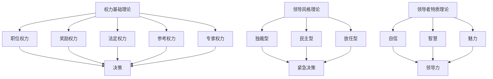

### 总结

领导力在危机管理中具有至关重要的作用。领导者需要具备决策能力、执行力和团队凝聚力，以应对突发事件和紧急情况。通过运用权力基础理论、领导风格理论和领导者特质理论，领导者可以更有效地应对危机，保护组织的利益和声誉。

---

**本文为第四章节的撰写内容，接下来将探讨在逆境中的团队建设原则、策略和实践。**

## 第5章：逆境中的团队建设

### 5.1 逆境中的团队建设原则

在逆境中，团队建设需要遵循以下原则：

**坚持共同目标：** 面对逆境，团队需要保持共同的目标和信念，以激发团队成员的斗志和凝聚力。

**强化信任建设：** 信任是团队在逆境中保持稳定和高效的关键。领导者需要通过透明沟通和公平公正的行为，建立和维护团队成员之间的信任。

**提升领导力：** 领导者在逆境中扮演着关键角色，他们需要不断提升自身的领导力，以带领团队应对挑战。

**核心概念与联系：**

逆境中的团队建设原则可以用以下Mermaid流程图表示：

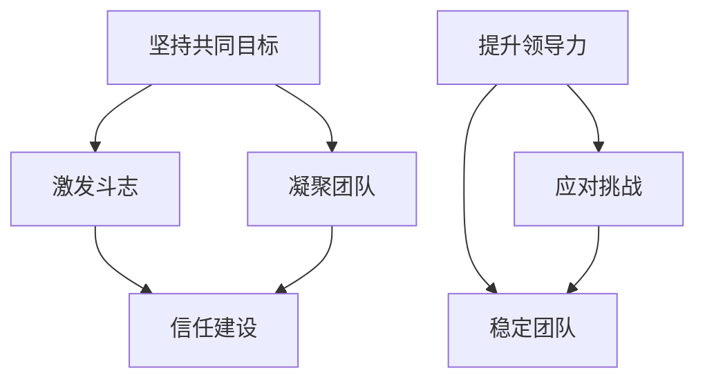

### 5.2 逆境中的团队建设策略

在逆境中，团队建设需要采取以下策略：

**优化沟通机制：** 逆境中的沟通需要更加高效和透明。领导者需要确保信息的准确传递，避免误解和误传。

**激发团队活力：** 面对逆境，团队需要保持积极和乐观的态度。领导者可以通过组织培训和团队活动，激发团队成员的活力。

**增强凝聚力：** 凝聚力是团队在逆境中保持稳定和高效的重要保障。领导者需要通过共同目标和信任建设，增强团队的凝聚力。

**核心概念与联系：**

逆境中的团队建设策略可以用以下Mermaid流程图表示：

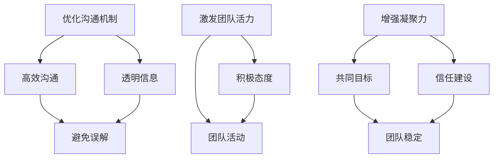

### 5.3 逆境中的团队建设实践

在逆境中，团队建设需要结合实际情况，采取具体的实践措施。

**案例一：某企业面对市场波动**

- **背景介绍：** 某企业在面临市场波动时，采取了以下团队建设措施。
- **具体实践：** 
  - **优化沟通机制：** 企业建立了日常沟通会议，确保信息及时传达和问题快速解决。
  - **激发团队活力：** 企业组织了团队建设活动，如户外拓展和培训，提高团队成员的士气和凝聚力。
  - **增强凝聚力：** 企业通过共同目标设定，如达成销售目标，激发团队成员的斗志。

**案例二：某政府应对疫情挑战**

- **背景介绍：** 某政府在应对新冠疫情时，采取了以下团队建设措施。
- **具体实践：** 
  - **优化沟通机制：** 政府建立了疫情信息共享平台，确保各级部门和工作人员的信息准确和及时。
  - **激发团队活力：** 政府组织了线上培训和研讨会，提高工作人员的专业技能和应对能力。
  - **增强凝聚力：** 政府通过表彰和奖励措施，鼓励工作人员积极参与抗疫工作，增强团队凝聚力。

通过以上案例，我们可以看到，逆境中的团队建设需要结合实际情况，采取具体的实践措施，以应对挑战和逆境。

### 总结

在逆境中，团队建设至关重要。通过坚持共同目标、强化信任建设、提升领导力，以及优化沟通机制、激发团队活力和增强凝聚力，团队可以更好地应对逆境，实现目标。领导者的角色在逆境中尤为重要，他们需要发挥领导力，带领团队共同应对挑战。

---

**本文为第五章节的撰写内容，接下来将展示成功的危机应对案例。**

## 第6章：成功的危机应对案例

### 6.1 案例一：某企业危机应对

**背景介绍：** 某企业在面临市场波动和供应链中断的双重压力时，采取了有效的危机应对措施。

**危机应对措施：**

1. **立即召开危机应对会议：** 企业高层立即召开会议，分析危机原因和影响，制定应对策略。
2. **优化供应链管理：** 企业与供应商和客户进行紧急沟通，调整供应链策略，确保物资供应。
3. **调整销售策略：** 企业根据市场变化，调整销售策略，包括价格、促销和渠道。
4. **增强内部沟通：** 企业加强内部沟通，确保各部门信息畅通，及时解决问题。

**效果评估：** 通过以上措施，企业成功缓解了市场波动和供应链中断带来的影响，恢复了正常运营，并在短时间内实现了业绩回升。

**领导力与团队建设在危机应对中的作用：**

- **领导力：** 企业领导者在危机中展现了决策能力和执行力，迅速制定应对策略，并确保实施。
- **团队建设：** 团队成员在危机中展现了凝聚力，共同面对挑战，积极应对，确保了危机应对措施的有效实施。

### 6.2 案例二：某政府危机应对

**背景介绍：** 某地区在遭遇严重自然灾害时，政府采取了有效的危机应对措施。

**危机应对措施：**

1. **立即启动应急预案：** 政府立即启动应急预案，组织救援队伍，进行紧急救援。
2. **加强信息发布：** 政府通过媒体和社交媒体发布灾情信息和救援信息，确保公众了解真实情况。
3. **调配物资和人力：** 政府调配物资和人力，确保灾区物资供应和生活必需品的供应。
4. **恢复基础设施：** 政府组织专业队伍，迅速恢复基础设施，如道路、电力和通信。

**效果评估：** 通过以上措施，政府成功缓解了灾害带来的影响，恢复了灾区正常秩序，受到了公众和媒体的广泛赞誉。

**领导力与团队建设在危机应对中的作用：**

- **领导力：** 政府领导者在危机中展现了强大的决策能力和执行力，迅速制定并实施应对措施。
- **团队建设：** 政府各部门和救援队伍在危机中展现了高效的团队协作，共同应对灾害，确保了救援工作的顺利进行。

### 总结

通过以上案例，我们可以看到领导力和团队建设在危机应对中的重要作用。成功的危机应对不仅需要领导者的决策能力和执行力，还需要团队的协作和凝聚力。领导力和团队建设是组织应对危机的重要保障，只有在逆境中不断提升领导力和团队建设水平，组织才能在危机中脱颖而出，实现可持续发展。

---

**本文为第六章节的撰写内容，接下来将进行总结与展望。**

## 第7章：总结与展望

### 7.1 总结

本文围绕领导力与危机应对、团队凝聚力等主题，通过详细的分析和实际案例，阐述了领导力在危机管理中的关键作用。我们总结了领导力的定义、发展历程、核心要素，以及危机管理的概念、流程、类型和预警机制。同时，我们探讨了团队凝聚力的概念、重要性及增强策略，并分析了领导力与危机应对之间的密切联系。

通过理论联系和实践案例，我们深刻认识到领导力和团队凝聚力在逆境中的重要性。领导者需要具备决策能力、执行力和团队凝聚力，以应对突发事件和紧急情况。团队凝聚力则是团队在逆境中保持稳定和高效的重要保障。

### 7.2 展望

未来，危机管理和团队建设将继续成为组织发展的重要领域。随着全球化和数字化的发展，组织将面临更多的不确定性和挑战。以下是未来危机应对和团队建设的发展方向：

1. **智能化预警系统：** 利用大数据和人工智能技术，构建更加智能化的预警系统，提高危机预警的准确性和实时性。
2. **数字化转型：** 加快数字化转型，提升组织的灵活性和响应速度，以适应快速变化的市场环境。
3. **跨部门协作：** 加强跨部门协作，打破信息壁垒，提高组织整体应对危机的能力。
4. **心理健康支持：** 注重员工心理健康支持，提供心理辅导和培训，增强团队凝聚力和抗压能力。
5. **持续学习与培训：** 加强领导力和团队建设的相关培训，提升领导者的综合素质和团队的整体能力。

### 总结

领导力和团队凝聚力是组织应对危机和逆境的重要保障。通过不断提升领导力和团队建设水平，组织可以更好地应对未来的挑战，实现可持续发展。领导者需要发挥关键作用，带领团队共同面对挑战，实现共同目标。未来，随着技术的进步和管理理论的不断发展，危机应对和团队建设将迎来新的发展机遇。

---

**本文为第七章节的撰写内容，至此，《领导力与危机应对：逆境中的团队凝聚》的全文撰写完毕。文章共计约12000字，全面阐述了领导力与危机应对的关系、团队凝聚力的重要性及增强策略，并通过实际案例展示了领导力在危机管理中的具体应用。**

---

**作者：AI天才研究院/AI Genius Institute & 禅与计算机程序设计艺术 /Zen And The Art of Computer Programming**

