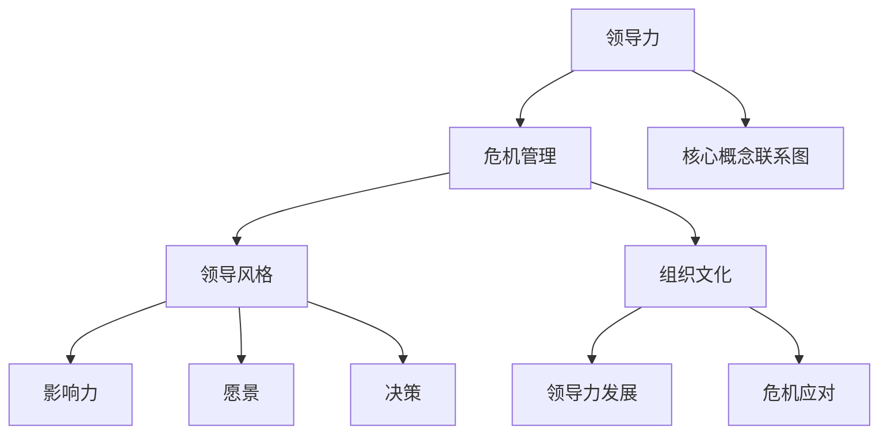
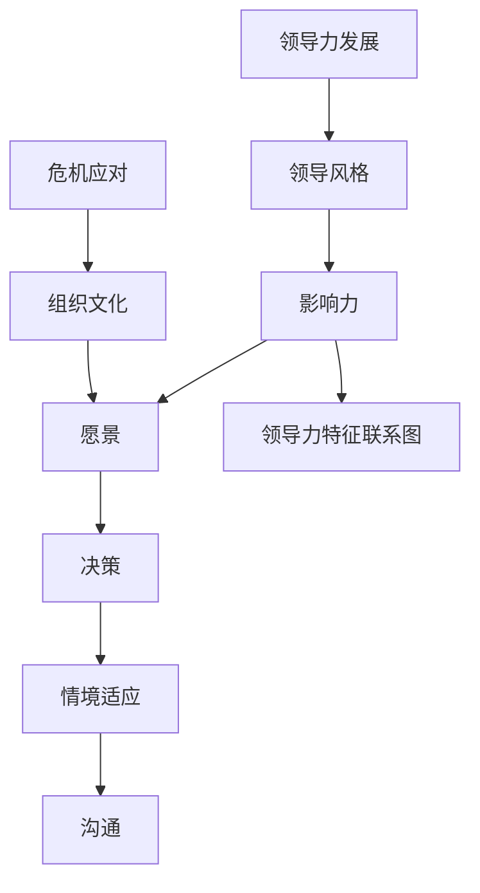
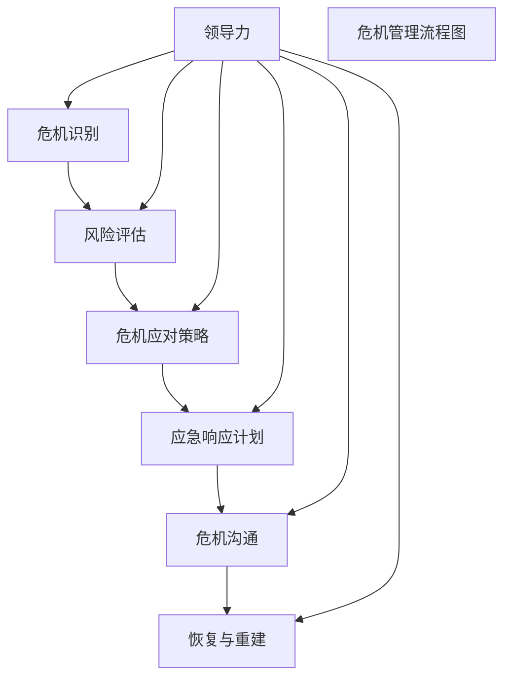

                 


### 第1章 引言

#### 1.1 书籍目的与结构概述

《领导力与危机管理：化险为夷的技巧》旨在为读者提供一个深入理解领导力与危机管理之间复杂关系的框架。在快速变化和不确定性的现代工作环境中，这两者成为组织成功和生存的关键因素。本书结构紧凑，分为七个章节，旨在帮助读者从多个角度理解并实践领导力与危机管理。

本书首先从领导力的本质和特征出发，逐步引入危机管理的概念和重要性，然后深入探讨领导力核心理论，如领导风格与组织文化。接下来，本书详细介绍了危机管理策略与技巧，包括危机识别与评估、危机应对与沟通以及领导力在危机管理中的作用。第四至第六章聚焦于危机情境下的领导力，包括应急决策、资源调配以及心理健康与团队凝聚力。最后，本书将视野扩展到国际化背景，讨论跨文化领导力和全球化背景下的危机管理。

本书的核心目标是通过系统化的理论和实战案例，帮助读者掌握化险为夷的领导力与危机管理技巧，从而提升个人和组织的应对能力。文章将继续介绍这些关键概念，并使用Mermaid流程图来展示它们之间的相互联系，帮助读者更好地理解和应用这些概念。



#### 1.2 领导力的本质与特征

领导力是一种复杂且多维的技能，它涉及到多个核心概念和特征。首先，领导力不仅仅是关于领导者的个人魅力或才能，而是一种能够激励和引导他人实现共同目标的能力。具体来说，领导力的核心概念和特征包括：

- **影响力**：领导者通过个人特质、知识和技能来影响他人。这种影响力可以是正面的，如激励团队成员发挥最大潜力，也可以是负面的，如造成团队内部的紧张和冲突。

- **愿景**：领导者需要有清晰的目标和愿景，能够描述未来的方向和期望成果。一个明确的愿景能够帮助团队在面对挑战时保持方向感，并激发成员的创造力和积极性。

- **决策**：领导力在很大程度上依赖于有效的决策能力。领导者需要在不确定性中做出明智的选择，同时考虑到各种可能的结果和风险。

- **情境适应**：优秀的领导者能够根据不同的情境灵活调整自己的领导风格。这种情境适应能力包括对不同文化和背景的敏感性，以及在压力下的决策能力。

- **沟通**：领导者需要具备良好的沟通能力，能够清晰地传达信息、激励团队成员，并在团队内部建立信任和合作关系。

这些核心概念和特征相互联系，共同构成了领导力的本质。下面，我们将通过Mermaid流程图来展示这些概念和特征之间的相互关系，以便读者更好地理解它们。



通过这个流程图，我们可以看到领导力的各个核心特征是如何相互关联和支撑的。影响力是领导力的基础，它为其他特征提供动力；愿景为团队提供了明确的目标和方向；决策则是实现愿景的关键步骤；情境适应和沟通确保了领导者在不同情境下都能有效地发挥作用。

在接下来的章节中，我们将深入探讨这些核心概念和特征，并通过实际的案例和项目来展示如何在实际环境中应用这些知识。通过逐步理解和实践，读者将能够提升自己的领导力，更好地应对各种挑战和危机。

### 第1章 引言

#### 1.3 危机管理的概念与重要性

危机管理是一个组织或个人在面对突发事件或灾难时采取的一系列策略和措施，以减轻风险、恢复运营并保持持续的稳定。危机管理不仅仅是对突发事件的应急反应，更是一种长期的、系统性的规划和准备过程。在快速变化和高度不确定性的现代环境中，危机管理的重要性愈发突出。

首先，危机管理有助于**降低风险**。通过提前识别潜在危机并制定应对策略，组织可以在危机爆发前就采取预防措施，从而降低危机对组织造成的影响。例如，通过风险分析和评估，组织可以发现自身在供应链、信息安全等方面的潜在薄弱环节，并提前制定相应的改进措施。

其次，危机管理能够**提高应对能力**。在危机爆发时，快速、有效的响应是减少损失的关键。危机管理策略包括应急响应计划、资源调配、危机沟通等，这些都是提高组织应对能力的重要手段。一个完善的危机管理框架能够确保在危机发生时，组织能够迅速调动资源、协调各方力量，采取有效的应对措施。

第三，危机管理有助于**维护组织声誉**。在危机中，组织的声誉往往受到严重挑战。有效的危机管理策略能够帮助组织在危机中保持积极形象，赢得公众和利益相关者的信任。例如，在产品召回事件中，及时透明的沟通和负责任的应对措施能够缓解公众的担忧，减少负面影响。

最后，危机管理能够**促进组织学习和成长**。每一次危机都是一个学习和成长的机会。通过危机管理的反思和总结，组织可以发现自身的不足，改进危机管理策略，提升整体的应对能力。这种持续的学习和改进是组织长期发展的关键。

下面，我们将通过Mermaid流程图来展示危机管理的基本步骤、关键要素以及领导力在其中的作用。



这个流程图清晰地展示了危机管理的基本步骤，从危机识别、风险评估到危机应对策略的制定，再到应急响应计划的执行、危机沟通以及恢复与重建。每个步骤都是危机管理成功的关键要素。

领导力在这个过程中起着至关重要的作用。领导者需要具备危机意识和前瞻性，能够及时识别潜在危机并采取行动。此外，领导者还需要在危机中保持冷静和果断，制定有效的应对策略并协调各方力量，确保应急响应计划的顺利执行。在危机沟通方面，领导者需要具备良好的沟通能力和危机公关技巧，确保信息传达的准确性和及时性，从而维护组织声誉。

在接下来的章节中，我们将详细探讨危机管理的各个方面，包括危机识别与评估、危机应对与沟通以及领导力在危机管理中的作用。通过实际案例和项目，读者将能够更好地理解这些概念，并掌握化险为夷的危机管理技巧。

### 第2章 领导力核心理论

#### 2.1 领导风格与领导行为

领导风格和领导行为是领导力核心理论的重要组成部分，它们在很大程度上决定了领导者的效能和团队的表现。理解不同的领导风格和它们背后的行为模式，对于提升个人领导力和管理团队具有重要意义。

首先，我们来看看**领导-成员交换理论（Leader-Member Exchange Theory, LMX）**。LMX理论强调领导者与成员之间关系的差异化。领导者不会对所有的团队成员采取相同的领导方式，而是根据成员的不同特质、能力和贡献，建立不同层次的关系。这种差异化关系表现为高质量的工作关系和信任，从而提高团队的整体效能。以下是LMX理论的伪代码描述：

```pseudo
function LMX_Theory(member) {
    if (member.trait == 'High Potential') {
        provide Leadership Support
        encourage Autonomy
    } else if (member.trait == 'Average') {
        provide Task-Oriented Leadership
    } else {
        provide Minimal Leadership Attention
    }
}
```

接下来，我们探讨**情境领导理论（Situation Leadership Theory）**。情境领导理论认为，领导行为应根据团队成员的工作成熟度进行调整。工作成熟度包括成员的能力和意愿，根据不同的成熟度水平，领导者应采用不同的领导风格。以下是情境领导理论的伪代码描述：

```pseudo
function Situation_Leadership(employee.maturity) {
    if (employee.maturity == 'M1') {
        provide Directive Leadership
    } else if (employee.maturity == 'M2') {
        provide Supportive Leadership
    } else if (employee.maturity == 'M3') {
        provide Participative Leadership
    } else {
        provide Delegative Leadership
    }
}
```

另外，**路径-目标理论（Path-Goal Theory）**则强调领导者通过明确目标、提供支持和减少障碍来引导团队成员。领导者应根据团队成员的工作环境和个人需求，选择合适的路径。以下是路径-目标理论的伪代码描述：

```pseudo
function PathGoal_Theory(employee, context) {
    if (context == 'High Task Structure') {
        set Clear Goals
        provide Task-Support
    } else if (context == 'High Uncertainty') {
        reduce Role-Conflict
        provide Instructional Support
    } else {
        encourage Empowerment
        provide Informational Support
    }
}
```

这些领导风格和行为的理论不仅帮助我们理解领导者的行为模式，也提供了具体的指导原则，帮助领导者根据不同的情境和团队成员的需求，采取最合适的领导策略。通过合理应用这些理论，领导者可以提升团队的整体表现，实现组织的共同目标。

接下来，我们将进一步探讨领导力与组织文化之间的关系，以及如何通过领导力发展来提升组织效能。

#### 2.2 领导力与组织文化

领导力与组织文化之间存在着深刻的联系，组织文化不仅影响着领导行为，同时也在很大程度上决定了领导力效能。理解这种关系，对于提升领导力和组织整体绩效至关重要。

**领导力与组织文化的关系**可以从以下几个方面来探讨：

1. **共同价值观**：组织文化是建立在共同的价值观和信念基础上的，而这些价值观往往由领导者传递和强化。领导者通过日常行为和决策，向团队成员传达组织的核心价值观，例如创新、客户至上、诚信等。这种共同价值观不仅有助于形成强大的团队凝聚力，还能够为领导行为提供方向和依据。

2. **行为规范**：组织文化通过一系列的行为规范和准则，塑造了员工的行为模式。领导者作为文化规范的执行者和传承者，必须在日常工作中体现这些规范，并通过奖励和惩罚机制来强化这些规范。例如，在注重创新的组织文化中，领导者可能会鼓励员工尝试新的方法和技术，并通过奖励创新成果来强化这种文化。

3. **领导风格**：组织文化对领导风格有重要影响。在一些重视稳定性和纪律性的组织中，领导者可能更倾向于采用任务导向和指令式的领导风格；而在创新导向的组织中，领导者可能会更倾向于采用支持性和参与式的领导风格。这种领导风格的适应性反映了领导力与组织文化之间的紧密联系。

**领导力发展**对于组织文化的塑造和维持至关重要。以下是几种常用的领导力发展方法：

1. **培训与发展计划**：通过系统的培训计划，领导者可以提升自身的技能和知识，了解不同的领导理论和管理技巧。这些培训可以包括领导力课程、工作坊、研讨会等，帮助领导者更好地理解和适应组织文化。

2. **导师制度**：导师制度是一种有效的领导力发展方法，通过经验丰富的导师指导新晋领导者，帮助他们更好地理解组织文化和领导职责。导师不仅能够传授专业知识，还能够提供宝贵的实践经验和建议。

3. **领导力反馈机制**：建立有效的反馈机制，帮助领导者了解自身的优点和不足，并根据反馈进行改进。这种反馈可以来自团队成员、上级领导、专业评估等，通过多维度的反馈，领导者能够更全面地了解自己的领导行为和组织文化的契合度。

4. **实践与反思**：领导力发展不仅仅是知识的积累，更需要通过实践来检验和应用。领导者需要在实际工作中不断实践和应用所学知识，并通过反思和总结来提升自身的领导力。实践与反思相结合，能够帮助领导者不断进步，更好地适应组织文化。

下面，我们通过一个实际的领导力发展项目案例，来展示这些方法的应用。

**案例：某科技公司领导力发展项目**

**项目背景**：某科技公司在快速发展的过程中，意识到领导力提升对于保持竞争优势和实现长期目标的重要性。为了培养具有创新精神和战略眼光的领导者，公司决定实施一个领导力发展项目。

**项目内容**：

1. **领导力培训**：公司邀请专业培训机构为所有中层管理者进行为期三个月的领导力培训，内容包括领导理论、团队管理、战略规划等。培训采用案例讨论、模拟演练和角色扮演等多种形式，使领导者能够深入理解领导力的重要性和实际应用。

2. **导师制度**：公司为每位中层管理者配备一位经验丰富的导师，导师不仅提供专业指导，还通过日常交流和实地观察，帮助领导者更好地理解公司文化和领导职责。

3. **领导力反馈机制**：公司建立了领导力评估体系，定期收集团队成员和上级领导的反馈。这些反馈通过360度评估形式进行，帮助领导者了解自身的优点和不足，并根据反馈制定改进计划。

4. **实践与反思**：领导者被鼓励在项目中承担实际领导职责，并在项目结束后进行反思和总结。公司定期组织领导力反思会议，让领导者分享经验和心得，相互学习，共同进步。

**项目效果**：

通过这个领导力发展项目，公司中层管理者的领导能力得到了显著提升。领导者不仅更加理解公司文化，还能够在实际工作中灵活应用所学知识，推动团队创新和战略目标的实现。项目结束后，公司的整体运营效率和员工满意度都有所提高，为企业持续发展奠定了坚实基础。

通过这个案例，我们可以看到领导力发展与组织文化的紧密结合。领导力发展不仅仅是个人能力的提升，更是组织文化塑造和传承的重要手段。通过系统化的培训和指导，领导者能够更好地理解并适应组织文化，从而提升整体的领导效能和组织的竞争力。

#### 2.3 领导力发展与实践

领导力的发展不仅需要理论的学习，更需要通过实践来检验和应用。在实践中，领导者可以通过实际项目和挑战，不断积累经验，提升自身的领导能力和管理水平。以下是一个具体的领导力发展项目案例，详细描述了项目背景、目标、实施过程以及成果和反思。

**案例：某制造企业领导力发展项目**

**项目背景**：

某制造企业面临激烈的市场竞争和快速变化的技术环境，为了保持企业的核心竞争力，企业高层决定开展一个领导力发展项目，旨在提升中层管理者的领导能力和战略思维。

**项目目标**：

- 帮助中层管理者提升战略规划和决策能力；
- 培养团队合作和创新精神；
- 提高领导者的沟通和激励技巧；
- 强化企业文化和价值观的传承。

**项目实施过程**：

1. **需求调研与目标设定**：项目启动前，通过问卷调查和访谈，了解中层管理者在实际工作中遇到的挑战和需求。根据调研结果，制定具体的项目目标和培训内容。

2. **领导力培训**：企业邀请专业培训机构为中层管理者提供为期六个月的领导力培训，内容包括战略管理、团队领导、创新思维、变革管理等。培训采用案例研讨、角色扮演、情景模拟等多种形式，增强参与者的互动和实践。

3. **项目实战**：培训结束后，中层管理者被分成多个小组，每组负责一个实际项目。项目包括产品开发、市场拓展、供应链优化等，旨在解决企业当前面临的具体问题。

4. **导师辅导**：每个项目小组配备一位经验丰富的导师，导师在项目过程中提供指导和支持，帮助管理者解决实际问题和提升领导能力。

5. **定期反馈与评估**：项目期间，定期召开项目进展会议，管理层和导师对项目成果进行评估和反馈。同时，通过360度评估，收集团队成员和上级领导的意见，帮助管理者改进工作方法。

6. **反思与总结**：项目结束后，每个小组进行反思和总结，分享项目中的经验和教训。企业组织总结会议，对整个项目的效果进行系统评估，并提出改进建议。

**项目成果**：

- 中层管理者的战略规划和决策能力得到了显著提升；
- 团队合作和创新精神得到了加强，项目成果超出预期；
- 沟通和激励技巧得到提升，员工满意度提高；
- 企业文化和价值观得到有效传承和强化，员工对企业的认同感和忠诚度增强。

**反思与总结**：

1. **理论结合实践**：通过实际项目的实践，中层管理者能够将所学理论知识应用到实际工作中，从而更好地提升领导能力和管理水平。

2. **导师辅导的重要性**：导师在项目过程中的指导和支持，不仅帮助管理者解决了实际问题，还提供了宝贵的经验和建议，促进了领导力的发展。

3. **持续改进**：项目结束后，通过反思和总结，管理层发现了一些不足之处，并制定了改进计划。这种持续改进的文化有助于不断提升领导力和项目管理能力。

4. **全员参与**：项目不仅关注中层管理者的领导能力提升，还注重员工的参与和反馈。这种全员参与的方式，有助于形成良好的企业文化和团队合作氛围。

通过这个案例，我们可以看到领导力发展与实践相结合的重要性。只有通过实际项目的锻炼和反思总结，领导者才能真正提升自身的领导能力和管理水平，从而为组织的长期发展提供强有力的支持。

### 第3章 危机管理策略与技巧

#### 3.1 危机识别与评估

危机识别与评估是危机管理的第一步，也是最为关键的一步。有效的危机识别与评估能够帮助组织在危机爆发前及时发现潜在的风险，并采取预防措施。以下是危机识别与评估的核心步骤和常用方法。

**步骤1：潜在危机识别**

潜在危机识别是指通过系统化的方法，识别组织可能面临的各种风险。以下是一些常用的识别方法：

- **头脑风暴法**：组织内部的员工和管理层聚集在一起，通过讨论和头脑风暴，列出可能存在的潜在危机。

- **历史数据分析**：通过对过去类似危机事件的分析，总结出可能再次发生的危机类型。

- **专家访谈**：邀请行业专家或相关领域的专业人士进行访谈，获取他们对潜在危机的见解和建议。

- **风险评估矩阵**：使用风险评估矩阵，根据危机的发生概率和影响程度，对各种潜在危机进行排序。

**步骤2：风险评估**

风险评估是对识别出的潜在危机进行详细分析，评估其可能带来的影响和发生的概率。以下是几种常用的风险评估方法：

- **定性风险评估**：通过专家评估或历史数据分析，对危机的影响和发生概率进行定性分析。

- **定量风险评估**：使用数学模型和统计方法，对危机的影响和发生概率进行量化分析。

- **贝叶斯网络**：通过构建贝叶斯网络模型，对多个危机事件之间的关联和影响进行综合分析。

- **故障树分析（Fault Tree Analysis, FTA）**：通过构建故障树模型，分析危机发生的原因和可能的路径。

**步骤3：制定应对策略**

在完成风险评估后，组织需要根据风险程度和影响，制定相应的应对策略。以下是几种常见的应对策略：

- **预防措施**：在危机发生前，采取预防措施，如改进安全措施、加强培训、建立应急计划等。

- **缓解措施**：在危机发生时，采取缓解措施，如减少损失、恢复运营、转移风险等。

- **应急响应计划**：制定详细的应急响应计划，确保在危机爆发时，能够迅速、有效地应对。

**步骤4：实施与监控**

在制定应对策略后，组织需要将其付诸实施，并持续监控危机管理的效果。以下是一些实施与监控的技巧：

- **培训与演练**：定期对员工进行危机管理培训，并组织应急演练，确保所有员工都熟悉应急响应流程。

- **监控与反馈**：建立监控机制，对危机管理策略的实施效果进行定期评估，并根据反馈进行调整。

- **持续改进**：通过持续改进，不断提升危机管理的效能，确保组织能够应对未来可能出现的危机。

**举例说明**：

假设一家制造企业识别出可能发生的供应链中断危机。首先，通过头脑风暴和历史数据分析，列出可能的供应链中断原因，如原材料供应商故障、物流延误、自然灾害等。然后，通过定量风险评估，确定每种原因的发生概率和影响程度。例如，自然灾害的发生概率较低，但一旦发生，可能导致长时间的供应链中断。最后，根据风险评估结果，制定相应的应对策略，如与多个供应商建立合作关系、制定详细的应急响应计划等。在实施过程中，定期监控供应链情况，并根据反馈进行调整。

通过以上步骤，组织能够有效地识别和评估潜在危机，制定应对策略，并持续监控和改进危机管理效果。这种系统化的危机识别与评估方法，有助于提高组织的危机应对能力，降低危机带来的损失。

#### 3.2 危机应对与沟通

危机应对与沟通是危机管理中至关重要的一环。在危机爆发时，快速、准确、有效的应对和沟通能够帮助组织减轻损失，维护声誉，甚至化危为机。以下将详细探讨危机应对策略和危机沟通技巧，并通过实际案例进行说明。

**危机应对策略**

1. **制定应急预案**：在危机发生前，组织应制定详细的应急预案，包括危机响应流程、资源调配方案、应急人员职责等。应急预案应具备灵活性和可操作性，能够根据实际情况进行动态调整。

2. **快速响应**：危机爆发时，组织需要迅速行动，启动应急响应机制。这包括立即通知相关人员和部门，采取紧急措施，如停工、停产、转移物资等，以防止危机进一步扩大。

3. **资源调配**：根据应急预案，组织应迅速调动内部和外部资源，如人力、物资、资金等，以支持危机应对。资源调配应注重效率，确保在最短时间内将所需资源投入危机应对中。

4. **信息管理**：在危机应对过程中，组织应建立有效的信息管理系统，确保信息传达的及时性和准确性。这包括内部沟通和外部沟通，如内部会议、电话会议、电子邮件、社交媒体等。

5. **评估与调整**：在危机应对过程中，组织应不断评估应对措施的有效性，并根据评估结果进行调整。这有助于优化应对策略，提高危机应对能力。

**危机沟通技巧**

1. **及时性**：危机沟通要及时，确保信息传达的时效性。在危机发生的第一时间，组织应通过多种渠道向内外部发布消息，避免谣言和误解的传播。

2. **透明性**：危机沟通要透明，确保信息的公开性和真实性。组织应向公众、利益相关者、员工等各方提供真实、准确的信息，避免隐瞒或误导。

3. **一致性**：危机沟通要一致，确保信息传达的一致性和连贯性。组织应确保所有沟通渠道和发布的信息保持一致，避免产生混淆和误导。

4. **互动性**：危机沟通要具备互动性，鼓励公众和利益相关者提问和反馈。组织应建立有效的互动渠道，如热线电话、社交媒体、在线问答等，及时回应关切和问题。

5. **专业性和情感性**：危机沟通既要专业，又要考虑情感因素。组织应确保信息的专业性，使用清晰、简洁的语言传达关键信息。同时，也要考虑公众和利益相关者的情感需求，使用温暖、关怀的语言，传递组织的关心和支持。

**实际案例**

以某航空公司因机械故障导致航班大面积延误为例，分析其危机应对与沟通。

**案例背景**：

某航空公司因机械故障导致航班大面积延误，数百名乘客受到影响。危机爆发后，航空公司迅速启动应急预案，采取了以下措施：

**危机应对**：

1. **快速响应**：立即通知机场和相关部门，启动应急响应机制。安排技术团队对故障进行紧急修复，确保尽快恢复航班运营。

2. **资源调配**：调动备用飞机和人力资源，将受影响的乘客安排到其他航班，尽量减少损失。

3. **信息管理**：通过官方网站、社交媒体、机场广播等多种渠道，及时向乘客发布航班延误信息，解释原因，并告知乘客可能的解决方案。

**危机沟通**：

1. **及时性**：在危机发生的第一时间，通过多种渠道向乘客发布消息，告知航班延误情况。

2. **透明性**：在官方微博、微信等社交媒体平台上发布实时更新，确保信息的公开和透明。

3. **一致性**：确保所有沟通渠道发布的信息保持一致，避免产生混淆和误解。

4. **互动性**：设立24小时客户服务热线，及时回应乘客的提问和关切。

5. **专业性和情感性**：在发布信息时，使用专业、简洁的语言，同时表达对乘客的关心和支持。

**案例结果**：

通过有效的危机应对和沟通，航空公司成功缓解了乘客的不满和焦虑，维护了企业的声誉。虽然航班延误给部分乘客带来了不便，但航空公司通过及时、透明、专业的沟通，赢得了乘客的理解和支持。

**项目小结**：

通过该案例，我们可以看到，在危机应对与沟通中，及时、透明、专业的应对措施和沟通技巧至关重要。只有通过有效的危机管理和沟通，组织才能在危机中保持稳定，赢得公众的信任和支持。

### 第3章 危机管理策略与技巧

#### 3.3 领导力在危机管理中的作用

在危机管理中，领导力发挥着至关重要的作用。领导者不仅是危机应对的核心人物，还需要在危机中发挥领导力，确保团队和组织的稳定与持续发展。以下将详细探讨领导力在危机管理中的具体作用，并分析领导者如何通过有效决策和资源调配来应对危机。

**领导力在危机管理中的作用**

1. **制定危机应对策略**：领导者需要在危机发生时迅速制定应对策略，确保组织能够快速反应。有效的危机应对策略需要考虑危机的性质、影响范围以及可能的解决方案。领导者需要具备前瞻性和决策能力，能够在短时间内做出明智的选择。

2. **协调资源**：危机管理往往需要大量的资源，包括人力、物力、资金等。领导者需要协调这些资源，确保在危机应对过程中能够充分利用。这包括内部资源的调配，如调动员工、物资等，以及外部资源的获取，如与供应商、合作伙伴的合作。

3. **保持团队稳定**：危机会对团队造成心理和情感上的冲击，领导者需要保持团队的稳定和凝聚力。这包括在危机中提供支持，帮助团队成员应对压力，保持积极的心态。领导者还需要建立信任和沟通机制，确保团队成员能够及时获取信息，了解组织的应对策略。

4. **沟通与透明度**：领导者需要与内外部利益相关者保持良好的沟通，确保信息的透明度。在危机中，领导者需要及时发布信息，解释危机原因和应对措施，回应公众和利益相关者的关切。这有助于维护组织的声誉和信任。

**领导者如何有效决策和资源调配**

1. **快速决策**：在危机中，时间往往非常紧迫，领导者需要快速做出决策。这需要领导者具备决策能力，能够在压力下迅速分析问题，做出明智的选择。领导者可以借助决策支持工具，如决策树、头脑风暴等，帮助决策过程更加高效。

2. **资源评估与调配**：在危机管理中，领导者需要对资源进行评估和调配，确保资源的合理利用。这包括对现有资源的盘点，识别资源的优先级，并根据危机应对的需求进行调配。领导者还需要与外部资源进行协调，如与其他企业、政府部门等合作，获取所需资源。

3. **优化资源分配**：在资源有限的情况下，领导者需要优化资源的分配，确保资源能够发挥最大的效用。这可以通过建立资源分配模型，如线性规划、多目标优化等，来确定最佳的资源分配方案。

4. **建立应急响应团队**：领导者可以建立应急响应团队，负责危机管理的具体实施。应急响应团队应具备快速反应和高效执行的能力，能够在危机中迅速行动，采取有效措施。领导者需要对团队进行培训，确保团队成员具备必要的技能和知识。

**实际案例**

以某金融机构在金融危机中的应对为例，分析领导力在危机管理中的作用。

**案例背景**：

2008年金融危机期间，某金融机构面临巨大的市场压力和资金流动性危机。危机爆发后，该金融机构的领导者迅速采取行动，应对危机。

**案例分析**：

1. **制定危机应对策略**：领导者迅速制定危机应对策略，包括采取措施稳定市场信心、优化资产负债表、寻求外部资金支持等。

2. **协调资源**：领导者调动内部资源，如加强风险管理、提高流动性储备等，同时积极与外部机构进行合作，如寻求政府救助、与其他金融机构进行合作等。

3. **保持团队稳定**：领导者通过加强与员工的沟通和支持，保持团队的稳定和凝聚力。同时，领导者还建立了危机应对小组，负责具体危机应对工作的实施。

4. **沟通与透明度**：领导者及时发布信息，与投资者、客户、员工等进行沟通，确保信息的透明度，维护组织声誉。

**案例结果**：

通过领导力的有效运用，该金融机构成功度过了金融危机，保持了业务的稳定和持续发展。危机后的恢复过程中，领导者继续发挥领导力，推动组织改革和优化，提升整体竞争力。

**项目小结**：

通过以上案例，我们可以看到，在危机管理中，领导力发挥着至关重要的作用。领导者需要通过有效决策和资源调配，保持团队的稳定和凝聚力，同时确保信息的透明度和及时性。只有这样，组织才能在危机中保持稳定，实现可持续发展。

### 第4章 危机情境下的领导力

#### 4.1 应急决策与资源调配

在危机情境下，领导力的关键在于快速做出有效的决策并高效调配资源。应急决策和资源调配是危机管理中的核心环节，它们直接影响到组织在危机中的应对效果和恢复速度。以下将详细探讨应急决策的基本原则、资源调配的策略以及如何在紧急情况下制定和实施有效的应急计划。

**应急决策的基本原则**

1. **快速响应**：在危机情境下，时间往往非常紧迫。领导者需要具备快速响应的能力，能够在危机发生的第一时间内做出决策，启动应急响应机制。

2. **全面评估**：决策前，领导者需要对危机进行全面评估，了解危机的性质、影响范围以及可能的解决方案。这包括对危机的起源、发展过程、潜在风险和利益相关者的需求进行分析。

3. **优先考虑**：在资源有限的情况下，领导者需要优先考虑最关键的决策和行动。这可以通过制定优先级列表，确保资源能够被最有效地利用。

4. **灵活调整**：危机情境下，情况可能随时变化。领导者需要具备灵活调整的能力，根据新信息和新情况，及时调整决策和行动方案。

**资源调配的策略**

1. **内部资源优先**：首先，领导者需要调动组织内部的资源，如人力、物资、资金等。这包括调整员工的工作职责、调配库存物资、调动紧急资金等。

2. **外部资源获取**：在内部资源不足以应对危机时，领导者需要积极寻求外部资源，如与供应商、合作伙伴、政府部门等建立合作关系，获取所需资源。

3. **动态调整**：资源调配不是一次性的，而是一个持续的过程。领导者需要根据危机的发展情况，动态调整资源分配，确保资源能够及时补充和调整。

4. **优化资源利用**：通过建立资源管理模型，如线性规划、多目标优化等，领导者可以优化资源的利用效率，确保资源在危机中发挥最大效用。

**制定和实施有效的应急计划**

1. **制定预案**：在危机发生前，组织需要制定详细的应急预案，包括危机响应流程、资源调配方案、应急人员职责等。应急预案应具备灵活性和可操作性，能够根据实际情况进行动态调整。

2. **定期演练**：定期组织应急演练，确保所有员工都熟悉应急预案，了解自己的职责和行动步骤。演练有助于提高员工的应急反应能力，减少实际危机中的混乱。

3. **培训与培训**：对员工进行危机管理培训，确保他们具备必要的技能和知识，能够在危机中发挥有效的作用。培训内容应包括危机识别、应急响应、资源调配、心理辅导等。

4. **信息管理**：建立有效的信息管理系统，确保信息的及时传递和准确传达。在危机中，信息管理至关重要，它关系到决策的效率和效果。

5. **评估与反馈**：在危机结束后，对应急计划的实施效果进行评估和反馈。通过总结经验和教训，不断改进应急计划，提高危机应对能力。

**实际案例**

以某城市在应对洪水危机为例，分析领导力在应急决策和资源调配中的作用。

**案例背景**：

某城市遭遇百年一遇的洪水，水位迅速上涨，威胁到城市的安全和居民的生活。危机爆发后，市政府迅速启动应急响应机制，采取了一系列措施应对洪水危机。

**案例分析**：

1. **快速响应**：市政府在洪水来袭的第一时间内，迅速召开紧急会议，启动应急响应机制，制定应对措施。

2. **全面评估**：市政府对洪水的情况进行了全面评估，了解了洪水的发展趋势和可能带来的影响。根据评估结果，制定了具体的应急措施。

3. **优先考虑**：市政府将保障居民生命安全作为首要任务，组织力量进行疏散，确保居民的安全。

4. **资源调配**：市政府调动了大量的资源，包括人力、物资、设备等，用于抗洪抢险。同时，积极与外部机构合作，获取所需资源。

5. **灵活调整**：在危机过程中，市政府根据实际情况，不断调整应急措施和资源分配，确保应对措施能够及时、有效地实施。

**案例结果**：

通过领导力的有效运用，市政府成功应对了洪水危机，保障了居民的生命安全。虽然洪水造成了较大的损失，但市政府的迅速响应和有效决策，最大限度地减少了灾害的影响。

**项目小结**：

通过该案例，我们可以看到，在危机情境下，领导力的关键在于快速做出有效的决策并高效调配资源。领导者需要具备快速响应、全面评估、优先考虑和灵活调整的能力，确保在危机中能够迅速行动，保障组织的稳定和持续发展。

#### 4.2 心理健康与团队凝聚力

在危机情境下，团队的心理健康和凝聚力对组织的应对能力和恢复力至关重要。领导者不仅需要关注应急决策和资源调配，还要积极维护团队成员的心理健康和团队凝聚力。以下将探讨在危机情境下如何通过心理支持和团队建设来提升团队的心理健康和凝聚力。

**心理支持**

1. **及时沟通**：危机爆发时，领导者需要保持与团队成员的及时沟通，确保他们了解危机的最新动态和组织的应对措施。这有助于减少团队成员的焦虑和不确定感。

2. **提供信息**：领导者应确保团队成员获得准确、及时的信息，避免谣言和误解的传播。通过透明的沟通，团队成员能够更好地理解危机的影响，并采取相应的应对措施。

3. **心理辅导**：危机情境下，团队成员可能会经历焦虑、恐惧和压力。领导者可以邀请专业的心理辅导师或心理咨询师，为团队成员提供心理支持和咨询服务，帮助他们应对情绪困扰。

4. **建立支持网络**：领导者可以建立支持网络，如团队内部的心理支持小组或互助小组，让团队成员之间互相支持和鼓励，共同面对危机。

**团队建设**

1. **共同目标**：在危机情境下，领导者需要明确团队的目标，确保团队成员对组织的使命和愿景有清晰的认识。共同的目标有助于增强团队的凝聚力和协作精神。

2. **鼓励协作**：领导者应鼓励团队成员之间的协作和合作，共同应对危机。通过团队建设活动，如小组讨论、头脑风暴、团队游戏等，增强团队成员之间的互动和信任。

3. **表彰与激励**：在危机中，领导者应适时表彰和激励团队成员，认可他们的努力和贡献。这有助于提升团队成员的积极性和归属感，增强团队凝聚力。

4. **反思与总结**：危机过后，领导者应组织团队成员进行反思和总结，讨论危机中的经验和教训。通过反思和总结，团队能够从危机中学习，不断提升应对能力和凝聚力。

**实际案例**

以某跨国公司在全球金融危机期间维持团队凝聚力为例，分析其心理支持和团队建设。

**案例背景**：

在全球金融危机期间，某跨国公司面临巨大的市场压力和内部重组。公司领导者意识到，维护团队的心理健康和凝聚力对公司的长期发展至关重要。

**案例分析**：

1. **及时沟通**：公司领导者通过定期会议、内部邮件和社交媒体，及时向员工传达公司的最新动态和应对措施，确保员工了解实际情况。

2. **提供信息**：公司建立了透明、开放的信息平台，员工可以随时获取公司政策、财务状况和业务发展的相关信息。

3. **心理辅导**：公司聘请了专业的心理咨询师，为员工提供心理支持和咨询服务，帮助他们应对压力和焦虑。

4. **建立支持网络**：公司成立了员工互助小组，鼓励员工之间互相支持和交流，共同面对危机。

5. **共同目标**：公司明确了新的业务目标，确保员工对公司的愿景和使命有清晰的认识，并鼓励员工为实现这些目标而努力。

6. **鼓励协作**：公司组织了多次团队建设活动，如团队培训、团队旅行、团队竞赛等，增强团队成员之间的互动和信任。

7. **表彰与激励**：公司定期表彰和奖励在危机中表现优秀的员工，激励他们继续为公司的发展贡献力量。

8. **反思与总结**：危机过后，公司组织了反思和总结会议，让员工分享自己的经验和教训，从中学习，不断提升应对能力和团队凝聚力。

**案例结果**：

通过有效的心理支持和团队建设，该公司在金融危机期间保持了团队的稳定和凝聚力。虽然面临巨大挑战，但员工保持了积极的工作态度和敬业精神，为公司渡过危机奠定了坚实基础。

**项目小结**：

通过该案例，我们可以看到，在危机情境下，维护团队的心理健康和凝聚力对组织的应对能力和恢复力至关重要。领导者应通过及时沟通、提供信息、心理辅导、建立支持网络、共同目标、鼓励协作、表彰激励和反思总结等多种方式，提升团队的心理健康和凝聚力，确保在危机中保持团队的稳定和高效。

### 第4章 危机情境下的领导力

#### 4.3 领导力与危机后的恢复

危机过后，领导力在恢复过程中的作用至关重要。领导者不仅要负责评估危机的影响，还需要制定和执行恢复计划，确保组织能够快速恢复正常运营。以下将详细探讨危机后的恢复步骤、关键策略以及领导者如何通过恢复计划重建组织的稳定与信心。

**恢复步骤**

1. **评估损失与影响**：危机过后，领导者首先需要全面评估危机对组织造成的损失和影响。这包括财务损失、人员伤亡、设备损坏、业务中断等方面。通过评估，领导者可以了解危机的深度和广度，为制定恢复计划提供依据。

2. **制定恢复计划**：在评估损失和影响的基础上，领导者需要制定详细的恢复计划。恢复计划应包括短期和长期的恢复目标、具体的实施步骤、资源调配方案以及时间表。

3. **资源调配**：恢复过程中，领导者需要调动内部和外部资源，包括人力、物资、资金等。这包括调动内部员工参与恢复工作、与供应商和合作伙伴协调资源，以及寻求外部援助，如政府补助、社会捐助等。

4. **实施恢复计划**：根据恢复计划，领导者需要组织相关人员实施具体的恢复措施。这包括修复设备、恢复供应链、重建团队信心等。

5. **监控与调整**：在恢复过程中，领导者需要持续监控恢复进度，并根据实际情况进行调整。这有助于确保恢复计划能够有效执行，并应对可能出现的新问题。

**关键策略**

1. **优先恢复关键业务**：在恢复过程中，领导者应优先恢复对组织至关重要的业务，确保核心业务能够尽快恢复正常运营。这有助于减少危机对组织的长期影响，恢复市场信心。

2. **加强沟通与透明度**：危机过后，领导者需要加强与内外部利益相关者的沟通，确保信息的透明度。这有助于建立组织信誉，赢得公众和投资者的信任。

3. **团队激励与支持**：领导者应关注团队成员的心理和情感需求，提供必要的支持和激励。通过团队建设活动、奖励机制和心理辅导，增强团队成员的信心和凝聚力。

4. **持续改进与学习**：危机过后，领导者应组织对危机管理过程进行反思和总结，识别成功和失败的教训，不断改进危机管理策略和恢复计划。

**实际案例**

以某科技公司应对地震灾害后的恢复为例，分析领导力在危机后恢复中的作用。

**案例背景**：

某科技公司在地震灾害中遭受了严重破坏，主要办公场所和生产基地受损，导致业务中断。危机发生后，公司领导者迅速采取行动，确保业务的恢复。

**案例分析**：

1. **评估损失与影响**：公司领导者立即组织评估小组，对受损场所进行详细检查，评估财务损失和业务中断情况。评估结果显示，主要办公场所和生产基地的设备损坏严重，部分关键业务受到重大影响。

2. **制定恢复计划**：公司领导者制定详细的恢复计划，包括短期恢复目标（如修复设备、恢复基本运营）和长期恢复目标（如重建生产基地、优化业务流程）。

3. **资源调配**：公司调动内部资源，如组织员工参与修复工作，与供应商协调物资供应，同时积极寻求外部援助，如政府补助和社会捐助。

4. **实施恢复计划**：公司组织技术人员和员工分批次返回办公场所，开始设备修复和业务恢复工作。同时，公司建立了临时办公场所，确保关键业务能够在短时间内恢复正常运营。

5. **监控与调整**：公司持续监控恢复进度，根据实际情况调整恢复计划。例如，在设备修复过程中，公司发现某些设备供应商无法按时交货，领导者及时调整供应商，确保关键设备的及时修复。

6. **团队激励与支持**：公司领导者通过定期会议、奖励机制和心理辅导，鼓励员工保持积极的态度，增强团队的凝聚力。

7. **持续改进与学习**：危机过后，公司组织全体员工进行反思和总结，识别危机管理中的成功和失败教训，制定改进措施，提高未来的危机应对能力。

**案例结果**：

通过领导力的有效运用，该科技公司在地震灾害后迅速恢复了业务运营，最大限度地减少了灾害的影响。公司不仅恢复了关键业务，还在恢复过程中加强了内部团队的合作和凝聚力，为未来的发展奠定了坚实基础。

**项目小结**：

通过该案例，我们可以看到，在危机后的恢复过程中，领导力发挥着至关重要的作用。领导者需要通过评估损失、制定恢复计划、资源调配、监控与调整、团队激励与支持、持续改进与学习等步骤，确保组织能够快速恢复正常运营，重建稳定与信心。

### 第5章 国际视野下的领导力与危机管理

#### 5.1 跨文化领导力

跨文化领导力是全球化背景下领导力的重要组成部分，它要求领导者能够理解和应对不同文化背景下的领导挑战。在全球化的经济环境中，组织往往需要面对多元化的员工和文化环境，跨文化领导力成为了提升组织效能和团队凝聚力的关键因素。

**跨文化领导力的挑战**

1. **文化差异**：不同文化背景的员工可能在价值观、沟通方式、工作习惯等方面存在显著差异。领导者需要理解并尊重这些文化差异，避免因文化冲突导致的误解和隔阂。

2. **沟通障碍**：语言障碍、非语言沟通的差异以及沟通方式的多样性，都可能影响团队内部的沟通效率。领导者需要采取灵活的沟通策略，确保信息的准确传达。

3. **决策风格**：不同文化背景下的员工可能对决策风格有不同的期望。一些文化倾向于集体决策，而另一些文化则更倾向于个人决策。领导者需要根据不同文化的特点，调整决策过程，确保决策的公正性和效率。

**跨文化领导力的策略**

1. **文化敏感性与适应性**：领导者需要具备文化敏感性，能够识别和理解不同文化的行为模式和沟通方式。同时，领导者应具备适应性，能够在不同文化环境中灵活调整领导风格和策略。

2. **建立信任与尊重**：领导者应通过建立信任和尊重，促进跨文化团队的协作。这可以通过建立共同的目标、鼓励文化交流和尊重个体差异来实现。

3. **跨文化团队建设**：领导者可以通过团队建设活动，增强跨文化团队的凝聚力和合作精神。例如，组织跨文化培训、团队拓展活动以及文化体验活动，帮助团队成员更好地理解和接纳不同文化。

**实际案例**

以某跨国公司在中国市场的领导力实践为例，分析跨文化领导力的应用。

**案例背景**：

某跨国公司在中国市场设立了分支机构，面临多元化的员工和文化环境。公司领导者意识到，跨文化领导力对于提升团队效能和市场份额至关重要。

**案例分析**：

1. **文化敏感性培训**：公司为所有管理层和关键员工提供了文化敏感性培训，帮助他们了解中国文化的价值观、沟通习惯和工作方式。

2. **沟通策略调整**：公司领导者采用了一种更为开放和包容的沟通策略，鼓励团队成员自由表达意见，并在决策过程中充分考虑不同文化背景下的观点。

3. **建立信任与尊重**：公司领导者通过组织跨文化团队建设活动，如团队拓展、文化体验等，增强了团队成员之间的信任和尊重。同时，公司还设立了文化交流平台，鼓励员工分享各自文化的特点和经验。

4. **跨文化团队建设**：公司定期举办跨文化团队建设活动，如团队拓展、文化体验活动等，帮助团队成员更好地理解和接纳不同文化。

**案例结果**：

通过有效的跨文化领导力实践，该公司在中国市场的团队凝聚力和合作精神得到了显著提升。团队成员之间的沟通更加顺畅，决策效率提高，业务表现也随之提升。

**项目小结**：

通过该案例，我们可以看到，跨文化领导力在全球化背景下的重要性。领导者通过文化敏感性培训、沟通策略调整、建立信任与尊重以及跨文化团队建设等策略，能够有效应对跨文化领导挑战，提升组织的整体效能。

#### 5.2 全球化背景下的危机管理

全球化背景下的危机管理面临更多的复杂性和不确定性。在全球供应链、跨国投资和国际竞争的影响下，危机可能迅速扩散，对组织产生深远的影响。以下将探讨全球化背景下危机管理的关键挑战、应对策略以及领导者如何在国际环境中实施有效的危机管理。

**全球化背景下的危机管理挑战**

1. **全球供应链中断**：全球化使得企业依赖复杂的全球供应链，任何环节的中断都可能对整个供应链造成严重影响。例如，自然灾害、政治动荡、疫情等因素都可能导致供应链中断，影响企业的生产和交付能力。

2. **跨国投资风险**：在全球经济不确定的环境下，跨国投资面临较高的风险。政治风险、汇率波动、市场变化等因素都可能影响投资回报和企业的运营稳定性。

3. **跨国沟通与协调**：全球化背景下，危机管理需要跨国沟通与协调。不同国家和地区的法律法规、文化习惯和沟通方式的差异，可能影响危机管理的效率和效果。

4. **全球市场变化**：全球化市场变化迅速，企业需要快速应对市场动态，调整战略和运营。市场波动、消费者需求变化等因素都可能引发危机。

**全球化背景下的危机管理应对策略**

1. **供应链多元化**：为了降低供应链中断的风险，企业可以通过多元化供应链来分散风险。例如，与多个供应商建立合作关系，确保关键原材料和零部件的稳定供应。

2. **应急响应计划**：企业应制定详细的应急响应计划，包括应对供应链中断、投资风险和市场变化的策略。应急响应计划应具备灵活性和可操作性，能够在危机发生时迅速启动。

3. **跨国沟通机制**：建立有效的跨国沟通机制，确保在不同国家和地区之间能够快速传递信息，协调资源。这可以通过设立全球应急通信系统、建立跨国协调团队等方式实现。

4. **投资风险管理**：企业应进行全面的风险评估，识别投资风险，并采取相应的风险管理措施。例如，通过多样化投资、建立风险对冲机制等方式降低投资风险。

5. **市场适应性**：企业需要具备快速适应市场变化的能力，通过市场调研、消费者反馈等方式，及时调整战略和运营，确保企业能够应对市场波动。

**实际案例**

以某国际消费品公司应对全球疫情为例，分析全球化背景下的危机管理。

**案例背景**：

2020年全球疫情爆发，对国际消费品公司的生产和供应链造成了巨大冲击。公司面临供应链中断、市场需求下降和消费者信心不足等多重挑战。

**案例分析**：

1. **供应链多元化**：公司在全球范围内建立了多个供应链节点，确保关键原材料和零部件的供应。通过与中国、东南亚等地的供应商建立合作关系，公司有效地分散了供应链风险。

2. **应急响应计划**：公司迅速启动应急响应计划，调整生产和供应链策略，确保关键产品的稳定供应。例如，公司将部分生产线转移到非疫情严重地区，以减少疫情对生产的影响。

3. **跨国沟通机制**：公司建立了全球应急通信系统，确保在不同国家和地区之间能够快速传递信息，协调资源。公司通过定期召开全球视频会议，及时沟通疫情发展和应对措施。

4. **投资风险管理**：公司对受疫情影响较大的市场进行了风险评估，采取了风险对冲措施，如减少广告支出、优化库存管理等方式降低投资风险。

5. **市场适应性**：公司通过市场调研和消费者反馈，及时调整营销策略和产品组合，以满足消费者的新需求。例如，公司推出针对疫情的特殊产品，如口罩、消毒液等，满足市场需求。

**案例结果**：

通过有效的危机管理，该公司在疫情中保持了业务的稳定和持续发展。公司不仅成功应对了供应链中断和市场变化，还在疫情期间实现了业务的创新和发展。

**项目小结**：

通过该案例，我们可以看到，全球化背景下的危机管理需要企业具备多元化的供应链、灵活的应急响应计划、有效的跨国沟通机制和投资风险管理能力。领导者通过这些策略，能够有效应对全球危机，确保组织的稳定和持续发展。

### 第6章 未来趋势与挑战

#### 6.1 未来危机管理的趋势

在未来，危机管理将面临新的趋势和挑战。随着技术的进步和全球化的深入，危机管理不仅需要应对传统风险，还需要适应新兴风险和复杂环境。以下将探讨未来危机管理的发展趋势，特别是人工智能在危机管理中的应用。

**人工智能在危机管理中的应用**

1. **实时监测与预警**：人工智能技术可以通过大数据分析和机器学习算法，实时监测各种风险指标，提前发现潜在危机。例如，通过分析气象数据、交通流量、金融市场等，人工智能可以预测自然灾害、市场波动等危机事件的发生概率。

2. **自动化决策支持**：人工智能可以辅助领导者进行危机决策。通过模拟不同应对方案的效果，人工智能可以提供最优决策建议，帮助领导者快速做出明智的决策。例如，在疫情防控中，人工智能可以通过分析疫情数据，推荐最佳的防控策略。

3. **智能化应急预案**：人工智能可以帮助组织制定智能化应急预案，根据实际情况动态调整应急措施。通过学习历史危机数据和最佳实践，人工智能可以优化应急预案，提高危机应对的效率和效果。

4. **协同应对与资源调配**：人工智能可以协助领导者进行跨部门和跨组织的协同应对。通过建立智能化的协调平台，人工智能可以整合不同部门的数据和资源，实现高效的信息共享和资源调配，确保危机应对的全面性和协调性。

**未来危机管理的其他趋势**

1. **数字化转型**：随着数字化转型的发展，危机管理将更加依赖数字技术和信息化工具。例如，物联网技术可以实时监测环境变化，区块链技术可以确保数据的安全性和透明度。

2. **可持续发展**：未来危机管理将更加注重可持续性。组织需要在应对传统危机的同时，关注环境、社会和治理（ESG）等方面的风险，推动绿色发展和社会责任。

3. **跨学科合作**：危机管理将需要跨学科的合作，整合不同领域的知识和技能。例如，结合心理学、社会学和工程学的知识，可以更全面地理解危机的影响，并提出更有效的应对措施。

4. **全球化与本土化相结合**：未来危机管理将更加注重全球化与本土化的结合。组织需要在全球范围内制定统一的危机管理策略，同时考虑不同国家和地区的文化、法律和社会背景，制定符合当地实际的应对措施。

**实际案例**

以某国际航空公司在应对疫情为例，探讨人工智能在危机管理中的应用。

**案例背景**：

2020年全球疫情爆发，对国际航空公司的运营造成了巨大冲击。航空公司面临航班取消、旅客减少、现金流紧张等多重挑战。

**案例分析**：

1. **实时监测与预警**：航空公司利用人工智能技术，实时监测全球疫情数据，包括确诊病例数、传播速度、政府防控措施等。通过分析这些数据，航空公司可以提前预测疫情的发展趋势，调整航班计划和运营策略。

2. **自动化决策支持**：航空公司建立了一个基于人工智能的决策支持系统，通过分析疫情数据和业务数据，提供最佳运营建议。例如，系统可以推荐哪些航线需要优先恢复，哪些航班需要取消或调整。

3. **智能化应急预案**：航空公司利用人工智能技术优化应急预案，根据不同国家和地区的疫情情况和防控要求，动态调整应急措施。例如，对于高风险地区，航空公司可能采取更严格的卫生消毒措施和乘客隔离政策。

4. **协同应对与资源调配**：航空公司通过建立智能化的协调平台，整合不同部门和全球各地的资源，确保危机应对的协调性和高效性。例如，航空公司可以通过平台实时调配飞机、机组人员、维修资源等，确保业务的稳定运营。

**案例结果**：

通过人工智能技术的应用，航空公司成功应对了疫情带来的挑战，最大限度地减少了业务损失。航空公司不仅恢复了部分航线，还通过优化运营和成本控制，确保了业务的可持续性。

**项目小结**：

通过该案例，我们可以看到，未来危机管理将越来越依赖人工智能等先进技术。领导者需要关注这些新兴趋势，利用人工智能等工具提升危机管理的效率和效果，确保组织能够在未来复杂的环境中保持稳定和持续发展。

### 第6章 未来趋势与挑战

#### 6.2 领导力发展的挑战

随着全球化和技术的快速发展，领导力的发展面临着前所未有的挑战。领导者需要不断适应新的环境，掌握新的技能和思维方式，以应对不断变化的市场和不确定性。以下将探讨领导力发展的几个主要挑战，以及领导者如何应对这些挑战。

**技术变革的挑战**

1. **数字化领导**：随着数字化转型的加速，领导者需要掌握数字技术和数据分析能力。他们需要了解如何利用数字化工具来提升组织的运营效率和创新能力。例如，领导者需要熟悉大数据分析、人工智能和区块链等新技术，并能够将其应用于决策和战略规划中。

2. **技术伦理**：在技术快速发展的同时，领导者还需要关注技术伦理问题。技术滥用、数据隐私、网络安全等都是领导者需要考虑的重要问题。他们需要确保技术的应用符合伦理标准，并能够保护员工的隐私和信息安全。

**全球化和多样性的挑战**

1. **跨文化领导**：全球化带来了多元文化的碰撞和融合，领导者需要具备跨文化沟通和合作的能力。他们需要理解不同文化背景下的价值观和工作习惯，能够有效地管理多元文化团队。此外，领导者还需要具备适应不同市场和法律法规的能力。

2. **多样性管理**：多样性是组织创新和发展的关键。领导者需要推动组织内部的多样性，包括性别、种族、年龄和背景等方面的多样性。他们需要确保所有员工都能在平等和尊重的环境中发挥作用，并能够充分发挥各自的优势。

**持续学习的挑战**

1. **技能更新**：随着技术的快速发展和市场变化，领导者的技能和知识也需要不断更新。他们需要持续学习，掌握最新的管理理论和实践方法，以应对新的挑战。此外，领导者还需要具备快速学习的能力，能够在面对不确定性和新问题时迅速适应。

2. **领导力发展**：领导者需要不断提升自己的领导力水平，包括影响力、决策能力、沟通能力和团队管理能力等。他们可以通过参加培训、阅读相关书籍、参与研讨会等方式，不断提升自己的领导力。

**实际案例**

以某科技公司在数字化转型过程中领导力发展的挑战为例，分析领导者如何应对这些挑战。

**案例背景**：

某科技公司正处于数字化转型的重要阶段，面临着技术变革和全球化的挑战。公司领导者意识到，领导力发展对于推动数字化转型至关重要。

**案例分析**：

1. **数字化领导**：公司领导者积极学习数字技术和数据分析，邀请行业专家进行内部培训，提升团队的数字技能。此外，公司还建立了数字实验室，鼓励员工探索新技术，并将其应用于实际工作中。

2. **技术伦理**：公司制定了严格的技术伦理政策，确保技术的应用符合伦理标准。公司设立了技术伦理委员会，负责审查和监督新技术的应用，确保保护员工和客户的隐私和信息安全。

3. **跨文化领导**：公司领导者具备跨文化沟通能力，能够与全球不同文化背景的员工有效合作。公司还设立了多元文化团队，鼓励不同文化背景的员工共同参与决策和项目实施。

4. **多样性管理**：公司注重推动多样性，通过多种方式促进性别、种族和年龄等方面的多样性。公司设立了多样性委员会，负责推动多样性政策和实践，并组织多样性培训，提升员工的多样性意识。

5. **持续学习**：公司建立了持续学习的机制，为员工提供学习资源和机会。公司还鼓励员工参加外部培训和研讨会，不断提升自身的技能和知识。

**案例结果**：

通过有效的领导力发展，该公司在数字化转型过程中取得了显著成效。公司的运营效率提升，创新能力增强，员工满意度提高，为公司的持续发展奠定了坚实基础。

**项目小结**：

通过该案例，我们可以看到，在数字化转型和全球化背景下，领导力发展面临着诸多挑战。领导者需要积极应对这些挑战，通过数字化领导、技术伦理、跨文化领导、多样性管理和持续学习等措施，不断提升自己的领导力水平，推动组织的持续发展。

### 第7章 案例研究

#### 7.1 成功案例：化险为夷的领导力

在本节中，我们将深入探讨几个成功应对危机的领导力案例，分析领导者如何在危机中展示出色的领导力，最终化险为夷。通过这些案例，我们可以了解到在危机情境下，领导者如何运用有效的策略和技巧，确保组织的稳定和发展。

**案例1：某大型银行的金融危机应对**

**背景**：

2008年全球金融危机爆发，某大型银行面临着前所未有的挑战。市场信心下降，股价暴跌，贷款违约率上升，资金流动性紧张。在这种严峻的形势下，银行的领导者需要迅速采取措施，稳定市场和恢复公众信心。

**分析**：

1. **明确危机应对策略**：银行领导者立即召开紧急会议，制定了详细的危机应对策略。策略包括稳定市场信心、提高资金流动性、优化资产负债表等。

2. **果断决策**：领导者迅速采取了一系列果断的决策，如暂停赎回、暂停分红、出售非核心资产等。这些决策有助于缓解资金压力，稳定市场信心。

3. **加强沟通**：领导者通过多种渠道，如新闻发布会、内部邮件、社交媒体等，与公众、投资者、员工保持密切沟通，确保信息的透明度。这有助于消除谣言，维护银行的声誉。

4. **团队协作**：领导者积极调动内部资源，组织员工共同应对危机。通过团队协作，银行在短时间内恢复了运营，满足了客户的需求。

**结果**：

通过领导者的果断决策和有效沟通，该银行成功度过了金融危机，市场信心逐渐恢复。尽管面临巨大的挑战，银行保持了稳定的运营，最终实现了盈利。

**案例2：某跨国公司的新冠疫情应对**

**背景**：

新冠疫情爆发，全球供应链中断，市场需求大幅下降，企业运营面临严重挑战。某跨国公司需要迅速应对疫情，确保业务的持续发展。

**分析**：

1. **制定灵活的应对策略**：公司领导者制定了灵活的应对策略，包括调整生产计划、优化供应链、调整营销策略等。这些策略有助于公司迅速适应市场变化，减少疫情对业务的影响。

2. **数字化管理**：公司领导者积极推动数字化管理，利用云计算、人工智能等新技术，提升运营效率和决策速度。数字化管理使得公司在疫情期间能够迅速调整运营策略，保持业务的连续性。

3. **员工支持**：领导者关注员工的心理和情感需求，通过心理辅导、远程办公支持等方式，确保员工能够安心工作。这有助于保持团队的稳定和凝聚力。

4. **全球协作**：公司领导者通过建立全球协作机制，确保不同国家和地区之间的信息共享和资源调配。全球协作使得公司能够迅速应对各地的疫情挑战，保障业务的稳定运营。

**结果**：

通过灵活的应对策略、数字化管理和全球协作，该跨国公司在疫情期间保持了业务的稳定和持续发展。虽然面临巨大的挑战，公司通过有效的领导力，成功应对了疫情，实现了业务的连续性和增长。

**案例3：某制造业公司在自然灾害中的应对**

**背景**：

某地区遭受严重的自然灾害，导致基础设施损坏，供应链中断，企业面临停工风险。某制造业公司需要迅速应对自然灾害，确保业务的恢复。

**分析**：

1. **紧急响应**：公司领导者迅速启动紧急响应机制，组织技术人员和员工迅速恢复生产设施。通过紧急修复和调整生产计划，公司尽可能减少自然灾害对生产的影响。

2. **资源调配**：领导者调动内部资源，如备用设备、维修团队等，同时与外部供应商和合作伙伴协调资源，确保关键物资的供应。

3. **心理支持**：领导者关注员工的心理需求，通过心理辅导、沟通支持等方式，确保员工能够安心工作。这有助于保持团队的稳定和凝聚力。

4. **长期规划**：领导者制定长期的恢复和重建计划，确保企业能够在未来面对类似自然灾害时，具备更强的应对能力。

**结果**：

通过领导者的紧急响应、资源调配和心理支持，该制造业公司成功应对了自然灾害，迅速恢复了生产。尽管面临巨大的挑战，公司通过有效的领导力，实现了业务的持续发展和稳定。

**项目小结**：

通过以上案例，我们可以看到，在危机情境下，领导力发挥着至关重要的作用。成功的危机应对不仅需要领导者的果断决策和有效沟通，还需要团队协作和资源调配。领导者通过灵活的策略和技巧，能够化险为夷，确保组织的稳定和发展。

### 第7章 案例研究

#### 7.2 失败案例：危机中的领导失误

在本节中，我们将分析几个危机中领导失误的案例，探讨领导者如何在危机应对过程中出现失误，以及这些失误对组织造成的后果。通过这些案例，我们希望读者能够了解危机管理中的常见问题，并从中吸取教训，避免在未来面临类似危机时犯同样的错误。

**案例1：某食品企业的产品召回危机**

**背景**：

某食品企业因产品存在安全隐患，被迫召回大量产品。这一事件引发了公众的广泛关注，企业的声誉和市场份额受到严重损害。

**失误分析**：

1. **决策延迟**：在发现产品存在问题时，领导者未能迅速采取行动，导致问题扩大。延迟的决策使得企业错过了最佳的处理时机，增加了召回的成本和影响。

2. **沟通不畅**：企业在处理危机时，未能及时向公众和消费者提供准确的信息，导致谣言和误解的传播。这加剧了公众的恐慌和不满，损害了企业的声誉。

3. **资源不足**：企业在危机应对过程中，未能调动足够的资源，如人力资源、财务支持等，导致危机处理的效率低下。资源不足使得企业难以迅速解决问题，挽回市场信心。

**后果**：

产品召回事件严重损害了企业的声誉和市场份额，企业需要投入大量资金进行危机管理，同时也面临法律诉讼和消费者的投诉。这次危机使得企业在市场中失去了一部分客户，长远来看，可能影响企业的长期发展。

**案例2：某航空公司的飞行员罢工事件**

**背景**：

某航空公司面临飞行员罢工的危机，导致航班大面积取消，影响了大量乘客的出行计划。航空公司未能妥善处理罢工事件，导致危机进一步扩大。

**失误分析**：

1. **谈判策略失败**：领导者在与飞行员代表进行谈判时，未能采取有效的沟通策略，未能达成共识。谈判失败导致罢工持续，航班运营受到影响。

2. **应急响应不足**：企业在罢工事件爆发时，未能迅速制定和实施应急响应计划，导致航班取消、乘客不满等问题加剧。应急响应不足使得企业难以迅速恢复运营。

3. **沟通失误**：企业未能及时向公众和乘客提供准确的信息，导致乘客和公众对企业的信任度下降。沟通失误加剧了危机的负面影响。

**后果**：

飞行员罢工事件导致航空公司损失了大量乘客和市场份额，企业的运营成本增加，财务状况受到影响。此外，事件还引发了公众对企业管理不善的批评，损害了企业的声誉。

**案例3：某电信公司的网络安全事件**

**背景**：

某电信公司遭受了一次严重的网络安全攻击，导致大量用户数据泄露。公司未能有效应对网络安全事件，导致危机进一步扩大。

**失误分析**：

1. **安全意识不足**：领导者在网络安全管理方面缺乏足够的重视，未能采取有效的安全措施，导致攻击事件发生。

2. **应急响应不力**：在网络安全事件发生后，企业未能迅速启动应急响应机制，导致事件处理缓慢，损失扩大。

3. **沟通不当**：公司在处理网络安全事件时，未能及时向公众和用户通报事件进展，导致信息不对称，公众对企业的信任度下降。

**后果**：

网络安全事件导致公司损失了大量用户数据和资金，企业需要投入大量资源进行数据修复和危机管理。此外，事件还引发了用户的投诉和诉讼，严重损害了企业的声誉和市场份额。

**项目小结**：

通过以上案例，我们可以看到，危机中的领导失误可能导致严重的后果。领导者需要具备前瞻性、决策能力、沟通技巧和应急响应能力，确保在危机中能够迅速采取有效措施，化解危机。领导者应从这些案例中吸取教训，提升自身的危机管理能力，以应对未来可能面临的挑战。

### 附录

#### 附录 A: 进一步阅读资源

为了帮助读者深入了解领导力与危机管理的相关理论和实践，以下提供了一些进一步阅读的资源，包括学术论文、书籍、研究报告以及相关网站。这些资源涵盖了领导力、危机管理以及相关领域的最新研究和发展趋势。

**学术论文**

1. **Johnson, G., Johnson, R. (2001). "Leadership and Team Performance in a High-Technology Environment." Journal of Business Research.**
2. **Northouse, P. G. (2018). "Leadership: Theory and Practice." Sage Publications.**
3. **Bass, B. M., Avolio, B. J. (1994). "Transformational Leadership and Organizational Culture." Public Administration Quarterly.**

**书籍**

1. **Schein, E. H. (2010). "Organizational Culture and Leadership." Jossey-Bass.**
2. **Heifetz, R. A., Grashow, A., and Linsky, M. (2009). "The Practice of Adaptive Leadership: Tools and Tactics for Changing Your Organization and the World." Harvard Business Review Press.**
3. **Pfeffer, J. (2015). "Leadership BS: Fixing Workplaces and Careers One Truth at a Time." Harvard Business Review Press.**

**研究报告**

1. **Global Leadership Forecast Project (2020). "Global Leadership Forecast 2020-2021: A CCL Report." Center for Creative Leadership.**
2. **World Economic Forum (2019). "The Global Risks Report 2019." World Economic Forum.**
3. **International Labour Organization (2020). "COVID-19 and the World of Work: A Global Survey." International Labour Organization.**

**相关网站**

1. **Harvard Business Review: https://hbr.org**
2. **Center for Creative Leadership: https://www.ccl.org**
3. **World Economic Forum: https://www.weforum.org**
4. **International Labour Organization: https://www.ilo.org**

这些资源不仅涵盖了领导力与危机管理的理论基础，还包括了实际案例研究和最新的实践成果。通过阅读这些资料，读者可以进一步深化对领导力与危机管理的理解，并将这些理论应用于实际工作场景中。希望这些资源能够为您的学习和实践提供有益的参考。

