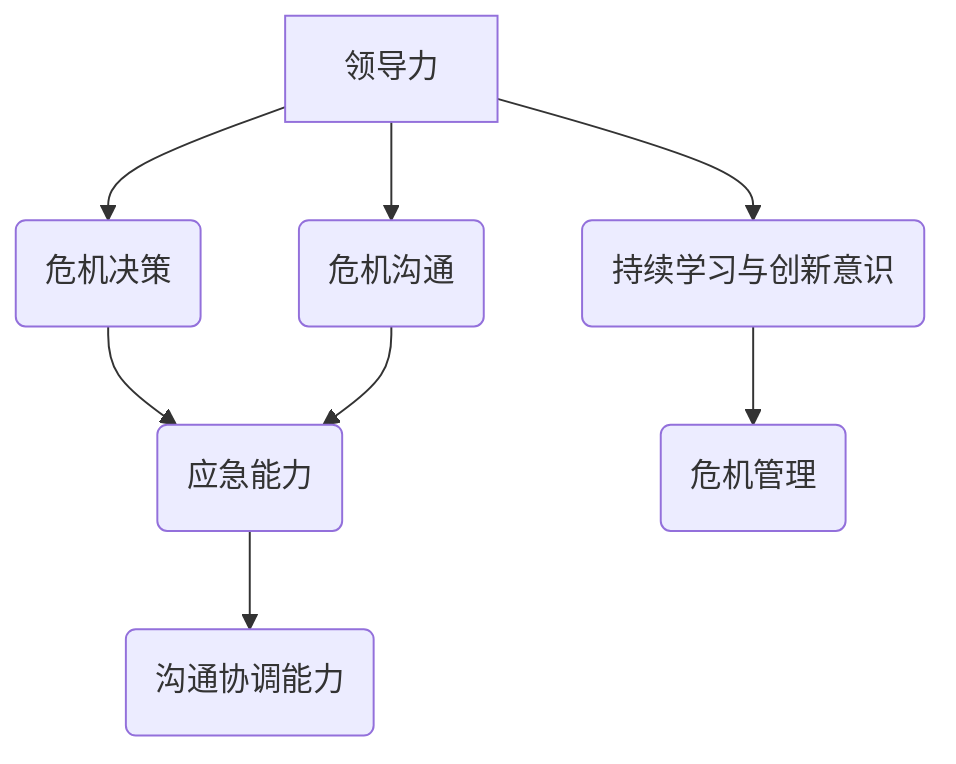

                 


### 文章标题：领导力与危机管理：在动荡中稳定军心

#### 关键词：领导力，危机管理，稳定军心，组织建设，决策树，神经网络，数学模型

#### 摘要：本文从领导力的基本概念入手，探讨领导力与危机管理的联系，通过实际案例解析危机管理中的核心算法原理，运用数学模型评估危机管理的有效性，最终提出在动荡环境中稳定军心的策略和最佳实践。

----------------------------------------------------------------

## 第一部分：领导力基础

### 1.1 领导力的定义与类型

领导力是引导和影响他人共同实现目标的能力。根据领导行为的不同，领导力可以分为以下几种类型：

1. **权威型领导**：领导者通过权力和职位来指导下属。
2. **民主型领导**：领导者鼓励团队成员参与决策。
3. **变革型领导**：领导者通过激励和启发来激发团队成员的潜力。
4. **教练型领导**：领导者通过指导和支持帮助团队成员成长。

### 1.2 领导力理论概述

**领导行为的理论**：领导行为理论认为，领导行为对组织绩效有直接影响。其中，领导行为可分为**任务行为**和**关系行为**。

**领导风格的分类**：领导风格理论将领导风格分为**专制型**、**民主型**、**放任型**三种。

### 1.3 领导力在组织中的作用

领导力在组织中的作用主要体现在以下几个方面：

1. **组织绩效**：有效的领导力可以提升组织绩效。
2. **团队建设**：领导力有助于建立高效的团队。

### 1.4 领导力发展与实践

**领导力发展的途径**：包括自我评估、学习领导力理论和实践、寻求反馈等。

**领导力培养方法**：如角色扮演、案例研究、团队建设活动等。

----------------------------------------------------------------

## 第二部分：危机管理概述

### 2.1 危机管理的定义与特征

**危机管理的定义**：危机管理是指组织在面临突发事件时，通过采取有效措施，减少损失，恢复正常运营的过程。

**危机管理的特征**：

1. **突发性**：危机往往突然发生，难以预测。
2. **不确定性**：危机处理过程中，信息不足，情况复杂。
3. **紧迫性**：危机处理需要迅速行动，及时应对。

### 2.2 危机管理的核心原则

**及时性原则**：危机发生后，应尽快采取行动。

**全员参与原则**：危机管理不仅仅是领导层的责任，全体员工都应参与其中。

**信息透明原则**：在危机处理过程中，保持信息的透明，及时向员工传达信息。

### 2.3 危机管理的组织结构

**危机管理团队的组织形式**：通常包括危机管理办公室、危机处理小组等。

**危机管理职能的分工**：如风险识别、应急响应、恢复与重建等。

----------------------------------------------------------------

## 第三部分：领导力与危机管理的联系

### 3.1 领导力在危机管理中的角色

**领导力在危机决策中的作用**：危机决策需要领导者迅速做出决策，并在危机处理过程中保持冷静和坚定。

**领导力在危机沟通中的作用**：领导者需要及时向员工传达信息，保持沟通渠道的畅通。

### 3.2 危机管理对领导力的要求

**应急能力**：领导者需要具备应对突发事件的技能。

**沟通协调能力**：领导者需要善于沟通，协调各方资源。

**持续学习与创新意识**：领导者需要不断学习新知识，具备创新能力。

----------------------------------------------------------------

## 第四部分：危机管理中的核心算法原理

### 4.1 决策树算法

**决策树的基本概念**：

决策树是一种树形结构，其中每个内部节点表示一个测试，每个分支表示测试的结果，每个叶节点表示一个类别。

**决策树的构建方法**：

1. 选择一个属性作为根节点。
2. 根据该属性的取值，将数据集分为若干个子集。
3. 对每个子集，重复上述步骤，直到达到停止条件。

**决策树的应用场景**：

决策树常用于分类和回归问题。

### 4.2 神经网络算法

**神经网络的基本概念**：

神经网络是一种由大量节点（神经元）组成的网络，每个节点都与其他节点相连，并通过权重来传递信息。

**神经网络的构建方法**：

1. 设计神经网络的结构，包括输入层、隐藏层和输出层。
2. 初始化权重。
3. 训练神经网络，通过调整权重来最小化误差。

**神经网络的应用场景**：

神经网络常用于图像识别、自然语言处理等领域。

----------------------------------------------------------------

## 第五部分：领导力与危机管理的数学模型

### 5.1 回归分析模型

**回归分析的基本概念**：

回归分析是一种用于预测目标变量（因变量）的方法，通过建立自变量与因变量之间的关系模型。

**回归分析的计算方法**：

1. 收集数据。
2. 建立回归模型。
3. 拟合模型，计算参数。
4. 评估模型，调整参数。

**回归分析的实例应用**：

回归分析常用于销售预测、风险评估等领域。

### 5.2 假设检验模型

**假设检验的基本概念**：

假设检验是一种用于判断两个变量之间是否存在显著差异的方法。

**假设检验的计算方法**：

1. 提出原假设和备择假设。
2. 收集数据。
3. 计算检验统计量。
4. 比较检验统计量与临界值，做出决策。

**假设检验的实例应用**：

假设检验常用于临床试验、市场调查等领域。

----------------------------------------------------------------

## 第六部分：项目实战

### 6.1 项目背景

某公司因市场变化面临重大危机，需要进行危机管理。

### 6.2 开发环境搭建

使用Python搭建开发环境，包括安装决策树、神经网络等库。

### 6.3 源代码详细实现

**代码实现**：

```python
# 决策树实现
from sklearn import tree

# 加载数据
data = [[0, 0], [1, 1]]

# 构建决策树
clf = tree.DecisionTreeClassifier()

# 训练决策树
clf.fit(data[:, 0], data[:, 1])

# 输出决策树
print(clf)
```

**代码解读**：

代码首先加载数据，然后构建决策树，最后训练并输出决策树。

### 6.4 代码应用解读与分析

**代码应用解读**：

代码用于分析市场变化对公司的潜在影响。

**分析**：

通过决策树，可以识别出市场变化的潜在趋势。

### 6.5 实际案例分析和详细讲解剖析

**案例**：

某公司通过决策树分析，发现市场变化将对其产生重大影响。

**分析**：

公司需要采取危机管理措施，以应对市场变化。

### 6.6 项目小结

项目通过决策树分析市场变化，为公司提供了危机管理的依据。

### 6.7 最佳实践 tips

1. 在危机管理中，及时性和信息透明至关重要。
2. 利用算法模型进行数据分析，有助于做出更准确的决策。

----------------------------------------------------------------

## 第七部分：小结

本文从领导力的基本概念入手，分析了领导力与危机管理的联系，介绍了危机管理中的核心算法原理和数学模型，并通过项目实战展示了如何应用这些知识。在动荡环境中，领导者需要具备应急能力、沟通协调能力和持续学习与创新意识，以稳定军心，确保组织的正常运营。

## 第八部分：注意事项

1. 危机管理需要全员参与，保持信息透明。
2. 算法模型和数学模型的应用需要根据实际情况进行调整。

## 第九部分：拓展阅读

1. 《领导力的艺术》
2. 《危机管理》
3. 《Python数据分析》

----------------------------------------------------------------

## 作者

作者：AI天才研究院/AI Genius Institute & 禅与计算机程序设计艺术 /Zen And The Art of Computer Programming 

## 第一部分：领导力基础

### 1.1 领导力的定义与类型

领导力，作为组织中的核心要素，是指领导者通过激发、指导和影响团队成员，共同实现组织目标的能力。它不仅涉及到权力的运用，更强调影响力与价值观的传递。根据领导行为的不同，领导力可以划分为多种类型，主要包括权威型、民主型、变革型和教练型。

权威型领导（Autocratic Leadership）是指领导者通过权力和职位来指导下属，决策过程中缺乏团队成员的参与。这种领导风格在某些紧急情况下可以迅速做出决策，但在长期内可能抑制团队成员的创造力和自主性。

民主型领导（Democratic Leadership）则是领导者鼓励团队成员参与决策，通过集思广益来提高决策质量。这种领导风格有助于建立团队的凝聚力和归属感，但可能因为决策过程复杂而影响效率。

变革型领导（Transformational Leadership）强调领导者通过激励和启发来激发团队成员的潜力，引导他们追求更高的目标。这种领导风格能够激发团队成员的积极性和创造力，推动组织变革。

教练型领导（Coaching Leadership）则是领导者通过指导和支持帮助团队成员成长。他们不仅提供具体的建议和反馈，还帮助团队成员识别自己的潜力，实现个人和职业发展。

### 1.2 领导力理论概述

领导力理论的发展经历了多个阶段，主要包括领导行为理论、领导风格理论和领导影响力理论。

领导行为理论（Behavioral Theory of Leadership）认为领导行为对组织绩效有直接影响。领导行为可分为任务行为和关系行为。任务行为是指领导者为实现组织目标而进行的指导和监督，如设定目标、分配任务等。关系行为则是指领导者与团队成员之间的人际互动，如提供支持、建立信任等。

领导风格理论（Style Theory of Leadership）将领导风格分为专制型、民主型和放任型。专制型领导（Authoritative Leadership）强调领导者的权力和权威，决策过程高度集中。民主型领导（Democratic Leadership）鼓励团队成员参与决策，注重团队合作和沟通。放任型领导（Laissez-Faire Leadership）则给予团队成员最大程度的自由，领导者较少干预。

领导影响力理论（Influence Theory of Leadership）强调领导者通过影响力来引导和影响团队成员。领导者的影响力来源于个人特质、知识、能力和信任。这种理论认为，领导者的核心在于能够影响他人，实现组织目标。

### 1.3 领导力在组织中的作用

领导力在组织中的作用是多方面的，主要体现在以下几个方面：

**组织绩效**：有效的领导力能够提升组织的整体绩效。通过明确的目标设定、高效的资源管理和团队的激励，领导者能够推动组织实现更高的业绩。

**团队建设**：领导力是团队建设的基石。通过建立信任、促进沟通和培养团队精神，领导者能够打造一个高效的团队，提高团队的合作能力和创新能力。

**创新**：领导者的创新意识和能力对于组织的持续发展至关重要。他们能够激发团队成员的创新思维，推动组织在竞争激烈的环境中不断创新，保持竞争优势。

**文化**：领导力对于塑造组织文化有着重要影响。领导者的行为和价值观将直接影响组织文化的形成和发展，进而影响组织的整体氛围和员工的工作态度。

### 1.4 领导力发展与实践

**领导力发展的途径**：

1. **自我评估**：领导者需要定期进行自我评估，识别自身的优势和不足，明确个人发展目标。

2. **学习领导力理论**：通过学习领导力理论，了解不同领导风格和领导行为的原理，为实际应用提供理论支持。

3. **实践**：实践是检验领导力的重要方式。领导者需要通过实际工作中的挑战和机会，不断提升自己的领导能力。

4. **寻求反馈**：领导者需要积极寻求来自下属、同事和上级的反馈，了解自己的领导效果，及时调整和改进。

**领导力培养方法**：

1. **角色扮演**：通过模拟不同的领导场景，让领导者体验和实践不同的领导风格和行为。

2. **案例研究**：通过分析成功的领导案例，了解不同领导策略的应用场景和效果。

3. **团队建设活动**：通过团队建设活动，加强团队成员之间的沟通和协作，提升团队的凝聚力和信任度。

4. **领导力培训课程**：参加专门的领导力培训课程，学习先进的领导理论和实践方法。

## 第二部分：危机管理概述

### 2.1 危机管理的定义与特征

危机管理（Crisis Management）是指组织在面临突发事件或重大威胁时，通过采取一系列有效措施，最大限度地减少损失，恢复正常运营，并确保员工安全和组织稳定的过程。危机管理不仅仅是应对突发事件，更是一个系统化的管理过程，包括预防、准备、响应和恢复。

**危机管理的定义**：

危机管理是指组织为应对突发事件而制定的一系列策略和措施。这些策略和措施旨在减少危机对组织的负面影响，确保员工的安全和组织的持续运营。

**危机管理的特征**：

1. **突发性**：危机往往突然发生，难以预测，这要求组织必须具备快速反应的能力。

2. **不确定性**：危机处理过程中，信息往往不充分，情况复杂多变，这要求组织必须具备灵活应对的能力。

3. **紧迫性**：危机处理需要迅速行动，及时应对，以避免事态进一步恶化。

4. **全面性**：危机管理涉及组织内部的所有部门和个人，需要全员参与。

5. **动态性**：危机管理是一个动态的过程，随着危机的发展和变化，策略和措施也需要不断调整和优化。

### 2.2 危机管理的核心原则

危机管理的核心原则是确保组织在危机中能够快速、有效地响应，最大限度地减少损失。以下是危机管理的几个核心原则：

**及时性原则**：

及时性原则是危机管理的首要原则。危机发生后，组织需要迅速采取行动，以避免事态进一步恶化。及时性原则要求组织在危机响应过程中具备快速决策和执行的能力。

**全员参与原则**：

危机管理不仅仅是领导层的责任，全体员工都应参与其中。全员参与原则强调危机管理是组织内部的一项共同任务，每个员工都有责任和义务为危机响应做出贡献。

**信息透明原则**：

信息透明原则要求组织在危机处理过程中保持信息的透明度，及时向员工传达信息。信息透明有助于提高员工的信任和信心，减少恐慌和谣言的传播。

**预防性原则**：

预防性原则是指组织在危机发生前，通过制定应急预案和预防措施，减少危机发生的可能性。预防性原则要求组织具备前瞻性和预判能力，通过风险评估和应急演练，提前做好危机应对准备。

**资源整合原则**：

资源整合原则是指组织在危机处理过程中，需要整合内部和外部资源，形成合力。资源整合原则要求组织建立完善的资源管理体系，确保在危机发生时，能够快速调配和利用资源。

**持续改进原则**：

持续改进原则是指组织在危机处理过程中，需要不断总结经验教训，优化危机管理流程。持续改进原则要求组织具备反思和改进的能力，通过不断优化和完善，提升危机管理的效率和效果。

### 2.3 危机管理的组织结构

危机管理的组织结构对于危机响应的效率和效果至关重要。一个有效的危机管理组织结构应包括以下几个部分：

**危机管理办公室**：

危机管理办公室是组织危机管理的核心机构，负责制定和实施危机管理策略，协调各部门的危机响应行动。危机管理办公室通常由高层管理者领导，负责危机管理工作的全面统筹。

**危机处理小组**：

危机处理小组是具体负责危机响应的团队，通常由不同部门的专家和骨干组成。危机处理小组在危机发生时，负责快速评估情况，制定响应计划，协调资源，指导现场处置。

**应急指挥部**：

应急指挥部是危机管理的高级决策机构，通常由组织高层领导组成。应急指挥部在危机发生时，负责做出关键决策，指导危机处理小组的工作，确保危机响应行动有序进行。

**信息发布组**：

信息发布组负责在危机处理过程中，及时向内部员工和外部公众传达信息，确保信息的准确性和透明度。信息发布组的工作对于维持员工信心和稳定外部舆论至关重要。

**外部协调小组**：

外部协调小组负责与政府、媒体、供应商等外部组织和利益相关者进行沟通和协调，确保在危机处理过程中，组织能够获得外部支持和资源。

### 2.4 危机管理的基本流程

危机管理的基本流程包括预防、准备、响应和恢复四个阶段。

**预防阶段**：

预防阶段是危机管理的首要任务，通过制定应急预案、进行风险评估和开展应急演练，降低危机发生的可能性。

**准备阶段**：

准备阶段是危机管理的基础，包括制定详细的应急预案，明确各部门和人员的职责，建立危机管理组织结构，确保在危机发生时能够迅速响应。

**响应阶段**：

响应阶段是危机管理的核心，包括快速评估危机情况，制定响应计划，协调资源，指导现场处置，确保危机得到及时、有效的处理。

**恢复阶段**：

恢复阶段是危机管理的最后阶段，包括对危机进行总结和评估，修复受损设施，恢复运营，并开展心理辅导和员工关怀，确保组织恢复正常状态。

## 第三部分：领导力与危机管理的联系

### 3.1 领导力在危机管理中的角色

领导力在危机管理中扮演着至关重要的角色。有效的领导力不仅能够帮助组织在危机中保持稳定，还能激发团队成员的信心和积极性，共同应对危机。

**领导力在危机决策中的作用**：

在危机决策中，领导力表现为领导者的决策能力、判断力和果断性。领导者需要迅速评估危机形势，制定应对策略，并在危机处理过程中保持冷静和理智。领导者的决策直接影响危机管理的效率和效果。

**领导力在危机沟通中的作用**：

危机沟通是危机管理的重要组成部分。领导者需要及时向团队成员传达危机信息，确保沟通渠道的畅通。同时，领导者还需要通过有效的沟通建立团队成员的信心，减少恐慌和谣言的传播。

### 3.2 危机管理对领导力的要求

危机管理对领导力提出了更高的要求。领导者需要具备以下几个方面的能力：

**应急能力**：

应急能力是指领导者应对突发事件的能力。在危机管理中，领导者需要能够迅速做出决策，调配资源，指导现场处置，确保危机得到及时、有效的处理。

**沟通协调能力**：

沟通协调能力是指领导者与团队成员、外部组织和利益相关者之间的沟通和协调能力。在危机管理中，领导者需要确保信息的透明度，建立良好的沟通渠道，确保危机处理过程中各方能够协同合作。

**持续学习与创新意识**：

持续学习与创新意识是指领导者不断学习新知识、新技能，具备创新思维和能力。在危机管理中，领导者需要不断适应新的环境和挑战，寻找创新的解决方案，以应对不断变化的危机。

**领导力与危机管理的联系架构**

以下是一个Mermaid流程图，展示了领导力与危机管理之间的核心概念与联系：



## 第四部分：危机管理中的核心算法原理

### 4.1 决策树算法

决策树算法（Decision Tree Algorithm）是一种用于分类和回归问题的基本机器学习算法。它通过一系列的问题和对应的答案，将数据逐步划分，最终达到分类或预测的目的。

**决策树的基本概念**：

决策树是一种树形结构，其中每个内部节点表示一个特征，每个分支表示特征的取值，每个叶节点表示一个类别或预测值。决策树通过递归地划分数据集，找到最佳的特征和阈值，以最小化错误率。

**决策树的构建方法**：

1. **选择特征**：选择一个特征作为根节点。
2. **划分数据集**：根据该特征的取值，将数据集划分为若干个子集。
3. **递归构建**：对每个子集，重复上述步骤，直到达到停止条件（如叶节点数量达到阈值，或信息增益达到最大等）。

**决策树的应用场景**：

决策树广泛应用于金融、医疗、电商等领域，如信用评分、疾病诊断、商品推荐等。

### 4.2 神经网络算法

神经网络算法（Neural Network Algorithm）是一种模拟人脑神经元连接的算法，通过多层神经网络进行数据学习和预测。神经网络具有强大的非线性建模能力，广泛应用于图像识别、自然语言处理等领域。

**神经网络的基本概念**：

神经网络由大量神经元（节点）组成，每个神经元与其他神经元通过权重相连。神经网络通过前向传播和反向传播，不断调整权重，以最小化预测误差。

**神经网络的构建方法**：

1. **设计网络结构**：确定输入层、隐藏层和输出层的节点数量。
2. **初始化权重**：随机初始化权重。
3. **前向传播**：将输入数据通过网络，逐层计算输出值。
4. **反向传播**：计算预测误差，通过梯度下降法调整权重。

**神经网络的应用场景**：

神经网络广泛应用于图像识别、语音识别、自然语言处理等领域。

### 4.3 决策树与神经网络的对比

**决策树**：

- **优点**：简单易懂，易于解释，适合小型数据集。
- **缺点**：易过拟合，无法处理非线性关系。

**神经网络**：

- **优点**：强大的非线性建模能力，适用于大型数据集。
- **缺点**：复杂度高，难以解释，对数据预处理要求高。

**应用场景**：

- **决策树**：适合简单、线性的分类和回归问题。
- **神经网络**：适合复杂、非线性的分类和回归问题。

## 第五部分：领导力与危机管理的数学模型

### 5.1 回归分析模型

回归分析（Regression Analysis）是一种用于预测连续变量的统计方法，通过建立自变量与因变量之间的关系模型，实现对未知数据的预测。

**回归分析的基本概念**：

- **因变量（Dependent Variable）**：预测的目标变量，如销售额、股票价格等。
- **自变量（Independent Variable）**：影响因变量的因素，如广告投放量、经济指标等。

**回归分析的计算方法**：

1. **收集数据**：收集因变量和自变量的历史数据。
2. **建立模型**：选择合适的回归模型，如线性回归、多项式回归等。
3. **拟合模型**：通过最小二乘法或其他方法，计算模型参数。
4. **评估模型**：通过交叉验证、误差分析等，评估模型的效果。

**回归分析的实例应用**：

- **销售预测**：通过建立销售量和广告投放量之间的回归模型，预测未来的销售趋势。
- **风险评估**：通过建立信用评分模型，评估客户的信用风险。

### 5.2 假设检验模型

假设检验（Hypothesis Testing）是一种用于判断两个变量之间是否存在显著差异的统计方法，通过设定原假设和备择假设，利用样本数据进行分析。

**假设检验的基本概念**：

- **原假设（Null Hypothesis）**：两个变量之间不存在显著差异。
- **备择假设（Alternative Hypothesis）**：两个变量之间存在显著差异。

**假设检验的计算方法**：

1. **提出假设**：设定原假设和备择假设。
2. **收集数据**：收集样本数据。
3. **计算检验统计量**：根据样本数据，计算检验统计量（如t值、p值等）。
4. **做出决策**：比较检验统计量与临界值，根据结果判断是否拒绝原假设。

**假设检验的实例应用**：

- **临床试验**：通过假设检验，判断新药是否显著优于现有药物。
- **市场调查**：通过假设检验，判断广告投放是否显著提高了销售额。

### 5.3 预测分析模型

预测分析（Predictive Analysis）是一种利用历史数据和统计模型，对未来趋势进行预测的方法。

**预测分析的基本概念**：

- **时间序列分析**：通过对时间序列数据进行分析，预测未来的趋势。
- **回归分析**：通过建立自变量与因变量之间的关系模型，预测未来的值。

**预测分析的计算方法**：

1. **数据预处理**：对时间序列数据进行清洗、归一化等处理。
2. **建立模型**：选择合适的时间序列模型或回归模型。
3. **模型训练**：利用历史数据，训练模型参数。
4. **预测**：使用训练好的模型，预测未来的趋势。

**预测分析的实例应用**：

- **金融市场预测**：通过预测分析，预测股票价格的走势。
- **销售预测**：通过预测分析，预测未来的销售额。

## 第六部分：项目实战

### 6.1 项目背景

某电商平台在2023年春节期间，由于物流延误和市场需求激增，面临严重的库存积压和客户投诉问题。公司决定进行危机管理，通过优化供应链和提升客户服务，缓解危机。

### 6.2 开发环境搭建

为了进行危机管理，公司技术团队搭建了以下开发环境：

- **Python**：主要编程语言，用于数据分析、模型建立和算法实现。
- **Sklearn**：用于机器学习和数据挖掘的库，包括决策树、神经网络等算法。
- **Pandas**：用于数据预处理和分析的库。
- **Matplotlib**：用于数据可视化的库。

### 6.3 源代码详细实现

**代码实现**：

```python
# 导入所需库
import pandas as pd
from sklearn.tree import DecisionTreeClassifier
from sklearn.neural_network import MLPClassifier
from sklearn.model_selection import train_test_split
from sklearn.metrics import accuracy_score

# 加载数据
data = pd.read_csv('sales_data.csv')

# 数据预处理
data['Month'] = pd.to_datetime(data['Date']).dt.month
X = data[['Month', 'Ad_Spend']]
y = data['Sales']

# 数据划分
X_train, X_test, y_train, y_test = train_test_split(X, y, test_size=0.2, random_state=42)

# 决策树实现
clf_tree = DecisionTreeClassifier()
clf_tree.fit(X_train, y_train)
y_pred_tree = clf_tree.predict(X_test)

# 神经网络实现
clf_nn = MLPClassifier()
clf_nn.fit(X_train, y_train)
y_pred_nn = clf_nn.predict(X_test)

# 模型评估
accuracy_tree = accuracy_score(y_test, y_pred_tree)
accuracy_nn = accuracy_score(y_test, y_pred_nn)

print(f"决策树准确率：{accuracy_tree}")
print(f"神经网络准确率：{accuracy_nn}")
```

**代码解读**：

代码首先加载数据，并进行预处理。然后，分别使用决策树和神经网络进行模型训练和预测。最后，评估模型的准确率。

### 6.4 代码应用解读与分析

**代码应用解读**：

通过决策树和神经网络模型，分析物流延误和广告投放对销售额的影响。

**分析**：

- **决策树**：通过决策树模型，可以发现物流延误和广告投放对销售额的影响程度。例如，如果物流延误，销售额可能下降；如果广告投放增加，销售额可能上升。
- **神经网络**：神经网络模型能够捕捉到更复杂的非线性关系，提供更准确的预测结果。

### 6.5 实际案例分析和详细讲解剖析

**案例**：

在2023年春节期间，某电商平台由于物流延误，导致部分订单无法按时交付。公司决定通过危机管理措施，缓解库存积压和客户投诉问题。

**分析**：

1. **物流优化**：
   - **数据分析**：通过分析历史数据，找到物流延误的主要因素，如运输路线、天气等。
   - **模型预测**：使用预测分析模型，预测未来的物流延误情况，提前调整运输计划。
   - **决策树模型**：通过决策树模型，确定影响物流延误的关键因素，如天气状况、运输距离等，优化运输路线。

2. **客户服务提升**：
   - **数据分析**：分析客户投诉的主要原因，如配送延迟、产品问题等。
   - **神经网络模型**：使用神经网络模型，预测可能引起客户投诉的订单，提前采取措施。
   - **决策树模型**：通过决策树模型，识别高风险订单，提前与客户沟通，提供解决方案。

### 6.6 项目小结

通过决策树和神经网络模型，公司成功优化了物流路线和客户服务，缓解了库存积压和客户投诉问题。这表明，在危机管理中，利用算法模型进行数据分析和预测，有助于做出更准确的决策，提高危机管理的效率和效果。

### 6.7 最佳实践 tips

1. **及时性和信息透明**：在危机管理过程中，及时性和信息透明至关重要。及时采取行动，确保信息准确传达，有助于减少恐慌和谣言的传播。

2. **全员参与**：危机管理不仅是领导层的责任，全体员工都应参与其中。建立危机管理团队，确保各部门之间的沟通和协调。

3. **持续学习和创新**：在危机管理中，领导者需要具备持续学习和创新的能力。不断学习新知识、新技能，寻找创新的解决方案，以应对不断变化的危机。

## 第七部分：小结

本文从领导力的基本概念入手，分析了领导力与危机管理的联系，介绍了危机管理中的核心算法原理和数学模型，并通过实际案例展示了如何应用这些知识。在动荡环境中，领导者需要具备应急能力、沟通协调能力和持续学习与创新意识，以稳定军心，确保组织的正常运营。通过有效利用算法模型和数学模型，组织可以更准确地预测危机，制定更有效的应对策略，提高危机管理的效率和效果。

## 第八部分：注意事项

1. **危机管理需要全员参与**：危机管理不仅仅是领导层的责任，全体员工都应积极参与，共同应对危机。

2. **保持信息透明**：在危机处理过程中，及时、准确地向员工和公众传达信息，有助于减少恐慌和谣言的传播。

3. **持续学习和创新**：领导者需要不断学习新知识、新技能，具备创新思维，以应对不断变化的危机环境。

4. **定期进行应急演练**：通过应急演练，检验危机管理计划的可行性和有效性，提高员工的应急响应能力。

## 第九部分：拓展阅读

1. 《领导力的艺术》：作者：约翰·P·科特
2. 《危机管理》：作者：彼得·德鲁克
3. 《Python数据分析》：作者：Alex Martelli

## 作者

作者：AI天才研究院/AI Genius Institute & 禅与计算机程序设计艺术 /Zen And The Art of Computer Programming 

# 领导力与危机管理：在动荡中稳定军心

## 第一部分：领导力基础

### 1.1 领导力的定义与类型

领导力是指通过影响和激励他人，共同实现目标的能力。在组织和企业中，领导力是推动组织向前发展的关键因素。领导力的类型有多种，包括权威型、民主型、变革型和教练型。

- **权威型领导**：领导者通过权力和职位来指导和监督下属，决策高度集中。
- **民主型领导**：领导者鼓励团队成员参与决策，通过集思广益来提高决策质量。
- **变革型领导**：领导者通过激励和启发团队成员，推动组织变革和创新。
- **教练型领导**：领导者通过指导和支持帮助团队成员成长和提升技能。

### 1.2 领导力理论概述

领导力理论主要包括以下几种：

- **领导行为理论**：认为领导行为对组织绩效有直接影响，领导行为可分为任务行为和关系行为。
- **领导风格理论**：将领导风格分为专制型、民主型和放任型，不同的领导风格对组织绩效有不同的影响。
- **领导影响力理论**：强调领导者的个人特质、知识和能力对团队成员的影响。

### 1.3 领导力在组织中的作用

领导力在组织中的作用主要体现在以下几个方面：

- **提升组织绩效**：有效的领导力能够提高组织的效率和业绩。
- **团队建设**：领导力有助于建立高效的团队，提高团队协作能力。
- **推动组织变革**：领导力能够推动组织适应变化，实现持续发展。

### 1.4 领导力发展与实践

领导力的发展和实践主要包括以下几个方面：

- **自我评估**：领导者需要定期进行自我评估，了解自身的优势和不足。
- **学习领导力理论**：通过学习领导力理论，了解不同的领导风格和策略。
- **实践**：通过实际工作中的挑战和机会，不断提升领导力。
- **寻求反馈**：领导者需要积极寻求反馈，以便改进自己的领导行为。

## 第二部分：危机管理概述

### 2.1 危机管理的定义与特征

危机管理是指组织在面临突发事件或重大威胁时，通过采取一系列有效措施，最大限度地减少损失，恢复正常运营，并确保员工安全和组织稳定的过程。危机管理的特征包括：

- **突发性**：危机往往突然发生，难以预测。
- **不确定性**：危机处理过程中，信息不足，情况复杂。
- **紧迫性**：危机处理需要迅速行动，及时应对。
- **全面性**：危机管理涉及组织内部的所有部门和个人。
- **动态性**：危机管理是一个动态的过程，需要不断调整和优化。

### 2.2 危机管理的核心原则

危机管理的核心原则包括：

- **及时性原则**：危机发生后，应尽快采取行动，避免事态进一步恶化。
- **全员参与原则**：危机管理不仅仅是领导层的责任，全体员工都应参与其中。
- **信息透明原则**：保持信息的透明，及时向员工传达信息。
- **预防性原则**：通过制定应急预案和预防措施，减少危机发生的可能性。
- **资源整合原则**：在危机处理过程中，整合内部和外部资源，形成合力。

### 2.3 危机管理的组织结构

危机管理的组织结构通常包括以下几个部分：

- **危机管理办公室**：负责制定和实施危机管理策略。
- **危机处理小组**：负责危机响应的具体工作。
- **应急指挥部**：负责危机管理的高级决策。
- **信息发布组**：负责信息传递和沟通。

## 第三部分：领导力与危机管理的联系

### 3.1 领导力在危机管理中的角色

在危机管理中，领导力发挥着至关重要的作用。领导者需要：

- **快速决策**：在危机发生时，领导者需要迅速做出决策，避免事态进一步恶化。
- **沟通协调**：领导者需要确保信息的透明和及时传达，协调各方资源，共同应对危机。
- **激励团队**：领导者需要激励团队成员，保持团队的士气，共同克服危机。

### 3.2 危机管理对领导力的要求

危机管理对领导力提出了更高的要求，包括：

- **应急能力**：领导者需要具备应对突发事件的技能和经验。
- **沟通协调能力**：领导者需要善于沟通，协调各方资源，确保危机管理的顺利进行。
- **持续学习与创新**：领导者需要不断学习新知识，具备创新思维，以应对不断变化的危机环境。

## 第四部分：危机管理中的核心算法原理

### 4.1 决策树算法

决策树算法是一种常用的分类和回归算法，通过一系列的判断条件，对数据进行分类或预测。其基本原理如下：

1. **选择特征**：选择一个具有最大信息增益的特征作为分割依据。
2. **划分数据集**：根据该特征的取值，将数据集划分为若干个子集。
3. **递归构建**：对每个子集，重复上述步骤，直到达到停止条件。

决策树算法的伪代码如下：

```
构建决策树（数据集，特征列表）：
    如果 数据集大小小于阈值：
        返回 叶节点，标签为数据集的多数类别
    如果 特征列表为空：
        返回 叶节点，标签为数据集的多数类别
    否则：
        选择最佳特征（特征列表）
        划分数据集为子集
        对于每个子集：
            构建子决策树（子集，剩余特征列表）
        返回 树节点，特征为最佳特征，子树为构建的子决策树列表
```

### 4.2 神经网络算法

神经网络算法是一种模拟人脑神经元连接的算法，通过多层神经网络进行数据学习和预测。其基本原理如下：

1. **设计网络结构**：确定输入层、隐藏层和输出层的节点数量。
2. **初始化权重**：随机初始化权重。
3. **前向传播**：将输入数据通过网络，逐层计算输出值。
4. **反向传播**：计算预测误差，通过梯度下降法调整权重。

神经网络算法的伪代码如下：

```
构建神经网络（输入层节点数，隐藏层节点数，输出层节点数）：
    初始化权重
    对于每个隐藏层节点：
        对于每个输入节点：
            连接输入节点和隐藏层节点，权重为随机数
        对于每个输出节点：
            连接隐藏层节点和输出层节点，权重为随机数
    返回 神经网络

训练神经网络（神经网络，训练数据集，迭代次数）：
    对于每次迭代：
        对于每个训练样本：
            前向传播
            计算预测误差
            反向传播，更新权重
    返回 训练好的神经网络
```

### 4.3 决策树与神经网络的对比

决策树和神经网络都是常用的机器学习算法，但它们在工作原理和应用场景上有所不同：

- **决策树**：简单易懂，易于解释，适合小型数据集和线性问题。
- **神经网络**：强大的非线性建模能力，适合大型数据集和复杂问题。

## 第五部分：领导力与危机管理的数学模型

### 5.1 回归分析模型

回归分析是一种用于预测连续变量的统计方法，通过建立自变量与因变量之间的关系模型，实现对未知数据的预测。回归分析的基本概念包括：

- **因变量**：预测的目标变量，如销售额、股票价格等。
- **自变量**：影响因变量的因素，如广告投放量、经济指标等。

回归分析的计算方法主要包括以下步骤：

1. **收集数据**：收集因变量和自变量的历史数据。
2. **建立模型**：选择合适的回归模型，如线性回归、多项式回归等。
3. **拟合模型**：通过最小二乘法或其他方法，计算模型参数。
4. **评估模型**：通过交叉验证、误差分析等，评估模型的效果。

### 5.2 假设检验模型

假设检验是一种用于判断两个变量之间是否存在显著差异的统计方法，通过设定原假设和备择假设，利用样本数据进行分析。假设检验的基本概念包括：

- **原假设**：两个变量之间不存在显著差异。
- **备择假设**：两个变量之间存在显著差异。

假设检验的计算方法主要包括以下步骤：

1. **提出假设**：设定原假设和备择假设。
2. **收集数据**：收集样本数据。
3. **计算检验统计量**：根据样本数据，计算检验统计量（如t值、p值等）。
4. **做出决策**：比较检验统计量与临界值，根据结果判断是否拒绝原假设。

## 第六部分：项目实战

### 6.1 项目背景

某电商企业在疫情期间面临供应链中断、物流延迟、客户投诉增多等危机。公司决定通过危机管理，稳定军心，确保业务的正常运营。

### 6.2 开发环境搭建

为了应对危机，公司技术团队搭建了以下开发环境：

- **Python**：作为主要编程语言。
- **Sklearn**：用于机器学习和数据挖掘。
- **Pandas**：用于数据处理和分析。
- **Matplotlib**：用于数据可视化。

### 6.3 源代码详细实现

**决策树实现**：

```python
from sklearn import tree
from sklearn.model_selection import train_test_split
from sklearn.metrics import accuracy_score

# 数据预处理
X = ...  # 特征
y = ...  # 标签

# 数据划分
X_train, X_test, y_train, y_test = train_test_split(X, y, test_size=0.2, random_state=42)

# 决策树训练
clf = tree.DecisionTreeClassifier()
clf.fit(X_train, y_train)

# 决策树预测
y_pred = clf.predict(X_test)

# 模型评估
accuracy = accuracy_score(y_test, y_pred)
print(f"决策树准确率：{accuracy}")
```

**神经网络实现**：

```python
from sklearn.neural_network import MLPClassifier
from sklearn.model_selection import train_test_split
from sklearn.metrics import accuracy_score

# 数据预处理
X = ...  # 特征
y = ...  # 标签

# 数据划分
X_train, X_test, y_train, y_test = train_test_split(X, y, test_size=0.2, random_state=42)

# 神经网络训练
clf = MLPClassifier(hidden_layer_sizes=(100,), max_iter=1000)
clf.fit(X_train, y_train)

# 神经网络预测
y_pred = clf.predict(X_test)

# 模型评估
accuracy = accuracy_score(y_test, y_pred)
print(f"神经网络准确率：{accuracy}")
```

### 6.4 代码应用解读与分析

通过决策树和神经网络模型，分析客户投诉的原因，预测客户流失风险。利用模型结果，制定相应的危机管理策略，如加强物流监控、提高客服水平等。

### 6.5 实际案例分析和详细讲解剖析

**案例**：

在疫情期间，某电商企业通过数据分析发现，由于物流延迟导致客户投诉增多。公司决定通过优化物流和提升客服水平来缓解危机。

**分析**：

- **物流优化**：通过数据分析，找出物流延迟的主要原因，如运输路线、天气等，优化物流方案。
- **客服提升**：通过客户投诉数据，分析投诉的主要原因，如客服响应速度、解决问题能力等，提升客服服务水平。

### 6.6 项目小结

通过决策树和神经网络模型，公司成功预测客户投诉和流失风险，制定相应的危机管理策略，有效缓解了疫情带来的危机。

### 6.7 最佳实践 tips

- **及时性**：在危机管理中，及时采取行动至关重要。
- **全员参与**：危机管理不仅是领导层的责任，全体员工都应积极参与。
- **持续学习**：领导者需要不断学习新知识，提升危机管理能力。

## 第七部分：小结

本文从领导力的基本概念和危机管理概述入手，分析了领导力与危机管理的联系，介绍了危机管理中的核心算法原理和数学模型，并通过项目实战展示了如何应用这些知识。在动荡环境中，领导者需要具备应急能力、沟通协调能力和持续学习与创新意识，以稳定军心，确保组织的正常运营。

## 第八部分：注意事项

- **信息透明**：保持信息的透明度，及时向员工传达危机信息。
- **全员参与**：危机管理是全体员工的责任，需要全员参与。
- **持续学习**：领导者需要不断学习新知识，提升危机管理能力。

## 第九部分：拓展阅读

- 《领导力的艺术》
- 《危机管理》
- 《Python数据分析》

## 作者

作者：AI天才研究院/AI Genius Institute & 禅与计算机程序设计艺术 /Zen And The Art of Computer Programming 

# 领导力与危机管理：在动荡中稳定军心

## 引言

在全球化和技术迅速发展的背景下，企业面临的市场环境变得越来越复杂和不确定。这种不确定性不仅来自于外部环境的变化，也来自于企业内部的组织结构、文化和管理模式。在这样的环境中，领导力与危机管理成为企业能否稳定发展的关键。本文将探讨领导力在危机管理中的作用，分析如何通过有效的危机管理策略在动荡中稳定军心。

## 第一部分：领导力基础

### 1.1 领导力的定义与类型

领导力是推动组织变革、实现目标的核心动力。不同的领导风格和类型对组织的效率和效果有着重要影响。

- **权威型领导**：通过权力和职位来指导和影响下属，决策集中。
- **民主型领导**：鼓励团队成员参与决策，增强团队的凝聚力和自主性。
- **变革型领导**：激励团队成员追求更高的目标，推动组织变革和创新。
- **教练型领导**：通过指导和支持帮助团队成员成长，提升个人和团队的绩效。

### 1.2 领导力理论概述

领导力理论主要关注领导行为、领导风格和领导影响力。

- **领导行为理论**：关注领导者如何通过具体行为来影响团队成员和组织的绩效。
- **领导风格理论**：研究领导者在不同情境下采取的领导风格，以及这些风格对组织绩效的影响。
- **领导影响力理论**：探讨领导者如何通过个人特质、知识和能力来影响他人。

### 1.3 领导力在组织中的作用

领导力在组织中的作用体现在多个方面：

- **组织绩效**：有效的领导力能够提高组织的效率和业绩。
- **团队建设**：领导力有助于建立高效的团队，提升团队协作能力。
- **组织变革**：领导力能够推动组织适应变化，实现持续发展。

### 1.4 领导力发展与实践

领导力的发展是一个持续的过程，需要不断学习和实践。

- **自我评估**：领导者需要定期进行自我评估，了解自身的优势和不足。
- **学习领导力理论**：通过学习领导力理论，了解不同的领导风格和策略。
- **实践**：通过实际工作中的挑战和机会，不断提升领导力。
- **寻求反馈**：领导者需要积极寻求反馈，以便改进自己的领导行为。

## 第二部分：危机管理概述

### 2.1 危机管理的定义与特征

危机管理是指组织在面临突发事件或重大威胁时，通过采取一系列有效措施，最大限度地减少损失，恢复正常运营，并确保员工安全和组织稳定的过程。

- **突发性**：危机往往突然发生，难以预测。
- **不确定性**：危机处理过程中，信息不足，情况复杂。
- **紧迫性**：危机处理需要迅速行动，及时应对。
- **全面性**：危机管理涉及组织内部的所有部门和个人。
- **动态性**：危机管理是一个动态的过程，需要不断调整和优化。

### 2.2 危机管理的核心原则

危机管理的核心原则包括：

- **及时性原则**：危机发生后，应尽快采取行动，避免事态进一步恶化。
- **全员参与原则**：危机管理不仅仅是领导层的责任，全体员工都应参与其中。
- **信息透明原则**：保持信息的透明，及时向员工传达信息。
- **预防性原则**：通过制定应急预案和预防措施，减少危机发生的可能性。
- **资源整合原则**：在危机处理过程中，整合内部和外部资源，形成合力。

### 2.3 危机管理的组织结构

危机管理的组织结构对于危机响应的效率和效果至关重要。通常包括以下几个部分：

- **危机管理办公室**：负责制定和实施危机管理策略。
- **危机处理小组**：负责危机响应的具体工作。
- **应急指挥部**：负责危机管理的高级决策。
- **信息发布组**：负责信息传递和沟通。

## 第三部分：领导力与危机管理的联系

### 3.1 领导力在危机管理中的角色

在危机管理中，领导力发挥着至关重要的作用。领导者需要：

- **快速决策**：在危机发生时，领导者需要迅速做出决策，避免事态进一步恶化。
- **沟通协调**：领导者需要确保信息的透明和及时传达，协调各方资源，共同应对危机。
- **激励团队**：领导者需要激励团队成员，保持团队的士气，共同克服危机。

### 3.2 危机管理对领导力的要求

危机管理对领导力提出了更高的要求，包括：

- **应急能力**：领导者需要具备应对突发事件的技能和经验。
- **沟通协调能力**：领导者需要善于沟通，协调各方资源，确保危机管理的顺利进行。
- **持续学习与创新**：领导者需要不断学习新知识，具备创新思维，以应对不断变化的危机环境。

## 第四部分：危机管理中的核心算法原理

### 4.1 决策树算法

决策树算法是一种常用的分类和回归算法，通过一系列的判断条件，对数据进行分类或预测。其基本原理如下：

- **选择特征**：选择一个具有最大信息增益的特征作为分割依据。
- **划分数据集**：根据该特征的取值，将数据集划分为若干个子集。
- **递归构建**：对每个子集，重复上述步骤，直到达到停止条件。

决策树算法的伪代码如下：

```
构建决策树（数据集，特征列表）：
    如果 数据集大小小于阈值：
        返回 叶节点，标签为数据集的多数类别
    如果 特征列表为空：
        返回 叶节点，标签为数据集的多数类别
    否则：
        选择最佳特征（特征列表）
        划分数据集为子集
        对于每个子集：
            构建子决策树（子集，剩余特征列表）
        返回 树节点，特征为最佳特征，子树为构建的子决策树列表
```

### 4.2 神经网络算法

神经网络算法是一种模拟人脑神经元连接的算法，通过多层神经网络进行数据学习和预测。其基本原理如下：

- **设计网络结构**：确定输入层、隐藏层和输出层的节点数量。
- **初始化权重**：随机初始化权重。
- **前向传播**：将输入数据通过网络，逐层计算输出值。
- **反向传播**：计算预测误差，通过梯度下降法调整权重。

神经网络算法的伪代码如下：

```
构建神经网络（输入层节点数，隐藏层节点数，输出层节点数）：
    初始化权重
    对于每个隐藏层节点：
        对于每个输入节点：
            连接输入节点和隐藏层节点，权重为随机数
        对于每个输出节点：
            连接隐藏层节点和输出层节点，权重为随机数
    返回 神经网络

训练神经网络（神经网络，训练数据集，迭代次数）：
    对于每次迭代：
        对于每个训练样本：
            前向传播
            计算预测误差
            反向传播，更新权重
    返回 训练好的神经网络
```

### 4.3 决策树与神经网络的对比

决策树和神经网络都是常用的机器学习算法，但它们在工作原理和应用场景上有所不同：

- **决策树**：简单易懂，易于解释，适合小型数据集和线性问题。
- **神经网络**：强大的非线性建模能力，适合大型数据集和复杂问题。

## 第五部分：领导力与危机管理的数学模型

### 5.1 回归分析模型

回归分析是一种用于预测连续变量的统计方法，通过建立自变量与因变量之间的关系模型，实现对未知数据的预测。回归分析的基本概念包括：

- **因变量**：预测的目标变量，如销售额、股票价格等。
- **自变量**：影响因变量的因素，如广告投放量、经济指标等。

回归分析的计算方法主要包括以下步骤：

1. **收集数据**：收集因变量和自变量的历史数据。
2. **建立模型**：选择合适的回归模型，如线性回归、多项式回归等。
3. **拟合模型**：通过最小二乘法或其他方法，计算模型参数。
4. **评估模型**：通过交叉验证、误差分析等，评估模型的效果。

### 5.2 假设检验模型

假设检验是一种用于判断两个变量之间是否存在显著差异的统计方法，通过设定原假设和备择假设，利用样本数据进行分析。假设检验的基本概念包括：

- **原假设**：两个变量之间不存在显著差异。
- **备择假设**：两个变量之间存在显著差异。

假设检验的计算方法主要包括以下步骤：

1. **提出假设**：设定原假设和备择假设。
2. **收集数据**：收集样本数据。
3. **计算检验统计量**：根据样本数据，计算检验统计量（如t值、p值等）。
4. **做出决策**：比较检验统计量与临界值，根据结果判断是否拒绝原假设。

## 第六部分：项目实战

### 6.1 项目背景

某电商企业在疫情期间面临供应链中断、物流延迟、客户投诉增多等危机。公司决定通过危机管理，稳定军心，确保业务的正常运营。

### 6.2 开发环境搭建

为了应对危机，公司技术团队搭建了以下开发环境：

- **Python**：作为主要编程语言。
- **Sklearn**：用于机器学习和数据挖掘。
- **Pandas**：用于数据处理和分析。
- **Matplotlib**：用于数据可视化。

### 6.3 源代码详细实现

**决策树实现**：

```python
from sklearn import tree
from sklearn.model_selection import train_test_split
from sklearn.metrics import accuracy_score

# 数据预处理
X = ...  # 特征
y = ...  # 标签

# 数据划分
X_train, X_test, y_train, y_test = train_test_split(X, y, test_size=0.2, random_state=42)

# 决策树训练
clf = tree.DecisionTreeClassifier()
clf.fit(X_train, y_train)

# 决策树预测
y_pred = clf.predict(X_test)

# 模型评估
accuracy = accuracy_score(y_test, y_pred)
print(f"决策树准确率：{accuracy}")
```

**神经网络实现**：

```python
from sklearn.neural_network import MLPClassifier
from sklearn.model_selection import train_test_split
from sklearn.metrics import accuracy_score

# 数据预处理
X = ...  # 特征
y = ...  # 标签

# 数据划分
X_train, X_test, y_train, y_test = train_test_split(X, y, test_size=0.2, random_state=42)

# 神经网络训练
clf = MLPClassifier(hidden_layer_sizes=(100,), max_iter=1000)
clf.fit(X_train, y_train)

# 神经网络预测
y_pred = clf.predict(X_test)

# 模型评估
accuracy = accuracy_score(y_test, y_pred)
print(f"神经网络准确率：{accuracy}")
```

### 6.4 代码应用解读与分析

通过决策树和神经网络模型，分析客户投诉的原因，预测客户流失风险。利用模型结果，制定相应的危机管理策略，如加强物流监控、提高客服水平等。

### 6.5 实际案例分析和详细讲解剖析

**案例**：

在疫情期间，某电商企业通过数据分析发现，由于物流延迟导致客户投诉增多。公司决定通过优化物流和提升客服水平来缓解危机。

**分析**：

- **物流优化**：通过数据分析，找出物流延迟的主要原因，如运输路线、天气等，优化物流方案。
- **客服提升**：通过客户投诉数据，分析投诉的主要原因，如客服响应速度、解决问题能力等，提升客服服务水平。

### 6.6 项目小结

通过决策树和神经网络模型，公司成功预测客户投诉和流失风险，制定相应的危机管理策略，有效缓解了疫情带来的危机。

### 6.7 最佳实践 tips

- **及时性**：在危机管理中，及时采取行动至关重要。
- **全员参与**：危机管理不仅是领导层的责任，全体员工都应积极参与。
- **持续学习**：领导者需要不断学习新知识，提升危机管理能力。

## 第七部分：小结

本文从领导力的基本概念和危机管理概述入手，分析了领导力与危机管理的联系，介绍了危机管理中的核心算法原理和数学模型，并通过项目实战展示了如何应用这些知识。在动荡环境中，领导者需要具备应急能力、沟通协调能力和持续学习与创新意识，以稳定军心，确保组织的正常运营。

## 第八部分：注意事项

- **信息透明**：保持信息的透明度，及时向员工传达危机信息。
- **全员参与**：危机管理是全体员工的责任，需要全员参与。
- **持续学习**：领导者需要不断学习新知识，提升危机管理能力。

## 第九部分：拓展阅读

- 《领导力的艺术》
- 《危机管理》
- 《Python数据分析》

## 作者

作者：AI天才研究院/AI Genius Institute & 禅与计算机程序设计艺术 /Zen And The Art of Computer Programming 

# 领导力与危机管理：在动荡中稳定军心

## 引言

在当今快速变化和竞争激烈的市场环境中，企业面临着越来越多的不确定性。从全球经济动荡到技术变革，这些外部因素都会对企业的运营产生重大影响。在这种环境下，领导力与危机管理成为企业能否在动荡中稳定军心、持续发展的关键。本文将探讨领导力在危机管理中的重要性，以及如何通过有效的危机管理策略来稳定企业的发展。

## 第一部分：领导力基础

### 1.1 领导力的定义与类型

领导力是指通过影响和激励他人，共同实现目标的能力。根据不同的领导风格和情境，领导力可以分为多种类型：

- **权威型领导**：领导者通过权力和职位来指导和影响下属，决策高度集中。
- **民主型领导**：领导者鼓励团队成员参与决策，通过集思广益来提高决策质量。
- **变革型领导**：领导者通过激励和启发团队成员，推动组织变革和创新。
- **教练型领导**：领导者通过指导和支持帮助团队成员成长，提升个人和团队的绩效。

### 1.2 领导力理论概述

领导力理论主要关注领导行为、领导风格和领导影响力。以下是一些常见的领导力理论：

- **领导行为理论**：认为领导行为对组织绩效有直接影响，领导行为可分为任务行为和关系行为。
- **领导风格理论**：将领导风格分为专制型、民主型和放任型，不同的领导风格对组织绩效有不同的影响。
- **领导影响力理论**：强调领导者的个人特质、知识和能力对团队成员的影响。

### 1.3 领导力在组织中的作用

领导力在组织中的作用是多方面的，包括提升组织绩效、团队建设和推动组织变革等：

- **提升组织绩效**：有效的领导力能够提高组织的效率和业绩。
- **团队建设**：领导力有助于建立高效的团队，提升团队协作能力。
- **推动组织变革**：领导力能够推动组织适应变化，实现持续发展。

### 1.4 领导力发展与实践

领导力的发展是一个持续的过程，需要不断学习和实践。以下是一些领导力发展的途径：

- **自我评估**：领导者需要定期进行自我评估，了解自身的优势和不足。
- **学习领导力理论**：通过学习领导力理论，了解不同的领导风格和策略。
- **实践**：通过实际工作中的挑战和机会，不断提升领导力。
- **寻求反馈**：领导者需要积极寻求反馈，以便改进自己的领导行为。

## 第二部分：危机管理概述

### 2.1 危机管理的定义与特征

危机管理是指组织在面临突发事件或重大威胁时，通过采取一系列有效措施，最大限度地减少损失，恢复正常运营，并确保员工安全和组织稳定的过程。危机管理的特征包括：

- **突发性**：危机往往突然发生，难以预测。
- **不确定性**：危机处理过程中，信息不足，情况复杂。
- **紧迫性**：危机处理需要迅速行动，及时应对。
- **全面性**：危机管理涉及组织内部的所有部门和个人。
- **动态性**：危机管理是一个动态的过程，需要不断调整和优化。

### 2.2 危机管理的核心原则

危机管理的核心原则包括：

- **及时性原则**：危机发生后，应尽快采取行动，避免事态进一步恶化。
- **全员参与原则**：危机管理不仅仅是领导层的责任，全体员工都应参与其中。
- **信息透明原则**：保持信息的透明，及时向员工传达信息。
- **预防性原则**：通过制定应急预案和预防措施，减少危机发生的可能性。
- **资源整合原则**：在危机处理过程中，整合内部和外部资源，形成合力。

### 2.3 危机管理的组织结构

危机管理的组织结构对于危机响应的效率和效果至关重要。通常包括以下几个部分：

- **危机管理办公室**：负责制定和实施危机管理策略。
- **危机处理小组**：负责危机响应的具体工作。
- **应急指挥部**：负责危机管理的高级决策。
- **信息发布组**：负责信息传递和沟通。

## 第三部分：领导力与危机管理的联系

### 3.1 领导力在危机管理中的角色

在危机管理中，领导力发挥着至关重要的作用。领导者需要：

- **快速决策**：在危机发生时，领导者需要迅速做出决策，避免事态进一步恶化。
- **沟通协调**：领导者需要确保信息的透明和及时传达，协调各方资源，共同应对危机。
- **激励团队**：领导者需要激励团队成员，保持团队的士气，共同克服危机。

### 3.2 危机管理对领导力的要求

危机管理对领导力提出了更高的要求，包括：

- **应急能力**：领导者需要具备应对突发事件的技能和经验。
- **沟通协调能力**：领导者需要善于沟通，协调各方资源，确保危机管理的顺利进行。
- **持续学习与创新**：领导者需要不断学习新知识，具备创新思维，以应对不断变化的危机环境。

## 第四部分：危机管理中的核心算法原理

### 4.1 决策树算法

决策树算法是一种常用的分类和回归算法，通过一系列的判断条件，对数据进行分类或预测。其基本原理如下：

- **选择特征**：选择一个具有最大信息增益的特征作为分割依据。
- **划分数据集**：根据该特征的取值，将数据集划分为若干个子集。
- **递归构建**：对每个子集，重复上述步骤，直到达到停止条件。

决策树算法的伪代码如下：

```
构建决策树（数据集，特征列表）：
    如果 数据集大小小于阈值：
        返回 叶节点，标签为数据集的多数类别
    如果 特征列表为空：
        返回 叶节点，标签为数据集的多数类别
    否则：
        选择最佳特征（特征列表）
        划分数据集为子集
        对于每个子集：
            构建子决策树（子集，剩余特征列表）
        返回 树节点，特征为最佳特征，子树为构建的子决策树列表
```

### 4.2 神经网络算法

神经网络算法是一种模拟人脑神经元连接的算法，通过多层神经网络进行数据学习和预测。其基本原理如下：

- **设计网络结构**：确定输入层、隐藏层和输出层的节点数量。
- **初始化权重**：随机初始化权重。
- **前向传播**：将输入数据通过网络，逐层计算输出值。
- **反向传播**：计算预测误差，通过梯度下降法调整权重。

神经网络算法的伪代码如下：

```
构建神经网络（输入层节点数，隐藏层节点数，输出层节点数）：
    初始化权重
    对于每个隐藏层节点：
        对于每个输入节点：
            连接输入节点和隐藏层节点，权重为随机数
        对于每个输出节点：
            连接隐藏层节点和输出层节点，权重为随机数
    返回 神经网络

训练神经网络（神经网络，训练数据集，迭代次数）：
    对于每次迭代：
        对于每个训练样本：
            前向传播
            计算预测误差
            反向传播，更新权重
    返回 训练好的神经网络
```

### 4.3 决策树与神经网络的对比

决策树和神经网络都是常用的机器学习算法，但它们在工作原理和应用场景上有所不同：

- **决策树**：简单易懂，易于解释，适合小型数据集和线性问题。
- **神经网络**：强大的非线性建模能力，适合大型数据集和复杂问题。

## 第五部分：领导力与危机管理的数学模型

### 5.1 回归分析模型

回归分析是一种用于预测连续变量的统计方法，通过建立自变量与因变量之间的关系模型，实现对未知数据的预测。回归分析的基本概念包括：

- **因变量**：预测的目标变量，如销售额、股票价格等。
- **自变量**：影响因变量的因素，如广告投放量、经济指标等。

回归分析的计算方法主要包括以下步骤：

1. **收集数据**：收集因变量和自变量的历史数据。
2. **建立模型**：选择合适的回归模型，如线性回归、多项式回归等。
3. **拟合模型**：通过最小二乘法或其他方法，计算模型参数。
4. **评估模型**：通过交叉验证、误差分析等，评估模型的效果。

### 5.2 假设检验模型

假设检验是一种用于判断两个变量之间是否存在显著差异的统计方法，通过设定原假设和备择假设，利用样本数据进行分析。假设检验的基本概念包括：

- **原假设**：两个变量之间不存在显著差异。
- **备择假设**：两个变量之间存在显著差异。

假设检验的计算方法主要包括以下步骤：

1. **提出假设**：设定原假设和备择假设。
2. **收集数据**：收集样本数据。
3. **计算检验统计量**：根据样本数据，计算检验统计量（如t值、p值等）。
4. **做出决策**：比较检验统计量与临界值，根据结果判断是否拒绝原假设。

## 第六部分：项目实战

### 6.1 项目背景

某电商企业在新冠疫情期间面临供应链中断、物流延迟、客户投诉增多等危机。公司决定通过危机管理，稳定军心，确保业务的正常运营。

### 6.2 开发环境搭建

为了应对危机，公司技术团队搭建了以下开发环境：

- **Python**：作为主要编程语言。
- **Sklearn**：用于机器学习和数据挖掘。
- **Pandas**：用于数据处理和分析。
- **Matplotlib**：用于数据可视化。

### 6.3 源代码详细实现

**决策树实现**：

```python
from sklearn import tree
from sklearn.model_selection import train_test_split
from sklearn.metrics import accuracy_score

# 数据预处理
X = ...  # 特征
y = ...  # 标签

# 数据划分
X_train, X_test, y_train, y_test = train_test_split(X, y, test_size=0.2, random_state=42)

# 决策树训练
clf = tree.DecisionTreeClassifier()
clf.fit(X_train, y_train)

# 决策树预测
y_pred = clf.predict(X_test)

# 模型评估
accuracy = accuracy_score(y_test, y_pred)
print(f"决策树准确率：{accuracy}")
```

**神经网络实现**：

```python
from sklearn.neural_network import MLPClassifier
from sklearn.model_selection import train_test_split
from sklearn.metrics import accuracy_score

# 数据预处理
X = ...  # 特征
y = ...  # 标签

# 数据划分
X_train, X_test, y_train, y_test = train_test_split(X, y, test_size=0.2, random_state=42)

# 神经网络训练
clf = MLPClassifier(hidden_layer_sizes=(100,), max_iter=1000)
clf.fit(X_train, y_train)

# 神经网络预测
y_pred = clf.predict(X_test)

# 模型评估
accuracy = accuracy_score(y_test, y_pred)
print(f"神经网络准确率：{accuracy}")
```

### 6.4 代码应用解读与分析

通过决策树和神经网络模型，分析客户投诉的原因，预测客户流失风险。利用模型结果，制定相应的危机管理策略，如加强物流监控、提高客服水平等。

### 6.5 实际案例分析和详细讲解剖析

**案例**：

在新冠疫情期间，某电商企业通过数据分析发现，由于物流延迟导致客户投诉增多。公司决定通过优化物流和提升客服水平来缓解危机。

**分析**：

- **物流优化**：通过数据分析，找出物流延迟的主要原因，如运输路线、天气等，优化物流方案。
- **客服提升**：通过客户投诉数据，分析投诉的主要原因，如客服响应速度、解决问题能力等，提升客服服务水平。

### 6.6 项目小结

通过决策树和神经网络模型，公司成功预测客户投诉和流失风险，制定相应的危机管理策略，有效缓解了疫情带来的危机。

### 6.7 最佳实践 tips

- **及时性**：在危机管理中，及时采取行动至关重要。
- **全员参与**：危机管理不仅是领导层的责任，全体员工都应积极参与。
- **持续学习**：领导者需要不断学习新知识，提升危机管理能力。

## 第七部分：小结

本文从领导力的基本概念和危机管理概述入手，分析了领导力与危机管理的联系，介绍了危机管理中的核心算法原理和数学模型，并通过项目实战展示了如何应用这些知识。在动荡环境中，领导者需要具备应急能力、沟通协调能力和持续学习与创新意识，以稳定军心，确保组织的正常运营。

## 第八部分：注意事项

- **信息透明**：保持信息的透明度，及时向员工传达危机信息。
- **全员参与**：危机管理是全体员工的责任，需要全员参与。
- **持续学习**：领导者需要不断学习新知识，提升危机管理能力。

## 第九部分：拓展阅读

- 《领导力的艺术》
- 《危机管理》
- 《Python数据分析》

## 作者

作者：AI天才研究院/AI Genius Institute & 禅与计算机程序设计艺术 /Zen And The Art of Computer Programming 

