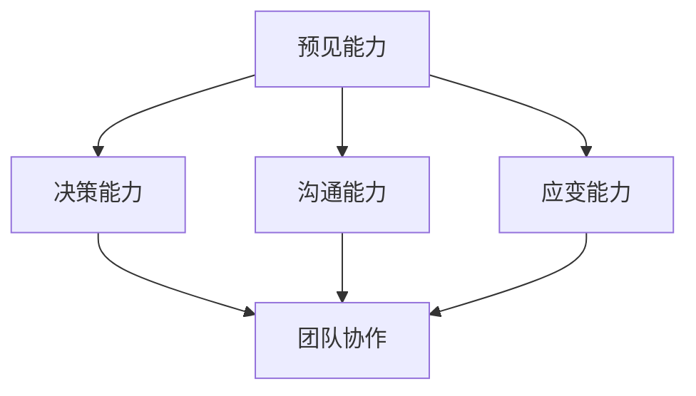
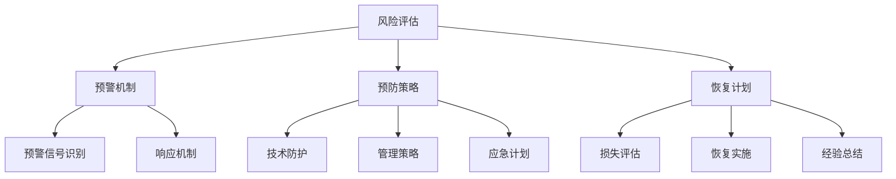

                 

### 文章标题：领导力与危机预防：建立预警机制的方法

在日益复杂的商业环境中，企业面临的各种潜在危机越来越多。从技术故障到市场突变，从法律风险到自然灾害，危机的多样性和不确定性让组织管理者倍感压力。然而，有效的危机管理并非仅仅是应对突发事件，更重要的是提前预警、预防和及时响应。本篇博客将探讨领导力在危机管理中的作用，并详细阐述如何建立一套高效的预警机制。

**关键词：**  
领导力、危机管理、预警机制、危机预防、组织绩效

**摘要：**  
本文将首先探讨领导力在危机管理中的关键作用，通过理论分析和实践案例，展示领导力如何影响危机预警体系的建立。接着，我们将深入探讨如何构建一个有效的预警机制，包括数据收集、分析、模型构建以及危机应对策略。文章还将通过实际项目实战，展示如何将理论应用到实践中，并总结出最佳实践和注意事项。最后，我们将展望未来危机预防和领导力发展的趋势，为企业的长期发展提供指导。

### 目录

**1. 引言：**  
领导力与危机预防的重要性  
企业面临的主要危机类型及其影响

**2. 领导力在危机管理中的作用**

- **核心概念与联系**：领导力的定义、危机管理的核心要素以及领导力与危机管理之间的关系
- **Mermaid流程图：** 展示领导力在危机管理中的流程和环节

**3. 危机的类型与特点**

- **核心概念**：不同类型的危机及其特点
- **联系**：危机对组织的影响

**4. 建立危机预防体系**

- **核心概念**：预警体系的组成部分、预防策略与措施
- **Mermaid流程图：** 预警体系的基本架构
- **伪代码：** 预警策略的制定方法

**5. 数据收集与分析**

- **核心概念**：危机数据的类型与收集方法
- **数学模型与公式**：数据分析的基本模型和常用公式
- **数据可视化**：数据可视化技术原理及示例

**6. 预警模型构建**

- **核心概念**：预警模型选择、模型训练与验证
- **伪代码**：模型训练与验证过程的伪代码示例
- **模型调优与优化**：模型调优的策略与技巧

**7. 危机应对与恢复**

- **危机应对策略**：制定原则与方法、危机沟通与传播
- **危机恢复与重建**：恢复策略制定、恢复过程中的风险管理、恢复后的组织重建

**8. 领导力与危机预防的持续发展**

- **领导力与危机预防的整合**：领导力在危机预防中的作用与持续发展
- **持续改进与学习**：方法与工具
- **领导力培养与团队建设**：核心概念与联系

**9. 未来趋势与展望**

- **危机预防技术的发展趋势**：新兴技术在危机预防中的应用
- **组织的危机管理能力建设**：关键要素
- **未来展望**：危机预防与领导力的发展趋势

**10. 结论**

- **总结**：文章的核心内容和主要观点
- **注意事项**：危机预防和领导力发展的实践建议
- **拓展阅读**：推荐相关文献和资源

### 引言：领导力与危机预防的重要性

在现代企业的运营中，危机管理是一个不可或缺的环节。无论是初创企业还是大型跨国公司，都面临着各种潜在危机的威胁。这些危机可能来自内部，如技术故障、管理失误或法律纠纷；也可能来自外部，如市场突变、自然灾害或政治动荡。有效的危机管理不仅能够帮助企业度过难关，还能提升其市场竞争力和长期发展能力。

然而，危机管理并非仅仅是应对突发事件，更重要的是提前预警、预防和及时响应。这就需要企业建立一套高效的预警机制，以便在危机发生之前及时发现并采取应对措施。领导力在这个过程中扮演着关键角色。一个优秀的领导者不仅能够准确判断危机的征兆，还能够动员全体员工共同应对，从而最大限度地减少危机对企业的负面影响。

**企业面临的主要危机类型及其影响**

1. **技术故障**：随着企业对技术的依赖程度不断提高，技术故障成为常见的危机类型。网络中断、系统崩溃、数据泄露等都可能导致业务中断、客户流失和声誉受损。

2. **市场突变**：市场环境瞬息万变，企业可能面临市场需求下降、竞争对手崛起或新兴市场的挑战。这种危机往往导致市场份额减少、盈利能力下降。

3. **法律风险**：企业可能因为法律纠纷、合同纠纷或合规问题而面临法律风险。严重的法律问题可能导致企业面临巨额罚款、法律诉讼甚至业务停摆。

4. **自然灾害**：自然灾害如地震、洪水、台风等可能对企业造成毁灭性的影响。不仅导致物理设施的破坏，还可能影响到供应链、客户关系和员工安全。

5. **政治动荡**：政治动荡、恐怖袭击或社会不稳定等因素可能对企业运营产生严重影响。企业在这些情况下可能面临供应链中断、业务停摆或市场份额丧失。

**领导力在危机管理中的作用**

领导力是危机管理成功的关键因素。一个优秀的领导者需要具备以下能力：

1. **预见能力**：能够准确判断危机的潜在征兆，提前采取措施预防。

2. **决策能力**：在面对危机时能够迅速做出正确的决策，并有效协调各方资源。

3. **沟通能力**：能够清晰、有效地传达危机情况，并动员全体员工共同应对。

4. **应变能力**：能够在危机发生时保持冷静，迅速调整策略以应对突发事件。

5. **团队协作**：能够建立高效的团队，充分发挥每个成员的潜力，共同应对危机。

**本篇博客的主要内容**

本文将围绕领导力与危机预防这一主题，详细探讨以下几个方面：

1. **领导力在危机管理中的作用**：分析领导力的核心要素，以及领导力如何影响危机预警体系的建立。

2. **危机的类型与特点**：介绍不同类型的危机及其特点，探讨危机对组织的影响。

3. **建立危机预防体系**：阐述预警体系的基本架构、预防策略与措施。

4. **数据收集与分析**：讨论危机数据的类型与收集方法，介绍数据分析技术及其应用。

5. **预警模型构建**：探讨预警模型的选择、训练与验证，以及模型调优与优化。

6. **危机应对与恢复**：介绍危机应对策略、恢复策略的制定以及恢复后的组织重建。

7. **领导力与危机预防的持续发展**：探讨领导力与危机预防的整合、持续改进与学习、领导力培养与团队建设。

8. **未来趋势与展望**：分析危机预防技术的发展趋势，展望组织的危机管理能力建设。

通过本文的探讨，希望能够为企业的危机预防和领导力发展提供有益的启示和指导。在接下来的章节中，我们将逐一深入探讨这些主题。首先，我们将详细分析领导力在危机管理中的核心要素和作用，为后续内容奠定基础。

### 2. 领导力在危机管理中的作用

领导力是危机管理的核心要素，它不仅决定了企业能否在危机中迅速作出反应，还影响了危机应对的效果和组织的长期发展。有效的领导力能够为企业提供清晰的愿景、战略方向和行动指南，帮助企业在危机中保持稳定，并最大限度地降低损失。

#### 核心概念与联系

首先，我们需要明确领导力的定义。领导力是指一种通过影响力、沟通能力和决策能力来引导和激励他人实现共同目标的能力。它不仅仅局限于企业高层管理者的职责，而是贯穿于组织的各个层级。在危机管理中，领导力具有以下几个核心概念：

1. **预见能力**：领导力的一部分是预见潜在的危机，并提前采取措施预防。这种预见能力需要领导者具备敏锐的市场洞察力、对风险的敏感性和战略眼光。

2. **决策能力**：危机往往需要快速而果断的决策。领导力的一个关键方面是能够在压力下做出明智的决策，并迅速付诸行动。

3. **沟通能力**：领导力还包括有效地沟通危机情况和决策方案，确保信息透明，增强团队的凝聚力和信任。

4. **应变能力**：危机往往不可预测，领导者需要具备灵活的应变能力，能够迅速调整策略以应对新情况。

5. **团队协作**：领导力还需要领导者能够建立高效的团队，发挥每个成员的潜力，共同应对危机。

这些核心概念之间紧密联系，共同构成了领导力在危机管理中的作用架构。以下是一个简化的Mermaid流程图，展示这些概念之间的关系：

#### 领导力与危机管理的关系

领导力在危机管理中的作用可以通过以下几个方面具体阐述：

1. **危机预警**：领导力能够帮助企业及早发现潜在的危机。领导者通过预见能力和市场洞察力，能够识别出可能引发危机的信号，并及时采取预防措施。

2. **危机响应**：在危机爆发时，领导力的决策能力和应变能力变得尤为重要。领导者需要迅速评估情况，制定应对策略，并协调各方资源，以最大限度地减少危机的影响。

3. **危机沟通**：有效的沟通是危机管理成功的关键。领导者需要确保信息透明，及时向员工、客户和合作伙伴传达危机情况，增强信任和理解。

4. **团队协作**：领导力能够促进团队协作，使全体员工能够共同应对危机。领导者需要建立高效的团队，明确每个人的职责和任务，并激励团队成员发挥最佳水平。

5. **危机恢复**：危机过后，领导力继续发挥作用，帮助组织进行恢复和重建。领导者需要制定恢复策略，确保组织能够迅速恢复运营，并从中吸取教训，改进管理流程。

#### 实践案例

为了更好地理解领导力在危机管理中的实际应用，我们可以通过一些实践案例来探讨：

- **案例一**：某跨国公司因为供应链中断面临重大危机。公司CEO通过迅速决策，重新安排物流渠道，并与供应商紧急协商，最终在短时间内恢复了供应链，最大限度地降低了危机对业务的影响。

- **案例二**：一家科技公司因数据泄露面临客户信任危机。公司CIO通过有效的危机沟通策略，向客户明确告知数据泄露的情况，并承诺采取一系列措施保障客户数据安全，最终赢得了客户的信任，并避免了声誉受损。

- **案例三**：某制造业公司在地震后遭受严重损失。公司CEO通过灵活的应变能力，迅速调整生产计划，重新部署生产线，并积极与员工沟通，最终在短时间内恢复了生产，确保了业务的连续性。

这些案例表明，领导力在危机管理中发挥着至关重要的作用。有效的领导力不仅能够帮助企业应对危机，还能提升组织的整体抗风险能力和竞争力。

通过以上分析，我们可以看到领导力在危机管理中的核心概念和作用。在接下来的章节中，我们将继续探讨危机的类型与特点，以及如何建立有效的预警体系。这将为我们理解领导力在危机管理中的作用提供更深入的视角。

#### 3. 危机的类型与特点

危机对企业的影响深远且复杂，不同类型的危机具有各自独特的特点，理解这些特点对于有效应对危机至关重要。以下是对几种主要危机类型的介绍及其对组织的影响。

##### 技术故障

技术故障是企业在数字化时代中最常见的危机之一。这些故障可能包括网络中断、系统崩溃、数据丢失或安全漏洞。技术故障不仅会导致业务中断，还可能暴露企业的敏感信息，引发数据泄露和隐私问题。

- **特点**：突发性强、影响范围广、修复成本高
- **影响**：业务中断、客户流失、品牌损害、经济损失

##### 市场突变

市场突变通常指的是市场需求、竞争环境或经济状况的突然变化。这些变化可能源于宏观经济因素、行业趋势或竞争对手的动态。市场突变对企业的经营策略和业绩有直接影响，可能导致市场份额下降、盈利能力降低。

- **特点**：不可预测、变化快、影响广泛
- **影响**：战略失效、市场份额减少、财务压力

##### 法律风险

法律风险是指企业在法律合规方面面临的风险，包括合同纠纷、侵权诉讼、合规问题等。法律风险不仅可能导致企业面临高昂的法律费用和罚款，还可能影响企业的运营和声誉。

- **特点**：法律程序复杂、不确定性高、影响深远
- **影响**：法律纠纷、罚款、业务中断、声誉受损

##### 自然灾害

自然灾害如地震、洪水、台风等对企业的物理设施和运营产生直接威胁。这些灾害不仅可能导致企业设施损毁，还可能影响供应链和客户关系。

- **特点**：不可预测、破坏性强、恢复周期长
- **影响**：设施损毁、供应链中断、业务中断、经济损失

##### 政治动荡

政治动荡包括战争、政治变革、政策调整等。这些因素可能对企业运营环境产生深远影响，导致供应链中断、市场环境不稳定、投资风险增加。

- **特点**：不可预测、不确定性高、影响长期
- **影响**：业务中断、投资风险、市场份额丧失、财务压力

##### 对组织的影响

不同类型的危机对组织的影响各有不同，但总体上可以分为以下几个方面：

1. **业务中断**：危机可能导致企业的生产、运营和服务中断，影响正常业务流程。

2. **财务压力**：危机可能导致企业面临高昂的修复成本、罚款、赔偿等财务压力，影响企业的财务状况。

3. **声誉损害**：危机可能损害企业的声誉，导致客户信任度下降、市场份额减少。

4. **员工影响**：危机可能导致员工士气低落、工作效率下降，甚至导致人员流失。

5. **供应链中断**：危机可能影响供应链的正常运行，导致原材料短缺、生产延误。

理解不同类型危机的特点和影响，对于企业建立有效的危机预防体系至关重要。在接下来的章节中，我们将探讨如何建立危机预防体系，包括预警体系的基本架构、预防策略与措施。这将为我们提供具体的方法来应对和减轻危机对企业的影响。

### 4. 建立危机预防体系

建立有效的危机预防体系是企业应对潜在风险的关键步骤。一个完善的危机预防体系包括多个组成部分，如风险评估、预警机制、预防策略和恢复计划等。以下是危机预防体系的基本架构，以及预防策略与措施的详细阐述。

#### 核心概念

1. **风险评估**：通过对企业内外部环境的分析，识别潜在的风险因素，并评估其对企业的可能影响。

2. **预警机制**：建立一套实时监测和预警系统，及时发现危机征兆，并迅速采取应对措施。

3. **预防策略**：制定一系列预防措施，包括技术防护、管理策略、应急计划等，以减少危机发生的可能性。

4. **恢复计划**：在危机发生后，制定详细的恢复计划，确保企业能够迅速恢复运营，降低损失。

#### Mermaid流程图

为了更好地理解危机预防体系的基本架构，我们可以使用Mermaid流程图来展示各个环节的关联和流程：

#### 预防策略与措施

1. **技术防护**：
   - **网络防护**：通过防火墙、入侵检测系统和加密技术保护企业的网络安全。
   - **数据备份**：定期备份重要数据，确保在数据丢失或损坏时能够快速恢复。
   - **硬件冗余**：采用冗余硬件和备份系统，确保关键设备的稳定运行。

2. **管理策略**：
   - **应急预案**：制定详细的应急预案，明确危机发生时的应对步骤和责任分配。
   - **风险管理**：建立风险管理框架，定期评估和更新风险清单，制定相应的应对措施。
   - **培训与演练**：定期对员工进行危机管理培训，并进行模拟演练，以提高应对危机的能力。

3. **应急计划**：
   - **应急响应团队**：成立专门的应急响应团队，负责危机发生时的协调和指挥。
   - **应急资源**：确保有足够的应急资源，如备用设备、物资和资金，以应对突发事件。
   - **沟通机制**：建立有效的沟通机制，确保危机信息能够快速传达，并确保内部和外部相关方能够及时得到通知。

#### 案例研究

为了更好地理解危机预防体系在实际中的应用，我们可以通过一个实际案例来分析。

**案例：某电商平台的危机预防**

某电商平台在准备迎接“双十一”购物节期间，意识到可能面临的技术挑战和风险。他们采取了一系列预防措施，以建立完善的危机预防体系。

1. **风险评估**：
   - **技术风险**：分析系统在高并发流量下的稳定性，评估可能出现的技术故障。
   - **市场风险**：预测市场需求变化，评估供应链压力和物流风险。

2. **预警机制**：
   - **流量监测**：通过实时监控系统，监控平台流量和服务器负载。
   - **预警信号**：设定流量阈值，当流量超过设定值时，触发预警信号。

3. **预防策略**：
   - **技术防护**：增加服务器和带宽资源，进行系统优化和负载均衡。
   - **管理策略**：制定详细的应急预案，包括流量控制、用户分流和应急响应流程。

4. **应急计划**：
   - **应急响应团队**：成立专门的应急响应小组，负责实时监控和协调。
   - **资源准备**：提前准备好备用服务器和数据中心，确保在突发情况下能够迅速切换。

在“双十一”期间，该电商平台成功应对了高并发流量，确保了系统的稳定运行，没有发生重大技术故障。通过这一案例，我们可以看到危机预防体系在实践中的应用效果。

通过建立完善的危机预防体系，企业可以在危机发生之前提前预警并采取预防措施，最大限度地减少危机对企业的影响。在接下来的章节中，我们将进一步探讨如何通过数据收集与分析、预警模型构建和危机应对策略，进一步提升危机预防的有效性。

### 4.1 数据收集与分析

在危机预防体系中，数据收集与分析是关键环节之一。准确、及时的数据能够帮助企业识别潜在危机，并采取有效的预防措施。以下是关于危机数据的类型、收集方法以及数据分析技术的详细阐述。

#### 核心概念

1. **数据类型**：危机数据包括内部数据和外部数据。内部数据来源于企业自身的运营信息，如财务数据、销售数据、生产数据等。外部数据则来源于市场环境、行业动态、政策法规等。

2. **收集方法**：数据收集方法包括自动化数据采集、手动数据录入、问卷调查、第三方数据服务等形式。

3. **数据分析技术**：数据分析技术包括数据预处理、统计分析、机器学习等，用于挖掘数据中的有用信息和趋势。

#### 数据类型

1. **内部数据**：
   - **财务数据**：包括收入、支出、利润、负债等，反映企业的财务状况。
   - **销售数据**：包括销售额、客户分布、产品销售情况等，反映市场需求和销售趋势。
   - **生产数据**：包括产量、设备运行状态、生产线效率等，反映生产过程的稳定性。

2. **外部数据**：
   - **市场数据**：包括行业报告、市场分析、竞争对手动态等，反映市场环境和竞争态势。
   - **政策数据**：包括政策法规、政府公告等，反映政策变化对企业的影响。
   - **环境数据**：包括气象数据、自然灾害预警等，反映外部环境变化。

#### 收集方法

1. **自动化数据采集**：
   - **系统日志**：通过企业内部系统记录的操作日志和事件日志，自动采集数据。
   - **API接口**：通过第三方数据接口，自动获取外部数据。

2. **手动数据录入**：
   - **问卷调查**：通过问卷调查的方式，收集员工、客户和合作伙伴的意见和反馈。
   - **现场记录**：通过实地考察和记录，收集环境数据和现场情况。

3. **第三方数据服务**：
   - **数据服务提供商**：购买专业数据服务，获取市场分析、行业报告等外部数据。

#### 数据分析技术

1. **数据预处理**：
   - **数据清洗**：去除重复数据、异常值和处理缺失数据。
   - **数据整合**：将不同来源的数据进行整合，形成统一的数据库。

2. **统计分析**：
   - **描述性统计**：计算数据的平均值、方差、标准差等基本统计量。
   - **相关性分析**：分析不同变量之间的相关性，识别潜在的风险因素。

3. **机器学习**：
   - **预测分析**：利用机器学习算法，预测未来的趋势和风险。
   - **聚类分析**：通过聚类算法，将相似的数据分组，识别潜在的风险群体。
   - **分类分析**：通过分类算法，将数据分为不同类别，识别危机类型。

#### 示例

为了更好地理解数据收集与分析的过程，以下是一个简单的数据收集与分析示例：

**案例：某企业销售数据的分析**

某企业希望通过分析销售数据，识别潜在的危机因素。以下是数据收集与分析的具体步骤：

1. **数据收集**：
   - 收集过去一年的销售数据，包括销售额、产品类别、销售区域等信息。

2. **数据预处理**：
   - 清洗数据，去除重复和异常值。
   - 整合数据，将不同区域和产品的销售数据进行整合。

3. **统计分析**：
   - 计算销售额的均值和方差，分析销售数据的波动情况。
   - 分析不同产品类别的销售情况，识别畅销产品和滞销产品。

4. **预测分析**：
   - 利用机器学习算法，预测未来的销售额趋势，识别可能的销售下滑风险。

5. **结果解读**：
   - 根据分析结果，制定相应的预防策略，如增加畅销产品的库存、调整滞销产品的推广策略等。

通过以上步骤，企业可以更好地了解销售数据中的潜在危机因素，并采取有效的预防措施。

综上所述，数据收集与分析在危机预防体系中起着至关重要的作用。通过准确、及时的数据，企业可以更好地识别潜在危机，制定有效的预防策略，从而降低危机对企业的影响。在接下来的章节中，我们将进一步探讨如何构建预警模型，以及模型训练与验证的方法。

### 4.2 预警模型构建

在危机预防体系中，预警模型的构建是关键步骤，它能够帮助企业及时识别潜在危机并采取预防措施。预警模型的构建主要包括模型选择、模型训练与验证、以及模型调优与优化。以下是这些核心概念的详细阐述。

#### 核心概念

1. **模型选择**：根据企业面临的不同类型危机，选择合适的预警模型。常见的预警模型包括统计模型、机器学习模型、神经网络模型等。

2. **模型训练与验证**：通过历史数据对预警模型进行训练，并验证模型的准确性和可靠性。模型训练与验证是确保模型能够有效预测危机的关键步骤。

3. **模型调优与优化**：根据模型训练的结果，对模型进行调优和优化，以提高其预测性能和应对能力。

#### 模型选择

在预警模型的构建过程中，选择合适的模型至关重要。以下是一些常见的预警模型及其特点：

1. **统计模型**：
   - **线性回归**：通过分析历史数据，建立因变量和自变量之间的线性关系，用于预测未来的趋势。
   - **逻辑回归**：用于分类问题，通过分析自变量对因变量的影响，预测危机发生的可能性。

2. **机器学习模型**：
   - **决策树**：通过分类树结构，将数据分为不同的类别，用于危机类型的识别和预测。
   - **随机森林**：基于决策树的集成方法，通过构建多个决策树并集成其预测结果，提高模型的准确性和鲁棒性。
   - **支持向量机（SVM）**：通过寻找最佳的超平面对数据进行分类，适用于非线性数据。

3. **神经网络模型**：
   - **多层感知器（MLP）**：基于人工神经网络，通过多层的神经元结构进行特征提取和分类。
   - **卷积神经网络（CNN）**：特别适用于处理图像和视频数据，可以用于识别图像中的潜在危机信号。

#### 模型训练与验证

模型训练与验证是确保预警模型有效性的关键步骤。以下是模型训练与验证的基本过程：

1. **数据预处理**：
   - **数据清洗**：去除重复数据和异常值，保证数据的准确性和一致性。
   - **特征工程**：提取有用的特征，并处理缺失数据，将数据转换为适合模型训练的形式。

2. **数据划分**：
   - 将数据集划分为训练集和测试集。通常采用80/20或70/30的比例进行划分，以保证模型在测试集上的性能。

3. **模型训练**：
   - 使用训练集对预警模型进行训练，调整模型参数，使其能够拟合历史数据。
   - 采用不同的算法和优化方法，如梯度下降、随机梯度下降等，提高模型的训练效率。

4. **模型验证**：
   - 使用测试集对训练好的模型进行验证，评估模型的准确性和可靠性。
   - 采用交叉验证、A/B测试等方法，确保模型在不同数据集上的性能稳定。

#### 模型调优与优化

模型调优与优化是进一步提高预警模型性能的重要步骤。以下是一些常用的调优和优化方法：

1. **参数调整**：
   - 调整模型的参数，如学习率、正则化参数、树深度等，以优化模型性能。

2. **特征选择**：
   - 使用特征选择方法，如信息增益、特征重要性等，识别并保留重要的特征，去除冗余特征。

3. **模型集成**：
   - 通过模型集成方法，如Bagging、Boosting等，将多个模型组合起来，提高预测的准确性和鲁棒性。

4. **超参数优化**：
   - 采用超参数优化算法，如网格搜索、随机搜索等，自动搜索最佳的模型参数组合。

#### 示例

为了更好地理解预警模型构建的过程，以下是一个简单的预警模型构建示例：

**案例：某企业供应链风险预警**

某企业希望通过构建预警模型，识别供应链中的潜在风险。以下是预警模型构建的具体步骤：

1. **模型选择**：
   - 根据企业的需求，选择随机森林模型作为预警模型，因为它具有良好的预测性能和解释性。

2. **数据收集**：
   - 收集过去一年的供应链数据，包括供应商绩效、交货准时率、库存水平等。

3. **数据预处理**：
   - 清洗数据，去除重复和异常值。
   - 进行特征工程，提取有用的特征，如供应商绩效评分、供应链延迟时间等。

4. **模型训练**：
   - 使用80%的数据作为训练集，对随机森林模型进行训练。
   - 调整模型参数，如树深度、节点最小样本数等，以优化模型性能。

5. **模型验证**：
   - 使用剩余的20%数据作为测试集，对训练好的模型进行验证。
   - 评估模型的准确性和可靠性，如精确率、召回率、F1分数等。

6. **模型调优**：
   - 通过调整模型参数和特征选择，进一步提高模型的预测性能。
   - 使用交叉验证方法，确保模型在不同数据集上的性能稳定。

通过以上步骤，企业可以构建一个有效的供应链风险预警模型，及时识别潜在的风险，并采取相应的预防措施。

综上所述，预警模型的构建是危机预防体系的重要组成部分。通过合理的模型选择、训练与验证，以及调优与优化，企业可以建立一个高效的预警系统，提前识别潜在的危机，并采取有效的预防措施。在接下来的章节中，我们将探讨如何通过危机应对策略和恢复计划，进一步降低危机对企业的影响。

### 4.3 危机应对策略

危机应对策略是危机管理的重要组成部分，它旨在帮助企业在危机发生时迅速反应，最大限度地减少损失，并尽快恢复正常运营。危机应对策略的制定和实施需要综合考虑危机的类型、影响范围、资源条件等多方面因素。以下是危机应对策略的制定原则、危机沟通与传播的方法，以及危机应对过程中的关键步骤。

#### 制定原则

1. **快速响应**：危机应对策略的首要原则是迅速响应，及时采取行动。时间对于危机管理至关重要，快速反应能够最大限度地减少危机带来的负面影响。

2. **全面考虑**：在制定危机应对策略时，需要全面考虑危机的各种可能影响，包括人员安全、财产损失、业务中断、法律风险等。

3. **资源调配**：合理调配企业内部资源，确保在危机应对过程中有足够的物资、资金和技术支持。

4. **风险管理**：将风险管理纳入危机应对策略中，识别和评估危机带来的风险，并采取相应的缓解措施。

5. **透明沟通**：建立有效的沟通机制，确保信息透明，及时向内部员工、客户和合作伙伴传达危机情况，增强信任和理解。

#### 危机沟通与传播

1. **内部沟通**：危机发生时，内部沟通至关重要。企业需要确保各级管理层、员工以及相关部门能够及时获得危机信息，了解应对措施，并各司其职。

   - **紧急会议**：组织紧急会议，迅速制定应对方案，明确各部门职责。
   - **通知机制**：通过内部邮件、企业即时通讯工具等通知机制，确保信息快速传达。

2. **外部沟通**：危机沟通不仅限于内部，还需要对外部相关方进行有效传播。

   - **媒体发布**：制定危机沟通计划，通过新闻发布会、官方网站、社交媒体等渠道，向公众和客户传达危机情况。
   - **客户沟通**：通过电话、电子邮件、短信等方式，及时与客户沟通，告知危机情况，并解释应对措施。

#### 关键步骤

1. **评估危机**：在危机发生时，首先对危机进行评估，了解危机的性质、范围和影响程度。这一步骤有助于确定危机的优先级，为后续的应对策略提供依据。

2. **制定计划**：根据危机评估结果，制定详细的应对计划。计划应包括危机应对的目标、步骤、责任分配和时间表。

3. **执行计划**：按照制定的计划，迅速采取行动，实施危机应对措施。确保各部门和员工按照计划执行，协调配合，共同应对危机。

4. **监控和调整**：在危机应对过程中，持续监控危机的发展情况，并根据实际情况及时调整应对策略。这一步骤有助于确保应对措施的有效性和灵活性。

5. **恢复运营**：危机应对结束后，企业需要迅速恢复运营，确保业务的连续性。恢复运营需要充分考虑资源调配、员工培训和业务流程优化等方面。

#### 实践案例

为了更好地理解危机应对策略的实际应用，以下是一个实际案例：

**案例：某科技公司的网络安全危机**

某科技公司在一次网络攻击中，其服务器遭到入侵，导致部分敏感数据泄露。以下是该公司的危机应对过程：

1. **评估危机**：
   - 立即召开紧急会议，了解攻击的具体情况，评估数据泄露的范围和影响。

2. **制定计划**：
   - 制定详细的危机应对计划，包括数据恢复、系统加固、员工培训等。

3. **执行计划**：
   - 立即切断受攻击的服务器，防止攻击进一步扩大。
   - 启动应急响应团队，进行数据恢复和系统加固。
   - 对员工进行网络安全培训，提高其安全意识。

4. **监控和调整**：
   - 持续监控网络状况，及时发现和解决潜在的安全问题。
   - 根据监控结果，调整危机应对策略，确保应对措施的有效性。

5. **恢复运营**：
   - 完成数据恢复和系统加固后，逐步恢复正常运营。
   - 对受影响的客户进行补偿，增强客户信任。

通过以上步骤，该公司成功应对了网络安全危机，最大限度地减少了损失，并恢复了正常运营。

综上所述，危机应对策略是危机管理的重要组成部分。通过制定合理的应对策略，企业可以在危机发生时迅速反应，减少损失，并尽快恢复正常运营。在接下来的章节中，我们将探讨危机恢复与重建的策略，确保企业能够在危机过后迅速恢复和重建。

### 4.4 危机恢复与重建

在危机得到有效控制后，企业需要迅速展开恢复与重建工作，以确保业务的连续性和长期发展。危机恢复与重建包括恢复策略的制定、恢复过程中的风险管理、以及恢复后的组织重建。以下是这些关键环节的详细阐述。

#### 恢复策略的制定

1. **评估损失**：
   - 对危机造成的损失进行详细评估，包括财产损失、业务中断、声誉损害等。
   - 制定损失评估报告，为后续的恢复工作提供依据。

2. **确定优先级**：
   - 根据损失评估结果，确定恢复工作的优先级。通常，关键业务系统和员工的安全是最重要的恢复任务。

3. **制定恢复计划**：
   - 制定详细的恢复计划，包括恢复目标、时间表、责任分配、资源调配等。
   - 计划应涵盖数据恢复、系统修复、供应链重建等方面。

4. **资源调配**：
   - 确保在恢复过程中有足够的资源，如人力、资金、物资等。
   - 根据实际情况，调整资源分配，确保关键任务得到优先处理。

#### 恢复过程中的风险管理

1. **风险识别**：
   - 识别恢复过程中可能出现的风险，包括技术风险、财务风险、人员风险等。

2. **风险评估**：
   - 对识别出的风险进行评估，确定其可能性和影响程度，制定相应的应对策略。

3. **风险监控**：
   - 在恢复过程中，持续监控风险的变化，及时发现新的风险并采取应对措施。

4. **风险应对**：
   - 根据风险评估结果，采取相应的风险应对措施，包括风险规避、风险转移、风险减轻等。

#### 恢复后的组织重建

1. **业务重建**：
   - 恢复关键业务系统的正常运行，确保关键业务的连续性。
   - 评估业务流程，优化业务流程，提高运营效率。

2. **员工重建**：
   - 评估员工在危机中的表现，识别优秀员工并进行表彰。
   - 对受危机影响的员工提供心理支持和职业培训，帮助他们重新融入工作。

3. **组织重建**：
   - 重新评估组织结构，优化部门职责和人员配置。
   - 加强企业文化建设，提升员工的凝聚力和归属感。

4. **经验总结**：
   - 对危机应对和恢复过程进行总结，识别成功经验和不足之处。
   - 制定改进计划，为未来的危机应对提供参考。

#### 实践案例

为了更好地理解危机恢复与重建的实际操作，以下是一个实际案例：

**案例：某制造企业的地震恢复**

某制造企业在一次地震中遭受严重破坏，导致生产线停摆、库存受损、员工安全问题突出。以下是该企业的恢复与重建过程：

1. **评估损失**：
   - 对生产线、库存、设备等进行详细评估，确定恢复工作的优先级。

2. **制定恢复计划**：
   - 制定详细的恢复计划，包括数据恢复、设备维修、生产线重建等。

3. **资源调配**：
   - 调集企业内部和外部资源，如备用设备、技术人员等，确保恢复工作的顺利进行。

4. **恢复过程**：
   - 优先恢复关键业务系统，如生产线和关键设备。
   - 对库存进行清理和修复，确保能够重新投入使用。

5. **员工重建**：
   - 对受地震影响的员工提供心理支持和职业培训，帮助他们重新适应工作。

6. **组织重建**：
   - 优化组织结构，调整部门职责和人员配置，以提高组织效率和抗风险能力。

通过以上步骤，该企业成功恢复了生产，并逐步恢复了运营。这次恢复与重建不仅增强了企业的抗风险能力，还提升了员工的凝聚力和企业文化建设。

综上所述，危机恢复与重建是危机管理的重要组成部分。通过制定合理的恢复策略、实施有效的风险管理，以及进行全面的组织重建，企业可以迅速恢复运营，降低危机带来的损失，并提升长期发展能力。在接下来的章节中，我们将探讨领导力与危机预防的持续发展，以及未来趋势和展望。

### 4.5 领导力与危机预防的持续发展

领导力在危机预防中扮演着至关重要的角色，但领导力的提升和持续发展同样不可或缺。一个组织的领导力水平不仅决定了当前危机管理的有效性，也影响着企业未来面对危机时的应对能力。以下是领导力与危机预防的整合、持续改进与学习、以及领导力培养与团队建设等关键环节的探讨。

#### 领导力与危机预防的整合

领导力与危机预防的整合是一个长期的过程，需要组织在战略层面、运营层面和团队层面进行全面考虑。

1. **战略层面**：
   - **领导力战略**：将领导力培养纳入企业战略规划，确保领导力发展与企业目标一致。
   - **危机预防规划**：将危机预防作为企业风险管理的重要组成部分，制定长期的危机预防规划。

2. **运营层面**：
   - **领导力实践**：领导者通过日常运营中的实践，树立危机管理的榜样，推动组织文化的转变。
   - **预防机制**：建立和完善危机预防机制，确保领导力实践能够落实到具体操作中。

3. **团队层面**：
   - **团队协作**：培养团队协作精神，确保在危机发生时，团队成员能够紧密配合，共同应对。
   - **持续培训**：定期对员工进行危机管理培训，提高其应对危机的能力。

#### 持续改进与学习

持续改进与学习是提升领导力和危机预防能力的关键。以下是一些实践方法：

1. **经验总结**：
   - 定期对危机应对过程进行总结，识别成功经验和不足之处。
   - 将经验总结转化为实际操作指南，为未来危机管理提供参考。

2. **知识分享**：
   - 建立内部知识分享平台，鼓励员工分享危机管理的经验和教训。
   - 通过内部培训、研讨会等形式，传播最佳实践和先进理念。

3. **模拟演练**：
   - 定期组织危机管理模拟演练，提高员工的应对能力和团队协作水平。
   - 分析演练结果，及时调整和优化危机管理策略。

#### 领导力培养与团队建设

领导力培养与团队建设是提升组织危机应对能力的基础。以下是一些具体措施：

1. **领导力发展计划**：
   - 制定领导力发展计划，包括领导力培训、领导力评估和领导力提升项目。
   - 为不同层级的领导者提供定制化的培训和发展机会。

2. **团队建设**：
   - 通过团队建设活动，增强团队凝聚力，提高团队协作效率。
   - 设立跨部门项目团队，促进不同部门之间的沟通与合作。

3. **绩效管理**：
   - 将危机管理能力纳入员工绩效评估体系，激励员工积极参与危机预防工作。
   - 对表现优秀的员工给予表彰和奖励，提升员工的工作积极性。

#### 实践案例

为了更好地理解领导力与危机预防的持续发展，以下是一个实际案例：

**案例：某金融企业的危机管理提升**

某金融企业在一次市场波动中遭受了巨大损失，为了提升危机管理能力，企业采取了一系列措施：

1. **领导力培养**：
   - 领导层组织了多次危机管理研讨会，邀请外部专家进行培训。
   - 制定领导力发展计划，提升中层管理者的危机应对能力。

2. **持续改进与学习**：
   - 对危机应对过程进行详细分析，总结经验教训。
   - 建立内部知识库，分享最佳实践和成功案例。

3. **团队建设**：
   - 定期组织团队建设活动，增强员工之间的信任和协作。
   - 设立危机管理专项团队，专门负责危机预防和应对。

通过以上措施，该企业显著提升了危机管理能力，并在随后的市场波动中表现出色，减少了损失，提升了市场竞争力。

综上所述，领导力与危机预防的持续发展需要组织在战略、运营和团队层面进行全面规划和实施。通过持续改进与学习、领导力培养与团队建设，企业可以不断提升危机应对能力，确保在面临危机时能够迅速反应，有效应对，并最终实现可持续发展。

### 4.6 未来趋势与展望

随着科技的快速发展和社会环境的不断变化，危机预防与领导力的发展也呈现出新的趋势。了解这些趋势有助于企业更好地应对未来的挑战，并提升危机管理能力。以下是危机预防技术的发展趋势、组织的危机管理能力建设，以及未来危机预防和领导力发展的展望。

#### 危机预防技术的发展趋势

1. **大数据与人工智能**：大数据和人工智能技术在危机预防中发挥着重要作用。通过大数据分析，企业可以更准确地预测潜在危机，并采取预防措施。人工智能技术可以自动化危机预警模型的构建和优化，提高预警的准确性和效率。

2. **物联网与传感器技术**：物联网和传感器技术的应用使得企业能够实时监测环境变化和设备状态，从而及时发现潜在危机。例如，通过传感器监测，企业可以提前预警自然灾害或设备故障。

3. **区块链技术**：区块链技术可以提高危机预防数据的透明度和安全性，确保数据的真实性和完整性。在危机发生后，区块链技术可以帮助企业追踪损失和责任，提高恢复效率。

4. **云计算与边缘计算**：云计算和边缘计算提供了强大的计算能力和数据存储能力，使得企业能够快速响应危机，并实时调整应对策略。边缘计算还可以减少数据传输延迟，提高预警的实时性。

#### 组织的危机管理能力建设

1. **人才培养与培训**：组织需要加强危机管理人才的培养，提高员工的危机应对能力。通过定期的培训和模拟演练，员工可以更好地掌握危机管理的知识和技能。

2. **跨部门协作**：建立跨部门协作机制，确保各部门在危机发生时能够紧密配合，共同应对。跨部门协作可以提高危机管理的效率，减少内部冲突和资源浪费。

3. **危机管理信息系统**：建立一个集成的危机管理信息系统，实现危机数据的实时收集、分析和共享。信息系统可以帮助企业快速识别危机、制定应对策略，并跟踪危机处理过程。

4. **法律法规和标准**：制定和完善相关的法律法规和标准，确保企业的危机管理活动符合法规要求，并提高危机应对的规范性。

#### 未来危机预防和领导力发展的展望

1. **智能化预警系统**：随着人工智能技术的发展，未来智能化预警系统将成为危机预防的主要工具。这些系统可以基于大数据分析和机器学习算法，实时监控环境变化，提前预警潜在危机。

2. **全方位风险管理**：未来的危机预防将更加注重全方位风险管理，不仅关注技术故障和自然灾害，还关注市场波动、法律风险等。企业需要建立全面的风险管理体系，确保各个方面的风险得到有效控制。

3. **领导力的多元化**：未来的领导力将更加注重多元化，包括性别、年龄、文化和背景等方面的多元化。多元化的领导力可以更好地应对复杂多变的环境，提高组织的创新能力和抗风险能力。

4. **可持续发展**：在可持续发展理念的指导下，企业需要将危机预防与可持续发展相结合，确保在应对危机的同时，实现长期的环境和社会责任。

综上所述，未来的危机预防和领导力发展将面临新的挑战和机遇。企业需要紧跟技术发展趋势，加强危机管理能力建设，并注重领导力的多元化和可持续发展。通过不断创新和优化，企业将能够更好地应对未来的危机，实现长期稳定发展。

### 结论

本文通过详细探讨领导力与危机预防的关系，展示了建立预警机制的重要性。从领导力的核心要素到危机的类型与特点，再到预警体系的构建、数据分析与预警模型构建，以及危机应对策略和恢复计划，我们系统地梳理了危机预防的各个环节。同时，通过实际案例的剖析，进一步展示了理论在实际应用中的效果。

**核心观点**：

- 领导力在危机管理中起着至关重要的作用，预见能力、决策能力、沟通能力、应变能力和团队协作能力共同构成了领导力的核心。
- 建立有效的预警机制是企业应对潜在危机的关键，通过数据收集、分析、模型构建和危机应对策略，企业可以提前识别和应对各种危机。
- 危机恢复与重建是危机管理的重要组成部分，通过合理的恢复策略、风险管理以及组织重建，企业可以迅速恢复正常运营并提升抗风险能力。
- 未来危机预防和领导力发展将面临新的趋势，如大数据与人工智能、物联网与传感器技术等，企业需要紧跟技术发展，不断提升危机管理能力。

**实践建议**：

1. **加强领导力培训**：企业应定期对员工进行危机管理培训，提升员工的危机意识和应对能力。
2. **建立预警机制**：企业应构建一个全面的预警体系，包括数据收集、分析、模型构建和危机应对策略，确保能够及时识别和应对各种潜在危机。
3. **重视风险管理**：企业应制定详细的风险管理计划，定期评估和更新风险清单，确保危机管理措施的有效性。
4. **跨部门协作**：建立跨部门协作机制，确保各部门在危机发生时能够紧密配合，共同应对。

**拓展阅读**：

- 《危机管理：策略与案例》
- 《大数据分析：技术与应用》
- 《人工智能：算法与原理》
- 《组织行为学：领导力与团队管理》

通过本文的探讨，我们希望能够为企业提供有益的启示和指导，帮助其在面对危机时能够从容应对，实现可持续发展。领导力与危机预防的有机结合，将为企业带来长期的价值和竞争力。

---

**作者**：

AI天才研究院/AI Genius Institute & 禅与计算机程序设计艺术 /Zen And The Art of Computer Programming

通过本文的探讨，我们希望能够为企业提供有益的启示和指导，帮助其在面对危机时能够从容应对，实现可持续发展。领导力与危机预防的有机结合，将为企业带来长期的价值和竞争力。让我们共同努力，打造更加稳健、创新和可持续发展的企业。

