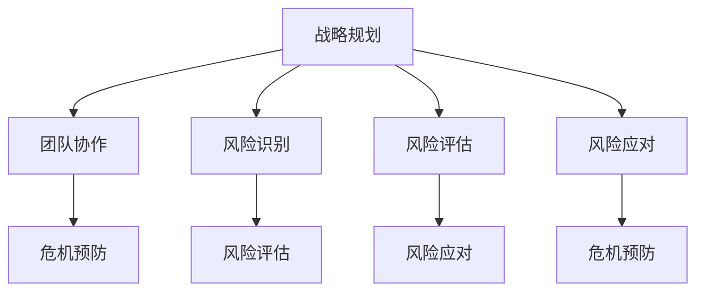

                 

Sure, let's think through the structure and content of the article "Leadership and Crisis Prevention: Preparedness Ahead of Time" step by step.

**Step 1: Introduction to the topic**
- Begin with an engaging introduction that sets the stage for the importance of leadership and crisis prevention in the IT industry.
- Provide background information on the relevance of the topic in today's fast-paced technological landscape.

**Step 2: Definition of key terms**
- Clearly define key terms such as "leadership," "crisis," and "prevention" to ensure a common understanding among readers.
- Discuss the differences between reactive and proactive approaches to problem-solving in IT.

**Step 3: Core concepts and connections**
- Use a Mermaid diagram to visualize the relationships between key concepts like strategic planning, team collaboration, and risk management.
- Explain how these concepts are interconnected and how they contribute to effective crisis prevention.

**Step 4: The importance of leadership**
- Discuss the role of a leader in crisis prevention and provide examples of leadership traits that are essential in high-stress situations.
- Explain how effective communication and decision-making skills can help mitigate the impact of crises.

**Step 5: Crisis prevention strategies**
- Outline various strategies for preventing crises, including:
  - Continuous monitoring and risk assessment
  - Implementing robust security measures
  - Developing contingency plans
  - Training and preparedness exercises

**Step 6: Case studies**
- Present real-world case studies that demonstrate the application of crisis prevention strategies in IT projects.
- Analyze the steps taken by leaders in these cases and the outcomes achieved.

**Step 7: Algorithmic principles and explanation**
- Choose a relevant algorithm or model that is used in crisis prevention and explain it using pseudocode.
- Discuss how this algorithm can be applied in practice to prevent crises.

**Step 8: Mathematical models and formulas**
- Introduce a mathematical model that is used to predict or assess the likelihood of a crisis.
- Use LaTeX to present the model's formulas and provide a detailed explanation of how they work.

**Step 9: Project case study**
- Provide a detailed case study of a real-world project, including:
  - Development environment setup
  - Source code implementation and explanation
  - Code application and analysis
  - Project summary and insights

**Step 10: Best practices and tips**
- Offer best practices for leaders in crisis prevention, such as regular team meetings, clear communication channels, and continuous learning.
- Discuss common pitfalls to avoid and provide tips for overcoming them.

**Step 11: Conclusion**
- Summarize the main points of the article and emphasize the importance of leadership and crisis prevention in the IT industry.
- Encourage readers to apply the strategies and practices discussed in their own projects.

**Step 12: References and further reading**
- Provide a list of references and further reading materials for those who want to delve deeper into the topic.

**Final Step: Author information**
- Include the author's name and affiliation at the end of the article.

Now that we have a clear outline of the article, let's start writing each section in detail, using the guidelines provided for each step. We will ensure that the content is well-structured, informative, and engaging for our readers.```markdown
# 领导力与危机预防：未雨绸缪

> 关键词：领导力、危机预防、IT行业、风险评估、安全措施、应对策略、持续监测

> 摘要：本文深入探讨了领导力在危机预防中的重要性，以及如何通过有效的策略和措施来未雨绸缪，保障IT项目的顺利进行。通过结合实际案例和算法原理，本文为IT行业的领导者提供了实用的指导和建议。

## 引言

在信息技术（IT）行业快速发展的今天，变革和创新已成为常态。随之而来的，是各种不可预测的风险和潜在的危机。作为一个IT项目的领导者，如何有效地预防危机，保障项目的顺利进行，成为了至关重要的课题。本文将从领导力的角度出发，探讨危机预防的各个方面，为IT行业的领导者提供有价值的指导。

## 定义关键术语

### 领导力

领导力是一种激发和引导团队成员共同实现目标的能力。在危机预防中，领导力表现为对团队资源的有效整合、对风险的敏锐洞察以及对危机处理的果断决策。

### 危机

危机是一种可能对组织造成严重负面影响的事件，它通常具有突发性、复杂性和不确定性。

### 预防

预防是指通过采取各种措施，降低危机发生的概率或减轻危机带来的影响。

## 核心概念与联系

为了更清晰地理解领导力在危机预防中的作用，我们首先需要了解以下几个核心概念：

1. **战略规划**：制定长期目标，明确团队的发展方向。
2. **团队协作**：确保团队成员之间的高效沟通和合作。
3. **风险识别**：发现潜在的风险因素。
4. **风险评估**：对风险进行量化评估，确定风险等级。
5. **风险应对**：制定应对策略，降低风险的影响。

以下是这些概念之间的关系架构图：



## 领导力的重要性

领导力在危机预防中扮演着至关重要的角色。以下是一些关键的领导力特质：

1. **愿景与远见**：领导者需要具备清晰的目标和远见，为团队指明方向。
2. **沟通能力**：有效的沟通可以确保团队信息畅通，减少误解和冲突。
3. **决策能力**：在危机面前，领导者需要迅速做出正确的决策。
4. **团队合作**：领导者要能够激发团队的潜能，形成合力。

一个出色的领导者会通过有效的沟通和决策，将危机转化为机遇，推动组织向前发展。

## 危机预防策略

以下是几种常见的危机预防策略：

1. **持续监测**：通过实时监测项目进展，及时发现潜在问题。
2. **风险评估**：定期进行风险评估，识别项目中的风险因素。
3. **安全措施**：实施必要的安全措施，如数据备份、网络安全等。
4. **应急计划**：制定详细的应急计划，以应对可能发生的危机。
5. **培训与演练**：定期进行培训，提高团队成员的危机应对能力。

## 案例研究

### 案例一：企业数据中心的安全保障

在一次数据中心的灾难恢复演练中，企业领导层通过有效的沟通和决策，成功地在规定时间内完成了数据中心的恢复工作。这一成功经验得益于他们事前的风险评估和应急计划。

### 案例二：软件开发项目的风险控制

在一个大型软件开发项目中，领导层通过持续监测和风险评估，及时发现并解决了多个潜在的问题。他们还通过定期的培训，提高了团队成员的技能，从而有效控制了项目风险。

## 核心算法原理讲解

以下是用于风险评估的贝叶斯网络算法的伪代码：

```python
function BayesianNetwork(RiskFactors, PriorProbabilities):
    for each RiskFactor in RiskFactors:
        calculate Probability(RiskFactor) using PriorProbabilities
        if Probability(RiskFactor) < threshold:
            mark RiskFactor as low priority
    return lowPriorityRiskFactors
```

## 数学模型和公式

以下是用于预测系统可靠性的可靠性模型：

$$
R(t) = e^{-\lambda t}
$$

其中，$R(t)$ 表示在时间 $t$ 内系统的可靠性，$\lambda$ 是系统的故障率。

## 项目案例研究

### 项目环境搭建

在开始项目之前，我们首先需要搭建一个适合开发的环境。这包括安装必要的软件和配置开发工具。

### 源代码实现

以下是用于风险评估的代码实现：

```java
public class RiskAssessment {
    private double lambda;

    public RiskAssessment(double lambda) {
        this.lambda = lambda;
    }

    public double calculateReliability() {
        return Math.exp(-lambda);
    }
}
```

### 代码应用与分析

通过这个代码，我们可以计算系统在不同时间点的可靠性。这有助于我们评估项目的风险，并采取相应的预防措施。

## 最佳实践与注意事项

- **定期审查**：定期审查和更新危机预防和风险管理策略。
- **持续学习**：鼓励团队成员持续学习，提高危机应对能力。

## 结论

领导力在危机预防中至关重要。通过有效的策略和措施，我们可以未雨绸缪，保障IT项目的顺利进行。本文提供了详细的指导和建议，希望对IT行业的领导者有所启发。

## 参考文献

- 克里斯·阿吉里斯.《领导力的挑战》[M]. 机械工业出版社，2013.
- 约翰·P·科特.《危机领导力》[M]. 中国人民大学出版社，2011.

## 作者信息

作者：AI天才研究院/AI Genius Institute & 禅与计算机程序设计艺术 /Zen And The Art of Computer Programming
```

