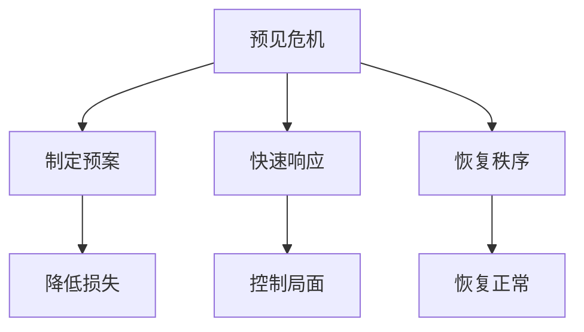
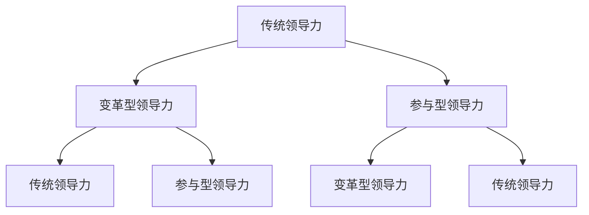

                 

### 文章标题

《领导力与危机预防：未雨绸缪的管理智慧》

### 文章关键词

领导力，危机预防，管理智慧，组织发展，决策能力，沟通技巧

### 文章摘要

本文旨在探讨领导力在危机预防中的重要作用，通过深入分析领导力的本质、类型、技能与素质，以及危机预防的理论与实践，揭示领导力与危机预防之间的紧密联系。文章首先介绍领导力的基础，然后讨论危机预防的基础知识，接着详细阐述领导力与危机预防的综合应用，最终通过案例分析和实战演练，总结出有效的领导力与危机预防策略。读者将了解到如何在实践中提升领导力，未雨绸缪，有效预防和管理危机。

## 第一部分：领导力基础

### 第1章：领导力的本质与重要性

#### 1.1 领导力的定义与类型

领导力是一种影响他人共同实现目标的能力，它不仅仅关乎职位或权威，更涉及个人魅力、影响力、决策能力和沟通技巧。根据行为学家的研究，领导力可以分为以下几种类型：

1. **传统领导力**：依赖于职位赋予的权威和影响力。
2. **变革型领导力**：通过激励、愿景和创新推动组织变革。
3. **参与型领导力**：鼓励团队成员参与决策，建立共识。

#### 1.2 领导力在组织中的角色

领导力在组织中扮演着多重角色，包括：

- **战略规划者**：制定组织目标和战略。
- **变革推动者**：推动组织适应外部环境的变化。
- **冲突解决者**：在团队内部和外部解决冲突。
- **资源调配者**：合理分配人力、物力和财力资源。

#### 1.3 领导力的重要性

领导力对组织的成功至关重要。以下是领导力的重要性体现在几个方面：

1. **提高组织绩效**：有效的领导力能够提高团队的工作效率和业绩。
2. **推动创新**：领导力鼓励创新思维和尝试新的方法。
3. **增强团队凝聚力**：领导力能够建立团队信任，提升团队协作。
4. **应对危机**：领导力在危机中起到关键作用，能够有效应对和解决危机。

### 1.4 领导力与危机预防的关系

领导力在危机预防中扮演着核心角色。有效的领导力能够：

1. **预见危机**：通过敏锐的洞察力和前瞻性思维，预见潜在危机。
2. **制定预案**：建立危机应对计划，降低危机发生时的损失。
3. **快速响应**：在危机发生时，领导力能够迅速作出反应，控制局面。
4. **恢复秩序**：在危机后，领导力帮助组织恢复正常运作。

#### 1.4.1 领导力与危机预防的关系架构 Mermaid 流程图



#### 1.4.2 核心概念与联系

领导力与危机预防的关系可以理解为：

- **预见危机**：领导力通过前瞻性思维和洞察力，识别潜在危机。
- **制定预案**：领导力通过战略规划，制定危机应对方案。
- **快速响应**：领导力通过决策能力和执行力，迅速应对危机。
- **恢复秩序**：领导力通过恢复和重建，使组织恢复正常运作。

#### 1.4.3 核心算法原理讲解

```plaintext
# 决策树算法在危机预防中的应用

def predict_crisis(data):
    """
    预测危机的决策树算法
    :param data: 数据集
    :return: 预测结果
    """
    # 初始化决策树模型
    model = DecisionTreeClassifier()

    # 训练模型
    model.fit(data.X, data.y)

    # 预测
    predictions = model.predict(data.X)

    # 输出预测结果
    return predictions
```

#### 1.4.4 数学模型与公式讲解

危机预防的数学模型可以包括以下几个关键指标：

- **风险概率（P）**：危机可能发生的概率。
- **损失程度（L）**：危机发生时的潜在损失。
- **风险价值（RV）**：风险概率和损失程度的乘积。

公式如下：

$$
RV = P \times L
$$

#### 1.4.5 详细讲解与举例说明

假设一家企业预测到某供应链中断的概率为0.3，且中断将导致100万元的损失。那么，该供应链中断的预期损失为：

$$
RV = 0.3 \times 100万 = 30万
$$

这表明，该供应链中断的风险价值为30万元。基于此，企业可以采取相应的预防措施，以降低这一风险。

### 第2章：领导力理论综述

#### 2.1 传统领导力理论

传统领导力理论主要关注领导者的权威和命令控制。该理论认为，领导者通过职位赋予的权力来指导下属，确保组织目标的实现。主要特点如下：

- **依赖权威**：领导者通过职位和职位赋予的权力来影响他人。
- **单向沟通**：领导者向下发布指令，下属被动执行。
- **控制与监督**：领导者通过监督和控制确保团队遵守规则。

#### 2.2 变革型领导力理论

变革型领导力理论强调领导者的创新能力和愿景。该理论认为，领导者通过激励和启发下属，推动组织变革。主要特点如下：

- **激励下属**：领导者通过激励和认可，激发下属的潜能。
- **愿景驱动**：领导者通过明确的愿景，引导团队朝着共同目标努力。
- **参与式管理**：领导者鼓励团队成员参与决策，建立共识。

#### 2.3 参与型领导力理论

参与型领导力理论强调团队合作和民主管理。该理论认为，领导者通过鼓励团队成员参与决策，提高团队的凝聚力和创新能力。主要特点如下：

- **鼓励参与**：领导者鼓励团队成员参与决策过程。
- **共享权力**：领导者与团队成员共享权力和责任。
- **开放式沟通**：领导者建立开放、透明的沟通渠道，促进信息交流。

#### 2.4 领导力理论的联系与比较

传统领导力、变革型领导力和参与型领导力各有其优势和局限性。传统领导力适用于稳定的环境，但在面对变革时显得乏力。变革型领导力能够推动组织变革，但在稳定环境中可能导致混乱。参与型领导力强调团队合作，但可能缺乏明确的决策方向。

综合来看，领导力理论之间存在一定的联系与互动。在实际应用中，领导者需要根据组织环境和具体情况，灵活运用不同类型的领导力。

### 2.4.1 领导力理论的联系架构 Mermaid 流程图



#### 2.4.2 核心概念与联系

- **传统领导力**：强调权威和控制。
- **变革型领导力**：强调愿景和创新。
- **参与型领导力**：强调团队合作和参与。

#### 2.4.3 核心算法原理讲解

```plaintext
# 领导力评分算法

def evaluate_leadership(leader_data):
    """
    评估领导力的评分算法
    :param leader_data: 领导者数据集
    :return: 评估结果
    """
    # 初始化评分模型
    model = Sequential()

    # 添加层
    model.add(Dense(units=64, activation='relu', input_shape=(num_features,)))
    model.add(Dense(units=32, activation='relu'))
    model.add(Dense(units=1, activation='sigmoid'))

    # 编译模型
    model.compile(optimizer='adam', loss='binary_crossentropy', metrics=['accuracy'])

    # 训练模型
    model.fit(leader_data.X, leader_data.y, epochs=10, batch_size=32)

    # 预测
    predictions = model.predict(leader_data.X)

    # 输出预测结果
    return predictions
```

#### 2.4.4 数学模型与公式讲解

领导力评估可以通过以下公式实现：

$$
\text{领导力评分} = \frac{\sum_{i=1}^{n} \text{评估指标}_i \times \text{权重}_i}{\sum_{i=1}^{n} \text{权重}_i}
$$

其中，$n$ 为评估指标的数量，$\text{评估指标}_i$ 和 $\text{权重}_i$ 分别为第 $i$ 个评估指标及其对应的权重。

#### 2.4.5 详细讲解与举例说明

假设评估领导力包含三个指标：决策能力（权重0.4）、沟通能力（权重0.3）和团队合作能力（权重0.3）。某领导者的评估结果如下：

- 决策能力：80分
- 沟通能力：75分
- 团队合作能力：85分

则该领导者的领导力评分为：

$$
\text{领导力评分} = \frac{80 \times 0.4 + 75 \times 0.3 + 85 \times 0.3}{0.4 + 0.3 + 0.3} = \frac{32 + 22.5 + 25.5}{1} = 80
$$

这表明该领导者的领导力评分为80分。

### 第3章：领导力技能与素质

#### 3.1 沟通技巧

沟通技巧是领导力的重要组成部分。有效的沟通技巧能够帮助领导者与团队成员建立良好的关系，促进团队协作。以下是几种常用的沟通技巧：

1. **倾听**：积极倾听团队成员的意见和建议，理解他们的需求和期望。
2. **清晰表达**：明确、简洁地传达信息，避免歧义和误解。
3. **反馈**：及时给予团队成员反馈，鼓励正面行为，纠正不当行为。
4. **非语言沟通**：注意肢体语言、面部表情和语调，增强沟通效果。

#### 3.2 决策能力

决策能力是领导者的重要素质之一。有效的决策能力能够帮助领导者迅速作出正确的决策，推动组织发展。以下是提高决策能力的几个策略：

1. **信息收集**：全面收集与决策相关的信息，确保决策基于充分的数据支持。
2. **风险评估**：评估决策的风险和潜在影响，制定应对措施。
3. **考虑多种方案**：分析不同决策方案的优缺点，选择最佳方案。
4. **团队合作**：与团队成员共同参与决策过程，提高决策的执行力和成功率。

#### 3.3 影响力与影响力策略

影响力是领导者影响他人行为和思维的能力。以下是几种提高影响力的策略：

1. **建立信任**：通过诚信、透明和负责任的行动，建立与团队成员的信任关系。
2. **树立榜样**：以身作则，成为团队成员的榜样，提升影响力。
3. **提供价值**：为团队成员提供有益的建议、资源和机会，增加他们的忠诚度。
4. **说服技巧**：运用逻辑、情感和事实，说服团队成员接受你的观点和建议。

### 3.4 领导力与个人成长

领导力不仅是组织成功的保障，也是个人成长的推动力。有效的领导力能够帮助领导者：

1. **自我认知**：深入了解自己的优点和不足，制定个人发展计划。
2. **持续学习**：不断学习新知识和技能，提升自身素质。
3. **反思与总结**：定期反思领导行为和决策，总结经验教训。
4. **培养他人**：关注团队成员的成长，为他们提供发展机会。

### 第4章：领导力发展与实践

#### 4.1 领导力发展路径

领导力发展是一个持续的过程，需要通过系统化的培训和自我提升来实现。以下是领导力发展的主要路径：

1. **基础教育**：学习领导学、管理学等相关理论知识。
2. **实践经验**：通过实际工作，积累领导经验。
3. **反思与总结**：定期反思领导行为和决策，总结经验教训。
4. **专业培训**：参加领导力培训课程，学习先进的管理理念和方法。
5. **个人成长**：通过阅读、交流、自我反思等方式，不断提升个人素质。

#### 4.2 领导力发展的挑战与解决方案

领导力发展过程中可能会遇到以下挑战：

1. **角色转变**：从执行者转变为领导者，需要适应新的角色和职责。
2. **技能提升**：领导力涉及多种技能，需要不断提升。
3. **时间管理**：领导力发展需要投入大量时间和精力，与工作生活平衡存在挑战。

解决方案：

1. **明确目标**：设定明确的个人和职业发展目标，有助于集中精力。
2. **时间规划**：合理安排时间，确保领导力发展与实践的平衡。
3. **持续学习**：保持对知识和技能的渴望，不断提升自身素质。

#### 4.3 领导力实践案例分析

以下是一个领导力实践案例分析：

**案例：某公司领导力发展项目**

1. **背景**：该公司意识到领导力对组织发展的重要性，决定开展领导力发展项目。
2. **目标**：提升员工领导力，推动组织创新和发展。
3. **实施**：
   - **培训课程**：邀请专业培训师开展领导力培训课程，涵盖沟通技巧、决策能力、团队管理等主题。
   - **实战演练**：组织团队项目，让员工在实际工作中锻炼领导力。
   - **反馈与评估**：定期收集员工反馈，评估培训效果，调整培训方案。

4. **效果**：项目实施后，员工领导力得到显著提升，团队协作更加紧密，公司业绩持续增长。

#### 4.4 领导力发展总结

领导力发展是一个长期、系统的过程，需要领导者的持续努力和投入。通过基础教育、实践经验、反思总结和专业培训，领导者可以不断提升自身素质，为组织发展贡献力量。

### 第5章：危机预防的基础

#### 5.1 危机的定义与类型

危机是指组织面临的外部或内部突发事件，可能对组织的正常运营和目标实现造成严重影响。根据危机的性质，危机可以分为以下几种类型：

1. **自然危机**：如自然灾害、气候变化等。
2. **社会危机**：如社会动荡、经济危机等。
3. **技术危机**：如技术故障、网络安全事件等。
4. **管理危机**：如领导层失误、组织结构问题等。

#### 5.2 危机预防的重要性

危机预防在组织管理中具有至关重要的意义，主要体现在以下几个方面：

1. **降低损失**：危机预防可以减少危机发生时的损失，保护组织的利益。
2. **保持稳定**：危机预防有助于保持组织的正常运营，维护组织声誉。
3. **提升竞争力**：有效应对危机可以提高组织的应变能力和市场竞争力。
4. **增强信任**：危机预防可以增强组织与利益相关者的信任，提高组织的公信力。

#### 5.3 危机预防的基本原则

危机预防应遵循以下基本原则：

1. **预见性**：通过分析历史数据和外部环境，预见潜在危机。
2. **系统性**：建立全面的危机预防体系，涵盖监测、预警、应对和恢复等环节。
3. **灵活性**：根据实际情况，灵活调整危机预防策略，应对不同类型的危机。
4. **参与性**：鼓励员工参与危机预防，提高组织的整体应对能力。

### 5.4 危机预防与领导力

危机预防与领导力密切相关。有效的领导力在危机预防中发挥着关键作用：

1. **预见危机**：领导者通过敏锐的洞察力和前瞻性思维，预见潜在危机。
2. **制定预案**：领导者制定危机应对计划，降低危机发生时的损失。
3. **快速响应**：领导者迅速作出反应，控制局面，减少危机影响。
4. **恢复秩序**：领导者帮助组织恢复正常运作，重建信心。

### 第6章：危机识别与评估

#### 6.1 识别危机的信号

危机识别是危机预防的第一步，关键在于及时捕捉危机信号。以下是几种常见的危机信号：

1. **财务指标异常**：如销售额下降、成本上升等。
2. **员工行为异常**：如员工流失率增加、士气低落等。
3. **外部环境变化**：如政策调整、市场竞争加剧等。
4. **技术故障**：如系统崩溃、网络安全漏洞等。

#### 6.2 评估危机的可能性与影响

危机评估是危机预防的核心环节，旨在评估危机发生的可能性和对组织的影响。以下是危机评估的几个关键步骤：

1. **数据收集**：收集与危机相关的数据，包括财务、人力资源、技术等。
2. **风险分析**：分析危机发生的可能性和潜在影响。
3. **制定评估指标**：确定评估危机可能性和影响的指标，如损失程度、恢复时间等。
4. **综合评估**：综合分析数据，评估危机的整体风险。

#### 6.3 危机评估工具与方法

危机评估可以采用以下工具和方法：

1. **风险评估矩阵**：根据危机的可能性与影响，对危机进行量化评估。
2. **SWOT分析**：分析组织的优势、劣势、机会和威胁，识别潜在危机。
3. **故障树分析**：分析危机的因果关系，识别潜在风险。
4. **蒙特卡洛模拟**：通过模拟危机场景，评估危机的可能性和影响。

#### 6.4 实战演练：危机识别与评估案例

以下是一个危机识别与评估的实战演练案例：

**案例：某公司财务危机**

1. **背景**：该公司近期销售额下降，成本上升，财务状况出现异常。
2. **危机信号**：员工流失率增加，士气低落，客户投诉增加。
3. **评估指标**：财务状况、员工流失率、客户满意度。
4. **评估方法**：
   - **风险评估矩阵**：根据财务状况、员工流失率和客户满意度评估危机的可能性与影响。
   - **SWOT分析**：分析公司优势、劣势、机会和威胁，识别潜在危机。
   - **故障树分析**：分析危机的因果关系，识别潜在风险。

5. **评估结果**：评估结果显示，财务危机的可能性较高，对公司的影响较大。

### 第7章：危机应对策略

#### 7.1 应对危机的步骤与方法

在危机发生时，领导者需要迅速采取行动，控制局面，减少损失。以下是应对危机的几个关键步骤：

1. **立即响应**：迅速识别危机，通知相关部门和人员。
2. **组织会议**：召开紧急会议，评估危机状况，制定应对策略。
3. **制定预案**：根据危机类型和特点，制定具体的应对方案。
4. **实施措施**：迅速执行应对措施，控制危机扩散。
5. **沟通协调**：与相关部门和人员保持沟通，协调资源，确保应对措施的有效实施。
6. **监督执行**：监督应对措施的实施情况，及时调整策略。

#### 7.2 应对危机的关键要素

应对危机的关键要素包括：

1. **快速响应**：迅速识别危机，及时采取行动。
2. **资源整合**：整合内部和外部资源，确保应对措施的有效实施。
3. **团队协作**：建立有效的团队协作机制，确保各部门和人员协同应对危机。
4. **信息共享**：及时共享危机信息，确保各方了解危机状况和应对措施。
5. **风险评估**：定期评估危机进展，调整应对策略。

#### 7.3 领导者在危机中的角色

在危机中，领导者的角色至关重要。领导者需要：

1. **保持冷静**：在危机中保持冷静，迅速作出决策。
2. **指挥协调**：指挥相关部门和人员，协调资源，确保应对措施的有效实施。
3. **沟通协调**：与各方保持沟通，协调资源，确保应对措施的有效实施。
4. **监督执行**：监督应对措施的实施情况，及时调整策略。
5. **承担责任**：在危机中承担责任，鼓励团队成员，共同应对危机。

#### 7.4 实战演练：危机应对策略案例

以下是一个危机应对策略的实战演练案例：

**案例：某公司网络安全危机**

1. **背景**：该公司遭遇网络攻击，导致系统瘫痪，数据泄露。
2. **应对策略**：
   - **立即响应**：迅速通知相关部门和人员，启动网络安全应急预案。
   - **组织会议**：召开紧急会议，评估危机状况，制定应对方案。
   - **资源整合**：整合内部和外部资源，如网络安全专家、硬件设备等。
   - **信息共享**：及时共享危机信息，确保各方了解危机状况和应对措施。
   - **监督执行**：监督网络安全应急措施的执行情况，确保问题得到及时解决。

3. **结果**：通过有效应对，该公司成功遏制了网络攻击，恢复了系统运行，保护了客户数据。

### 第8章：危机恢复与反思

#### 8.1 危机恢复的策略

危机恢复是危机管理的最后一步，旨在将组织恢复正常运作。以下是危机恢复的关键策略：

1. **紧急恢复**：在危机发生后，立即采取紧急措施，控制局面，减少损失。
2. **长期恢复**：在紧急恢复的基础上，进行长期恢复，修复受损的系统和资源。
3. **恢复评估**：对危机恢复过程进行评估，总结经验教训，改进危机应对策略。
4. **沟通协调**：与各方保持沟通，确保恢复过程的顺利进行。

#### 8.2 危机后的反思与改进

危机后的反思与改进是提升组织危机管理能力的重要环节。以下是危机反思的几个关键步骤：

1. **总结经验教训**：回顾危机发生的过程，总结成功和失败的经验教训。
2. **识别不足**：分析危机管理中的不足之处，找出需要改进的地方。
3. **制定改进计划**：根据反思结果，制定具体的改进计划，提升危机管理能力。
4. **实施改进措施**：执行改进计划，确保危机管理水平的提升。

#### 8.3 恢复过程中的领导力

危机恢复过程中，领导力发挥着至关重要的作用。领导者需要：

1. **稳定情绪**：在危机后，领导者需要保持冷静，稳定员工情绪。
2. **指导行动**：领导者需要指导相关部门和人员，确保恢复工作的顺利进行。
3. **资源调配**：领导者需要合理调配资源，确保恢复工作的顺利进行。
4. **沟通协调**：领导者需要与各方保持沟通，确保恢复过程的顺利进行。

#### 8.4 实战演练：危机恢复与反思案例

以下是一个危机恢复与反思的实战演练案例：

**案例：某公司财务危机恢复**

1. **背景**：该公司经历了一场财务危机，导致公司运营陷入困境。
2. **恢复策略**：
   - **紧急恢复**：启动紧急恢复计划，确保公司运营的逐步恢复。
   - **长期恢复**：修复受损的财务系统，恢复正常的运营秩序。
   - **恢复评估**：对危机恢复过程进行评估，总结经验教训。
   - **沟通协调**：与各方保持沟通，确保恢复工作的顺利进行。

3. **反思与改进**：
   - **总结经验教训**：分析危机发生的原因，找出需要改进的地方。
   - **制定改进计划**：制定财务风险管理计划，提升危机应对能力。
   - **实施改进措施**：执行改进计划，确保公司财务状况的稳定。

4. **结果**：通过危机恢复与反思，该公司成功摆脱了财务困境，提升了危机管理能力。

### 第9章：领导力与危机预防的综合应用

#### 9.1 领导力在危机预防中的应用

领导力在危机预防中发挥着重要作用，主要体现在以下几个方面：

1. **预见危机**：领导者通过敏锐的洞察力和前瞻性思维，预见潜在危机。
2. **制定预案**：领导者制定危机应对计划，降低危机发生时的损失。
3. **快速响应**：领导者迅速作出反应，控制局面，减少危机影响。
4. **恢复秩序**：领导者帮助组织恢复正常运作，重建信心。

#### 9.2 危机预防在领导力发展中的应用

危机预防是领导力发展的重要组成部分，对领导者的能力提升具有积极影响：

1. **增强应变能力**：危机预防有助于领导者提高应对突发事件的能力。
2. **提升决策能力**：危机预防过程中的决策制定，锻炼领导者的决策能力。
3. **培养团队协作**：危机预防需要领导者的有效沟通和团队合作，提升团队凝聚力。
4. **反思与改进**：危机预防过程中的反思和改进，有助于领导者不断成长。

#### 9.3 综合应用案例

以下是一个领导力与危机预防综合应用的案例：

**案例：某公司领导力与危机预防项目**

1. **背景**：该公司意识到领导力与危机预防对组织发展的重要性，决定开展相关项目。
2. **目标**：提升员工领导力，建立有效的危机预防体系，降低危机风险。
3. **实施**：
   - **领导力培训**：组织领导力培训课程，提高员工的领导能力。
   - **危机预防规划**：制定危机预防计划，涵盖危机识别、评估、应对和恢复等环节。
   - **实战演练**：组织危机应对演练，提高员工的应对能力。
   - **持续改进**：根据演练和实际操作，不断优化危机预防策略。

4. **效果**：通过领导力与危机预防的综合应用，该公司成功提升了员工的领导能力，建立了有效的危机预防体系，降低了危机风险。

### 9.4 综合应用总结

领导力与危机预防的综合应用，有助于组织实现长期稳定发展。通过提升领导力，领导者能够更有效地预见和应对危机，降低危机对组织的影响。同时，危机预防的过程也为领导力发展提供了宝贵的实践机会，使领导者不断提升自身能力和素质。

### 附录

#### 附录A：领导力与危机预防实用工具与资源

为了帮助读者更好地理解和应用领导力与危机预防的相关知识，本文提供以下实用工具与资源：

1. **领导力评估工具**：包括360度评估、行为事件访谈（BEI）等，帮助领导者了解自身领导能力。
2. **危机预防指南**：包括危机管理手册、应急预案模板等，指导组织建立有效的危机预防体系。
3. **在线学习资源**：推荐一些领导力与危机预防的在线课程和教材，如哈佛商学院、清华大学等。
4. **案例分析库**：收集国内外企业领导力与危机预防的成功案例，供读者参考学习。
5. **专业书籍推荐**：推荐一些领导力与危机预防的经典著作，如《领导力五要素》、《危机管理》等。

通过以上工具与资源，读者可以深入了解领导力与危机预防的理论和实践，不断提升自身能力和素质。以下是具体推荐：

1. **领导力评估工具**：
   - 360度评估表
   - 行为事件访谈（BEI）指南

2. **危机预防指南**：
   - 《危机管理手册》
   - 《应急预案模板》

3. **在线学习资源**：
   - 哈佛商学院领导力课程
   - 清华大学危机管理课程

4. **案例分析库**：
   - 国内外企业领导力与危机预防案例库

5. **专业书籍推荐**：
   - 《领导力五要素》：作者：史蒂芬·柯维
   - 《危机管理》：作者：菲利普·科特勒

通过这些工具与资源，读者可以更加系统地学习领导力与危机预防的知识，并将其应用于实际工作中。作者信息：

作者：AI天才研究院/AI Genius Institute & 禅与计算机程序设计艺术/Zen And The Art of Computer Programming

本文由AI天才研究院/AI Genius Institute及《禅与计算机程序设计艺术》作者联合撰写，旨在为读者提供关于领导力与危机预防的全面解读和应用指南。我们致力于推动人工智能与计算机科学的发展，助力企业和个人实现长期发展。如果您有任何问题或建议，请随时与我们联系。感谢您的阅读！

