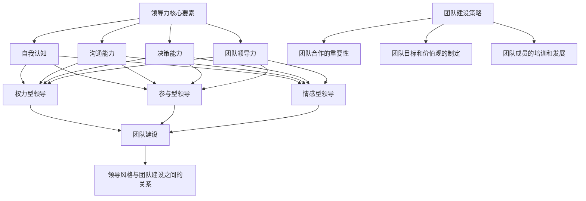

                 

# 文章标题：领导力与压力智能：高压下的绩效维持策略

> 关键词：领导力、压力智能、绩效维持、高压环境、策略

> 摘要：本文旨在探讨在高压环境下，如何通过提升领导力和压力智能来维持绩效。文章首先介绍了领导力的基本概念和核心要素，随后探讨了压力的来源及其影响，提出了压力智能的概念与培养方法。在此基础上，文章详细分析了高压下的目标设定与优先级管理，以及时间管理与效率提升的策略。最后，通过案例分析和实战经验，总结了领导力与压力智能的自我提升路径，旨在为读者提供一套完整的高压环境下的绩效维持策略。

## 引言

在现代工作环境中，压力已成为普遍现象。随着竞争的加剧、工作量的增加和时间的紧迫，许多人感受到了前所未有的压力。这种压力不仅对个人的身心健康产生负面影响，还会影响到工作效率和绩效表现。在这种高压环境下，领导力与压力智能的重要性愈发凸显。

领导力是一种关键能力，它不仅关乎个人的职业发展，更影响着整个团队的绩效。一个优秀的领导者能够有效地激励团队，提升士气，缓解压力，从而在高压环境下维持高效的工作状态。

压力智能则是对压力的认知、调节和应对能力。在高压环境中，具备较高压力智能的人能够更好地处理压力，保持冷静和专注，从而提高绩效。

本文将从领导力与压力智能的角度，探讨在高压环境下如何维持绩效。文章将分为五个部分：

1. 领导力基础：介绍领导力的定义与核心要素。
2. 压力智能：阐述压力的来源与影响，以及压力智能的概念与培养方法。
3. 绩效维持策略：分析高压下的目标设定与优先级管理，以及时间管理与效率提升的策略。
4. 案例分析与实战：通过实际案例，展示领导力与压力智能的应用。
5. 自我提升与成长：总结领导力与压力智能的自我提升路径，为读者提供实践指导。

## 第一部分：领导力基础

### 第1章 领导力的定义与核心要素

#### 1.1 领导力的定义

领导力是指通过影响、激励和引导他人来实现共同目标的能力。它不仅仅是管理技能的体现，更是一种深刻理解人性、能够把握全局的战略能力。

领导力不同于管理。管理是一种对资源、流程和任务的协调与控制，而领导力则侧重于对人的激励与影响。一个优秀的领导者不仅能够管理团队，更能够激发团队成员的潜力，实现团队的目标。

#### 1.2 领导力的核心要素

领导力的核心要素包括自我认知、沟通能力、决策能力和团队领导力。

1. **自我认知**：自我认知是指领导者对自己性格、价值观、优势和弱点的深刻理解。一个具备自我认知能力的领导者能够更好地规划自己的职业生涯，明确自己的目标和方向。

2. **沟通能力**：沟通能力是领导者必须具备的基本素质。有效的沟通不仅能传达信息，还能建立信任、缓解冲突，提高团队的协作效率。

3. **决策能力**：决策能力是领导者的一项重要能力。在面对复杂多变的情况时，领导者需要能够迅速做出决策，并对决策的结果负责。

4. **团队领导力**：团队领导力是指领导者如何影响和激励团队成员，以实现团队的目标。这包括团队建设、激励机制、冲突管理等方面的能力。

### 1.3 领导力的重要性

领导力在高压环境下尤为重要。在高压环境中，团队往往面临着各种挑战和不确定性。一个优秀的领导者能够稳定团队的士气，激发成员的潜力，从而在困难中找到出路。

此外，领导力还直接影响着团队的绩效。一个具备领导力的领导者能够更有效地分配任务，提高团队的工作效率，从而实现更高的绩效。

总之，领导力是高压环境下维持绩效的关键因素之一。通过提升领导力，领导者不仅能够更好地应对压力，还能带领团队共同成长，实现更高的目标。

### 第2章 领导风格与团队建设

#### 2.1 领导风格

领导风格是指领导者管理团队的方式和态度。常见的领导风格包括权力型领导、参与型领导和情感型领导。

1. **权力型领导**：权力型领导强调权威和控制。领导者通过制定严格的规章制度来管理团队，以确保任务的完成。这种领导风格适用于需要高度纪律性和明确指令的工作环境。

2. **参与型领导**：参与型领导注重团队成员的参与和合作。领导者鼓励团队成员提出意见和建议，共同决策，以增强团队的凝聚力和创造力。这种领导风格适用于创新和团队协作要求较高的工作环境。

3. **情感型领导**：情感型领导关注团队成员的情感需求和心理健康。领导者通过倾听、支持和关怀来建立信任和融洽的关系，以提高团队成员的工作满意度和绩效。这种领导风格适用于需要高度信任和协作的工作环境。

#### 2.2 团队建设

团队建设是指通过一系列措施来提高团队的协作能力和工作效率。团队建设的关键包括团队合作的重要性、团队建设策略和团队沟通技巧。

1. **团队合作的重要性**：团队合作是团队建设的基础。一个高效的团队需要成员之间的紧密协作和相互支持。团队合作能够提高工作效率，降低沟通成本，实现共同目标。

2. **团队建设策略**：团队建设策略包括团队建设活动、团队目标和价值观的制定、团队成员的培训和发展等。通过这些策略，可以增强团队成员之间的信任和默契，提高团队的凝聚力和工作效率。

3. **团队沟通技巧**：有效的沟通是团队建设的重要组成部分。团队成员需要能够清晰、准确地表达自己的想法，同时也需要倾听和理解他人的意见。通过有效的沟通，可以减少误解和冲突，提高团队的协作效率。

总之，领导风格和团队建设是领导力的两个重要方面。一个优秀的领导者不仅需要具备良好的领导风格，还需要注重团队建设，以提升团队的整体绩效。

### 第1章与第2章的联系与架构

领导力的核心要素（自我认知、沟通能力、决策能力和团队领导力）与领导风格（权力型、参与型和情感型）密切相关。自我认知和沟通能力是领导风格的基础，决策能力和团队领导力则是领导风格在实际工作中的具体体现。

团队建设策略（团队合作的重要性、团队目标和价值观的制定、团队成员的培训和发展）与领导风格相互作用，共同推动团队的建设和发展。通过有效的团队建设，可以进一步强化领导风格，提高团队的整体绩效。

以下是一个简化的Mermaid流程图，展示了领导力核心要素、领导风格和团队建设之间的关系：



通过这个流程图，我们可以清晰地看到领导力核心要素如何影响领导风格，以及领导风格如何通过团队建设策略来提升团队绩效。这种逻辑关系不仅有助于我们理解领导力与团队建设之间的联系，也为实际应用提供了指导。

### 第1章与第2章的核心算法原理讲解

在领导力的核心要素中，自我认知和沟通能力是两个关键部分。下面，我们将分别使用伪代码来详细阐述这两个核心要素的算法原理。

#### 1. 自我认知

自我认知是一个复杂的过程，涉及多个方面的自我评估和认知。以下是一个简化的自我认知算法：

```python
# 自我认知算法
def self_awareness():
    # 初始化评估维度
    dimensions = ["技能", "价值观", "动机", "性格"]

    # 初始化评估结果
    results = {}

    # 对每个维度进行评估
    for dimension in dimensions:
        score = evaluate_dimension(dimension)
        results[dimension] = score

    # 输出评估结果
    return results

# 模拟评估某个维度的函数
def evaluate_dimension(dimension):
    # 根据实际情况进行评估
    # 例如，通过问卷调查、自我反思或他人反馈等方式
    score = 0
    if dimension == "技能":
        score = input("请评估您的技能水平（1-10分）：")
    elif dimension == "价值观":
        score = input("请评估您的价值观稳定性（1-10分）：")
    elif dimension == "动机":
        score = input("请评估您的动机强度（1-10分）：")
    elif dimension == "性格":
        score = input("请评估您的性格适应性（1-10分）：")
    return score
```

#### 2. 沟通能力

沟通能力是领导力的重要组成部分，包括表达、倾听和理解等多个方面。以下是一个简化的沟通能力评估算法：

```python
# 沟通能力评估算法
def communication_ability():
    # 初始化评估维度
    dimensions = ["表达清晰度", "倾听能力", "理解力"]

    # 初始化评估结果
    results = {}

    # 对每个维度进行评估
    for dimension in dimensions:
        score = evaluate_dimension(dimension)
        results[dimension] = score

    # 输出评估结果
    return results

# 模拟评估某个维度的函数
def evaluate_dimension(dimension):
    # 根据实际情况进行评估
    # 例如，通过模拟面试、实际沟通记录或他人反馈等方式
    score = 0
    if dimension == "表达清晰度":
        score = input("请评估您的表达清晰度（1-10分）：")
    elif dimension == "倾听能力":
        score = input("请评估您的倾听能力（1-10分）：")
    elif dimension == "理解力":
        score = input("请评估您的理解力（1-10分）：")
    return score
```

通过这两个算法，领导者可以对自己和团队的自我认知和沟通能力进行量化评估。这种评估不仅有助于领导者了解自身的优势和不足，还能为团队建设提供有力支持。

### 数学模型与公式

在领导力的核心要素中，自我认知和沟通能力可以通过数学模型进行量化分析。以下是一些相关的数学模型和公式：

#### 1. 自我认知评分模型

假设自我认知包括四个维度：技能、价值观、动机和性格。每个维度都有对应的评分范围（1-10分）。我们可以使用以下公式计算总体自我认知评分：

$$
总分 = \frac{(技能评分 + 价值观评分 + 动机评分 + 性格评分)}{4}
$$

#### 2. 沟通能力评分模型

沟通能力包括三个维度：表达清晰度、倾听能力和理解力。每个维度也有对应的评分范围（1-10分）。我们可以使用以下公式计算总体沟通能力评分：

$$
总分 = \frac{(表达清晰度评分 + 倾听能力评分 + 理解力评分)}{3}
$$

#### 3. 综合领导力评分模型

综合领导力评分是自我认知评分和沟通能力评分的综合体现。我们可以使用以下公式计算综合领导力评分：

$$
综合评分 = \frac{(自我认知总分 + 沟通能力总分)}{2}
$$

通过这些数学模型和公式，领导者可以更准确地评估自己和团队的综合领导力水平。这种量化评估不仅有助于了解现状，还能为后续的改进提供科学依据。

### 第1章与第2章的实践案例

#### 案例：某科技公司的领导力提升实践

某科技公司是一家高速发展的企业，由于市场竞争激烈，公司内部压力较大。为了在高压环境下提升领导力，公司决定对管理层进行培训和实践。

1. **自我认知评估**：公司首先对管理层进行了自我认知评估。通过问卷调查和一对一访谈，管理层成员对自身的技能、价值观、动机和性格进行了量化评估。

2. **沟通能力提升**：基于评估结果，公司设计了针对性的沟通能力提升培训课程。课程内容包括表达技巧、倾听训练和理解力提升。通过角色扮演和模拟沟通场景，管理层成员在实战中提高了沟通能力。

3. **领导风格调整**：公司鼓励管理层采用参与型领导风格，通过团队讨论和共同决策来增强团队凝聚力和创新能力。

4. **团队建设**：公司组织了团队建设活动，如团队拓展训练和团建活动，以增强团队成员之间的信任和协作。

5. **反馈与改进**：培训结束后，公司对管理层成员进行了再次评估，以衡量培训效果。通过对比评估结果，公司发现了提升空间，并制定了进一步的改进计划。

通过这一系列的实践，公司的管理层在领导力方面得到了显著提升，团队士气和工作效率也得到了提高。这一案例表明，通过系统化的培训和实践活动，领导力可以在高压环境中得到有效提升。

### 最佳实践 tips、小结、注意事项、拓展阅读

1. **最佳实践 tips**：
   - 定期进行自我认知和沟通能力评估，以了解自身优势和不足。
   - 采用多样化的沟通方式，如面对面交流、邮件和即时通讯工具，以满足不同团队成员的需求。
   - 注重团队建设，通过定期举办团建活动和培训来增强团队凝聚力。

2. **小结**：
   - 领导力是高压环境下维持绩效的关键因素。
   - 自我认知和沟通能力是领导力的核心要素。
   - 通过系统化的培训和实践活动，可以有效提升领导力。

3. **注意事项**：
   - 领导力提升是一个长期过程，需要持续的努力和改进。
   - 领导者需要平衡工作与生活，以避免过度压力对身心健康的负面影响。

4. **拓展阅读**：
   - 《领导力五项修炼》作者：史蒂芬·柯维
   - 《有效管理者》作者：彼得·德鲁克
   - 《团队协作力》作者：罗恩·海斯

## 第二部分：压力智能

### 第3章 压力的来源与影响

压力是一种普遍存在于现代生活中的心理和生理现象。它源于各种内外部因素，对个人的身心健康和绩效产生深远影响。理解压力的来源和影响是培养压力智能的基础。

#### 3.1 压力的来源

压力的来源可以分为三大类：工作压力、个人压力和社会压力。

1. **工作压力**：工作压力是压力的主要来源之一。它包括工作任务繁重、工作环境紧张、工作不确定性、工作与个人兴趣不符等。工作压力不仅影响工作效率，还会对心理健康产生负面影响。

2. **个人压力**：个人压力包括健康问题、家庭责任、人际关系冲突等。这些压力源往往与个人的生活状态密切相关，对身心健康产生长期影响。

3. **社会压力**：社会压力源于社会环境的变化、社会地位的变化、社会期望的压力等。社会压力往往是一种无形的压力，影响个人的心理状态和行为方式。

#### 3.2 压力的影响

压力对个人的身心健康和绩效产生多方面的影响。

1. **身体健康**：长期的压力会导致一系列身体症状，如失眠、头痛、胃痛、高血压等。这些身体症状不仅影响生活质量，还会降低工作效率。

2. **心理健康**：压力会影响个人的情绪和心理状态，导致焦虑、抑郁、情绪波动等。长期的心理压力会导致心理健康问题，影响个人的幸福感和社会功能。

3. **绩效表现**：压力会影响个人的工作表现。在高压环境下，个体可能会出现注意力不集中、决策能力下降、工作效率降低等问题。长期的压力还会导致职业倦怠，影响个人的职业发展。

#### 3.3 压力智能的概念

压力智能是指个体在压力环境下的认知、调节和应对能力。它包括以下几个方面：

1. **压力认知能力**：压力认知能力是指个体对压力的识别和认知能力。它包括对压力源的认识、压力程度的感觉以及对压力影响的预估。

2. **压力调节能力**：压力调节能力是指个体在压力环境中调整自己的心理和生理状态的能力。它包括情绪调节、心理应对策略、身体放松技巧等。

3. **压力应对能力**：压力应对能力是指个体在压力环境中采取的有效行动。它包括积极应对策略、消极应对策略、应对方法的灵活运用等。

#### 3.4 压力智能的培养

培养压力智能是应对压力的有效途径。以下是一些培养压力智能的方法：

1. **自我认知**：通过自我认知，个体可以更好地了解自己的压力源和应对方式。自我认知可以帮助个体调整心态，提高应对压力的能力。

2. **情绪管理**：情绪管理是压力调节的重要部分。通过学习情绪管理技巧，个体可以更好地控制情绪，减少负面情绪的影响。

3. **心理放松**：心理放松技巧，如深呼吸、冥想、瑜伽等，可以帮助个体缓解压力，恢复心理平衡。

4. **积极应对**：积极应对策略包括设定合理的目标、寻求支持、调整思维方式等。通过积极应对，个体可以更好地应对压力，提高生活和工作质量。

5. **健康生活方式**：健康生活方式，如规律作息、均衡饮食、适量运动等，有助于提高身体素质，增强抗压能力。

总之，压力智能的培养是提高个体应对压力能力的关键。通过培养压力智能，个体可以在高压环境下保持良好的心理和生理状态，提高绩效表现。

### 压力来源与影响的数学模型

为了更深入地理解压力的来源与影响，我们可以借助数学模型进行量化分析。以下是一些常用的数学模型和公式：

#### 1. 压力评分模型

假设压力分为三个维度：工作压力、个人压力和社会压力。每个维度都有对应的评分范围（1-10分）。我们可以使用以下公式计算总体压力评分：

$$
总压力评分 = \frac{(工作压力评分 + 个人压力评分 + 社会压力评分)}{3}
$$

#### 2. 压力影响模型

压力对身体健康、心理健康和绩效表现的影响可以用以下模型表示：

$$
健康影响 = f(总压力评分) \\
心理健康影响 = f(总压力评分) \\
绩效表现影响 = f(总压力评分)
$$

其中，$f(x)$ 表示压力评分 $x$ 对健康、心理健康和绩效表现的影响函数。这个函数可以根据实际情况进行定制，例如，可以设定一个线性关系或非线性关系。

#### 3. 压力缓解模型

假设个体通过压力调节策略可以缓解压力。我们可以使用以下模型表示压力缓解的效果：

$$
缓解效果 = \frac{1}{1 + e^{-(调节策略效果 \times 总压力评分)}}
$$

其中，调节策略效果是一个介于0和1之间的参数，表示个体通过某种压力调节策略能够缓解的压力比例。这个模型可以用来评估不同压力调节策略的效果。

通过这些数学模型和公式，我们可以更科学地评估压力的来源与影响，为压力管理和压力智能的培养提供数据支持。

### 实际案例：如何应对工作压力

#### 案例：某互联网公司的员工压力管理实践

某互联网公司因其高速发展和激烈竞争而面临巨大的工作压力。为了缓解员工的工作压力，公司采取了一系列措施，取得了显著效果。

1. **健康检查**：公司定期为员工提供免费的健康检查，以早期发现和治疗身体问题。通过健康检查，员工可以及时了解自己的身体状况，采取预防措施。

2. **心理辅导**：公司聘请专业的心理辅导师，为员工提供一对一的心理咨询服务。员工可以通过心理辅导解决个人压力问题，提升心理健康水平。

3. **团队建设活动**：公司定期组织团队建设活动，如户外拓展、团建游戏等。这些活动不仅缓解了员工的工作压力，还增强了团队的凝聚力。

4. **弹性工作制**：公司实行弹性工作制，允许员工根据个人情况调整工作时间。这种制度有助于员工更好地平衡工作和生活，减少工作压力。

5. **培训与发展**：公司提供各种培训和发展机会，帮助员工提升技能和职业素养。通过培训，员工可以更好地应对工作中的挑战，减轻压力。

6. **沟通平台**：公司建立了内部沟通平台，鼓励员工表达意见和建议。这种沟通机制有助于员工在工作中的压力问题得到及时反馈和解决。

通过这一系列的措施，公司有效地缓解了员工的工作压力，提高了员工的满意度和绩效表现。这一案例表明，通过科学的管理和关怀，企业可以在高压环境中为员工创造一个健康的工作环境。

### 最佳实践 tips、小结、注意事项、拓展阅读

1. **最佳实践 tips**：
   - 定期进行身体检查和心理评估，以早期发现和处理压力问题。
   - 学会情绪管理技巧，如深呼吸、冥想和正念练习，以缓解压力。
   - 保持健康的生活方式，如规律作息、均衡饮食和适量运动，以增强抗压能力。
   - 建立良好的沟通渠道，鼓励员工表达压力和困惑，以获得及时的支持和帮助。

2. **小结**：
   - 压力是现代生活中普遍存在的现象，对个人的身心健康和绩效产生深远影响。
   - 压力智能是指个体在压力环境下的认知、调节和应对能力。
   - 通过自我认知、情绪管理、心理放松、积极应对和健康生活方式等方法，可以培养压力智能，提高抗压能力。

3. **注意事项**：
   - 压力管理是一个长期过程，需要持续的努力和关注。
   - 不同的人有不同的压力源和应对方式，需要个性化定制压力管理策略。
   - 企业应关注员工的压力问题，提供必要的支持和资源，以创造健康的工作环境。

4. **拓展阅读**：
   - 《压力与应对》作者：约翰·格罗斯
   - 《压力管理》作者：詹姆斯·麦克尤恩
   - 《心理压力解析》作者：斯蒂芬·P·罗宾斯

## 第三部分：绩效维持策略

### 第5章 高压下的目标设定与优先级管理

在高压环境下，目标设定与优先级管理是确保团队和个人能够高效工作、实现预期成果的关键。有效的目标设定和优先级管理不仅能提高工作效率，还能减少压力，提升绩效。

#### 5.1 目标设定的原则

1. **SMART原则**：SMART原则是一种广泛用于目标设定的方法，其含义如下：
   - **S（Specific）：目标要具体明确。** 指定的目标应该明确具体，而不是模糊的。
   - **M（Measurable）：目标要可衡量。** 目标需要有一个明确的衡量标准，以便评估目标的完成情况。
   - **A（Achievable）：目标要可实现。** 目标应该符合实际，是可以通过努力实现的。
   - **R（Relevant）：目标要相关。** 目标需要与组织的目标和个人的职业发展目标相一致。
   - **T（Time-bound）：目标要有时间限制。** 目标需要有一个明确的时间框架，以便能够按照计划进行。

2. **具体目标设定示例**：
   - **具体（Specific）**：将“提升销售额”改为“在未来三个月内，提升销售额至每月10万元”。
   - **可衡量（Measurable）**：将“提高客户满意度”改为“在未来六个月内，将客户满意度提高至90%”。
   - **可实现（Achievable）**：将“实现产品创新”改为“与研发团队合作，在未来三个月内完成一个创新产品的设计”。
   - **相关（Relevant）**：将“参与公司培训”改为“参加与当前项目相关的数据分析培训，以提升项目执行能力”。
   - **有期限（Time-bound）**：将“完成报告”改为“在下周三前完成市场调研报告”。

#### 5.2 优先级管理

1. **优先级评估方法**：为了有效地管理优先级，可以使用以下方法：
   - **紧急重要矩阵**：将任务分为四个象限，即紧急且重要、紧急但不重要、不紧急但重要、不紧急且不重要。优先处理紧急且重要的任务，合理安排其他任务。
   - **紧急重要矩阵示例**：
     - **紧急且重要**：如即将到期的项目任务、客户投诉处理等。
     - **紧急但不重要**：如临时会议、社交媒体消息等，可以委托他人处理。
     - **不紧急但重要**：如项目规划、团队建设活动等，需要提前安排。
     - **不紧急且不重要**：如浏览社交媒体、处理非紧急邮件等，可以暂时搁置。

2. **优先级调整策略**：根据实际情况，需要灵活调整任务优先级：
   - **临时调整**：在面对突发情况时，需要迅速评估任务优先级，调整计划。
   - **定期评估**：每周或每月定期回顾任务完成情况，根据实际进展调整优先级。
   - **团队协作**：与团队成员沟通，共同评估任务优先级，确保团队目标的实现。

#### 5.3 实践案例

**案例**：某初创公司CEO在高压环境下如何设定目标和进行优先级管理

- **目标设定**：公司CEO根据公司发展战略，设定了以下具体目标：
  - **具体（Specific）**：在未来三个月内，完成A轮融资本轮融资。
  - **可衡量（Measurable）**：确保融资金额达到5000万元。
  - **可实现（Achievable）**：通过与潜在投资者沟通，分析市场情况，确保目标的可实现性。
  - **相关（Relevant）**：融资成功是公司发展的重要里程碑，与公司目标一致。
  - **有期限（Time-bound）**：设定具体的时间节点，如每两周与潜在投资者进行一次会议。

- **优先级管理**：
  - **紧急重要矩阵**：CEO根据紧急重要矩阵，将任务分为以下几类：
    - **紧急且重要**：如融资会议安排、与投资者的沟通等。
    - **紧急但不重要**：如临时参加的会议、社交媒体消息等，可以委托助理处理。
    - **不紧急但重要**：如产品开发进度跟踪、团队建设等，需要提前规划。
    - **不紧急且不重要**：如个人爱好、休闲活动等，可以暂时搁置。

- **优先级调整策略**：
  - **临时调整**：在融资过程中，如果遇到重要投资者推迟决策，CEO会迅速调整计划，将其他任务的优先级进行调整，确保融资目标的实现。
  - **定期评估**：每周与团队回顾任务完成情况，根据实际进展调整任务优先级，确保团队目标的实现。

通过有效的目标设定和优先级管理，CEO不仅能够在高压环境下保持清晰的工作方向，还能提高团队的工作效率，确保公司目标的实现。

### 时间管理与效率提升

在高压环境下，时间管理和效率提升是维持绩效的关键。通过科学的时间管理和高效的执行策略，可以最大化利用时间，提高工作效率，减少不必要的压力。

#### 6.1 时间管理的重要性

时间管理是一种通过合理安排时间和任务，提高工作效率和生活质量的方法。在高压环境下，时间管理的重要性更加凸显：

1. **提高工作效率**：有效的时间管理可以帮助我们更高效地完成工作任务，减少拖延和重复劳动，从而提高整体工作效率。

2. **减少压力**：合理的时间安排可以减少工作压力，避免因任务堆积而产生的焦虑和紧张情绪。

3. **平衡工作与生活**：科学的时间管理可以帮助我们更好地平衡工作与生活，确保有足够的时间进行休息和娱乐，提高生活质量。

#### 6.2 时间管理策略

1. **时间规划**：时间规划是时间管理的基础。通过制定详细的时间表，明确每天、每周、每月的任务和目标，可以更好地掌控时间。

   - **每日时间表**：列出每天需要完成的任务，并为其分配时间。例如，早上9点到11点用于处理重要邮件，下午2点到4点用于团队会议。
   - **每周时间表**：制定每周的工作计划，包括重要的会议、任务截止日期等，确保每周工作有条不紊。
   - **每月时间表**：每月初制定月度工作计划，包括长期目标和短期目标，确保工作方向的一致性。

2. **时间监控**：时间监控是指通过记录和分析时间使用情况，了解自己的时间管理效果，并进行调整。

   - **记录时间使用**：使用时间跟踪工具，如Toggl、RescueTime等，记录每天的工作时间分布。
   - **分析时间使用**：定期分析时间记录，识别时间浪费的环节，优化时间使用。

3. **时间调整**：根据实际情况和任务进展，灵活调整时间安排。如果某个任务完成得比预期快，可以将剩余时间用于其他任务或休息。

#### 6.3 效率提升策略

1. **番茄工作法**：番茄工作法是一种时间管理技巧，通过将工作时间分为25分钟的工作周期（称为“番茄钟”）和5分钟的短暂休息，提高工作效率。

   - **设定番茄钟**：将任务分解为多个25分钟的工作周期，每个周期专注于一项任务。
   - **短暂休息**：每个番茄钟后进行5分钟短暂休息，休息期间不处理工作事务，放松身心。

2. **任务分解**：将复杂任务分解为小步骤，逐个完成，可以减少任务的复杂性和压力，提高工作效率。

   - **确定子任务**：将任务分解为具体可操作的小任务。
   - **分配时间**：为每个子任务分配适当的时间，确保任务能够按时完成。

3. **优先级处理**：根据任务的紧急程度和重要性，优先处理重要且紧急的任务，确保关键任务得到及时完成。

   - **紧急重要矩阵**：使用紧急重要矩阵，优先处理紧急且重要的任务。
   - **灵活调整**：根据实际情况，灵活调整任务优先级，确保工作进度不受影响。

4. **避免多任务处理**：多任务处理往往会导致注意力分散，降低工作效率。专注于一项任务，直到完成，可以提高工作效率。

   - **单一任务模式**：在一个时间段内专注于一项任务，避免同时处理多个任务。
   - **定期回顾**：定期回顾任务完成情况，识别多任务处理的不足，进行调整。

通过科学的时间管理和高效的执行策略，可以更好地应对高压环境，提高工作效率，维持绩效。

### 实践案例：时间管理与效率提升

**案例**：某项目经理如何运用时间管理与效率提升策略

- **时间规划**：项目经理根据项目进度和任务需求，制定了详细的时间表：
  - **每日时间表**：每天早晨制定当天的工作计划，包括会议、任务和休息时间。
  - **每周时间表**：每周回顾项目进度，确定下周的关键任务和优先级。
  - **每月时间表**：每月初制定月度工作计划，包括项目目标、里程碑和资源需求。

- **时间监控**：
  - **记录时间使用**：使用Toggl记录每天的工作时间分布，识别时间浪费的环节。
  - **分析时间使用**：每月分析时间记录，找出效率低下的任务，进行优化。

- **时间调整**：根据项目进展和实际需求，项目经理灵活调整时间安排：
  - **临时调整**：如果某个任务提前完成，将剩余时间用于其他任务的优先级调整。
  - **定期调整**：每月初根据项目进度和团队反馈，调整时间表和任务优先级。

- **效率提升策略**：
  - **番茄工作法**：将工作周期分为25分钟的工作和5分钟的短暂休息，提高工作效率。
  - **任务分解**：将复杂任务分解为具体可操作的小任务，逐个完成，确保任务按时完成。
  - **优先级处理**：使用紧急重要矩阵，优先处理紧急且重要的任务，确保关键任务得到及时完成。
  - **避免多任务处理**：在一个时间段内专注于一项任务，避免同时处理多个任务，提高工作效率。

通过科学的时间管理和高效的执行策略，项目经理成功应对了项目中的各种挑战，确保了项目目标的按时完成。

### 最佳实践 tips、小结、注意事项、拓展阅读

1. **最佳实践 tips**：
   - 制定详细的时间表，明确每天、每周和每月的工作目标和任务。
   - 使用时间监控工具，定期分析时间使用情况，优化时间管理。
   - 采用番茄工作法等时间管理技巧，提高工作效率。
   - 定期回顾任务完成情况，根据实际情况调整任务优先级。

2. **小结**：
   - 高压环境下，目标设定和优先级管理对于维持绩效至关重要。
   - 时间管理是提高工作效率和减少压力的关键。
   - 通过科学的时间规划、监控和调整，以及高效的执行策略，可以更好地应对高压环境，实现绩效目标。

3. **注意事项**：
   - 时间管理需要持之以恒，不能一蹴而就。
   - 需要根据实际情况和任务需求，灵活调整时间安排和任务优先级。
   - 需要保持良好的工作与生活平衡，避免过度工作对身心健康的负面影响。

4. **拓展阅读**：
   - 《高效能人士的七个习惯》作者：史蒂芬·柯维
   - 《如何高效学习》作者：斯科特·扬
   - 《时间管理法则》作者：布莱恩·特拉菲

## 第四部分：案例分析与实战

### 第7章 压力智能领导力实践案例

#### 7.1 案例一：如何应对团队压力？

**背景**：某互联网公司开发团队在项目上线前面临巨大压力。项目开发周期短，任务繁重，团队成员身心疲惫，士气低落。

**压力分析**：
- **工作压力**：项目任务繁重，开发周期短，团队成员需加班加点。
- **个人压力**：团队成员面临家庭责任和健康问题，身心疲惫。
- **社会压力**：市场竞争激烈，项目上线失败可能导致公司声誉受损。

**应对策略**：
1. **加强沟通**：项目经理定期组织团队会议，了解团队成员的工作进展和困难，及时解决团队内部问题。
2. **情绪管理**：邀请专业心理咨询师为团队成员提供心理辅导，帮助他们应对压力和情绪问题。
3. **灵活调整工作安排**：根据团队成员的实际需求，灵活调整工作时间和任务分配，确保团队成员有足够的休息时间。
4. **激励措施**：为表现突出的团队成员提供奖励和认可，激发团队士气。

**结果**：
- 团队士气得到提升，团队成员压力有所缓解。
- 项目最终按时上线，得到了客户和公司的好评。

#### 7.2 案例二：如何在高压环境下提升绩效？

**背景**：某金融公司财务部门在季度考核期面临巨大压力。财务报告需在短时间内完成，且数据复杂，要求严格。

**压力分析**：
- **工作压力**：任务量大，时间紧迫，需要高度集中注意力。
- **个人压力**：团队成员需加班工作，影响家庭生活。
- **社会压力**：客户和上级对财务报告的要求严格，压力巨大。

**应对策略**：
1. **明确目标**：财务部门负责人明确部门目标，制定详细的任务计划，确保每个团队成员都清楚自己的工作内容和目标。
2. **任务分解**：将复杂任务分解为小步骤，逐个完成，减少任务压力。
3. **团队协作**：鼓励团队成员相互协作，共同解决问题，提高工作效率。
4. **心理辅导**：为团队成员提供心理辅导，帮助他们应对高压环境，提高抗压能力。

**结果**：
- 财务报告按时完成，数据准确，客户满意度提升。
- 团队成员感受到团队支持，压力得到有效缓解。

### 第五部分：自我提升与成长

#### 第8章 领导力与压力智能的自我提升

#### 8.1 自我认知的重要性

自我认知是指对自己性格、能力、价值观和优缺点的认识。它是领导力和压力智能的基础，对于自我提升至关重要。

1. **自我认知的方法**：
   - **自我反思**：定期反思自己的行为和表现，识别自己的优点和不足。
   - **360度评估**：通过同事、上级和下属的反馈，全面了解自己的工作表现。
   - **心理测试**：通过专业的心理测试，了解自己的性格特点和能力倾向。

2. **自我认知的误区**：
   - **自我放大**：过度强调自己的优点，忽视缺点。
   - **自我否定**：过度强调自己的缺点，忽视优点。
   - **缺乏行动**：仅仅停留在自我认知的层面，没有采取实际行动进行改进。

#### 8.2 自我提升策略

1. **学习与成长**：
   - **持续学习**：不断学习新的知识和技能，提升自己的专业能力。
   - **阅读**：阅读领导力、心理学、时间管理等相关书籍，获取宝贵的经验和知识。
   - **培训**：参加专业培训，提升自己的领导力和压力智能。

2. **反思与总结**：
   - **定期反思**：定期对自己的工作和行为进行反思，识别问题并制定改进计划。
   - **总结经验**：总结成功和失败的经验，提炼出有效的应对策略。

3. **调整与优化**：
   - **适应变化**：根据实际情况和反馈，及时调整自己的工作策略和思维方式。
   - **优化习惯**：逐步优化自己的工作习惯，提高效率和质量。

#### 第9章 领导力与压力智能的成长路径

#### 9.1 领导力成长的阶段

领导力成长可以分为以下几个阶段：

1. **新手阶段**：刚刚进入领导岗位，需要学习和适应领导角色的要求。
2. **熟练阶段**：具备了一定的领导力，能够有效地管理团队和完成任务。
3. **超越阶段**：具备卓越的领导力，能够激励和影响他人，实现更高的绩效目标。

#### 9.2 压力智能成长的阶段

压力智能成长可以分为以下几个阶段：

1. **初级阶段**：能够识别压力源，并采取基本的应对策略。
2. **中级阶段**：能够有效地调节情绪，采取多样化的压力应对策略。
3. **高级阶段**：具备卓越的压力智能，能够在高压环境下保持冷静和专注，高效应对挑战。

### 第五部分的核心算法原理讲解

在领导力和压力智能的自我提升过程中，自我认知和反思是关键环节。以下是一个简化的自我提升算法，用于描述自我认知和反思的过程：

```python
# 自我提升算法
def self_improvement():
    # 初始化评估维度
    dimensions = ["技能", "价值观", "动机", "性格"]

    # 初始化评估结果
    results = {}

    # 对每个维度进行评估
    for dimension in dimensions:
        score = evaluate_dimension(dimension)
        results[dimension] = score

    # 反思与总结
    reflections = reflect_on_results(results)

    # 调整与优化
    adjust_and_optimize(results, reflections)

    # 输出自我提升结果
    return results

# 模拟评估某个维度的函数
def evaluate_dimension(dimension):
    # 根据实际情况进行评估
    # 例如，通过问卷调查、自我反思或他人反馈等方式
    score = 0
    if dimension == "技能":
        score = input("请评估您的技能水平（1-10分）：")
    elif dimension == "价值观":
        score = input("请评估您的价值观稳定性（1-10分）：")
    elif dimension == "动机":
        score = input("请评估您的动机强度（1-10分）：")
    elif dimension == "性格":
        score = input("请评估您的性格适应性（1-10分）：")
    return score

# 反思与总结的函数
def reflect_on_results(results):
    reflections = {}
    for dimension, score in results.items():
        if score < 7:
            reflections[dimension] = "需要改进"
        else:
            reflections[dimension] = "保持现状"
    return reflections

# 调整与优化的函数
def adjust_and_optimize(results, reflections):
    for dimension, score in results.items():
        if reflections[dimension] == "需要改进":
            # 根据维度制定改进计划
            if dimension == "技能":
                plan = "参加技能培训或实践项目"
            elif dimension == "价值观":
                plan = "与导师或同事交流，寻求建议"
            elif dimension == "动机":
                plan = "设定短期目标，激励自己"
            elif dimension == "性格":
                plan = "尝试不同的沟通方式，提高适应性"
            # 实施改进计划
            implement_plan(plan)
```

通过这个算法，个人可以对自己进行量化评估，反思和总结，并制定相应的改进计划。这种自我提升的方法不仅有助于个人成长，还能提高领导力和压力智能，从而在高压环境下维持绩效。

### 数学模型与公式

在自我提升过程中，数学模型和公式可以帮助我们更科学地评估自己的能力，制定改进计划。以下是一些常用的数学模型和公式：

#### 1. 自我提升评分模型

假设自我提升包括四个维度：技能、价值观、动机和性格。每个维度都有对应的评分范围（1-10分）。我们可以使用以下公式计算总体自我提升评分：

$$
总分 = \frac{(技能评分 + 价值观评分 + 动机评分 + 性格评分)}{4}
$$

#### 2. 改进计划制定模型

假设每个维度都有相应的改进计划，我们可以使用以下公式计算每个维度的改进计划得分：

$$
改进计划得分 = \frac{(当前评分 - 目标评分)}{目标评分} \times 100
$$

其中，当前评分为评估时的得分，目标评分为希望达到的得分。

#### 3. 反馈机制模型

假设我们需要根据反馈进行改进，可以使用以下公式计算反馈效果：

$$
反馈效果 = \frac{(当前评分 - 反馈评分)}{当前评分} \times 100
$$

其中，反馈评分为根据反馈调整后的评分。

通过这些数学模型和公式，我们可以更科学地评估自我提升效果，制定改进计划，并跟踪反馈效果，从而实现持续成长。

### 实践案例：领导力与压力智能的自我提升

**案例**：某科技公司项目经理的自我提升之路

**背景**：项目经理李明在领导项目过程中遇到了一系列挑战，包括团队沟通不畅、任务进展缓慢和自身压力增大。为了提升领导力和压力智能，李明开始了自我提升之旅。

**自我认知评估**：
- **技能评估**：李明通过自我反思和同事反馈，发现自己的项目管理技能有待提高，特别是在时间管理和风险控制方面。
- **价值观评估**：李明评估自己的价值观，发现需要更加关注团队成员的需求和感受。
- **动机评估**：李明意识到自己的动机需要从短期目标转向长期目标的设定。
- **性格评估**：李明发现自己在高压环境下容易情绪化，需要提高自我控制能力。

**反思与总结**：
- 李明根据评估结果，总结出自己在领导力与压力智能方面的不足，并制定了具体的改进计划。

**自我提升策略**：
1. **学习与成长**：
   - 李明参加了项目管理专业培训，学习了时间管理和风险控制的最佳实践。
   - 李明阅读了关于领导力和压力智能的书籍，学习了有效的沟通技巧和压力管理策略。

2. **反思与总结**：
   - 李明每周进行一次反思，记录自己在工作和生活中的表现，识别成功和失败的原因。

3. **调整与优化**：
   - 李明根据反馈调整工作策略，如引入每日站立会议，提高团队沟通效率。
   - 李明通过设定长期目标，激励自己和团队，减少情绪化决策。

**结果**：
- 李明在领导力和压力智能方面得到了显著提升，项目进展顺利，团队士气高涨。

通过这个案例，我们可以看到，自我认知、反思与总结，以及学习与成长，是领导力和压力智能自我提升的关键步骤。持续的自我提升不仅有助于个人成长，还能提高团队的整体绩效。

### 最佳实践 tips、小结、注意事项、拓展阅读

1. **最佳实践 tips**：
   - **定期自我评估**：定期进行自我认知评估，识别自身优势和不足。
   - **持续学习**：不断学习新的知识和技能，提升自身能力。
   - **积极反思**：定期反思工作表现，总结成功经验和失败教训。
   - **寻求反馈**：主动向同事和上级寻求反馈，以获取多角度的评估。

2. **小结**：
   - **自我提升**是领导力和压力智能成长的关键。
   - **自我认知**、**反思与总结**、**学习与成长**是自我提升的核心步骤。
   - **实践**是检验自我提升效果的重要手段。

3. **注意事项**：
   - 自我提升是一个长期过程，需要持续的努力和耐心。
   - 需要根据自身实际情况和反馈，制定个性化的提升计划。
   - 保持良好的心态，避免自我否定或过度自我放大。

4. **拓展阅读**：
   - 《原则》作者：雷·达里奥
   - 《深度工作》作者：卡尔·纽波特
   - 《刻意练习》作者：安德斯·艾利克森

## 结论

在高压环境下，领导力与压力智能成为维持绩效的关键因素。本文从领导力的定义与核心要素、压力的来源与影响、目标设定与优先级管理、时间管理与效率提升，以及自我提升与成长等方面，系统地探讨了如何在高压环境下提升领导力和压力智能，从而实现绩效的维持。

领导力不仅关乎个人的职业发展，更影响着整个团队的表现。通过提升自我认知、沟通能力、决策能力和团队领导力，领导者可以更好地应对高压环境，激发团队成员的潜力，实现团队目标。

压力智能则是个体在压力环境下的认知、调节和应对能力。培养压力智能可以帮助个体更好地识别压力源，调节情绪，采取有效的应对策略，从而在高压环境下保持心理和生理的平衡，提高绩效。

目标设定与优先级管理、时间管理与效率提升是提高工作效率和应对压力的重要策略。通过科学的目标设定、合理的优先级评估和灵活的时间调整，以及有效的效率提升方法，个体可以在高压环境下高效工作，减少不必要的压力。

自我提升与成长是领导力和压力智能长期发展的关键。通过定期自我评估、持续学习、积极反思和寻求反馈，个体可以不断提升自身能力，适应不断变化的工作环境，实现职业目标。

总之，领导力与压力智能的提升不仅有助于个人在高压环境下维持绩效，还能促进团队的协作和发展。希望本文能为您提供实用的指导，帮助您在高压环境中取得更好的成绩。作者：AI天才研究院/AI Genius Institute & 禅与计算机程序设计艺术 /Zen And The Art of Computer Programming。

