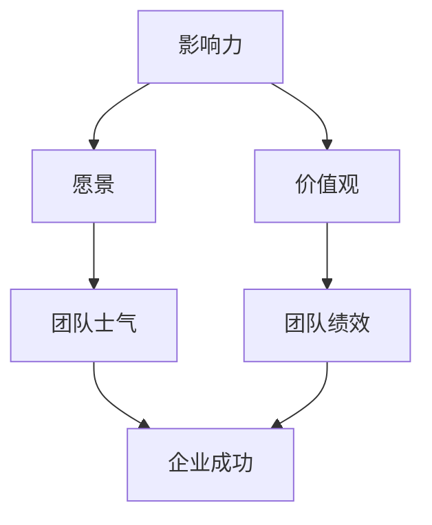

                 

### 文章标题

《领导力与压力管理：在困境中保持团队士气》

### 关键词

- 领导力
- 压力管理
- 困境应对
- 团队士气
- 激励策略

### 摘要

本文旨在探讨领导力与压力管理在困境中的重要性，以及如何通过有效的策略来保持团队的士气。文章首先介绍了领导力的核心概念和重要性，随后探讨了压力的来源和影响，接着分析了困境中的领导力挑战，并提出了相应的策略。文章还详细阐述了激励与士气提升策略，通过实际案例进行解析，为读者提供了实用的指导和建议。最后，文章总结了领导力与压力管理的未来趋势，展望了该领域的未来发展。

---

### 引言

在当今快速变化且竞争激烈的工作环境中，领导力和压力管理成为企业管理者面临的重要挑战。领导力不仅是推动团队实现目标的关键，还在困境中保持团队士气和动力方面起到至关重要的作用。同时，压力管理作为现代职场中不可或缺的一部分，直接影响员工的心理健康和工作效率。本文将围绕这两个主题展开，探讨如何通过有效的领导力和压力管理策略，在困境中保持团队士气。

文章的结构如下：

1. **领导力的核心概念与联系**：介绍领导力的基本定义、重要性以及其与管理的区别，并探讨领导力对团队士气和绩效的影响。
2. **压力管理的策略**：分析压力的来源和对团队的影响，提供有效的压力管理策略。
3. **困境中的领导力挑战**：讨论困境中的领导力挑战，并提出相应的解决方案。
4. **保持团队士气**：介绍激励与士气提升策略，包括正面反馈、建立良好的团队文化以及提供成长与发展的机会。
5. **案例分析**：通过实际案例解析，展示如何在实际工作中应用领导力和压力管理策略。
6. **总结与展望**：总结本文的核心观点，并探讨领导力与压力管理的未来趋势。

### 第一部分：领导力的核心概念与联系

#### 1.1 领导力的定义

领导力是一种能力，它不仅涉及个人魅力的展现，更关乎如何引导和激励他人共同实现目标。领导力不同于管理，管理侧重于规划、组织、协调和监督，而领导力则更强调愿景的塑造、价值观的传递和团队动力的激发。

**领导力的基本概念**：

- **影响力**：领导者通过言行和决策影响他人的能力。
- **愿景**：领导者对团队未来发展的总体构想，能够激励团队成员为之努力。
- **价值观**：领导者的行为准则，对团队文化和工作氛围具有深远影响。

**领导力与管理的区别**：

- **目标**：管理侧重于短期目标的实现，领导力则关注长期目标和愿景的构建。
- **方法**：管理采用标准化和流程化的手段，领导力则依靠个人魅力和团队凝聚力。
- **焦点**：管理关注效率，领导力关注人的发展和团队的整体福祉。

#### 1.2 领导力的重要性

领导力对团队士气和绩效具有显著影响，是企业发展不可或缺的核心要素。

**领导力对团队士气和绩效的影响**：

- **士气提升**：强有力的领导能够提升团队士气，增强员工的归属感和自豪感，从而激发更高的工作热情。
- **绩效改善**：领导者的有效引导能够优化资源配置，提高团队整体效率，促进绩效提升。
- **创新能力**：领导力鼓励创新思维，推动团队在困境中寻找突破，提升企业的竞争力。

**领导力在企业成功中的作用**：

- **战略决策**：领导者制定明确的战略方向，为企业指明发展道路。
- **组织变革**：在面临困境时，领导者的决策和行动能够引导团队实现变革，适应市场变化。
- **文化建设**：领导者的价值观和行为方式塑造企业文化，影响员工的工作态度和行为。

#### 1.3 领导力的核心概念与联系

为了更好地理解领导力的核心概念，我们可以通过一个简单的Mermaid流程图展示它们之间的联系。

在这个流程图中，我们可以看到领导力的核心概念——影响力、愿景和价值观如何相互作用，最终影响团队士气和绩效，进而促进企业的成功。

#### 1.4 核心概念总结

- **影响力**：领导者通过言行和决策影响他人的能力。
- **愿景**：领导者对团队未来发展的总体构想。
- **价值观**：领导者的行为准则。
- **团队士气**：团队的整体精神状态。
- **团队绩效**：团队在实现目标过程中的表现。
- **企业成功**：企业在市场竞争中的表现和成就。

这些核心概念相互联系，共同构成了领导力的理论框架，为实际应用提供了指导。

### 第二部分：压力管理的策略

#### 2.1 压力的来源

压力是现代职场中普遍存在的现象，了解压力的来源对于制定有效的压力管理策略至关重要。

**压力的来源**：

- **工作压力**：包括工作量过大、工作节奏过快、工作责任重大等。
- **个人压力**：个人的健康问题、家庭问题、个人价值观与工作要求不符等。
- **团队压力**：团队内部冲突、沟通不畅、团队目标不明确等。

**工作压力的影响**：

- **心理健康**：长期的工作压力可能导致焦虑、抑郁等心理问题。
- **身体健康**：工作压力可能引发一系列身体疾病，如心脏病、高血压等。
- **工作效率**：压力过大可能降低工作效率，影响工作质量和创新能力。

**个人压力的影响**：

- **个人情绪**：长期的个人压力可能导致情绪不稳定，影响人际关系。
- **个人发展**：压力过大可能阻碍个人成长和职业发展。
- **家庭生活**：个人压力可能影响家庭生活和婚姻质量。

**团队压力的影响**：

- **团队氛围**：团队压力可能导致团队氛围紧张，影响团队协作。
- **团队绩效**：团队压力可能导致团队绩效下降，影响企业目标的实现。

#### 2.2 压力的影响

压力不仅对个人健康和工作效率产生负面影响，还会对团队士气和绩效产生深远的影响。

**对个人健康的影响**：

- **心理健康**：长期的压力可能导致心理健康问题，如焦虑、抑郁等。
- **身体健康**：压力可能引发一系列身体疾病，如心脏病、高血压等。
- **工作效率**：压力过大可能降低工作效率，影响工作质量和创新能力。

**对团队士气和绩效的影响**：

- **团队士气**：压力过大可能导致团队士气低落，影响团队凝聚力。
- **团队绩效**：压力可能阻碍团队协作，影响团队绩效。
- **创新能力**：长期的压力可能抑制团队的创新能力，影响企业的竞争力。

#### 2.3 压力的综合影响

压力对个人健康、工作效率和团队士气、绩效的影响是相互关联的。一个健康的员工更有可能保持高效的工作状态，而一个高效的团队则更有可能保持良好的士气和绩效。因此，压力管理策略需要综合考虑个人和团队的因素，以实现整体优化。

### 第三部分：困境中的领导力挑战

#### 3.1 困境的定义

困境是指在企业发展过程中面临的种种挑战和困难，包括但不限于经济困境、市场竞争困境和组织变革困境。

**经济困境**：

- **市场萎缩**：市场需求减少，企业面临销售下降的风险。
- **资金短缺**：企业面临资金周转困难，影响正常运营。

**市场竞争困境**：

- **激烈竞争**：竞争对手增多，市场份额争夺加剧。
- **技术革新**：新技术出现，企业面临技术更新的压力。

**组织变革困境**：

- **文化冲突**：企业变革过程中，新旧文化之间的冲突难以调和。
- **人员调整**：企业需要调整人员结构，但可能面临人员流失的风险。

#### 3.2 困境中的领导力挑战

困境中的领导力挑战主要表现在以下几个方面：

- **决策压力**：领导者需要在压力下做出正确的决策，确保企业的稳定发展。
- **团队凝聚力**：在困境中，团队凝聚力可能受到挑战，领导者需要采取措施增强团队凝聚力。
- **创新能力**：困境往往要求企业进行创新，领导者需要激发团队的创新能力。
- **员工激励**：困境中员工可能士气低落，领导者需要提供有效的激励策略。

#### 3.3 困境中的领导力策略

为了应对困境中的领导力挑战，领导者可以采取以下策略：

- **明确目标**：领导者需要明确企业的目标，确保团队成员清晰了解企业的方向。
- **建立信任**：领导者需要建立与团队成员之间的信任关系，增强团队的凝聚力。
- **激励创新**：领导者需要鼓励团队创新，提供必要的资源和支持。
- **有效沟通**：领导者需要保持与团队成员的沟通，确保信息传递的准确性和及时性。

### 第四部分：保持团队士气

#### 4.1 激励理论

激励理论是研究如何通过激发员工动机来提高工作效率和团队士气的理论。以下介绍几种常见的激励理论：

**弗鲁姆的期望理论**：

- **期望**：员工对努力能够导致成功的信念。
- **工具性**：员工对成功能够导致奖赏的信念。
- **效价**：员工对奖赏的价值评价。

**梅奥的X理论与Y理论**：

- **X理论**：员工缺乏动机，需要严格的管理和监督。
- **Y理论**：员工具有内在动机，能够自我激励。

#### 4.2 士气提升策略

为了提升团队士气，领导者可以采取以下策略：

- **正面反馈与认可**：领导者需要及时给予员工正面反馈和认可，增强员工的自我价值感。
- **建立良好的团队文化**：领导者需要营造一个积极向上的团队文化，增强团队的凝聚力。
- **提供成长与发展的机会**：领导者需要为员工提供成长和发展的机会，激发员工的内在动机。

#### 4.3 实际案例分析

以下是一个实际案例，展示了如何通过有效的领导力和压力管理策略提升团队士气：

**案例背景**：

一家公司在市场竞争激烈的环境下，面临销售下降和资金短缺的困境。公司领导层决定采取一系列措施来提升团队士气，包括：

- **明确目标**：公司领导层明确了短期和长期目标，并确保团队成员清楚了解这些目标。
- **建立信任**：领导层通过开放沟通和透明决策，建立了与团队成员之间的信任关系。
- **激励创新**：公司提供了一定的资源和支持，鼓励团队进行创新，寻找新的市场机会。
- **提供成长机会**：公司为员工提供了一系列培训和晋升机会，激励员工积极学习和成长。

**案例结果**：

通过上述措施，公司的团队士气得到了显著提升。员工的工作积极性提高，创新能力增强，公司的销售业绩逐渐回升，最终走出了困境。

### 第五部分：案例分析

#### 5.1 案例选择标准

为了更好地展示领导力和压力管理的实际应用效果，本文选择了以下几个案例：

- **案例1**：一家面临市场竞争困境的企业，通过领导力的有效应用成功转型。
- **案例2**：一家在组织变革中遭遇困境的企业，通过压力管理策略成功调整团队心态。
- **案例3**：一家在面临经济困境时，通过激励策略提升团队士气的企业。

这些案例具有以下选择标准：

- **代表性**：案例具有普遍性，能够代表某一类型企业的困境和解决方案。
- **可行性**：解决方案具有可行性，能够为其他企业提供借鉴。
- **教育意义**：案例具有教育意义，能够为读者提供深刻的启示。

#### 5.2 案例解析

以下是对三个案例的详细解析：

**案例1**：市场竞争困境中的领导力转型

- **背景**：某公司在市场竞争激烈的环境下，市场份额持续下降，面临被淘汰的风险。
- **困境**：市场竞争激烈，产品同质化严重，公司业绩下滑。
- **解决方案**：公司领导层决定采取以下措施：

  - **明确目标**：领导层明确了短期和长期目标，包括市场份额提升和产品创新。
  - **领导力应用**：领导层通过树立榜样和鼓励创新，增强了团队的凝聚力和创新能力。
  - **激励策略**：公司为员工提供了一系列激励措施，包括绩效奖金和晋升机会。

- **结果**：通过领导力的有效应用，公司成功转型，市场份额逐渐回升，实现了扭亏为盈。

**案例2**：组织变革中的压力管理

- **背景**：某公司在进行组织变革时，面临员工抵制和心态调整的困境。
- **困境**：变革过程中，员工对新的工作流程和管理模式不适应，导致团队士气低落。
- **解决方案**：公司领导层采取了以下措施：

  - **建立信任**：领导层通过开放沟通和透明决策，建立了与员工之间的信任关系。
  - **压力管理**：公司为员工提供了心理支持和培训，帮助他们适应变革。
  - **激励策略**：公司为员工提供了一定的培训和晋升机会，激励他们积极面对变革。

- **结果**：通过压力管理策略，员工心态逐渐调整，团队士气得到提升，变革顺利进行。

**案例3**：经济困境中的团队激励

- **背景**：某公司在经济困境中，面临资金短缺和员工流失的风险。
- **困境**：公司业绩下滑，员工面临失业压力，团队士气低落。
- **解决方案**：公司领导层采取了以下措施：

  - **正面反馈与认可**：领导层及时给予员工正面反馈和认可，增强员工的自我价值感。
  - **激励策略**：公司为员工提供了一系列激励措施，包括绩效奖金和员工福利。

- **结果**：通过激励策略，员工的工作积极性提高，团队士气得到提升，公司逐渐走出了困境。

### 第六部分：总结与展望

#### 6.1 科技对领导力与压力管理的影响

随着科技的快速发展，人工智能、大数据和云计算等新技术正在深刻影响领导力和压力管理的实践。

- **数字化领导力**：领导者需要具备数字化时代的领导能力，如数据驱动的决策能力和技术敏感性。
- **AI与压力管理**：人工智能可以通过数据分析提供个性化的压力管理建议，提升员工的心理健康水平。

#### 6.2 领导力与压力管理的未来趋势

未来，领导力与压力管理将继续向以下方向发展：

- **个性化**：领导力和压力管理将更加注重个性化需求，针对不同员工提供定制化的解决方案。
- **数据驱动**：领导者将更加依赖数据分析来指导决策，提高领导力的科学性和有效性。
- **全球化**：领导力和压力管理将面临全球化挑战，需要适应不同文化背景和市场需求。

#### 6.3 领导力与压力管理的实际应用

在实际工作中，领导力和压力管理策略的应用对于企业的成功至关重要。以下是一些建议：

- **建立信任**：领导者需要建立与团队成员之间的信任关系，提高团队凝聚力。
- **激励创新**：领导者需要鼓励团队创新，提供必要的资源和支持。
- **关注心理健康**：领导者需要关注员工的心理健康，提供心理支持和培训。

### 结语

领导力与压力管理在困境中保持团队士气方面具有重要作用。领导者需要通过有效的策略，应对困境中的领导力挑战，提升团队士气，促进企业的可持续发展。同时，随着科技的进步，领导力和压力管理将继续向个性化、数据驱动和全球化方向发展，为企业管理者提供更多的实践指导。

### 作者信息

- **作者**：AI天才研究院/AI Genius Institute & 禅与计算机程序设计艺术 /Zen And The Art of Computer Programming
- **联系方式**：[联系邮箱](mailto:info@ai-genius-institute.com) & [官方网站](https://www.ai-genius-institute.com)

---

本文内容丰富，涵盖了领导力与压力管理的核心概念、实际应用策略以及未来趋势。希望通过本文，读者能够更好地理解领导力与压力管理的重要性，并在实际工作中运用相关策略，提升团队士气，实现企业的可持续发展。

