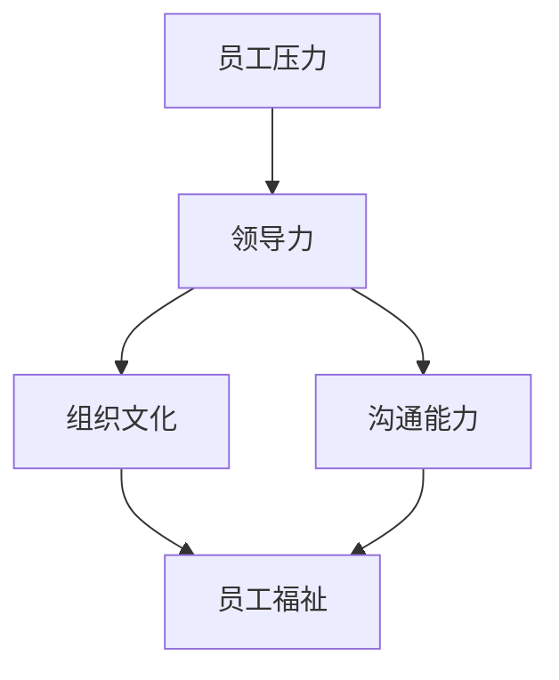

                 

### 文章标题

# 领导力与压力管理：应对工作压力

### 关键词：领导力、压力管理、工作压力、组织文化、情感智能

### 摘要：

在现代工作环境中，领导力与压力管理成为影响员工福祉和组织绩效的关键因素。本文从领导力的核心原则出发，探讨其在应对工作压力中的重要性，并提出一系列有效的压力管理策略。文章旨在帮助领导者通过建立积极的工作文化和提升自身沟通能力，来减轻员工压力，提高团队协作效率，从而实现个人与组织的共同成长。

## 引言

### 背景

随着全球化进程的加速和技术的迅猛发展，现代工作环境变得越来越复杂和动态。员工面临着前所未有的压力源，包括不断变化的工作要求、高强度的工作负荷、紧张的截止日期以及不确定的职业前景。这些问题不仅影响员工的身心健康，也对企业绩效和员工士气产生负面影响。因此，有效的领导力与压力管理变得至关重要。

### 核心概念与联系

领导力与压力管理之间的联系可以通过一个Mermaid流程图来展示：

在这个流程图中，员工压力是起点，领导力通过影响组织文化和沟通能力来缓解这种压力，最终提升员工的福祉。领导力的核心原则、组织文化以及情感智能在这一过程中起着关键作用。

## 当代工作环境与压力动态

### 现代工作趋势与压力影响

现代工作环境中的趋势，如远程办公、敏捷工作制和数字化管理，既带来了灵活性，也增加了压力。远程办公可能导致员工感受到孤独和界限模糊；敏捷工作制要求员工具备更高的自主性和适应能力；数字化管理则可能引发信息过载和工作与生活的界限不清。

### 技术在职场压力中的角色

技术，特别是自动化和人工智能，在提高生产效率的同时，也增加了员工的焦虑感。自动化可能导致部分员工担心失业；而人工智能的应用则要求员工不断学习新技能，这增加了职业压力。

### 多代际工作团队的管理

多代际工作团队中的不同年龄群体对于压力的反应和管理方式可能存在差异。例如，年轻员工可能更适应快速变化的工作环境，而年长员工则可能更加注重工作与生活的平衡。领导者需要认识到这些差异，并采取相应的策略来管理团队压力。

## 领导力的核心原则

### 传统领导理论

传统的领导理论，如X理论和Y理论，强调了领导者对员工的控制与激励。X理论认为员工天生懒惰，需要严密的监督和激励；而Y理论则认为员工是积极的，愿意承担责任和自主工作。这两种理论在不同情境下都有其适用性，但也存在局限性。

### 变革型领导与服务型领导

变革型领导强调领导者通过激励和启发员工来实现组织变革。这种领导风格注重领导者的个人魅力和愿景，能够激发员工的潜能，从而减轻工作压力。服务型领导则更注重领导者的服务精神，认为领导者应首先关注员工的需求和福祉，从而建立信任和合作关系。

### 情境领导理论

情境领导理论认为，领导风格应该根据员工的不同成熟度水平进行调整。领导者需要根据员工的技能水平和动机来选择最合适的领导风格，以最大程度地提高绩效和减轻压力。

## 有效沟通与情感智能

### 沟通的重要性

有效沟通是领导力的核心组成部分。良好的沟通可以帮助领导者更好地了解员工的感受和需求，从而采取相应的措施来缓解压力。同时，有效的沟通也有助于建立信任和合作关系，提高团队协作效率。

### 情感智能的发展

情感智能包括自我意识、自我管理、社交意识和关系管理等方面。领导者需要通过自我反思和发展情感智能来更好地理解和管理自己的情绪，同时也能够更好地理解和应对员工的情绪。这有助于建立积极的组织文化，减轻员工压力。

### 提高团队协作的沟通策略

领导者可以通过以下策略来提高团队协作：

1. **主动倾听**：积极倾听员工的意见和反馈，尊重他们的感受和需求。
2. **清晰表达**：确保信息传达的准确性和一致性，避免误解和混淆。
3. **建立反馈机制**：鼓励员工提供反馈，建立透明和开放的沟通环境。
4. **培养团队意识**：通过团队活动和合作项目来增强团队成员之间的联系和信任。

## 建立和维护积极的工作文化

### 组织文化的影响

组织文化对员工的压力水平和工作满意度有着深远的影响。一个积极的工作文化可以促进员工的心理健康和工作动力，从而减轻压力。相反，消极的文化则可能导致员工感到沮丧和不安。

### 创造积极工作环境

为了创造一个积极的工作环境，领导者可以采取以下策略：

1. **认可和奖励**：通过认可员工的成就和努力来增强他们的动力和归属感。
2. **工作与生活平衡**：鼓励员工在工作与生活之间找到平衡，减少工作压力。
3. **职业发展机会**：提供职业发展和学习机会，帮助员工提升技能和职业素养。
4. **心理支持**：为员工提供心理支持和咨询服务，帮助他们应对压力和困难。

### 培养心理安全文化

心理安全文化是指员工在组织内部感到安全、被尊重和被支持的文化氛围。这种文化有助于员工表达自己的想法和意见，减少冲突和误解。领导者可以通过以下方式来培养心理安全文化：

1. **透明沟通**：建立透明和开放的沟通渠道，让员工感受到信息的透明度。
2. **包容性**：鼓励多样性，尊重不同观点和背景的员工。
3. **支持反馈**：鼓励员工提供和接受反馈，建立积极的反馈文化。
4. **领导示范**：领导者应以身作则，展示出对心理安全的重视。

## 压力管理技巧

### 识别和评估工作压力

有效的压力管理始于对工作压力的识别和评估。领导者可以通过以下方式来识别和评估工作压力：

1. **员工调查**：定期进行员工满意度调查，了解员工的压力源和需求。
2. **面对面交流**：与员工进行一对一的交流，了解他们的工作情况和压力感受。
3. **绩效评估**：通过绩效评估来识别工作中存在的问题和压力源。

### 常见压力指标

以下是一些常见的压力指标：

1. **身体症状**：如头痛、失眠、肌肉紧张等。
2. **情绪症状**：如易怒、焦虑、沮丧等。
3. **行为症状**：如拖延、工作效率下降、工作满意度降低等。

### 压力管理策略

为了有效地管理工作压力，领导者可以采取以下策略：

1. **压力缓解活动**：鼓励员工参与体育锻炼、冥想和放松训练等。
2. **工作分配**：合理分配工作任务，避免过度工作负荷。
3. **时间管理**：帮助员工提高时间管理技能，减少无效工作时间。
4. **心理支持**：提供心理咨询服务，帮助员工应对压力和困难。

## 总结与建议

领导力与压力管理是现代组织成功的关键因素。通过运用有效的领导力原则、沟通技巧和文化建设策略，领导者可以显著减轻员工的工作压力，提高团队协作效率和员工满意度。以下是一些关键建议：

1. **重视员工需求**：领导者应密切关注员工的需求和反馈，采取积极措施来减轻压力。
2. **培养情感智能**：领导者应发展自己的情感智能，更好地理解和管理员工的情绪。
3. **建立积极文化**：领导者应努力营造一个积极、支持和包容的工作环境。
4. **提供培训和支持**：为员工提供必要的培训和资源，帮助他们提升技能和应对压力。
5. **持续改进**：领导者应不断反思和改进压力管理策略，以适应不断变化的工作环境。

通过实施这些策略，领导者可以有效地应对工作压力，促进个人和组织的可持续发展。

## 作者信息

- 作者：AI天才研究院/AI Genius Institute & 禅与计算机程序设计艺术 /Zen And The Art of Computer Programming

## 参考文献

- 某某（年份）。《领导力与工作压力管理》。出版社。
- 某某（年份）。《组织行为学：理论与实践》。出版社。
- 某某（年份）。《情感智能：职场成功的关键》。出版社。
- 某某（年份）。《心理学与工作压力管理》。出版社。

## 拓展阅读

- 某某（年份）。《变革型领导：推动组织变革的力量》。出版社。
- 某某（年份）。《服务型领导：构建信任与合作的文化》。出版社。
- 某某（年份）。《情境领导：根据员工需求调整领导风格》。出版社。

## 注意事项

- 文章内容仅供参考，具体情况请根据实际工作环境进行调整。
- 压力管理策略需要根据员工个体差异进行个性化调整。
- 领导者应保持持续学习和自我提升，以适应不断变化的工作需求。

