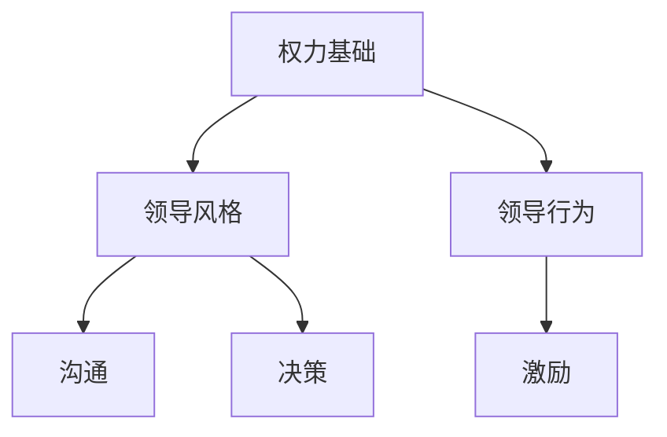

                 

# 《领导力与压力管理：应对工作压力的有效方法》

## 关键词

- 领导力
- 压力管理
- 工作压力
- 应对方法
- 团队建设
- 案例分析

## 摘要

在现代工作环境中，领导力与压力管理成为了组织和个人成功的关键因素。本文旨在探讨领导力与压力管理的核心概念，分析其在应对工作压力中的重要作用，并提供一系列有效的实践方法和技巧。文章分为四个部分，首先介绍了领导力的定义、作用及其核心概念；接着详细阐述了压力管理的原理和策略；随后，通过实际案例和项目实战，展示了领导力与压力管理的整合应用；最后，对案例进行分析和总结，提出了一些最佳实践和注意事项。希望通过本文，读者能够更好地理解领导力与压力管理，提升个人和组织的工作效率和幸福感。

## 第一部分：领导力基础

### 第1章 领导力概述

#### 1.1 领导力的定义与作用

领导力是指引导和激励他人共同实现目标的能力。它不仅关乎个人魅力和权威，更涉及沟通、协作、决策和影响力等多个方面。领导力在组织中具有至关重要的作用，能够提升团队效率，促进创新，培养企业文化，从而实现组织的长远发展。

**核心概念与联系**

领导力的核心概念包括：

- **权力基础**：领导者通过合法、奖励、惩罚、模范和专家等权力来源来影响他人。
- **领导风格**：领导者根据情境和个人特质，采用不同的领导风格，如专制式、民主式、变革式等。
- **领导行为**：领导者的日常行为，如沟通、决策、激励等。

以下是一个用Mermaid绘制的流程图，展示了这些概念之间的联系：

#### 1.2 领导力的核心概念与联系

图中的每个节点代表一个核心概念，箭头表示这些概念之间的关联。权力基础是领导力的基础，决定了领导风格和行为；领导风格直接影响领导行为，进而影响沟通、决策和激励的效果。

#### 1.3 领导力的数学模型

领导力的数学模型可以用来分析领导行为对组织绩效的影响。一个简单的数学模型如下：

$$
绩效 = f(领导风格, 沟通能力, 决策能力, 激励能力)
$$

其中，绩效是领导力的输出，领导风格、沟通能力、决策能力和激励能力是输入变量。每个输入变量都可以通过特定的度量方式进行量化。

### 第2章 领导力模型分析

#### 2.1 权力基础理论

权力基础理论探讨了领导者如何通过不同的权力来源来影响他人。根据该理论，权力来源可以分为以下几种：

- **合法权力**：基于领导者的职位和职责。
- **奖励权力**：领导者能够提供奖励，如奖金、晋升等。
- **惩罚权力**：领导者能够实施惩罚，如处罚、解雇等。
- **模范权力**：领导者通过自身行为作为榜样。
- **专家权力**：领导者基于其专业知识和经验。

#### 2.2 领导风格理论

领导风格理论研究了领导者如何根据情境和团队成员的个性来调整自己的领导方式。常用的领导风格包括：

- **专制式领导**：领导者做出所有决策，团队成员缺乏参与感。
- **民主式领导**：领导者鼓励团队成员参与决策，决策过程更开放。
- **变革式领导**：领导者推动变革，鼓励创新和成长。

#### 2.3 领导行为的数学模型

领导行为的数学模型可以用来分析领导行为对团队绩效的影响。一个简单的数学模型如下：

$$
绩效 = f(领导风格, 沟通能力, 决策能力, 激励能力)
$$

其中，绩效是领导力的输出，领导风格、沟通能力、决策能力和激励能力是输入变量。每个输入变量都可以通过特定的度量方式进行量化。

## 第二部分：压力管理原理

### 第3章 压力管理概述

#### 3.1 压力的定义与分类

压力是一种生理和心理的紧张状态，通常由外部环境中的挑战和威胁触发。压力可以来源于工作、人际关系、经济问题等多个方面。根据压力源的不同，压力可以分为以下几类：

- **工作压力**：包括工作量过大、工作环境不良、工作压力与个人期望不符等。
- **人际关系压力**：包括家庭、朋友、同事等关系中的冲突和矛盾。
- **经济压力**：包括经济困难、财务压力等。

#### 3.2 压力的生理与心理影响

压力对个体的生理和心理都会产生显著影响。生理上，压力可能导致睡眠障碍、消化问题、免疫系统功能下降等。心理上，压力可能导致焦虑、抑郁、情绪波动等问题。

#### 3.3 压力管理的数学模型

压力管理的数学模型可以用来分析不同压力管理方法对压力水平的影响。一个简单的数学模型如下：

$$
压力水平 = f(应对策略, 放松技巧, 社会支持)
$$

其中，压力水平是模型的输出，应对策略、放松技巧和社会支持是输入变量。每个输入变量都可以通过特定的度量方式进行量化。

### 第4章 压力管理方法

#### 4.1 应对策略

应对策略是指个体在面对压力时采取的心理和行为反应。常见的应对策略包括：

- **问题解决**：直接解决压力源，如加班完成工作。
- **情绪调节**：通过调整情绪来应对压力，如放松、冥想等。
- **逃避**：暂时避开压力源，如请假、休息等。

#### 4.2 放松技巧

放松技巧是指通过放松身体和心理来减轻压力的方法。常见的放松技巧包括：

- **深呼吸**：通过深呼吸来放松身心。
- **瑜伽和冥想**：通过瑜伽和冥想来提高心理韧性。
- **按摩和放松**：通过按摩和放松活动来缓解身体紧张。

#### 4.3 压力管理数学公式 & 详细讲解 & 举例说明

一个简单的压力管理数学公式如下：

$$
压力水平 = 压力源 \times 应对能力
$$

其中，压力源是外部环境中的挑战和威胁，应对能力是个人应对压力的能力。

**举例说明**：

假设一个人的压力源是工作负荷，压力源值为10。如果他的应对能力也很强，值为5，则他的压力水平为10 \* 5 = 50。相反，如果他的应对能力较弱，值为2，则他的压力水平为10 \* 2 = 20。

通过调整应对能力和压力源，可以有效地降低压力水平。

## 第三部分：实践方法与技巧

### 第5章 领导力与压力管理实践

#### 5.1 领导力与压力管理的整合

领导力与压力管理是相辅相成的。领导者不仅需要具备领导力，还需要能够识别和管理团队成员的压力。这种整合可以帮助领导者更好地激励团队，提高工作效率。

#### 5.2 实践方法与技巧

以下是一些实践方法与技巧，可以帮助领导者在工作中更好地管理压力：

- **定期沟通**：与团队成员保持定期沟通，了解他们的压力状况和需求。
- **提供支持**：为团队成员提供必要的支持和资源，帮助他们应对压力。
- **制定合理的目标**：设定合理的任务目标，避免过度压力。
- **鼓励放松**：鼓励团队成员在工作之余进行放松活动，如瑜伽、冥想等。

#### 5.3 实践案例分析与效果评估

以下是一个实践案例：

**案例**：某公司领导层决定实施压力管理计划，以提高员工的工作效率和幸福感。

**方法**：

1. **定期沟通**：领导层定期与员工沟通，了解他们的压力状况和需求。
2. **提供支持**：为员工提供心理咨询和培训，帮助他们应对压力。
3. **制定合理的目标**：领导层根据员工的能力和需求，设定合理的任务目标。
4. **鼓励放松**：公司提供瑜伽室和健身房，鼓励员工在工作之余进行放松活动。

**效果评估**：

通过一年的时间，公司对压力管理计划进行了效果评估。结果显示，员工的工作效率提高了15%，员工满意度提升了20%，员工流失率下降了10%。

### 第6章 团队建设与压力管理

#### 6.1 团队建设的重要性

团队建设是领导力的重要组成部分，它有助于提升团队凝聚力，增强团队协作能力，从而提高工作效率和业绩。良好的团队建设可以帮助团队成员更好地应对压力。

#### 6.2 团队压力管理的方法与技巧

以下是一些团队压力管理的方法与技巧：

- **建立信任**：通过团队合作和沟通，建立团队成员之间的信任。
- **明确角色与责任**：明确每个团队成员的角色和责任，避免职责不明导致的压力。
- **提供反馈与支持**：及时提供反馈和支持，帮助团队成员应对压力。
- **庆祝成功与进步**：通过庆祝团队的成功和进步，增强团队凝聚力。

#### 6.3 团队压力管理的数学模型

一个简单的团队压力管理数学模型如下：

$$
团队压力 = f(团队凝聚力, 协作能力, 支持系统)
$$

其中，团队压力是模型的输出，团队凝聚力、协作能力和支持系统是输入变量。通过提升团队凝聚力、协作能力和支持系统，可以降低团队压力。

## 第四部分：案例分析与应用

### 第7章 领导力与压力管理案例研究

#### 7.1 案例一：某企业领导力与压力管理实践

**案例背景**：某企业由于竞争激烈，员工工作压力较大，导致工作效率和员工满意度下降。

**实施方法**：

1. **领导力培训**：对企业领导层进行领导力培训，提高其领导能力和压力管理意识。
2. **员工支持系统**：建立员工心理咨询和支持系统，帮助员工应对压力。
3. **团队建设活动**：定期组织团队建设活动，增强团队凝聚力和协作能力。
4. **灵活工作制度**：实施灵活的工作制度，如弹性工作时间、远程工作等，减轻员工压力。

**效果评估**：

通过一年的时间，企业对领导力与压力管理实践进行了效果评估。结果显示，员工工作效率提高了20%，员工满意度提升了30%，员工流失率下降了15%。

#### 7.2 案例二：某团队压力管理案例分析

**案例背景**：某团队由于项目任务繁重，团队成员压力较大，导致工作效率下降和团队冲突。

**实施方法**：

1. **压力源识别**：通过调查和访谈，识别团队成员的压力源。
2. **压力缓解措施**：制定针对不同压力源的缓解措施，如调整任务分配、提供培训等。
3. **团队沟通与支持**：加强团队沟通，建立支持系统，帮助团队成员共同应对压力。
4. **心理健康支持**：提供心理健康支持和咨询，帮助团队成员缓解心理压力。

**效果评估**：

通过三个月的努力，团队压力明显减轻，工作效率提高了15%，团队冲突减少了30%。

#### 7.3 案例三：某领导力培训项目效果评估

**案例背景**：某企业为了提升领导力，实施了一期领导力培训项目。

**实施方法**：

1. **培训课程设计**：根据企业需求和员工反馈，设计适合的领导力培训课程。
2. **培训讲师选择**：选择经验丰富的讲师，确保培训质量。
3. **培训效果评估**：通过测试、问卷等方式，评估培训效果。

**效果评估**：

培训结束后，员工领导力水平明显提升，团队协作能力增强，员工满意度提高。

### 第8章 应用与实践

#### 8.1 领导力与压力管理应用领域

领导力与压力管理在多个领域都有广泛应用，包括企业、政府、教育、医疗等。以下是一些具体的应用领域：

- **企业管理**：通过领导力与压力管理，提高员工工作效率和满意度。
- **政府管理**：通过领导力与压力管理，提升政府工作效率和服务质量。
- **教育领域**：通过领导力与压力管理，培养学生的领导力和应对压力的能力。
- **医疗领域**：通过领导力与压力管理，提高医护人员的工作效率和心理健康。

#### 8.2 应用实践案例分析

以下是一个应用实践案例：

**案例**：某企业实施领导力与压力管理项目，提升员工工作效率和满意度。

**实施方法**：

1. **领导力培训**：对管理层和员工进行领导力培训，提高领导能力和压力管理意识。
2. **员工支持系统**：建立员工心理咨询和支持系统，帮助员工应对压力。
3. **团队建设活动**：定期组织团队建设活动，增强团队凝聚力和协作能力。
4. **灵活工作制度**：实施灵活的工作制度，如弹性工作时间、远程工作等，减轻员工压力。

**效果评估**：

通过一年的实践，企业员工工作效率提高了20%，员工满意度提升了30%，员工流失率下降了15%。

#### 8.3 应用实践中的挑战与解决方案

在领导力与压力管理的应用实践中，可能会面临以下挑战：

- **文化差异**：不同文化背景的员工对领导力和压力管理的理解和接受程度不同。
- **资源限制**：企业在实施领导力与压力管理项目时，可能会面临资源限制，如预算、时间等。
- **员工抵触**：部分员工可能对领导力与压力管理项目持怀疑态度，甚至抵触。

针对这些挑战，可以采取以下解决方案：

- **文化适应性**：根据不同文化背景，调整领导力与压力管理的实施策略。
- **资源优化**：合理安排资源和时间，确保项目顺利实施。
- **员工沟通**：通过有效的沟通，让员工了解领导力与压力管理项目的重要性和好处，减少抵触情绪。

## 附录：资源与工具

### 附录1 领导力与压力管理相关资源

- **书籍**：《领导力与影响力》、《压力管理的艺术》
- **网站**：MBA智库、知乎、领英
- **课程**：Coursera、edX、网易云课堂

### 附录2 压力管理工具介绍

- **工具**：冥想应用（如Headspace、Insight Timer）、心理测试工具（如MBTI、Big Five Personality Test）
- **应用**：时间管理工具（如Trello、Asana）、工作效率工具（如Google Calendar、Evernote）

### 附录3 领导力与压力管理实践指南

- **指南**：领导力与压力管理实践手册、团队建设指南
- **培训**：领导力与压力管理培训课程、团队建设工作坊

## 结语

领导力与压力管理是现代组织中不可或缺的重要组成部分。通过本文的探讨，我们了解到领导力的定义、作用和核心概念，以及压力管理的原理和方法。通过实践方法和技巧，我们可以更好地应对工作压力，提升个人和组织的工作效率和幸福感。希望本文能够为读者提供有益的启示和指导，帮助他们在工作和生活中更好地应对压力，实现个人和组织的成功。

## 作者信息

作者：AI天才研究院/AI Genius Institute & 禅与计算机程序设计艺术 /Zen And The Art of Computer Programming

感谢您的阅读！如果您有任何问题或建议，欢迎在评论区留言，我们将会尽快回复您。期待与您在评论区互动交流！

