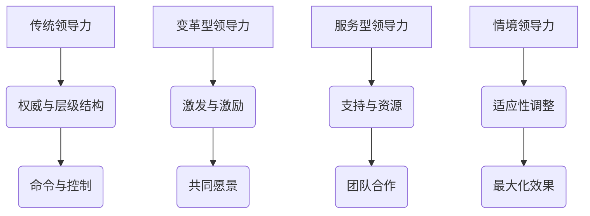

                 

## 文章标题

《领导力与反馈：建立持续改进的文化》

关键词：领导力、反馈机制、持续改进、文化、实践指南

摘要：本文深入探讨了领导力与反馈机制在建立持续改进文化中的作用和重要性。通过剖析核心概念、理论和实践，结合案例分析，本文旨在为IT领域的企业和领导者提供一套实用的指南，以构建并维护一种能够推动组织不断进步的文化氛围。

## 设计思路与步骤

为了设计《领导力与反馈：建立持续改进的文化》的完整目录大纲，我们需要遵循以下思路和步骤：

### 1. 明确核心内容

首先，我们需要明确这本书的核心内容，这包括领导力、反馈机制、持续改进的文化以及如何建立这样的文化。

### 2. 确定大纲结构

接下来，我们需要确定大纲的结构，这通常包括以下几个部分：
- 引言或概述
- 核心概念与联系
- 理论与实践
- 案例研究
- 总结与展望

### 3. 拆分章节内容

根据核心内容和大纲结构，我们将拆分每个章节的内容，细化到1, 2, 3级目录。

### 4. 添加图表与公式

为了更清晰地阐述理论，我们将在适当的位置添加Mermaid流程图、伪代码、LaTeX数学公式以及相应的例子。

### 5. 确保完整性

在目录大纲中，我们将确保包含以下核心章节：
- 领导力定义与类型
- 反馈机制原理与实施
- 持续改进文化构建
- 案例研究与分析
- 领导力与反馈实践指南

### 6. 控制字数

最后，我们将控制整个目录大纲的总字数在2000字以内，确保简洁明了。

## 具体设计步骤

### 第一步：引言或概述

- **1.1 引言**
  - 领导力与反馈的重要性
  - 书籍的目标与读者对象

### 第二步：核心概念与联系

- **第2章 领导力定义与类型**
  - **2.1 领导力的基本概念**
    - 领导力与管理的区别
    - 领导力的核心要素
  - **2.2 领导力的类型**
    - 传统领导力与现代领导力
    - 领导力的行为类型

### 第三步：理论与实践

- **第3章 反馈机制原理与实施**
  - **3.1 反馈机制概述**
    - 反馈机制的定义与作用
    - 反馈机制的类型
  - **3.2 反馈机制的构建**
    - 反馈流程的设计
    - 反馈策略的选择

### 第四步：案例研究与分析

- **第4章 持续改进文化的构建**
  - **4.1 持续改进文化的定义与特征**
    - 持续改进文化的概念
    - 持续改进文化的特征
  - **4.2 持续改进文化的构建方法**
    - 案例分析：优秀持续改进文化的实例
    - 持续改进文化的实施步骤

### 第五步：总结与展望

- **第5章 领导力与反馈实践指南**
  - **5.1 实践指南概述**
    - 实践指南的目标与内容
  - **5.2 实践指南的具体步骤**
    - 领导力与反馈实践的步骤解析
    - 持续改进文化实践的关键要素

### 第六步：附录

- **附录 A 参考文献**
  - 引用本书中提到的关键文献与资料

通过上述步骤，我们可以设计出一份逻辑清晰、内容全面的目录大纲，为《领导力与反馈：建立持续改进的文化》这本书的内容组织提供有力的支持。 

## 《领导力与反馈：建立持续改进的文化》目录大纲

```markdown
# 《领导力与反馈：建立持续改进的文化》

# 目录大纲

## 第1章 引言
### 1.1 领导力与反馈的重要性
### 1.2 书籍目标与结构
### 1.3 读者对象与期望收获

## 第2章 领导力定义与类型
### 2.1 领导力的基本概念
#### 2.1.1 领导力与管理的区别
#### 2.1.2 领导力的核心要素
### 2.2 领导力的类型
#### 2.2.1 传统领导力与现代领导力
#### 2.2.2 领导力的行为类型

## 第3章 反馈机制原理与实施
### 3.1 反馈机制概述
#### 3.1.1 反馈机制的定义与作用
#### 3.1.2 反馈机制的类型
### 3.2 反馈机制的构建
#### 3.2.1 反馈流程的设计
#### 3.2.2 反馈策略的选择

## 第4章 持续改进文化的构建
### 4.1 持续改进文化的定义与特征
#### 4.1.1 持续改进文化的概念
#### 4.1.2 持续改进文化的特征
### 4.2 持续改进文化的构建方法
#### 4.2.1 案例分析：优秀持续改进文化的实例
#### 4.2.2 持续改进文化的实施步骤

## 第5章 领导力与反馈实践指南
### 5.1 实践指南概述
#### 5.1.1 实践指南的目标与内容
### 5.2 实践指南的具体步骤
#### 5.2.1 领导力与反馈实践的步骤解析
#### 5.2.2 持续改进文化实践的关键要素

## 第6章 案例研究与分析
### 6.1 案例研究概述
#### 6.1.1 案例选择与背景
### 6.2 案例分析
#### 6.2.1 领导力实践分析
#

----------------------------------------------------------------

## 关键词

领导力、反馈机制、持续改进、文化、实践指南

## 摘要

本文旨在探讨领导力与反馈机制在建立持续改进文化中的关键作用。通过对领导力的定义与类型、反馈机制原理与实施、以及持续改进文化的构建方法的详细分析，本文为IT领域的企业和领导者提供了一套实用的指南。通过结合实际案例，本文深入阐述了如何构建并维护一种能够推动组织不断进步的文化氛围。文章旨在帮助读者理解并应用领导力与反馈机制，以实现组织的持续改进和成功。

---

### 引言

在当今快速变化和高竞争的环境中，领导力和反馈机制成为组织成功的关键因素。领导力不仅仅是指挥和管理团队，更是一种激发和引导员工创造力的能力。而反馈机制则是确保组织在不断进步中保持灵活和适应性的关键。本文将深入探讨领导力与反馈机制在建立持续改进文化中的重要性，并提供一套实用的实践指南。

首先，我们将定义领导力的基本概念，并探讨其与传统管理的区别。接下来，我们将分析不同类型的领导力，以及它们如何影响组织的运作。在此基础上，我们将详细讨论反馈机制的原理与实施方法，包括反馈流程的设计和反馈策略的选择。

随后，本文将探讨持续改进文化的概念和特征，并分析如何构建和维持这种文化。我们将通过案例分析，展示优秀持续改进文化的实例，并详细解析其构建方法。最后，本文将总结并提供一个详细的实践指南，帮助读者在实际工作中应用领导力与反馈机制，以建立持续改进的文化。

通过本文的阅读，读者将能够深入了解领导力与反馈机制在组织中的重要性，掌握构建持续改进文化的关键步骤，并能够将其应用到实际工作中，推动组织的不断进步。

---

### 领导力的定义与类型

领导力是一种激发和引导他人共同实现目标的能力。与传统的管理不同，领导力不仅仅是命令和控制，而是一种通过影响和激励他人来实现共同愿景的技能。在组织中，领导力不仅影响领导者的行为，也对团队成员的态度和生产力产生深远的影响。

首先，让我们定义领导力的基本概念。领导力可以被视为一个多层次、多维度的概念。它不仅包括个人特质，如自信、决断力、沟通能力，还包括组织层面的结构和过程。在领导力的定义中，一个关键的要素是领导者与追随者之间的关系。领导力是一种互动过程，它涉及领导者对追随者的影响和追随者对领导者的响应。

接下来，我们探讨领导力的类型。领导力可以分为多个类型，每种类型都有其独特的特点和适用场景。以下是几种主要的领导力类型：

1. **传统领导力**：传统领导力强调权威和层级结构。领导者通过职位和权力来影响和指导团队成员。这种领导力风格在命令和控制环境中非常有效，但在需要创新和灵活性的现代组织中，可能限制团队的发展和进步。

2. **变革型领导力**：变革型领导力强调领导者通过激发和激励追随者的潜能来推动组织变革。这种领导力风格鼓励团队成员参与决策过程，并赋予他们更多的自主权和责任感。变革型领导者通常具有远见卓识，能够激励团队成员为实现共同愿景而努力。

3. **服务型领导力**：服务型领导力强调领导者为团队成员提供支持和资源，以满足他们的需求和期望。这种领导力风格强调团队合作和共同成长，领导者被视为团队的服务者，而不是指挥官。服务型领导力有助于建立积极的工作环境和高效的团队。

4. **情境领导力**：情境领导力是一种适应性领导力风格，根据团队成员的成熟度和环境的需求进行调整。领导者会根据不同的情况选择合适的领导风格，以最大化团队的效果和效率。这种领导力风格强调灵活性和适应性，能够帮助组织应对复杂和不确定的环境。

每种领导力类型都有其优缺点和适用场景。在实际应用中，领导者需要根据组织的具体需求和团队成员的特点，灵活选择和调整领导风格。以下是一个Mermaid流程图，展示了不同类型领导力之间的关系和相互影响：



通过理解不同类型的领导力，领导者可以更好地选择合适的领导风格，以实现组织的长期目标和持续改进。

### 反馈机制原理与实施

反馈机制在组织管理中起着至关重要的作用，它不仅帮助组织识别问题，还能够提供改进的方向和动力。一个有效的反馈机制能够促进员工个人和团队的整体成长，从而推动组织的持续改进。

#### 反馈机制的基本概念

反馈机制是指通过收集、分析和传达信息，以评估组织或团队成员的工作表现，并提供改进建议的过程。反馈机制的核心要素包括：信息的收集、分析、反馈和改进。

首先，信息的收集是反馈机制的基础。通过定期的检查、评估、调查和沟通，组织可以获取关于员工绩效、工作环境和团队合作的实时数据。这些数据可以是量化的，如生产效率、客户满意度等；也可以是定性的，如员工的工作态度、团队协作等。

接下来是信息的分析。分析过程涉及到对收集到的数据进行分析和解读，以识别问题所在和潜在的机会。通过数据可视化和统计方法，组织可以更清晰地理解数据的含义和趋势，从而制定有效的改进策略。

第三步是反馈的传达。反馈应当是及时的、具体的和建设性的。及时的反馈能够帮助员工迅速纠正错误，避免问题进一步恶化。具体的反馈应当明确指出问题的具体表现和改进的方向，避免模糊和泛泛而谈。建设性的反馈则应当鼓励员工，提供支持和资源，以帮助他们实现改进。

最后是改进的实施。反馈机制不仅仅是一个评估和指导的工具，它还应当促进实际改进。通过制定具体的行动计划和目标，组织可以确保反馈得到有效落实，从而实现持续改进。

#### 反馈机制的类型

根据反馈的来源和目的，反馈机制可以分为多种类型：

1. **自我反馈**：自我反馈是员工自己对自己的工作表现进行评估和反思。这种方法有助于提高员工的自我认知和自我管理能力。通过自我反馈，员工可以识别自己的优点和不足，并制定改进计划。

2. **同事反馈**：同事反馈是员工之间相互评估和提供建议。这种方法有助于促进团队协作和互相学习。同事反馈可以采取匿名形式，以保护反馈的客观性和公正性。

3. **上级反馈**：上级反馈是领导者或经理对下属的工作表现进行评估和指导。这种方法有助于确保工作目标的达成和组织文化的维护。上级反馈应当是具体、有针对性的，并提供改进的建议和资源。

4. **客户反馈**：客户反馈是组织从外部客户那里获得的关于产品或服务的反馈。这种方法有助于组织了解客户的需求和期望，从而进行产品改进和服务优化。

5. **绩效反馈**：绩效反馈是定期对员工的工作表现进行全面评估和反馈。这种方法有助于确保员工的目标与组织的战略目标一致，并促进个人和团队的发展。

每种类型的反馈机制都有其独特的价值和适用场景。在实际应用中，组织应当根据具体情况选择和组合不同的反馈机制，以实现最佳效果。

#### 反馈流程的设计

一个有效的反馈流程应当包括以下步骤：

1. **目标设定**：明确反馈的目的和预期效果，为后续的反馈流程提供方向。

2. **信息收集**：通过多种渠道收集员工和客户的信息，确保反馈的全面性和准确性。

3. **数据分析**：对收集到的信息进行分析和解读，识别问题和机会。

4. **反馈传达**：根据分析结果，及时、具体和建设性地向员工传达反馈。

5. **改进实施**：制定具体的行动计划和目标，确保反馈得到有效落实。

6. **跟踪与评估**：定期跟踪和评估改进措施的效果，确保持续改进。

#### 反馈策略的选择

为了确保反馈机制的有效性，组织应当选择合适的反馈策略。以下是一些常见的反馈策略：

1. **正向反馈**：鼓励和认可员工的优点和成就，增强他们的自信心和积极性。

2. **建设性反馈**：指出员工的问题和改进方向，提供具体的建议和资源。

3. **即时反馈**：及时提供反馈，帮助员工迅速纠正错误。

4. **定期反馈**：定期对员工的工作表现进行评估和反馈，确保持续改进。

5. **匿名反馈**：保护反馈的匿名性，鼓励员工开放和诚实地提供反馈。

通过合理的反馈流程和策略，组织可以建立一个有效的反馈机制，促进员工的个人和团队发展，从而实现持续改进。

### 持续改进文化的定义与特征

持续改进文化是一种组织价值观和行为模式，强调不断寻求改进和创新，以提高组织的效率和竞争力。这种文化鼓励员工积极参与改进过程，并确保改进措施得到持续实施和优化。

首先，让我们定义持续改进文化的概念。持续改进文化不仅仅是一个口号或目标，而是一种深入组织价值观和行为体系的核心理念。它强调不断反思和优化现有流程、产品和服务，以实现更高的质量和效率。这种文化鼓励员工勇于提出改进意见，并愿意尝试新方法，以推动组织的持续成长。

持续改进文化的特征可以从以下几个方面来理解：

1. **全员参与**：持续改进文化强调所有员工都应当参与到改进过程中。这不仅包括管理层和员工，还涉及客户和供应商等外部合作伙伴。通过全员参与，组织可以汇集更多的智慧和创意，从而实现更全面的改进。

2. **透明沟通**：持续改进文化倡导开放的沟通环境。员工应当能够自由地表达意见和建议，而不用担心负面后果。这种透明度有助于建立信任和协作，从而促进改进过程的顺利进行。

3. **数据驱动**：持续改进文化强调基于数据和事实进行决策。通过收集和分析数据，组织可以更客观地评估改进效果，并据此调整策略。数据驱动的方法有助于确保改进措施的科学性和有效性。

4. **学习与适应**：持续改进文化鼓励员工持续学习和适应变化。在这种文化中，员工不仅关注当前的工作表现，还关注未来的发展趋势。通过不断学习和适应，组织可以保持竞争力和创新能力。

5. **持续反馈**：持续改进文化强调持续的反馈和改进。通过定期的检查、评估和反馈，组织可以及时发现问题和机会，并迅速采取行动。这种持续反馈机制有助于确保改进措施的持续实施和优化。

#### 持续改进文化的构建方法

要构建一种持续改进文化，组织可以采取以下方法：

1. **领导层的示范**：领导层应当率先示范持续改进的态度和行为。通过身体力行，领导层可以激发员工的改进意识和主动性。

2. **培训与教育**：组织应当提供持续的培训和教育，帮助员工掌握改进工具和方法。通过培训，员工可以了解如何识别问题和机会，并采取有效的改进措施。

3. **建立反馈机制**：组织应当建立有效的反馈机制，鼓励员工提出改进意见和建议。通过定期的反馈会议和调查，组织可以收集员工的声音，并据此进行改进。

4. **奖励与认可**：组织应当设立奖励和认可机制，激励员工积极参与改进过程。奖励不仅包括物质奖励，还应当包括精神奖励，如表彰和公开表扬。

5. **建立改进项目**：组织可以设立专门的改进项目，由跨部门团队负责实施。这些项目应当具有明确的目标和计划，并得到领导层的大力支持。

6. **持续评估与优化**：组织应当定期评估改进措施的效果，并据此进行优化。通过持续评估，组织可以确保改进措施的有效性和持续性。

通过上述方法，组织可以逐步构建和维持一种持续改进文化，从而实现组织的长期发展和成功。

### 案例研究与分析

为了更好地理解如何建立持续改进文化，我们将通过几个实际案例来分析这些组织的实践和效果。

#### 案例一：丰田汽车公司的持续改进文化

丰田汽车公司（Toyota）是全球知名的汽车制造商，以其卓越的制造和质量控制而闻名。丰田的持续改进文化主要表现为以下特点：

1. **全员参与**：在丰田，每个员工都被鼓励参与改进过程。从一线工人到高层管理人员，每个人都有机会提出改进建议。这种全员参与的文化确保了改进措施的多样性和创新性。

2. **持续反馈**：丰田建立了定期的反馈机制，包括晨会和日常检查。在这些会议中，员工可以分享工作进展和遇到的问题，并共同讨论解决方案。这种持续的反馈有助于快速识别问题，并采取及时的改进措施。

3. **数据驱动**：丰田高度重视数据分析和质量统计。通过收集和分析大量的数据，丰田能够客观评估改进措施的效果，并据此进行优化。这种方法确保了改进措施的科学性和有效性。

4. **领导层的示范**：丰田的领导层在持续改进中发挥了关键作用。他们不仅鼓励员工提出改进建议，还积极参与改进过程，为员工树立了良好的榜样。

通过这些实践，丰田成功地建立了一种持续改进的文化，从而实现了卓越的质量和生产效率。丰田的持续改进文化不仅提高了内部运作效率，还增强了企业的竞争力和市场地位。

#### 案例二：谷歌的员工反馈机制

谷歌（Google）是全球领先的技术公司，以其开放和创新的文化而著称。谷歌的员工反馈机制是其持续改进文化的重要组成部分：

1. **自由开放的沟通环境**：谷歌鼓励员工自由表达意见和建议。无论是面对面的交流、电子邮件还是在线论坛，员工都可以随时提出改进想法。这种开放的沟通环境有助于建立信任和协作，从而促进改进。

2. **年度员工满意度调查**：谷歌定期进行员工满意度调查，以收集员工对工作环境、管理风格和工作条件的反馈。这些调查结果被用于评估和管理改进措施，以确保员工的需求得到满足。

3. **员工意见箱**：谷歌设有专门的员工意见箱，员工可以匿名提交改进建议。这种匿名机制保护了员工的隐私，鼓励他们更自由地表达真实想法。

4. **领导层的积极回应**：谷歌的领导层对员工的反馈非常重视，并积极回应。他们会定期召开反馈会议，讨论员工的意见和建议，并制定具体的改进计划。这种积极回应不仅增强了员工的参与感，还提高了改进措施的实施效果。

通过这些措施，谷歌成功地建立了一种高效的员工反馈机制，促进了组织的持续改进和创新。谷歌的员工反馈机制不仅提高了员工满意度，还增强了企业的竞争力和创新能力。

#### 案例三：亚马逊的持续改进实践

亚马逊（Amazon）是全球电子商务的领导者，以其高效和创新的物流和供应链管理而闻名。亚马逊的持续改进实践主要表现在以下几个方面：

1. **精益管理**：亚马逊采用精益管理方法，不断优化其物流和供应链流程。通过消除浪费、减少库存和缩短交货时间，亚马逊能够提高运营效率和客户满意度。

2. **持续改进会议**：亚马逊定期召开持续改进会议，团队成员可以共同讨论和解决工作中遇到的问题。这些会议鼓励团队成员积极参与改进过程，并提供了交流和协作的平台。

3. **数据分析和反馈**：亚马逊高度重视数据分析和反馈。通过收集和分析大量运营数据，亚马逊能够识别流程中的瓶颈和改进机会。这些分析结果被用于制定具体的改进计划，并确保改进措施得到有效实施。

4. **领导层的支持**：亚马逊的领导层对持续改进实践给予了充分的支持。他们不仅提供资源和支持，还积极参与改进项目，为员工树立了良好的榜样。

通过这些实践，亚马逊成功地建立了一种持续改进的文化，从而实现了卓越的运营效率和客户满意度。亚马逊的持续改进文化不仅提高了内部效率，还增强了企业的市场竞争力。

通过这些案例研究，我们可以看到，建立持续改进文化需要全员参与、透明沟通、数据驱动和领导层的示范。这些组织通过具体的实践和措施，成功地构建和维持了一种持续改进的文化，从而实现了卓越的运营效率和市场竞争优势。

### 领导力与反馈实践指南

为了帮助读者在实际工作中应用领导力与反馈机制，建立持续改进的文化，本文提供了一个详细的实践指南。该指南包括以下几个关键步骤：

#### 1. 明确目标和愿景

在开始构建持续改进文化之前，组织需要明确目标和愿景。这些目标和愿景应当与组织的整体战略一致，并能够激励员工积极参与改进过程。领导者需要与团队共同讨论并明确这些目标和愿景，以确保每个人都对其有清晰的认识。

#### 2. 培训和意识提升

建立持续改进文化需要全员参与。因此，组织应当提供定期的培训和教育，帮助员工了解持续改进的概念、方法和工具。这些培训可以包括内部研讨会、外部培训课程和在线学习平台。此外，组织还应当通过内部通讯和会议，提升员工对持续改进文化的意识。

#### 3. 建立反馈机制

一个有效的反馈机制是持续改进文化的重要组成部分。组织应当建立一个透明、开放和多样化的反馈机制，确保员工能够自由地表达意见和建议。反馈机制可以包括定期的一对一会议、团队反馈会议、员工满意度调查和在线反馈平台。领导者需要确保反馈机制的有效性和公正性，并鼓励员工积极参与。

#### 4. 领导层的示范

领导层的示范作用对于建立持续改进文化至关重要。领导者需要通过自己的行为和态度，展示对持续改进的承诺和支持。他们应当积极参与改进项目，与员工一起讨论和解决问题，并为员工提供必要的资源和支持。领导者的示范作用不仅能够激发员工的积极性，还能够树立榜样，推动整个组织的改进。

#### 5. 制定改进计划

为了确保持续改进的有效实施，组织应当制定具体的改进计划。这些计划应当包括明确的目标、行动计划和时间表。改进计划可以涵盖多个方面，如流程优化、产品改进、服务质量提升等。领导者需要确保这些计划得到有效实施，并通过定期的检查和评估，确保改进措施的落实。

#### 6. 激励和奖励

为了鼓励员工积极参与持续改进，组织应当建立激励和奖励机制。这些奖励可以包括奖金、晋升机会、表彰和公开表扬等。领导者需要确保奖励机制的公平性和透明度，并确保员工能够清楚地了解奖励的标准和条件。

#### 7. 持续评估和优化

建立持续改进文化是一个长期的过程。组织需要定期评估改进措施的效果，并据此进行优化。评估可以包括定期的绩效评估、客户反馈和内部审核等。通过持续的评估和优化，组织可以确保改进措施的持续性和有效性。

#### 8. 建立学习型组织

持续改进文化强调学习和适应。组织应当鼓励员工持续学习和分享知识，以推动组织的创新和进步。建立学习型组织可以通过内部培训、知识分享会议和外部合作等方式实现。

通过上述实践指南，组织可以逐步建立并维持一种持续改进的文化，从而实现卓越的运营效率和市场竞争优势。

### 总结

通过本文的探讨，我们可以看到领导力与反馈机制在建立持续改进文化中的关键作用。领导力不仅影响组织的战略方向和团队协作，还激发员工的创造力和主动性。而反馈机制则提供了评估和改进的工具，确保组织能够不断进步。

本文通过定义领导力的基本概念和类型，分析了反馈机制的基本原理与实施方法，探讨了持续改进文化的定义与特征，并结合实际案例，展示了这些概念在实际应用中的效果。最后，我们提供了一个详细的实践指南，帮助组织建立并维持持续改进的文化。

我们鼓励读者在实际工作中，运用本文提供的方法和工具，积极推动领导力与反馈机制的实践。通过不断改进和创新，组织可以不断提升其竞争力和市场地位，实现持续的成功。

### 附录 A 参考文献

1. 领导力相关书籍：
   - 桑德拉·希尔（Sandra Hill），《领导力艺术》（The Art of Leadership）
   - 彼得·德鲁克（Peter Drucker），《管理的实践》（The Practice of Management）

2. 反馈机制相关书籍：
   - 凯文·达菲（Kevin Duggan），《持续改进：来自丰田的经验》（The Toyota Production System: Beyond Large-Scale Production）
   - 约翰·拉姆（John Rahmlow），《精益管理：精益生产系统的实践与应用》（Lean Management: The Quest for the Lean Enterprise）

3. 持续改进相关书籍：
   - 美国质量管理协会（ASQ），《持续改进手册》（The Handbook of Continuous Improvement）

4. 案例研究：
   - 丰田汽车公司，《丰田生产方式：理论与实践》（The Toyota Production System: Theory and Practice）
   - 谷歌公司，《谷歌之道：创新管理实践》（How Google Works）

以上文献为本文章提供了理论基础和实践参考，对感兴趣的读者进一步学习有重要价值。

### 作者信息

作者：AI天才研究院/AI Genius Institute & 禅与计算机程序设计艺术 /Zen And The Art of Computer Programming

本文由AI天才研究院（AI Genius Institute）撰写，旨在探讨领导力与反馈机制在建立持续改进文化中的重要性。同时，作者也结合了禅与计算机程序设计艺术的理念，为读者提供一种深层次的思考方式。希望通过本文，能够为IT领域的企业和领导者提供有价值的参考和指导。

