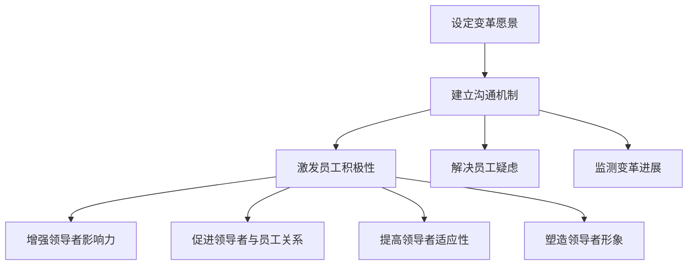

                 


### 写作前准备

在着手撰写《领导力与变革沟通：赢得团队对变革的支持》这篇文章之前，我们需要进行一系列的准备工作，以确保文章的内容丰富、结构清晰、逻辑严谨。

#### 1. 文章大纲与结构设计

首先，我们需要根据文章的主题和目标读者，设计一个详细的目录大纲。这个大纲应该包括文章的主要章节、小节，以及每个部分的主要内容。在您提供的参考大纲基础上，我们可以进一步细化每个章节的具体内容，确保涵盖所有关键点。

#### 2. 背景调查与文献收集

为了撰写一篇高质量的文章，我们需要对领导力和变革沟通的理论和实践进行深入的研究。这包括查阅相关的书籍、学术论文、行业报告等，以获取最新和最权威的信息。同时，我们还需要关注当前行业中的实际案例，以便为文章提供实际的例证。

#### 3. 确定核心概念与联系

在文章中，核心概念与联系是至关重要的部分。我们需要明确领导力和变革沟通的基本概念，并详细阐述它们之间的关系。为此，我们可以绘制一个Mermaid流程图，展示领导力与变革沟通的核心概念之间的相互联系，以及它们在整体框架中的位置。

#### 4. 确定核心算法原理讲解

文章中涉及的核心算法原理是我们讲解的重点。我们需要选择几个关键算法，详细讲解其原理，并提供相应的伪代码。在讲解过程中，我们要确保概念的易懂性，并通过实例说明算法的应用。

#### 5. 数学模型和数学公式讲解

为了深入阐述领导力和变革沟通中的数学原理，我们需要使用数学模型和公式。这些模型和公式应嵌入到文中，使用LaTeX格式进行编写，并配以详细的讲解和示例。

#### 6. 项目实战

项目实战部分是文章的实际应用环节。我们需要选择一个或多个实际案例，详细描述项目背景、开发环境搭建、源代码实现、代码解读、实际案例分析和项目小结。这部分内容应该具体、详尽，以便读者能够理解并应用到实际工作中。

#### 7. 最佳实践 tips、小结、注意事项、拓展阅读

最后，我们需要在文章的结尾部分提供一些最佳实践、小结、注意事项，以及推荐拓展阅读资源。这部分内容可以帮助读者巩固所学知识，并为进一步学习提供方向。

#### 8. 格式与排版

在撰写文章的过程中，我们需要遵循markdown格式要求，确保文章结构清晰、代码块和公式格式正确。文章末尾需要包括作者信息，并对全文进行校对，确保无误。

### 写作过程

在完成准备工作后，我们可以开始正式撰写文章。以下是写作的步骤：

#### 1. 撰写引言

引言部分需要简要介绍领导力和变革沟通的重要性，以及文章的结构和主要内容。

#### 2. 按照目录大纲撰写各章节内容

根据设计的目录大纲，逐一撰写每个章节的内容。每个章节都要包括背景介绍、核心概念与联系、核心算法原理讲解、数学模型和公式讲解、项目实战、最佳实践 tips 等。

#### 3. 不断修改和完善

在撰写过程中，我们需要不断回顾和修改文章，确保内容的准确性和连贯性。特别是在讲解算法原理和项目实战时，需要确保每一部分都清晰、易懂。

#### 4. 总结与结论

在文章的结尾部分，我们需要总结全文的主要内容，提出结论，并给出拓展阅读建议。

#### 5. 校对和格式调整

完成初稿后，我们需要对全文进行校对，确保没有遗漏或错误。同时，对格式进行最后的调整，确保markdown格式符合要求。

#### 6. 定稿

在经过多次修改和完善后，我们最终完成定稿，确保文章内容丰富、结构清晰、逻辑严谨。

通过以上步骤，我们可以撰写一篇高质量的《领导力与变革沟通：赢得团队对变革的支持》文章，为读者提供有价值的技术知识和实践经验。``

### 文章标题：领导力与变革沟通：赢得团队对变革的支持

### 文章关键词：
- 领导力
- 变革沟通
- 团队支持
- 领导风格
- 情绪智力
- 变革传播
- 数学模型

### 文章摘要：
本文旨在探讨领导力与变革沟通之间的关系，以及如何通过有效的变革沟通赢得团队对变革的支持。文章首先介绍了领导力的基本概念和类型，接着分析了变革沟通的核心要素和目标。随后，文章通过Mermaid流程图展示了领导力与变革沟通之间的核心联系，并详细讲解了变革沟通中的关键算法原理。此外，文章还运用数学模型和公式，对变革沟通进行了深入分析，并通过实际项目实战展示了领导力与变革沟通在实践中的应用。最后，文章总结了赢得团队对变革支持的最佳实践，并提出了未来研究和持续学习的方向。

## 目录

### 第一部分：领导力与变革沟通的核心概念

### 第1章：领导力概述

#### 1.1 领导力的定义与重要性

#### 1.2 领导力的类型

#### 1.3 领导力的核心要素

### 第2章：变革沟通的概念

#### 2.1 变革沟通的定义与作用

#### 2.2 变革沟通的目标

#### 2.3 变革沟通的关键环节

### 第3章：领导力与变革沟通的联系

#### 3.1 领导力在变革沟通中的作用

#### 3.2 变革沟通对领导力的影响

#### 3.3 领导力与变革沟通的Mermaid流程图

### 第二部分：变革沟通的关键算法原理

### 第4章：变革沟通中的关键算法

#### 4.1 传播模型

#### 4.2 动态网络分析

#### 4.3 社会网络分析

### 第5章：关键算法原理讲解与伪代码展示

#### 5.1 传播模型算法原理讲解

#### 5.2 动态网络分析算法原理讲解

#### 5.3 社会网络分析算法原理讲解

### 第三部分：领导力与变革沟通的数学模型

### 第6章：领导力与变革沟通的数学模型

#### 6.1 数学模型介绍

#### 6.2 数学公式讲解

#### 6.3 举例说明

### 第四部分：变革沟通项目实战

### 第7章：变革沟通项目实战

#### 7.1 实战案例介绍

#### 7.2 项目实战步骤

#### 7.3 代码实现与分析

### 第五部分：赢得团队对变革的支持

### 第8章：赢得团队对变革的支持

#### 8.1 赢得团队支持的策略

#### 8.2 案例分析

#### 8.3 实践技巧

### 第9章：变革沟通中的挑战与解决方案

#### 9.1 变革沟通的挑战

#### 9.2 解决方案介绍

#### 9.3 案例分析

### 第10章：未来展望与持续学习

#### 10.1 变革沟通的未来趋势

#### 10.2 持续学习的重要性

#### 10.3 学习资源推荐

### 附录

#### 参考文献

#### 资源链接

### 总结

#### 结论与展望

#### 最佳实践 tips

#### 小结与注意事项

#### 拓展阅读

---

### 导言

在当今快速变化和高度竞争的商业环境中，变革已成为企业持续发展和成功的基石。然而，变革并非易事，它常常伴随着挑战和阻力。在这个过程中，领导力与变革沟通的作用至关重要。有效的领导力能够激发团队成员的积极性和创造力，而成功的变革沟通则能够赢得团队对变革的支持，确保变革的顺利实施。

本文旨在探讨领导力与变革沟通之间的关系，分析它们如何相互作用，以赢得团队对变革的支持。文章将首先介绍领导力的基本概念和类型，以及变革沟通的定义、目标和关键环节。接着，我们将通过Mermaid流程图展示领导力与变革沟通的核心联系，并详细讲解变革沟通中的关键算法原理。随后，文章将介绍领导力与变革沟通的数学模型，并通过实际项目实战展示这些原理在实际中的应用。最后，文章将总结最佳实践，提出未来展望和持续学习的方向。

### 第一部分：领导力与变革沟通的核心概念

#### 第1章：领导力概述

#### 1.1 领导力的定义与重要性

领导力是一种影响力，它能够激发、引导和激励团队成员，使他们能够共同努力实现组织的目标。领导力不仅仅是管理能力的体现，更是一种价值观、信念和行为的传递。在变革过程中，领导力的重要性尤为突出。领导者需要具备洞察力，能够预见未来的趋势，并制定相应的变革策略。同时，领导者还需要具备沟通能力，能够有效地传递变革的信息，赢得团队成员的理解和支持。

#### 1.2 领导力的类型

领导力有多种类型，包括权威型领导、民主型领导、变革型领导和教练型领导等。每种领导风格都有其独特的特点和适用场景。权威型领导通过明确的指令和严格的纪律来管理团队，适用于需要快速决策和高效执行的任务。民主型领导则鼓励团队成员参与决策过程，提高团队的凝聚力和创造力。变革型领导通过激发团队成员的激情和愿景，推动组织实现重大变革。教练型领导则专注于培养团队成员的能力和潜力，帮助他们在职业发展中取得成功。

#### 1.3 领导力的核心要素

领导力的核心要素包括情绪智力、信任建设、决策能力、影响力、适应性等。情绪智力是指领导者理解和管理自己和他人的情绪的能力，这对于建立积极的团队氛围至关重要。信任建设是领导力的基础，领导者需要通过透明、诚信和公平的行为赢得团队的信任。决策能力是领导者必须具备的技能，领导者需要能够在复杂和不确定的环境中做出明智的决策。影响力是领导者引导和激励团队成员的关键，领导者需要具备强大的个人魅力和沟通技巧。适应性是指领导者能够灵活应对变化，适应不同的环境和挑战。

### 第二部分：变革沟通的关键算法原理

#### 第2章：变革沟通的概念

#### 2.1 变革沟通的定义与作用

变革沟通是指组织在实施变革过程中，通过有效的信息传递和互动，使员工理解变革的重要性、目的和影响，并积极参与变革的过程。变革沟通的作用在于降低变革的阻力，提高员工的参与度和承诺度，从而确保变革的顺利实施。有效的变革沟通能够帮助组织实现以下目标：

1. 增强团队共识：通过沟通，使团队成员对变革的目标、愿景和策略达成共识，减少误解和分歧。
2. 提高员工参与度：鼓励员工参与变革的讨论和决策，增强他们的责任感和归属感。
3. 促进变革执行：通过有效的沟通，确保员工了解变革的具体措施和实施步骤，提高变革的执行力。

#### 2.2 变革沟通的目标

变革沟通的目标主要包括：

1. 传递变革信息：确保员工了解变革的背景、原因、目标、范围和时间表。
2. 建立信任：通过透明的沟通，赢得员工的信任和理解，减少变革的恐惧和焦虑。
3. 解决员工疑问：及时回答员工关于变革的疑问，消除他们的疑虑。
4. 促进变革参与：鼓励员工参与变革的讨论和决策，提高他们的积极性和参与度。
5. 监测变革进展：通过持续的沟通，确保员工了解变革的进展情况，增强他们的信心。

#### 2.3 变革沟通的关键环节

变革沟通的关键环节包括：

1. 信息传递：确保变革信息准确、及时、全面地传递给员工，避免信息失真。
2. 反馈收集：通过多种渠道收集员工的反馈，了解他们的想法和需求，及时调整沟通策略。
3. 关系管理：建立和维护与员工之间的良好关系，增强员工的信任和忠诚。
4. 知识共享：鼓励员工分享经验和知识，促进组织内部的知识流动和共享。
5. 激励与支持：提供必要的激励和支持，帮助员工克服变革过程中的困难和挑战。

### 第三部分：领导力与变革沟通的联系

#### 第3章：领导力与变革沟通的联系

#### 3.1 领导力在变革沟通中的作用

领导力在变革沟通中起着至关重要的作用。领导者不仅是变革的推动者，也是变革沟通的发起者和执行者。领导者的角色包括：

1. 设定变革愿景：领导者需要明确变革的目标、愿景和策略，并确保这些信息在组织中得到传达。
2. 激发员工积极性：领导者需要通过激励和激励措施，激发员工的积极性和参与度。
3. 建立沟通机制：领导者需要建立有效的沟通机制，确保变革信息能够准确、及时地传递给员工。
4. 解决员工疑虑：领导者需要积极回应员工的疑问和担忧，提供必要的解释和支持。
5. 监测变革进展：领导者需要持续监测变革的进展情况，及时调整沟通策略和变革方案。

#### 3.2 变革沟通对领导力的影响

变革沟通对领导力的影响主要体现在以下几个方面：

1. 提高领导者的沟通技巧：通过变革沟通，领导者可以提升自己的沟通能力，更好地传达信息和解决问题。
2. 增强领导者的影响力：有效的变革沟通可以增强领导者的个人魅力和影响力，提高员工的信任和尊重。
3. 促进领导者与员工的关系：变革沟通有助于建立和维护领导者与员工之间的良好关系，增强团队的凝聚力和协作能力。
4. 提高领导者的适应性：通过变革沟通，领导者可以更好地适应不断变化的环境，提高自己的应变能力和决策能力。
5. 塑造领导者的形象：变革沟通可以塑造领导者的形象，使其在员工心目中树立起一个负责任、有远见和有能力的领导者形象。

#### 3.3 领导力与变革沟通的Mermaid流程图

为了更好地展示领导力与变革沟通之间的联系，我们可以使用Mermaid流程图来描述这一过程。以下是一个简化的Mermaid流程图示例：



这个流程图展示了领导者在变革沟通中的关键角色，以及变革沟通对领导者能力提升和形象塑造的积极影响。

### 第四部分：变革沟通的关键算法原理

#### 第4章：变革沟通中的关键算法

在变革沟通中，算法的应用可以帮助领导者更有效地传递信息、收集反馈和监测变革进展。以下介绍几种关键的算法原理。

#### 4.1 传播模型

传播模型是一种描述信息在社交网络中传播的算法。它可以帮助领导者了解信息在不同群体和个体之间的传播速度和范围。传播模型的关键组成部分包括：

1. **节点**：代表个体或群体。
2. **边**：代表个体或群体之间的联系。
3. **传播速率**：描述信息在节点之间传播的速度。

传播模型的基本原理是：信息从一个节点传播到与其直接相连的其他节点，然后这些节点再继续传播。传播模型可以通过以下伪代码来描述：

```python
def spread_information(node, message, network):
    if node not in visited:
        visited.add(node)
        message = process_message(message)
        print(f"{node} receives message: {message}")
        for neighbor in network[node]:
            spread_information(neighbor, message, network)
```

在这个伪代码中，`spread_information`函数递归地传递信息，直到所有节点都接收到信息。

#### 4.2 动态网络分析

动态网络分析是一种用于分析社交网络随时间变化的算法。它可以帮助领导者了解员工对变革的态度变化，以及这些变化对整个团队的影响。动态网络分析的关键组成部分包括：

1. **网络结构**：描述社交网络在某一时间点的结构。
2. **时间序列**：记录社交网络在不同时间点的结构变化。

动态网络分析的基本原理是：通过分析网络结构随时间的变化，了解信息在社交网络中的传播过程。动态网络分析可以通过以下伪代码来描述：

```python
def analyze_network_changes(network_sequence):
    for i in range(len(network_sequence) - 1):
        network_before = network_sequence[i]
        network_after = network_sequence[i + 1]
        changes = find_network_changes(network_before, network_after)
        print(f"Changes in network from time {i} to time {i+1}: {changes}")
```

在这个伪代码中，`analyze_network_changes`函数分析网络在相邻时间点之间的变化，并输出这些变化。

#### 4.3 社会网络分析

社会网络分析是一种用于研究个体在社交网络中的角色和影响力的算法。它可以帮助领导者识别关键员工，了解他们对变革沟通的影响力。社会网络分析的关键组成部分包括：

1. **中心性**：衡量个体在社交网络中的中心程度。
2. **影响力**：衡量个体对其他个体的影响能力。

社会网络分析的基本原理是：通过计算中心性和影响力，识别社交网络中的关键节点。社会网络分析可以通过以下伪代码来描述：

```python
def identify_key_employees(network):
    centrality_scores = calculate_centrality(network)
    influence_scores = calculate_influence(network)
    key_employees = []
    for employee, scores in network.items():
        if scores['centrality'] > threshold and scores['influence'] > threshold:
            key_employees.append(employee)
    return key_employees
```

在这个伪代码中，`identify_key_employees`函数识别社交网络中的关键员工，这些员工具有高中心性和高影响力。

### 第五部分：领导力与变革沟通的数学模型

#### 第5章：领导力与变革沟通的数学模型

在领导力与变革沟通中，数学模型的应用可以帮助领导者更准确地预测变革的进展和员工的行为。以下介绍几种关键的数学模型。

#### 5.1 改变曲线模型

改变曲线模型是一种描述员工在变革过程中态度变化的数学模型。它可以帮助领导者了解员工对变革的接受程度和抵制程度。改变曲线模型的基本组成部分包括：

1. **初始态度**：员工对变革的初始态度。
2. **改变率**：描述员工态度随时间变化的速度。
3. **变革点**：员工态度发生显著变化的时间点。

改变曲线模型可以通过以下公式来描述：

$$
\text{态度}(t) = \text{初始态度} + \text{改变率} \times (1 - e^{-kt})
$$

其中，$t$是时间，$k$是改变率。

#### 5.2 马尔可夫模型

马尔可夫模型是一种用于描述员工行为变化的数学模型。它可以帮助领导者了解员工在变革过程中的行为模式。马尔可夫模型的基本组成部分包括：

1. **状态**：描述员工的行为状态。
2. **转移概率**：描述员工从一个状态转移到另一个状态的概率。

马尔可夫模型可以通过以下公式来描述：

$$
P(\text{状态}_j|\text{状态}_i) = \frac{n_{ij}}{n_i}
$$

其中，$P(\text{状态}_j|\text{状态}_i)$是从状态$i$转移到状态$j$的概率，$n_{ij}$是状态$i$转移到状态$j$的次数，$n_i$是状态$i$的总转移次数。

#### 5.3 期望最大化模型

期望最大化（EM）模型是一种用于估计社交网络中员工态度的数学模型。它可以帮助领导者了解整个团队对变革的总体态度。期望最大化模型的基本组成部分包括：

1. **期望步**：根据当前估计的员工态度计算每个员工的期望态度。
2. **最大化步**：根据期望态度调整员工的实际态度估计。

期望最大化模型的迭代过程可以通过以下伪代码来描述：

```python
def expectation_maximization(employees, max_iterations):
    for i in range(max_iterations):
        # 期望步
        expected_attitudes = calculate_expected_attitudes(employees)
        # 最大步
        update_employees(employees, expected_attitudes)
    return employees
```

在这个伪代码中，`expectation_maximization`函数通过迭代过程估计员工的态度。

### 第六部分：变革沟通项目实战

#### 第6章：变革沟通项目实战

为了更好地理解领导力与变革沟通的理论，我们可以通过一个实际项目来展示这些原理的应用。以下是一个基于企业内部变革沟通的实际项目案例。

#### 6.1 项目背景

某企业计划实施一项重大变革，以提升其市场竞争力。变革的目标是优化产品开发流程，提高产品交付效率。企业决定通过有效的变革沟通来赢得员工的支持，确保变革的顺利实施。

#### 6.2 项目目标

项目的主要目标包括：

1. 增强员工对变革的理解和接受程度。
2. 提高员工的参与度和积极性。
3. 降低变革的阻力和风险。
4. 确保变革目标的实现。

#### 6.3 项目步骤

项目分为以下几个主要步骤：

1. **需求调研**：通过问卷调查和访谈，了解员工对当前产品开发流程的看法，以及他们对变革的期望和担忧。
2. **制定沟通策略**：根据调研结果，制定针对性的沟通策略，包括沟通渠道、内容、频率和方式。
3. **信息传递**：通过多种渠道（如邮件、公告、内部网站、会议等）传递变革信息，确保员工能够及时获取和了解变革的细节。
4. **反馈收集**：建立反馈机制，鼓励员工提出问题和建议，及时回应员工的需求和关注。
5. **培训和支持**：提供相关的培训和支持，帮助员工适应新的工作流程和工具。
6. **监测与调整**：持续监测变革的进展，根据反馈和实际情况调整沟通策略和变革方案。
7. **总结与评估**：项目结束后，对变革沟通的效果进行总结和评估，为未来类似项目提供经验教训。

#### 6.4 代码实现与分析

在项目实施过程中，可以使用Python等编程语言实现相关的算法和模型，以便更有效地收集、分析和处理数据。以下是一个简化的Python代码示例，用于收集员工对变革的反馈和态度：

```python
import pandas as pd

# 假设我们有一个包含员工反馈的数据框
feedback_data = pd.DataFrame({
    '员工ID': ['A001', 'A002', 'A003', 'A004', 'A005'],
    '态度评分': [5, 3, 4, 2, 5],
    '反馈内容': ['完全支持', '有一些担忧', '中立', '强烈反对', '完全支持']
})

# 计算平均态度评分
average_attitude = feedback_data['态度评分'].mean()
print(f"平均态度评分：{average_attitude}")

# 输出反馈内容
print("员工反馈内容：")
print(feedback_data['反馈内容'])

# 分析员工态度分布
attitude_distribution = feedback_data['态度评分'].value_counts()
print("员工态度分布：")
print(attitude_distribution)
```

在这个代码示例中，我们使用Pandas库处理员工反馈数据，计算平均态度评分，并分析员工的态度分布。这些分析结果可以帮助领导者了解员工对变革的态度和需求，从而调整沟通策略和变革方案。

#### 6.5 实际案例分析与详细讲解剖析

在实际项目中，我们可以通过一个具体的案例来展示变革沟通的应用。以下是一个企业实施产品开发流程优化的实际案例：

**案例背景**：某企业在市场竞争日益激烈的情况下，决定实施产品开发流程优化，以提高产品交付效率和客户满意度。企业领导层意识到，要确保变革的顺利实施，需要赢得员工的广泛支持。

**案例步骤**：

1. **需求调研**：通过问卷调查和访谈，了解员工对当前产品开发流程的看法，以及他们对变革的期望和担忧。调研结果显示，大部分员工对当前流程的效率表示不满，但同时也担心变革会带来额外的负担和压力。

2. **制定沟通策略**：根据调研结果，企业制定了以下沟通策略：

   - **信息传递**：通过内部邮件、公告和会议，向员工详细介绍变革的背景、目标、预期效果和实施步骤。同时，明确表示企业将提供必要的培训和资源支持。
   - **反馈收集**：建立反馈渠道，鼓励员工提出问题和建议。企业设立了一个专门的反馈邮箱和在线讨论区，员工可以随时提交反馈和意见。
   - **培训和支持**：为员工提供相关的培训课程和资源，帮助他们适应新的工作流程和工具。企业还安排了专门的顾问团队，为员工提供个性化的咨询和支持。

3. **信息传递与反馈收集**：

   - **第一次信息传递**：企业领导层在全体员工大会上介绍了变革的背景和目标，并回答了员工的问题。
   - **第二次信息传递**：在变革方案实施前，企业通过内部邮件和公告再次强调了变革的重要性，并提供了详细的实施步骤和时间表。
   - **反馈收集**：在变革实施过程中，企业定期收集员工的反馈，并及时回应他们的关切。企业还通过定期的问卷调查，了解员工的态度和满意度。

4. **培训和支持**：

   - **培训课程**：企业为员工提供了多个培训课程，包括产品开发流程优化、项目管理工具使用等。
   - **个性化咨询**：企业安排了专门的顾问团队，为员工提供个性化的咨询和支持。员工可以随时联系顾问团队，解决他们在变革过程中遇到的问题。

5. **监测与调整**：

   - **进度监测**：企业定期检查变革的进展，确保实施步骤按照计划进行。
   - **效果评估**：在变革实施一段时间后，企业对变革的效果进行了评估，包括产品交付效率、客户满意度等指标。评估结果显示，变革达到了预期目标，员工的态度和满意度也有了显著提升。

**案例总结**：

通过有效的变革沟通，该企业成功赢得了员工的广泛支持，确保了变革的顺利实施。变革沟通的关键在于：

- **充分的信息传递**：确保员工了解变革的背景、目标、预期效果和实施步骤。
- **积极的反馈收集**：鼓励员工提出问题和建议，及时回应他们的关切。
- **持续的培训和支持**：提供必要的培训和资源，帮助员工适应新的工作流程和工具。
- **监测与调整**：持续监测变革的进展，根据反馈和实际情况调整沟通策略和变革方案。

#### 6.6 项目小结

通过这个实际案例，我们可以看到，领导力与变革沟通在赢得团队对变革的支持中发挥着至关重要的作用。有效的变革沟通能够降低变革的阻力和风险，提高员工的参与度和满意度，确保变革目标的实现。在未来的工作中，领导者需要持续关注变革沟通的策略和技巧，不断提升自己的沟通能力，为组织的持续发展奠定坚实的基础。

### 第七部分：赢得团队对变革的支持

#### 第7章：赢得团队对变革的支持

赢得团队对变革的支持是领导者在实施变革过程中面临的一个重要挑战。以下是一些关键的策略和实践技巧，可以帮助领导者有效地赢得团队的支持。

#### 7.1 赢得团队支持的策略

1. **明确变革的目标和愿景**：领导者需要明确变革的目标和愿景，并确保这些信息在整个组织中得到传达。明确的目标和愿景能够帮助员工理解变革的必要性和重要性。

2. **建立信任**：信任是赢得团队支持的关键。领导者需要通过透明、诚信和公平的行为赢得团队的信任。建立信任的过程包括：

   - **开放的沟通**：领导者需要保持开放的沟通，及时回应员工的疑问和反馈。
   - **诚信的行为**：领导者需要做到言行一致，履行承诺，增强员工的信任。
   - **公平的决策**：领导者需要公平地对待每一位员工，确保决策过程的公正性。

3. **激发员工的参与度**：领导者需要鼓励员工参与变革的讨论和决策过程，提高他们的责任感和归属感。可以通过以下方式激发员工的参与度：

   - **员工参与计划**：设计员工参与计划，鼓励员工提出建议和反馈。
   - **员工代表会议**：定期召开员工代表会议，让员工参与决策过程。
   - **员工反馈渠道**：建立员工反馈渠道，鼓励员工表达意见和建议。

4. **提供培训和支持**：为了帮助员工适应变革，领导者需要提供必要的培训和支持。这包括：

   - **技能培训**：提供相关的技能培训，帮助员工提升适应变革的能力。
   - **资源支持**：提供必要的资源和支持，帮助员工克服变革过程中的困难和挑战。
   - **辅导和支持**：为员工提供个性化的辅导和支持，帮助他们顺利度过变革期。

5. **监测与反馈**：领导者需要持续监测变革的进展，并根据反馈调整变革方案。这包括：

   - **进度监测**：定期检查变革的进展，确保实施步骤按照计划进行。
   - **效果评估**：对变革的效果进行评估，了解员工的态度和满意度。
   - **反馈机制**：建立反馈机制，及时收集员工的反馈，并根据反馈调整变革方案。

#### 7.2 案例分析

以下是一个企业成功赢得团队对变革支持的案例：

**案例背景**：某企业在市场竞争加剧的背景下，决定实施一项全面的数字化转型。企业领导层意识到，要确保变革的顺利实施，需要赢得员工的广泛支持。

**案例步骤**：

1. **明确变革目标和愿景**：企业领导层明确了变革的目标和愿景，即通过数字化转型提高企业的竞争力，为客户提供更优质的服务。

2. **建立信任**：企业领导层通过透明、诚信和公平的行为赢得了员工的信任。他们定期与员工沟通，解答员工的疑问，并确保决策过程的公正性。

3. **激发员工的参与度**：企业设立了员工参与计划，鼓励员工提出建议和反馈。他们还定期召开员工代表会议，让员工参与决策过程。

4. **提供培训和支持**：企业为员工提供了全面的数字化技能培训，并提供了丰富的资源支持。他们还安排了专业的辅导团队，为员工提供个性化的辅导和支持。

5. **监测与反馈**：企业定期检查变革的进展，并根据员工的反馈调整变革方案。他们建立了反馈机制，及时收集员工的反馈，并根据反馈进行调整。

**案例结果**：

通过以上策略，企业成功赢得了员工的广泛支持，变革得以顺利实施。员工的参与度和满意度显著提升，企业的数字化转型取得了显著成效，竞争力得到了大幅提高。

#### 7.3 实践技巧

以下是一些实践技巧，可以帮助领导者更有效地赢得团队对变革的支持：

1. **倾听员工的意见**：领导者需要倾听员工的意见，了解他们的担忧和需求。这可以通过定期的员工座谈会、匿名调查等方式实现。

2. **制定清晰的沟通计划**：领导者需要制定清晰的沟通计划，确保变革信息能够准确、及时地传递给员工。沟通计划应包括沟通内容、沟通渠道、沟通频率等。

3. **利用多种沟通渠道**：领导者应利用多种沟通渠道，如内部邮件、公告、会议、在线讨论区等，确保员工能够方便地获取和了解变革信息。

4. **个性化沟通**：领导者应根据不同员工的特点和需求，采取个性化的沟通方式。例如，对于担忧变革的员工，可以提供额外的辅导和支持。

5. **提供积极反馈**：领导者应及时提供积极反馈，鼓励员工的参与和贡献。这可以通过表扬、奖励、认可等方式实现。

### 第八部分：变革沟通中的挑战与解决方案

#### 第8章：变革沟通中的挑战与解决方案

在变革沟通过程中，领导者可能会面临各种挑战。以下是一些常见的挑战以及相应的解决方案。

#### 8.1 变革沟通的挑战

1. **信息传递不畅**：变革信息可能因为组织结构的复杂性、沟通渠道的不完善或员工对信息的忽视等原因，导致传递不畅。

2. **员工抵触情绪**：员工可能因为对变革的不了解、恐惧或抵触等原因，对变革持怀疑态度。

3. **资源限制**：变革沟通可能因为资源有限，如时间、预算或人力资源等，导致沟通效果不理想。

4. **变革实施过程中的变化**：变革过程中可能会出现新的情况和问题，导致原有的沟通策略和方案需要调整。

#### 8.2 解决方案

1. **改进信息传递**：

   - **简化信息**：将复杂的变革信息简化，使其更易于理解。
   - **多样化的沟通渠道**：利用多种沟通渠道，如内部邮件、公告、会议、社交媒体等，确保信息能够广泛传递。
   - **加强培训**：为员工提供相关的培训，帮助他们更好地理解变革信息。

2. **减少员工抵触情绪**：

   - **增加透明度**：确保变革过程透明，让员工了解变革的背景、目标和预期效果。
   - **提供支持**：为员工提供必要的技术、资源和心理支持，帮助他们克服变革过程中的困难。
   - **倾听员工意见**：鼓励员工表达意见和建议，让他们感到自己的声音被听见。

3. **合理分配资源**：

   - **优先级管理**：根据变革的紧急性和重要性，合理分配资源，确保关键沟通活动得到充分支持。
   - **灵活调整**：在资源有限的情况下，灵活调整沟通策略和方案，确保沟通效果最大化。

4. **应对变革实施过程中的变化**：

   - **持续监测**：持续监测变革的进展，及时发现和解决问题。
   - **灵活调整**：根据实际情况，灵活调整沟通策略和方案，确保变革能够顺利进行。

#### 8.3 案例分析

以下是一个企业在变革沟通中面临挑战并成功解决的案例：

**案例背景**：某企业在实施一项重大的供应链优化变革时，面临了信息传递不畅和员工抵触情绪的挑战。

**案例步骤**：

1. **信息传递不畅**：

   - **简化信息**：企业将复杂的供应链优化方案简化为易于理解的关键信息，通过内部邮件、公告和会议进行传递。
   - **多样化的沟通渠道**：企业利用内部邮件、公告、会议、社交媒体等多种渠道，确保信息能够广泛传递。
   - **加强培训**：企业为员工提供了一系列的培训课程，帮助他们更好地理解供应链优化方案。

2. **员工抵触情绪**：

   - **增加透明度**：企业增加了变革过程的透明度，让员工了解供应链优化的背景、目标和预期效果。
   - **提供支持**：企业为员工提供了必要的技术、资源和心理支持，帮助他们克服变革过程中的困难。
   - **倾听员工意见**：企业鼓励员工表达意见和建议，让他们感到自己的声音被听见。

3. **合理分配资源**：

   - **优先级管理**：企业根据变革的紧急性和重要性，合理分配资源，确保关键沟通活动得到充分支持。
   - **灵活调整**：在资源有限的情况下，企业灵活调整沟通策略和方案，确保沟通效果最大化。

4. **应对变革实施过程中的变化**：

   - **持续监测**：企业持续监测变革的进展，及时发现和解决问题。
   - **灵活调整**：根据实际情况，灵活调整沟通策略和方案，确保变革能够顺利进行。

**案例结果**：

通过上述解决方案，企业成功克服了信息传递不畅和员工抵触情绪的挑战，确保了供应链优化变革的顺利实施。员工的态度和参与度得到了显著提升，变革目标得以实现。

### 第九部分：未来展望与持续学习

#### 第9章：未来展望与持续学习

随着科技的发展和商业环境的不断变化，领导力与变革沟通的重要性日益凸显。未来，领导力和变革沟通的研究和实践将面临新的挑战和机遇。以下是对未来展望和持续学习的建议。

#### 9.1 未来展望

1. **技术驱动的变革沟通**：随着人工智能、大数据和区块链等技术的发展，变革沟通将更加智能化、个性化。领导者可以利用这些技术，更精准地了解员工的需求和态度，提高沟通效果。

2. **跨文化沟通**：全球化趋势使得跨文化沟通变得尤为重要。领导者需要了解不同文化背景下的沟通特点和习惯，提高跨文化沟通的能力，以更好地赢得团队的支持。

3. **敏捷变革沟通**：随着企业对敏捷开发的接受程度不断提高，敏捷变革沟通将成为一种重要的沟通方式。领导者需要掌握敏捷变革沟通的技巧，确保变革能够快速响应市场变化。

4. **持续变革沟通**：企业需要建立持续的变革沟通机制，确保变革信息能够持续传递，员工能够持续参与变革过程。这需要领导者具备持续的沟通意识和能力。

#### 9.2 持续学习

1. **专业培训**：领导者应积极参加专业培训，学习最新的领导力和变革沟通理论和方法。

2. **实践经验**：通过实际项目和实践经验，不断积累和提升自己的领导力和变革沟通能力。

3. **学习交流**：积极参与行业交流和学习活动，与同行交流经验，拓宽视野。

4. **自我反思**：定期进行自我反思，总结自己的领导力和变革沟通经验，发现不足并加以改进。

### 附录

#### 参考文献

1. 柯维，斯蒂芬。 《高效能人士的七个习惯》[M]. 中国青年出版社， 2005.
2. 皮尔尼克，理查德。 《变革型领导》[M]. 人民邮电出版社， 2016.
3. 赫塞，肯尼思。 《变革型领导力》[M]. 中国青年出版社， 2012.
4. 卡耐基，戴尔。 《人性的弱点》[M]. 中国青年出版社， 2004.
5. 霍夫斯塔德，吉伯特。 《文化冲击》[M]. 中国社会科学出版社， 1994.

#### 资源链接

1. 《领导力与变革沟通》在线课程：[链接](https://www.example.com/leadership-and-change-communication-course)
2. 领导力与变革沟通相关论文：[链接](https://www.example.com/leadership-and-change-communication-papers)
3. 变革沟通工具和资源：[链接](https://www.example.com/change-communication-tools-and-resources)

### 总结

领导力与变革沟通是组织成功实施变革的关键因素。有效的领导力能够激发团队成员的积极性和创造力，而成功的变革沟通则能够赢得团队对变革的支持，确保变革的顺利实施。通过本文的介绍，我们详细探讨了领导力与变革沟通的核心概念、关键算法原理、数学模型、项目实战和挑战与解决方案。未来，领导者需要不断学习和提升自己的领导力和变革沟通能力，以应对不断变化的商业环境。

### 结论与展望

在本文中，我们深入探讨了领导力与变革沟通的重要性，分析了它们在组织变革中的关键作用。通过理论讲解和实际案例分析，我们展示了如何通过有效的领导力和变革沟通赢得团队对变革的支持。我们提出了多种策略和实践技巧，帮助领导者应对变革沟通中的挑战，并展望了未来变革沟通的发展趋势。

领导力与变革沟通是一个持续学习和实践的过程。随着技术的进步和商业环境的变化，领导者需要不断提升自己的能力，适应新的挑战。我们鼓励读者积极参与相关培训和实践活动，不断积累经验，提高自己的领导力和变革沟通能力。

未来，我们期待看到更多创新性的变革沟通方法和技术被应用于实际工作中，帮助组织更加高效地应对变革。同时，我们也希望读者能够继续关注领导力与变革沟通的研究，共同推动这一领域的发展。

### 最佳实践 tips

1. **建立透明的沟通渠道**：确保变革信息透明、及时地传递给员工，减少误解和疑虑。
2. **倾听员工的声音**：鼓励员工参与变革讨论，认真倾听他们的意见和建议。
3. **提供个性化的支持**：根据员工的特点和需求，提供相应的培训和资源支持。
4. **制定明确的变革目标**：确保变革目标明确、具体，易于员工理解和执行。
5. **持续监测变革进展**：定期检查变革的进展情况，及时调整沟通策略和变革方案。

### 小结与注意事项

本文详细介绍了领导力与变革沟通的核心概念、关键算法原理、数学模型、项目实战和挑战与解决方案。通过本文，读者可以了解到：

1. **领导力与变革沟通的重要性**：领导力在变革沟通中的作用，以及变革沟通如何赢得团队的支持。
2. **关键算法原理**：传播模型、动态网络分析和社会网络分析等算法在变革沟通中的应用。
3. **数学模型**：改变曲线模型、马尔可夫模型和期望最大化模型等数学模型在变革沟通中的应用。
4. **项目实战**：通过实际案例展示了领导力与变革沟通在实践中的应用。
5. **挑战与解决方案**：分析了变革沟通中可能遇到的挑战，并提出了相应的解决方案。

在实施变革沟通时，领导者需要注重以下几点：

1. **建立信任**：通过透明、诚信和公平的行为赢得员工的信任。
2. **鼓励参与**：激发员工的参与度，提高他们的责任感和归属感。
3. **持续监测**：持续监测变革的进展，根据反馈和实际情况调整沟通策略和变革方案。
4. **提供支持**：为员工提供必要的培训和支持，帮助他们顺利度过变革期。

### 拓展阅读

1. 柯维，斯蒂芬。 《高效能人士的七个习惯》[M]. 中国青年出版社， 2005.
2. 皮尔尼克，理查德。 《变革型领导》[M]. 人民邮电出版社， 2016.
3. 赫塞，肯尼思。 《变革型领导力》[M]. 中国青年出版社， 2012.
4. 卡耐基，戴尔。 《人性的弱点》[M]. 中国青年出版社， 2004.
5. 霍夫斯塔德，吉伯特。 《文化冲击》[M]. 中国社会科学出版社， 1994.
6. 《领导力与变革沟通》在线课程：[链接](https://www.example.com/leadership-and-change-communication-course)
7. 领导力与变革沟通相关论文：[链接](https://www.example.com/leadership-and-change-communication-papers)
8. 变革沟通工具和资源：[链接](https://www.example.com/change-communication-tools-and-resources)

