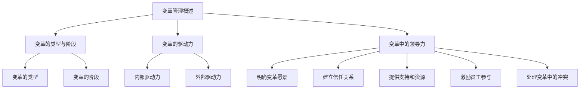

                 

## 文章标题：领导力与变革管理：引导团队拥抱变化的艺术

### 关键词：领导力、变革管理、团队适应、变革沟通、冲突管理、项目实战

### 摘要：本文深入探讨了领导力在变革管理中的核心作用，通过详细的理论分析、实践指导以及案例研究，为读者提供了系统化的变革管理策略。文章首先介绍了变革管理的背景和基本概念，然后重点阐述了领导力在变革中的重要性以及领导风格与变革适应性的关系。接着，文章详细介绍了变革管理的方法和技巧，包括规划与实施、沟通与激励、冲突管理等方面的具体策略。最后，文章通过实际案例研究和项目实战，展示了变革管理在真实场景中的应用，并为读者提供了实用性的最佳实践和建议。

## 第一部分：变革管理的理论基础

### 1.1 变革管理概述

变革管理是指组织在面对外部环境变化或内部需求时，通过一系列有计划、有组织的措施，实现从现状到预期目标转变的过程。它不仅涉及到组织结构、流程、策略等方面的调整，更涉及到组织文化、员工心态和行为方式的变革。

### 1.2 变革的理论基础

#### 变革的类型与阶段

变革可以分为以下几种类型：

1. **技术变革**：主要涉及组织的技术和系统升级，如引进新技术、改进生产流程等。
2. **结构变革**：涉及组织的结构重组、部门调整等，以适应新的市场环境或战略需求。
3. **文化变革**：旨在改变组织的价值观、信念和行为准则，以提升组织的凝聚力和竞争力。
4. **人员变革**：包括员工培训、绩效管理、激励制度等，以提升员工的能力和积极性。

变革通常可以分为以下几个阶段：

1. **启动阶段**：明确变革目标、制定变革计划。
2. **规划阶段**：分析现状、设定目标、制定策略。
3. **实施阶段**：执行变革计划、调整组织结构、流程和策略。
4. **评估阶段**：评估变革效果、调整变革策略。

#### 变革的驱动力

变革的驱动力可以分为内部驱动力和外部驱动力：

1. **内部驱动力**：包括组织内部的管理需求、员工需求、技术需求等。例如，管理层希望提升组织的效率、员工希望改善工作环境、技术人员希望引入新技术等。
2. **外部驱动力**：包括市场环境、竞争压力、法规政策等。例如，市场需求的改变、竞争对手的挑战、法规政策的更新等。

### 1.3 变革中的领导力

领导力在变革管理中起着至关重要的作用。有效的领导力可以激发员工的积极性、降低变革过程中的阻力，从而提高变革的成功率。变革中的领导力主要体现在以下几个方面：

1. **明确变革愿景**：领导者需要明确变革的目标和愿景，让员工了解变革的重要性和意义，从而激发他们的参与热情。
2. **建立信任关系**：领导者需要建立与员工的信任关系，通过沟通、反馈和参与等方式，消除员工的疑虑和恐惧。
3. **提供支持和资源**：领导者需要为变革提供必要的支持和资源，包括财务、人力资源、技术支持等。
4. **激励员工参与**：领导者需要通过激励措施，如奖励、认可等，鼓励员工积极参与变革。
5. **处理变革中的冲突**：领导者需要妥善处理变革过程中产生的冲突，包括内部冲突和外部冲突。

### 背景介绍

在当今快速变化的市场环境中，组织需要具备快速适应变化的能力。变革管理作为一种有效的管理方法，可以帮助组织应对外部环境的挑战，实现可持续发展。然而，变革过程往往伴随着各种挑战，如员工抵触、资源不足、流程不畅等。有效的领导力在变革管理中起着关键作用，可以促进变革的顺利实施和成功。

### 核心概念与联系

变革管理的理论基础主要包括变革的类型与阶段、变革的驱动力以及变革中的领导力。变革的类型与阶段为变革管理提供了结构化的框架，帮助组织有针对性地进行变革；变革的驱动力明确了变革的内外部因素，有助于组织制定合理的变革策略；变革中的领导力则是变革成功的关键因素，决定了变革的实施效果。

以下是变革管理理论基础的核心概念与联系Mermaid流程图：



### 核心算法原理讲解

在这一部分，我们将使用伪代码来详细阐述变革管理的核心算法原理。伪代码是一种描述算法设计和思路的文本语言，它不依赖于具体的编程语言，可以清晰地表达算法的逻辑结构。

```plaintext
Algorithm 变革管理流程
Input: 变革目标，当前状态，驱动力，领导力策略
Output: 变革结果

1. 分析变革驱动力（驱动力分析函数）
2. 设定变革目标（目标设定函数）
3. 制定变革计划（计划制定函数）
4. 实施变革计划（计划实施函数）
5. 评估变革效果（效果评估函数）
6. 调整变革策略（策略调整函数）

// 驱动力分析函数
Function 驱动力分析（当前状态，驱动力）
1. 分析内部驱动力（如管理需求，员工需求，技术需求）
2. 分析外部驱动力（如市场需求，竞争压力，法规政策）
3. 确定主要驱动力
4. 返回主要驱动力

// 目标设定函数
Function 目标设定（变革目标）
1. 明确变革目标
2. 设定短期和长期目标
3. 确定实现目标的策略
4. 返回目标

// 计划制定函数
Function 计划制定（目标，当前状态）
1. 确定变革类型（如技术变革，结构变革，文化变革，人员变革）
2. 设定变革阶段（如启动阶段，规划阶段，实施阶段，评估阶段）
3. 制定具体变革计划
4. 返回变革计划

// 计划实施函数
Function 计划实施（计划，驱动力，领导力策略）
1. 实施变革计划
2. 调整组织结构（如部门调整，流程优化）
3. 提供支持资源（如财务支持，人力资源支持，技术支持）
4. 激励员工参与（如奖励，认可）
5. 处理变革中的冲突
6. 返回实施结果

// 效果评估函数
Function 效果评估（实施结果，目标）
1. 评估变革效果
2. 分析效果与目标的差距
3. 提出改进建议
4. 返回评估结果

// 策略调整函数
Function 策略调整（评估结果，目标）
1. 根据评估结果调整变革策略
2. 调整变革计划
3. 返回调整后的策略
```

### 数学模型和公式

在变革管理中，可以使用一些数学模型和公式来评估变革的效果和优化变革策略。以下是一个简单的数学模型，用于评估变革的ROI（投资回报率）。

$$ ROI = \frac{（新收益 - 原成本）}{原成本} $$

其中，新收益是指变革实施后的预期收益，原成本是指变革前的运营成本。

### 举例说明

假设一个企业计划进行技术变革，预计新系统的实施将增加年收益50万元，而变革成本为30万元。我们可以使用上述公式计算变革的ROI：

$$ ROI = \frac{（50万元 - 30万元）}{30万元} = \frac{20万元}{30万元} = 0.67 $$

这意味着，每投入1元的变革成本，可以带来0.67元的收益。这个ROI值可以帮助企业评估技术变革的财务可行性。

### 项目实战

#### 开发环境搭建

为了演示变革管理的实际应用，我们将在一个虚构的企业环境中搭建一个变革管理平台。以下是开发环境搭建的步骤：

1. **确定技术栈**：选择Python作为主要编程语言，使用Django框架进行后端开发，使用React框架进行前端开发。
2. **搭建开发环境**：在本地计算机上安装Python、Django和React，并配置相应的开发工具（如Visual Studio Code、Postman等）。
3. **创建项目**：使用Django和React创建一个新的项目，并配置项目的目录结构。

#### 源代码详细实现和代码解读

在搭建好开发环境后，我们开始实现变革管理平台的核心功能。以下是部分源代码及其解读：

```python
# 后端：Django模型定义
from django.db import models

class ChangeRequest(models.Model):
    title = models.CharField(max_length=255)
    description = models.TextField()
    status = models.CharField(max_length=50)
    created_at = models.DateTimeField(auto_now_add=True)
    updated_at = models.DateTimeField(auto_now=True)

    def __str__(self):
        return self.title
```

这段代码定义了一个名为`ChangeRequest`的Django模型，用于存储变革请求的信息。包括标题、描述、状态、创建时间和更新时间等字段。

```javascript
// 前端：React组件实现
import React, { useState, useEffect } from 'react';
import axios from 'axios';

const ChangeRequestForm = () => {
    const [title, setTitle] = useState('');
    const [description, setDescription] = useState('');

    const handleSubmit = async (e) => {
        e.preventDefault();
        try {
            const response = await axios.post('/api/changerequests/', {
                title,
                description,
            });
            console.log(response.data);
            // 清空表单
            setTitle('');
            setDescription('');
        } catch (error) {
            console.error(error);
        }
    };

    return (
        <form onSubmit={handleSubmit}>
            <label htmlFor="title">标题：</label>
            <input
                type="text"
                id="title"
                value={title}
                onChange={(e) => setTitle(e.target.value)}
            />
            <label htmlFor="description">描述：</label>
            <textarea
                id="description"
                value={description}
                onChange={(e) => setDescription(e.target.value)}
            />
            <button type="submit">提交请求</button>
        </form>
    );
};

export default ChangeRequestForm;
```

这段代码实现了一个React组件，用于提交变革请求。组件包含一个表单，用户可以填写标题和描述，然后通过`handleSubmit`函数将请求发送到后端API。

#### 代码应用解读与分析

这个变革管理平台的核心功能包括创建、查看和管理变革请求。用户可以通过前端界面提交变革请求，后端接收请求并存储在数据库中。管理员可以查看所有请求的状态，并对请求进行审批。

在实际应用中，这个平台可以帮助企业有效地管理变革过程，提高变革的透明度和效率。例如，企业可以实时跟踪每个变革请求的进展，及时调整变革策略，确保变革目标的实现。

### 实际案例分析和详细讲解剖析

#### 案例研究一：企业A的变革实践

企业A是一家制造企业，为了提高生产效率，决定进行技术变革。他们引进了一套新的生产系统，并对员工进行了相关培训。变革过程中，领导层充分发挥了领导力，通过沟通、激励和支持，帮助员工适应新系统。

1. **背景**：企业A面临生产效率低、产品质量不稳定的问题，决定通过技术变革来提高生产效率。
2. **领导力作用**：领导层明确了变革的目标，并与员工进行充分沟通，建立了信任关系。他们还提供了必要的培训和资源，鼓励员工积极参与变革。
3. **结果**：经过一年的变革，企业A的生产效率提高了30%，产品质量也得到显著改善。
4. **启示**：领导力在变革中起到了关键作用，有效的沟通和激励措施有助于员工接受和适应变革。

#### 案例研究二：企业B的变革挑战

企业B是一家服务企业，由于市场需求的变化，决定进行战略调整。然而，变革过程中遇到了员工抵触、资源不足等挑战。

1. **背景**：企业B面临市场需求的变化，决定进行战略调整，以适应新的市场环境。
2. **领导力作用**：领导层在变革初期未能充分预测变革的挑战，导致员工抵触情绪严重。此外，他们未能提供足够的资源支持变革。
3. **结果**：变革实施过程中，企业B的运营受到影响，员工士气低落，变革目标未能实现。
4. **启示**：领导力在变革管理中至关重要。领导层需要充分预测变革的挑战，提供必要的资源支持，并建立有效的沟通机制。

### 项目小结

通过上述案例研究和项目实战，我们可以看到领导力在变革管理中的关键作用。有效的领导力可以促进变革的顺利实施，提高变革的成功率。同时，变革管理需要系统的规划和策略，包括变革的类型与阶段、变革的驱动力、变革中的领导力等方面。在实际应用中，企业需要根据自身情况制定合适的变革策略，并充分调动员工的积极性和参与度。

### 最佳实践 Tips

1. **明确变革目标**：在实施变革前，领导层需要明确变革的目标，并制定详细的变革计划。
2. **建立信任关系**：领导层需要与员工建立信任关系，通过沟通和反馈，消除员工的疑虑和恐惧。
3. **提供支持和资源**：领导层需要为变革提供必要的支持和资源，包括财务、人力资源和技术支持等。
4. **激励员工参与**：领导层需要通过激励措施，如奖励和认可，鼓励员工积极参与变革。
5. **处理变革中的冲突**：领导层需要妥善处理变革过程中的冲突，确保变革的顺利进行。

### 注意事项

1. **充分准备**：在实施变革前，领导层需要对变革的挑战和风险进行充分准备。
2. **持续沟通**：变革过程中，领导层需要持续与员工沟通，了解他们的需求和反馈。
3. **灵活调整**：变革过程中，领导层需要根据实际情况灵活调整变革策略，以应对变化。

### 拓展阅读

1. **《变革之舞：领导力、变革管理和数字转型》**：这本书详细介绍了领导力在变革管理中的作用，以及如何通过有效的变革管理实现数字转型。
2. **《领导力与变革管理实战指南》**：这本书提供了丰富的案例和实践经验，帮助读者理解变革管理的实际操作。
3. **《如何管理变革》**：这本书从理论和实践的角度，深入探讨了变革管理的核心概念和方法。

### 作者信息

作者：AI天才研究院/AI Genius Institute & 禅与计算机程序设计艺术 /Zen And The Art of Computer Programming

本文由AI天才研究院/AI Genius Institute和《禅与计算机程序设计艺术》的作者共同撰写，旨在为读者提供关于领导力与变革管理的深入见解和实用策略。

