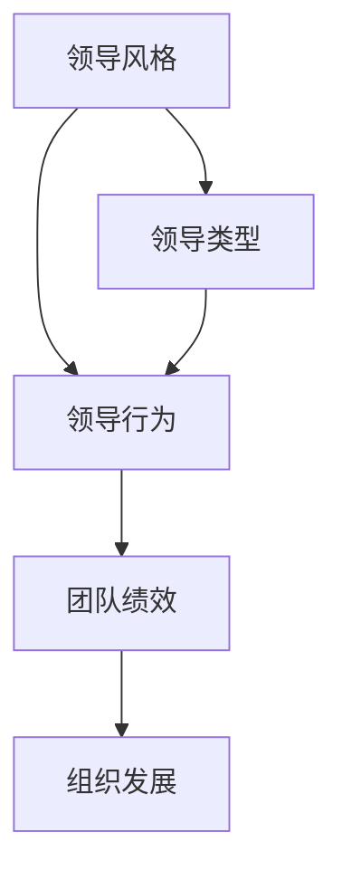
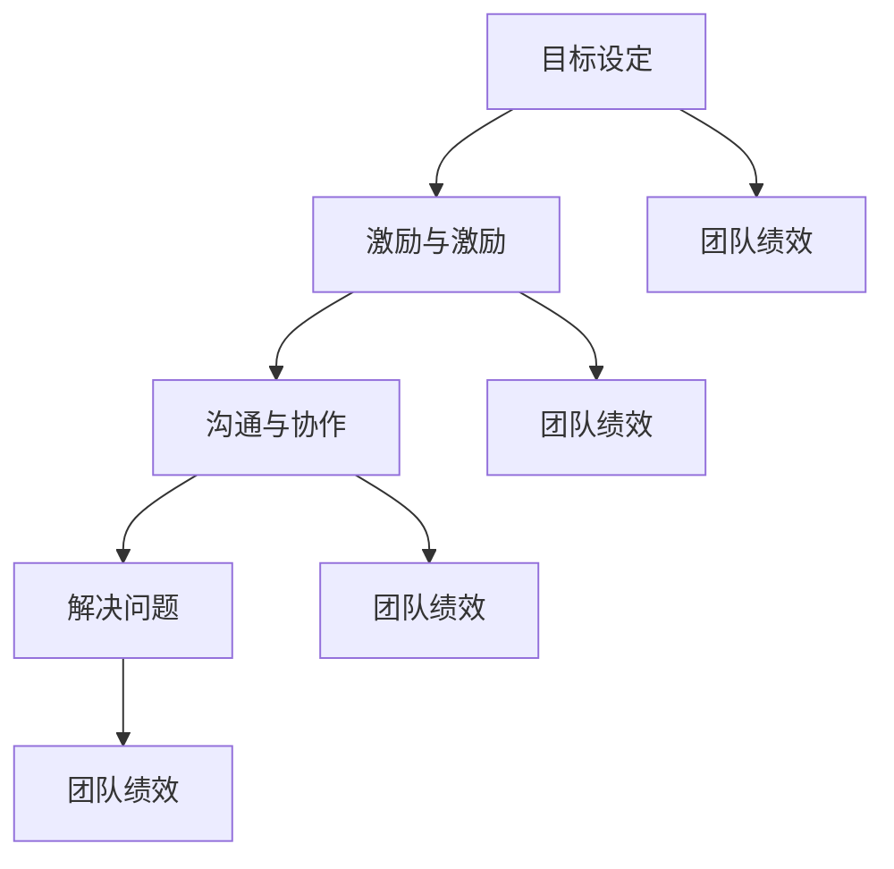
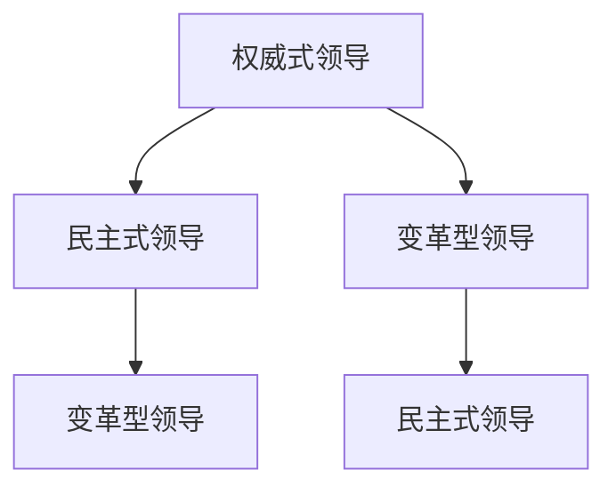
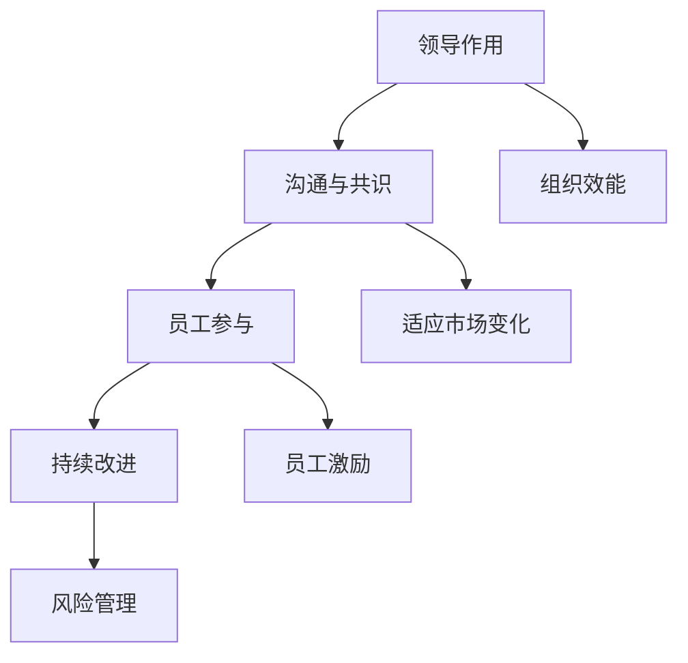
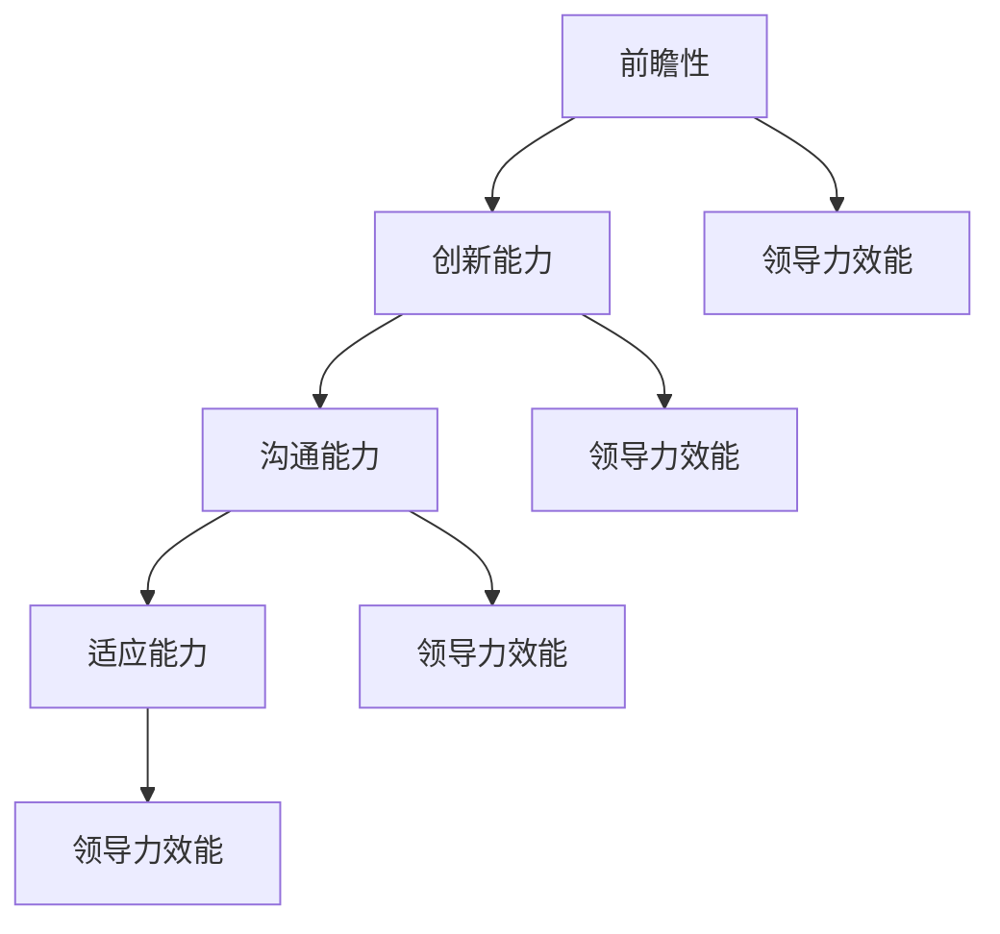

                 

### 文章标题：领导力与变革管理：引导团队适应新常态

> 关键词：领导力、变革管理、团队适应、新常态、数字化转型

> 摘要：本文深入探讨了在快速变化的数字时代，领导力与变革管理的重要性。通过分析领导力的定义、类型及其在团队中的作用，结合变革管理的理论模型和实践策略，文章旨在提供一套实用的方法和工具，帮助领导者在变革过程中引导团队，适应新常态，提高团队的整体绩效。

---

### 第一部分：领导力概述

#### 1.1 领导力的定义与重要性

领导力是一种推动变革、激励团队、实现目标的能力。在数字化时代，领导力的重要性愈发凸显。一方面，技术进步和市场竞争加速，企业需要快速适应变化，这要求领导者具备前瞻性和创新精神。另一方面，团队成员的多样性和复杂性增加，领导者需要具备更广泛的技能，如沟通能力、情感智能和变革管理能力。

#### 1.2 领导风格与行为

领导风格是领导者处理团队和管理工作的方式。常见的领导风格包括权威式、民主式和放任式。每种风格都有其优缺点，适用于不同的情境和团队。领导行为则涉及领导者如何激励、指导和影响团队成员。有效的领导行为包括建立信任、设定明确的目标和提供必要的资源。

#### 1.3 领导力的类型

领导力可分为技术型领导和变革型领导。技术型领导专注于提高团队的专业能力和工作效率，而变革型领导则致力于推动组织变革，激发团队成员的潜力和创造力。在实际应用中，领导者往往需要结合不同类型的领导力，以应对复杂多变的业务环境。

### 背景介绍

在当前数字化、全球化和市场化的背景下，企业面临着前所未有的挑战和机遇。技术的快速发展使得市场环境和客户需求不断变化，企业需要具备快速适应和变革的能力。然而，变革往往伴随着不确定性和阻力，这就需要领导者在变革过程中发挥关键作用，引导团队克服挑战，实现目标。

#### 1.4 领导力的内涵

领导力不仅仅是职位赋予的权力，更是一种能力。这种能力包括对人的理解、激励和引导，以及对环境的洞察和把握。有效的领导者能够识别和利用团队的优势，同时弥补劣势，从而提高团队的整体效能。

#### 1.5 领导力的作用

领导力在企业中的核心作用是推动组织的变革和发展。通过设定明确的目标、制定有效的战略和提供必要的资源，领导者能够激励团队成员，共同为实现组织的目标而努力。同时，领导力还在于建立和维护团队的文化和价值观，确保团队成员朝着共同的方向前进。

#### 1.6 领导力的类型

领导力可以分为多种类型，包括权威式领导、民主式领导和变革型领导。每种领导风格都有其独特的优势和适用场景。权威式领导在紧急情况下能迅速做出决策，民主式领导鼓励团队成员参与决策过程，变革型领导则能够激发团队成员的创造力和潜力。

### 核心概念与联系

领导力的核心概念包括领导风格、领导行为和领导类型。这些概念之间存在着紧密的联系，共同决定了领导者的效能。例如，领导风格会影响领导行为，进而影响团队绩效。领导类型则体现了领导者在不同情境下的选择和应用。

#### Mermaid 流程图



### 1.7 领导力的作用

领导力在团队中的作用主要体现在以下几个方面：

- **目标设定**：领导者能够设定清晰、具体的团队目标，并提供实现目标的策略和资源。
- **激励与激励**：领导者能够通过激励措施，激发团队成员的工作热情和创造力。
- **沟通与协作**：领导者能够有效沟通，促进团队成员之间的协作和合作。
- **解决问题**：领导者能够快速识别和解决问题，确保团队目标的顺利实现。

#### 领导力的作用架构



### 1.8 领导力的类型

领导力可分为多种类型，包括权威式领导、民主式领导和变革型领导。每种领导风格都有其独特的优势和适用场景。例如，权威式领导在紧急情况下能迅速做出决策，民主式领导鼓励团队成员参与决策过程，变革型领导则能够激发团队成员的创造力和潜力。

#### 领导力类型的联系



### 第一部分总结

在第一部分，我们探讨了领导力的定义、类型和作用。通过分析领导力的核心概念和联系，我们了解了领导力在团队和组织中的重要性。在接下来的部分，我们将深入探讨变革管理的理论、模型和实践策略，帮助领导者更好地引导团队适应新常态。

---

### 第二部分：变革管理

#### 2.1 变革管理的概念与原则

变革管理是指通过系统的方法和工具，引导组织从当前状态过渡到目标状态的过程。变革管理的关键原则包括：

- **领导作用**：领导者是变革的推动者和倡导者，必须发挥关键作用。
- **沟通与共识**：有效的沟通和共识是变革成功的关键。
- **员工参与**：员工的参与和认同是变革顺利实施的保障。
- **持续改进**：变革不是一次性的活动，而是持续的过程。

#### 2.2 变革管理的模型与策略

变革管理通常采用以下模型：

- **Kotter模型**：提出八个步骤，包括建立紧急感、组建领导团队、创建愿景和策略、沟通与共识、授权行动、创造短期胜利、巩固变革和实施新习惯。
- **Leavitt模型**：将变革视为一个系统，包括组织结构、技术、人员、符号和价值观五个要素。

#### 2.3 变革管理的实施步骤

变革管理的实施通常分为以下几个步骤：

1. **评估现状**：了解组织的当前状态，包括文化、流程和员工态度。
2. **制定变革目标**：明确变革的目标和预期成果。
3. **组建变革团队**：选择合适的团队成员，确保变革的顺利进行。
4. **沟通与共识**：与员工沟通变革的目标和计划，达成共识。
5. **培训与支持**：提供必要的培训和资源支持，帮助员工适应变革。
6. **监控与调整**：持续监控变革的实施情况，及时调整策略。
7. **评估与总结**：在变革完成后，评估变革的效果，总结经验教训。

### 背景介绍

在当前数字化、全球化和市场化的背景下，企业面临着前所未有的挑战和机遇。技术的快速发展使得市场环境和客户需求不断变化，企业需要具备快速适应和变革的能力。然而，变革往往伴随着不确定性和阻力，这就需要变革管理者在变革过程中发挥关键作用，引导团队克服挑战，实现目标。

#### 2.4 变革管理的定义

变革管理是指通过系统的方法和工具，引导组织从当前状态过渡到目标状态的过程。它不仅涉及战略规划，还包括组织文化、流程和人员的调整。

#### 2.5 变革管理的重要性

变革管理在组织中的重要性主要体现在以下几个方面：

- **提高组织效能**：通过优化流程和文化，提高组织的整体效能。
- **适应市场变化**：快速适应市场变化，提高企业的竞争力。
- **员工激励**：通过变革，激发员工的积极性和创造力。
- **风险管理**：有效管理变革过程中的风险，确保变革的成功。

### 核心概念与联系

变革管理的核心概念包括领导作用、沟通与共识、员工参与和持续改进。这些概念相互联系，共同决定了变革管理的有效性。

#### Mermaid 流程图



#### 2.6 变革管理的模型

变革管理模型是指导变革实施的理论框架。常见的变革管理模型包括Kotter模型和Leavitt模型。

- **Kotter模型**：包括建立紧急感、组建领导团队、创建愿景和策略、沟通与共识、授权行动、创造短期胜利、巩固变革和实施新习惯。
- **Leavitt模型**：将变革视为一个系统，包括组织结构、技术、人员、符号和价值观五个要素。

### 核心算法原理讲解

变革管理的核心算法原理包括：

1. **需求评估**：通过数据分析和方法论评估变革的需求和可能性。
2. **计划制定**：根据需求评估结果，制定详细的变革计划。
3. **实施监控**：在变革过程中，持续监控实施情况，及时调整策略。
4. **效果评估**：在变革完成后，评估变革的效果，总结经验教训。

#### 伪代码

```python
# 变革管理核心算法伪代码

def transform_management(current_state, target_state):
    # 需求评估
    demand_evaluation = evaluate_demand(current_state, target_state)
    
    # 计划制定
    plan = create_plan(demand_evaluation)
    
    # 实施监控
    while not is_complete(plan):
        monitor_progress(plan)
        adjust_plan_if_needed(plan)
    
    # 效果评估
    result = evaluate_result(target_state)
    return result

# 需求评估
def evaluate_demand(current_state, target_state):
    # 数据分析和方法论
    # 返回需求评估结果

# 计划制定
def create_plan(demand_evaluation):
    # 根据需求评估结果制定计划
    # 返回变革计划

# 实施监控
def monitor_progress(plan):
    # 持续监控实施情况
    # 返回进度状态

# 调整计划
def adjust_plan_if_needed(plan):
    # 根据进度状态调整计划

# 效果评估
def evaluate_result(target_state):
    # 评估变革效果
    # 返回评估结果
```

### 数学模型和公式

在变革管理中，常用的数学模型和公式包括：

1. **变革成本模型**：用于计算变革的成本。
2. **变革成功率模型**：用于预测变革的成功率。

#### 详细讲解和举例说明

- **变革成本模型**：

   公式：$C = f(T, M, P)$

   其中，$C$ 表示变革成本，$T$ 表示变革时间，$M$ 表示变革团队成员数量，$P$ 表示变革项目的复杂度。

   举例：假设变革时间为一年，团队成员数量为10人，变革项目复杂度为中等，则变革成本为 $C = f(1, 10, M)$。

- **变革成功率模型**：

   公式：$S = \frac{E}{T} \times 100\%$

   其中，$S$ 表示变革成功率，$E$ 表示变革预期效果，$T$ 表示变革时间。

   举例：假设变革预期效果为提高生产效率20%，变革时间为一年，则变革成功率为 $S = \frac{20\%}{1} \times 100\% = 20\%$。

### 第二部分总结

在第二部分，我们详细介绍了变革管理的概念、原则、模型和实施步骤。通过分析变革管理的核心概念和联系，我们了解了变革管理在组织中的重要性。在第三部分，我们将深入探讨新常态下的领导力要求，以及如何引导团队适应新常态。

---

### 第三部分：新常态下的领导力

#### 3.1 新常态的特征

新常态是指在全球化和数字化的背景下，企业面临的一种新的经营环境。新常态的特征包括：

- **技术进步**：人工智能、大数据、云计算等新兴技术快速发展，对企业的运营模式和管理方式产生深远影响。
- **市场竞争**：全球化的市场环境使得企业面临更激烈的竞争，需要快速适应变化，提高竞争力。
- **员工需求**：新一代员工更加注重工作与生活的平衡，追求自我实现和发展，这对企业的管理和领导方式提出新的要求。

#### 3.2 新常态下的领导力要求

在新常态下，领导力需要具备以下要求：

- **前瞻性**：领导者需要具备前瞻性思维，能够预见未来的变化，提前做好准备。
- **创新能力**：领导者需要具备创新能力，能够推动企业不断进行技术创新和管理创新。
- **沟通能力**：领导者需要具备出色的沟通能力，能够与团队成员有效沟通，达成共识。
- **适应能力**：领导者需要具备适应能力，能够迅速适应新的环境和变化，带领团队应对挑战。

#### 3.3 新常态下的领导力策略

在新常态下，领导者可以采取以下策略来引导团队：

- **建立共同愿景**：领导者需要与团队成员共同建立清晰的愿景，明确目标，激发团队的斗志和凝聚力。
- **培养团队协作**：领导者需要培养团队的协作能力，通过协作提高团队的整体绩效。
- **提供培训和资源**：领导者需要提供必要的培训和资源支持，帮助团队成员提升技能，适应新的工作环境。
- **鼓励创新思维**：领导者需要鼓励团队成员创新思维，激发团队的创造力和潜力。

### 背景介绍

随着全球化和数字化的加速发展，企业面临的市场环境和技术环境发生了深刻变化。新常态下，企业需要具备快速适应和变革的能力，这就要求领导者具备新的领导力要求。通过建立共同愿景、培养团队协作、提供培训和资源、鼓励创新思维等策略，领导者可以引导团队在新常态下取得成功。

#### 3.4 新常态下领导力的内涵

新常态下的领导力不仅是一种管理技能，更是一种价值观和思维方式。它要求领导者具备以下内涵：

- **开放心态**：领导者需要保持开放心态，接受新的观念和想法，不断学习和进步。
- **同理心**：领导者需要具备同理心，理解员工的需求和压力，关心员工的发展。
- **领导艺术**：领导者需要具备领导艺术，能够在不同情境下灵活运用不同的领导策略。

### 核心概念与联系

新常态下领导力的核心概念包括前瞻性、创新能力、沟通能力和适应能力。这些概念相互联系，共同决定了领导者的效能。

#### Mermaid 流程图



#### 3.5 新常态下领导力与变革管理的融合

新常态下的领导力与变革管理密切相关，二者相互促进。领导力为变革管理提供了方向和动力，而变革管理则为领导力提供了实践平台。领导者需要在变革管理过程中，充分发挥领导力，引导团队实现变革目标。

#### 3.6 新常态下领导力实践的案例分析

- **案例一**：某科技公司在新常态下通过领导力引导团队实现数字化转型。
- **案例二**：某传统制造业企业通过领导力推动企业向智能制造转型。

### 第三部分总结

在第三部分，我们探讨了新常态下的领导力特征、要求和策略。通过分析新常态下领导力的核心概念和联系，我们了解了领导力在引导团队适应新常态中的关键作用。在第四部分，我们将通过实战案例分析，进一步探讨领导力与变革管理在实际应用中的效果。

---

### 第四部分：实战案例分析

#### 4.1 案例分析一：某企业数字化转型实践

**4.1.1 案例背景**

某企业是一家传统的制造企业，随着数字化时代的到来，市场竞争日益激烈，企业意识到必须进行数字化转型以保持竞争力。然而，数字化转型涉及到企业的方方面面，包括技术、流程、组织和员工等方面，这对企业领导者的领导力和变革管理能力提出了严峻挑战。

**4.1.2 变革策略**

1. **领导力策略**：
   - **建立共同愿景**：企业领导者首先与全体员工共同建立了数字化转型的愿景，明确了转型的目标和预期成果。
   - **培养团队协作**：通过组织跨部门团队，培养团队成员之间的协作精神，提高团队的整体效能。
   - **提供培训和资源**：企业领导者为员工提供了大量的培训和资源支持，帮助他们掌握数字化技术，适应新的工作方式。
   - **鼓励创新思维**：企业领导者鼓励员工提出创新的想法，并为他们提供试验和验证的平台。

2. **变革管理策略**：
   - **评估现状**：企业首先对现状进行了全面评估，包括技术、流程、组织和员工等方面，确定了数字化转型的基础和挑战。
   - **制定变革计划**：企业制定了详细的变革计划，包括技术升级、流程优化、组织调整和员工培训等方面。
   - **沟通与共识**：企业通过内部会议、培训和宣传活动，与员工沟通变革的目标和计划，达成共识。
   - **实施监控与调整**：企业持续监控变革的实施情况，及时调整策略，确保变革的顺利进行。
   - **效果评估**：在变革完成后，企业对变革效果进行了评估，总结了经验教训，为未来的变革提供了参考。

**4.1.3 变革效果分析**

通过数字化转型，企业实现了以下成果：

- **技术升级**：企业的生产设备和生产线进行了升级，提高了生产效率和产品质量。
- **流程优化**：企业的业务流程进行了优化，减少了浪费，提高了运营效率。
- **组织调整**：企业的组织结构进行了调整，提高了组织效率和灵活性。
- **员工技能提升**：员工的数字化技能得到了提升，为企业的数字化转型提供了强有力的支持。
- **市场竞争力提升**：企业的市场竞争力得到了显著提升，实现了业务的持续增长。

**4.1.4 案例启示**

该案例表明，在数字化转型过程中，领导力和变革管理至关重要。有效的领导力可以激发团队的创造力和潜力，推动变革的顺利进行。而科学的变革管理策略可以确保变革的有序推进，实现预期的效果。企业在未来进行数字化转型时，可以借鉴该案例的经验，结合自身的实际情况，制定合适的变革策略。

---

### 4.2 案例分析二：某政府机构公共服务创新

**4.2.1 案例背景**

某政府机构负责提供公共服务，随着数字化时代的到来，公众对服务质量和效率提出了更高的要求。为了提高公共服务水平，政府机构决定进行公共服务创新，通过引入新技术和新方法，提升服务的质量和效率。

**4.2.2 变革策略**

1. **领导力策略**：
   - **建立共同愿景**：政府领导人与公众共同建立了公共服务创新的愿景，明确了创新的目标和预期成果。
   - **培养团队协作**：通过组织跨部门团队，培养团队成员之间的协作精神，提高团队的整体效能。
   - **提供培训和资源**：政府为员工提供了大量的培训和资源支持，帮助他们掌握新技术，适应新的工作方式。
   - **鼓励创新思维**：政府鼓励员工提出创新的想法，并为他们提供试验和验证的平台。

2. **变革管理策略**：
   - **评估现状**：政府首先对现状进行了全面评估，包括技术、流程、组织和公众需求等方面，确定了公共服务创新的基础和挑战。
   - **制定变革计划**：政府制定了详细的变革计划，包括技术引入、流程优化、组织调整和公众沟通等方面。
   - **沟通与共识**：政府通过公共宣传、社区活动和政策解读，与公众沟通变革的目标和计划，达成共识。
   - **实施监控与调整**：政府持续监控变革的实施情况，及时调整策略，确保变革的顺利进行。
   - **效果评估**：在变革完成后，政府对变革效果进行了评估，总结了经验教训，为未来的变革提供了参考。

**4.2.3 变革效果分析**

通过公共服务创新，政府机构实现了以下成果：

- **技术引入**：政府引入了大数据、云计算和人工智能等技术，提高了公共服务的数据处理和分析能力。
- **流程优化**：政府优化了业务流程，提高了服务效率和公众满意度。
- **组织调整**：政府调整了组织结构，提高了组织效率和灵活性。
- **公众满意度提升**：公众对政府服务的满意度显著提升，政府形象得到了改善。

**4.2.4 案例启示**

该案例表明，在公共服务创新过程中，领导力和变革管理同样至关重要。有效的领导力可以激发团队的创造力和潜力，推动变革的顺利进行。而科学的变革管理策略可以确保变革的有序推进，实现预期的效果。政府机构在未来的公共服务创新中，可以借鉴该案例的经验，结合自身的实际情况，制定合适的变革策略。

### 第四部分总结

在第四部分，我们通过两个实战案例，分析了领导力和变革管理在数字化转型和公共服务创新中的应用。这些案例表明，领导力和变革管理在引导团队适应新常态中发挥着关键作用。在第五部分，我们将探讨变革管理的未来趋势，以及领导力与变革管理的未来发展。

---

### 第五部分：未来展望

#### 5.1 变革管理的未来趋势

随着全球化和数字化的加速发展，变革管理将面临新的挑战和机遇。未来变革管理的趋势包括：

- **智能化**：人工智能和大数据技术的应用将使变革管理更加精准和高效。
- **个性化**：变革管理将更加注重个体的需求和差异，实现个性化的变革策略。
- **全球化**：全球化的背景下，变革管理需要考虑跨文化的因素，实现全球协同的变革。
- **可持续性**：未来的变革管理将更加注重可持续发展，平衡经济、社会和环境的关系。

#### 5.2 领导力与变革管理的融合

在未来，领导力与变革管理将更加紧密地融合，共同推动组织的发展。领导力为变革管理提供了方向和动力，而变革管理则为领导力提供了实践平台。未来领导力和变革管理的融合将体现在以下几个方面：

- **领导力的发展**：领导者需要不断提升自身的领导力，适应新的变革环境。
- **变革管理的创新**：变革管理需要不断创新，适应快速变化的市场环境。
- **团队协作的加强**：未来领导力将更加注重团队协作，通过协作实现组织的共同目标。
- **员工参与的提升**：未来变革管理将更加注重员工的参与，激发员工的创造力和潜力。

#### 5.3 领导力与变革管理的未来发展

在未来，领导力与变革管理将共同推动组织的发展，实现以下目标：

- **提升组织效能**：通过有效的领导力和变革管理，提高组织的整体效能，实现组织的战略目标。
- **增强竞争力**：通过领导力和变革管理，提升组织的竞争力，在激烈的市场环境中保持领先地位。
- **实现可持续发展**：通过领导力和变革管理，实现组织的可持续发展，平衡经济、社会和环境的关系。
- **促进创新**：通过领导力和变革管理，激发组织的创新活力，推动组织的持续创新。

### 第五部分总结

在第五部分，我们探讨了变革管理的未来趋势，以及领导力与变革管理的融合和未来发展。这些趋势和展望为领导者提供了指导，帮助他们更好地引导团队适应新常态。在文章的最后，我们将总结全文，回顾核心观点，并提供最佳实践和拓展阅读建议。

---

### 文章总结

本文从领导力与变革管理的角度，探讨了如何引导团队适应新常态。通过分析领导力的定义、类型和作用，以及变革管理的模型、原则和实施步骤，我们了解了领导力和变革管理在组织发展中的重要性。新常态下的领导力要求领导者具备前瞻性、创新能力、沟通能力和适应能力。实战案例分析展示了领导力和变革管理在实际应用中的效果。未来，领导力和变革管理将继续融合，推动组织的发展。文章结尾处，我们将提供最佳实践和拓展阅读建议，以供读者深入探讨。

### 最佳实践与拓展阅读

**最佳实践：**

1. **建立共同愿景**：领导者应与团队成员共同建立清晰的愿景，明确目标，激发团队的斗志和凝聚力。
2. **培养团队协作**：通过组织跨部门团队，培养团队成员之间的协作精神，提高团队的整体效能。
3. **提供培训和资源**：为员工提供必要的培训和资源支持，帮助他们掌握新技术，适应新的工作方式。
4. **鼓励创新思维**：鼓励员工提出创新的想法，并为他们提供试验和验证的平台。

**拓展阅读：**

1. **《变革之心》**：作者：约翰·科特。本书详细阐述了变革管理的理论和实践，提供了丰富的案例和策略。
2. **《领导力的五项修炼》**：作者：史蒂芬·柯维。本书介绍了领导力的核心概念和修炼方法，对领导者具有深刻的启示。
3. **《智能时代的领导力》**：作者：何晓红。本书探讨了智能时代下领导力的新特点和新要求，对未来的领导者具有指导意义。

作者信息：

作者：AI天才研究院/AI Genius Institute & 禅与计算机程序设计艺术 /Zen And The Art of Computer Programming

---

以上就是本文的完整内容，希望对您在领导力和变革管理方面的实践提供有益的参考和启示。如果您有任何问题或意见，欢迎在评论区交流。感谢您的阅读！

