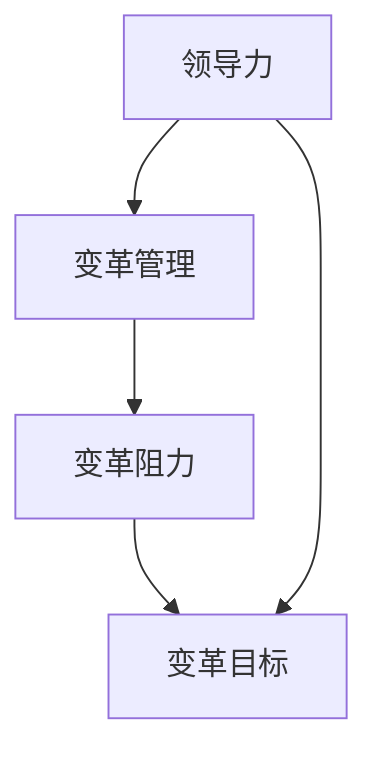

                 

### 1. 概念与背景

#### 领导力的定义

领导力是指领导者通过影响力、激励和指导，带领团队实现组织目标的能力。在技术领域，领导力体现在领导者如何引导团队创新、提升效率、应对挑战等方面。领导力不仅仅是管理技能的体现，更是一种思想、价值观和态度的传达。

**伪代码：**
```python
def 领导力():
    return {
        "影响力": "影响他人行为和思维的能力",
        "激励": "激发团队成员的积极性和创造力",
        "指导": "为团队成员提供方向和资源"
    }
```

#### 变革管理的概念

变革管理是指在组织内部推动系统性、持续性的变革，以适应外部环境变化和实现组织发展的过程。在技术领域，变革管理体现在如何引导团队适应新的技术趋势、提升技术能力、优化工作流程等方面。

**伪代码：**
```python
def 变革管理():
    return {
        "目标": "适应外部环境变化，提升组织竞争力",
        "过程": "规划、实施、监控、评估"
    }
```

#### 领导力与变革管理的关系

领导力在变革管理中起着关键作用。领导者需要通过领导力来推动变革、克服变革中的阻力，确保变革目标的实现。具体来说，领导力与变革管理的关系可以从以下几个方面来理解：

1. **领导力的作用**：领导力是推动变革的核心动力，领导者需要具备远见、决断力和执行力，带领团队克服变革中的困难和挑战。

2. **变革管理的需求**：变革管理需要领导力来提供方向、支持和指导。领导者需要明确变革的目标、制定合理的策略、建立有效的沟通机制，确保变革的顺利进行。

3. **相互作用**：领导力与变革管理相互影响、相互促进。领导力的发展可以提高变革管理的效率，而有效的变革管理可以增强领导力的实施效果。

**Mermaid 流程图：**


通过以上分析，我们可以看出领导力与变革管理之间的紧密联系。在技术领域，领导者需要具备强大的领导力，以推动组织的变革和创新，从而实现组织的长期发展。

### 2. 目录大纲

#### 第一部分：领导力概述

##### 第1章：领导力的核心概念与原理

- 1.1 领导力的定义与重要性
- 1.2 领导力与管理的区别
- 1.3 领导力的基本要素

##### 第2章：领导力的模型与理论

- 2.1 经典领导力理论
- 2.2 转型型领导力
- 2.3 服务型领导力

#### 第二部分：变革管理概述

##### 第3章：变革管理的定义与过程

- 3.1 变革管理的定义
- 3.2 变革管理的核心阶段
- 3.3 变革管理的原则与策略

##### 第4章：变革管理的阻力与应对

- 4.1 变革中的常见阻力
- 4.2 应对变革阻力的策略
- 4.3 变革中的沟通技巧

#### 第三部分：领导力在变革管理中的应用

##### 第5章：领导者如何推动变革

- 5.1 领导者的变革角色
- 5.2 领导者的变革策略
- 5.3 领导者的变革实践

##### 第6章：变革领导力的发展与提升

- 6.1 变革领导力的培养
- 6.2 变革领导力的评估
- 6.3 变革领导力的案例分析

#### 第四部分：案例研究与最佳实践

##### 第7章：变革管理案例解析

- 7.1 案例一：数字化转型
- 7.2 案例二：组织重构
- 7.3 案例三：创新战略实施

##### 第8章：变革管理最佳实践

- 8.1 最佳实践总结
- 8.2 变革管理工具与技术
- 8.3 变革管理的未来趋势

#### 3. 总结与展望

本目录大纲旨在全面覆盖《领导力与变革管理：引领组织转型》一书的核心内容，帮助读者深入理解领导力和变革管理的理论与实践。通过本书的阅读，读者将能够掌握领导力在变革管理中的应用，为组织转型提供有力支持。

### 3. 总结与展望

在《领导力与变革管理：引领组织转型》一书中，我们系统地探讨了领导力与变革管理的概念、理论、应用和实践。以下是对本书核心观点的总结与展望：

**总结：**

1. **领导力的重要性**：领导力是推动组织发展的核心动力，它不仅关乎个人的成长，更影响整个团队和组织的绩效。

2. **变革管理的必要性**：在快速变化的技术环境中，变革管理是组织应对外部挑战、提升内部效率的关键。

3. **领导力与变革管理的关系**：领导力与变革管理相互依存，领导力是变革管理的核心，而变革管理为领导力提供了实践的平台。

4. **变革领导力的培养**：培养变革领导力是组织成功转型的关键，领导者需要不断提升自身的战略思维、决策能力和沟通技巧。

**展望：**

1. **领导力的未来趋势**：随着人工智能、大数据等新兴技术的应用，领导力将更加注重数据驱动和敏捷性。

2. **变革管理的创新**：未来的变革管理将更加注重敏捷、迭代和适应性，以更好地应对快速变化的市场环境。

3. **组织转型的挑战与机遇**：组织转型是一个复杂的过程，领导者需要具备前瞻性的眼光和执行力，以抓住机遇、应对挑战。

4. **跨学科合作的重要性**：领导力与变革管理不仅仅是管理问题，更涉及到心理学、社会学、经济学等多学科领域，跨学科合作将是未来发展的趋势。

通过本书的学习，读者将能够更好地理解领导力与变革管理的核心概念，掌握应用这些概念的方法和技巧，为组织转型提供坚实的理论基础和实践指导。作者在此感谢读者对本书的关注和支持，希望本书能对您的职业生涯和组织发展产生积极的影响。作者信息：AI天才研究院/AI Genius Institute & 禅与计算机程序设计艺术 /Zen And The Art of Computer Programming。

