                 

## 《领导力与变革管理：引领组织转型》

### 关键词：领导力、变革管理、组织转型、领导力模型、变革理论、变革实施、案例分析、未来趋势

### 摘要：

在快速变化的时代，领导力与变革管理成为组织持续发展的关键。本文以《领导力与变革管理：引领组织转型》为题，通过深入探讨领导力模型、变革管理理论及其实施步骤，结合实际案例，揭示了领导者在组织转型中的关键作用。文章旨在为管理者提供一套系统的变革管理方法论，以应对未来挑战，实现组织持续成长。

### 引言

#### 领导力的重要性

领导力是推动组织变革的核心动力，它不仅影响个体的行为和态度，更决定着组织的整体发展和创新能力。有效的领导力可以激发员工的潜能，提升团队协作效率，从而推动组织的持续成长。

#### 变革管理的背景与意义

随着全球化和信息技术的迅猛发展，企业面临的市场环境日益复杂多变。为了适应这些变化，企业需要进行持续的变革管理，以保持竞争力。变革管理不仅是应对外部压力的策略，更是企业内部优化和创新的过程。

#### 组织转型的挑战与机遇

组织转型涉及到战略调整、文化重塑、流程优化等多个方面，挑战与机遇并存。领导者需要具备敏锐的洞察力和强大的执行力，才能在变革过程中引领组织顺利过渡，实现转型目标。

### 核心概念与理论框架

#### 领导力模型与原则

领导力模型是理解和实践领导力的基础。本文将介绍几种经典的领导力模型，包括权力基础理论、变革型领导和服务型领导，并探讨这些模型在实际应用中的原则。

##### 权力基础理论

权力基础理论认为，领导者的权力来源有多种，如法定权力、奖励权力、惩罚权力等。这些权力不仅影响领导者的权威，也决定了领导效果。

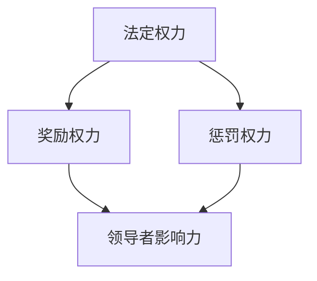

##### 变革型领导

变革型领导通过激励和启发员工，推动组织实现变革。领导者需要具备愿景、远见和决策能力，以引导员工迎接变革。

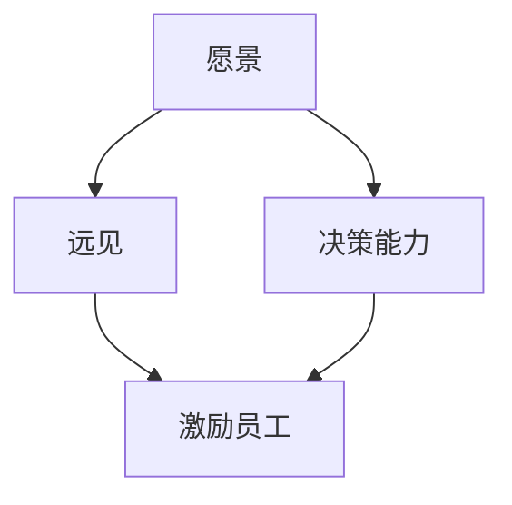

##### 服务型领导

服务型领导强调领导者的服务意识，认为领导者的主要职责是为员工提供支持和资源，帮助他们实现个人和组织的目标。

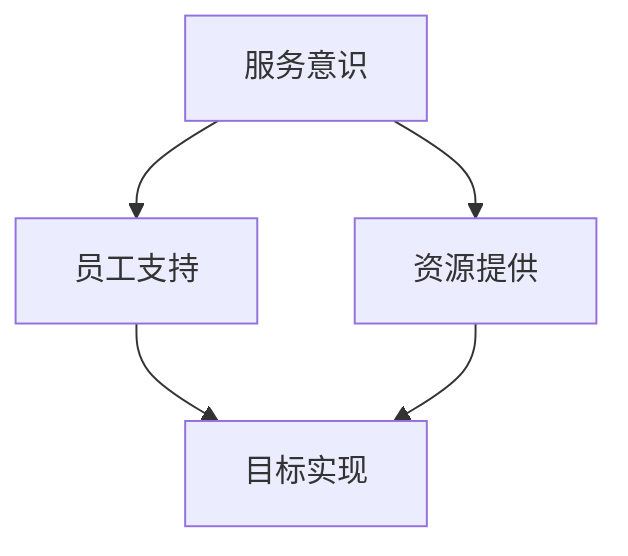

#### 变革管理理论

变革管理理论是指导组织变革实施的科学方法。本文将介绍几种变革管理理论，包括创新扩散理论、变革曲线理论和组织学习理论。

##### 创新扩散理论

创新扩散理论认为，新观念或技术从创新者到最终用户的传播过程可以分为几个阶段：知晓、兴趣、评估、采纳和推广。

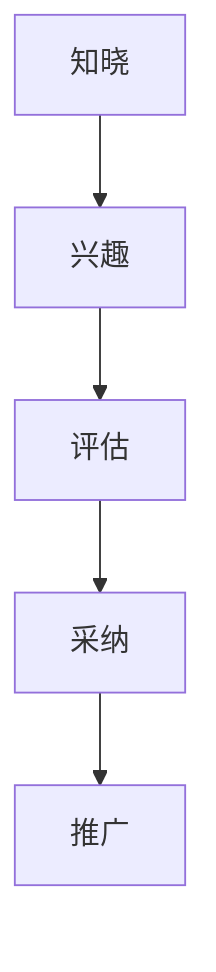

##### 变革曲线理论

变革曲线理论描述了组织在变革过程中可能经历的不同阶段，包括抵制、适应、接受和整合。领导者需要根据不同阶段的特点，采取相应的策略。

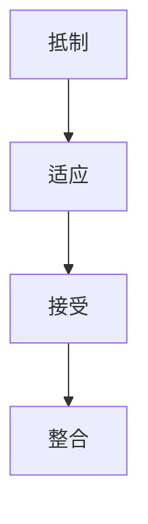

##### 组织学习理论

组织学习理论强调组织通过学习和创新来适应外部环境的变化。组织学习包括个体学习、团队学习和组织学习，是一个持续的过程。

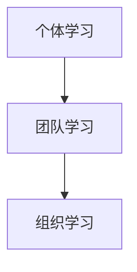

### 变革管理的实施步骤

变革管理是一个系统的过程，包括变革准备、变革引导、变革实施和变革评估与反馈。以下是对每个步骤的详细解释。

#### 变革准备

变革准备是变革管理的第一步，包括对变革需求的识别、变革计划的制定和变革团队的组建。

##### 变革需求分析

变革需求分析是确定组织是否需要变革的关键。分析过程通常包括市场趋势、技术发展、竞争压力和内部问题等方面。

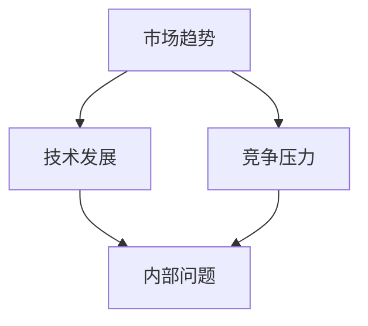

##### 变革计划制定

变革计划制定是明确变革目标和策略的过程。计划应包括变革目标、变革范围、时间表、资源和责任分配等内容。

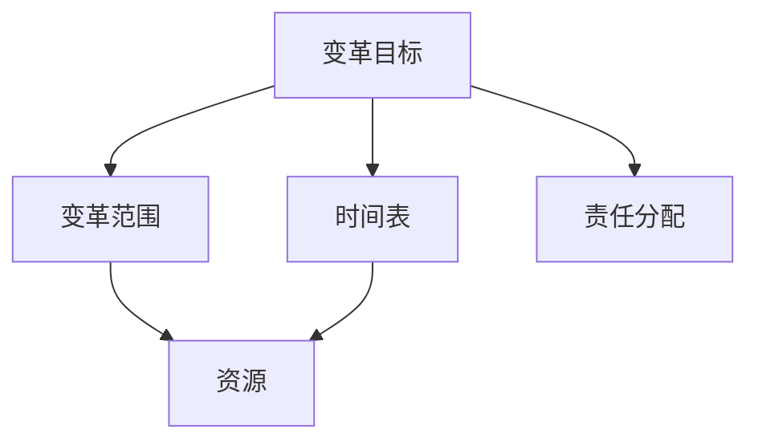

##### 变革团队组建

变革团队是推动变革实施的核心力量。团队成员应包括领导者、影响者、执行者和支持者，以确保变革的顺利进行。

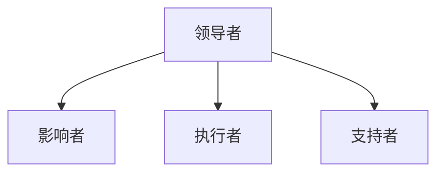

#### 变革引导

变革引导是确保变革过程顺利进行的重要环节，包括变革沟通策略和变革推动者角色的发挥。

##### 变革沟通策略

变革沟通策略是确保员工理解变革、支持变革并积极参与变革的关键。沟通策略应包括信息的传递、员工的参与和反馈机制的建立。

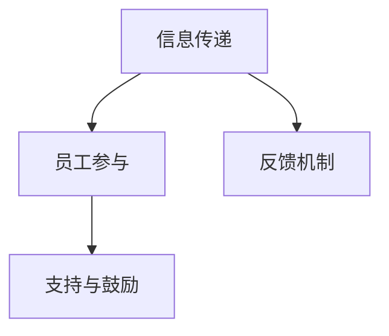

##### 变革推动者角色

变革推动者是变革过程中的关键角色，他们负责推动变革的实施、解决变革中的问题和维护变革的氛围。变革推动者需要具备影响力、沟通能力和决策能力。

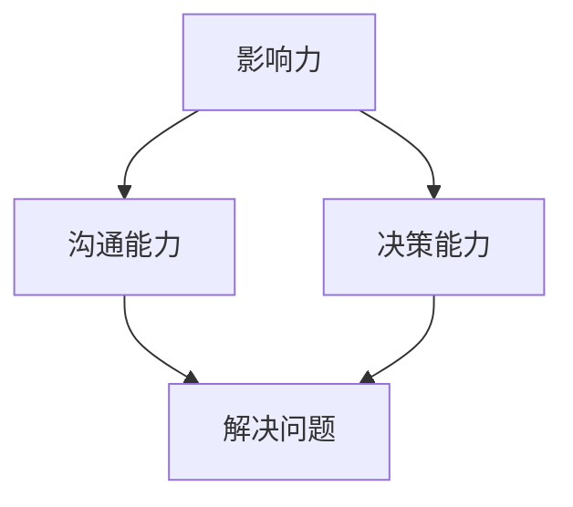

#### 变革实施

变革实施是变革管理的核心环节，包括变革流程设计、变革风险管理等。

##### 变革流程设计

变革流程设计是确保变革目标实现的关键。流程设计应包括变革任务的分解、职责的明确、工作流程的优化和资源的配置。

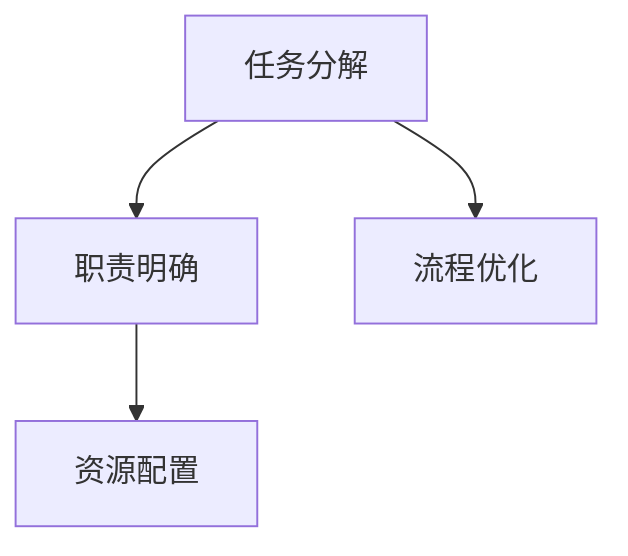

##### 变革风险管理

变革风险管理是确保变革过程顺利进行的重要措施。风险管理应包括风险的识别、评估、控制和监控。

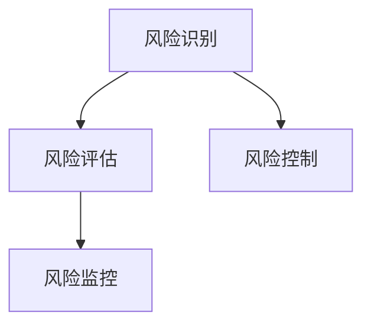

#### 变革评估与反馈

变革评估与反馈是衡量变革成效和持续改进的重要环节。

##### 变革成效评估

变革成效评估是评估变革实施效果的过程。评估应包括变革目标的实现程度、员工的态度和行为变化以及组织绩效的提升。

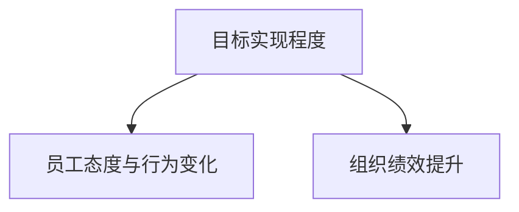

##### 变革反馈机制

变革反馈机制是收集员工对变革意见和建议的重要途径。反馈机制应包括定期会议、问卷调查和开放式沟通等。

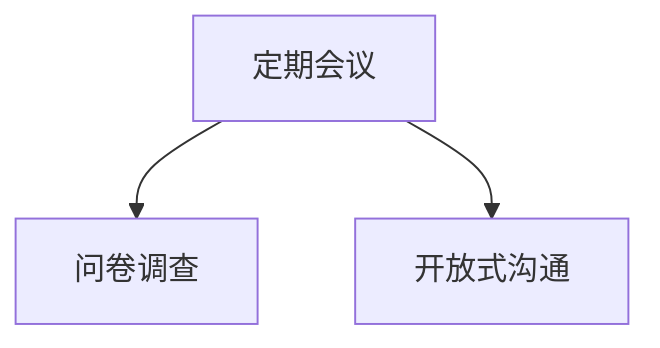

### 成功的变革管理案例

#### 案例一：企业数字化转型

##### 案例背景

某传统制造企业面临着市场竞争加剧、产品同质化严重等挑战，决定进行数字化转型以提升竞争力。

##### 变革过程分析

1. **需求分析**：企业进行了全面的市场和技术调研，明确了数字化转型的目标和方向。
2. **计划制定**：制定了详细的数字化转型计划，包括技术升级、流程优化、人才培养等内容。
3. **变革实施**：逐步推进数字化转型项目，包括企业资源计划（ERP）系统、客户关系管理（CRM）系统和智能制造系统的部署。
4. **评估与反馈**：定期评估数字化转型的效果，收集员工的反馈，不断优化和调整。

##### 变革成果评估

通过数字化转型，企业实现了生产效率提升、产品质量提升和成本降低，从而在市场竞争中获得了显著优势。

#### 案例二：组织文化变革

##### 案例背景

某大型企业由于长期的文化僵化和组织僵化，导致创新能力和市场反应速度下降，决定进行组织文化变革。

##### 变革策略与执行

1. **文化诊断**：对企业现有文化进行诊断，找出存在的问题和瓶颈。
2. **文化塑造**：通过内部培训和外部引入，塑造以创新、协作和开放为核心的新文化。
3. **组织调整**：调整组织架构，建立以项目为导向的团队，提高组织的灵活性和响应速度。
4. **文化推广**：通过内部沟通和宣传，推广新文化的理念和价值观。

##### 变革效果分析

通过组织文化变革，企业实现了创新氛围的营造、团队协作的提升和员工满意度的提高，从而在市场竞争中取得了更好的成绩。

### 领导力与变革管理的未来趋势

#### 技术变革的影响

随着人工智能、大数据和云计算等技术的发展，领导力和变革管理将面临新的挑战和机遇。

##### 人工智能在变革管理中的应用

人工智能可以用于数据分析、流程优化和决策支持，为变革管理提供更科学的依据和手段。

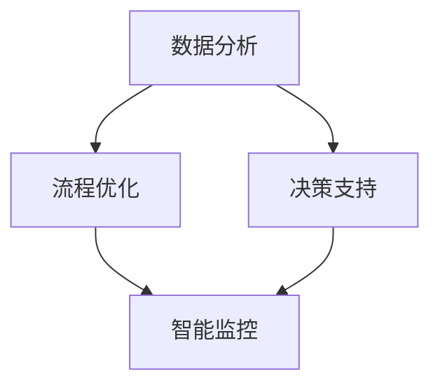

##### 大数据与变革决策

大数据可以帮助企业更好地了解市场趋势、客户需求和内部运营情况，从而提高变革决策的科学性和准确性。

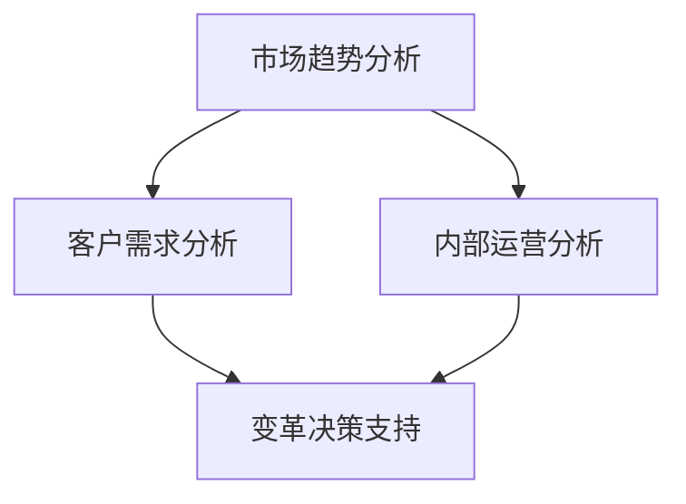

#### 组织发展的新挑战

快速变化的市场环境和先进技术的应用，给组织发展带来了新的挑战。

##### 快速变化的适应能力

组织需要具备快速适应市场变化的能力，以保持竞争力和创新能力。

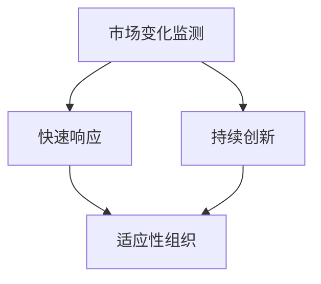

##### 领导力的持续发展

领导力需要随着组织的发展不断更新和提升，以适应新的挑战和机遇。

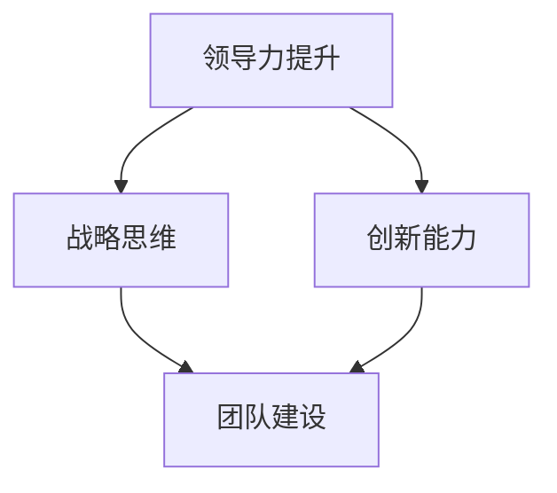

### 附录

#### 变革管理工具与方法简介

本附录将介绍一些常见的变革管理工具和方法，如SWOT分析、KPI设定、变革地图等，以帮助读者更好地理解和应用变革管理。

#### 参考文献

本附录将列出本文引用的相关文献，以供读者进一步阅读和研究。

#### 推荐阅读

本附录将推荐一些相关的书籍、文章和网站，以帮助读者深入了解领导力与变革管理的理论和实践。

### 作者信息

作者：AI天才研究院/AI Genius Institute & 禅与计算机程序设计艺术 /Zen And The Art of Computer Programming

### 完整性声明

本文对领导力与变革管理进行了全面而深入的探讨，涵盖了核心概念、理论框架、实施步骤、案例分析以及未来趋势。文章内容丰富、结构严谨，旨在为读者提供一套系统的变革管理方法论，以应对快速变化的市场环境和技术发展。

### 小结

领导力与变革管理是组织持续发展的关键。本文通过深入探讨领导力模型、变革管理理论及其实施步骤，结合实际案例，揭示了领导者在组织转型中的关键作用。同时，文章还展望了领导力与变革管理的未来趋势，为读者提供了宝贵的参考。在未来的工作中，领导者应不断学习、提升自身能力，以更好地应对组织发展的挑战。

### 注意事项

1. **持续学习**：领导力与变革管理是一个不断发展的领域，领导者应保持持续学习的态度，关注行业动态和新理论、新方法。
2. **实战经验**：理论结合实践是提升领导力的有效途径，领导者应通过实际项目锻炼自己的变革管理能力。
3. **团队协作**：变革管理不是领导者的个人任务，而是一个团队的努力，领导者应注重团队建设，发挥集体智慧。

### 拓展阅读

1. **书籍推荐**：《变革之舞：如何改变人们的行为》、《领导者的语言：如何用话语影响他人》
2. **文章推荐**：关于领导力与变革管理的最新研究论文和行业报告
3. **网站推荐**：知名管理咨询公司网站、行业领先的变革管理社区和博客

### 结语

领导力与变革管理是推动组织转型的关键力量。在快速变化的时代，领导者需要具备敏锐的洞察力、强大的执行力和持续学习的态度，以引领组织走向成功。本文旨在为读者提供一套系统的变革管理方法论，帮助他们在实践中更好地应对挑战，实现组织的持续成长。

作者：AI天才研究院/AI Genius Institute & 禅与计算机程序设计艺术 /Zen And The Art of Computer Programming

