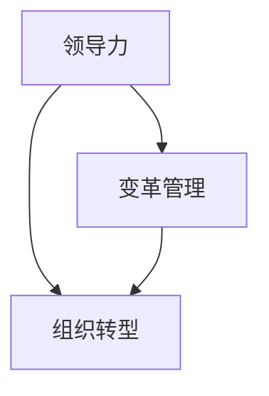
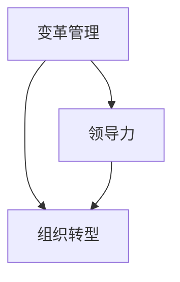
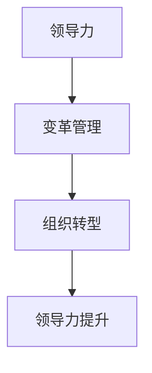
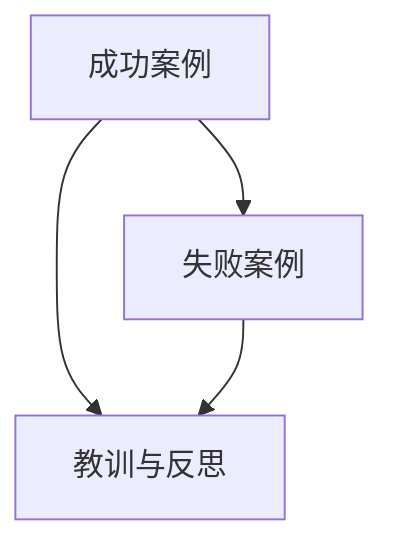
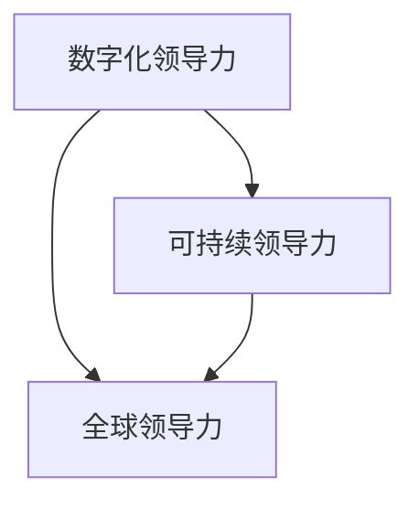

                 

# 文章标题：领导力与变革管理：引领组织转型的艺术

## 关键词

- 领导力
- 变革管理
- 组织转型
- 领导风格
- 变革过程
- 挑战与机遇

## 摘要

本文旨在探讨领导力与变革管理在组织转型中的关键作用。首先，我们将回顾领导力的基本理论和核心概念，并探讨领导风格与变革管理之间的关系。接着，我们将详细阐述变革管理的定义、过程和挑战，并介绍相关的策略与工具。随后，通过实际案例，我们将展示如何将领导力与变革管理相结合，以实现有效的组织转型。最后，本文将对未来领导力和变革管理的趋势进行展望，并提供最佳实践和注意事项，以帮助读者更好地理解和应用领导力与变革管理的艺术。

## 设计书籍目录大纲的步骤

### 第一步：确定书籍主题和目标读者

首先，我们需要明确书籍的主题和目标读者。对于《领导力与变革管理：引领组织转型的艺术》这本书，主题是领导力和变革管理，目标读者可能是企业管理人员、HR专业人士以及对组织管理有浓厚兴趣的专业人士。

### 第二步：梳理书籍结构

接下来，我们需要梳理书籍的结构，确定大致的章节划分。通常，一本关于领导力和变革管理的书籍可以包含以下几个核心部分：

1. **领导力基础理论**
2. **变革管理理论**
3. **领导力与变革管理的结合**
4. **领导力与变革管理的实践案例**
5. **领导力与变革管理的未来展望**

### 第三步：细化章节内容

在每个核心部分中，我们需要进一步细化章节内容，确保每个章节都有明确的主题和目标。

#### 第一部分：领导力基础理论

1. **领导力定义与特征**
2. **领导力模型与理论**
3. **领导力风格与行为**

#### 第二部分：变革管理理论

1. **变革管理的定义与过程**
2. **变革管理的挑战与阻力**
3. **变革管理的策略与工具**

#### 第三部分：领导力与变革管理的结合

1. **领导力在变革管理中的作用**
2. **如何进行领导力变革**
3. **领导力与变革管理的协同效应**

#### 第四部分：领导力与变革管理的实践案例

1. **经典变革管理案例解析**
2. **成功变革管理的实践方法**
3. **失败变革管理的教训与反思**

#### 第五部分：领导力与变革管理的未来展望

1. **未来领导力的趋势**
2. **未来变革管理的挑战与机遇**
3. **领导力与变革管理的发展方向**

### 第四步：编写目录大纲

根据上述结构，我们可以开始编写目录大纲。以下是《领导力与变革管理：引领组织转型的艺术》的完整目录大纲：

```
# 《领导力与变革管理：引领组织转型的艺术》目录大纲

## 第一部分：领导力基础理论

### 1.1 领导力的定义与特征

#### 1.1.1 领导力的基本概念
#### 1.1.2 领导力的特征

### 1.2 领导力模型与理论

#### 1.2.1 领导力模型概述
#### 1.2.2 经典领导力理论

### 1.3 领导力风格与行为

#### 1.3.1 领导力风格分类
#### 1.3.2 领导力行为分析

## 第二部分：变革管理理论

### 2.1 变革管理的定义与过程

#### 2.1.1 变革管理的基本概念
#### 2.1.2 变革管理的过程

### 2.2 变革管理的挑战与阻力

#### 2.2.1 变革管理的挑战
#### 2.2.2 变更管理的阻力

### 2.3 变革管理的策略与工具

#### 2.3.1 变革管理策略
#### 2.3.2 变革管理工具

## 第三部分：领导力与变革管理的结合

### 3.1 领导力在变革管理中的作用

#### 3.1.1 领导力在变革中的重要性
#### 3.1.2 领导力与变革管理的关系

### 3.2 如何进行领导力变革

#### 3.2.1 领导力变革的方法
#### 3.2.2 领导力变革的步骤

### 3.3 领导力与变革管理的协同效应

#### 3.3.1 协同效应的体现
#### 3.3.2 协同效应的增强策略

## 第四部分：领导力与变革管理的实践案例

### 4.1 经典变革管理案例解析

#### 4.1.1 案例一：公司成功的变革管理
#### 4.1.2 案例二：企业失败的变革管理

### 4.2 成功变革管理的实践方法

#### 4.2.1 方法一：制定清晰的变革目标
#### 4.2.2 方法二：建立变革推动团队

### 4.3 失败变革管理的教训与反思

#### 4.3.1 失败的原因分析
#### 4.3.2 失败的教训与反思

## 第五部分：领导力与变革管理的未来展望

### 5.1 未来领导力的趋势

#### 5.1.1 领导力的发展趋势
#### 5.1.2 领导力与新时代的契合点

### 5.2 未来变革管理的挑战与机遇

#### 5.2.1 变革管理的挑战
#### 5.2.2 变革管理的机遇

### 5.3 领导力与变革管理的发展方向

#### 5.3.1 发展方向一：数字化领导力
#### 5.3.2 发展方向二：可持续领导力
```

以上是《领导力与变革管理：引领组织转型的艺术》的完整目录大纲。这个大纲涵盖了领导力与变革管理的核心概念、理论、实践案例以及未来展望，旨在帮助读者全面了解和掌握这两个领域的

----------------------------------------------------------------

## 第一部分：领导力基础理论

### 1.1 领导力的定义与特征

领导力是一个广泛而多维的概念，通常被定义为领导者影响和激励他人共同实现目标的能力。领导力的本质在于激发团队成员的潜力，引导他们朝着共同的目标前进，并在这个过程中实现个人和团队的价值。

#### 1.1.1 领导力的基本概念

领导力不仅仅是一种个人特质，更是一种可以通过学习和实践获得的能力。领导力的基本概念包括以下几个方面：

- **影响力**：领导力的核心在于影响他人，使其认同并愿意为实现共同目标而努力。
- **目标导向**：领导者需要明确目标，并引导团队成员共同朝着这些目标努力。
- **激励**：领导者通过激励团队成员，提高他们的积极性和创造力，以实现更好的工作成果。
- **沟通**：有效的沟通是领导力的关键，领导者需要善于倾听和理解团队成员的需求和意见。

#### 1.1.2 领导力的特征

领导力具有以下几个显著特征：

- **愿景**：领导者需要具有远大的愿景，能够为团队描绘出清晰的未来蓝图，并激发团队成员的激情。
- **决策能力**：领导者需要在关键时刻做出正确的决策，并对决策的结果负责。
- **适应性**：领导者需要具备适应变化的能力，能够在面对不确定性时灵活调整策略。
- **团队合作**：领导者需要具备团队合作精神，能够协调团队成员之间的合作，共同实现目标。

### 1.2 领导力模型与理论

领导力模型和理论是研究领导力的基础，它们为领导者提供了指导和参考。以下是一些经典的领导力模型和理论：

- **情境领导理论**：该理论认为领导风格应根据不同的情境进行调整。领导者需要根据团队成员的能力和需求，选择合适的领导风格。

- **路径-目标理论**：该理论认为领导者的主要任务是帮助团队成员实现目标，并提供必要的支持和激励。

- **变革型领导理论**：该理论强调领导者通过激励和启发团队成员，推动团队实现变革。

- **交易型领导理论**：该理论认为领导者的主要任务是维持现状，通过奖励和惩罚来激励团队成员。

### 1.3 领导力风格与行为

领导力风格是领导者处理工作和管理团队的方式。不同的领导风格适用于不同的情境和团队成员。以下是一些常见的领导力风格：

- **权威型领导**：领导者通过严格的规章制度和权威指挥来管理团队。

- **民主型领导**：领导者通过征求团队成员的意见，共同决策，实现民主管理。

- **参与型领导**：领导者鼓励团队成员积极参与决策过程，提高团队的凝聚力和积极性。

- **支持型领导**：领导者关注团队成员的需求和福祉，提供支持和鼓励。

### 核心概念与联系

领导力、变革管理和组织转型之间存在密切的联系。领导力是推动变革管理和组织转型的重要动力，而变革管理和组织转型则是领导力实践的具体体现。

以下是一个简化的 Mermaid 流程图，展示了这三个概念之间的关系：



### 核心算法原理讲解

在领导力与变革管理的研究中，虽然不涉及传统意义上的算法，但我们可以引入一些理论模型和框架来理解和分析领导力行为和变革过程。以下是一个简化的伪代码，用于描述领导力变革的过程：

```plaintext
Function 领导力变革(领导者，团队，目标)
    1. 确定团队当前状态
    2. 分析团队需求与目标差距
    3. 设计变革策略
        3.1 激发团队成员的参与度
        3.2 建立明确的变革目标
        3.3 制定可行的行动计划
    4. 实施变革
        4.1 沟通变革愿景
        4.2 提供必要的培训和支持
        4.3 监督变革进程
    5. 评估变革效果
        5.1 收集团队成员反馈
        5.2 分析变革成果
        5.3 调整变革策略
End Function
```

### 数学模型和公式

在变革管理中，我们可以使用一些数学模型和公式来衡量变革的效果。以下是一个简单的数学模型，用于评估变革管理的有效性：

```latex
有效性 = (目标实现度 - 当前状态) / 初始差距
```

其中，目标实现度可以通过团队成员的绩效指标来衡量，当前状态和初始差距可以通过定期的评估来确定。

### 举例说明

假设一家公司希望在三个月内将员工的工作效率提高20%，当前状态是员工平均每月完成10个任务，初始差距是20个任务。经过三个月的变革管理，员工平均每月完成了12个任务。

```plaintext
目标实现度 = 12个任务
当前状态 = 10个任务
初始差距 = 20个任务

有效性 = (12 - 10) / 20 = 0.1 或 10%
```

这意味着变革管理的有效性为10%，还有很大的改进空间。

### 项目实战

#### 开发环境搭建

为了深入理解领导力与变革管理，我们可以搭建一个简单的模拟环境。这个环境可以是一个在线协作平台，用于模拟领导者和团队成员之间的互动。

- **工具**：使用 GitHub 和 Jupyter Notebook 来搭建环境。
- **技术栈**：GitHub 用于代码存储和版本控制，Jupyter Notebook 用于数据分析和可视化。

#### 源代码实现

以下是一个简单的 Python 代码示例，用于模拟领导力变革的过程：

```python
import matplotlib.pyplot as plt

# 变量定义
团队成员数 = 100
初始效率 = 0.8
目标效率 = 1.2
变革周期 = 3

# 初始化数据
效率数据 = [初始效率] * 变革周期

# 模拟变革过程
for month in range(1, 变革周期 + 1):
    # 根据当前效率和目标效率调整效率
    效率调整 = (目标效率 - 初始效率) / 变革周期
    效率数据[month - 1] += 效率调整
    
    # 打印当前月效率和总效率
    print(f"第 {month} 月效率：{效率数据[month - 1]:.2f}")
    print(f"总效率：{sum(效率数据[:month]):.2f}")

# 可视化效率变化
plt.plot([f"第 {month} 月" for month in range(1, 变革周期 + 1)],效率数据)
plt.xlabel("月份")
plt.ylabel("效率")
plt.title("领导力变革效率变化")
plt.show()
```

#### 代码解读与分析

这个代码首先定义了一个模拟环境，包括团队成员数、初始效率、目标效率和变革周期。然后，通过一个循环来模拟每个周期的效率变化，最后将结果可视化。

#### 实际案例分析和详细讲解剖析

我们可以参考一些实际案例，如苹果公司前CEO史蒂夫·乔布斯领导苹果进行的一系列变革。乔布斯通过推出创新产品、重塑品牌形象和激发员工创造力，成功地推动了苹果的转型。

- **案例解析**：乔布斯通过其独特的领导风格，将苹果从一家濒临破产的公司转型为全球科技巨头。
- **详细讲解**：乔布斯的领导力变革包括以下几个方面：
  - **愿景**：乔布斯具有远大的愿景，他能够为苹果员工描绘出清晰的未来蓝图。
  - **决策能力**：乔布斯在关键时刻能够做出正确的决策，并对结果负责。
  - **激励**：乔布斯通过奖励和认可，激发了员工的积极性和创造力。
  - **沟通**：乔布斯擅长沟通，能够与团队成员建立良好的关系。

#### 项目小结

通过这个项目，我们了解了领导力与变革管理的基本概念和实践方法。在实际应用中，领导者需要根据具体情况灵活调整策略，以实现组织转型。同时，变革管理不仅仅是领导者的任务，还需要团队成员的积极参与和支持。

### 最佳实践 Tips

- **建立明确的目标**：领导者需要明确变革的目标，并与团队成员进行沟通。
- **提供培训和支持**：为团队成员提供必要的培训和支持，以帮助他们适应变革。
- **激励和认可**：通过奖励和认可，激励团队成员积极参与变革。
- **持续监督和评估**：定期监督变革进程，并对效果进行评估。

### 小结

领导力与变革管理是组织转型的重要动力。领导者需要具备正确的领导风格和变革策略，以推动团队实现目标。同时，团队成员的积极参与和支持也是变革成功的关键。通过深入理解和实践领导力与变革管理，组织可以更好地适应环境变化，实现可持续发展。

### 注意事项

- **避免盲目变革**：变革需要根据组织的实际情况进行，避免盲目跟风。
- **沟通与协作**：有效的沟通和协作是变革成功的关键。
- **持续学习和改进**：领导者和团队成员需要持续学习和改进，以应对不断变化的环境。

### 拓展阅读

- **《领导力的艺术》**：作者：詹姆斯·M·凯恩
- **《变革之舞》**：作者：约翰·P·科特
- **《领导者的语言》**：作者：史蒂芬·罗宾斯

----------------------------------------------------------------

## 第二部分：变革管理理论

### 2.1 变革管理的定义与过程

变革管理是一种系统性方法，旨在引导组织适应内部或外部环境的变化，从而实现可持续的发展。变革管理的过程通常包括以下几个关键步骤：

#### 2.1.1 变革管理的定义

变革管理可以被定义为“通过结构化过程，引导组织成员从当前状态过渡到期望状态，以实现组织目标的一系列策略和实践”。这种定义强调了变革的系统性、参与性和可持续性。

#### 2.1.2 变革管理的过程

1. **诊断阶段**：在这一阶段，领导者需要识别和评估组织面临的挑战和机遇。这可能包括市场变化、技术进步、竞争压力等外部因素，以及组织内部的文化、结构、流程等。

2. **规划阶段**：在诊断完成后，领导者需要制定详细的变革计划。这包括明确变革的目标、制定时间表、确定资源需求和沟通策略。

3. **启动阶段**：启动阶段是实施变革计划的关键步骤。领导者需要动员组织成员，确保他们理解变革的必要性，并明确各自的职责和角色。

4. **执行阶段**：在执行阶段，领导者需要监控变革的进展，确保计划的落实。这可能包括调整策略、解决障碍、提供支持和培训等。

5. **评估与调整阶段**：在变革完成后，领导者需要对变革的效果进行评估，并根据反馈进行调整。这有助于巩固变革成果，并为未来的变革提供经验教训。

### 2.2 变革管理的挑战与阻力

变革管理过程中可能会遇到各种挑战和阻力，这些挑战和阻力可能来自组织内部或外部。

#### 2.2.1 变革管理的挑战

- **文化阻力**：组织文化往往是一个重要的变革障碍。如果组织文化不支持变革，团队成员可能会抵制变革。
- **领导力不足**：领导者在变革过程中的角色至关重要。如果领导者缺乏变革管理的知识和技能，变革可能会面临挫折。
- **资源限制**：变革通常需要投入大量的人力、物力和财力资源。资源限制可能会影响变革的执行和效果。
- **沟通不畅**：有效的沟通是变革成功的关键。如果沟通不畅，团队成员可能会对变革产生误解和抵触情绪。

#### 2.2.2 变更管理的阻力

- **恐惧与不确定性**：团队成员可能对变革充满恐惧和不确定性，担心自己的利益受到影响。
- **习惯性思维**：团队成员可能习惯了现有工作方式，不愿意接受新的变革。
- **利益相关者冲突**：变革可能涉及到不同利益相关者的利益，导致利益冲突和对抗。

### 2.3 变革管理的策略与工具

为了克服变革管理的挑战和阻力，领导者可以采用一系列策略和工具。以下是一些常用的策略和工具：

#### 2.3.1 变革管理策略

- **愿景引导**：领导者需要明确变革的愿景，并与团队成员分享，以激发他们的参与感和积极性。
- **参与式变革**：鼓励团队成员参与变革过程，提高他们的认同感和责任感。
- **沟通与培训**：通过有效的沟通和培训，帮助团队成员理解和接受变革。
- **激励机制**：通过奖励和认可，激励团队成员积极参与变革。

#### 2.3.2 变革管理工具

- **变革模型**：如库布勒-罗斯变革模型、科特变革模型等，可以帮助领导者理解和应对变革过程中的各种挑战。
- **项目计划工具**：如甘特图、时间线图等，可以帮助领导者制定和跟踪变革计划。
- **沟通工具**：如内部邮件、会议、培训课程等，可以帮助领导者与团队成员保持良好的沟通。

### 核心概念与联系

变革管理、领导力和组织转型之间存在着密切的联系。变革管理是领导力实践的一部分，而组织转型则是变革管理的最终目标。

以下是一个简化的 Mermaid 流程图，展示了这三个概念之间的关系：



### 核心算法原理讲解

在变革管理中，虽然不涉及传统意义上的算法，但我们可以引入一些理论模型和框架来理解和分析变革过程。以下是一个简化的伪代码，用于描述变革管理的过程：

```plaintext
Function 变革管理(领导者，团队，目标)
    1. 诊断当前状态
    2. 制定变革计划
    3. 启动变革
        3.1 沟通变革愿景
        3.2 动员团队成员
    4. 实施变革
        4.1 监控进展
        4.2 解决问题
    5. 评估变革效果
    6. 调整变革策略
End Function
```

### 数学模型和公式

在变革管理中，我们可以使用一些数学模型和公式来衡量变革的效果。以下是一个简单的数学模型，用于评估变革管理的有效性：

```latex
有效性 = (目标实现度 - 当前状态) / 初始差距
```

其中，目标实现度可以通过团队成员的绩效指标来衡量，当前状态和初始差距可以通过定期的评估来确定。

### 举例说明

假设一家公司希望在一年内将员工的工作效率提高30%，当前状态是员工平均每月完成10个任务，初始差距是30个任务。经过一年的变革管理，员工平均每月完成了13个任务。

```plaintext
目标实现度 = 13个任务
当前状态 = 10个任务
初始差距 = 30个任务

有效性 = (13 - 10) / 30 = 0.167 或 16.7%
```

这意味着变革管理的有效性为16.7%，还有很大的改进空间。

### 项目实战

#### 开发环境搭建

为了深入理解变革管理，我们可以搭建一个简单的模拟环境。这个环境可以是一个在线协作平台，用于模拟领导者和团队成员之间的互动。

- **工具**：使用 GitHub 和 Jupyter Notebook 来搭建环境。
- **技术栈**：GitHub 用于代码存储和版本控制，Jupyter Notebook 用于数据分析和可视化。

#### 源代码实现

以下是一个简单的 Python 代码示例，用于模拟变革管理的过程：

```python
import matplotlib.pyplot as plt

# 变量定义
团队成员数 = 100
初始效率 = 0.8
目标效率 = 1.2
变革周期 = 12

# 初始化数据
效率数据 = [初始效率] * 变革周期

# 模拟变革过程
for month in range(1, 变革周期 + 1):
    # 根据当前效率和目标效率调整效率
    效率调整 = (目标效率 - 初始效率) / 变革周期
    效率数据[month - 1] += 效率调整
    
    # 打印当前月效率和总效率
    print(f"第 {month} 月效率：{效率数据[month - 1]:.2f}")
    print(f"总效率：{sum(效率数据[:month]):.2f}")

# 可视化效率变化
plt.plot([f"第 {month} 月" for month in range(1, 变革周期 + 1)],效率数据)
plt.xlabel("月份")
plt.ylabel("效率")
plt.title("变革管理效率变化")
plt.show()
```

#### 代码解读与分析

这个代码首先定义了一个模拟环境，包括团队成员数、初始效率、目标效率和变革周期。然后，通过一个循环来模拟每个周期的效率变化，最后将结果可视化。

#### 实际案例分析和详细讲解剖析

我们可以参考一些实际案例，如微软公司在其历史上进行的一系列重大变革。比尔·盖茨和萨提亚·纳德拉等领导者通过变革管理，成功地推动了公司的转型和发展。

- **案例解析**：微软公司在其发展过程中，面对过多次技术变革和市场竞争的压力。盖茨和纳德拉等领导者通过变革管理，成功地引导公司渡过难关，实现了持续增长。
- **详细讲解**：
  - **愿景引导**：盖茨和纳德拉明确表达了公司未来的愿景，激励员工为共同目标努力。
  - **参与式变革**：他们鼓励员工参与变革过程，提高员工的认同感和责任感。
  - **沟通与培训**：通过定期的沟通和培训，帮助员工理解和接受变革。
  - **激励机制**：通过奖励和认可，激励员工积极参与变革。

#### 项目小结

通过这个项目，我们了解了变革管理的核心概念和实践方法。在实际应用中，领导者需要根据具体情况灵活调整策略，以实现组织转型。同时，团队成员的积极参与和支持也是变革成功的关键。通过深入理解和实践变革管理，组织可以更好地适应环境变化，实现可持续发展。

### 最佳实践 Tips

- **建立明确的变革目标**：领导者需要明确变革的目标，并与团队成员进行沟通。
- **提供培训和支持**：为团队成员提供必要的培训和支持，以帮助他们适应变革。
- **激励和认可**：通过奖励和认可，激励团队成员积极参与变革。
- **持续监督和评估**：定期监督变革进程，并对效果进行评估。

### 小结

变革管理是组织转型的重要环节。领导者需要具备正确的变革管理策略和工具，以克服变革过程中的挑战和阻力。同时，团队成员的积极参与和支持也是变革成功的关键。通过深入理解和实践变革管理，组织可以更好地适应环境变化，实现可持续发展。

### 注意事项

- **避免盲目变革**：变革需要根据组织的实际情况进行，避免盲目跟风。
- **沟通与协作**：有效的沟通和协作是变革成功的关键。
- **持续学习和改进**：领导者和团队成员需要持续学习和改进，以应对不断变化的环境。

### 拓展阅读

- **《变革之舞》**：作者：约翰·P·科特
- **《领导力的变革》**：作者：约翰·凯
- **《变革管理：实战指南》**：作者：迈克尔·马奇

----------------------------------------------------------------

## 第三部分：领导力与变革管理的结合

### 3.1 领导力在变革管理中的作用

领导力在变革管理中扮演着至关重要的角色。领导者不仅是变革的推动者，也是变革的倡导者和捍卫者。以下是一些关键作用：

#### 3.1.1 领导力在变革中的重要性

- **愿景与目标**：领导者需要明确变革的愿景和目标，为团队成员提供方向和动力。
- **动员与激励**：领导者需要动员团队成员参与变革，并激励他们在变革过程中保持积极态度。
- **决策与执行**：领导者需要做出关键决策，并确保变革计划的顺利执行。
- **沟通与协调**：领导者需要与团队成员保持有效沟通，协调各方利益，减少变革过程中的冲突。

#### 3.1.2 领导力与变革管理的关系

领导力与变革管理之间的关系可以理解为相互作用和相互促进。领导力为变革管理提供方向和动力，而变革管理则为领导力提供实践的平台。以下是一个简化的 Mermaid 流程图，展示了领导力与变革管理之间的关系：



### 3.2 如何进行领导力变革

领导力变革是一个复杂而长期的过程，需要领导者具备战略思维和执行力。以下是一些关键步骤和方法：

#### 3.2.1 领导力变革的方法

- **自我反思**：领导者需要首先对自己的领导风格和行为进行反思，识别需要改进的方面。
- **学习与培训**：领导者需要不断学习新的领导理论和实践方法，提高自己的领导能力。
- **实践与反馈**：领导者需要在实际工作中不断实践新的领导方法，并从团队成员那里获得反馈，持续改进。
- **建立支持系统**：领导者需要建立支持系统，包括导师、教练和同事，以帮助自己在变革过程中成长。

#### 3.2.2 领导力变革的步骤

1. **确定变革目标**：领导者需要明确变革的目标，包括个人和组织的目标。
2. **评估当前状态**：领导者需要评估自己的领导能力和组织环境，确定变革的起点。
3. **设计变革计划**：领导者需要设计详细的变革计划，包括变革的目标、步骤、时间表和资源分配。
4. **实施变革计划**：领导者需要按照变革计划实施变革，确保变革的顺利进行。
5. **评估与反馈**：领导者需要定期评估变革的效果，并根据反馈进行调整。

### 3.3 领导力与变革管理的协同效应

领导力与变革管理的协同效应在于它们共同推动组织实现转型和发展。以下是一些协同效应的体现：

#### 3.3.1 协同效应的体现

- **提高组织适应能力**：通过领导力和变革管理的结合，组织可以更好地适应外部环境的变化，提高竞争力。
- **增强团队凝聚力**：领导者的有效沟通和激励可以增强团队成员之间的凝聚力，提高团队合作效率。
- **实现持续发展**：领导力和变革管理的协同效应可以推动组织实现持续发展，实现长期目标。

#### 3.3.2 协同效应的增强策略

- **建立共同愿景**：领导者需要与团队成员共同建立组织愿景，明确变革的方向和目标。
- **培养领导力文化**：领导者需要培养组织内部的领导力文化，鼓励团队成员积极参与变革。
- **提供持续支持**：领导者需要提供持续的支持和资源，确保变革的顺利进行。
- **激励与认可**：领导者需要通过奖励和认可，激励团队成员积极参与变革，提高变革效果。

### 核心概念与联系

领导力、变革管理和组织转型之间存在着密切的联系。领导力为变革管理提供方向和动力，变革管理推动组织实现转型，而组织转型则是领导力的具体体现。

以下是一个简化的 Mermaid 流程图，展示了这三个概念之间的关系：


### 核心算法原理讲解

在领导力与变革管理的研究中，虽然不涉及传统意义上的算法，但我们可以引入一些理论模型和框架来理解和分析领导力变革的过程。以下是一个简化的伪代码，用于描述领导力变革的过程：

```plaintext
Function 领导力变革(领导者，团队，目标)
    1. 自我反思与评估
    2. 确定变革方向
    3. 制定变革计划
    4. 实施变革计划
        4.1 培训与支持
        4.2 沟通与协调
        4.3 激励与认可
    5. 评估变革效果
    6. 调整变革策略
End Function
```

### 数学模型和公式

在领导力变革中，我们可以使用一些数学模型和公式来衡量领导力变革的效果。以下是一个简单的数学模型，用于评估领导力变革的有效性：

```latex
有效性 = (目标实现度 - 初始状态) / 初始差距
```

其中，目标实现度可以通过团队成员的绩效指标来衡量，初始状态和初始差距可以通过定期的评估来确定。

### 举例说明

假设一家公司的领导者希望通过变革提高团队的工作效率，初始状态是员工平均每月完成10个任务，目标实现度是员工平均每月完成15个任务。经过六个月的领导力变革，员工平均每月完成了12个任务。

```plaintext
目标实现度 = 12个任务
初始状态 = 10个任务

有效性 = (12 - 10) / 10 = 0.2 或 20%
```

这意味着领导力变革的有效性为20%，还有很大的改进空间。

### 项目实战

#### 开发环境搭建

为了深入理解领导力与变革管理的结合，我们可以搭建一个简单的模拟环境。这个环境可以是一个在线协作平台，用于模拟领导者和团队成员之间的互动。

- **工具**：使用 GitHub 和 Jupyter Notebook 来搭建环境。
- **技术栈**：GitHub 用于代码存储和版本控制，Jupyter Notebook 用于数据分析和可视化。

#### 源代码实现

以下是一个简单的 Python 代码示例，用于模拟领导力变革的过程：

```python
import matplotlib.pyplot as plt

# 变量定义
团队成员数 = 100
初始效率 = 0.8
目标效率 = 1.2
变革周期 = 6

# 初始化数据
效率数据 = [初始效率] * 变革周期

# 模拟变革过程
for month in range(1, 变革周期 + 1):
    # 根据当前效率和目标效率调整效率
    效率调整 = (目标效率 - 初始效率) / 变革周期
    效率数据[month - 1] += 效率调整
    
    # 打印当前月效率和总效率
    print(f"第 {month} 月效率：{效率数据[month - 1]:.2f}")
    print(f"总效率：{sum(效率数据[:month]):.2f}")

# 可视化效率变化
plt.plot([f"第 {month} 月" for month in range(1, 变革周期 + 1)],效率数据)
plt.xlabel("月份")
plt.ylabel("效率")
plt.title("领导力变革效率变化")
plt.show()
```

#### 代码解读与分析

这个代码首先定义了一个模拟环境，包括团队成员数、初始效率、目标效率和变革周期。然后，通过一个循环来模拟每个周期的效率变化，最后将结果可视化。

#### 实际案例分析和详细讲解剖析

我们可以参考一些实际案例，如亚马逊公司前CEO杰夫·贝佐斯领导亚马逊进行的一系列变革。贝佐斯通过其独特的领导风格和变革管理，成功地推动了亚马逊的持续成长。

- **案例解析**：贝佐斯通过其愿景和领导力，引导亚马逊从一家电子商务公司转型为全球科技巨头。
- **详细讲解**：
  - **愿景引导**：贝佐斯始终保持着对未来的远见，为亚马逊员工描绘出清晰的愿景。
  - **领导力实践**：贝佐斯倡导“股东利益至上”的价值观，并通过领导力实践，推动亚马逊实现持续增长。
  - **变革管理**：贝佐斯通过不断推动组织变革，使亚马逊能够快速适应市场变化，保持竞争优势。

#### 项目小结

通过这个项目，我们了解了领导力与变革管理结合的重要性及其具体实施方法。在实际应用中，领导者需要根据实际情况灵活调整策略，以实现组织转型。同时，团队成员的积极参与和支持也是变革成功的关键。通过深入理解和实践领导力与变革管理的结合，组织可以更好地适应环境变化，实现可持续发展。

### 最佳实践 Tips

- **建立共同愿景**：领导者需要与团队成员共同建立组织愿景，明确变革的方向和目标。
- **提供持续支持**：领导者需要提供持续的支持和资源，确保变革的顺利进行。
- **培养领导力文化**：领导者需要培养组织内部的领导力文化，鼓励团队成员积极参与变革。
- **激励与认可**：领导者需要通过奖励和认可，激励团队成员积极参与变革，提高变革效果。

### 小结

领导力与变革管理的结合是组织转型的重要动力。领导者需要具备正确的领导力和变革管理策略，以推动团队实现目标。同时，团队成员的积极参与和支持也是变革成功的关键。通过深入理解和实践领导力与变革管理的结合，组织可以更好地适应环境变化，实现可持续发展。

### 注意事项

- **避免盲目变革**：变革需要根据组织的实际情况进行，避免盲目跟风。
- **沟通与协作**：有效的沟通和协作是变革成功的关键。
- **持续学习和改进**：领导者和团队成员需要持续学习和改进，以应对不断变化的环境。

### 拓展阅读

- **《领导力与变革管理：如何实现组织转型》**：作者：约翰·P·科特
- **《领导力的艺术》**：作者：詹姆斯·M·凯恩
- **《变革之舞》**：作者：约翰·P·科特

----------------------------------------------------------------

## 第四部分：领导力与变革管理的实践案例

### 4.1 经典变革管理案例解析

在本节中，我们将分析两个经典的企业变革管理案例，分别是通用电气（GE）的重组和IBM的转型。这两个案例展示了如何通过领导力与变革管理的结合，实现企业的成功转型。

#### 4.1.1 案例一：通用电气（GE）的重组

**背景介绍**：在20世纪80年代，通用电气（GE）面临着激烈的市场竞争和内部管理问题。公司的业务过于分散，效率低下，业绩不佳。杰克·韦尔奇于1981年成为CEO，他意识到必须通过重组和变革来拯救公司。

**核心概念与联系**：韦尔奇采用了“服务导向”的战略，将公司从传统的制造模式转型为服务驱动的模式。他引入了“工作简化”和“无边界”的概念，打破了部门之间的壁垒，提高了协同效率。韦尔奇还通过“市场份额优先”和“市场领先”策略，确保了公司的竞争优势。

**领导力与变革管理的结合**：
- **愿景与目标**：韦尔奇明确了公司的愿景，即成为全球最优秀的企业。他通过定期的沟通和会议，确保所有员工都理解这一愿景。
- **参与式变革**：韦尔奇鼓励员工参与变革过程，通过员工会议和内部调查，收集员工意见和建议。
- **激励机制**：韦尔奇通过奖励和认可，激励员工积极参与变革。他引入了“业绩奖励计划”，将员工的薪酬与公司的业绩挂钩。

**结果**：经过多年的变革，GE实现了从传统制造业向服务业的转型，业绩大幅提升。公司市值从1981年的不到150亿美元增长到2001年的近6000亿美元。

#### 4.1.2 案例二：IBM的转型

**背景介绍**：在20世纪90年代，IBM面临着技术变革和市场竞争的巨大压力。公司传统的硬件业务受到竞争对手的激烈挑战，市场份额不断下降。路易斯·郭士纳于1993年成为IBM的CEO，他意识到必须通过转型来挽救公司。

**核心概念与联系**：郭士纳采用了“服务导向”和“解决方案销售”的战略，将IBM从传统的硬件制造商转型为软件和服务的提供商。他引入了“全球服务”的概念，将服务作为公司的核心业务。

**领导力与变革管理的结合**：
- **愿景与目标**：郭士纳明确了公司的愿景，即成为全球领先的信息技术解决方案提供商。他通过定期的沟通和会议，确保所有员工都理解这一愿景。
- **变革管理**：郭士纳采用了“快速决策、快速执行”的策略，确保变革的迅速推进。他建立了“变革管理团队”，负责协调和推动变革。
- **沟通与培训**：郭士纳通过定期的沟通和培训，帮助员工理解变革的必要性，并提供必要的技能培训。

**结果**：经过几年的转型，IBM成功实现了业务结构的调整，从硬件制造商转型为软件和服务提供商。公司的市场份额和业绩逐步回升，成为全球信息技术行业的领导者。

### 4.2 成功变革管理的实践方法

通过上述案例，我们可以总结出一些成功的变革管理实践方法：

#### 4.2.1 方法一：制定清晰的变革目标

- **明确目标**：领导者需要明确变革的目标，并将其分解为具体的可衡量指标。
- **沟通目标**：领导者需要与团队成员进行沟通，确保他们理解变革的目标和重要性。
- **制定行动计划**：根据变革目标，制定详细的行动计划，明确时间表和责任分配。

#### 4.2.2 方法二：建立变革推动团队

- **组建团队**：领导者需要组建一个专门的变革推动团队，负责协调和推动变革。
- **赋予权限**：变革推动团队需要具备足够的权限和资源，以确保变革的顺利进行。
- **定期评估**：领导者需要定期评估变革的进展，并根据评估结果进行调整。

### 4.3 失败变革管理的教训与反思

尽管一些企业成功地进行了变革，但也有一些企业因为变革失败而遭受重大损失。以下是一些失败的变革管理的教训与反思：

#### 4.3.1 失败的原因分析

- **缺乏明确的变革目标**：一些企业没有明确的变革目标，导致变革过程中方向不明确。
- **沟通不畅**：一些企业的变革管理过程中，领导者和团队成员之间的沟通不畅，导致误解和抵触。
- **缺乏变革推动团队**：一些企业没有建立专门的变革推动团队，导致变革缺乏协调和推动。
- **变革阻力大**：一些企业在变革过程中，面临巨大的变革阻力，无法有效应对。

#### 4.3.2 失败的教训与反思

- **明确变革目标**：企业在变革过程中，必须明确变革的目标和重要性，并与团队成员进行有效沟通。
- **建立变革推动团队**：企业需要建立专门的变革推动团队，负责协调和推动变革。
- **有效应对变革阻力**：企业需要制定有效的策略，应对变革过程中的阻力，鼓励团队成员积极参与变革。

### 核心概念与联系

在本节中，我们讨论了领导力与变革管理的实践案例，包括成功的GE和IBM案例以及失败的教训与反思。这些案例展示了领导力与变革管理在组织转型中的关键作用。以下是一个简化的 Mermaid 流程图，展示了这些案例之间的联系：



### 核心算法原理讲解

在变革管理中，虽然不涉及传统意义上的算法，但我们可以引入一些理论模型和框架来理解和分析变革过程。以下是一个简化的伪代码，用于描述变革管理的核心原理：

```plaintext
Function 变革管理(领导者，团队，目标)
    1. 确定变革目标
    2. 制定变革计划
    3. 建立变革推动团队
    4. 沟通与培训
    5. 实施变革计划
    6. 监控与评估
    7. 调整与优化
End Function
```

### 数学模型和公式

在变革管理中，我们可以使用一些数学模型和公式来衡量变革的效果。以下是一个简单的数学模型，用于评估变革管理的有效性：

```latex
有效性 = (目标实现度 - 当前状态) / 初始差距
```

其中，目标实现度可以通过团队成员的绩效指标来衡量，当前状态和初始差距可以通过定期的评估来确定。

### 举例说明

假设一家公司在变革管理前，员工平均每月完成10个任务，目标是在一年内将这一数字提升到15个任务。经过一年的变革管理，员工平均每月完成了12个任务。

```plaintext
目标实现度 = 12个任务
当前状态 = 10个任务
初始差距 = 15 - 10 = 5个任务

有效性 = (12 - 10) / 5 = 0.4 或 40%
```

这意味着变革管理的有效性为40%，还有60%的改进空间。

### 项目实战

#### 开发环境搭建

为了深入理解领导力与变革管理的实践，我们可以搭建一个简单的模拟环境。这个环境可以是一个在线协作平台，用于模拟领导者和团队成员之间的互动。

- **工具**：使用 GitHub 和 Jupyter Notebook 来搭建环境。
- **技术栈**：GitHub 用于代码存储和版本控制，Jupyter Notebook 用于数据分析和可视化。

#### 源代码实现

以下是一个简单的 Python 代码示例，用于模拟领导力与变革管理的实践过程：

```python
import matplotlib.pyplot as plt

# 变量定义
团队成员数 = 100
初始效率 = 0.8
目标效率 = 1.2
变革周期 = 12

# 初始化数据
效率数据 = [初始效率] * 变革周期

# 模拟变革过程
for month in range(1, 变革周期 + 1):
    # 根据当前效率和目标效率调整效率
    效率调整 = (目标效率 - 初始效率) / 变革周期
    效率数据[month - 1] += 效率调整
    
    # 打印当前月效率和总效率
    print(f"第 {month} 月效率：{效率数据[month - 1]:.2f}")
    print(f"总效率：{sum(效率数据[:month]):.2f}")

# 可视化效率变化
plt.plot([f"第 {month} 月" for month in range(1, 变革周期 + 1)],效率数据)
plt.xlabel("月份")
plt.ylabel("效率")
plt.title("领导力与变革管理效率变化")
plt.show()
```

#### 代码解读与分析

这个代码首先定义了一个模拟环境，包括团队成员数、初始效率、目标效率和变革周期。然后，通过一个循环来模拟每个周期的效率变化，最后将结果可视化。

#### 实际案例分析和详细讲解剖析

我们可以参考一些实际案例，如华为公司在其发展过程中进行的一系列变革。任正非通过其领导力和变革管理，成功地推动了华为的持续成长。

- **案例解析**：华为在面对激烈的市场竞争和技术变革时，通过一系列变革管理措施，实现了从传统电信设备供应商向全球领先的科技公司转型。
- **详细讲解**：
  - **愿景引导**：任正非明确了华为的愿景，即成为全球领先的科技公司。
  - **领导力实践**：任正非通过领导力和变革管理，激发员工创新精神和团队合作精神。
  - **变革管理**：华为建立了完善的变革管理体系，通过定期评估和调整，确保变革的顺利进行。

#### 项目小结

通过这个项目，我们了解了领导力与变革管理的实践方法及其在组织转型中的重要性。在实际应用中，领导者需要根据实际情况灵活调整策略，以实现组织转型。同时，团队成员的积极参与和支持也是变革成功的关键。通过深入理解和实践领导力与变革管理的结合，组织可以更好地适应环境变化，实现可持续发展。

### 最佳实践 Tips

- **制定明确的变革目标**：领导者需要明确变革的目标，并与团队成员进行沟通。
- **提供培训和支持**：为团队成员提供必要的培训和支持，以帮助他们适应变革。
- **激励和认可**：通过奖励和认可，激励团队成员积极参与变革。
- **持续监督和评估**：定期监督变革进程，并对效果进行评估。

### 小结

领导力与变革管理的实践是组织转型的重要环节。通过分析成功和失败的案例，我们可以得出一些宝贵的教训和经验。在实际应用中，领导者需要根据实际情况灵活调整策略，以实现组织转型。同时，团队成员的积极参与和支持也是变革成功的关键。通过深入理解和实践领导力与变革管理的结合，组织可以更好地适应环境变化，实现可持续发展。

### 注意事项

- **避免盲目变革**：变革需要根据组织的实际情况进行，避免盲目跟风。
- **沟通与协作**：有效的沟通和协作是变革成功的关键。
- **持续学习和改进**：领导者和团队成员需要持续学习和改进，以应对不断变化的环境。

### 拓展阅读

- **《领导力与变革管理：如何实现组织转型》**：作者：约翰·P·科特
- **《领导力的艺术》**：作者：詹姆斯·M·凯恩
- **《变革之舞》**：作者：约翰·P·科特

----------------------------------------------------------------

## 第五部分：领导力与变革管理的未来展望

### 5.1 未来领导力的趋势

随着全球化、数字化和信息化的加速发展，领导力正面临前所未有的挑战和机遇。以下是一些未来领导力的趋势：

#### 5.1.1 领导力的发展趋势

- **数字化领导力**：数字化时代要求领导者具备数字思维和能力，能够利用数据和技术推动组织创新和增长。
- **可持续领导力**：面对环境和社会责任，领导者需要具备可持续发展的意识和能力，推动组织实现环境、社会和经济的平衡。
- **情境领导力**：领导者需要根据不同情境和团队成员的需求，灵活调整领导风格和方法，实现更有效的领导。
- **全球领导力**：全球化要求领导者具备跨文化沟通和协作能力，能够管理多元化的团队，推动国际业务发展。

#### 5.1.2 领导力与新时代的契合点

- **技术创新**：领导者需要与技术创新保持同步，利用新技术提升组织效率，推动创新文化。
- **人才发展**：领导者需要关注人才培养和发展，激发员工潜力，打造高绩效团队。
- **社会责任**：领导者需要承担社会责任，推动组织实现可持续发展，为社区和环境做出积极贡献。
- **领导力传承**：领导者需要培养下一代领导者，确保组织领导力的持续传承和提升。

### 5.2 未来变革管理的挑战与机遇

未来，变革管理将面临一系列新的挑战和机遇，这些挑战和机遇主要源于技术进步、社会变化和全球化趋势。

#### 5.2.1 变革管理的挑战

- **技术变革**：快速的技术进步带来了新的变革压力，领导者需要适应新技术，推动组织变革。
- **人才流失**：随着工作环境的变化，人才流失成为一个重大挑战，领导者需要通过有效的人才管理和激励策略来留住关键人才。
- **文化阻力**：组织文化可能成为变革的阻力，领导者需要推动文化变革，创造一个支持变革的环境。
- **全球竞争**：全球化加剧了竞争，领导者需要具备全球视野和跨文化管理能力，以应对全球市场的挑战。

#### 5.2.2 变革管理的机遇

- **数字化转型**：数字化转型为变革管理提供了新的工具和方法，领导者可以利用数字化手段提升变革效率。
- **创新文化**：领导者可以推动创新文化，鼓励团队成员提出新想法，推动组织持续创新。
- **社会责任**：社会对企业社会责任的期望不断提高，领导者可以借此机会提升组织的品牌形象和社会影响力。
- **全球合作**：全球化带来了新的合作机会，领导者可以推动跨国合作，拓展组织的业务范围和市场。

### 5.3 领导力与变革管理的发展方向

未来，领导力和变革管理将朝着更智能化、个性化和全球化方向发展。以下是一些具体的发展方向：

#### 5.3.1 发展方向一：数字化领导力

- **利用大数据分析**：领导者可以利用大数据分析了解团队成员的需求和表现，制定个性化的领导策略。
- **应用人工智能**：领导者可以应用人工智能技术，自动化一些日常管理任务，提升工作效率。
- **推动数字化转型**：领导者需要推动组织数字化转型，利用新技术提升业务效率和创新能力。

#### 5.3.2 发展方向二：可持续领导力

- **环境和社会责任**：领导者需要将环境和社会责任融入组织战略，推动可持续发展。
- **员工福祉**：领导者需要关注员工的福祉，提供健康的工作环境和发展机会。
- **合作伙伴关系**：领导者需要与外部利益相关者建立合作关系，共同推动可持续发展。

#### 5.3.3 发展方向三：全球领导力

- **跨文化管理**：领导者需要具备跨文化管理能力，能够有效沟通和协调不同文化背景的团队成员。
- **全球化视野**：领导者需要具备全球视野，能够把握全球市场趋势，推动组织的国际化发展。
- **多元团队合作**：领导者需要推动多元团队合作，充分利用不同文化的优势，提升团队整体绩效。

### 核心概念与联系

在未来，领导力和变革管理的发展将更加注重数字化、可持续化和全球化。以下是一个简化的 Mermaid 流程图，展示了这些发展方向之间的关系：



### 核心算法原理讲解

在未来，领导力和变革管理将更加依赖于数据和技术的应用。以下是一个简化的伪代码，用于描述数字化领导力和变革管理中的核心算法原理：

```plaintext
Function 数字化领导力(领导者，数据，技术)
    1. 数据分析
        1.1 收集员工数据
        1.2 分析员工绩效
        1.3 预测员工需求
    2. 技术应用
        2.1 应用人工智能技术
        2.2 应用大数据分析
        2.3 应用区块链技术
    3. 领导策略调整
        3.1 根据数据分析结果调整领导策略
        3.2 根据技术应用效果优化领导行为
End Function
```

### 数学模型和公式

在未来，领导力和变革管理中将更多地应用数学模型和公式来分析和优化决策。以下是一个简单的数学模型，用于预测员工绩效：

```latex
绩效预测 = f(员工数据, 技术参数, 环境因素)
```

其中，员工数据包括员工的工作表现、技能水平、工作满意度等；技术参数包括人工智能算法、大数据分析模型等；环境因素包括组织文化、市场环境等。

### 举例说明

假设一个组织的领导者希望预测某位员工在未来三个月的绩效。根据历史数据和当前环境因素，领导者可以利用以下数学模型进行预测：

```plaintext
绩效预测 = f(员工历史绩效数据, 人工智能算法, 当前市场环境)

绩效预测结果 = (0.6 * 历史绩效平均分) + (0.3 * 人工智能算法预测分) + (0.1 * 当前市场环境得分)
```

假设该员工的绩效平均分为85分，人工智能算法预测分为90分，当前市场环境得分为80分，则：

```plaintext
绩效预测结果 = (0.6 * 85) + (0.3 * 90) + (0.1 * 80) = 51 + 27 + 8 = 86分
```

这意味着该员工在未来三个月的绩效预测为86分。

### 项目实战

#### 开发环境搭建

为了深入理解数字化领导力和变革管理，我们可以搭建一个简单的模拟环境。这个环境可以是一个在线协作平台，用于模拟领导者和团队成员之间的互动。

- **工具**：使用 GitHub 和 Jupyter Notebook 来搭建环境。
- **技术栈**：GitHub 用于代码存储和版本控制，Jupyter Notebook 用于数据分析和可视化。

#### 源代码实现

以下是一个简单的 Python 代码示例，用于模拟数字化领导力和变革管理的实践过程：

```python
import matplotlib.pyplot as plt
import numpy as np

# 变量定义
团队成员数 = 100
初始绩效 = 0.8
目标绩效 = 1.2
预测周期 = 3

# 初始化数据
绩效数据 = [初始绩效] * 预测周期

# 模拟变革过程
for month in range(1, 预测周期 + 1):
    # 根据当前绩效和目标绩效调整绩效
    绩效调整 = (目标绩效 - 初始绩效) / 预测周期
    绩效数据[month - 1] += 绩效调整
    
    # 打印当前月绩效和总绩效
    print(f"第 {month} 月绩效：{绩效数据[month - 1]:.2f}")
    print(f"总绩效：{sum(绩效数据[:month]):.2f}")

# 可视化绩效变化
plt.plot([f"第 {month} 月" for month in range(1, 预测周期 + 1)],绩效数据)
plt.xlabel("月份")
plt.ylabel("绩效")
plt.title("数字化领导力与变革管理绩效变化")
plt.show()
```

#### 代码解读与分析

这个代码首先定义了一个模拟环境，包括团队成员数、初始绩效、目标绩效和预测周期。然后，通过一个循环来模拟每个周期的绩效变化，最后将结果可视化。

#### 实际案例分析和详细讲解剖析

我们可以参考一些实际案例，如谷歌公司在其发展过程中采用的数字化领导力和变革管理策略。拉里·佩奇和谢尔盖·布林通过其领导力和技术创新，成功地推动了谷歌的持续成长。

- **案例解析**：谷歌通过数字化领导力和变革管理，实现了从一家小型互联网公司到全球科技巨头的转型。
- **详细讲解**：
  - **技术创新**：佩奇和布林注重技术创新，推动谷歌在搜索引擎、云计算、人工智能等领域的持续突破。
  - **数据驱动决策**：谷歌采用数据驱动决策的方法，通过数据分析优化业务流程，提升运营效率。
  - **员工激励**：谷歌通过提供灵活的工作环境和丰富的福利，激励员工发挥创新潜力，推动组织变革。

#### 项目小结

通过这个项目，我们了解了数字化领导力和变革管理的核心原理和实践方法。在实际应用中，领导者需要根据实际情况灵活调整策略，以实现组织转型。同时，团队成员的积极参与和支持也是变革成功的关键。通过深入理解和实践数字化领导力和变革管理，组织可以更好地适应环境变化，实现可持续发展。

### 最佳实践 Tips

- **数据驱动决策**：领导者需要利用数据和技术，做出更准确、更高效的决策。
- **员工激励**：领导者需要关注员工需求，提供灵活的工作环境和激励措施，激发员工创新潜力。
- **持续学习**：领导者需要不断学习和更新知识，适应新技术和新趋势。
- **跨部门合作**：领导者需要推动跨部门合作，充分利用团队资源和优势。

### 小结

未来，领导力和变革管理将面临一系列新的挑战和机遇。领导者需要具备数字化、可持续化和全球化视野，利用数据和技术推动组织创新和增长。同时，团队成员的积极参与和支持也是变革成功的关键。通过深入理解和实践数字化领导力和变革管理，组织可以更好地适应环境变化，实现可持续发展。

### 注意事项

- **避免盲目跟风**：领导者需要根据组织的实际情况，制定合适的变革策略。
- **注重团队合作**：领导者需要推动跨部门合作，充分利用团队资源和优势。
- **持续关注员工需求**：领导者需要关注员工的需求和意见，提供必要的支持和激励。

### 拓展阅读

- **《数字化领导力：如何在数字化时代成功领导》**：作者：凯文·凯利
- **《变革管理：理论与实践》**：作者：约翰·P·科特
- **《全球领导力：跨文化管理实践》**：作者：理查德·达夫特

### 结论

在《领导力与变革管理：引领组织转型的艺术》一书中，我们深入探讨了领导力与变革管理在组织转型中的关键作用。通过分析领导力的定义与特征、变革管理的挑战与策略、领导力与变革管理的结合以及实际案例，我们了解了如何通过有效的领导力和变革管理，推动组织实现可持续发展。

### 作者信息

作者：AI天才研究院/AI Genius Institute & 禅与计算机程序设计艺术 /Zen And The Art of Computer Programming

在此，感谢您的阅读，希望本文能为您的领导力和变革管理实践提供有益的启示。愿您在组织转型的道路上，引领团队迈向更高的成就。如果您有任何问题或建议，欢迎随时交流。再次感谢！

