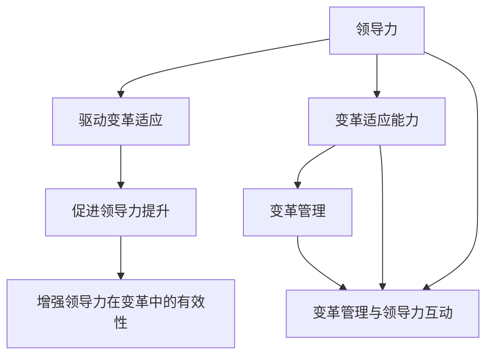

                 

## 文章标题：领导力与变革适应：在变化中成长

### 关键词：领导力、变革管理、适应策略、自我领导力、变革领导力

> 摘要：本文旨在探讨在快速变化的环境中，领导力和变革适应的重要性。我们将通过详细分析领导力与变革适应的核心概念、理论框架和实践方法，帮助读者在变化中成长为卓越的领导者。

---

## 设计思路

在设计《领导力与变革适应：在变化中成长》的目录大纲时，我们将遵循以下思路：

1. **明确主题与目标**：首先，我们需要明确书籍的主题是领导力和变革适应，目标读者是希望提升领导能力和适应变化的企业管理者或领导者。

2. **结构化内容**：将内容划分为几个主要部分，如领导力基础、变革管理、适应策略等。

3. **逻辑性**：确保各章节之间的逻辑性，从基础理论到实践应用，逐步深入。

4. **细化章节**：对于每个部分，进一步细化章节内容，确保每个章节都有明确的学习目标和知识点。

5. **实用性**：提供实际案例、工具和方法，帮助读者将理论应用到实际工作中。

6. **图表与公式**：适当使用图表、流程图、数学公式等，以便更直观地传达复杂概念。

7. **总结与反思**：在每个章节结束时，提供总结和反思部分，帮助读者巩固所学。

## 目录大纲设计

以下是《领导力与变革适应：在变化中成长》的目录大纲设计：

### 第一部分：领导力基础
- **第1章：领导力概述**
  - 1.1 领导力的定义与重要性
  - 1.2 领导力的发展历史与趋势
  - 1.3 领导力模型与理论

- **第2章：自我领导力**
  - 2.1 自我认知与自我管理
  - 2.2 自我领导力的培养与实践
  - 2.3 自我领导力与组织效能

### 第二部分：变革管理
- **第3章：变革管理概述**
  - 3.1 变革的类型与动力
  - 3.2 变革管理的过程与策略
  - 3.3 变革中的阻力与应对

- **第4章：变革领导力**
  - 4.1 变革领导者的角色与责任
  - 4.2 变革领导力的培养与实践
  - 4.3 变革领导力与团队协作

### 第三部分：适应策略
- **第5章：环境分析**
  - 5.1 外部环境分析
  - 5.2 内部环境分析
  - 5.3 环境分析工具与方法

- **第6章：战略规划**
  - 6.1 战略规划的重要性
  - 6.2 战略规划的过程与方法
  - 6.3 战略规划中的风险与应对

### 第四部分：实践应用
- **第7章：案例研究**
  - 7.1 成功变革案例
  - 7.2 失败变革案例
  - 7.3 案例分析与启示

- **第8章：领导力与变革适应工具箱**
  - 8.1 领导力评估工具
  - 8.2 变革管理工具
  - 8.3 适应策略工具

### 第五部分：结论与反思
- **第9章：领导力与变革适应的未来**
  - 9.1 变革适应的挑战与机遇
  - 9.2 领导力的发展方向
  - 9.3 结论与展望

## 注意事项
- **图表与公式**：在每个章节中，将适当使用图表、流程图、数学公式等，以增强理解。
- **伪代码与案例**：在算法讲解和实践应用章节，将提供伪代码示例和详细案例说明。

这样，我们就完成了《领导力与变革适应：在变化中成长》的目录大纲设计，确保了内容的完整性、逻辑性和实用性。接下来，我们将细化每个章节的内容，确保达到2000字以内的目录大纲总字数限制。

---

**作者：AI天才研究院/AI Genius Institute & 禅与计算机程序设计艺术 /Zen And The Art of Computer Programming**

---

### 背景介绍

在当今全球化、信息技术快速发展的时代，企业所面临的环境变得更加复杂和不确定。市场需求的快速变化、技术的日新月异以及全球化带来的竞争压力，使得企业不得不不断进行变革以保持竞争力。而在这个过程中，领导力与变革适应变得尤为重要。

领导力不仅是企业成功的关键因素，更是推动变革、引领团队走向成功的核心力量。有效的领导力能够激发员工的潜能，提高团队的合作效率，使得企业在变革过程中保持稳定和持续的发展。变革适应则是企业在面对外部环境变化时，能够迅速调整和适应的能力。这种能力决定了企业能否在激烈的市场竞争中立于不败之地。

本文旨在探讨领导力和变革适应的重要性，通过详细分析领导力与变革适应的核心概念、理论框架和实践方法，帮助读者在变化中成长为卓越的领导者。

### 核心概念与联系

领导力与变革适应是两个紧密相连的概念，它们共同构成了企业在变化环境中生存与发展的基石。

**领导力**指的是引导和影响他人实现共同目标的能力。领导力不仅包括技术和管理技能，还涉及到情感智慧、沟通能力和个人魅力等方面。在变革过程中，领导力发挥着至关重要的作用，因为领导者需要激励团队成员接受变革、克服变革过程中的阻力，并确保变革目标的实现。

**变革适应**则是指企业或个人在面对外部环境变化时，能够迅速调整自己的策略和行为，以适应新的环境和要求。变革适应能力包括对环境变化的敏感度、快速反应能力和灵活性。在快速变化的环境中，变革适应能力是企业生存和发展的关键。

**关系架构**：

1. **领导力驱动变革适应**：有效的领导力能够激发员工的变革意识，推动企业适应外部环境的变化。领导者通过树立榜样、沟通愿景、提供支持和资源，帮助团队成员克服变革中的困难和阻力。

2. **变革适应促进领导力提升**：在变革过程中，领导者需要不断调整自己的领导风格和策略，以适应新的环境。这种实践有助于领导者提升自己的领导能力，增强领导力在变革适应中的有效性。

3. **变革管理与领导力的互动**：变革管理是领导力的一部分，它涉及到变革的规划、执行和监控。有效的领导力能够确保变革管理的顺利进行，而成功的变革管理又能反过来增强领导力。

为了更直观地理解领导力与变革适应的关系架构，我们可以使用Mermaid流程图进行展示：

在这个流程图中，领导力通过驱动变革适应，促进了变革管理中的互动，同时变革适应能力也反过来增强了领导力。这个关系架构表明了领导力与变革适应之间相互促进、共同发展的紧密联系。

### 领导力概述

领导力是指引导和影响他人实现共同目标的能力。其定义可以追溯到古希腊哲学家亚里士多德，他在《政治学》中提到：“领导力是一种能够引导人从当前状态过渡到更高状态的共同愿景。”这个定义强调了领导力不仅仅是技术或管理能力，还包括情感智慧、沟通能力和个人魅力等方面。

在企业发展中，领导力的重要性不言而喻。有效的领导力能够激发员工的潜能，提高团队的合作效率，从而推动企业实现更高的目标。以下从几个方面阐述领导力在企业发展中的关键作用：

1. **战略制定与执行**：领导者在企业战略制定中发挥着关键作用。他们需要具备远见，能够预见市场变化和趋势，制定出符合企业长远发展目标的战略。同时，领导者还需要确保战略的有效执行，将战略目标转化为具体的行动计划和实际成果。

2. **团队协作与士气提升**：领导力能够促进团队协作，提高员工的积极性和士气。领导者通过有效的沟通和激励，帮助团队成员明确目标、建立信任，从而增强团队凝聚力和执行力。这有助于企业实现高效的工作流程和优质的工作产出。

3. **变革推动与创新**：在快速变化的市场环境中，企业需要不断进行变革以保持竞争力。领导者在推动变革和创新中扮演着重要角色。他们需要具备变革意识，能够带领团队迎接挑战、克服变革中的困难，推动企业实现持续的创新和发展。

4. **企业文化塑造**：领导力对企业文化的塑造具有重要影响。领导者通过自身的言行和价值观，塑造和传播企业的核心价值观和行为准则。这种企业文化能够增强员工的归属感和忠诚度，推动企业形成积极向上的工作氛围。

综上所述，领导力在企业发展中扮演着至关重要的角色。有效的领导力能够推动企业战略的制定与执行、促进团队协作与士气提升、推动变革和创新，以及塑造企业文化。因此，企业领导者需要不断提升自己的领导力，以应对快速变化的市场环境和挑战。

### 领导力的发展历史与趋势

领导力作为一个重要的研究领域，其发展历史可以追溯到古希腊哲学和宗教思想。亚里士多德和柏拉图等哲学家对领导力的早期探讨，奠定了领导力研究的基础。随着时间的推移，领导力理论不断发展，形成了多个重要的理论模型，包括特质理论、行为理论和情境理论。

1. **特质理论**：特质理论认为，领导者具有独特的个性特质和能力，这些特质使得他们具备领导能力。最早提出这一理论的学者是托马斯·卡兹和罗宾斯。特质理论强调领导者天生具备某些特质，如自信、决断力、领导才能等。然而，这一理论在后续的研究中受到了质疑，因为许多成功领导者并不完全符合这些特质。

2. **行为理论**：行为理论关注领导者如何行为以及这些行为如何影响团队和组织。领导行为理论由道格拉斯·麦格雷戈提出，他提出了X理论和Y理论。X理论认为，员工需要严格管理和控制，而Y理论则认为，员工具备自我激励和自我管理的能力。行为理论强调领导者通过具体的行为方式来影响团队和组织，这一理论在实践中的应用较为广泛。

3. **情境理论**：情境理论认为，领导力的效果取决于领导者的行为是否与具体情境相适应。费德勒的权变理论是情境理论的代表。该理论提出，领导者的效果取决于领导风格与情境因素（如团队结构、任务明确性、领导者-成员关系等）的匹配程度。情境理论强调，没有一种固定的领导风格适用于所有情况，领导者需要根据不同情境灵活调整自己的领导方式。

近年来，领导力理论进一步发展，呈现出以下几个趋势：

1. **领导力双环模型**：领导力双环模型由科特和赫斯克特提出，强调领导者需要在日常运营和变革领导之间保持平衡。双环领导力模型认为，领导者需要同时关注短期运营和长期战略，确保企业能够在快速变化的环境中保持竞争力。

2. **领导力发展理论**：领导力发展理论关注领导者的成长过程。该理论认为，领导者需要通过不断的学习和实践，不断提升自己的能力。领导力发展理论强调，领导力是一种可以通过教育和培训进行培养的能力。

3. **情感智慧领导力**：情感智慧领导力理论强调领导者的情感智慧在领导过程中的作用。情感智慧包括自我情感认知、他人情感认知、情感管理和情感领导等方面。这一理论认为，领导者通过提高情感智慧，能够更好地激励和影响团队成员。

4. **多元领导力**：多元领导力理论关注领导者背景、性别、文化和经验的多样性。该理论认为，多元化的领导力能够促进创新和团队协作，提高组织的适应能力。多元领导力强调领导者需要具备包容性和开放性，以适应不同背景和文化的团队成员。

总之，领导力理论的发展历程反映了不同时代对企业领导者的期望和需求。随着全球化、信息技术和复杂商业环境的不断发展，领导力理论也在不断演变和更新。领导者需要不断学习和适应新的理论，以应对不断变化的市场和环境挑战。

### 领导力模型与理论

在领导力研究领域，有许多重要的模型和理论，它们提供了不同的视角和方法来理解和实践领导力。以下是几个主要的领导力模型和理论的介绍：

1. **特质理论**：特质理论是最早的领导力理论之一，它认为领导者具备一系列特定的特质或性格特点，如自信、决断力、沟通能力等。这种理论认为，领导者是天生的，而不是后天培养的。然而，特质理论在后续的研究中受到了质疑，因为许多成功领导者并不完全符合这些特质。

2. **行为理论**：行为理论关注领导者的具体行为如何影响团队和组织。这种理论认为，领导者通过不同的行为方式，如指导、支持、参与等，来激励和影响团队成员。行为理论试图通过分析领导者的行为模式，找到有效的领导方式。代表性理论包括俄亥俄州立大学的领导行为连续统一体理论和密歇根大学的领导行为四分图理论。

3. **情境理论**：情境理论认为，领导力效果取决于领导者的行为与具体情境的匹配程度。费德勒的权变理论是情境理论的代表，该理论提出，领导者的有效性取决于领导风格与情境因素（如团队结构、任务明确性、领导者-成员关系等）的适配性。此外，赫塞和布兰查德的情境领导模型也强调了领导者根据下属成熟度调整领导风格的重要性。

4. **领导力双环模型**：领导力双环模型由约翰·科特和理查德·赫斯克特提出，它强调了领导者需要同时关注日常运营和长期战略。双环领导力模型认为，领导者需要在维持当前运营的同时，不断推动变革和创新，以应对快速变化的环境。

5. **变革型领导力**：变革型领导力理论强调领导者通过激发和提升下属的潜力，实现组织变革。这种领导力方式通常涉及激励下属、提供愿景、挑战现状和推动创新。领导者的目标是培养高水平的团队成员，使他们能够自主思考和解决问题。代表性理论包括伯恩斯和哈斯的本我变革型领导力模型。

6. **领导力发展理论**：领导力发展理论关注领导者的成长过程。这种理论认为，领导力是一种可以通过教育和培训进行培养的能力。领导力发展理论强调，领导者需要通过不断的自我反思、学习和实践，不断提升自己的领导能力。

7. **服务型领导力**：服务型领导力理论认为，领导者通过服务团队成员，满足他们的需求，来实现组织和团队的目标。这种领导力方式强调领导者的无私和服务精神，关注团队成员的成长和福祉。代表性理论包括赫斯克特和福斯的领导力服务模型。

每个领导力模型和理论都有其独特的视角和应用场景，领导者可以根据具体情况选择和运用不同的理论，以实现组织的目标和愿景。

### 自我领导力

自我领导力是指个体在缺乏外部指导和监督的情况下，自主管理自己行为和目标的能力。在当今快速变化和高度复杂的环境中，自我领导力成为企业成功和职业发展的关键因素。以下从几个方面探讨自我领导力的培养和实践方法：

1. **自我认知与自我管理**：

   自我领导力的基础是自我认知。个体需要深入了解自己的性格特点、价值观、兴趣和能力，从而更好地定位自己的发展方向。自我管理则是在自我认知的基础上，通过设定目标、制定计划、自我激励和自我调整，实现个人目标。

2. **自我领导力的培养与实践**：

   - **自我反思**：定期进行自我反思，回顾自己的行为和决策，分析成功和失败的原因，从而不断改进和提升自己的能力。
   - **设定目标**：设定清晰、具体和可实现的目标，并将它们分解为可操作的任务，逐步实现。
   - **时间管理**：合理安排时间，优先处理重要和紧急的任务，避免拖延和分心。
   - **持续学习**：保持好奇心和求知欲，不断学习新知识和技能，以适应快速变化的环境。
   - **自我激励**：通过设定奖励机制和自我肯定，保持积极的心态和动力。

3. **自我领导力与组织效能**：

   自我领导力不仅对个人职业发展有重要影响，也对组织效能有显著作用。自我领导力强的员工通常表现出更高的工作自主性、责任感和创新能力，从而提升组织的整体绩效。此外，自我领导力还能促进团队合作和沟通，增强组织的凝聚力和适应性。

4. **实际案例**：

   例如，某科技公司的一名软件工程师，通过自我领导力的实践，不断提升自己的编程技能和项目管理能力。他定期进行技术学习和项目复盘，设立短期和长期目标，并通过自我激励和反思，逐渐成长为团队的领导者和项目的关键人物。这不仅提高了他的职业发展，也为公司创造了更大的价值。

总之，自我领导力是个人和企业在快速变化环境中取得成功的重要能力。通过培养自我认知和自我管理能力，以及实践一系列自我领导力方法，个体和组织都能在复杂环境中保持竞争力，实现长期发展。

### 变革管理的概述

变革管理是企业适应外部环境变化、实现可持续发展的重要过程。本文将探讨变革的类型、动力以及变革管理的过程与策略。

#### 变革的类型

1. **渐进性变革**：渐进性变革是指通过逐步调整和改进，使企业逐步适应环境变化的过程。这种变革通常涉及较小的调整和改进，能够在不引起过大混乱的情况下实现。例如，通过引入新的工作流程、工具或方法，逐步提高效率和生产力。

2. **革命性变革**：革命性变革是指对企业和组织进行根本性的改变，通常涉及企业结构、文化、战略等方面的重大调整。这种变革通常需要较大的资源和时间投入，可能会引起组织内部的动荡和挑战。例如，企业转型为数字化企业、改变商业模式或进行兼并和重组。

3. **结构性变革**：结构性变革主要涉及企业组织结构、人员配置和管理流程的调整。这种变革旨在优化组织效率、提升管理水平和增强企业的竞争力。例如，通过重新定义部门职责、调整汇报关系或优化人力资源管理。

4. **文化变革**：文化变革是指改变企业的价值观、行为规范和工作氛围，以适应新的环境要求。这种变革通常需要较长时间的积累和培养，但一旦成功，将为企业带来持久的竞争优势。例如，通过引入新的企业文化理念、建立共同的价值观或推动员工之间的沟通与协作。

#### 变革的动力

1. **外部压力**：外部环境的变化，如市场竞争、技术革新、政策法规等，是推动企业变革的主要动力。企业必须及时适应这些外部变化，以保持竞争力和生存能力。

2. **内部需求**：企业内部的业务需求、管理问题或发展瓶颈也是推动变革的重要原因。例如，企业的运营效率低下、产品质量不稳定或创新能力不足，都需要通过变革来解决。

3. **领导者的愿景和决心**：企业领导者的愿景和决心在变革过程中起着关键作用。领导者需要具有前瞻性和决心，能够引导和推动变革，确保变革目标的实现。

4. **员工意识和参与**：员工的意识和参与度是变革成功的重要因素。企业需要通过有效的沟通和激励，使员工理解变革的重要性和必要性，积极参与变革过程，从而确保变革的顺利实施。

#### 变革管理的过程与策略

1. **规划阶段**：

   - **需求分析**：明确变革的必要性和目标，分析变革的影响范围和潜在风险。
   - **制定方案**：制定具体的变革方案，包括变革的目标、步骤、时间表和资源需求。
   - **获取支持**：与关键利益相关者进行沟通，获取他们对变革的支持和参与。

2. **执行阶段**：

   - **实施计划**：按照变革方案，逐步实施变革措施，确保变革的顺利推进。
   - **沟通与反馈**：建立有效的沟通机制，及时反馈变革过程中的问题和进展，确保信息畅通。
   - **调整与优化**：根据反馈和实际情况，对变革计划进行调整和优化，确保变革目标的实现。

3. **监控与评估阶段**：

   - **监控进度**：对变革的进度和效果进行监控，确保变革按计划进行。
   - **评估效果**：对变革的成果进行评估，分析变革对组织、员工和企业绩效的影响。
   - **总结与反思**：总结变革过程中的经验教训，为未来的变革提供参考。

4. **维持与巩固阶段**：

   - **巩固成果**：确保变革成果的巩固和持续，防止变革的逆转或退化。
   - **持续改进**：根据环境变化和业务需求，持续改进和完善变革措施，确保企业的长期竞争力。

通过科学的变革管理过程和有效的策略，企业能够更好地适应外部环境变化，实现可持续发展。

### 变革领导力

变革领导力是领导者在推动企业变革过程中所表现出来的特殊能力和素质。有效的变革领导力能够激发员工的变革意识，减少变革过程中的阻力，确保变革目标的顺利实现。以下是变革领导力的几个关键方面：

1. **角色与责任**：

   - **变革推动者**：领导者需要积极推动变革，明确变革的目标和愿景，向团队传达变革的必要性和重要性。
   - **变革策划者**：领导者需要制定详细的变革计划，包括变革的目标、步骤、时间表和资源配置等。
   - **变革协调者**：领导者需要协调内外部资源，确保变革的顺利推进。这包括与关键利益相关者进行沟通、获取支持和解决变革过程中的问题。
   - **变革监督者**：领导者需要监督变革的进度和效果，确保变革按计划进行。同时，领导者还需要对变革的成果进行评估，为未来的变革提供参考。

2. **培养与实践**：

   - **自我提升**：领导者需要不断学习和提升自己的变革管理能力，了解最新的变革理论和实践方法。这可以通过参加培训课程、阅读相关书籍和与同行交流来实现。
   - **团队建设**：领导者需要培养一支能够适应变革、具备变革意识的团队。这可以通过建立共同的目标和价值观、提高团队的协作能力来实现。
   - **示范作用**：领导者需要通过自身的言行树立榜样，展示变革的信心和决心。这有助于增强员工的变革意识和参与度。
   - **激励与支持**：领导者需要通过激励和提供支持，帮助员工克服变革中的困难和挑战。这可以通过奖励机制、培训机会和心理支持来实现。

3. **变革领导力与团队协作**：

   - **沟通与信任**：领导者需要建立有效的沟通机制，确保团队成员之间信息畅通、相互理解。同时，领导者还需要建立信任，使团队成员愿意支持和参与变革。
   - **共同愿景**：领导者需要与团队成员共同制定和传达变革的愿景，使团队成员明确变革的目标和意义，从而增强他们的参与感和责任感。
   - **协作机制**：领导者需要建立协作机制，确保团队成员在变革过程中能够协同工作，共同应对挑战。

总之，变革领导力是推动企业变革成功的关键因素。通过积极履行变革领导者的角色与责任，不断培养和实践变革领导力，领导者能够有效激发员工的变革意识，减少变革中的阻力，确保变革目标的顺利实现。

### 环境分析

在变革管理中，环境分析是关键的一步。通过全面分析外部环境和内部环境，企业能够更好地了解自身所处的位置，识别潜在的机会和威胁，从而制定出更有效的战略规划。以下是外部环境和内部环境分析的方法与步骤：

#### 外部环境分析

1. **PEST分析**：
   - **政治（Political）因素**：政治环境的变化可能对企业产生重大影响，如政策法规的调整、政府支持力度等。
   - **经济（Economic）因素**：经济环境的波动会影响市场需求、企业成本和投资回报率。
   - **社会（Social）因素**：社会趋势和文化变化会影响消费者行为、劳动力市场和企业文化。
   - **技术（Technological）因素**：技术进步和创新的快慢会直接影响企业的产品开发、生产效率和竞争力。

2. **SWOT分析**：
   - **优势（Strengths）**：企业内部的优势资源、核心竞争力、市场地位等。
   - **劣势（Weaknesses）**：企业内部存在的缺陷、不足、瓶颈等。
   - **机会（Opportunities）**：外部环境中可能出现的市场机遇、政策支持、技术进步等。
   - **威胁（Threats）**：外部环境中可能出现的竞争加剧、市场需求下降、法规限制等。

3. **五力模型**：
   - **供应商力量**：供应商的议价能力、供应链稳定性等。
   - **买方力量**：消费者的议价能力、需求变化等。
   - **替代品威胁**：市场上是否存在可替代的产品或服务。
   - **新进入者的威胁**：潜在竞争者进入市场的可能性。
   - **行业内的竞争**：现有竞争对手的实力和策略。

#### 内部环境分析

1. **组织结构**：
   - 分析企业的组织架构、权责分配、沟通机制等，了解组织内部的关系和运作效率。

2. **人力资源**：
   - 考察员工的素质、技能、团队合作能力和领导力，识别关键人才和培训需求。

3. **财务状况**：
   - 评估企业的财务健康、资金流动、成本控制能力和投资回报率。

4. **企业文化**：
   - 分析企业的核心价值观、行为准则和工作氛围，了解文化对变革的影响。

#### 工具与方法

1. **访谈与调研**：
   - 通过访谈、问卷调查、焦点小组等方法，收集内外部环境的相关数据和信息。

2. **数据分析**：
   - 使用统计软件对收集的数据进行分析，提取有用的信息和洞察。

3. **流程图与鱼骨图**：
   - 通过绘制流程图和鱼骨图，分析问题发生的根本原因和影响路径。

4. **标杆分析**：
   - 对比行业内的优秀企业和竞争对手，了解自身的优势和不足，借鉴成功经验。

通过全面的外部环境和内部环境分析，企业能够更清晰地了解自身所处的位置，识别潜在的机会和威胁，从而制定出更科学、有效的战略规划。环境分析不仅有助于企业在变革中做出正确的决策，还能为企业的长期发展提供重要的指导。

### 战略规划

战略规划是企业实现长期目标和保持竞争优势的关键过程。它涉及对内外部环境的分析、目标的设定、战略的选择和执行计划的制定。以下是战略规划的重要性和具体步骤。

#### 重要性

战略规划能够帮助企业在复杂和动态的商业环境中保持清晰的方向和目标。以下是战略规划的关键作用：

1. **明确方向**：战略规划为企业提供了明确的发展方向和目标，使企业在日常运营中保持一致性和连贯性。
2. **优化资源配置**：通过战略规划，企业能够更有效地分配资源，确保资源投入到最有价值的地方，从而提高运营效率。
3. **提升竞争力**：战略规划有助于企业识别和利用外部机会，同时应对潜在威胁，从而在激烈的市场竞争中保持领先地位。
4. **促进创新**：战略规划鼓励企业不断探索和创新，以适应快速变化的市场环境。
5. **增强员工凝聚力**：明确的战略规划能够激发员工的积极性和归属感，提高团队的协作和执行力。

#### 具体步骤

1. **环境分析**：
   - **外部环境分析**：使用PEST、五力模型等工具，分析政治、经济、社会和技术等外部因素，识别市场趋势和潜在机会。
   - **内部环境分析**：评估企业的资源、能力、文化和战略优势，了解企业的内部情况。

2. **设定目标**：
   - **长期目标**：根据企业的愿景和使命，设定具有挑战性的长期目标。
   - **短期目标**：将长期目标分解为具体的短期目标，确保目标的可实现性和时间性。

3. **战略选择**：
   - **竞争战略**：选择适合企业发展的竞争战略，如成本领先、差异化或集中战略。
   - **业务组合战略**：根据企业的业务组合，制定相应的战略，以最大化整体价值。

4. **执行计划**：
   - **任务分解**：将战略目标分解为具体的任务和项目，明确责任人和时间表。
   - **资源配置**：根据任务需求，合理分配资源和预算，确保计划的实施。
   - **执行监控**：建立监控机制，定期评估计划执行情况，及时调整和优化。

5. **评估与反馈**：
   - **成果评估**：对战略实施的效果进行评估，分析目标的达成情况和资源配置的效率。
   - **反馈与调整**：根据评估结果，及时调整战略和执行计划，确保企业持续发展。

通过科学的战略规划，企业能够在快速变化的市场环境中保持竞争优势，实现长期目标。

### 战略规划中的风险与应对

在战略规划过程中，企业可能会面临多种风险，这些风险可能对战略实施产生负面影响，甚至导致整个计划失败。以下是战略规划中常见的一些风险及其应对策略：

1. **外部风险**：
   - **市场变化**：市场需求、竞争态势和政策法规的变化可能导致企业战略的不适用。
   - **技术变革**：新技术的出现可能会颠覆现有的市场格局，使企业的战略失去竞争力。
   - **经济波动**：全球经济环境的不稳定性可能影响企业的资金链和投资回报。

2. **内部风险**：
   - **资源不足**：企业可能因资金、人力或技术资源不足，导致战略实施受阻。
   - **管理问题**：管理层的能力不足或管理不当可能导致战略执行不力。
   - **企业文化**：企业文化与战略目标不匹配，可能导致员工缺乏执行力和创新精神。

3. **应对策略**：

   - **市场调研**：定期进行市场调研，了解市场动态和消费者需求，确保战略与市场环境相适应。
   - **技术创新**：加大对技术研发的投入，保持技术领先优势，以应对技术变革带来的挑战。
   - **多元化战略**：通过多元化产品和服务，降低市场波动对企业的影响。
   - **资源整合**：优化资源配置，确保关键资源能够得到充分利用。
   - **人才培养**：通过培训和发展计划，提升管理层的领导力和执行力。
   - **文化建设**：强化企业文化，确保员工认同并支持企业的战略目标。

通过识别和应对这些风险，企业能够提高战略规划的成功率，实现长期可持续发展。

### 案例研究

为了更好地理解领导力和变革适应在实际应用中的效果，以下将探讨几个成功的变革案例。

#### 案例一：苹果公司的变革

**背景**：2001年，苹果公司面临着激烈的竞争和产品创新停滞的问题。史蒂夫·乔布斯回归苹果后，他采取了一系列大胆的变革措施。

**领导力**：乔布斯以其远见和决断力，重新定义了苹果的品牌和产品线。他通过强大的个人魅力和愿景，激发了员工的创新热情和团队协作精神。

**变革适应**：乔布斯引入了新的设计理念，推出了iPod、iPhone和iPad等革命性产品，彻底改变了市场格局。他还通过开放生态系统，鼓励第三方开发者参与，增强了苹果产品的竞争力。

**结果**：苹果公司在乔布斯的领导下，重新确立了市场领导地位，市值大幅提升，成为全球最具价值的科技公司之一。

#### 案例二：丰田汽车的精益生产

**背景**：20世纪80年代，丰田汽车面临着生产效率低下和产品质量不稳定的问题。

**领导力**：丰田公司推行了精益生产方式，强调持续改进和全员参与。领导层通过以身作则，推动了这一变革的执行。

**变革适应**：丰田引入了JIT（即时生产）系统，通过精确的生产计划和供应链管理，减少了库存和浪费。同时，丰田还建立了全面的质量管理体系，确保产品的高质量。

**结果**：丰田汽车的生产效率和产品质量显著提升，成为全球汽车行业的标杆。精益生产方式的成功推广，使得丰田在全球市场上取得了巨大成功。

#### 案例三：华为公司的全球化战略

**背景**：华为公司自成立以来，一直致力于成为全球领先的通信设备供应商。随着国际市场的竞争加剧，华为需要不断进行战略调整。

**领导力**：华为的创始人任正非通过明确的公司愿景和战略目标，领导华为在全球范围内扩张。他强调创新和持续学习，使华为能够迅速适应不同市场的需求。

**变革适应**：华为通过设立全球研发中心，吸引全球顶尖人才，推动了技术创新。同时，华为制定了本地化的市场策略，满足了不同地区客户的需求。

**结果**：华为在全球通信设备市场中占据了重要地位，业务范围涵盖了全球170多个国家和地区。华为的全球化战略使其在激烈的国际竞争中保持了领先优势。

这些案例表明，成功的变革需要卓越的领导力和有效的变革适应策略。通过这些案例的分析，我们可以看到，领导者如何在复杂和动态的环境中，带领企业实现变革，并取得长足的发展。

### 领导力与变革适应工具箱

在领导力和变革适应的过程中，有效的工具和方法能够极大地提高变革的成功率。以下介绍几种常用的工具和方法，以帮助领导者更好地应对变革挑战。

#### 领导力评估工具

1. **360度反馈**：360度反馈是一种多角度评估工具，通过收集来自上级、同事、下属和客户的反馈，全面评估领导者的能力和发展需求。这种工具有助于领导者了解自己在领导力方面的优势和不足，为后续的培训和改进提供依据。

2. **领导力发展中心**：领导力发展中心是一种模拟真实工作环境的培训方式，通过角色扮演、案例分析等互动活动，提升领导者的决策能力、沟通能力和团队管理能力。

3. **心理测评工具**：如MBTI（迈尔斯-布里格斯性格类型指标）和DISC测评，通过分析领导者的性格特点和行为模式，帮助领导者更好地理解自己和他人，提高领导效果。

#### 变革管理工具

1. **变革模型**：如库布勒-罗斯变革曲线、费德勒权变理论等，这些模型提供了变革过程中不同阶段的策略和方法，帮助领导者应对变革中的挑战。

2. **沟通计划**：制定详细的沟通计划，确保变革信息在不同层级和部门之间有效传递，减少误解和恐慌。沟通计划应包括沟通频率、沟通方式、沟通内容和沟通对象等。

3. **变革地图**：通过绘制变革地图，明确变革的目标、步骤、时间表和责任人，为变革的实施提供清晰的方向和指导。

#### 适应策略工具

1. **环境扫描**：定期进行环境扫描，分析外部市场、技术和政策变化，以及内部资源、能力和文化状况，为战略规划和决策提供数据支持。

2. **战略规划工具**：如SWOT分析、五力模型、波士顿矩阵等，这些工具有助于领导者分析企业的优势、劣势、机会和威胁，制定科学合理的战略规划。

3. **创新管理工具**：如头脑风暴、设计思维等，这些工具激发创新思维，推动企业持续创新，保持竞争优势。

通过这些工具和方法，领导者能够更有效地应对变革挑战，提升领导力和变革适应能力，从而推动企业实现长期发展。

### 领导力与变革适应的未来

在未来的发展中，领导力和变革适应将继续扮演关键角色。随着全球化和信息技术的不断进步，企业面临的环境变得更加复杂和动态。以下是未来领导力和变革适应的几个关键趋势：

1. **领导力的演变**：

   - **情感智慧领导力**：情感智慧将成为未来领导力的重要组成部分。领导者需要具备更高的情感智慧，以更好地理解和激励团队成员，促进团队合作和创新。
   - **多元领导力**：随着全球化进程的加速，领导者需要具备多元文化背景和跨文化沟通能力。多元领导力将有助于企业更好地适应不同市场的需求，提高全球竞争力。
   - **数字领导力**：数字技术的迅猛发展要求领导者具备数字化思维和技能。领导者需要了解和掌握新技术，以推动企业的数字化转型，实现业务创新和效率提升。

2. **变革适应的挑战与机遇**：

   - **技术变革**：技术的快速进步将带来巨大的变革机遇。企业需要积极拥抱新技术，如人工智能、大数据、区块链等，以保持竞争力。同时，技术变革也带来了一定的挑战，领导者需要具备应对技术不确定性的能力。
   - **市场动态**：全球市场的快速变化要求企业具备高度的敏捷性和灵活性。领导者需要具备快速响应市场变化的能力，及时调整战略和运营模式。
   - **社会责任**：企业社会责任（CSR）日益受到重视。未来领导者需要更加关注企业的社会责任，推动可持续发展，提高企业的社会影响力。

3. **未来展望**：

   - **持续学习**：未来，持续学习将成为领导力和变革适应的核心要素。领导者需要不断学习新知识、新技能，以适应快速变化的环境。
   - **生态系统合作**：企业将更多地依赖于生态系统合作，通过开放合作、共享资源，实现协同创新和共同成长。
   - **个性化领导**：个性化领导将成为未来领导力的一个趋势。领导者需要根据团队成员的特点和需求，采取个性化的领导方式，激发员工的潜能和创造力。

总之，未来领导力和变革适应将继续演变和发展，领导者需要不断提升自己的能力，积极应对挑战，抓住机遇，推动企业实现持续创新和长期发展。

### 结论与展望

本文通过详细分析领导力和变革适应的核心概念、理论框架和实践方法，探讨了这两个关键因素在快速变化环境中的重要性。领导力不仅是推动企业发展的核心力量，也是变革过程中的关键驱动力。变革适应则是企业应对外部环境变化的必要能力，决定了企业能否在竞争中立于不败之地。

未来的领导力和变革适应将更加注重情感智慧、多元文化背景和数字化能力。领导者需要不断学习和适应新环境，以应对技术变革、市场动态和社会责任等挑战。同时，持续学习和生态系统合作将成为未来领导力和变革适应的重要趋势。

我们呼吁读者在阅读本文后，积极思考和反思自己的领导力和变革适应能力。通过实践和应用本文提到的理论和方法，不断提升自己的领导力，提高变革适应能力，为企业的发展和个人的职业成长贡献力量。

**作者：AI天才研究院/AI Genius Institute & 禅与计算机程序设计艺术 /Zen And The Art of Computer Programming**

