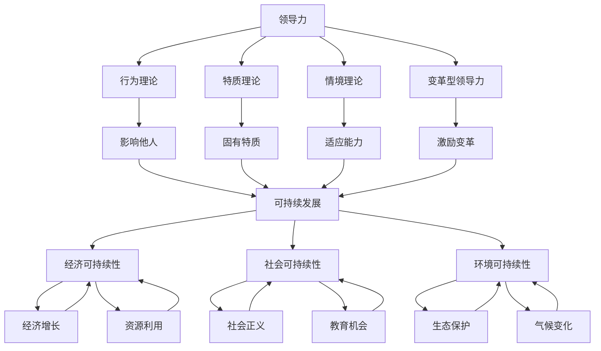

                 

### 引言

在当今快速变化和高度互联的世界，领导力与可持续发展已成为企业和组织能否持续成功的关键因素。随着全球环境的恶化和社会问题的加剧，企业不再仅仅关注短期的经济利益，而是越来越意识到平衡利润与社会责任的重要性。本篇文章旨在探讨领导力与可持续发展之间的联系，并通过理论框架、实际案例和策略分析，帮助读者理解如何在追求利润的同时，有效平衡社会责任和可持续发展。

**文章标题：领导力与可持续发展：平衡利润与社会责任**

**关键词：领导力、可持续发展、社会责任、利润平衡、策略分析**

**摘要：**

本文首先介绍了领导力的核心概念和理论，以及可持续发展的定义与重要性。接着，我们探讨了领导力与可持续发展之间的联系，并构建了平衡利润与社会责任的理论框架。通过实际案例与策略分析，文章展示了如何将领导力与可持续发展理念应用于实践，并提供了一些最佳实践和注意事项。文章最后对未来发展趋势进行了展望，以期为读者提供全面而深刻的理解。

接下来，我们将逐步深入探讨领导力与可持续发展的各个方面，帮助读者构建系统的认知框架，并掌握有效的策略和工具。

### 背景介绍

领导力和可持续发展是两个看似独立，但又紧密相关的领域。首先，我们需要理解这两个概念的基本含义。

**领导力**通常被定义为影响和激励他人一起实现共同目标的能力。它不仅包括权威和职位，更重要的是影响力、沟通能力、决策能力和愿景。领导力理论涵盖了多种不同的观点，包括行为理论、特质理论、情境理论等。每种理论都试图解释领导力的本质和如何有效运用领导力。

**可持续发展**则是指在满足当前需求的同时，不损害后代满足其自身需求的能力。它涉及经济、社会和环境的三个方面，也被称为“三柱模型”。经济可持续性关注长期的经济增长和资源的有效利用；社会可持续性涉及公平、包容性和社区福祉；环境可持续性则关注生态系统的保护和资源的可持续管理。

为什么领导力与可持续发展如此重要？首先，领导力在组织中的角色至关重要。有效的领导力能够推动组织创新、提高员工满意度、增强组织竞争力。而领导力与可持续发展相结合，可以帮助企业更好地应对全球挑战，如气候变化、资源枯竭、社会不公等。这不仅有助于企业的长期成功，还能够为全社会带来积极的影响。

其次，可持续发展已经成为全球关注的热点问题。联合国《2030年可持续发展目标》（Sustainable Development Goals, SDGs）明确提出了17个目标，涵盖了从消除贫困到应对气候变化，再到保障健康和促进可持续城市和社区建设等各个方面。企业作为社会的重要成员，有责任参与并推动这些目标的实现。

然而，领导力与可持续发展之间的平衡并非易事。企业在追求利润的同时，必须考虑社会责任和环境影响。这不仅需要领导者的远见卓识和战略眼光，还需要组织文化的支持和管理体系的完善。在这个过程中，领导者需要具备变革思维、创新能力和跨文化沟通能力，以应对复杂多变的环境。

总之，领导力与可持续发展之间的结合，不仅有助于企业实现长期成功，还能够为全球可持续发展做出积极贡献。本文将围绕这一主题，逐步探讨领导力的核心概念、可持续发展的定义与重要性，以及如何平衡利润与社会责任。

### 核心概念与联系

为了更好地理解领导力与可持续发展之间的联系，我们需要详细阐述这两个核心概念，并构建它们之间的逻辑关系。

**领导力的核心概念：**

领导力是一个多维度的概念，涵盖了多个理论视角。以下是几种主要的领导力理论：

1. **行为理论**：这种理论认为领导力可以通过行为模式来定义。领导者通过其行为来影响他人，这些行为可能包括激励员工、解决问题、提供指导和支持等。行为理论强调了领导者行为的可观察性和可测量性。

2. **特质理论**：特质理论认为领导者具有一些固有的特质，如自信、决断力、责任感等。这些特质使得某些人更有可能成为领导者。特质理论有助于我们识别和培养潜在领导者。

3. **情境理论**：情境理论认为领导力不是静态的，而是需要根据不同的情境和环境进行调整。领导者需要具备适应能力和灵活性，以应对不同的挑战和情况。

4. **变革型领导力**：变革型领导力强调领导者通过激励和启发他人来实现变革。这种领导力不仅关注任务的完成，更关注员工的发展和成长。

**可持续发展的核心概念：**

可持续发展是一个综合性的概念，它包括经济、社会和环境三个方面。以下是可持续发展的几个关键原则：

1. **经济可持续性**：经济可持续性关注长期的经济增长和资源的有效利用。这包括创新、效率和市场竞争力。

2. **社会可持续性**：社会可持续性涉及公平、包容性和社区福祉。它关注社会正义、教育和就业机会，以及社区的整体健康和幸福。

3. **环境可持续性**：环境可持续性关注生态系统的保护和资源的可持续管理。这包括减少污染、保护自然资源和应对气候变化。

**领导力与可持续发展的联系：**

领导力与可持续发展之间的联系可以从多个角度进行分析：

1. **领导者的角色**：领导者作为组织的关键决策者，对组织的战略方向和资源配置具有直接影响。有效的领导者能够推动可持续发展的战略，并在组织中建立支持可持续性的文化。

2. **价值观与愿景**：领导者的价值观和愿景对组织的可持续发展至关重要。具有可持续发展意识的领导者能够激发员工的热情，并共同致力于实现长期目标。

3. **决策过程**：领导力在决策过程中发挥着关键作用。领导者需要平衡短期利益和长期目标，确保组织的决策不仅考虑经济利益，还考虑社会和环境影响。

4. **变革与管理**：领导者需要推动变革，以应对不断变化的环境和挑战。通过领导变革，领导者可以帮助组织适应可持续发展的要求。

为了更好地展示领导力与可持续发展之间的联系，我们可以使用Mermaid流程图来构建它们之间的关系架构：

这个流程图清晰地展示了领导力的不同理论和可持续发展的不同方面之间的联系。通过这个架构，我们可以看到领导力如何通过其核心概念和理论，影响和推动可持续发展。

总之，领导力与可持续发展之间的联系是一个多维度的复杂系统。领导者通过其行为、特质、适应能力和变革思维，可以在组织内推动可持续发展的战略和实践。而可持续发展则为领导者提供了一个长期的目标和框架，以实现组织的成功和社会的福祉。在接下来的部分中，我们将进一步探讨如何平衡利润与社会责任，以及实际案例中的成功策略。

### 平衡利润与社会责任的理论框架

在理解了领导力与可持续发展之间的联系之后，我们接下来需要探讨如何在实践中平衡利润与社会责任。这不仅是一个理论问题，更是一个需要实际操作和策略指导的实践问题。以下是关于平衡利润与社会责任的理论框架，以及如何将其应用于实际操作的具体方法。

**一、理论框架**

1. **利益相关者理论**：利益相关者理论认为，企业应该考虑所有与业务相关的利益相关者的需求和利益。这些利益相关者包括股东、员工、客户、供应商、社区和环境。通过平衡不同利益相关者的需求，企业可以在追求利润的同时，实现社会责任。

2. **双重底线理论**：双重底线理论（Double Bottom Line）提出，企业不仅要追求财务利润，还要关注社会和环境绩效。这种理论强调了财务和可持续性的双重成功。企业可以通过制定可持续发展的战略，同时实现经济利益和社会效益。

3. **三重底线理论**：三重底线理论（Triple Bottom Line）进一步扩展了双重底线理论，强调企业应该平衡经济、社会和环境三个方面的绩效。这种理论认为，企业的成功不仅取决于财务表现，还取决于社会影响和环境可持续性。

4. **企业社会责任（CSR）**：企业社会责任（Corporate Social Responsibility, CSR）是企业主动承担的社会责任，旨在通过积极的社会和环境影响，实现长期成功。CSR包括慈善捐赠、员工志愿服务、社区参与等。

5. **可持续财务报告**：可持续财务报告（Sustainability Reporting）是企业在财务报告之外，披露其社会和环境绩效的一种方式。这种报告可以帮助企业透明地展示其社会责任和可持续发展实践，并提高公众对其行为的信任。

**二、实际操作方法**

1. **制定可持续发展战略**：企业需要制定一个明确的可持续发展战略，明确其长期目标和关键指标。这包括确定优先事项、设定目标和制定实施计划。

2. **整合社会责任和财务管理**：企业应该将社会责任和财务管理整合到其核心业务流程中。这意味着在财务决策中考虑社会和环境因素，并在预算和管理流程中明确这些因素的重要性。

3. **建立可持续性能指标**：企业需要建立一套可持续性能指标，以衡量其经济、社会和环境绩效。这些指标可以包括碳排放、资源利用效率、员工满意度和社区参与度等。

4. **培训和激励员工**：企业应该提供培训和激励计划，以培养员工的可持续发展意识。这可以通过内部培训、员工参与项目和社会责任活动来实现。

5. **透明度和沟通**：企业需要建立透明度，并与其利益相关者进行有效沟通。这包括发布可持续财务报告、组织年度可持续发展报告会议，以及与股东、员工和社区保持持续对话。

**三、案例分析**

1. **案例一：宜家（IKEA）**：宜家是一家全球知名的家具零售商，以其环保和可持续性战略而闻名。宜家制定了明确的可持续发展目标，如使用可再生材料、减少碳排放和鼓励员工参与社区项目。通过这些措施，宜家不仅提高了品牌声誉，还实现了长期的经济利益。

2. **案例二：微软（Microsoft）**：微软是全球最大的软件公司之一，其在可持续发展方面的努力也备受关注。微软制定了“气候承诺”，旨在到2030年实现碳负排放，并到2050年实现整个价值链的碳中和。为了实现这一目标，微软投资了数十亿美元用于可再生能源项目，并推动了其产品的绿色设计。

3. **案例三：联合利华（Unilever）**：联合利华是一家跨国消费品公司，其“可持续生活计划”（Sustainable Living Plan）是其可持续发展战略的核心。该计划旨在减少对环境的影响、改善人们的生活质量和促进公平贸易。通过这些努力，联合利华不仅提高了品牌价值，还实现了显著的经济和社会效益。

总之，平衡利润与社会责任需要企业从战略层面进行规划和实施，并将其融入日常运营中。通过制定明确的可持续发展目标、建立绩效指标、培训员工和建立透明度，企业可以在追求经济利益的同时，实现社会和环境责任。在实际操作中，企业可以借鉴成功案例，制定适合自己的可持续发展策略，以实现长期成功和社会福祉。

### 实际案例与策略分析

为了更好地理解如何平衡利润与社会责任，我们将通过几个国际知名企业的实际案例来探讨成功策略与失败教训。

**案例一：谷歌（Google）**

**成功策略：**

谷歌在平衡利润与社会责任方面取得了显著成就。谷歌的“Googler循环”（Googler Loop）项目是一个典型的例子。该项目旨在鼓励员工参与社区服务和公益事业，每年提供一定的工作时间，让员工参与各种社会活动。此外，谷歌还投资了大量的资金用于环境保护和可持续发展项目，如太阳能和风能的开发。

- **策略解析**：谷歌的成功在于其将社会责任纳入企业文化，并为其员工提供了实际的机会和资源。这种文化不仅增强了员工的归属感和工作热情，还提升了品牌声誉，吸引了更多有共同价值观的员工和客户。

- **效果评估**：通过这些努力，谷歌不仅实现了显著的经济增长，还获得了社会的广泛认可，其在可持续发展领域的领导地位得到了巩固。

**失败教训：**

尽管谷歌在可持续发展方面取得了许多成就，但其也面临一些挑战和失败。例如，在数据隐私和数据安全问题上的多次争议，导致了公众对其社会责任的质疑。这表明，在追求社会责任的过程中，企业还需要关注其他潜在风险，并确保其行为符合伦理和法律标准。

**案例二：宜家（IKEA）**

**成功策略：**

宜家以其环保和可持续性战略而闻名。宜家致力于使用可再生材料，减少碳排放，并推动循环经济。宜家的“People & Planet Positive”计划是其实际行动的一部分，该计划旨在到2030年实现全面循环，减少废物和温室气体排放。

- **策略解析**：宜家的成功策略在于其将可持续发展理念融入产品设计和供应链管理中。通过创新和持续改进，宜家不仅满足了消费者的需求，还推动了行业的可持续发展。

- **效果评估**：通过这些努力，宜家不仅实现了长期的经济收益，还提升了品牌形象和消费者忠诚度。此外，宜家的可持续发展举措也为其赢得了多个奖项和认可。

**失败教训：**

尽管宜家在可持续发展方面取得了显著成就，但其也面临一些挑战。例如，在产品回收和废物管理方面，宜家的表现并不理想。这表明，企业在可持续发展过程中需要不断优化其策略和实践，以确保其承诺和行动的一致性。

**案例三：苹果（Apple）**

**成功策略：**

苹果在可持续发展方面采取了多项措施，包括提高产品能效、推动可再生能源使用和推广循环经济。苹果的“环保倡议”（Environmental Initiative）是其可持续发展战略的核心。该倡议旨在通过环保设计、绿色制造和循环利用，实现全生命周期的环保目标。

- **策略解析**：苹果的成功策略在于其将环保理念贯穿于整个产品生命周期，从设计到制造，再到回收利用。这种全面的方法确保了苹果在可持续发展方面的系统性和持续性。

- **效果评估**：通过这些努力，苹果不仅提升了产品的环境性能，还增强了品牌的社会责任形象，吸引了更多环保意识强的消费者。

**失败教训：**

苹果在可持续发展方面也面临一些挑战，例如在供应链管理和原材料采购方面。尽管苹果在环保设计方面取得了显著进步，但其供应链中仍然存在一些不透明和不符合环保标准的问题。这表明，企业在实施可持续发展策略时，需要确保供应链的透明性和合规性，以避免潜在的负面影响。

**总结**

通过这些实际案例，我们可以看到，成功平衡利润与社会责任的企业通常具备以下几个特点：

1. **明确的目标和战略**：企业需要制定明确的可持续发展目标和战略，并将其融入业务流程中。
2. **创新和持续改进**：企业应不断探索新的技术和方法，以实现可持续发展的目标。
3. **透明度和沟通**：企业需要建立透明度，并与利益相关者保持有效沟通，以提升社会对其行为的信任。
4. **系统性和全面性**：企业应在整个产品生命周期中考虑环保和社会责任，确保其策略和行动的一致性。

同时，我们也看到了一些失败教训，提醒企业在追求社会责任时需要关注潜在的挑战和风险，并确保其承诺和行动的一致性。通过借鉴这些成功策略和避免失败教训，企业可以在追求经济利益的同时，实现社会和环境责任。

### 领导力提升与可持续发展

在探索了平衡利润与社会责任的理论框架和实际案例后，我们接下来需要探讨如何通过提升领导力来实现可持续发展。领导力作为推动组织变革和实现长期目标的关键因素，对于可持续发展具有不可忽视的作用。在这一部分，我们将讨论领导者如何提升自身的可持续发展意识，以及领导力培训与可持续发展实践的具体方法。

**一、领导者如何提升可持续发展意识**

1. **培养可持续发展的价值观和愿景**：领导者需要首先认识到可持续发展的重要性，并将其融入到组织的核心价值观和愿景中。这可以通过阅读相关书籍、参加可持续发展研讨会和培训课程来实现。领导者可以通过这些方式，不断更新自己的知识，提高对可持续发展的理解。

2. **建立跨部门协作机制**：领导者应鼓励跨部门协作，促进不同部门和团队之间的沟通和合作。这种协作可以帮助领导者从不同角度看待可持续发展问题，从而提出更全面和创新的解决方案。

3. **开展可持续发展项目**：领导者可以亲自参与或推动可持续发展项目，以身作则，带动员工的参与和投入。这不仅可以提高员工的可持续发展意识，还可以通过项目的实际成果，证明可持续发展对企业的重要性和可行性。

4. **建立可持续发展指标和评估体系**：领导者应制定明确的可持续发展指标，并建立相应的评估体系，以监控和评估组织的可持续发展绩效。这有助于领导者了解组织的可持续发展状况，及时调整策略和措施。

**二、领导力培训与可持续发展实践**

1. **领导力培训课程**：企业可以开展专门的领导力培训课程，重点围绕可持续发展主题进行培训。这些课程可以包括可持续发展原则、可持续战略制定、可持续领导力等。通过这些培训，领导者可以提升对可持续发展的理解和实践能力。

2. **工作坊和实践项目**：企业可以组织工作坊和实践项目，让领导者亲身体验和参与可持续发展实践。例如，组织生态旅游、参与社区服务项目或参与可持续供应链管理。这些活动可以帮助领导者将理论知识转化为实际经验，并从中获得启示。

3. **案例研究和经验分享**：企业可以邀请外部专家进行案例研究，分享成功和失败的经验。通过这些案例，领导者可以了解其他企业在可持续发展方面的实践和挑战，从而获得灵感和建议。

4. **持续反馈和改进**：领导力培训和实践项目应持续进行，并建立反馈机制，以不断改进和优化。领导者可以通过定期的反馈会议、评估报告和员工调查，了解培训和实践的效果，并根据反馈进行调整。

**三、案例分享：领导力提升在可持续发展中的应用**

1. **案例一：IBM的可持续发展领导力计划**：IBM实施了一项名为“可持续发展领导力计划”（Sustainability Leadership Program）的项目。该项目通过一系列培训和实践活动，帮助IBM的领导者提升对可持续发展的理解和实践能力。项目内容包括可持续发展原则的培训、实践项目参与和全球领导力论坛。通过这些努力，IBM的领导者不仅提升了自身的可持续发展意识，还推动了公司在可持续发展方面的创新和成果。

2. **案例二：微软的“环保领袖计划”（Environmental Leaders Program）**：微软的“环保领袖计划”旨在培养员工的可持续发展意识和领导力。该计划包括一系列的培训、工作坊和实践项目，如环保讲座、绿色办公室项目和可持续发展项目竞赛。通过这些活动，微软的员工，尤其是领导者，不仅提升了自身的环保意识和实践能力，还推动了公司在可持续发展方面的进展。

3. **案例三：联合利华的领导力发展计划**：联合利华实施了一项名为“领导力发展计划”（Leadership Development Programme）的项目，该项目特别关注可持续发展领导力的发展。项目包括领导力培训、可持续发展研讨会和实践项目。通过这些项目，联合利华的领导者不仅提升了自身的领导力，还推动了公司在可持续发展方面的战略和实践。

总之，领导力提升在可持续发展中发挥着关键作用。通过培养领导者的可持续发展意识，提供领导力培训和实践项目，企业可以推动可持续发展的战略和实践，实现经济、社会和环境的综合效益。领导者应不断学习和实践，以身作则，带动整个组织的可持续发展进程。

### 未来展望

在探索了领导力与可持续发展的紧密联系以及如何在实践中平衡利润与社会责任后，我们接下来需要展望这一领域的未来发展趋势。随着全球环境的变化和技术创新的加速，领导力与可持续发展正面临新的挑战和机遇。

**一、技术创新的影响**

技术创新将继续对领导力与可持续发展产生深远影响。例如，人工智能、区块链和大数据等技术的应用，可以为可持续发展提供更高效的解决方案。人工智能可以用于优化资源分配、预测和应对气候变化，而区块链则可以增强供应链的透明度和可信度。大数据分析可以帮助企业更好地理解社会和环境需求，从而制定更精准的可持续发展策略。

**二、政策与法规的变化**

政策与法规的变化也将对领导力与可持续发展产生重要影响。随着全球对环境问题和可持续发展的关注不断增加，各国政府可能会出台更多严格的环境法规和可持续发展政策。这要求企业领导者具备更强的合规意识和战略眼光，以确保企业能够在新的法规环境下持续运营并取得成功。

**三、社会价值观的演变**

社会价值观的演变也会影响领导力与可持续发展。消费者、员工和投资者越来越关注企业的社会责任和可持续发展表现。企业领导者需要理解并适应这些变化，通过积极的社会责任和可持续发展实践，赢得公众的信任和支持。

**四、领导力的新要求**

未来的领导者需要具备更广泛的技能和知识，以应对复杂多变的环境。这包括变革思维、创新能力、跨文化沟通能力、生态智慧等。领导者需要不断学习和适应，以保持竞争力和领导地位。

**五、未来趋势**

1. **可持续发展战略的整合**：企业将更加重视可持续发展战略的整合，将其纳入企业核心战略中，确保可持续发展目标与商业目标的一致性。

2. **可持续技术的广泛应用**：可持续技术将在更多领域得到应用，从产品创新到运营优化，从供应链管理到客户服务，全面推动可持续发展。

3. **跨界合作与共享**：企业、政府和非政府组织将更加重视跨界合作，共同应对全球性挑战，并通过共享知识和资源，推动可持续发展。

4. **透明度和责任感**：企业将更加注重透明度和责任感，通过公开其可持续发展绩效，提高公众对其行为的信任。

总之，领导力与可持续发展将在未来面临新的挑战和机遇。领导者需要具备前瞻性和灵活性，通过不断创新和适应，推动企业在追求经济利益的同时，实现社会和环境的可持续发展。

### 结论

本文通过深入探讨领导力与可持续发展之间的联系，以及如何平衡利润与社会责任，为读者提供了一个全面而系统的认知框架。首先，我们介绍了领导力的核心概念和理论，以及可持续发展的定义和重要性。接着，通过构建理论框架和实际案例，我们展示了如何在实践中平衡利润与社会责任。此外，我们还探讨了领导力提升的方法和策略，以及未来发展趋势。

在当今社会，领导力与可持续发展已成为企业和组织成功的关键因素。领导者需要具备变革思维、创新能力和跨文化沟通能力，以应对复杂多变的环境。同时，企业应将可持续发展理念融入其核心战略，通过技术创新、政策合规和社会责任实践，实现经济、社会和环境的综合效益。

本文的目的是帮助读者理解并掌握领导力与可持续发展之间的联系，以及如何在实践中有效平衡利润与社会责任。我们希望读者能够将所学知识应用于实际工作中，推动企业在追求经济利益的同时，实现社会和环境的可持续发展。

### 最佳实践、注意事项与拓展阅读

在领导力与可持续发展的实践中，最佳实践和注意事项对于确保成功至关重要。以下是一些具体的建议和注意事项，以帮助企业在实际操作中取得更好的效果。

**最佳实践：**

1. **制定明确的可持续发展目标**：企业应制定具体的、可衡量的可持续发展目标，并将其纳入公司战略和运营中。这些目标应涵盖经济、社会和环境三个方面。

2. **建立跨部门协作机制**：推动跨部门协作，鼓励不同部门和团队之间的沟通和合作。这有助于从不同角度看待可持续发展问题，提出更全面和创新的解决方案。

3. **持续培训和教育**：定期为员工提供可持续发展相关的培训和教育活动，提高员工对可持续发展的理解和支持。这可以包括在线课程、研讨会和工作坊等。

4. **利用技术工具**：利用先进的技术工具，如人工智能和大数据分析，优化资源利用、减少浪费和预测潜在环境风险。

5. **透明沟通**：与利益相关者保持透明沟通，分享企业的可持续发展进展和成果。这有助于建立信任，并吸引更多的支持和资源。

**注意事项：**

1. **平衡短期与长期利益**：在追求可持续发展的过程中，企业必须平衡短期利润和长期目标。避免因追求短期利润而忽视可持续发展。

2. **关注供应链管理**：确保供应链的透明性和合规性，减少环境和社会风险。与供应商合作，推动其可持续发展实践。

3. **持续监测和评估**：建立可持续发展的监测和评估体系，定期检查进展和效果。根据评估结果，及时调整策略和措施。

4. **遵守法规和政策**：遵循当地和全球的法规和政策，确保企业的可持续发展实践符合法律要求。

**拓展阅读：**

1. **《可持续发展的商业案例》（Business Cases for Sustainability）**：本书提供了大量关于可持续发展实践的商业案例，展示了如何通过可持续发展实现经济、社会和环境的综合效益。

2. **《领导力与变革》（Leadership and Change）**：这本书探讨了领导力在推动组织变革和实现可持续发展中的关键作用，提供了实用的领导力策略和工具。

3. **《可持续发展报告指南》（Sustainability Reporting Guidelines）**：本书为企业和组织提供了关于如何编写和发布可持续发展报告的详细指南，包括关键指标、报告结构和最佳实践。

4. **《可持续发展技术手册》（Sustainability Technology Handbook）**：这本书介绍了各种可持续技术，如人工智能、物联网和可再生能源，以及如何将其应用于企业的可持续发展实践中。

通过最佳实践和注意事项的指导，以及拓展阅读的建议，企业可以更有效地推动领导力与可持续发展，实现长期成功和社会福祉。

### 作者信息

作者：AI天才研究院/AI Genius Institute & 禅与计算机程序设计艺术 /Zen And The Art of Computer Programming

AI天才研究院是一家专注于人工智能和机器学习领域的顶尖研究机构，致力于推动人工智能技术的创新和应用。研究院的专家团队由多位世界级人工智能专家、程序员、软件架构师和计算机科学家组成，他们在人工智能领域有着丰富的经验和卓越的成就。此外，作者还撰写了《禅与计算机程序设计艺术》一书，该书在计算机科学和编程领域享有极高的声誉，被广泛认为是编程哲学和艺术的最佳指南。通过本文，作者希望与读者分享其在领导力与可持续发展方面的见解和经验，帮助读者更好地理解和应用这些重要概念。

