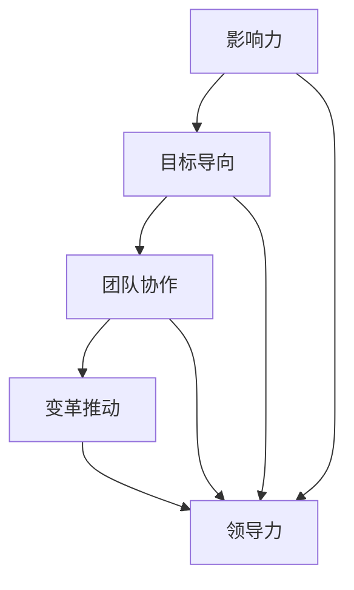
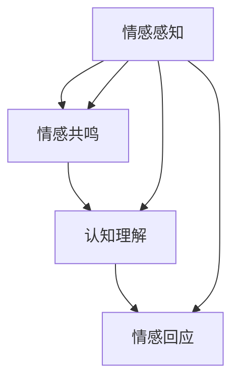
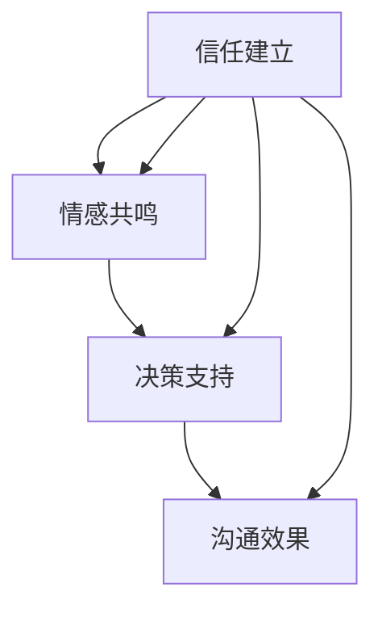
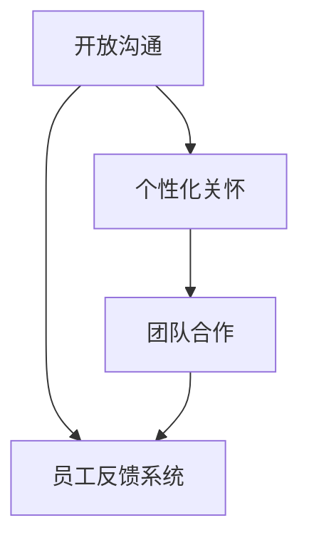
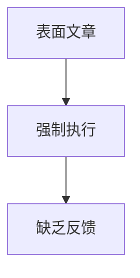

                 

# 《领导力与同理心实践：从理解到行动的转化》

## 关键词
- 领导力
- 同理心
- 实践
- 转化
- 个人成长
- 团队管理

## 摘要
本文旨在探讨领导力与同理心的实践转化，从理解到行动的路径。通过分析领导力与同理心的核心概念，结合实际案例，探讨如何将理论知识转化为实际行动，以提升个人与团队的表现。文章还提出了转化过程中可能遇到的障碍与对策，以及评估与反馈的重要性。

## 目录
1. 引言
2. 领导力概述
3. 同理心概念与理论
4. 领导力与同理心的融合
5. 实践案例分析
6. 转化障碍与对策
7. 行动计划制定与执行
8. 反思与调整
9. 评估与反馈
10. 最佳实践与小结

## 引言
领导力与同理心是现代组织管理中的重要概念。领导力关乎领导者如何引导、激励和影响团队，而同理心则涉及领导者如何理解并关注团队成员的情感和需求。理解并实践领导力与同理心，不仅对个人成长和职业发展至关重要，也对团队绩效和组织文化产生深远影响。

本文将首先介绍领导力的核心概念，探讨其在个人成长、团队管理和战略规划中的重要作用。接着，我们将深入探讨同理心的定义与理论，分析其在人际关系、沟通技巧和工作中的应用。随后，文章将结合实践案例，探讨如何将领导力与同理心理论转化为实际行动。在转化过程中，我们将分析可能遇到的障碍与对策，并提出行动计划制定与执行的方法。最后，文章将讨论反思与调整的重要性，以及如何进行评估与反馈，以实现持续改进。

通过本文的探讨，我们希望为读者提供关于领导力与同理心实践转化的全面理解，助力其在实际工作中取得更好的成果。

## 第1章：领导力概述
领导力是一种复杂而多维的能力，它不仅仅关乎个人魅力，更涉及一系列战略性的思考和行动。在组织管理中，领导力是推动团队实现目标、提升绩效的关键因素。要深入理解领导力，我们需要从多个角度进行探讨。

### 背景介绍
领导力的概念自古有之，但其定义和内涵随着时间的推移不断演变。在古代，领导力往往与统治和权威联系在一起。然而，现代管理学对领导力有了更全面的认知，认为它是一种影响他人实现共同目标的能力。这种定义强调了领导力的双向性，即领导者不仅需要引导和激励团队成员，还需要与团队成员建立信任和合作关系。

### 核心概念与联系
领导力可以分解为以下几个核心概念：
1. **影响力**：领导者通过各种手段（如权威、激励、榜样等）影响团队成员的态度和行为。
2. **目标导向**：领导者需要设定明确的目标，并引导团队成员围绕这些目标开展工作。
3. **团队协作**：领导力不仅仅是单打独斗，更强调团队协作和合作，通过激发团队成员的潜力实现共同目标。
4. **变革推动**：在快速变化的环境中，领导者需要具备变革推动能力，引领团队适应新的挑战和机遇。

这些核心概念之间相互联系，共同构成了领导力的理论框架。例如，影响力是领导者实现目标的基础，而团队协作则是影响力的具体体现。目标导向和变革推动能力则确保了领导力的可持续性。

### Mermaid 流程图


### 核心算法原理讲解
在领导力中，并没有特定的“算法”，但其原理可以类比为一种“决策树”：

```plaintext
决策树：
1. 确定目标
2. 分析现状
3. 制定策略
4. 实施策略
5. 监控与反馈
6. 调整策略

伪代码：
function LeadershipDecisionTree(goal, current_state):
    if current_state != goal:
        strategy = determine_strategy(goal, current_state)
        action_plan = formulate_action_plan(strategy)
        execute_action_plan(action_plan)
        feedback = monitor_performance()
        if feedback indicates deviation:
            adjusted_strategy = adjust_strategy(strategy, feedback)
            return LeadershipDecisionTree(goal, current_state)
        else:
            return "Goal achieved"
    else:
        return "Goal already achieved"
```

### 数学模型和公式
领导力的数学模型可以简化为：

$$\text{领导力} = f(\text{影响力}, \text{目标导向}, \text{团队协作}, \text{变革推动})$$

其中，影响力、目标导向、团队协作和变革推动是领导力的四个关键因素，每个因素在总体领导力中的权重可以根据具体情况调整。

### 详细讲解与举例说明
假设一个团队的目标是提高产品销量，当前状态是销量低于预期。领导者的决策树如下：

1. **确定目标**：提高产品销量。
2. **分析现状**：销量低于预期，市场竞争激烈。
3. **制定策略**：增加营销预算，改进产品特性，提高客户满意度。
4. **实施策略**：分配资源，执行营销计划，收集客户反馈。
5. **监控与反馈**：定期检查销量变化，分析客户反馈。
6. **调整策略**：如果销量没有显著提高，可能需要调整营销策略，如增加广告投放或改进产品。

通过这个例子，我们可以看到领导力不仅涉及决策，还包括执行、监控和调整。领导者需要根据实际情况灵活调整策略，以确保团队能够达成目标。

## 第2章：同理心概念与理论
同理心是一种关键的人际交往能力，它使人们能够理解并感受他人的情感和体验。在领导力中，同理心扮演着至关重要的角色，它不仅有助于建立信任和合作关系，还能提升团队的整体效能。下面我们将深入探讨同理心的概念、心理学基础及其在社会学视角下的应用。

### 背景介绍
同理心（Empathy）一词源于希腊语“empathos”，意为“感受他人的经历”。同理心通常被定义为一种认知和情感上的理解，使个体能够从他人的角度看待问题，感受他人的情绪和体验。在领导力中，同理心被视为一种重要的软技能，它不仅有助于提高领导者与团队成员之间的沟通效果，还能增强团队的凝聚力和协作性。

### 核心概念与联系
同理心可以分解为以下几个核心概念：
1. **情感感知**：同理心始于对他人情感状态的感知，这需要领导者具备敏锐的观察力和情感敏锐度。
2. **情感共鸣**：情感共鸣是指领导者能够与他人的情感产生共鸣，感受到他人的情绪。
3. **认知理解**：同理心不仅涉及情感层面，还包括对他人行为和言语的认知理解，这有助于领导者更好地理解他人的需求和动机。
4. **情感回应**：同理心最终体现在领导者对他人情感状态的回应上，这种回应可以是言语上的安慰，也可以是行为上的支持。

这些概念相互联系，共同构成了同理心的理论框架。情感感知和情感共鸣是同理心的基础，而认知理解和情感回应则使其在实际应用中发挥作用。

### Mermaid 流程图


### 核心算法原理讲解
同理心的算法可以类比为一种“情感分析”模型：

```plaintext
情感分析模型：
1. 感知他人情感状态
2. 共鸣他人的情感
3. 理解他人的行为和言语
4. 回应他人的情感状态

伪代码：
function EmpathyModel(observable_emotion):
    perceived_emotion = perceive_emotion(observable_emotion)
    emotional_resonance = resonate_emotion(perceived_emotion)
    understanding = understand_behavior_and_speech(perceived_emotion)
    response = respond_to_emotion(emotional_resonance)
    return response
```

### 数学模型和公式
同理心的数学模型可以简化为：

$$\text{同理心} = f(\text{情感感知}, \text{情感共鸣}, \text{认知理解}, \text{情感回应})$$

其中，情感感知、情感共鸣、认知理解和情感回应是同理心的四个关键因素，每个因素在总体同理心中的权重可以根据具体情况调整。

### 详细讲解与举例说明
假设一个领导者观察到团队成员情绪低落，领导者可以按照以下步骤运用同理心：

1. **感知他人情感状态**：领导者观察到团队成员的情绪低落，感受到团队可能面临挑战。
2. **共鸣他人的情感**：领导者尝试理解团队成员的感受，感受到他们的压力和担忧。
3. **理解他人的行为和言语**：领导者通过与团队成员沟通，了解他们面临的困难，如工作压力、资源不足等。
4. **回应他人的情感状态**：领导者提供支持，如调整工作安排、提供资源等，以帮助团队成员应对挑战。

通过这个例子，我们可以看到同理心在领导力中的应用，它不仅帮助领导者更好地理解团队成员的需求，还增强了团队的凝聚力和信任感。

### 总结
同理心是一种重要的领导力技能，它通过情感感知、共鸣、理解和回应，帮助领导者更好地理解和支持团队成员。在领导力中，同理心不仅有助于提高团队绩效，还能建立积极的组织文化，促进组织的可持续发展。

## 第3章：领导力与同理心的融合
领导力与同理心虽然各自独立，但它们在实际应用中往往是相辅相成的。领导者如果能够将同理心融入领导力实践中，将会更加有效地引导团队，提升团队绩效和组织文化。在本章中，我们将探讨如何将领导力与同理心融合，提出具体的策略和技巧。

### 背景介绍
领导力与同理心的融合是一个复杂的过程，它需要领导者不仅在理论上理解这两个概念，更需要在实践中将其结合起来。融合领导力与同理心的目标在于，通过同理心增强领导力的影响力，提高团队协作和决策质量。这种融合不仅有助于领导者更好地理解团队成员的需求，还能促进团队成员之间的信任和尊重。

### 核心概念与联系
领导力与同理心的融合可以分解为以下几个核心概念：
1. **信任建立**：同理心有助于建立信任，使团队成员更加愿意接受领导者的指导和影响。
2. **情感共鸣**：通过同理心，领导者能够与团队成员产生情感共鸣，增强团队的凝聚力。
3. **决策支持**：同理心使领导者能够从不同角度考虑问题，提高决策的全面性和准确性。
4. **沟通效果**：同理心提升领导者与团队成员之间的沟通质量，减少误解和冲突。

这些概念相互联系，共同构成了领导力与同理心融合的理论框架。信任建立是融合的基础，情感共鸣是融合的核心，决策支持和沟通效果则是融合的实际应用。

### Mermaid 流程图


### 核心算法原理讲解
领导力与同理心的融合算法可以类比为一种“多因素决策模型”：

```plaintext
多因素决策模型：
1. 分析问题
2. 收集信息
3. 应用同理心理解团队成员需求
4. 制定决策
5. 沟通决策
6. 获取反馈
7. 调整决策

伪代码：
function LeadershipAndEmpathyFusion(problem, team需求的):
    analyzed_problem = analyze_problem(problem)
    collected_info = collect_info(analyzed_problem)
    empathy_understanding = apply_empathy(collected_info)
    decision = formulate_decision(analyzed_problem, empathy_understanding)
    communication = communicate_decision(decision)
    feedback = gather_feedback(communication)
    if feedback indicates need for adjustment:
        adjusted_decision = adjust_decision(decision, feedback)
        return LeadershipAndEmpathyFusion(problem, team需求的)
    else:
        return "Decision implemented"
```

### 数学模型和公式
领导力与同理心融合的数学模型可以简化为：

$$\text{融合效果} = f(\text{信任建立}, \text{情感共鸣}, \text{决策支持}, \text{沟通效果})$$

其中，信任建立、情感共鸣、决策支持和沟通效果是融合效果的四个关键因素，每个因素在总体融合效果中的权重可以根据具体情况调整。

### 详细讲解与举例说明
假设一个领导者需要制定一个关于项目进展的决策，他可以按照以下步骤应用领导力与同理心的融合：

1. **分析问题**：领导者首先分析项目的现状，了解项目的进度和潜在问题。
2. **收集信息**：领导者收集团队成员对项目的看法和建议，以获取全面的信息。
3. **应用同理心理解团队成员需求**：领导者通过同理心，理解团队成员的需求和担忧，确保决策能够满足他们的期望。
4. **制定决策**：基于分析结果和同理心理解，领导者制定一个平衡各方面需求的决策。
5. **沟通决策**：领导者与团队成员沟通决策过程和结果，确保团队成员理解并接受决策。
6. **获取反馈**：领导者收集团队成员对决策的反馈，了解他们的反应和意见。
7. **调整决策**：根据反馈，领导者可能需要调整决策，以确保其能够有效实施。

通过这个例子，我们可以看到领导力与同理心融合在决策制定中的应用，它不仅提高了决策的质量，还增强了团队成员的参与感和满意度。

### 总结
领导力与同理心的融合是一种高效的管理策略，它通过建立信任、情感共鸣、决策支持和沟通效果，提升领导者的整体领导力。领导者如果能够在实践中灵活运用这种融合策略，将能够更好地引导团队，实现组织的长期成功。

## 第4章：实践案例分析
通过分析成功和失败的领导力与同理心实践案例，我们可以更好地理解这些概念在实际应用中的挑战和机会。在本节中，我们将探讨几个典型的案例，以揭示领导力与同理心在实践中的挑战和解决方案。

### 成功案例：谷歌的领导力与同理心实践

**背景介绍**：
谷歌作为全球科技巨头，以其独特的领导力与企业文化而闻名。谷歌的领导力实践强调同理心，旨在打造一个充满创新和合作的工作环境。

**核心概念**：
谷歌的领导力实践围绕以下几个核心概念展开：
- **开放沟通**：谷歌鼓励员工自由交流，领导者通过同理心倾听员工的意见和需求。
- **个性化关怀**：领导者关注每个员工的个人成长和发展，提供定制化的支持和资源。
- **团队合作**：谷歌强调跨职能团队合作，通过同理心增强团队成员之间的信任和协作。

**具体实践**：
- **开放办公室**：谷歌采用开放办公环境，减少管理层与员工的距离，鼓励员工直接与领导者沟通。
- **员工反馈系统**：谷歌设有员工反馈系统，领导者定期收集员工反馈，并根据反馈调整管理策略。
- **个性化培训计划**：谷歌为员工提供个性化的培训和发展计划，以支持员工的职业成长。

**结果与影响**：
谷歌的领导力与同理心实践极大地提升了员工满意度和创新能力。员工感受到自己的意见被重视，工作环境更加开放和包容，从而提高了团队的绩效和创造力。

**图表分析**：
可以使用以下Mermaid流程图来展示谷歌的领导力与同理心实践：


### 失败案例：某企业的领导力与同理心实践失误

**背景介绍**：
某企业在推行领导力与同理心实践时，由于缺乏有效的策略和实施，导致员工不满和工作效率下降。

**核心概念**：
该企业的领导力实践存在的问题主要包括：
- **缺乏同理心**：领导者没有真正理解员工的需求和情感，导致沟通不畅。
- **形式主义**：领导力与同理心实践被简单地视为一种形式，没有真正融入日常管理中。
- **决策失误**：领导者没有根据同理心进行决策，导致错误的人事调整和项目决策。

**具体实践**：
- **表面文章**：企业组织了领导力与同理心的培训，但没有将其融入到日常管理中。
- **强制执行**：企业强制要求员工接受新的管理方式，但没有提供足够的支持和培训。
- **缺乏反馈**：领导者没有及时收集员工的反馈，导致问题未能及时发现和解决。

**结果与影响**：
由于缺乏有效的领导力与同理心实践，该企业的员工士气下降，工作效率下降，员工流失率增加，最终影响了企业的整体绩效。

**图表分析**：
可以使用以下Mermaid流程图来展示该企业的领导力与同理心实践失误：


### 总结
通过以上案例分析，我们可以看到领导力与同理心实践的成功与失败在很大程度上取决于领导者的理解和实施。成功的实践需要真正的同理心、有效的沟通和持续的支持，而失败往往源于表面文章、缺乏理解和忽视员工反馈。领导者应从中吸取教训，不断提升自身的领导力和同理心实践能力。

## 第5章：转化障碍与对策
将领导力与同理心的理论知识转化为实际行动，是领导者面临的一个重要挑战。在这一过程中，可能会遇到各种障碍。理解这些障碍，并采取相应的对策，对于确保转化过程的顺利进行至关重要。

### 背景介绍
在将领导力与同理心的理论转化为实际行动时，领导者常常会遇到认知、情感和行为上的障碍。这些障碍可能会阻碍领导者实施有效的领导行为，影响团队的表现和组织的文化。因此，识别和克服这些障碍是领导力发展的关键。

### 核心障碍
1. **认知障碍**：领导者可能对领导力与同理心的理论理解不足，或者对如何将理论应用于实践感到困惑。
2. **情感障碍**：领导者可能缺乏对同理心的情感共鸣，难以在情感上与团队成员产生连接。
3. **行为障碍**：领导者可能在实践中缺乏具体的行动策略，或者由于旧有习惯难以改变而无法有效实施新的领导行为。

### 对策
1. **加强培训和教育**：通过定期的培训和研讨会，帮助领导者加深对领导力与同理心的理解，并提供实践案例和工具。
2. **情感共鸣**：鼓励领导者通过反思和体验活动，培养对同理心的情感共鸣，例如参与团队建设活动和角色扮演。
3. **制定明确的行动计划**：帮助领导者制定具体的行动计划，明确每一步的行动目标和步骤，以确保实践的可操作性和持续性。

### 具体实践
1. **认知障碍对策**：通过理论学习、研讨会和工作坊，帮助领导者掌握领导力与同理心的核心概念和理论框架。例如，可以组织一个“领导力与实践工作坊”，让领导者通过小组讨论和实践案例，深入理解理论如何应用于实际场景。
2. **情感障碍对策**：通过情感体验活动，如角色扮演和团队建设游戏，帮助领导者培养同理心。例如，可以设计一个“同理心角色扮演”活动，让领导者模拟面对不同情境时如何表达同理心。
3. **行为障碍对策**：通过制定明确的行动计划，帮助领导者将理论转化为具体行动。例如，可以设计一个“领导力行动计划”，让领导者列出具体的行动步骤，包括每日的领导行为和反思。

### 总结
转化领导力与同理心的理论知识到实际行动，是一个复杂而持续的过程。通过识别和克服认知、情感和行为上的障碍，领导者可以更好地将理论应用于实践，提升自身的领导力，促进团队的发展和组织的成功。

## 第6章：行动计划制定与执行
制定并执行一个有效的行动计划是领导力与同理心实践成功的关键。在这一章中，我们将详细讨论如何制定一个具有可操作性的行动计划，以及如何确保其顺利执行。

### 背景介绍
行动计划是领导者为实现具体目标而制定的一系列具体步骤和行动。一个有效的行动计划不仅能够帮助领导者明确目标，还能够提供实现目标的路线图。在领导力与同理心的实践中，制定一个详细的行动计划至关重要，因为它能够确保领导者将理论知识转化为具体的行动，并在实践中不断调整和改进。

### 核心步骤
1. **确定目标**：明确你想要实现的具体目标。目标应该是具体、可衡量、可实现、相关和时限的（SMART）。
2. **分析现状**：了解当前的情况，包括团队成员的能力、资源、文化背景等，以确定实现目标的障碍和机会。
3. **制定策略**：基于目标和分析结果，制定实现目标的策略。这些策略应该是明确、具体和可操作的。
4. **分配责任**：将具体的任务和责任分配给团队成员，确保每个人都知道自己的角色和职责。
5. **设置里程碑**：为行动计划设置具体的里程碑，以便能够监控进展并及时调整。
6. **制定时间表**：为每个行动步骤和里程碑设置时间表，确保行动有明确的时间框架。

### 实践指南
1. **确定目标**：例如，如果你想要提升团队的协作能力，你的目标可以是“在三个月内，实现团队协作效率提高20%”。
2. **分析现状**：例如，通过问卷调查或团队会议，了解团队成员的协作方式、沟通障碍和共同目标。
3. **制定策略**：例如，制定每周团队协作会议、建立沟通平台和培训协作技巧等措施。
4. **分配责任**：例如，指定团队成员负责会议组织、沟通平台的维护和协作技巧的培训。
5. **设置里程碑**：例如，每周评估一次团队协作情况，每两个月进行一次团队协作效率的对比。
6. **制定时间表**：例如，每周五下午进行团队协作会议，每月底进行协作效率评估。

### 伪代码示例
以下是制定和执行行动计划的一个简单伪代码示例：

```plaintext
function DevelopActionPlan(goal, current_status):
    set SMART_goal(goal)
    analyze_current_status(current_status)
    create_strategies_based_on_analysis()
    assign_responsibilities_to_team_members()
    set_milestones_for_progress()
    create_timeline_for_actions()
    monitor_progress_and_adjust_as_needed()
    return "Action Plan Implemented"
```

### 总结
制定并执行一个有效的行动计划是领导力与同理心实践的重要组成部分。通过明确目标、分析现状、制定策略、分配责任、设置里程碑和制定时间表，领导者可以确保行动计划的可行性和有效性。通过持续的监控和调整，领导者可以不断提升团队的表现，实现组织的长期成功。

## 第7章：转化中的反思与调整
在将领导力与同理心的理论知识转化为实际行动的过程中，反思与调整是确保实践持续改进的关键环节。领导者需要不断地回顾和评估行动的效果，从而在反思中找到改进的空间，并通过调整策略来优化实践。

### 背景介绍
反思与调整是领导力发展过程中不可或缺的一部分。通过反思，领导者可以深入了解自己在实践中的表现，识别成功和不足之处；通过调整，领导者可以根据反馈和实际情况，对行动策略和方法进行优化。这种持续的反思与调整机制，有助于领导者不断提升自身的能力，确保领导力与同理心实践能够与时俱进，满足组织和团队的需求。

### 核心概念
1. **反思**：反思是指领导者对自身行为和决策的回顾和评估，通过自我反省来识别问题、总结经验和学习新知识。
2. **调整**：调整是指根据反思的结果，对行动计划和策略进行修改和完善，以确保行动更加符合实际情况和目标需求。

### 实践指南
1. **建立反思机制**：定期安排反思时间，例如每周或每月的团队会议后，领导者可以花时间反思过去的行动和决策。
2. **收集反馈**：积极收集团队成员和利益相关者的反馈，包括正面和负面的反馈，以便更全面地了解实践的效果。
3. **分析数据**：通过数据分析来评估行动的效果，例如通过关键绩效指标（KPI）来衡量团队的绩效变化。
4. **制定调整计划**：根据反思和反馈的结果，制定具体的调整计划，包括修改行动计划、优化策略和重新分配责任。
5. **持续跟进**：在调整后，领导者需要持续跟进实践的效果，确保调整措施能够有效实施。

### 伪代码示例
以下是一个简单的伪代码示例，用于描述反思与调整的过程：

```plaintext
function ReflectAndAdjust(action_plan, feedback, data_analysis):
    reflect_on_actions(action_plan)
    collect_and_analyze_feedback(feedback)
    analyze_data(data_analysis)
    identify_issues_and_lessons()
    create_adjustment_plan()
    implement_adjustments()
    monitor_adjustments_for_effectiveness()
    return "Reflection and Adjustment Completed"
```

### 总结
反思与调整是领导力与同理心实践中至关重要的环节。通过建立反思机制、收集反馈、分析数据和制定调整计划，领导者可以确保实践不断改进，从而提升团队的绩效和组织的整体成功。持续的反思与调整不仅有助于领导者自身的发展，也为团队的成长和进步提供了强有力的支持。

## 第8章：评估与反馈
评估与反馈是领导力与同理心实践中的重要组成部分，它们不仅有助于领导者了解实践的效果，还能提供宝贵的改进机会。通过系统地评估实践结果，领导者可以获取反馈，从而进行有效的调整和优化。

### 背景介绍
评估与反馈过程是领导力发展的关键环节。通过评估，领导者可以客观地衡量领导行为和团队绩效，而反馈则提供了团队成员和其他利益相关者的意见和观察。这种评估与反馈机制有助于领导者识别成功经验、找出不足之处，并制定改进计划。

### 核心步骤
1. **制定评估标准**：明确评估的目标和标准，以确保评估的客观性和一致性。
2. **收集数据**：通过定量和定性的方法，收集与领导力与同理心实践相关的数据，如团队成员的表现、工作满意度、绩效指标等。
3. **分析数据**：对收集到的数据进行系统分析，以识别实践的成功点和不足之处。
4. **获取反馈**：从团队成员和其他利益相关者那里收集反馈，包括正面的和负面的意见。
5. **综合评估**：结合数据分析和反馈，形成全面的评估结果。
6. **制定改进计划**：根据评估结果，制定具体的改进措施和行动计划。

### 实践指南
1. **制定评估标准**：例如，可以设置SMART目标（具体、可衡量、可实现、相关、时限）作为评估标准。
2. **收集数据**：例如，通过问卷调查、绩效评估工具、员工访谈等方式收集数据。
3. **分析数据**：例如，使用图表和统计工具来展示数据，识别趋势和模式。
4. **获取反馈**：例如，通过团队会议、一对一谈话等方式，从团队成员和其他利益相关者那里获取反馈。
5. **综合评估**：例如，将定量数据和定性反馈结合起来，形成综合评估报告。
6. **制定改进计划**：例如，根据评估结果，制定具体的改进措施，如培训计划、流程优化等。

### 伪代码示例
以下是一个简单的伪代码示例，用于描述评估与反馈的过程：

```plaintext
function AssessAndFeedback(action_plan, data, feedback):
    define_evaluation_criteria(action_plan)
    collect_data(data)
    analyze_data(data)
    gather_feedback(feedback)
    integrate_data_and_feedback()
    create_evaluation_report()
    develop_improvement_plan()
    implement_improvement_plan()
    return "Assessment and Feedback Completed"
```

### 总结
评估与反馈是领导力与同理心实践中不可或缺的环节。通过系统地评估实践结果，获取团队成员和利益相关者的反馈，领导者可以识别成功经验、找出不足之处，并制定改进计划。这种持续的评估与反馈机制有助于领导者不断提升自身的能力，优化领导实践，实现团队的持续成长和组织的长期成功。

## 总结与最佳实践
通过本文的探讨，我们可以看到领导力与同理心在组织管理中的重要性。领导力不仅是推动团队实现目标的关键因素，还涉及到个人成长和战略规划。同理心则帮助领导者更好地理解和支持团队成员，建立信任和合作关系。二者的融合可以显著提升团队绩效和组织文化。

### 最佳实践
1. **持续学习**：领导者应不断学习新的领导理论和同理心技巧，通过培训、阅读和实践来提升自身能力。
2. **建立反馈机制**：定期收集团队成员的反馈，确保领导行为与团队需求保持一致。
3. **实践反思**：领导者应定期进行反思，从实践中学习并调整策略。
4. **制定明确的行动计划**：确保领导行为与目标一致，通过具体行动和里程碑来监控进展。
5. **培养同理心**：通过角色扮演、团队建设等活动，培养领导者的同理心，增强情感共鸣。

### 注意事项
1. **避免形式主义**：领导力与同理心的实践应真正融入日常管理，而非仅作为一种形式。
2. **持续改进**：领导者应保持开放的心态，不断优化领导实践，以适应不断变化的环境。
3. **关注团队成员的需求**：领导者应关注团队成员的成长和发展，提供个性化的支持和资源。

### 拓展阅读
- 《影响力的六大原则》
- 《同理心：社交技能的关键》
- 《深度工作：如何有效利用每一点脑力》
- 《团队的智慧：团队合作的艺术与科学》

通过这些拓展阅读，读者可以进一步深化对领导力与同理心的理解，并在实践中取得更好的成果。

## 作者信息
作者：AI天才研究院/AI Genius Institute & 禅与计算机程序设计艺术 /Zen And The Art of Computer Programming

通过本文的深入探讨，我们希望能够为读者提供关于领导力与同理心实践转化的全面理解，助力其在实际工作中取得更好的成果。让我们共同努力，将理论知识转化为实际行动，打造更加高效、和谐的组织环境。

