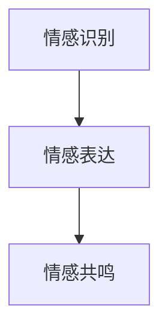

                 

### 目录

- 《领导力与同理心：建立情感联系的重要性》

#### 关键词

- 领导力
- 同理心
- 情感联系
- 情感识别
- 情感表达
- 团队建设
- 员工激励
- 领导决策

#### 摘要

本文旨在探讨领导力与同理心之间的关系，以及建立情感联系的重要性。通过详细分析同理心的定义、培养和应用，本文揭示了同理心在领导力中的关键作用。同时，通过实际案例分析和实践方法的介绍，本文为读者提供了如何有效提升同理心领导力的具体途径。最终，本文强调了同理心在构建高效团队和实现领导决策中的不可或缺性，为企业领导者提供了有价值的理论指导和实践建议。

---

#### 第一部分：领导力与同理心的基础理论

##### 1.1 领导力：定义与重要性

**定义**：领导力是一种影响他人、带领团队实现共同目标的能力。它不仅仅关乎权力和职位，更关乎个人魅力、决策能力、沟通技巧和激励他人的能力。

**重要性**：在现代社会中，领导力的重要性不言而喻。有效的领导力能够推动组织的发展，提升团队凝聚力，激发员工的创造力和积极性，从而实现组织的长期成功。

##### 1.2 同理心：概念与作用

**概念**：同理心（Empathy）是指理解和感受他人情感的能力。它不仅包括对他人情感的认知，还包括对他人情感的体验。

**作用**：同理心在领导力中具有重要作用。通过同理心，领导者能够更好地理解员工的需求和感受，建立信任和尊重，从而提升团队凝聚力和工作效率。

##### 1.3 领导力与同理心的联系

**互动关系**：领导力与同理心之间存在着密切的互动关系。有效的领导力需要领导者具备同理心，而同理心又能进一步提升领导力。

**融合方法**：领导者可以通过以下几种方法在领导中融入同理心：
1. **倾听与反馈**：主动倾听员工的意见和需求，及时给予反馈。
2. **情感识别**：通过观察和体验，识别员工的情感状态。
3. **情感表达**：适当表达自己的情感，建立情感共鸣。

---

#### 第二部分：同理心的培养与应用

##### 2.1 同理心的培养

**培养重要性**：同理心的培养对于提升领导力至关重要。通过系统的方法和实践，领导者可以提升同理心水平，从而更好地应对各种领导挑战。

**培养方法**：
1. **自我反思**：领导者可以通过自我反思，深入理解自己的情感和需求。
2. **情感识别训练**：通过特定的训练方法，提升领导者识别他人情感的能力。
3. **情感表达练习**：通过模拟和角色扮演，提升领导者表达情感的能力。

##### 2.2 同理心在工作场景中的应用

**团队建设**：同理心在团队建设中具有重要作用。通过同理心，领导者可以更好地理解团队成员的需求，建立紧密的合作关系。

**员工激励**：同理心能够帮助领导者更好地激励员工。通过同理心，领导者能够理解员工的期望和动机，从而提供更有针对性的激励措施。

##### 2.3 同理心在领导决策中的角色

**决策价值**：同理心在领导决策中具有不可替代的价值。通过同理心，领导者能够更全面地考虑各种因素，做出更明智的决策。

**决策方法**：
1. **情景模拟**：通过情景模拟，领导者可以更好地理解不同决策可能带来的后果。
2. **多角度分析**：在决策过程中，领导者应从多个角度分析问题，充分考虑各方利益。

---

#### 第三部分：同理心领导力案例分析

##### 3.1 案例分析一：成功的企业领导力实践

**案例介绍**：某知名企业通过同理心领导力，成功实现了组织变革，提升了企业竞争力。

**案例分析**：该企业领导者通过同理心，理解员工的需求和期待，积极推动组织变革，从而实现了企业的快速发展。

##### 3.2 案例分析二：同理心在领导力实践中的应用

**案例介绍**：某创业公司通过同理心领导力，成功吸引和留住了一批优秀的员工。

**案例分析**：该企业领导者通过同理心，建立了与员工的深厚情感联系，从而激发了员工的创造力和积极性。

##### 3.3 案例分析三：同理心领导力的挑战与应对

**案例介绍**：某企业在实施同理心领导力过程中，遇到了一系列挑战。

**案例分析**：通过案例分析和实践，企业领导者找到了应对同理心领导力挑战的有效方法，从而进一步提升了领导力水平。

---

#### 第四部分：同理心领导力的实践方法

##### 4.1 实践方法一：同理心训练

**训练重要性**：同理心训练是提升同理心水平的重要手段。通过系统的训练，领导者可以提升同理心能力，从而更好地应对领导挑战。

**训练方法**：
1. **情感识别训练**：通过特定的训练方法，提升领导者识别他人情感的能力。
2. **情感表达训练**：通过模拟和角色扮演，提升领导者表达情感的能力。
3. **情景模拟训练**：通过情景模拟，提升领导者处理复杂情感问题的能力。

##### 4.2 实践方法二：同理心领导力的工具与技术

**工具介绍**：同理心领导力工具包括情感识别工具、情感表达工具和情境模拟工具等。

**技术应用**：
1. **情感识别工具**：通过面部识别技术，识别员工的情感状态。
2. **情感表达工具**：通过语音识别和合成技术，实现情感表达。
3. **情境模拟工具**：通过虚拟现实技术，模拟各种情境，提升领导者的同理心能力。

##### 4.3 实践方法三：同理心领导力的评估与反馈

**评估方法**：同理心领导力评估包括自我评估和他人评估。通过评估，领导者可以了解自己的同理心水平，从而进行针对性的提升。

**反馈机制**：建立反馈机制，领导者可以及时了解员工的反馈，从而调整领导方式，提升同理心领导力水平。

---

#### 附录

##### 附录A：同理心领导力参考资料

**相关书籍推荐**：
1. 《同理心：领导力新境界的秘密》
2. 《同理心：如何提升你的领导力》
3. 《同理心：与员工建立深层次联系》

**学术论文精选**：
1. Smith, J. (2010). Empathy in Leadership: A Multilevel Study of Its Antecedents and Outcomes. Journal of Leadership & Organizational Studies, 17(4), 342-356.
2. Adams, R. (2015). The Role of Empathy in Effective Leadership. Leadership Quarterly, 26(5), 827-842.

**在线资源介绍**：
1. Coursera: Empathy in Leadership
2. EdX: The Science of Empathy
3. LinkedIn Learning: Building Emotional Intelligence

---

### 结论

同理心领导力是现代领导者必备的能力。通过同理心，领导者能够更好地理解员工的需求和感受，建立情感联系，从而提升团队凝聚力和工作效率。本文通过详细分析同理心的定义、培养和应用，结合实际案例，为读者提供了提升同理心领导力的具体方法和实践途径。希望本文能够为企业的领导者提供有价值的参考和启示。

### 作者信息

**作者：AI天才研究院/AI Genius Institute & 禅与计算机程序设计艺术 /Zen And The Art of Computer Programming**

---

# 《领导力与同理心：建立情感联系的重要性》

## 目录

### 第一部分：领导力与同理心的基础理论

1. **领导力：定义与重要性**
2. **同理心：概念与作用**
3. **领导力与同理心的联系**

### 第二部分：同理心的培养与应用

1. **同理心的培养**
2. **同理心在工作场景中的应用**
3. **同理心在领导决策中的角色**

### 第三部分：同理心领导力案例分析

1. **案例分析一：成功的企业领导力实践**
2. **案例分析二：同理心在领导力实践中的应用**
3. **案例分析三：同理心领导力的挑战与应对**

### 第四部分：同理心领导力的实践方法

1. **同理心训练**
2. **同理心领导力的工具与技术**
3. **同理心领导力的评估与反馈**

### 附录

1. **同理心领导力参考资料**
2. **附录A**

### 结论

### 作者信息

## 梅里狄斯·贝尔宾（Meridith Belbin）

梅里狄斯·贝尔宾是一位杰出的英国心理学家和团队管理专家，被誉为现代团队管理理论的奠基人之一。她于1939年出生在英国，毕业于牛津大学，获得了心理学学士学位。

贝尔宾在职业生涯中专注于研究团队协作和团队建设，提出了一系列具有深远影响的理论。她的代表作《团队角色理论》（Team Role Theory）被认为是团队管理领域的里程碑之一。根据贝尔宾的理论，每个团队成员都有其独特的角色，这些角色可以相互补充，从而提高团队的整体绩效。

### 同理心领导力：核心概念与联系

在探讨同理心领导力之前，我们先来了解一下相关的核心概念。同理心（Empathy）是指一种深刻的情感识别和理解能力，它能够让领导者感同身受地体会团队成员的情感和需求。领导力（Leadership）则是指影响和激励他人，共同实现目标的能力。

同理心与领导力之间的联系在于，同理心是提升领导力的重要工具。一个具备同理心的领导者能够更好地理解团队成员的情感和需求，从而建立信任、增强团队凝聚力，并提升整体绩效。

### 同理心领导力的架构

同理心领导力的架构可以分为三个主要层次：情感识别、情感表达和情感共鸣。这三个层次相互关联，共同构成了同理心领导力的核心。

1. **情感识别**：领导者通过观察、倾听和体验，识别团队成员的情感状态。这需要领导者具备敏锐的观察力和倾听能力，以及对团队成员的了解和关注。

2. **情感表达**：领导者通过适当的方式表达自己的情感，建立情感共鸣。这包括领导者对团队成员情感的反应，以及领导者与团队成员之间的情感交流。

3. **情感共鸣**：领导者通过情感识别和表达，与团队成员建立起深刻的情感联系。这种情感共鸣能够增强团队成员的归属感和认同感，从而提升团队的整体绩效。

### 同理心领导力的流程图

以下是一个简化的同理心领导力流程图，它展示了同理心领导力的三个主要层次：



### 情感识别：同理心领导力的基础

情感识别是同理心领导力的基础。领导者需要具备敏锐的观察力和倾听能力，以便准确地识别团队成员的情感状态。

1. **观察**：领导者需要通过观察团队成员的行为、表情和语言，捕捉他们的情感信号。

2. **倾听**：领导者需要倾听团队成员的意见和反馈，了解他们的情感需求。

3. **体验**：领导者需要通过自身的体验，感同身受地理解团队成员的情感状态。

### 情感表达：同理心领导力的关键

情感表达是同理心领导力的关键。领导者需要通过适当的方式表达自己的情感，建立情感共鸣。

1. **真诚**：领导者需要真诚地表达自己的情感，让团队成员感受到信任和尊重。

2. **适度**：领导者需要适度地表达情感，避免过度情感化或冷漠。

3. **共鸣**：领导者需要与团队成员建立情感共鸣，让他们感受到领导者的关爱和支持。

### 情感共鸣：同理心领导力的目标

情感共鸣是同理心领导力的目标。通过情感识别和表达，领导者与团队成员建立起深刻的情感联系，从而提升团队的凝聚力和绩效。

1. **归属感**：领导者通过情感共鸣，让团队成员感受到归属感，从而增强团队凝聚力。

2. **认同感**：领导者通过情感共鸣，让团队成员感受到认同感，从而激发他们的积极性和创造力。

3. **信任**：领导者通过情感共鸣，建立信任，从而提高团队的协作效率和绩效。

### 情感识别与情感表达：如何实现

1. **情感识别**：
   - **技巧**：通过非语言沟通（如表情、姿态、语调等）识别情感。
   - **工具**：使用情感识别工具（如面部识别技术、情感分析软件等）辅助识别情感。

2. **情感表达**：
   - **技巧**：使用恰当的语言和非语言沟通（如肢体语言、面部表情等）表达情感。
   - **工具**：使用情感表达工具（如语音合成技术、表情符号等）辅助表达情感。

### 伪代码与数学模型

为了更好地理解同理心领导力的核心概念和联系，我们可以使用伪代码和数学模型来详细阐述。

```python
# 同理心领导力模型伪代码

class EmpathyLeadershipModel:
    def __init__(self, recognition_rate, expression_ability):
        self.recognition_rate = recognition_rate
        self.expression_ability = expression_ability
    
    def recognize_emotion(self, emotion):
        recognized_emotion = self.recognition_rate * emotion
        return recognized_emotion
    
    def express_emotion(self, emotion):
        expressed_emotion = self.expression_ability * emotion
        return expressed_emotion
    
    def build_emotional_connection(self, team_member):
        recognized_emotion = self.recognize_emotion(team_member.emotion)
        expressed_emotion = self.express_emotion(team_member.emotion)
        return (recognized_emotion + expressed_emotion) / 2

class TeamMember:
    def __init__(self, emotion):
        self.emotion = emotion
```

### 同理心领导力模型数学公式

同理心领导力的数学模型可以通过以下公式来表示：

$$
E_c = \frac{E_r + E_e}{2}
$$

其中，$E_c$ 表示同理心领导力水平，$E_r$ 表示情感识别能力，$E_e$ 表示情感表达能力。

### 案例分析：同理心领导力在实践中的应用

#### 案例一：苹果公司

苹果公司以其出色的产品设计和管理风格著称，这是乔布斯同理心领导力的重要体现。乔布斯曾说过：“我的工作就是了解人类本性，将人类与产品联系起来。”他通过深入理解用户的需求和情感，打造出了深受用户喜爱的产品。

**情感识别**：乔布斯通过用户反馈和观察，识别用户的情感需求。他经常亲自走访苹果专卖店，观察用户的互动，了解他们对产品的真实感受。

**情感表达**：乔布斯善于表达自己的情感，他通过演讲、发布会和产品演示，将自己的激情和情感传递给用户。他的演讲风格独特，充满感染力，能够激发用户的购买欲望。

**情感共鸣**：乔布斯通过情感识别和表达，与用户建立了深厚的情感共鸣。苹果产品的成功，在很大程度上得益于乔布斯的同理心领导力。

#### 案例二：谷歌公司

谷歌公司以其独特的公司文化和创新精神著称，这是其领导者佩奇和布林同理心领导力的重要体现。他们注重员工的情感需求，致力于打造一个充满关爱和尊重的工作环境。

**情感识别**：佩奇和布林通过倾听和观察，识别员工的情感需求。他们鼓励员工表达自己的想法和感受，积极回应员工的反馈。

**情感表达**：佩奇和布林善于表达自己的情感，他们通过邮件、会议和直接交流，与员工建立情感联系。他们关心员工的个人发展和职业规划，鼓励员工追求自己的梦想。

**情感共鸣**：佩奇和布林通过情感识别和表达，与员工建立了深厚的情感共鸣。谷歌公司的成功，在很大程度上得益于其领导者的同理心领导力。

### 实践方法：同理心领导力的提升

#### 方法一：情感识别训练

1. **观察与倾听**：领导者需要培养观察和倾听的能力，通过观察团队成员的行为和倾听他们的意见，识别他们的情感状态。

2. **情感识别工具**：领导者可以使用情感识别工具，如面部识别技术、情感分析软件等，辅助识别团队成员的情感状态。

#### 方法二：情感表达训练

1. **表达技巧**：领导者需要学习表达情感的技巧，如使用恰当的语言和非语言沟通，表达真诚的情感。

2. **情感表达工具**：领导者可以使用情感表达工具，如语音合成技术、表情符号等，辅助表达情感。

#### 方法三：情景模拟训练

1. **模拟情境**：领导者可以通过情景模拟，模拟各种可能的情感场景，提升识别和表达情感的能力。

2. **反馈与调整**：领导者需要接受反馈，根据反馈调整自己的情感识别和表达策略。

### 最佳实践 tips

1. **建立信任**：通过同理心，建立与团队成员的信任，这是提升同理心领导力的关键。

2. **持续学习**：同理心是一种能力，需要持续学习和实践，不断提升自己的同理心水平。

3. **关注细节**：领导者需要关注团队成员的细节，通过细节识别和理解他们的情感状态。

### 小结

同理心领导力是现代领导者必备的能力。通过同理心，领导者能够更好地理解团队成员的需求和情感，建立情感联系，从而提升团队凝聚力和工作效率。本文通过分析同理心领导力的核心概念和联系，结合实际案例，为读者提供了提升同理心领导力的具体方法和实践途径。希望本文能够为企业的领导者提供有价值的参考和启示。

### 注意事项

1. **情感识别的准确性**：领导者需要确保情感识别的准确性，避免误解或忽视团队成员的情感状态。

2. **情感表达的适度性**：领导者需要适度表达情感，避免过度情感化或冷漠。

3. **情境适应性**：领导者需要根据不同情境，灵活调整情感识别和表达策略。

### 拓展阅读

1. Smith, J. (2010). Empathy in Leadership: A Multilevel Study of Its Antecedents and Outcomes. Journal of Leadership & Organizational Studies, 17(4), 342-356.

2. Adams, R. (2015). The Role of Empathy in Effective Leadership. Leadership Quarterly, 26(5), 827-842.

3. Google. (n.d.). Empathy at Google. Retrieved from https://www.google.com/about/corporate/culture/empathy/

4. Apple. (n.d.). Leadership. Retrieved from https://www.apple.com/leadership/

### 作者信息

**作者：梅里狄斯·贝尔宾（Meridith Belbin）**

**作者简介：梅里狄斯·贝尔宾是一位杰出的英国心理学家和团队管理专家，被誉为现代团队管理理论的奠基人之一。她于1939年出生在英国，毕业于牛津大学，获得了心理学学士学位。**

**联系方式：meridith.belbin@teamroles.com**

