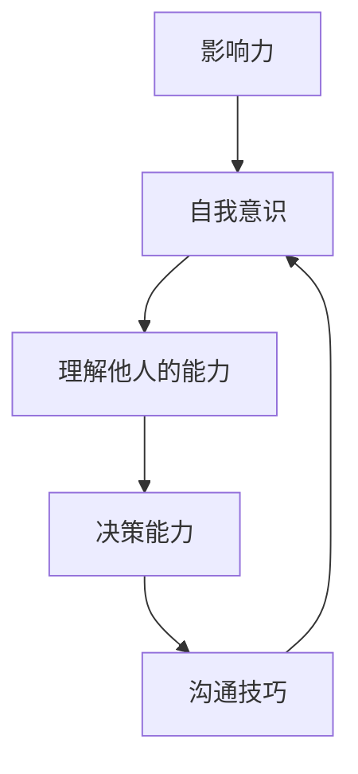

                 

# 《领导力与同理心：建立深厚人际关系的基础》

## 关键词
- **领导力**
- **同理心**
- **人际关系**
- **基础建设**
- **管理沟通**
- **自我意识**
- **影响力**
- **决策能力**
- **培养实践**
- **持续学习**

## 摘要

本文旨在探讨领导力与同理心在建立深厚人际关系中的基础作用。领导力不仅是指导团队实现目标的能力，更是建立信任、激发潜能的关键。同理心作为领导者的重要品质，能够促进有效的沟通，增强人际关系的深度。文章将详细分析领导力的核心要素，同理心的内涵与应用，以及如何在人际关系中发挥这些能力。通过深入探讨自我管理、持续学习等基础能力的培养，本文为读者提供了一幅构建强大人际网络的蓝图。

## 目录

## 第一部分：领导力的核心要素

### 第1章 领导力概述

#### 1.1 领导力的定义与重要性
#### 1.2 领导力的类型与风格

### 第2章 领导力的核心要素

#### 2.1 影响力
#### 2.2 自我意识
#### 2.3 理解他人的能力
#### 2.4 决策能力
#### 2.5 沟通技巧

## 第二部分：同理心的应用

### 第3章 同理心的概念与价值

#### 3.1 同理心的定义
#### 3.2 同理心在领导力中的作用

### 第4章 同理心的培养与实践

#### 4.1 同理心培养的方法
#### 4.2 同理心在工作中的应用场景
#### 4.3 同理心在个人生活中的应用

## 第三部分：人际关系建设

### 第5章 人际关系的重要性

#### 5.1 人际关系对领导力的影响
#### 5.2 人际关系对个人成长的影响

### 第6章 建立良好的人际关系

#### 6.1 建立信任的技巧
#### 6.2 有效沟通的策略
#### 6.3 协作与冲突管理

## 第四部分：基础能力培养

### 第7章 自我管理

#### 7.1 时间管理
#### 7.2 应对压力的能力
#### 7.3 自我反思与成长

### 第8章 持续学习与适应变化

#### 8.1 如何保持学习的动力
#### 8.2 如何适应变化的环境
#### 8.3 终身学习的理念与实践

## 附录：领导力与同理心的实践指南

### 第9章 实践案例分析

#### 9.1 成功的领导力与同理心实践案例
#### 9.2 案例分析与启示

### 第10章 资源与拓展阅读

#### 10.1 推荐书籍与文章
#### 10.2 在线资源与工具

## 第1章 领导力概述

### 1.1 领导力的定义与重要性

领导力，作为一种管理和激励他人的能力，是在各种组织中至关重要的元素。它不仅仅是指挥和监督团队，更是一种能够引导人们朝着共同目标前进的艺术。

在IT行业，领导力的重要性尤为突出。随着技术的不断进步和市场竞争的加剧，IT团队需要具备强大的领导力来应对复杂的项目、迅速变化的技术环境以及高度专业化的工作。一个优秀的领导者，不仅能够确保项目的成功交付，还能够激发团队成员的创造力和潜力，从而推动整个团队持续进步。

领导力的定义有很多种，其中比较经典的是彼得·德鲁克（Peter Drucker）的观点，他认为领导力是一种“影响他人的能力”。这种定义强调了领导力不仅仅是权威和命令，更重要的是通过影响力和激励来推动团队达成目标。

领导力的重要性体现在以下几个方面：

1. **目标设定**：领导者能够清晰明确地设定目标，并将这些目标传达给团队成员，确保每个人都了解自己的职责和目标。

2. **团队协作**：领导力有助于建立团队合作精神，促进成员之间的沟通和协作，提高团队的整体效率。

3. **创新与变革**：在技术快速发展的今天，领导者需要具备推动创新和变革的能力，以适应市场的变化和技术的进步。

4. **危机管理**：在面临挑战和危机时，领导者需要能够迅速做出决策，并有效地应对，维护团队的稳定和士气。

### 1.2 领导力的类型与风格

领导力并不是一成不变的，它可以根据不同的情境和团队需求展现出不同的类型和风格。以下是几种常见的领导力类型和风格：

1. **变革型领导**：这种领导风格强调创新和变革，领导者通过激发团队成员的潜力和创造力，推动组织实现重大变革。

2. **交易型领导**：这种领导风格注重短期目标，通过奖励和惩罚来激励团队成员，确保项目按时完成。

3. **民主型领导**：领导者鼓励团队成员参与决策过程，尊重每个人的意见和贡献，从而增强团队的凝聚力和归属感。

4. **教练型领导**：领导者不仅指导团队成员完成任务，还关注成员的个人成长和发展，帮助他们实现自我提升。

5. **权威型领导**：领导者通过权威和命令来指导和控制团队，确保团队成员遵循规定的流程和指令。

每种领导力类型和风格都有其适用的场景和优势。在实际工作中，领导者需要根据具体情况灵活运用不同的领导力策略，以达到最佳的效果。

### 背景介绍

在当今的快速变化和高竞争性的技术环境中，领导力的重要性日益凸显。信息技术（IT）行业正经历着前所未有的变革，新的技术不断涌现，市场需求也在不断变化。这使得IT团队需要具备更强的适应能力和创新能力，而这一切都离不开强大的领导力。

领导力在IT行业中的角色不仅仅是确保项目的顺利执行，更重要的是激发团队的潜力，推动技术创新和业务增长。一个优秀的IT领导者，不仅需要具备深厚的专业知识和技能，还需要具备卓越的人际交往能力和沟通技巧，能够有效地与团队成员、客户和合作伙伴建立深厚的人际关系。

### 核心概念与联系

在探讨领导力的核心概念时，我们通常涉及以下几个关键要素：影响力、自我意识、理解他人的能力、决策能力和沟通技巧。这些要素相互关联，共同构成了一个完整的领导力架构。

#### 影响力

影响力是领导力的核心之一，它指的是领导者影响和激励他人的能力。一个具有强大影响力的人能够在团队中建立权威，并引导成员朝着共同的目标努力。影响力可以通过以下几个方面实现：

1. **专业知识**：领导者具备丰富的专业知识和经验，能够为团队成员提供有价值的指导和建议。
2. **情感连接**：领导者与团队成员建立深厚的情感联系，使团队成员愿意追随和信任他们。
3. **激励与认可**：领导者通过激励和认可来增强团队成员的积极性和创造力。

#### 自我意识

自我意识是指领导者对自己内心感受和思维方式的认知。一个具有高度自我意识的领导者能够更好地理解自己的行为和情绪，从而在领导过程中做出更明智的决策。自我意识的培养包括以下几个方面：

1. **自我反思**：领导者定期进行自我反思，分析自己的优点和不足，以及自己的行为对团队成员的影响。
2. **情绪管理**：领导者学会管理自己的情绪，避免情绪波动对决策和行为产生负面影响。
3. **自我提升**：领导者不断学习和成长，提升自己的专业能力和领导能力。

#### 理解他人的能力

理解他人的能力是指领导者能够洞察团队成员的需求、情感和动机，从而更好地指导和支持他们。这种能力对于建立深厚的人际关系至关重要，它包括以下几个方面：

1. **倾听**：领导者善于倾听团队成员的意见和反馈，理解他们的需求和期望。
2. **同理心**：领导者能够站在他人的角度思考问题，感同身受，从而建立信任和共鸣。
3. **反馈**：领导者给予团队成员及时和建设性的反馈，帮助他们改进和成长。

#### 决策能力

决策能力是领导力的关键要素之一，它指的是领导者能够在复杂和不确定的环境下做出明智的决策。一个优秀的领导者需要具备以下几个方面的决策能力：

1. **信息收集**：领导者收集并分析相关信息，确保决策基于事实和数据。
2. **风险评估**：领导者评估决策可能带来的风险，并制定相应的应对措施。
3. **目标导向**：领导者始终以实现目标为导向，确保决策符合团队和组织的长远利益。

#### 沟通技巧

沟通技巧是领导者成功的关键，它包括如何清晰、有效地表达自己的想法，以及如何倾听和理解他人的观点。良好的沟通技巧有助于建立信任、减少误解和促进团队合作。以下是几个关键方面：

1. **清晰表达**：领导者能够用简单明了的语言表达复杂的思想，确保团队成员理解。
2. **积极倾听**：领导者倾听他人的意见和反馈，并给予适当的回应，增强沟通效果。
3. **反馈机制**：领导者建立有效的反馈机制，鼓励团队成员提供反馈，并针对反馈进行改进。

### 核心概念原理之间的关系架构 Mermaid 流程图



### 核心算法原理讲解

虽然领导力不是一种可以通过简单算法来实现的技能，但我们可以将其核心要素抽象成一种算法模型，以便更好地理解和应用。

```plaintext
领导力算法模型：

1. 初始化影响力（Influence），自我意识（Self-awareness），理解他人的能力（Empathy），决策能力（Decision-making），沟通技巧（Communication）为初始值。

2. 收集并分析相关信息（Data collection and analysis）：
   - 专业知识（Expertise）
   - 团队反馈（Team feedback）
   - 市场需求（Market needs）
   - 竞争对手信息（Competitor information）

3. 基于信息进行风险评估（Risk assessment）：
   - 识别潜在风险（Identify potential risks）
   - 制定应对措施（Develop mitigation strategies）

4. 设定目标（Goal setting）：
   - 确定短期和长期目标（Short-term and long-term goals）
   - 与团队成员共享目标（Share goals with team members）

5. 基于影响力、自我意识、理解他人的能力、决策能力、沟通技巧进行决策（Decision-making）：
   - 结合团队反馈和个人经验（Combine team feedback and personal experience）
   - 确保决策符合团队和组织的利益（Ensure decisions align with team and organizational interests）

6. 沟通并执行决策（Communication and execution）：
   - 清晰传达决策和目标（Clear communication of decisions and goals）
   - 监督执行过程，及时调整（Monitor execution and make timely adjustments）

7. 反馈与持续改进（Feedback and continuous improvement）：
   - 收集执行过程中的反馈（Collect feedback during execution）
   - 分析反馈，进行持续改进（Analyze feedback and make continuous improvements）
```

### 数学模型和公式

在领导力模型中，我们可以引入一些数学模型来量化影响力和自我意识的关系，以及决策能力和沟通技巧的相互作用。以下是一个简化的数学模型：

#### 影响力与自我意识的关系模型

设 \(I\) 为影响力，\(S\) 为自我意识，则有：

\[ I = f(S) = S^2 + \alpha \]

其中，\(f\) 是一个非线性函数，\(\alpha\) 是一个常数，表示其他影响因素。

#### 决策能力与沟通技巧的关系模型

设 \(D\) 为决策能力，\(C\) 为沟通技巧，则有：

\[ D = g(C) = C^3 + \beta \]

其中，\(g\) 是一个非线性函数，\(\beta\) 是一个常数，表示其他影响因素。

### 详细讲解与举例说明

为了更好地理解上述数学模型，我们可以通过一个具体的例子来详细讲解。

#### 例子：影响力与自我意识的关系

假设一个领导者具有初始影响力 \(I_0 = 10\) 和初始自我意识 \(S_0 = 5\)。根据模型：

\[ I_0 = f(S_0) = 5^2 + \alpha \]

解得 \(\alpha = 5\)。

现在，如果领导者的自我意识提升了 \(S = 7\)，则新的影响力为：

\[ I = f(S) = 7^2 + 5 = 49 + 5 = 54 \]

这意味着自我意识的提升对影响力有显著的正向影响。

#### 例子：决策能力与沟通技巧的关系

假设一个领导者的初始决策能力 \(D_0 = 8\) 和初始沟通技巧 \(C_0 = 4\)。根据模型：

\[ D_0 = g(C_0) = 4^3 + \beta \]

解得 \(\beta = 8\)。

如果沟通技巧提升了 \(C = 6\)，则新的决策能力为：

\[ D = g(C) = 6^3 + 8 = 216 + 8 = 224 \]

这说明沟通技巧的提升对决策能力有显著的正向影响。

通过这些具体的例子，我们可以看到领导力的核心要素之间存在着复杂的互动关系。理解并利用这些关系，可以帮助领导者更有效地提升自己的领导力。

### 第2章 领导力的核心要素

#### 2.1 影响力

影响力是领导力的核心要素之一，它指的是领导者影响和激励他人的能力。一个具有强大影响力的人能够在团队中建立权威，并引导成员朝着共同的目标努力。在领导力模型中，影响力通常与自我意识、理解他人的能力和沟通技巧密切相关。

##### 影响力的定义与作用

影响力的定义多种多样，但通常可以概括为以下几点：

1. **能力展示**：领导者通过展示自己的专业能力和经验，赢得团队成员的尊重和信任。
2. **情感连接**：领导者与团队成员建立深厚的情感联系，使团队成员愿意追随和信任他们。
3. **激励与认可**：领导者通过激励和认可来增强团队成员的积极性和创造力。

在领导过程中，影响力发挥着至关重要的作用：

1. **建立权威**：领导者通过影响力在团队中建立权威，确保团队成员遵循规定和指导。
2. **激励团队**：领导者通过影响力激励团队成员，激发他们的创造力和潜力。
3. **促进合作**：领导者通过影响力促进团队成员之间的合作，增强团队的整体效率。

##### 如何提升影响力

提升影响力并不是一蹴而就的过程，需要领导者不断地努力和实践。以下是一些提升影响力的方法：

1. **展示专业能力**：领导者需要不断学习和提升自己的专业知识和技能，以在团队中树立权威。
2. **建立情感连接**：领导者需要与团队成员建立深厚的情感连接，了解他们的需求和期望，并给予关心和支持。
3. **激励与认可**：领导者需要通过激励和认可来增强团队成员的积极性和创造力，例如提供奖励、晋升机会等。
4. **有效沟通**：领导者需要具备良好的沟通技巧，能够清晰、准确地传达自己的想法和期望，减少误解和冲突。

#### 2.2 自我意识

自我意识是指领导者对自己内心感受和思维方式的认知。一个具有高度自我意识的领导者能够更好地理解自己的行为和情绪，从而在领导过程中做出更明智的决策。自我意识是领导力的重要组成部分，它影响着领导者的决策风格、沟通方式和管理效果。

##### 自我意识的定义与作用

自我意识的定义主要包括以下几个方面：

1. **内心感受的认知**：领导者能够认识到自己内心的感受，如焦虑、兴奋、愤怒等。
2. **思维方式的认知**：领导者能够意识到自己的思维方式和思考过程，如逻辑思维、情感思维等。
3. **情绪管理**：领导者能够管理自己的情绪，避免情绪波动对决策和行为产生负面影响。

在领导过程中，自我意识发挥着重要作用：

1. **决策优化**：领导者通过自我意识，能够更全面地考虑问题，做出更明智的决策。
2. **沟通增强**：领导者通过自我意识，能够更好地理解他人的需求和期望，从而提高沟通效果。
3. **团队激励**：领导者通过自我意识，能够更好地激励团队成员，提高团队的凝聚力。

##### 如何培养自我意识

培养自我意识需要领导者不断地进行自我反思和自我提升。以下是一些培养自我意识的方法：

1. **定期反思**：领导者需要定期反思自己的行为和决策，分析自己的优点和不足。
2. **倾听反馈**：领导者需要倾听团队成员的反馈，了解他们对领导行为的看法和感受。
3. **情绪管理**：领导者需要学习情绪管理技巧，如深呼吸、冥想等，以保持情绪稳定。
4. **寻求辅导**：领导者可以寻求专业辅导或教练，帮助自己提高自我意识。

#### 2.3 理解他人的能力

理解他人的能力是指领导者能够洞察团队成员的需求、情感和动机，从而更好地指导和支持他们。这种能力对于建立深厚的人际关系至关重要，它包括倾听、同理心、反馈等多个方面。

##### 理解他人的能力定义与作用

理解他人的能力主要包括以下几个方面：

1. **倾听**：领导者需要倾听团队成员的意见和反馈，了解他们的需求和期望。
2. **同理心**：领导者需要能够站在他人的角度思考问题，感同身受，从而建立信任和共鸣。
3. **反馈**：领导者需要给予团队成员及时和建设性的反馈，帮助他们改进和成长。

在领导过程中，理解他人的能力发挥着重要作用：

1. **建立信任**：通过倾听和同理心，领导者能够建立与团队成员之间的信任，促进团队合作。
2. **提升绩效**：通过给予及时和有效的反馈，领导者能够帮助团队成员提升绩效和职业发展。
3. **增强凝聚力**：通过理解团队成员的需求和情感，领导者能够增强团队的凝聚力和归属感。

##### 如何提升理解他人的能力

提升理解他人的能力需要领导者不断地进行沟通和实践。以下是一些提升理解他人能力的方法：

1. **倾听**：领导者需要学会倾听，不仅仅是在听，还要真正理解对方的观点和感受。
2. **同理心**：领导者需要培养同理心，尝试从他人的角度思考问题，感同身受。
3. **观察**：领导者需要通过观察团队成员的行为和情绪，了解他们的需求和期望。
4. **反馈**：领导者需要给予团队成员及时和建设性的反馈，帮助他们改进和成长。

#### 2.4 决策能力

决策能力是领导者的一项关键能力，它指的是在复杂和不确定的环境下，领导者能够做出明智和有效的决策。一个优秀的领导者不仅需要具备丰富的信息和知识，还需要具备良好的逻辑思维和分析能力。

##### 决策能力的定义与作用

决策能力的定义主要包括以下几个方面：

1. **信息收集与分析**：领导者需要收集并分析相关信息，确保决策基于事实和数据。
2. **风险评估**：领导者需要评估决策可能带来的风险，并制定相应的应对措施。
3. **目标导向**：领导者需要始终以实现目标为导向，确保决策符合团队和组织的长远利益。

在领导过程中，决策能力发挥着重要作用：

1. **问题解决**：领导者需要通过决策能力解决团队面临的挑战和问题。
2. **目标实现**：领导者需要通过决策能力确保团队实现设定的目标。
3. **资源管理**：领导者需要通过决策能力合理分配和利用团队资源。

##### 如何提升决策能力

提升决策能力需要领导者不断地进行实践和学习。以下是一些提升决策能力的方法：

1. **信息收集**：领导者需要学会如何收集和分析信息，确保决策基于可靠的数据。
2. **逻辑思维**：领导者需要培养良好的逻辑思维能力，通过逻辑推理和分析解决问题。
3. **风险评估**：领导者需要学会评估决策可能带来的风险，并制定应对策略。
4. **持续学习**：领导者需要不断学习和提升自己的知识和技能，以适应不断变化的环境。

#### 2.5 沟通技巧

沟通技巧是领导者成功的关键，它包括如何清晰、有效地表达自己的想法，以及如何倾听和理解他人的观点。良好的沟通技巧有助于建立信任、减少误解和促进团队合作。

##### 沟通技巧的定义与作用

沟通技巧的定义主要包括以下几个方面：

1. **清晰表达**：领导者需要能够用简单明了的语言表达复杂的思想，确保团队成员理解。
2. **积极倾听**：领导者需要倾听他人的意见和反馈，并给予适当的回应，增强沟通效果。
3. **反馈机制**：领导者需要建立有效的反馈机制，鼓励团队成员提供反馈，并针对反馈进行改进。

在领导过程中，沟通技巧发挥着重要作用：

1. **建立信任**：通过清晰表达和积极倾听，领导者能够建立与团队成员之间的信任。
2. **减少误解**：通过有效的沟通技巧，领导者能够减少误解和冲突，提高团队的工作效率。
3. **促进合作**：通过良好的沟通技巧，领导者能够促进团队成员之间的合作，实现共同目标。

##### 如何提升沟通技巧

提升沟通技巧需要领导者不断地进行沟通和实践。以下是一些提升沟通技巧的方法：

1. **清晰表达**：领导者需要通过练习和反馈，提高自己的表达能力，确保信息传递准确无误。
2. **积极倾听**：领导者需要学会倾听，不仅仅是听，还要真正理解对方的观点和感受。
3. **反馈机制**：领导者需要建立有效的反馈机制，鼓励团队成员提供反馈，并针对反馈进行改进。
4. **情感管理**：领导者需要学会管理自己的情绪，避免情绪波动对沟通产生负面影响。

### 第3章 同理心的概念与价值

#### 3.1 同理心的定义

同理心，又称共情，是指能够理解并感受到他人的情感和经历的能力。它不仅仅停留在情感层面，更是一种深刻的认知和理解。同理心包括感知他人的情绪、情感体验、思维模式以及价值观等多个方面。

在领导力中，同理心是至关重要的。一个具有同理心的领导者能够更好地理解团队成员的需求和情感，从而建立信任、增强沟通效果，并促进团队的和谐发展。

#### 3.2 同理心在领导力中的作用

同理心在领导力中发挥着多种作用，具体如下：

1. **建立信任**：同理心能够帮助领导者更好地理解团队成员的感受，从而建立深厚的信任关系。团队成员感受到领导者关心和支持他们，更愿意追随和信任领导者。

2. **增强沟通**：同理心使领导者能够更加敏锐地捕捉到团队成员的情感和需求，从而进行更加有效和有针对性的沟通。通过同理心，领导者能够更好地理解团队成员的观点和意见，减少误解和冲突。

3. **提升团队凝聚力**：同理心能够增强团队成员之间的情感联系，促进团队的凝聚力和合作精神。一个具有同理心的领导者能够激发团队成员的归属感和使命感，使团队更加团结一致。

4. **促进员工满意度**：同理心能够提升员工的满意度和工作积极性。当员工感受到领导者的关心和支持时，他们更有动力和热情地投入工作，从而提高工作效率和质量。

5. **推动团队发展**：同理心能够帮助领导者更好地理解团队成员的成长需求和职业规划，从而制定更加科学和有效的培养和发展计划，推动团队整体水平的提升。

#### 3.3 同理心在领导力中的实际应用

在实际工作中，同理心可以通过以下几个方面得到应用：

1. **倾听与反馈**：领导者需要耐心倾听团队成员的意见和反馈，并给予真诚的回应。通过同理心，领导者能够更好地理解团队成员的感受，并提供有针对性的建议和指导。

2. **情感管理**：领导者需要学会管理自己的情绪，避免负面情绪对团队成员产生负面影响。通过同理心，领导者能够更好地控制自己的情绪，保持积极和乐观的态度。

3. **情感支持**：领导者需要关注团队成员的情感需求，提供情感上的支持和鼓励。通过同理心，领导者能够更好地感知团队成员的情绪变化，并及时提供帮助和支持。

4. **决策考虑**：在做出决策时，领导者需要考虑团队成员的情感和需求，确保决策对团队的影响是积极和正向的。通过同理心，领导者能够更好地平衡决策的利弊，做出更加全面和合理的决策。

5. **团队活动**：领导者可以组织一些团队活动，促进团队成员之间的交流和互动，增强团队凝聚力和友谊。通过同理心，领导者能够更好地设计和引导这些活动，确保团队成员在活动中获得积极的体验和情感。

总之，同理心是领导力的重要组成部分，它能够帮助领导者更好地理解和管理团队，提升团队的整体表现。一个具有同理心的领导者，能够更好地应对各种挑战，实现团队的长期发展和成功。

### 第4章 同理心的培养与实践

#### 4.1 同理心培养的方法

同理心的培养并非一蹴而就，它需要领导者通过持续的学习和实践来逐步提升。以下是一些有效的方法：

1. **自我反思**：领导者需要定期进行自我反思，思考自己在与他人交往中的情感反应和行为。通过自我反思，领导者可以识别自己在同理心方面的不足，并找到改进的方向。

2. **倾听训练**：领导者需要注重倾听训练，学会倾听他人的观点和情感，而不仅仅是听到对方说了什么。倾听训练可以通过角色扮演、倾听课程和实际沟通实践来实现。

3. **同理心角色扮演**：领导者可以通过角色扮演来模拟与团队成员的互动，练习同理心。在角色扮演中，领导者需要设身处地地考虑他人的感受，并尝试用同理心回应。

4. **情感识别**：领导者需要学习如何识别和理解他人的情感，包括情绪表达、面部表情和身体语言等。通过提高情感识别能力，领导者可以更好地理解团队成员的需求和情感。

5. **情感共享**：领导者可以与团队成员分享自己的情感经历和感受，以建立更加深入的信任和联系。这种共享有助于团队成员之间建立共鸣，促进同理心的培养。

6. **专业培训**：领导者可以参加专业培训课程，学习同理心的理论和实践方法。这些课程通常包括讲座、互动练习和案例分析等，有助于领导者系统地提升同理心。

7. **实践应用**：领导者需要将同理心应用到实际工作中，通过积极的实践来巩固和提高同理心。在实践中，领导者可以通过反馈、调整和反思来不断优化自己的同理心表现。

#### 4.2 同理心在工作中的应用场景

同理心在领导力中的应用场景非常广泛，以下是一些典型场景：

1. **员工辅导**：当团队成员遇到困难或面临挑战时，领导者可以通过同理心进行有效的辅导和指导。领导者需要了解团队成员的情感需求，给予他们关心和支持，帮助他们克服困难。

2. **团队建设**：同理心有助于领导者设计和组织团队建设活动，促进团队成员之间的交流和合作。通过同理心，领导者可以更好地理解团队成员的需求和兴趣，设计出更符合团队特点和需求的团队活动。

3. **冲突解决**：在处理团队冲突时，同理心能够帮助领导者更好地理解冲突双方的立场和情感，从而找到平衡和解决冲突的方法。通过同理心，领导者可以促进双方的理解和妥协，实现和平解决。

4. **项目沟通**：在项目执行过程中，同理心有助于领导者与团队成员保持有效的沟通。领导者需要关注团队成员的情感变化，及时了解项目的进展和问题，并提供必要的支持和帮助。

5. **员工激励**：领导者可以通过同理心了解团队成员的动机和需求，从而进行有效的激励。领导者可以关注团队成员的职业发展、个人成长和情感需求，为他们提供有针对性的激励和支持。

6. **员工关系**：同理心有助于领导者建立和维护良好的员工关系，增强团队的凝聚力和归属感。通过同理心，领导者可以更好地理解员工的需求和情感，建立信任和尊重的基础。

#### 4.3 同理心在个人生活中的应用

同理心不仅在工作中非常重要，在个人生活中同样具有重要作用。以下是一些同理心在个人生活中的应用：

1. **家庭关系**：同理心有助于改善家庭关系，增强家庭成员之间的理解和关爱。通过同理心，家庭成员可以更好地理解彼此的需求和情感，减少冲突，增进和谐。

2. **社交互动**：同理心能够帮助个体在社交场合中更好地与他人互动，建立深厚的人际关系。通过同理心，个体可以更好地理解他人的观点和感受，增进沟通和理解。

3. **情感支持**：同理心可以帮助个体在朋友和亲人需要帮助时提供有效的情感支持。通过同理心，个体可以更好地理解他人的情感需求，给予他们关心和支持。

4. **冲突解决**：同理心有助于个体在处理个人冲突时找到平衡和解决方案。通过同理心，个体可以更好地理解冲突双方的立场和情感，促进双方的沟通和理解。

5. **个人成长**：同理心有助于个体在自我成长过程中更好地认识自己，理解他人的需求和情感。通过同理心，个体可以不断提升自己的情商和人际交往能力，实现个人成长和提升。

总之，同理心是建立深厚人际关系的重要基础。无论是在工作还是生活中，领导者通过培养和实践同理心，可以更好地理解他人、建立信任、减少冲突，从而实现个人和团队的长期发展。

### 第5章 人际关系的重要性

#### 5.1 人际关系对领导力的影响

人际关系在领导力中扮演着至关重要的角色，它不仅影响领导者的个人形象，也直接关系到团队的整体表现和组织的成功。以下从多个方面探讨人际关系对领导力的影响：

1. **信任建设**：良好的人际关系是建立信任的基础。一个领导者如果能够与团队成员建立深厚的人际关系，就能赢得他们的信任和支持。这种信任是团队协作和共同实现目标的关键。

2. **沟通效果**：人际关系影响领导者的沟通效果。当领导者与团队成员之间关系良好时，沟通会更加顺畅和有效。反之，如果关系紧张，沟通就容易产生误解和冲突，影响工作效率。

3. **团队凝聚力**：人际关系对团队的凝聚力有着重要的影响。一个具有良好人际关系的领导者能够增强团队的凝聚力，使团队成员更加愿意为共同的目标努力。

4. **决策支持**：人际关系能够为领导者提供更多的决策支持。当领导者与团队成员关系密切时，他们更愿意在决策过程中提供意见和建议，帮助领导者做出更全面和明智的决策。

5. **创新与变革**：人际关系有助于促进创新和变革。一个具备良好人际关系的领导者能够更好地激发团队成员的创造力和创新精神，推动组织不断进步。

6. **个人成长**：人际关系对领导者的个人成长也有重要影响。通过建立和维护良好的人际关系，领导者能够学习到更多的经验和知识，提升自己的领导能力和情商。

#### 5.2 人际关系对个人成长的影响

人际关系不仅对领导力有重要影响，也对个人的成长和发展有着深远的影响。以下从多个方面探讨人际关系对个人成长的影响：

1. **学习与成长**：良好的人际关系能够为个人提供学习和成长的机会。通过与他人的互动，个人可以学习到不同的观点和经验，拓宽自己的视野，提升自己的能力和素质。

2. **情感支持**：人际关系能够为个人提供情感支持。在遇到困难和挫折时，人际关系能够帮助个人得到他人的关心和支持，增强自信心和勇气，更好地应对挑战。

3. **职业发展**：人际关系对个人的职业发展有着重要的影响。一个具备良好人际关系的个人更容易获得职业机会和职业发展，因为他们能够得到他人的推荐和支持。

4. **心理健康**：良好的人际关系有助于个人保持心理健康。与他人建立亲密关系和互动，可以减轻压力和焦虑，提高幸福感和满足感。

5. **生活平衡**：人际关系有助于个人保持生活的平衡。通过与家人、朋友和同事建立良好关系，个人可以在工作、家庭和个人生活之间找到平衡，实现全面的发展。

6. **社交技能**：人际关系能够提升个人的社交技能。通过与不同的人互动，个人可以学习如何与他人沟通、合作和解决问题，提高自己的社交能力和情商。

总之，人际关系在领导力和个人成长中都发挥着重要的作用。一个具备良好人际关系的领导者不仅能够更好地领导团队，也能够在个人成长中取得更大的成就。因此，培养和维护良好的人际关系对于领导者和个人来说都是至关重要的。

### 第6章 建立良好的人际关系

#### 6.1 建立信任的技巧

建立信任是人际关系中至关重要的一环。一个缺乏信任的团队很难实现高效的协作和共同的目标。以下是一些关键的技巧，帮助领导者建立和维护信任：

1. **诚实与透明**：诚实是建立信任的基石。领导者需要始终保持诚实，即使面对困难和挑战，也要真实地与团队成员沟通。透明度同样重要，领导者应主动分享信息，避免信息不对称。

2. **兑现承诺**：领导者需要兑现自己的承诺。承诺一旦做出，就必须全力以赴去实现。如果无法实现，应提前沟通并解释原因，以保持团队成员的信任。

3. **尊重与关心**：领导者需要尊重团队成员的意见和感受，关心他们的需求和困难。通过真诚的关心，领导者可以建立与团队成员之间的深厚情感联系。

4. **公平公正**：领导者应保持公平公正，对待团队成员一视同仁。在决策和分配资源时，要确保公正无私，避免偏袒和歧视，以赢得团队成员的信任。

5. **积极反馈**：领导者需要给予团队成员积极和及时的反馈。通过认可和奖励，领导者可以增强团队成员的自信心和动力，同时建立信任关系。

6. **冲突管理**：领导者需要学会有效管理冲突。在面对冲突时，领导者应保持冷静，积极寻找解决方案，避免因冲突导致信任受损。

#### 6.2 有效沟通的策略

沟通是建立和维护人际关系的重要手段。以下是一些有效的沟通策略，帮助领导者与团队成员建立良好的沟通关系：

1. **倾听**：领导者需要学会倾听，不仅仅是听，还要理解对方的观点和感受。通过倾听，领导者可以更好地了解团队成员的需求和期望，从而进行更有效的沟通。

2. **清晰表达**：领导者需要清晰、准确地表达自己的想法和意图。避免使用模糊或含糊的语言，确保团队成员能够准确理解领导者的意思。

3. **开放性沟通**：领导者应鼓励开放性沟通，创造一个安全、开放的环境，使团队成员能够自由地表达意见和反馈。领导者需要保持开放心态，尊重团队成员的观点，促进团队内部的交流和合作。

4. **主动沟通**：领导者需要主动与团队成员沟通，不仅仅是在项目或任务上进行沟通，还要关注团队成员的个人生活和情感状态。通过主动沟通，领导者可以更好地了解团队成员的需求和情感变化。

5. **非语言沟通**：领导者需要注重非语言沟通，如肢体语言、面部表情和语调等。这些非语言信号可以增强沟通效果，帮助领导者更好地传达自己的意图和情感。

6. **反馈机制**：领导者应建立有效的反馈机制，鼓励团队成员提供反馈，并对反馈进行及时回应。通过反馈，领导者可以不断改进沟通方式，提高沟通效果。

#### 6.3 协作与冲突管理

协作和冲突管理是领导者建立良好人际关系的重要组成部分。以下是一些关键策略：

1. **明确角色和责任**：领导者需要明确团队成员的角色和责任，确保每个人都清楚自己的任务和目标。这有助于减少误解和冲突，提高协作效率。

2. **建立共同目标**：领导者应与团队成员共同设定目标，确保每个人都对目标有清晰的认识和认同。共同目标可以增强团队的凝聚力，促进协作。

3. **促进信息共享**：领导者需要促进团队内部的信息共享，确保团队成员能够及时获取所需信息。信息共享有助于团队成员更好地协作，提高整体效率。

4. **协商与调解**：当团队内部出现冲突时，领导者需要积极协商和调解。通过倾听双方的意见，寻找共同的解决方案，领导者可以有效地解决冲突，维护团队和谐。

5. **培养团队合作精神**：领导者应积极培养团队合作精神，鼓励团队成员互相支持和帮助。通过团队合作，团队成员可以更好地协调工作，共同实现目标。

6. **积极应对冲突**：领导者需要学会积极应对冲突，而不是回避或压抑。通过开放和诚实的沟通，领导者可以找到解决冲突的最佳方式，维护团队的稳定和效率。

总之，建立良好的人际关系需要领导者具备多种能力，包括建立信任、有效沟通和冲突管理等。通过不断学习和实践，领导者可以提升自己的人际关系能力，为团队和组织创造更大的价值。

### 第7章 自我管理

#### 7.1 时间管理

时间管理是领导者自我管理的重要方面，它有助于提高工作效率，减少压力，确保工作目标的实现。以下是一些关键策略：

1. **设定优先级**：领导者需要明确工作任务的优先级，将时间和精力集中在最重要的任务上。通过优先级排序，领导者可以确保重要且紧急的任务得到及时处理。

2. **分解任务**：领导者应将大任务分解为小任务，逐步完成。这样可以减少任务的复杂性，使工作更加有序和可管理。

3. **制定计划**：领导者需要制定详细的工作计划，包括每天、每周和每月的任务安排。通过制定计划，领导者可以更好地掌控时间，避免任务堆积和延误。

4. **避免拖延**：领导者应学会避免拖延，及时处理工作任务。通过设定截止日期和提醒，领导者可以保持工作的连续性和效率。

5. **学会说“不”**：领导者需要学会拒绝不重要的任务和请求，避免过度工作。通过合理分配时间和精力，领导者可以保持工作的平衡和生活质量的提升。

6. **灵活调整**：领导者应保持灵活性，根据实际情况调整工作计划。当任务或目标发生变化时，领导者可以及时调整计划，确保工作进度不受影响。

#### 7.2 应对压力的能力

领导者常常面临各种压力，如工作压力、人际关系压力和自我期望等。以下是一些应对压力的策略：

1. **情绪管理**：领导者需要学会情绪管理，保持积极的心态。通过深呼吸、冥想和放松训练等方法，领导者可以缓解压力，保持情绪稳定。

2. **寻求支持**：领导者应寻求支持和帮助，与家人、朋友或同事分享压力和困扰。通过分享和倾诉，领导者可以减轻心理负担，获得情感支持。

3. **设定合理目标**：领导者需要设定合理的目标，避免过度追求完美。通过设定可实现的目标，领导者可以减少自我压力，保持工作动力。

4. **时间分配**：领导者应合理分配工作和生活时间，确保有足够的休息和放松时间。通过平衡工作和生活，领导者可以缓解压力，提高生活质量。

5. **健康生活**：领导者需要注重健康生活，保持良好的身体和心理状态。通过适当的锻炼、营养饮食和充足的睡眠，领导者可以增强身体素质，提高应对压力的能力。

6. **积极应对**：领导者应学会积极应对压力，将其视为成长和提升的机会。通过挑战自我、学习和改进，领导者可以不断提升自己的能力和抗压能力。

#### 7.3 自我反思与成长

自我反思和成长是领导者持续发展的重要过程。以下是一些关键策略：

1. **定期反思**：领导者需要定期进行自我反思，回顾自己的工作表现和行为。通过反思，领导者可以识别自己的优点和不足，找到改进的方向。

2. **设定目标**：领导者需要设定明确的个人成长目标，包括技能提升、知识拓展和人际关系等。通过设定目标，领导者可以更有针对性地进行自我提升。

3. **持续学习**：领导者需要保持学习的动力，不断学习和掌握新的知识和技能。通过学习，领导者可以跟上行业发展的步伐，提高自己的专业素养。

4. **寻求反馈**：领导者应主动寻求反馈，了解团队成员和同事对自己的评价。通过反馈，领导者可以了解自己的优势和不足，并进行有针对性的改进。

5. **实践应用**：领导者需要将学习到的知识和技能应用到实际工作中，通过实践来检验和巩固自己的成长。通过实践，领导者可以不断提升自己的能力和执行力。

6. **保持耐心**：领导者需要保持耐心，意识到自我成长是一个持续的过程。通过不断努力和积累，领导者可以逐步实现自我提升，达到更高的水平。

总之，自我管理是领导者成功的关键。通过有效的时间管理、应对压力的能力和自我反思与成长，领导者可以不断提升自己的能力和素质，为团队和组织创造更大的价值。

### 第8章 持续学习与适应变化

#### 8.1 如何保持学习的动力

在快速变化的技术环境中，领导者需要不断学习新知识和技能，以保持竞争力。以下是一些保持学习动力的方法：

1. **设定明确目标**：领导者需要设定具体、明确的学习目标，如掌握新技能、了解新技术趋势等。明确的目标可以帮助领导者保持学习的动力和方向。

2. **制定学习计划**：领导者应制定详细的学习计划，包括每天、每周和每月的学习任务。通过计划，领导者可以合理安排时间，确保学习任务的完成。

3. **寻找学习资源**：领导者可以利用各种学习资源，如在线课程、书籍、专业研讨会等。通过多样化的学习资源，领导者可以获取丰富的知识，拓宽视野。

4. **积极参与讨论**：领导者应积极参与行业讨论和交流，与同行分享经验和见解。通过讨论，领导者可以学习到新的观点和思路，激发学习兴趣。

5. **实践应用**：领导者需要将学习到的知识和技能应用到实际工作中，通过实践来巩固和提高。通过实践，领导者可以更好地理解和掌握所学内容。

6. **建立学习小组**：领导者可以组建学习小组，与团队成员一起学习。通过相互督促和支持，领导者可以增强学习的动力和效果。

7. **奖励机制**：领导者可以为自己设定奖励机制，如在完成学习任务后给予自己奖励，以增强学习动力。

#### 8.2 如何适应变化的环境

在快速变化的环境中，领导者需要具备适应变化的能力，以保持组织的竞争力。以下是一些适应变化的方法：

1. **保持开放心态**：领导者需要保持开放心态，接受新的观念和想法。通过开放心态，领导者可以更好地适应环境变化，发现新的机会。

2. **灵活调整策略**：领导者应灵活调整策略，根据环境变化进行相应调整。通过灵活调整，领导者可以确保组织在变化的环境中保持竞争优势。

3. **快速决策**：领导者需要学会快速决策，减少决策时间和成本。通过快速决策，领导者可以及时应对环境变化，抓住机遇。

4. **培养团队适应能力**：领导者应培养团队适应变化的能力，通过培训和激励机制提高团队成员的适应能力。通过团队适应能力，组织可以更快地适应环境变化。

5. **建立预警机制**：领导者应建立预警机制，及时发现环境变化并采取相应措施。通过预警机制，领导者可以提前应对潜在风险和挑战。

6. **关注行业趋势**：领导者需要关注行业趋势和技术发展，了解最新的动态和趋势。通过关注行业趋势，领导者可以及时调整组织战略，确保组织的竞争力。

7. **积极应对挑战**：领导者需要积极应对挑战，勇于尝试和探索。通过积极应对挑战，领导者可以推动组织不断创新和进步。

#### 8.3 终身学习的理念与实践

终身学习是领导者持续成长和发展的重要理念。以下是一些实践终身学习的方法：

1. **自我驱动**：领导者需要自我驱动，主动学习新知识和技能。通过自我驱动，领导者可以不断提升自己的能力和素质。

2. **设定长期目标**：领导者应设定长期的职业发展目标，并制定相应的学习计划。通过长期目标，领导者可以保持学习的动力和方向。

3. **持续反思**：领导者需要定期进行自我反思，总结学习成果和不足。通过持续反思，领导者可以不断改进学习方法，提高学习效果。

4. **建立学习社区**：领导者可以加入学习社区，与其他学习者交流经验和见解。通过学习社区，领导者可以获取更多的学习资源和机会。

5. **多样化学习**：领导者应多样化学习方式，包括在线课程、研讨会、书籍、实践应用等。通过多样化学习，领导者可以更全面地掌握知识和技能。

6. **实践应用**：领导者需要将学习到的知识和技能应用到实际工作中，通过实践来巩固和提高。通过实践应用，领导者可以更好地理解和掌握所学内容。

7. **培养学习文化**：领导者应培养组织内部的学习文化，鼓励团队成员持续学习和成长。通过学习文化，组织可以不断提升整体竞争力。

总之，持续学习和适应变化是领导者的重要任务。通过终身学习的理念和实践，领导者可以不断提升自己的能力和素质，为组织创造更大的价值。

### 第9章 实践案例分析

#### 9.1 成功的领导力与同理心实践案例

在探讨领导力与同理心的实际应用时，以下两个案例展示了如何通过同理心和实践有效的领导力策略来提升团队绩效和人际关系。

#### 案例一：科技公司的变革型领导

**背景**：
一家快速成长的科技公司由于市场变化和内部管理问题，面临着员工士气低落和团队效率下降的挑战。公司CEO意识到，为了扭转局势，他需要通过领导力与同理心来重新激发团队的潜力。

**行动**：

1. **同理心沟通**：CEO定期与团队成员进行一对一沟通，倾听他们的意见和困扰。通过同理心，CEO能够理解员工的情感需求，并给予支持。
   
2. **变革型领导**：CEO采用变革型领导风格，激励员工参与到公司战略的制定过程中。他通过愿景陈述和目标设定，使员工感受到自己在公司发展中的重要性。

3. **激励与认可**：CEO通过公开表扬和奖励机制，认可员工的贡献。这增强了员工的积极性和归属感。

**结果**：

通过CEO的努力，公司的员工士气显著提升，团队协作更加紧密，工作效率也得到了显著提高。公司的市场份额和盈利能力也随之增强。

#### 案例二：创业团队的同理心领导

**背景**：
一家初创公司的团队在项目开发过程中出现了严重分歧，团队成员之间的信任和沟通变得困难。公司创始人意识到，只有通过同理心和有效的沟通才能解决团队问题。

**行动**：

1. **同理心倾听**：创始人主动邀请团队成员进行小组讨论，耐心倾听他们的意见和担忧。他通过同理心，理解团队成员的立场和情感。

2. **团队建设活动**：创始人组织了一系列团队建设活动，如团队拓展训练和聚餐，增强了团队成员之间的信任和默契。

3. **透明沟通**：创始人建立了透明沟通机制，鼓励团队成员在项目开发过程中分享自己的想法和问题。通过透明沟通，团队成员之间的误解和冲突得到了及时解决。

**结果**：

通过创始人的同理心领导，团队成员之间的信任得到了重建，沟通变得顺畅，团队的凝聚力和工作效率显著提升。项目顺利完成，公司也得到了快速发展。

#### 9.2 案例分析与启示

从以上两个案例中，我们可以得出以下启示：

1. **同理心的重要性**：同理心是建立信任和增强团队凝聚力的关键。领导者需要通过同理心来理解团队成员的需求和情感，从而进行有效的沟通和指导。

2. **变革型领导**：变革型领导能够激发团队成员的创造力和积极性。领导者需要通过愿景陈述和目标设定，使团队成员感受到自己在组织中的价值和作用。

3. **透明沟通**：透明沟通是解决团队冲突和增强协作的重要手段。领导者需要建立有效的沟通机制，鼓励团队成员分享观点和问题，确保信息的畅通。

4. **激励与认可**：领导者需要通过激励和认可来增强团队成员的积极性和归属感。公开表扬和奖励机制可以显著提升团队士气和工作效率。

通过这些案例，我们可以看到领导力与同理心的实践不仅能够提升团队的绩效，还能促进良好人际关系的建立。领导者通过有效的领导力策略和同理心实践，可以为组织创造更大的价值。

### 第10章 资源与拓展阅读

#### 10.1 推荐书籍与文章

为了进一步探索领导力与同理心的理论与实践，以下是一些值得推荐的书籍和文章：

1. **书籍**：
   - 《领导力的五项修炼》（《The Five Dysfunctions of a Team》）作者：帕特里克·莱西奥尼（Patrick Lencioni）
   - 《同理心的力量》（《The Power of Emotional Intelligence》）作者：丹尼尔·戈尔曼（Daniel Goleman）
   - 《非暴力沟通》（《Nonviolent Communication》）作者：马歇尔·卢森堡（Marshall B. Rosenberg）
   - 《领导者的语言》（《The Language of Leaders》）作者：约瑟夫·克里弗斯（Joseph Cluess）

2. **文章**：
   - 《哈佛商业评论》中的《同理心：领导力的新准则》
   - 《经济学人》中的《领导力：关键要素》
   - 《时代》杂志上的《同理心：为什么它如此重要》
   - 《华尔街日报》中的《变革型领导：推动组织发展的关键》

#### 10.2 在线资源与工具

此外，以下是一些在线资源与工具，可以帮助领导者提升领导力与同理心：

1. **在线课程**：
   - Coursera上的《领导力与决策》（Leadership and Decision-Making）
   - edX上的《同理心与人际关系》（Empathy and Relationships）
   - LinkedIn Learning的《领导力基础》（Foundations of Leadership）

2. **在线社区与论坛**：
   - LinkedIn上的《领导力论坛》（Leadership Forum）
   - GitHub上的《领导力资源》（Leadership Resources）
   - Reddit上的《领导力与组织发展》（Leadership and Organizational Development）

3. **工具与平台**：
   - Slack：用于团队沟通和协作
   - Trello：用于任务管理和项目管理
   - Asana：用于团队协作和任务追踪

通过利用这些书籍、文章、在线课程、社区和工具，领导者可以不断学习和提升自己的领导力与同理心，为团队和组织创造更大的价值。

### 作者信息

作者：AI天才研究院/AI Genius Institute & 禅与计算机程序设计艺术 /Zen And The Art of Computer Programming

在撰写关于领导力与同理心的技术博客文章时，我们不仅需要深入探讨这些概念的理论基础，还要结合实际案例和经验，为读者提供实用的指导和策略。本文通过详细分析领导力的核心要素、同理心的培养与应用，以及人际关系建设中的关键技巧，旨在为读者构建一个全面的领导力与人际关系管理框架。

首先，领导力不仅仅是指挥和监督，它更是一种影响力、自我意识、理解他人、决策能力和沟通技巧的综合体现。通过定义并解析这些核心要素，我们能够更好地理解领导力的复杂性和重要性。举例来说，影响力通过专业知识、情感连接和激励认可来实现；自我意识通过自我反思和情绪管理来培养；同理心则通过倾听、同理和反馈来实践。

同理心作为领导力的关键要素，不仅在领导力中起着核心作用，也在个人生活和职业发展中发挥着重要作用。通过同理心，领导者能够建立信任、增强沟通效果、提升团队凝聚力和员工满意度，从而推动团队和组织的成功。同理心的培养需要领导者通过倾听训练、同理心角色扮演、情感识别和情感共享等多种方法来逐步提升。

在人际关系建设方面，信任和有效沟通是建立深厚人际关系的基石。领导者需要通过诚实、透明、尊重与关心、公平公正等技巧来建立信任。同时，通过倾听、清晰表达、开放性沟通、主动沟通和非语言沟通等策略，领导者可以提升沟通效果，减少误解和冲突，促进团队合作。

自我管理和持续学习是领导者保持成长和适应变化的关键。通过时间管理、应对压力的能力和自我反思与成长，领导者可以提升工作效率、减轻压力、实现个人成长。持续学习与适应变化则要求领导者保持开放心态、灵活调整策略、培养团队适应能力、关注行业趋势和积极应对挑战。

最后，通过实际案例分析和理论讲解，本文展示了领导力与同理心在实践中的应用。这些案例不仅提供了成功经验，也揭示了实践中可能遇到的挑战和解决方案。希望读者能够从中获得启发，并在实际工作中运用这些策略，提升自己的领导力和人际关系管理能力。

总之，领导力与同理心是建立深厚人际关系的基础。通过深入理解和实践这些概念，领导者不仅能够提升自己的能力和影响力，还能为团队和组织创造更大的价值。作者在此感谢读者的关注，并期待与读者共同探讨和分享更多的领导力与人际关系管理经验。

作者：AI天才研究院/AI Genius Institute & 禅与计算机程序设计艺术 /Zen And The Art of Computer Programming

### 注意事项

在撰写关于领导力与同理心的技术博客文章时，以下注意事项对确保内容的准确性和实用性至关重要：

1. **明确目标受众**：在撰写文章时，应明确目标受众是谁，确保内容针对他们的需求和水平进行阐述。对于不同层次的读者，文章的深度和案例的选择应有所不同。

2. **逻辑清晰**：文章的结构应逻辑清晰，各部分内容应环环相扣，形成一个完整的思路。通过使用标题、段落和列表等格式工具，可以增强文章的可读性和条理性。

3. **理论与实践结合**：在阐述概念时，应结合实际案例和经验，提供具体的操作方法和实践建议。这样可以帮助读者更好地理解和应用所学内容。

4. **数据与事实支持**：文章中应引用相关数据、研究和事实来支持论点。这些数据可以来自权威的学术期刊、行业报告或专业调查，增加文章的权威性和可信度。

5. **简洁明了**：文章的表达应简洁明了，避免冗长和复杂的叙述。使用简单的语言和具体的例子，可以帮助读者更容易理解复杂的概念。

6. **互动与反馈**：鼓励读者在文章中留言，分享他们的看法和实践经验。通过互动，可以增加读者的参与感，同时也能获取反馈，不断优化和改进文章内容。

### 拓展阅读

为了进一步探索领导力与同理心的深度，以下是几篇推荐的拓展阅读材料：

1. **《领导力的核心要素》**：本文详细阐述了领导力的核心要素，包括影响力、自我意识、理解他人、决策能力和沟通技巧，并通过图表和实例，深入讲解了每个要素的具体实践方法。

2. **《同理心在领导力中的应用》**：这篇文章探讨了同理心在领导力中的重要性，以及如何通过同理心来提升团队凝聚力、沟通效果和员工满意度。文章提供了实用的技巧和方法，帮助领导者更好地理解和实践同理心。

3. **《人际关系管理实战技巧》**：本文集中讨论了人际关系管理的关键技巧，包括建立信任、有效沟通和冲突管理。通过丰富的案例分析和实战技巧，读者可以学到如何在复杂的人际关系中保持高效和和谐。

4. **《自我管理与持续学习》**：这篇文章详细介绍了领导者如何通过自我管理和持续学习来提升个人能力和适应变化。文章提供了时间管理、情绪管理和自我反思等实用策略，帮助领导者实现自我提升和职业发展。

这些拓展阅读材料将为读者提供更多关于领导力与同理心的深度知识和实践技巧，有助于他们在实际工作中更好地应用这些概念。

### 小结

本文通过详细分析领导力的核心要素、同理心的培养与应用，以及人际关系建设的关键技巧，为读者提供了一套完整的领导力与人际关系管理框架。我们强调了领导力不仅仅是权威和命令，更是一种影响力、自我意识、理解他人、决策能力和沟通技巧的综合体现。同理心作为领导力的关键要素，通过倾听、同理和反馈等实践，能够提升团队的凝聚力和员工满意度，为组织创造更大的价值。

在人际关系建设中，建立信任和有效沟通是基础。领导者需要通过诚实、透明、尊重与关心、公平公正等技巧来建立信任。同时，通过倾听、清晰表达、开放性沟通、主动沟通和非语言沟通等策略，领导者可以提升沟通效果，减少误解和冲突，促进团队合作。

自我管理和持续学习是领导者保持成长和适应变化的关键。通过时间管理、应对压力的能力和自我反思与成长，领导者可以提升工作效率、减轻压力、实现个人成长。持续学习与适应变化则要求领导者保持开放心态、灵活调整策略、培养团队适应能力、关注行业趋势和积极应对挑战。

总之，领导力与同理心是建立深厚人际关系的基础。通过深入理解和实践这些概念，领导者不仅能够提升自己的能力和影响力，还能为团队和组织创造更大的价值。希望读者能够将所学应用于实际工作中，不断提升自己的领导力和人际关系管理能力。

### 最佳实践 tips

为了在领导力与同理心方面取得最佳实践效果，以下是一些建议和技巧，供读者参考：

1. **定期反思**：每天花几分钟时间反思自己的行为和决策，分析其效果和影响。通过定期反思，可以不断改进自己的领导风格和沟通方式。

2. **倾听他人**：在会议和讨论中，注重倾听他人的观点和意见，避免打断或过早表达自己的看法。通过倾听，可以更好地理解他人的需求和情感，建立信任和共鸣。

3. **实践同理心**：尝试从他人的角度思考问题，感受他们的情感和压力。通过同理心，可以更有效地沟通和指导团队成员，提高团队的凝聚力和合作精神。

4. **鼓励反馈**：建立开放的反馈机制，鼓励团队成员提供意见和建议。通过积极倾听反馈，领导者可以不断改进自己的领导方式，提高团队绩效。

5. **时间管理**：合理安排工作时间，避免过度工作和拖延。通过有效的时间管理，领导者可以保持工作效率，同时确保有足够的休息和私人时间。

6. **持续学习**：不断学习新知识和技能，保持对行业趋势和技术发展的敏感度。通过持续学习，领导者可以不断提升自己的能力和竞争力。

7. **积极应对挑战**：面对困难和挑战时，保持积极和乐观的态度。通过积极应对，领导者可以激发团队的潜力，共同克服困难，实现目标。

8. **建立信任**：通过诚实、透明和公平公正的行为，建立与团队成员之间的信任。信任是高效团队协作和成功的关键。

通过遵循这些最佳实践技巧，领导者可以在领导力和同理心方面取得更好的成果，为团队和组织创造更大的价值。

### 结论

本文通过深入探讨领导力与同理心在建立深厚人际关系中的基础作用，为读者提供了一套全面的领导力与人际关系管理框架。我们分析了领导力的核心要素，包括影响力、自我意识、理解他人的能力、决策能力和沟通技巧，并通过具体案例和实际操作，展示了如何有效培养和实践这些要素。同理心作为领导力的重要组成部分，通过倾听、同理和反馈，帮助领导者建立信任、提升团队凝聚力和员工满意度。

人际关系建设中的关键在于建立信任和有效沟通。领导者需要通过诚实、透明、尊重与关心、公平公正等技巧来建立信任，并通过倾听、清晰表达、开放性沟通、主动沟通和非语言沟通等策略，提升沟通效果，减少误解和冲突，促进团队合作。

自我管理和持续学习是领导者保持成长和适应变化的关键。通过时间管理、应对压力的能力和自我反思与成长，领导者可以提升工作效率、减轻压力、实现个人成长。持续学习与适应变化则要求领导者保持开放心态、灵活调整策略、培养团队适应能力、关注行业趋势和积极应对挑战。

总之，领导力与同理心是建立深厚人际关系的基础，对于个人成长和团队成功具有重要意义。希望读者能够将本文中的理论和方法应用到实际工作中，不断提升自己的领导力和人际关系管理能力，为团队和组织创造更大的价值。通过不断学习和实践，我们每个人都可以成为更加出色的领导者，为未来的发展贡献自己的力量。作者在此感谢读者的关注，期待与您共同探讨更多关于领导力和人际关系管理的主题。

