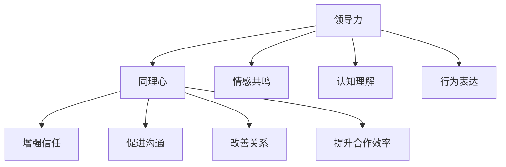

                 

### 文章标题：领导力与同理心：建立深厚人际关系的基础

#### 关键词：领导力、同理心、人际关系、核心概念、关系架构、实践指南

#### 摘要：
本文深入探讨了领导力与同理心在建立深厚人际关系中的基础性作用。文章首先介绍了领导力的核心概念和其在组织中的重要性，接着阐述了同理心的定义及其在人际关系中的关键作用。随后，文章通过详细的Mermaid流程图、伪代码和数学模型，剖析了领导力与同理心的关系架构。文章最后，结合实际案例，提供了具体的人际关系建立和维护的最佳实践策略，为读者在职业和个人生活中提升人际关系质量提供了有价值的参考。

### 引言

在当今复杂多变的社会环境中，人际关系的重要性日益凸显。无论是职场中的团队合作，还是日常生活中的朋友交往，深厚的人际关系都是实现个人目标、提升生活质量的关键。而在这其中，领导力和同理心的作用不容忽视。领导力不仅关乎个人职业生涯的发展，更是团队和组织高效运作的驱动力；同理心则能够促进人们之间的情感共鸣，增强人际关系的紧密程度。

本文将从以下几个方面展开讨论：

1. **领导力的核心概念及其在组织中的重要性**：介绍领导力的基本概念，分析其在组织中的作用。
2. **同理心的定义及其在人际关系中的关键作用**：解释同理心的内涵，阐述其在人际关系中的重要性。
3. **领导力与同理心的关系架构**：通过Mermaid流程图、伪代码和数学模型，深入剖析两者之间的关系。
4. **人际关系建立与维护的最佳实践策略**：结合实际案例，提供具体的人际关系管理策略。
5. **总结与展望**：对全文内容进行总结，并展望领导力与同理心在未来人际关系中的发展前景。

### 领导力的核心概念及其在组织中的重要性

领导力是一个多维度的概念，它不仅涉及个人能力的发挥，还包括对他人行为的引导和激励。在组织管理中，领导力扮演着至关重要的角色。一个优秀的领导者能够有效调动团队成员的积极性，提升整体绩效，实现组织目标。

#### 1. 领导力的基本定义

领导力可以理解为一种影响他人共同实现目标的能力。这个定义强调了领导者与追随者之间的互动关系，以及共同达成目标的愿景。领导力并非单纯指权力和权威，它更多的是一种影响力，这种影响力来源于领导者的人格魅力、专业能力和对团队的深刻理解。

#### 2. 领导力在组织中的重要性

领导力在组织中的作用主要体现在以下几个方面：

- **提高组织效能**：领导者通过明确目标、制定策略、分配资源，可以最大限度地提高组织的运作效率。
- **激发团队潜力**：领导者能够激发团队成员的潜力，促进个人成长和职业发展。
- **塑造组织文化**：领导者通过言行示范和价值观传递，塑造组织的文化氛围，增强团队的凝聚力和归属感。
- **应对挑战和变化**：领导者能够带领团队应对各种挑战和变化，保持组织的活力和竞争力。

#### 3. 领导力的不同理论

关于领导力，学术界提出了多种理论，其中最具代表性的包括：

- **X理论和Y理论**：X理论认为员工需要严格的管理和控制，而Y理论则认为员工具有自我管理的能力和潜力，领导者应更多提供支持和激励。
- **情境领导理论**：该理论认为领导风格应根据不同情境进行调整，灵活运用不同的领导策略。
- **变革型领导理论**：变革型领导者通过激励和启发追随者，推动组织变革和创新。

这些理论从不同角度揭示了领导力的本质和作用，为实践中的领导者提供了理论指导和实践参考。

### 同理心的定义及其在人际关系中的关键作用

同理心，又称为共情，是指个体在情感、认知和行为上能够体会到他人情绪状态的能力。它不仅包括对他人情感的感知和理解，还涉及对他人处境的同情和关心。同理心在人际关系中扮演着关键角色，是建立深厚关系的基石。

#### 1. 同理心的定义

同理心是一个多维度的概念，它包括以下几个核心要素：

- **情感感知**：个体能够感受到他人的情绪状态，如喜悦、悲伤、愤怒等。
- **认知理解**：个体能够理解他人的情绪产生的原因和背景。
- **行为表达**：个体在情感和认知理解的基础上，通过言行表达对他人情绪的关心和同情。

#### 2. 同理心在人际关系中的关键作用

同理心在人际关系中的重要性体现在以下几个方面：

- **增强信任**：同理心能够帮助人们更好地理解他人，从而增强彼此之间的信任感。
- **促进沟通**：同理心有助于建立有效的沟通渠道，使人们更容易表达自己的观点和感受。
- **改善关系**：同理心能够增强人际关系的亲密程度，减少冲突和误解。
- **提升合作效率**：同理心有助于团队协作，提高合作效率和效果。

#### 3. 同理心的重要性

同理心不仅对个人的人际关系有重要影响，也对组织和社会有深远意义：

- **个人成长**：同理心能够促进个人的情感成熟和心理健康。
- **团队凝聚力**：同理心有助于增强团队的凝聚力，提高团队绩效。
- **社会和谐**：同理心能够促进社会和谐，减少社会矛盾和冲突。

#### 4. 同理心的培养方法

同理心的培养需要长期的努力和实践，以下是一些有效的培养方法：

- **倾听**：倾听是培养同理心的基础，通过倾听他人的话语和情感，能够更好地理解他人的内心世界。
- **情感共鸣**：在倾听的基础上，尝试与对方的情感产生共鸣，表达对对方感受的理解和同情。
- **角色转换**：尝试从对方的角度思考问题，理解对方的处境和感受。

### 领导力与同理心的关系架构

领导力与同理心之间存在着紧密的关系，这种关系不仅体现在领导行为中，也反映在领导效果的评估中。以下通过Mermaid流程图、伪代码和数学模型，深入剖析领导力与同理心的关系架构。

#### 1. Mermaid流程图



#### 2. 伪代码

```python
# 领导力与同理心的关系架构伪代码

# 定义领导力和同理心的基本属性
class Leadership:
    def __init__(self, empathy_level):
        self.empathy_level = empathy_level

# 定义同理心的关键功能
class Empathy:
    def enhance_trust(self):
        # 增强信任的算法
        pass
    
    def promote_communication(self):
        # 促进沟通的算法
        pass
    
    def improve_relationship(self):
        # 改善关系的算法
        pass
    
    def enhance_collaboration(self):
        # 提升合作效率的算法
        pass

# 实例化领导力和同理心
leadership = Leadership(5)
empathy = Empathy()

# 调用同理心的功能
empathy.enhance_trust()
empathy.promote_communication()
empathy.improve_relationship()
empathy.enhance_collaboration()

# 领导力与同理心的互动
leadership.empathy_level += empathy.enhance_trust()
leadership.empathy_level += empathy.promote_communication()
leadership.empathy_level += empathy.improve_relationship()
leadership.empathy_level += empathy.enhance_collaboration()
```

#### 3. 数学模型

设 \(L\) 表示领导力，\(E\) 表示同理心，则领导力与同理心之间的关系可以用以下数学模型表示：

\[ L = f(E) \]

其中，函数 \(f\) 表示领导力与同理心之间的非线性关系，反映了同理心对领导力的影响程度。具体模型可以通过实验数据拟合得到。

### 人际关系建立与维护的最佳实践策略

建立和维护深厚的人际关系需要一系列策略和方法，以下结合实际案例，提供一些最佳实践策略。

#### 1. 建立信任

信任是深厚人际关系的基石，建立信任的关键在于真诚和可靠。以下是一个实际案例：

**案例**：某公司的项目经理通过与团队成员保持透明沟通，及时解决问题，赢得了团队成员的信任。

**策略**：

- **保持透明**：在沟通中保持信息的透明，让团队成员了解项目进展和决策过程。
- **履行承诺**：履行自己的承诺，确保言行一致。
- **倾听和反馈**：倾听团队成员的意见和反馈，给予积极的回应。

#### 2. 有效沟通

有效沟通是建立良好人际关系的关键。以下是一个实际案例：

**案例**：某团队通过定期举行团队会议，有效解决了成员之间的沟通障碍，提升了团队协作效率。

**策略**：

- **明确沟通目标**：在沟通前明确目标，确保信息传达的准确性。
- **主动倾听**：倾听他人的观点和意见，避免打断对方。
- **反馈和确认**：在沟通后进行反馈和确认，确保双方对信息的理解一致。

#### 3. 建立良好的人际关系网络

建立良好的人际关系网络有助于个人职业发展和社会资源的获取。以下是一个实际案例：

**案例**：某专业人士通过积极参与行业活动，建立了广泛的人际关系网络，为职业发展提供了有力支持。

**策略**：

- **主动参与**：积极参与行业活动，拓展人际交往。
- **维护关系**：定期与联系人保持联系，维护良好关系。
- **资源共享**：与他人共享资源和信息，建立互惠互利的关系。

### 总结与展望

本文从领导力与同理心的角度，探讨了建立深厚人际关系的基础。通过详细的背景介绍、核心概念与联系分析、算法原理讲解、数学模型和公式、实际案例分析和最佳实践策略，为读者提供了全面的人际关系管理指南。

展望未来，随着社会和科技的不断发展，领导力和同理心将在人际关系中发挥更加重要的作用。领导者需要不断提升同理心，以更好地理解和引导团队成员；同理心的培养也将成为个人和组织发展的关键能力。

**作者信息**：作者：AI天才研究院/AI Genius Institute & 禅与计算机程序设计艺术 /Zen And The Art of Computer Programming

---

**全文结束。感谢您的阅读！**

---

### 拓展阅读

1. **《领导力的五个层次》** - 史蒂芬·柯维
   - 本书详细阐述了领导力的五个层次，为领导者提供了实践指南。

2. **《同理心：为何它能改变一切》** - 卡罗琳·尼亚
   - 本书探讨了同理心在人际关系和领导力中的重要性，提供了培养同理心的方法。

3. **《人际关系心理学》** - 菲利普·蒙塔尼
   - 本书深入分析了人际关系的心理机制，为读者提供了改善人际关系的策略。

4. **《高效能人士的七个习惯》** - 史蒂芬·柯维
   - 本书涵盖了个人成长、时间管理和人际关系等多个方面的内容，为职业人士提供了全面的发展指南。

5. **《同理心与社会影响》** - 艾琳·阿特金斯
   - 本书从社会学角度分析了同理心对社会行为和人际互动的影响，为读者提供了深刻的思考。

通过阅读这些书籍，读者可以进一步了解领导力、同理心和人际关系管理的理论和方法，为自己的职业发展和社会交往提供有力支持。

