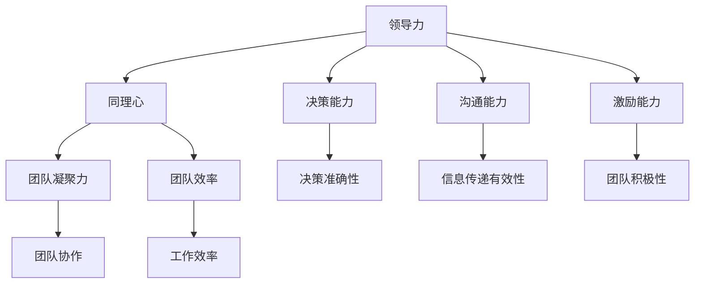

                 

### 文章标题：领导力与同理心：理解团队需求的能力

> 关键词：领导力，同理心，团队管理，沟通能力，决策能力，激励，团队建设，冲突管理，案例分析

> 摘要：本文探讨了领导力与同理心在团队管理中的重要性，分析了它们的核心概念及其相互联系。通过详细阐述领导力的核心要素、同理心的培养与实践，以及领导力与同理心在团队管理中的应用，本文旨在为读者提供关于如何有效运用这些能力提升团队绩效的深入见解。

### 核心概念与联系

在探讨领导力与同理心之前，我们需要明确这两个核心概念的定义和它们之间的联系。

**领导力的定义与作用**  
领导力是指领导者通过影响、激励和指导他人来达成组织目标的能力。它不仅涉及决策和沟通，还包括激励、决策和冲突管理等。

**同理心的概念与价值**  
同理心是指理解和感受他人情感的能力。它是一种重要的社交技能，能够帮助领导者更好地理解团队成员的需求和想法，从而提高团队的凝聚力和工作效率。

**领导力与同理心的联系**  
领导力与同理心密切相关。同理心是领导力的重要组成部分，它帮助领导者更好地理解团队成员，建立信任，激发团队成员的潜力，从而实现组织目标。一个成功的领导者需要具备良好的同理心，以便更好地应对团队中的各种挑战。

### Mermaid 流程图：领导力与同理心的关系架构

### 核心概念与联系总结

领导力与同理心是两个关键概念，它们在团队管理中起着重要作用。领导力通过决策能力、沟通能力和激励能力等核心要素，帮助领导者实现组织目标。同理心则通过理解团队成员的情感需求，提高团队的凝聚力和工作效率。这两个概念相互联系，共同构建了一个成功的团队管理框架。

## 第1章：领导力与同理心概述

### 1.1 领导力的定义与作用

领导力是指领导者通过影响、激励和指导他人来达成组织目标的能力。它不仅仅是权威和指挥，更是一种影响力。领导者通过自己的行为和决策来影响团队成员，激发他们的潜能，共同实现组织的目标。

在组织中，领导力起着至关重要的作用。首先，领导力能够推动组织的战略实施。领导者需要根据组织的愿景和目标，制定相应的战略计划，并确保团队成员理解并执行这些计划。其次，领导力有助于提升团队的绩效。通过有效的沟通和激励，领导者能够激发团队成员的积极性和创造力，从而提高整体的工作效率。最后，领导力有助于塑造组织的文化。领导者通过自己的行为和价值观来影响团队成员，塑造一个积极向上的组织氛围。

### 1.2 同理心的概念与价值

同理心是指理解和感受他人情感的能力。它不仅仅是对他人情感的认同，更是一种情感共鸣。一个具备同理心的领导者能够站在团队成员的角度思考问题，理解他们的情感需求，从而更好地支持他们。

同理心在团队管理中具有很高的价值。首先，同理心有助于建立信任。当团队成员感受到领导者理解并关心他们的情感需求时，他们会更加信任领导者，并愿意追随和合作。其次，同理心有助于提高团队的凝聚力。领导者通过同理心，能够更好地处理团队成员之间的冲突，促进团队的合作和协作。最后，同理心有助于激发团队成员的潜力。领导者通过同理心，能够更好地了解团队成员的优势和不足，从而为他们提供更有针对性的支持和指导。

### 1.3 领导力与同理心的联系

领导力与同理心密切相关，它们共同构成了一个成功的团队管理框架。

首先，同理心是领导力的重要组成部分。一个成功的领导者必须具备同理心，能够理解并感受团队成员的情感需求。这种能力有助于领导者更好地与团队成员沟通，建立信任，并激发他们的潜力。

其次，领导力是同理心的基础。领导者的角色要求他们具备决策能力、沟通能力和激励能力等核心要素。这些能力都是基于同理心的发展，领导者通过同理心，能够更准确地理解和预测团队成员的需求和情感。

最后，领导力与同理心的结合能够实现组织的目标。一个成功的领导者不仅能够制定和执行有效的战略计划，还能够通过同理心，激发团队成员的积极性和创造力，从而实现组织的目标。

### 总结

领导力与同理心是团队管理中不可或缺的两个概念。领导力通过决策能力、沟通能力和激励能力等核心要素，帮助领导者实现组织目标。同理心则通过理解团队成员的情感需求，提高团队的凝聚力和工作效率。这两个概念相互联系，共同构成了一个成功的团队管理框架。一个成功的领导者需要同时具备领导力和同理心，才能在团队管理中取得成功。

### 开篇案例：苹果公司的领导力与同理心实践

苹果公司作为全球科技巨头，以其卓越的领导力和同理心实践而闻名。乔布斯，作为苹果公司的联合创始人，堪称领导力的典范。他不仅具备卓越的决策能力和沟通能力，更重要的是，他具备深刻的同理心。

乔布斯在产品设计过程中，始终坚持以用户为中心。他深入理解用户的需求和情感，通过不断的实验和改进，打造出一系列深受用户喜爱的产品。这种同理心的体现，不仅提升了用户对苹果产品的忠诚度，也大大增强了团队的凝聚力。

同时，乔布斯在团队管理中也表现出色。他能够站在团队成员的角度思考问题，理解他们的情感需求，并给予他们充分的信任和支持。这使得团队成员在创造过程中充满激情，愿意为苹果公司付出更多的努力。

通过这个案例，我们可以看到，领导力与同理心在团队管理中的重要性。一个成功的领导者不仅需要具备卓越的领导力，还需要具备同理心，这样才能在团队中建立信任，激发团队成员的潜力，实现组织的目标。

### 1.4 领导力与同理心在实际工作中的应用

在实际工作中，领导力与同理心的应用至关重要。首先，在团队建设方面，领导者需要通过同理心了解团队成员的个性和需求，从而制定相应的团队建设策略。例如，一个团队成员可能需要更多的鼓励和支持，而另一个团队成员可能更需要自主空间和挑战。通过同理心，领导者可以更好地调动团队成员的积极性，提高团队的整体绩效。

其次，在沟通方面，领导者需要运用良好的沟通能力，确保信息的准确传递。同理心在这个过程中起到了关键作用。领导者可以通过同理心，更好地理解团队成员的情感状态，避免误解和冲突。例如，当一个团队成员情绪低落时，领导者可以通过同理心，主动关心和倾听，从而缓解团队成员的压力，提高团队的士气。

再次，在冲突管理方面，同理心同样至关重要。领导者需要通过同理心，理解冲突双方的立场和情感，从而找到解决问题的最佳方案。例如，在一个团队中，如果两个成员发生了冲突，领导者可以通过同理心，了解双方的情感需求，从而找到一个双方都能接受的解决方案，避免冲突升级。

最后，在激励方面，领导者需要通过同理心，了解团队成员的潜力和需求，从而制定有针对性的激励措施。例如，一个团队成员可能需要更多的认可和奖励，而另一个团队成员可能更需要机会来展示自己的能力。通过同理心，领导者可以更好地激发团队成员的潜力，提高团队的整体绩效。

### 1.5 领导力与同理心的实践意义

领导力与同理心的实践对于团队管理具有重要意义。首先，它有助于建立信任。一个具备同理心的领导者能够更好地理解团队成员的需求和情感，从而赢得他们的信任。这种信任是团队协作和高效工作的重要基础。

其次，领导力与同理心的实践有助于提高团队的凝聚力。当团队成员感受到领导者的关心和支持时，他们会更加愿意为团队的目标努力，从而增强团队的凝聚力。

再次，领导力与同理心的实践有助于激发团队成员的潜力。一个具备同理心的领导者能够更好地发现团队成员的优势和不足，从而为他们提供有针对性的支持和指导，帮助他们实现个人和职业成长。

最后，领导力与同理心的实践有助于实现组织的目标。通过同理心，领导者可以更好地理解团队成员的需求和情感，从而制定更符合团队成员实际情况的战略计划，提高团队的执行力和效率，最终实现组织的目标。

### 实践技巧

为了更好地将领导力与同理心应用到实际工作中，领导者可以尝试以下实践技巧：

1. **倾听与关注**：领导者需要主动倾听团队成员的意见和需求，关注他们的情感状态，从而更好地理解他们的需求和期望。

2. **积极沟通**：领导者需要通过积极的沟通，确保信息的准确传递，避免误解和冲突。

3. **尊重与支持**：领导者需要尊重团队成员的意见和选择，提供必要的支持和帮助，从而增强他们的自信心和积极性。

4. **个性化管理**：领导者需要根据团队成员的个性和需求，制定个性化的管理策略，从而更好地调动他们的积极性。

5. **反思与改进**：领导者需要不断反思自己的领导方式，根据团队成员的反馈和实际情况，不断改进自己的管理方法。

### 总结

领导力与同理心是团队管理中不可或缺的两个概念。通过理解和运用这些能力，领导者可以更好地理解团队成员的需求，建立信任，提高团队的凝聚力和工作效率。在实际工作中，领导者可以通过倾听与关注、积极沟通、尊重与支持、个性化管理和反思与改进等实践技巧，将领导力与同理心应用到团队管理中，从而实现组织的目标。

## 第2章：领导力的核心要素

领导力并不仅仅是权威和命令，它是一种能力，一种能够在复杂多变的环境中引导和激励团队成员实现共同目标的能力。要成为一名成功的领导者，需要具备多个核心要素，其中包括沟通能力、决策能力、激励能力等。这些要素共同构成了领导力的基石，下面我们将逐一探讨。

### 2.1 沟通能力

沟通能力是领导力的核心要素之一。一个成功的领导者需要具备清晰、有效的沟通技巧，以确保信息准确传达，减少误解和冲突。良好的沟通能力不仅有助于建立信任，还能提高团队的协作效率和执行力。

**沟通的重要性**：  
- **建立信任**：通过良好的沟通，领导者可以展示自己的透明度和开放性，从而赢得团队成员的信任。
- **减少误解**：清晰、明确的沟通可以避免信息的扭曲和误解，确保团队成员理解正确的指令和目标。
- **提高效率**：有效的沟通能够确保团队成员迅速响应和执行任务，从而提高工作效率。

**沟通技巧**：  
- **倾听**：领导者需要主动倾听团队成员的意见和需求，理解他们的情感状态，从而做出更合理的决策。
- **表达**：领导者需要清晰、准确地表达自己的想法和指令，避免模糊和歧义。
- **反馈**：领导者需要及时给予团队成员反馈，肯定他们的工作成果，指出改进方向。

### 2.2 决策能力

决策能力是领导者必须具备的重要技能。在一个复杂多变的环境中，领导者需要能够快速做出明智的决策，以引导团队走向成功。

**决策的重要性**：  
- **明确方向**：决策能力有助于领导者为团队设定明确的目标和方向，确保团队成员的努力不会偏离组织的目标。
- **应对挑战**：在面对突发情况和挑战时，领导者需要能够迅速做出决策，以应对变化和解决问题。
- **优化资源**：良好的决策能力有助于领导者合理配置资源，提高团队的整体绩效。

**决策技巧**：  
- **信息收集**：领导者需要收集和分析相关信息，以确保决策有据可依。
- **风险评估**：领导者需要评估各种决策可能带来的风险和收益，选择最优方案。
- **快速决策**：在紧急情况下，领导者需要能够迅速做出决策，避免延误。

### 2.3 鼓励与激励

激励能力是领导者激发团队成员潜力和动力的重要手段。一个成功的领导者需要能够通过鼓励和激励，激发团队成员的积极性和创造力。

**激励的重要性**：  
- **提高绩效**：激励能够激发团队成员的积极性和创造力，提高团队的整体绩效。
- **促进创新**：通过激励，领导者可以鼓励团队成员尝试新的方法和思路，促进创新和进步。
- **增强团队凝聚力**：激励不仅能够提升个人绩效，还能增强团队之间的凝聚力，促进团队合作。

**激励技巧**：  
- **认可与奖励**：领导者需要及时认可团队成员的成就，提供适当的奖励，以激励他们继续努力。
- **目标设定**：领导者需要为团队成员设定具有挑战性的目标，激励他们不断追求卓越。
- **情感支持**：领导者需要关注团队成员的情感需求，提供必要的支持和鼓励，帮助他们克服困难。

### 2.4 领导力的综合应用

领导力的核心要素并不是孤立存在的，它们相互关联，共同构成了领导力的整体框架。一个成功的领导者需要能够在实际工作中灵活运用这些要素，以应对不同的挑战和情境。

- **沟通能力**：领导者需要通过有效的沟通，确保团队成员理解并支持组织的决策和目标。
- **决策能力**：在复杂多变的环境中，领导者需要能够迅速做出明智的决策，引导团队走向成功。
- **激励能力**：通过鼓励和激励，领导者可以激发团队成员的积极性和创造力，提高团队的整体绩效。

### 总结

领导力的核心要素是沟通能力、决策能力和激励能力。这些要素相互关联，共同构成了领导力的整体框架。一个成功的领导者需要能够灵活运用这些要素，以应对不同的挑战和情境，从而实现团队的目标。在实际工作中，领导者需要不断提升自己的沟通、决策和激励能力，通过实践和反思，不断优化自己的领导方式，成为一名卓越的领导者。

### 开篇案例：谷歌公司的领导力实践

谷歌公司作为全球知名的科技公司，以其卓越的领导力和企业文化建设而著称。谷歌的领导者们在实际工作中，充分展示了领导力的核心要素，特别是在沟通能力、决策能力和激励能力方面的卓越表现。

首先，谷歌的领导者们具备出色的沟通能力。他们鼓励开放、透明和自由的沟通氛围，允许员工自由表达自己的意见和想法。这种沟通文化不仅增强了员工之间的信任和合作，还促进了创新和进步。例如，谷歌的“员工反馈会议”制度，允许员工匿名提出对公司政策和管理建议，领导者们会认真倾听并采纳这些建议，从而不断改进公司的管理和运营。

其次，谷歌的领导者们在决策能力方面表现出色。他们能够在复杂多变的市场环境中，迅速做出明智的决策，以保持公司的竞争优势。例如，谷歌在互联网搜索领域的决策，从最初的“Google Search”到后来的“Google Ads”，再到如今的人工智能和云计算服务，谷歌的领导者们始终能够准确判断市场趋势，做出符合公司长远发展的战略决策。

最后，谷歌的领导者们在激励能力方面也有独特的实践。他们通过认可和奖励，激励员工不断追求卓越。谷歌的“10%自由时间”政策，允许员工将10%的工作时间用于个人项目和创新，这种政策不仅激发了员工的创造力，还为公司带来了许多创新产品和业务机会。此外，谷歌的领导者在员工评价和晋升方面，也注重全面、公正和公开，确保每个员工都能得到公平的机会和认可。

通过谷歌公司的案例，我们可以看到，领导力的核心要素在实际工作中的具体应用。一个成功的领导者需要具备出色的沟通能力、决策能力和激励能力，这些能力相互结合，共同构成了领导力的整体框架。谷歌公司的成功经验，为其他公司提供了宝贵的借鉴和启示。

### 2.5 领导力与同理心的关系

领导力与同理心之间存在着密切的关系。同理心是领导力的核心要素之一，它不仅影响着领导者的沟通和决策，还直接影响着团队的整体绩效。

首先，同理心是领导力的重要组成部分。一个具备同理心的领导者能够更好地理解团队成员的情感需求和期望，从而做出更合理的决策。例如，在一个团队成员情绪低落时，领导者可以通过同理心，主动关心和倾听，提供必要的支持和鼓励，帮助团队成员走出困境，恢复积极状态。

其次，同理心有助于建立信任。当团队成员感受到领导者理解并关心他们的情感需求时，他们会更加信任领导者，并愿意追随和合作。这种信任是团队协作和高效工作的重要基础。

最后，同理心有助于提高团队的凝聚力。领导者通过同理心，能够更好地处理团队成员之间的冲突，促进团队的合作和协作。例如，在一个团队中，如果两个成员发生了冲突，领导者可以通过同理心，理解双方的情感需求，从而找到一个双方都能接受的解决方案，避免冲突升级。

### 2.6 同理心的具体表现与应用

同理心在领导力中的应用具体而多样，主要体现在以下几个方面：

**倾听与理解**：领导者需要通过倾听，理解团队成员的想法和情感。这不仅包括在会议和讨论中积极倾听，还包括在日常工作中的随机交流和观察。例如，当团队成员遇到困难时，领导者可以通过倾听，了解问题的根源，并提供有效的帮助。

**情感共鸣**：同理心还表现为领导者能够在情感上与团队成员产生共鸣。这意味着领导者能够感受到团队成员的喜怒哀乐，并在适当的时候给予情感上的支持和鼓励。例如，当一个团队成员取得重大成就时，领导者可以通过真诚的赞美和祝贺，增强团队成员的自信心和归属感。

**情感反馈**：同理心的另一个体现是领导者能够给予团队成员情感上的反馈。这意味着领导者不仅关注团队成员的工作成果，还关注他们的情感状态。例如，在员工绩效评估时，领导者不仅评估工作表现，还关注员工的情感需求，提供有针对性的反馈和建议。

**情感支持**：同理心还要求领导者能够在团队成员需要时提供情感上的支持。这包括在团队成员遇到挫折或困难时，给予关心和鼓励，帮助他们克服困难，重拾信心。例如，当一个团队成员在工作中遇到挑战时，领导者可以通过情感支持，帮助他们找到解决问题的方法，从而提高团队的整体绩效。

### 总结

领导力与同理心之间存在着密切的关系。同理心不仅是领导力的重要组成部分，还直接影响着团队的整体绩效。通过倾听与理解、情感共鸣、情感反馈和情感支持等具体表现，领导者可以更好地理解团队成员的需求，建立信任，提高团队的凝聚力，从而实现团队的目标。在实际工作中，领导者需要不断提升同理心，将其融入领导实践中，以成为一名更出色的领导者。

## 第3章：同理心的培养与实践

同理心是一种可以通过学习和实践培养的能力。领导者可以通过多种方式来提升自己的同理心，包括阅读相关书籍、参加培训课程、进行角色扮演等。以下将详细探讨这些培养方式，并分享一些实用的同理心培养技巧。

### 3.1 同理心的培养方式

**阅读相关书籍**：阅读是提升同理心的一种有效方式。通过阅读心理学、人际关系等相关领域的书籍，领导者可以学习到如何更好地理解他人。例如，经典著作《如何赢得朋友与影响他人》和《非暴力沟通》都是提高同理心的优秀书籍。这些书籍提供了丰富的理论知识和实践技巧，有助于领导者更好地理解和应对团队成员的情感需求。

**参加培训课程**：参加专门的培训课程是提升同理心的一种直接方式。这些课程通常由专业人士设计和教授，包括角色扮演、情境模拟等互动环节，帮助领导者更好地理解和应用同理心。例如，一些知名的培训机构如哈佛大学肯尼迪学院和伦敦商学院都提供相关课程，帮助领导者提升领导力和同理心。

**进行角色扮演**：角色扮演是一种通过模拟实际情境来培养同理心的方法。领导者可以参与角色扮演练习，通过扮演不同角色来体验他人的情感状态和需求。这种体验有助于领导者更好地理解和感受他人的情感，从而提升同理心。例如，在一个角色扮演练习中，领导者可以扮演一个刚加入团队的员工，体验他们初来乍到时的感受和需求，从而更好地理解和支持他们。

**反思与自省**：领导者需要通过反思和自省来提升同理心。在日常工作结束后，领导者可以回顾自己的行为和决策，思考哪些做法有助于提升团队成员的情感状态，哪些做法可能引起误解或冲突。通过不断反思和改进，领导者可以逐步提升自己的同理心。

### 3.2 同理心的实践技巧

**倾听与关注**：领导者需要培养倾听与关注的习惯。在交流中，领导者应保持开放的心态，全神贯注地倾听团队成员的意见和需求，避免打断或中断他们的发言。通过倾听，领导者可以更好地理解团队成员的情感状态，从而提供更有针对性的支持和帮助。

**情感共鸣**：领导者需要学会在情感上与团队成员产生共鸣。这意味着领导者能够在情感上感受到团队成员的喜怒哀乐，并在适当的时候给予情感上的支持和鼓励。例如，当一个团队成员取得重大成就时，领导者可以通过真诚的赞美和祝贺，增强团队成员的自信心和归属感。

**情感反馈**：领导者需要学会给予团队成员情感上的反馈。这不仅包括工作上的反馈，还包括情感上的关怀。领导者可以通过表达关心和认可，帮助团队成员感受到自己的价值，从而增强他们的积极性和创造力。

**情感支持**：在团队成员需要时，领导者需要提供情感上的支持。这包括在团队成员遇到挫折或困难时，给予关心和鼓励，帮助他们克服困难，重拾信心。例如，当一个团队成员在工作中遇到挑战时，领导者可以通过情感支持，帮助他们找到解决问题的方法，从而提高团队的整体绩效。

### 3.3 同理心在实践中的应用

**团队建设**：同理心在团队建设过程中起着重要作用。领导者可以通过同理心，了解团队成员的需求和情感，从而制定更符合团队实际情况的团队建设策略。例如，一个团队成员可能需要更多的鼓励和支持，而另一个团队成员可能更需要自主空间和挑战。通过同理心，领导者可以更好地调动团队成员的积极性，提高团队的整体绩效。

**冲突管理**：同理心在冲突管理中也具有很高的价值。领导者可以通过同理心，理解冲突双方的立场和情感，从而找到解决问题的最佳方案。例如，在一个团队中，如果两个成员发生了冲突，领导者可以通过同理心，了解双方的情感需求，从而找到一个双方都能接受的解决方案，避免冲突升级。

**激励**：同理心在激励团队成员方面也具有重要作用。领导者可以通过同理心，了解团队成员的潜力和需求，从而制定有针对性的激励措施。例如，一个团队成员可能需要更多的认可和奖励，而另一个团队成员可能更需要机会来展示自己的能力。通过同理心，领导者可以更好地激发团队成员的潜力，提高团队的整体绩效。

### 总结

同理心是一种可以通过学习和实践培养的能力。通过阅读相关书籍、参加培训课程、进行角色扮演等方式，领导者可以不断提升自己的同理心。在实际工作中，领导者需要将同理心应用到团队建设、冲突管理和激励等各个方面，从而提高团队的凝聚力和工作效率。通过倾听与关注、情感共鸣、情感反馈和情感支持等实践技巧，领导者可以更好地理解团队成员的需求，建立信任，提高团队的绩效。

## 第4章：领导力与同理心在团队管理中的应用

### 4.1 团队建设

团队建设是领导力与同理心在团队管理中的重要应用之一。一个成功的团队需要具备高度的凝聚力、协作能力和创新能力。领导力与同理心在团队建设过程中起着至关重要的作用，它们能够帮助领导者更好地理解团队成员的需求，提升团队的绩效。

**领导力在团队建设中的应用**：

- **设定共同目标**：领导者需要通过有效的沟通，确保团队成员理解并认同团队的目标。这有助于激发团队成员的积极性和归属感，提高团队的整体绩效。

- **激励团队成员**：领导者需要运用激励能力，激发团队成员的潜力，鼓励他们发挥最佳水平。通过设定有挑战性的目标、提供奖励和认可，领导者可以激发团队成员的积极性和创造力。

- **冲突管理**：团队中难免会出现冲突，领导者需要运用领导力，及时处理和解决冲突，避免冲突升级。通过同理心，领导者可以理解冲突双方的立场和情感，找到双赢的解决方案。

**同理心在团队建设中的应用**：

- **了解团队成员**：领导者需要通过同理心，了解团队成员的个性和需求。这有助于领导者更好地分配任务，调动团队成员的积极性，提高团队的整体绩效。

- **建立信任**：同理心有助于建立团队成员之间的信任。当团队成员感受到领导者理解并关心他们的需求时，他们会更加信任领导者，愿意追随和合作。这种信任是团队协作和高效工作的重要基础。

- **情感支持**：领导者需要通过同理心，为团队成员提供情感支持。当团队成员遇到困难或挫折时，领导者可以通过关心和支持，帮助他们重拾信心，克服困难。

**案例：谷歌的团队建设**：

谷歌公司以其卓越的团队建设而闻名。谷歌的领导者们通过领导力和同理心，成功地打造了一支高度协作、创新和高效的团队。以下是谷歌团队建设的几个关键点：

- **共同目标**：谷歌的领导者们通过明确的沟通，确保团队成员理解并认同公司的使命和愿景。这种共同目标不仅增强了团队成员的归属感，还激发了他们的积极性和创造力。

- **激励机制**：谷歌通过多种激励机制，如“10%自由时间”政策、员工福利和奖励，激励团队成员发挥最佳水平。这种激励机制不仅提升了员工的工作积极性，还促进了公司的创新和进步。

- **冲突管理**：谷歌的领导者们通过同理心，处理团队中的冲突。他们不仅关注冲突本身，还关注冲突双方的情感需求，找到双赢的解决方案。这种冲突管理方式有助于维护团队的稳定和协作。

- **情感支持**：谷歌的领导者们通过同理心，为团队成员提供情感支持。他们在团队成员遇到困难时，主动关心并提供帮助，帮助团队成员重拾信心，克服挑战。

### 4.2 冲突管理

冲突是团队管理中不可避免的一部分。有效的冲突管理能够帮助团队解决问题，提高整体绩效。领导力与同理心在冲突管理中起着关键作用，它们能够帮助领导者更好地理解冲突的本质，找到合适的解决方案。

**领导力在冲突管理中的应用**：

- **识别冲突**：领导者需要敏锐地识别团队中的潜在冲突。这包括了解团队成员的需求和期望，及时发现和解决冲突的苗头。

- **沟通**：领导者需要通过有效的沟通，确保冲突双方充分表达自己的观点和需求。这有助于减少误解和误判，找到解决问题的最佳方案。

- **决策**：在冲突管理中，领导者需要做出明智的决策，以平衡冲突双方的利益。这需要领导者具备良好的决策能力和同理心，确保决策公平、合理。

**同理心在冲突管理中的应用**：

- **理解冲突双方**：领导者需要通过同理心，理解冲突双方的立场和情感。这有助于领导者更好地理解冲突的本质，找到合适的解决方案。

- **情感支持**：同理心有助于领导者为冲突双方提供情感支持。当冲突双方情绪激动时，领导者可以通过同理心，帮助他们冷静下来，理性地解决问题。

- **建立信任**：同理心有助于建立冲突双方之间的信任。当冲突双方感受到领导者理解并关心他们的需求时，他们会更愿意合作，共同解决问题。

**案例：亚马逊的冲突管理**：

亚马逊公司以其高效的团队和冲突管理而著称。亚马逊的领导者们通过领导力和同理心，成功地处理了团队中的各种冲突。以下是亚马逊冲突管理的几个关键点：

- **透明的沟通**：亚马逊的领导者们鼓励团队成员自由表达自己的观点和需求。这种开放和透明的沟通方式有助于及时发现和解决冲突。

- **同理心**：亚马逊的领导者们通过同理心，理解冲突双方的立场和情感。他们不仅关注冲突本身，还关注冲突双方的需求和期望，找到合适的解决方案。

- **公正的决策**：亚马逊的领导者们在处理冲突时，始终保持公正和客观。他们通过充分的沟通和讨论，确保决策公平、合理，得到冲突双方的理解和支持。

- **情感支持**：亚马逊的领导者们通过同理心，为冲突双方提供情感支持。他们在冲突双方情绪激动时，主动关心并提供帮助，帮助他们冷静下来，理性地解决问题。

### 4.3 团队激励

团队激励是领导力与同理心在团队管理中的另一个重要应用。有效的团队激励能够激发团队成员的积极性和创造力，提高团队的整体绩效。

**领导力在团队激励中的应用**：

- **设定目标**：领导者需要为团队成员设定具有挑战性的目标，激发他们的积极性和创造力。这些目标应与团队的整体目标一致，确保团队成员的努力方向正确。

- **认可与奖励**：领导者需要及时认可团队成员的成就和贡献，提供适当的奖励。这可以包括物质奖励和精神激励，如奖金、晋升机会和公开表彰等。

- **提供反馈**：领导者需要为团队成员提供及时的反馈，帮助他们了解自己的表现和进步。这有助于团队成员明确自己的发展方向，不断改进和提高。

**同理心在团队激励中的应用**：

- **了解需求**：领导者需要通过同理心，了解团队成员的需求和期望。这有助于领导者制定更有针对性的激励措施，满足团队成员的情感需求。

- **情感支持**：同理心有助于领导者为团队成员提供情感支持，鼓励他们在困难和挑战面前坚持不懈。这种情感支持可以增强团队成员的自信心和归属感。

- **促进成长**：同理心可以帮助领导者更好地理解团队成员的潜力和发展需求，为他们提供成长的机会和支持。这有助于团队成员实现个人和职业的成长。

**案例：微软的团队激励**：

微软公司以其卓越的团队激励措施而闻名。微软的领导者们通过领导力和同理心，成功地激发了团队成员的积极性和创造力。以下是微软团队激励的几个关键点：

- **明确的挑战性目标**：微软的领导者们为团队成员设定具有挑战性的目标，激发他们的积极性和创造力。这些目标不仅与团队的整体目标一致，还能激发团队成员的内在动力。

- **多样化的奖励机制**：微软通过多样化的奖励机制，如奖金、股票期权和员工福利等，激励团队成员。这些奖励不仅能够满足物质需求，还能提升团队成员的荣誉感和归属感。

- **及时的反馈和沟通**：微软的领导者们为团队成员提供及时的反馈和沟通，帮助他们了解自己的表现和进步。这种反馈和沟通有助于团队成员明确自己的发展方向，不断改进和提高。

- **关注个人成长**：微软的领导者们通过同理心，了解团队成员的潜力和发展需求，为他们提供成长的机会和支持。这种关注和培养不仅有助于团队成员实现个人和职业的成长，还增强了团队的凝聚力。

### 总结

领导力与同理心在团队管理中具有广泛的应用。通过团队建设、冲突管理和团队激励等实践，领导者可以更好地理解团队成员的需求，提升团队的凝聚力和工作效率。通过领导力和同理心的有效结合，领导者可以打造一支高效、创新和协作的团队，实现组织的长期目标。

## 第5章：领导力与同理心的实践案例分析

### 5.1 成功团队的领导力与同理心实践

**案例一：谷歌的领导力与同理心实践**

谷歌公司以其卓越的领导力和同理心实践而闻名。以下是一个关于谷歌团队成功实践的案例分析。

**背景**：谷歌是一个高速发展的科技公司，其团队在创新和执行力方面表现出色。谷歌的领导者们通过高效的领导力和同理心，成功地推动了公司的持续发展和创新。

**领导力实践**：

- **明确目标**：谷歌的领导者们通过设定清晰、具有挑战性的目标，激发了团队成员的积极性和创造力。这些目标不仅与公司的长期愿景一致，还能激发团队成员的内在动力。

- **鼓励创新**：谷歌的领导者们鼓励团队成员大胆尝试，勇于创新。他们通过提供资源和支持，帮助团队成员克服困难，实现创新目标。

- **透明沟通**：谷歌的领导者们倡导透明和开放的沟通文化。他们定期与团队成员交流，听取他们的意见和建议，确保团队成员理解公司的战略和目标。

**同理心实践**：

- **了解需求**：谷歌的领导者们通过同理心，了解团队成员的需求和期望。他们关注团队成员的职业发展，提供个性化的培养计划，帮助团队成员实现个人和职业的成长。

- **情感支持**：谷歌的领导者们在团队成员遇到困难或挫折时，提供情感上的支持。他们鼓励团队成员积极面对挑战，找到解决问题的方法。

**结果**：通过领导力和同理心的有效结合，谷歌成功地打造了一支高效、创新和协作的团队。团队成员在明确的目标和强烈的归属感下，不断追求卓越，推动了公司的发展和成功。

### 5.2 失败团队的领导力与同理心反思

**案例二：某大型制造企业的失败案例**

**背景**：某大型制造企业由于领导力与同理心不足，导致团队绩效不佳，最终面临严重的经营困境。

**领导力问题**：

- **缺乏明确的领导**：企业领导者缺乏明确的领导力和战略方向，导致团队成员对公司的目标和愿景缺乏认同。

- **忽视团队需求**：领导者没有充分了解团队成员的需求和期望，导致团队成员感到被忽视和不被重视。

- **沟通不畅**：企业内部沟通不畅，导致信息传递不准确，误解和冲突频发。

**同理心问题**：

- **缺乏情感支持**：领导者没有提供足够的情感支持，导致团队成员在遇到困难时缺乏信心和动力。

- **忽视团队成员**：领导者没有通过同理心了解团队成员的情感需求，导致团队成员感到不受重视。

**改进建议**：

- **提升领导力**：领导者需要提升自身的领导力，明确公司的目标和愿景，确保团队成员理解并支持公司的战略。

- **关注团队需求**：领导者需要关注团队成员的需求和期望，通过沟通和反馈，确保团队成员感受到被重视和支持。

- **改善沟通**：企业需要建立有效的沟通机制，确保信息的准确传递，减少误解和冲突。

- **提供情感支持**：领导者需要通过同理心，提供情感支持，帮助团队成员克服困难，增强团队的凝聚力。

### 总结

通过成功团队和失败团队的案例分析，我们可以看到领导力与同理心在团队管理中的重要性。成功的团队通过有效的领导力和同理心实践，实现了高效、创新和协作；而失败的团队则由于领导力与同理心不足，导致团队绩效不佳。领导者需要不断提升自身的领导力和同理心，通过关注团队需求、改善沟通和提供情感支持，打造一支高效、协作的团队。

## 第6章：领导力与同理心的未来发展

### 6.1 领导力的发展趋势

随着社会和经济的不断发展，领导力也在不断演变。未来的领导力将面临一系列新的挑战和机遇，以下是几个可能的发展趋势：

**人工智能的崛起**：随着人工智能技术的迅速发展，领导者需要具备处理和分析大数据的能力，以便更好地预测市场趋势和团队需求。人工智能可以帮助领导者做出更明智的决策，提高团队的效率。

**全球化背景下的领导力**：全球化使得领导者需要具备跨文化和跨地域的领导能力。未来的领导者需要能够理解和尊重不同文化背景下的工作方式和价值观，从而更好地管理多元化的团队。

**可持续发展的领导力**：随着环境问题的日益突出，领导者需要关注企业的社会责任和可持续发展。未来的领导者需要具备环保意识，推动企业采取绿色生产和运营方式，实现经济、社会和环境的协调发展。

**数字化转型**：数字化转型正在改变企业的运营模式，领导者需要适应这种变化，具备数字化转型所需的技能和知识。未来的领导者需要能够理解和推动数字化技术的应用，以实现组织的创新和增长。

### 6.2 同理心的应用前景

同理心作为一种重要的社交技能，在未来的发展中具有广阔的应用前景：

**人际关系的深化**：随着社会关系的日益复杂，同理心在人际交往中的重要性将日益凸显。具备同理心的领导者能够更好地理解和满足团队成员的情感需求，建立更深层次的人际关系。

**团队协作的提升**：同理心有助于提升团队的协作效率。通过同理心，领导者能够更好地理解团队成员的立场和情感，从而减少冲突，增强团队的凝聚力。

**领导力的发展**：同理心是领导力的重要组成部分。未来的领导者需要不断提升同理心，以适应复杂多变的工作环境，更好地引领团队走向成功。

**社会影响力**：同理心不仅在团队管理中具有重要作用，在社会层面也有巨大的影响力。具备同理心的领导者能够推动社会的和谐与进步，成为社会变革的推动者。

### 总结

领导力与同理心在未来的发展中将面临新的挑战和机遇。随着人工智能、全球化、可持续发展和数字化转型等趋势的推进，领导者需要不断更新自身的知识和技能，以适应新的领导环境。同时，同理心作为一种重要的社交技能，将在未来的人际关系、团队协作和社会影响力中发挥更大的作用。领导者需要不断提升自己的领导力和同理心，以应对未来的挑战，实现个人和团队的共同成长。

## 附录：领导力与同理心相关资源推荐

### 6.3 资源推荐

为了进一步探索领导力与同理心的主题，以下是一些建议的书籍、文章和课程，供读者参考：

**书籍推荐**：

1. 《领导力与决策：如何做出正确的选择》（Leadership and Decision Making: How to Make the Right Choice）- 作者：斯蒂芬·罗宾斯（Stephen P. Robbins）
2. 《同理心：理解他人的艺术》（Empathy: The Art of Compassionate Understanding）- 作者：克里斯·加德纳（Chris Gardner）
3. 《团队的秘密：如何打造高效团队》（The Team That Couldn't Be Beat: How the Chicago Cubs Did It）- 作者：迈克·洛克利（Mike Long）
4. 《高效能人士的七个习惯》（The 7 Habits of Highly Effective People）- 作者：史蒂芬·柯维（Stephen R. Covey）

**文章推荐**：

1. 《哈佛商业评论》上的《领导力的五个关键要素》（The Five Key Elements of Leadership）
2. 《商业内幕》上的《同理心在商业环境中的重要性》（The Importance of Empathy in the Business World）
3. 《麦肯锡季刊》上的《数字化时代的领导力》（Leadership in the Digital Age）

**课程推荐**：

1. **Coursera**上的《领导力与团队管理》（Leadership and Team Management）
2. **edX**上的《同理心与人际关系》（Empathy and Interpersonal Relationships）
3. **LinkedIn Learning**上的《有效沟通技巧》（Effective Communication Skills）

通过这些资源和课程，读者可以进一步深入了解领导力与同理心的理论和实践，提升自己的领导能力和同理心水平。

### 文章结语

领导力与同理心是团队管理中不可或缺的两个概念。通过本文的探讨，我们详细阐述了领导力与同理心的核心概念、相互联系及其在团队管理中的应用。一个成功的领导者不仅需要具备卓越的领导力，还需要具备深厚的同理心，这样才能更好地理解团队成员的需求，建立信任，提高团队的凝聚力和工作效率。

领导力与同理心的实践不仅有助于提升团队的绩效，还能促进个人的职业成长。未来的领导者需要不断学习和提升自己的领导力和同理心，以应对不断变化的工作环境和社会需求。

让我们携手努力，不断提升自己的领导力和同理心，共同打造高效、创新和协作的团队，实现个人和组织的共同成长。

### 作者信息

作者：AI天才研究院/AI Genius Institute & 禅与计算机程序设计艺术 /Zen And The Art of Computer Programming

