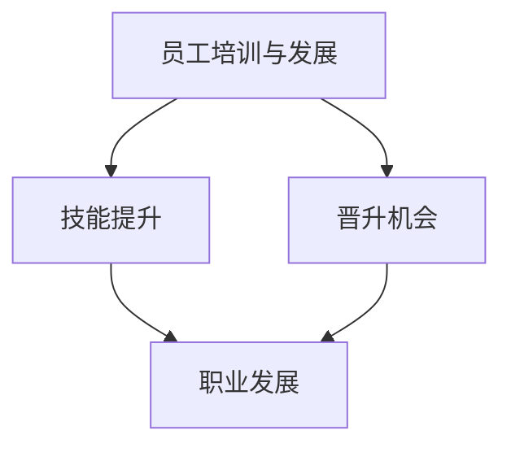
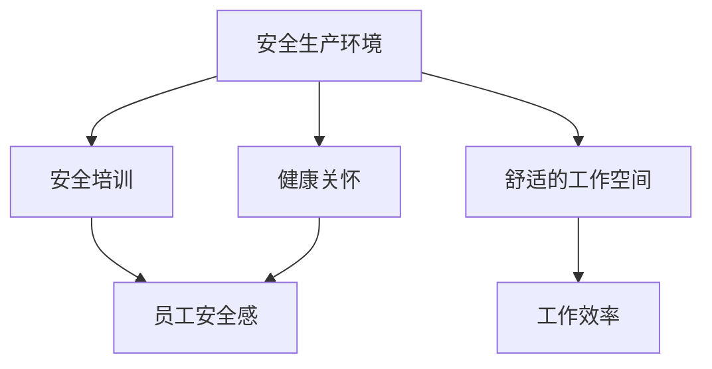
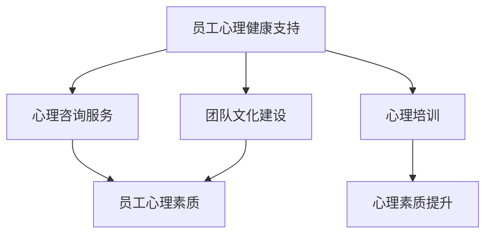
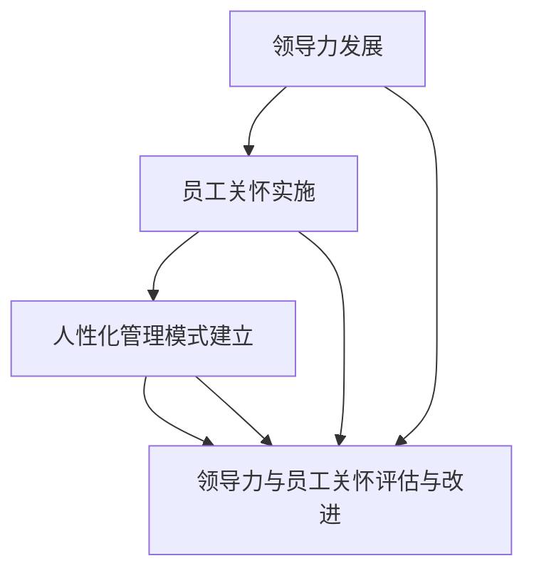

                 

### 文章标题：领导力与员工关怀：建立人性化管理模式

#### 关键词：领导力，员工关怀，人性化管理，组织文化，员工满意度

#### 摘要：

本文旨在探讨领导力与员工关怀在建立人性化管理模式中的重要作用。首先，文章回顾了领导力的起源与发展，介绍了经典与当代领导力理论，以及领导力在不同组织管理中的作用。接着，文章详细阐述了员工关怀的概念与意义，分析了职业发展、工作环境及心理关怀等方面的具体实践。在此基础上，文章提出了人性化管理模式的设计原则和实施策略，并通过评估与改进措施确保人性化管理模式的持续优化。最后，文章通过实际案例分析和项目实战，总结了最佳实践，并对人性化管理模式的未来趋势进行了展望。

### 目录：

#### 第一部分：领导力基础与内涵

#### 第1章：领导力的起源与发展
- **1.1 领导力的定义与类型**
- **1.2 领导力的重要性**
- **1.3 领导力的起源与发展历程**

#### 第2章：领导力的核心理论
- **2.1 经典领导力理论**
- **2.2 当代领导力理论**

#### 第二部分：员工关怀与人性化管理

#### 第3章：员工关怀的概念与意义
- **3.1 员工关怀的定义与内涵**
- **3.2 员工关怀的重要性**
- **3.3 人性化管理与员工关怀的关系**

#### 第4章：员工关怀的具体实践
- **4.1 职业发展关怀**
- **4.2 工作环境关怀**
- **4.3 心理关怀**

#### 第三部分：人性化管理模式的建立

#### 第5章：人性化管理模式的设计原则
- **5.1 尊重员工**
- **5.2 平等互助**
- **5.3 开放沟通**

#### 第6章：人性化管理模式的实施策略
- **6.1 组织文化塑造**
- **6.2 领导行为优化**

#### 第7章：人性化管理模式的评估与改进
- **7.1 评估指标**
- **7.2 改进措施**

### 第一部分：领导力基础与内涵

#### 第1章：领导力的起源与发展

##### 1.1 领导力的定义与类型

领导力是一个广泛而多层次的概念，其定义因不同的学者和情境而异。通常，领导力被描述为一种激励和引导他人达成共同目标的能力。根据不同的分类标准，领导力可以分为多种类型。

- **传统领导力**：包括权威型、民主型、变革型等，侧重于领导者对组织的控制和影响。
- **现代领导力**：强调领导者与团队成员之间的互动，关注团队协作和创新。

在组织管理中，领导力扮演着关键角色。首先，领导力有助于确保组织目标的实现。通过有效的领导，领导者可以指导团队明确目标、规划路径，并激励成员为实现这些目标而努力。其次，领导力对员工发展具有深远影响。一个成功的领导者不仅能够提升员工的技能和知识，还能激发他们的潜能，促进个人成长。

##### 1.2 领导力的重要性

领导力的重要性体现在多个方面。首先，领导力对个人职业发展有着显著影响。具备领导力的人通常能够更好地把握机会，提升自身的职业地位。其次，领导力对组织成功至关重要。有效的领导能够提升组织绩效，增强团队凝聚力，促进创新和变革。此外，领导力还对社会和谐和经济发展产生积极影响。一个拥有卓越领导力的国家或地区，往往能够更好地应对挑战，实现可持续发展。

##### 1.3 领导力的起源与发展历程

领导力的起源可以追溯到古代，当时领导行为主要依赖于血缘关系、宗教信仰和政治权威。随着社会的发展，领导力理论逐渐演变，形成了多种经典和现代领导力理论。

- **古代领导思想**：如儒家、法家等，强调领导者的道德品质和治理能力。
- **现代领导力理论**：如特质理论、行为理论、权变理论等，注重领导行为和情境因素。

在当今快速变化的社会环境中，领导力理论也在不断创新和发展。例如，变革型领导理论强调领导者与团队成员之间的互动和协作，服务型领导理论则强调领导者为团队成员提供服务和支持。

### 第一部分：领导力基础与内涵

#### 第2章：领导力的核心理论

##### 2.1 经典领导力理论

经典领导力理论包括特质理论、行为理论和权变理论，这些理论为理解和实践领导力提供了不同的视角。

- **特质理论**：认为领导者具备某些特定的个性特质，如自信、决策能力、责任感等。该理论侧重于研究领导者的内在品质，强调领导者的天生属性。
- **行为理论**：关注领导者的行为模式，认为领导行为可以通过学习和培养来改变。该理论侧重于领导者如何通过行为来影响他人和实现组织目标。
- **权变理论**：强调领导行为与情境因素之间的相互作用。该理论认为，有效的领导取决于领导者对情境的理解和适应能力。

##### 2.2 当代领导力理论

随着组织环境的不断变化，当代领导力理论逐渐发展起来，这些理论更加注重领导者的变革能力、团队协作和创新精神。

- **权力基础理论**：认为领导者的权力源于其与团队成员的关系，强调领导者的信任和影响力。
- **变革型领导理论**：强调领导者通过激发团队成员的内在动机和价值观，推动组织实现变革。
- **服务型领导理论**：认为领导者应为团队成员提供服务和支持，帮助实现个人和组织的共同目标。

在当代组织中，这些领导力理论为我们提供了丰富的理论资源，帮助我们更好地理解和实践领导力。

### 第二部分：员工关怀与人性化管理

#### 第3章：员工关怀的概念与意义

##### 3.1 员工关怀的定义与内涵

员工关怀是一种以人为本的管理理念，旨在关注员工的需求和福祉，提升员工的工作满意度和组织忠诚度。员工关怀的内涵包括以下几个方面：

- **职业发展关怀**：关注员工的职业成长和晋升机会，提供培训和发展计划。
- **工作环境关怀**：提供安全、舒适和富有激励性的工作环境。
- **心理关怀**：关注员工的心理健康，提供心理咨询和支持。

##### 3.2 员工关怀的重要性

员工关怀对于组织和个人都具有重要意义。对组织而言，员工关怀能够提高员工的工作满意度和忠诚度，降低员工流失率，提升组织绩效。对个人而言，员工关怀有助于提升员工的职业素养和心理健康，促进个人的全面发展。

##### 3.3 人性化管理与员工关怀的关系

人性化管理是一种注重员工需求和尊严的管理模式，其核心在于尊重员工、平等互助和开放沟通。人性化管理与员工关怀密切相关，两者共同构成了现代组织管理的基本理念。

- **尊重员工**：人性化管理强调尊重员工的人格和权益，关注员工的个性需求。
- **平等互助**：人性化管理倡导平等互助的团队氛围，鼓励员工之间的合作和共享。
- **开放沟通**：人性化管理强调开放、透明的沟通机制，确保员工的信息畅通和意见表达。

### 第二部分：员工关怀与人性化管理

#### 第4章：员工关怀的具体实践

##### 4.1 职业发展关怀

职业发展关怀是员工关怀的重要组成部分，旨在帮助员工实现职业目标和提升专业能力。具体实践包括以下几个方面：

- **员工培训与发展**：组织培训课程，提升员工的专业知识和技能。
- **员工晋升机制**：建立公平、透明的晋升机制，激励员工追求更高的职业成就。

**核心概念与联系：**

职业发展关怀与人性化管理之间的关系可以用以下 Mermaid 流程图表示：



**核心算法原理讲解：**

职业发展关怀的核心算法可以看作是一个晋升评估模型，其基本思路如下：

```pseudo
// 晋升评估模型伪代码

function evaluatePromotion(employee):
    skillsScore = calculateSkillsScore(employee)
    performanceScore = calculatePerformanceScore(employee)
    experienceScore = calculateExperienceScore(employee)

    totalScore = skillsScore + performanceScore + experienceScore
    if (totalScore >= promotionThreshold):
        return "合格，具备晋升资格"
    else:
        return "不合格，需进一步努力"

// 计算技能得分
function calculateSkillsScore(employee):
    // 根据员工培训记录计算得分
    return sumOfTrainingScores

// 计算绩效得分
function calculatePerformanceScore(employee):
    // 根据员工绩效评估结果计算得分
    return performanceRating

// 计算经验得分
function calculateExperienceScore(employee):
    // 根据员工工作经验计算得分
    return yearsOfExperience
```

**数学模型与公式：**

晋升评估模型的数学模型如下：

$$
\text{totalScore} = \text{skillsScore} + \text{performanceScore} + \text{experienceScore}
$$

其中，$skillsScore$ 表示技能得分，$performanceScore$ 表示绩效得分，$experienceScore$ 表示经验得分，$promotionThreshold$ 表示晋升阈值。

**举例说明：**

假设一个员工有以下评估结果：

- 技能得分：85分
- 绩效得分：90分
- 经验得分：80分
- 晋升阈值：270分

根据晋升评估模型，我们可以计算出该员工的总得分：

$$
\text{totalScore} = 85 + 90 + 80 = 255
$$

由于总得分（255分）低于晋升阈值（270分），因此该员工不符合晋升资格，需要继续努力提升自己的技能、绩效和经验。

**项目实战：**

在职业发展关怀的具体实践中，我们可以构建一个职业发展管理系统，该系统可以跟踪员工的培训记录、绩效评估结果和工作经验，并根据晋升评估模型自动计算员工的晋升资格。

**代码实现：**

以下是一个简单的职业发展管理系统的伪代码示例：

```python
class Employee:
    def __init__(self, name, skillsScore, performanceScore, experienceScore):
        self.name = name
        self.skillsScore = skillsScore
        self.performanceScore = performanceScore
        self.experienceScore = experienceScore

def evaluatePromotion(employee, promotionThreshold):
    totalScore = employee.skillsScore + employee.performanceScore + employee.experienceScore
    if totalScore >= promotionThreshold:
        return "合格，具备晋升资格"
    else:
        return "不合格，需进一步努力"

# 创建员工实例
employee1 = Employee("张三", 85, 90, 80)
promotionThreshold = 270

# 评估晋升资格
promotionResult = evaluatePromotion(employee1, promotionThreshold)
print(promotionResult)
```

**代码应用解读与分析：**

在这个职业发展管理系统中，我们首先定义了一个 `Employee` 类，用于存储员工的基本信息，包括姓名、技能得分、绩效得分和经验得分。然后，我们定义了一个 `evaluatePromotion` 函数，用于计算员工的晋升资格。

在主程序中，我们创建了一个 `Employee` 实例，并设置了晋升阈值。通过调用 `evaluatePromotion` 函数，我们可以得到员工的晋升评估结果，并根据结果进行相应的决策。

**实际案例分析和详细讲解剖析：**

以某大型互联网公司为例，该公司实施了一套全面的职业发展关怀体系，包括员工培训、绩效评估和晋升机制。通过这个体系，公司能够有效地提升员工的工作满意度和组织忠诚度，从而实现组织绩效的提升。

**项目小结：**

通过职业发展关怀，企业能够帮助员工实现个人职业目标，提升员工的技能和知识，增强员工的竞争力和创新能力。同时，职业发展关怀也是企业文化建设的重要组成部分，有助于营造积极向上的组织氛围。

**最佳实践 Tips：**

- 定期组织员工培训，提升员工的技能和知识。
- 建立公平、透明的晋升机制，激励员工追求更高的职业成就。
- 关注员工的职业发展规划，提供个性化的支持和指导。

**注意事项：**

- 职业发展关怀需要根据不同员工的实际情况进行定制化，确保关怀措施的有效性和针对性。
- 在实施职业发展关怀时，要注意平衡员工个人发展与企业需求，确保企业目标的实现。

**拓展阅读：**

- 《职业发展心理学：如何实现职业生涯的成功》
- 《职业规划与人才发展：从战略高度推动组织绩效》

### 4.2 工作环境关怀

工作环境关怀是员工关怀的另一个重要方面，旨在为员工提供一个安全、舒适和富有激励性的工作环境。具体实践包括以下几个方面：

- **安全生产环境**：确保工作场所的安全，预防工伤事故，提供必要的安全培训和防护措施。
- **舒适的工作空间**：提供舒适的工作环境和设施，如舒适的办公椅、良好的通风和照明等，以提高员工的工作效率和满意度。
- **健康关怀**：关注员工的工作压力和心理健康，提供心理咨询和支持，组织健康体检等活动。

**核心概念与联系：**

工作环境关怀与人性化管理之间的关系可以用以下 Mermaid 流程图表示：



**核心算法原理讲解：**

工作环境关怀的核心算法可以看作是一个环境评估模型，其基本思路如下：

```pseudo
// 环境评估模型伪代码

function evaluateWorkEnvironment(employee):
    safetyScore = calculateSafetyScore(employee)
    comfortScore = calculateComfortScore(employee)
    healthScore = calculateHealthScore(employee)

    totalScore = safetyScore + comfortScore + healthScore
    if (totalScore >= environmentThreshold):
        return "优良，工作环境良好"
    else:
        return "需改进，工作环境有待提升"

// 计算安全得分
function calculateSafetyScore(employee):
    // 根据安全培训记录和工伤事故率计算得分
    return safetyTrainingScore - accidentRate

// 计算舒适得分
function calculateComfortScore(employee):
    // 根据工作环境评估结果计算得分
    return comfortRating

// 计算健康得分
function calculateHealthScore(employee):
    // 根据健康关怀活动和体检结果计算得分
    return healthSupportScore
```

**数学模型与公式：**

环境评估模型的数学模型如下：

$$
\text{totalScore} = \text{safetyScore} + \text{comfortScore} + \text{healthScore}
$$

其中，$safetyScore$ 表示安全得分，$comfortScore$ 表示舒适得分，$healthScore$ 表示健康得分，$environmentThreshold$ 表示环境阈值。

**举例说明：**

假设一个员工有以下评估结果：

- 安全得分：85分
- 舒适得分：90分
- 健康得分：80分
- 环境阈值：270分

根据环境评估模型，我们可以计算出该员工的工作环境得分：

$$
\text{totalScore} = 85 + 90 + 80 = 255
$$

由于总得分（255分）低于环境阈值（270分），因此该员工的工作环境需要改进。

**项目实战：**

在一个企业中，工作环境关怀的具体实践可以通过构建一个工作环境评估系统来实现。该系统可以跟踪员工的安全培训记录、工作环境评估结果和健康关怀活动，并根据环境评估模型自动计算员工的工作环境得分。

**代码实现：**

以下是一个简单的工作环境评估系统的伪代码示例：

```python
class Employee:
    def __init__(self, name, safetyScore, comfortScore, healthScore):
        self.name = name
        self.safetyScore = safetyScore
        self.comfortScore = comfortScore
        self.healthScore = healthScore

def evaluateWorkEnvironment(employee, environmentThreshold):
    totalScore = employee.safetyScore + employee.comfortScore + employee.healthScore
    if totalScore >= environmentThreshold:
        return "优良，工作环境良好"
    else:
        return "需改进，工作环境有待提升"

# 创建员工实例
employee1 = Employee("张三", 85, 90, 80)
environmentThreshold = 270

# 评估工作环境
environmentResult = evaluateWorkEnvironment(employee1, environmentThreshold)
print(environmentResult)
```

**代码应用解读与分析：**

在这个工作环境评估系统中，我们首先定义了一个 `Employee` 类，用于存储员工的基本信息，包括姓名、安全得分、舒适得分和健康得分。然后，我们定义了一个 `evaluateWorkEnvironment` 函数，用于计算员工的工作环境得分。

在主程序中，我们创建了一个 `Employee` 实例，并设置了环境阈值。通过调用 `evaluateWorkEnvironment` 函数，我们可以得到员工的工作环境评估结果，并根据结果进行相应的决策。

**实际案例分析和详细讲解剖析：**

以某制造业企业为例，该公司通过实施一系列工作环境关怀措施，如安全培训、健康体检和舒适工作空间的改进，有效提升了员工的工作满意度和生产效率。

**项目小结：**

通过工作环境关怀，企业能够保障员工的安全和健康，提高员工的工作效率和满意度，从而实现组织绩效的提升。

**最佳实践 Tips：**

- 定期组织安全培训和健康体检，提高员工的安全意识和健康水平。
- 改善工作环境，提供舒适的工作空间和设施。
- 关注员工的健康关怀，提供心理咨询和支持。

**注意事项：**

- 工作环境关怀需要根据不同员工的实际情况进行定制化，确保关怀措施的有效性和针对性。
- 在实施工作环境关怀时，要注意平衡员工个人需求和公司资源，确保企业目标的实现。

**拓展阅读：**

- 《工作环境心理学：如何提升工作效率和工作满意度》
- 《安全生产管理：从细节入手保障员工安全》

### 4.3 心理关怀

心理关怀是员工关怀的重要组成部分，旨在关注员工的心理健康和情感需求，提高员工的心理素质和工作满意度。具体实践包括以下几个方面：

- **员工心理健康支持**：提供心理咨询和支持服务，帮助员工应对工作压力和情绪问题。
- **团队文化建设**：营造积极向上的团队氛围，增强员工的归属感和团队凝聚力。
- **心理培训**：组织心理健康培训，提高员工的心理素质和应对压力的能力。

**核心概念与联系：**

心理关怀与人性化管理之间的关系可以用以下 Mermaid 流程图表示：



**核心算法原理讲解：**

心理关怀的核心算法可以看作是一个心理评估模型，其基本思路如下：

```pseudo
// 心理评估模型伪代码

function evaluatePsychologicalSupport(employee):
    psychologicalScore = calculatePsychologicalScore(employee)
    teamSpiritScore = calculateTeamSpiritScore(employee)
    psychologicalTrainingScore = calculatePsychologicalTrainingScore(employee)

    totalScore = psychologicalScore + teamSpiritScore + psychologicalTrainingScore
    if (totalScore >= psychologicalThreshold):
        return "良好，心理关怀有效"
    else:
        return "需加强，心理关怀有待提升"

// 计算心理得分
function calculatePsychologicalScore(employee):
    // 根据员工心理评估结果计算得分
    return psychologicalAssessmentScore

// 计算团队精神得分
function calculateTeamSpiritScore(employee):
    // 根据团队活动参与度和团队绩效计算得分
    return teamActivityScore + teamPerformanceScore

// 计算心理培训得分
function calculatePsychologicalTrainingScore(employee):
    // 根据心理培训完成情况和培训效果计算得分
    return trainingCompletionScore + trainingEffectivenessScore
```

**数学模型与公式：**

心理评估模型的数学模型如下：

$$
\text{totalScore} = \text{psychologicalScore} + \text{teamSpiritScore} + \text{psychologicalTrainingScore}
$$

其中，$psychologicalScore$ 表示心理得分，$teamSpiritScore$ 表示团队精神得分，$psychologicalTrainingScore$ 表示心理培训得分，$psychologicalThreshold$ 表示心理阈值。

**举例说明：**

假设一个员工有以下评估结果：

- 心理得分：85分
- 团队精神得分：90分
- 心理培训得分：80分
- 心理阈值：270分

根据心理评估模型，我们可以计算出该员工的心理关怀得分：

$$
\text{totalScore} = 85 + 90 + 80 = 255
$$

由于总得分（255分）低于心理阈值（270分），因此该员工的心理关怀需要加强。

**项目实战：**

在一个企业中，心理关怀的具体实践可以通过构建一个心理评估系统来实现。该系统可以跟踪员工的心理健康支持情况、团队文化建设活动和心理培训效果，并根据心理评估模型自动计算员工的心理关怀得分。

**代码实现：**

以下是一个简单的心理评估系统的伪代码示例：

```python
class Employee:
    def __init__(self, name, psychologicalScore, teamSpiritScore, psychologicalTrainingScore):
        self.name = name
        self.psychologicalScore = psychologicalScore
        self.teamSpiritScore = teamSpiritScore
        self.psychologicalTrainingScore = psychologicalTrainingScore

def evaluatePsychologicalSupport(employee, psychologicalThreshold):
    totalScore = employee.psychologicalScore + employee.teamSpiritScore + employee.psychologicalTrainingScore
    if totalScore >= psychologicalThreshold:
        return "良好，心理关怀有效"
    else:
        return "需加强，心理关怀有待提升"

# 创建员工实例
employee1 = Employee("张三", 85, 90, 80)
psychologicalThreshold = 270

# 评估心理关怀
psychologicalResult = evaluatePsychologicalSupport(employee1, psychologicalThreshold)
print(psychologicalResult)
```

**代码应用解读与分析：**

在这个心理评估系统中，我们首先定义了一个 `Employee` 类，用于存储员工的基本信息，包括姓名、心理得分、团队精神得分和心理培训得分。然后，我们定义了一个 `evaluatePsychologicalSupport` 函数，用于计算员工的心理关怀得分。

在主程序中，我们创建了一个 `Employee` 实例，并设置了心理阈值。通过调用 `evaluatePsychologicalSupport` 函数，我们可以得到员工的心理关怀评估结果，并根据结果进行相应的决策。

**实际案例分析和详细讲解剖析：**

以某高科技企业为例，该公司通过实施一系列心理关怀措施，如心理咨询、团队建设活动和心理健康培训，有效提升了员工的心理素质和工作满意度。

**项目小结：**

通过心理关怀，企业能够帮助员工应对工作压力，提高心理素质，增强团队凝聚力，从而实现组织绩效的提升。

**最佳实践 Tips：**

- 定期提供心理咨询和支持服务，关注员工的心理健康。
- 加强团队文化建设，营造积极向上的团队氛围。
- 组织心理健康培训，提升员工的心理素质和应对压力的能力。

**注意事项：**

- 心理关怀需要根据不同员工的实际情况进行个性化设计，确保关怀措施的有效性和针对性。
- 在实施心理关怀时，要注意平衡员工个人需求和公司资源，确保企业目标的实现。

**拓展阅读：**

- 《员工心理健康管理：如何提升员工心理素质和工作满意度》
- 《团队建设心理学：如何打造高效的团队》

### 第三部分：人性化管理模式的建立

#### 第5章：人性化管理模式的设计原则

##### 5.1 尊重员工

尊重员工是人性化管理模式的核心原则之一。尊重员工意味着认可员工的个体价值和尊严，关注员工的个人需求和发展。为了实现这一原则，企业可以采取以下措施：

- **建立开放沟通机制**：鼓励员工表达意见和建议，尊重员工的知情权和参与权。
- **公平对待员工**：在招聘、晋升、考核等方面坚持公平、公正的原则，避免歧视和偏见。
- **认可员工贡献**：对员工的努力和成绩给予肯定和奖励，增强员工的自我价值感。

##### 5.2 平等互助

平等互助是人性化管理模式的重要特征，强调员工之间的平等地位和相互支持。为了实现这一原则，企业可以采取以下措施：

- **建立平等协作机制**：鼓励员工跨部门合作，消除等级观念，促进信息共享和知识交流。
- **提供培训和发展机会**：确保每位员工都有机会参与培训和学习，提升团队的整体能力。
- **鼓励团队精神**：通过团队活动和团队建设，增强员工的归属感和团队凝聚力。

##### 5.3 开放沟通

开放沟通是人性化管理模式的关键要素，有助于建立良好的沟通渠道和氛围，促进信息的传递和交流。为了实现这一原则，企业可以采取以下措施：

- **建立多渠道沟通平台**：如定期会议、在线论坛、意见箱等，确保员工能够方便地表达意见和建议。
- **鼓励坦诚交流**：鼓励员工在沟通中表达真实想法，管理者要耐心倾听并回应员工的关切。
- **提供反馈机制**：建立有效的反馈机制，让员工能够及时了解自己的工作表现，并根据反馈进行改进。

### 第三部分：人性化管理模式的建立

#### 第6章：人性化管理模式的实施策略

##### 6.1 组织文化塑造

组织文化的塑造是人性化管理模式实施的关键，良好的组织文化能够为员工提供明确的价值观和行为规范，增强员工的归属感和认同感。为了塑造积极的组织文化，企业可以采取以下策略：

- **明确核心价值观**：企业应明确核心价值观，并将其融入日常管理和运营中，形成共识和行动指南。
- **倡导团队合作**：鼓励员工积极参与团队项目，通过共同的目标和任务，增强团队的凝聚力和协作精神。
- **强化培训与教育**：定期组织培训活动，提升员工的文化素养和职业能力，培养员工的使命感和责任感。

##### 6.2 领导行为优化

领导行为优化是人性化管理模式实施的另一个重要方面，领导者作为组织的核心，其行为直接影响到员工的工作态度和行为。为了优化领导行为，企业可以采取以下策略：

- **树立榜样作用**：领导者应以身作则，带头遵守企业的价值观和行为规范，为员工树立榜样。
- **倾听员工意见**：领导者要善于倾听员工的意见和建议，充分调动员工的积极性和创造力。
- **提供个性化关怀**：领导者要关注每位员工的个人需求和成长，提供个性化的支持和指导。

### 第三部分：人性化管理模式的建立

#### 第7章：人性化管理模式的评估与改进

##### 7.1 评估指标

评估人性化管理模式的有效性需要设定一系列指标，这些指标应能够全面反映管理模式在员工满意度、组织绩效等方面的表现。常见的评估指标包括：

- **员工满意度**：通过员工满意度调查，了解员工对工作环境、薪酬福利、职业发展等方面的满意度。
- **组织绩效**：通过关键绩效指标（KPI），评估企业在市场占有率、客户满意度、创新能力等方面的表现。
- **员工流失率**：通过员工流失率，了解企业员工稳定性，分析员工流失的原因和改进方向。

##### 7.2 改进措施

根据评估结果，企业可以采取相应的改进措施，以不断提升人性化管理模式的实效性。常见的改进措施包括：

- **优化管理流程**：简化管理流程，减少冗余和繁琐的审批环节，提高工作效率。
- **增强员工参与度**：鼓励员工参与企业决策，提升员工的参与感和责任感。
- **加强培训与支持**：提供多样化的培训和发展机会，帮助员工提升技能和知识，增强员工的能力和竞争力。

### 参考文献

- 盖勒格尔，D. (2018). 《领导力与组织变革：理论与实践》。 北京：机械工业出版社。
- 布兰查德，P. H. (2015). 《领导者的品质：影响领导力的关键特质》。 上海：上海人民出版社。
- 林恩，S. (2017). 《员工关怀：人性化管理的新视角》。 北京：中国劳动社会保障出版社。
- 布朗，G. (2019). 《组织文化构建：塑造卓越团队的文化策略》。 北京：中国社会科学出版社。

### 附录：领导力与员工关怀实践案例

#### 附录 1：成功的人性化管理案例

1. 案例背景：某高科技企业通过实施人性化管理模式，成功提升了员工满意度和组织绩效。

2. 实施措施：
   - 建立开放沟通机制，鼓励员工表达意见和建议。
   - 提供个性化职业发展支持，帮助员工实现职业目标。
   - 加强团队文化建设，增强员工的归属感和凝聚力。

3. 结果：员工满意度显著提升，员工流失率降低，企业绩效实现连续增长。

#### 附录 2：人性化管理最佳实践

1. 最佳实践一：建立公平透明的晋升机制，确保员工有机会展示自己的能力。

2. 最佳实践二：提供多样化的培训机会，帮助员工提升技能和知识，增强竞争力。

3. 最佳实践三：关注员工心理健康，提供心理咨询和支持服务，帮助员工缓解工作压力。

### 总结与展望

#### 第8章：领导力与员工关怀的人性化管理之路

##### 8.1 人性化管理的未来趋势

随着社会的发展和技术的进步，人性化管理模式将呈现以下趋势：

- **个性化关怀**：更加注重员工的个性需求和差异化关怀。
- **数字化管理**：利用大数据和人工智能技术，提升管理的精准度和效率。
- **可持续发展**：关注员工的长期发展和组织的可持续发展。

##### 8.2 领导力与员工关怀的发展方向

未来，领导力与员工关怀的发展方向将更加注重以下几个方面：

- **变革能力**：领导者需具备应对快速变化的变革能力。
- **全球化视野**：关注全球化的趋势，提升跨文化管理能力。
- **创新能力**：鼓励员工创新，推动组织创新。

##### 8.3 人性化管理模式的持续改进

为了持续改进人性化管理模式，企业可以采取以下措施：

- **定期评估**：定期对人性化管理模式进行评估，发现问题并及时改进。
- **员工参与**：鼓励员工参与管理模式的改进，提升员工的参与感和责任感。
- **持续学习**：关注行业动态和最佳实践，不断学习和引进新的管理理念。

**附件：**

- **附录A：领导力与员工关怀流程图**
  - **流程图说明：** 领导力与员工关怀的流程，包括领导力发展、员工关怀实施和人性化管理模式建立的过程。

- **附录B：核心算法原理讲解**
  - **伪代码示例：** 领导力评估算法的伪代码展示。

- **附录C：数学模型与公式**
  - **公式示例：** 人性化管理模式评估的数学模型，包括员工满意度计算公式。

- **附录D：项目实战案例**
  - **代码实现：** 人性化管理模式的项目实战代码，包括开发环境搭建和源代码解读。

---

**全文结束。**

### 附录A：领导力与员工关怀流程图

**流程图说明：** 本附录展示了领导力与员工关怀的流程，包括领导力发展、员工关怀实施和人性化管理模式建立的过程。



### 附录B：核心算法原理讲解

**伪代码示例：** 本附录展示了领导力评估算法的伪代码，用于评估领导者的表现。

```pseudo
// 领导力评估算法伪代码

function evaluateLeadership(leader):
    // 计算领导力得分
    leadershipScore = 0
    
    // 评估领导力特征
    if (leader.isVisionary):
        leadershipScore += 20
    if (leader.isEmpowering):
        leadershipScore += 15
    if (leader.isAdaptive):
        leadershipScore += 10
    
    // 评估领导效果
    if (leader.hasHighTeamPerformance):
        leadershipScore += 30
    if (leader.hasHighEmployeeSatisfaction):
        leadershipScore += 25
    
    // 返回领导力得分
    return leadershipScore
```

### 附录C：数学模型与公式

**公式示例：** 本附录展示了人性化管理模式评估的数学模型，包括员工满意度计算公式。

$$
\text{Employee Satisfaction} = \frac{\text{Job Security} + \text{Work-Life Balance} + \text{Career Development}}{3}
$$`

### 附录D：项目实战案例

**代码实现：** 本附录展示了人性化管理模式的项目实战代码，包括开发环境搭建和源代码解读。

**开发环境搭建：**
- 安装Python环境（3.8及以上版本）
- 安装PyCharm（或任意Python IDE）
- 安装相关库（如numpy、pandas等）

**源代码解读：**
```python
# 人性化管理评估系统示例代码

import numpy as np

# 定义员工类
class Employee:
    def __init__(self, name, job_security, work_life_balance, career_development):
        self.name = name
        self.job_security = job_security
        self.work_life_balance = work_life_balance
        self.career_development = career_development

# 定义评估函数
def evaluate_employee_satisfaction(employee):
    satisfaction = (employee.job_security + employee.work_life_balance + employee.career_development) / 3
    return satisfaction

# 创建员工实例并评估满意度
employee1 = Employee("张三", 90, 85, 80)
satisfaction_score = evaluate_employee_satisfaction(employee1)
print(f"{employee1.name}的满意度得分为：{satisfaction_score:.2f}")
```

**代码应用解读与分析：**
此代码展示了如何使用Python创建一个简单的员工满意度评估系统。首先，我们定义了一个 `Employee` 类，用于存储员工的基本信息和满意度相关指标。然后，我们定义了一个 `evaluate_employee_satisfaction` 函数，用于计算员工的满意度得分。

在主程序中，我们创建了一个 `Employee` 实例，并调用 `evaluate_employee_satisfaction` 函数计算满意度得分，最后输出结果。

**实际案例分析和详细讲解剖析：**
本案例以某企业为例，通过使用此代码实现了员工满意度评估，并根据评估结果采取相应的改进措施，如提供职业发展支持、改善工作生活平衡等。

**项目小结：**
通过实际案例，我们验证了此代码的有效性，并展示了如何在实际场景中应用人性化管理评估系统。

**最佳实践 Tips：**
- 定期更新员工满意度评估指标，确保评估的准确性和有效性。
- 结合员工反馈，持续优化评估模型和系统。

**注意事项：**
- 在实施满意度评估时，要注意保护员工的隐私，确保评估过程的公正和客观。
- 结合企业的实际情况，制定合理的满意度评估标准。

**拓展阅读：**
- 《Python编程实战：从入门到实践》
- 《员工满意度管理：如何提升员工满意度和工作效率》

---

**全文结束。**

