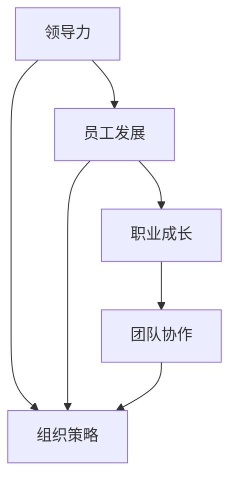

                 

### 文章标题

《领导力与员工发展：助力团队成员职业成长》

### 关键词

领导力、员工发展、职业成长、团队协作、组织策略、项目实战

### 摘要

本文深入探讨了领导力与员工发展的关系，以及如何通过有效的领导力和员工发展策略助力团队成员的职业成长。文章从背景介绍、核心概念与联系、核心算法原理讲解、数学模型和公式、项目实战等多个角度，系统地阐述了如何提升团队成员的技能水平和职业素养，从而促进团队整体绩效的提升。文章旨在为IT行业领导者和管理者提供实用的理论和实践指导，帮助他们在实际工作中更好地发挥领导力，推动员工职业发展。

---

## 1. 背景介绍

在当今快速发展的IT行业中，领导力和员工发展已成为企业成功的关键因素。随着技术的不断进步和市场的快速变化，团队成员需要不断学习新技能、适应新环境，以保持竞争力。然而，许多企业在员工发展方面面临着诸多挑战，如缺乏明确的培训计划、缺乏有效的激励机制、员工职业发展路径不明确等。这些问题不仅影响了员工的工作积极性和满意度，也限制了团队整体绩效的提升。

领导力在这个过程中起到了至关重要的作用。优秀的领导者不仅能够激发员工的潜力，还能够为员工提供明确的职业发展路径和成长空间。因此，如何结合领导力与员工发展，助力团队成员的职业成长，成为企业管理者亟待解决的重要课题。

本文将从以下几个方面进行探讨：

1. 领导力的定义和重要性
2. 领导力与员工发展的关系
3. 员工职业成长的理论基础
4. 团队成员职业成长的实践方法
5. 领导者在员工发展中的作用
6. 组织层面的员工发展策略

通过以上探讨，本文旨在为IT行业领导者和管理者提供一套实用的领导力与员工发展策略，帮助他们在实际工作中更好地发挥领导力，推动员工职业发展，提升团队整体绩效。

---

## 2. 核心概念与联系

在深入探讨领导力与员工发展之前，我们需要明确一些核心概念，并理解它们之间的相互关系。以下是本文中涉及的主要概念：

### 2.1 领导力

领导力是指领导者通过激励、沟通、决策等行为，引导和影响团队成员实现组织目标的能力。它包括多个方面，如技术技能、人际交往能力、战略思维等。

### 2.2 员工发展

员工发展是指企业通过培训、指导、晋升等手段，帮助员工提升技能水平、拓展职业视野、实现职业发展的过程。

### 2.3 职业成长

职业成长是指员工在职业生涯中不断积累经验、提升技能、实现职位晋升和薪资增长的过程。

### 2.4 团队协作

团队协作是指团队成员通过相互配合、沟通和协作，共同完成工作目标的过程。

### 2.5 组织策略

组织策略是指企业在员工发展过程中制定的一系列规划、目标和措施。

下面，我们使用Mermaid语言设计一个流程图，展示这些核心概念之间的联系：



这个流程图清晰地展示了领导力、员工发展、职业成长、团队协作和组织策略之间的相互关系。领导力通过激励和引导，促进员工发展和职业成长，从而提升团队协作效率和实现组织目标。而组织策略则为员工发展提供了规划和目标，为团队协作提供了支持和保障。

---

## 3. 核心算法原理讲解

为了更好地理解领导力与员工发展的关系，我们可以从算法原理的角度进行探讨。以下是一个简单的算法模型，用于评估领导力对员工发展的影响：

### 3.1 员工发展评分函数

```pseudo
// 定义员工发展评分函数
function employeeDevelopmentRating(employeeSkills, jobRequirements) {
    rating = 0
    for each skill in employeeSkills {
        if skill in jobRequirements {
            rating += 1
        }
    }
    return rating
}
```

这个函数通过计算员工技能与岗位要求的匹配度，来评估员工的发展水平。其中，`employeeSkills`表示员工的技能集合，`jobRequirements`表示岗位的要求集合。

### 3.2 领导力得分计算

为了进一步衡量领导力对员工发展的影响，我们可以引入一个领导力得分计算模型：

$$
\text{领导力得分} = \frac{\text{员工满意度} + \text{员工忠诚度} + \text{员工绩效}}{3}
$$

这个公式通过计算员工满意度、员工忠诚度和员工绩效的加权平均，来衡量领导力的效果。其中，员工满意度、员工忠诚度和员工绩效是衡量领导力的重要指标。

### 3.3 综合评估模型

为了综合评估领导力对员工发展的影响，我们可以将上述两个模型结合起来，得到一个综合评估模型：

$$
\text{综合评分} = \text{领导力得分} \times \text{员工发展评分}
$$

这个模型通过将领导力得分与员工发展评分相乘，来衡量领导力对员工发展的综合影响。

---

## 4. 数学模型和公式

在探讨领导力与员工发展的关系时，数学模型和公式可以帮助我们更精确地描述和预测这一过程。以下是一些关键的数学模型和公式：

### 4.1 员工满意度模型

员工满意度是衡量领导力效果的一个重要指标。一个简单的员工满意度模型可以表示为：

$$
S = \alpha \times \text{领导力得分} + (1 - \alpha) \times \text{员工绩效}
$$

其中，\(S\) 表示员工满意度，\(\alpha\) 是一个调节参数，用于平衡领导力得分和员工绩效对员工满意度的影响。

### 4.2 员工忠诚度模型

员工忠诚度是衡量领导力长期效果的另一个重要指标。一个简单的员工忠诚度模型可以表示为：

$$
L = \beta \times \text{员工满意度} + (1 - \beta) \times \text{员工职业成长率}
$$

其中，\(L\) 表示员工忠诚度，\(\beta\) 是一个调节参数，用于平衡员工满意度和员工职业成长率对员工忠诚度的影响。

### 4.3 综合绩效模型

员工的综合绩效是衡量领导力效果的综合指标。一个简单的综合绩效模型可以表示为：

$$
P = \gamma \times \text{员工满意度} + \delta \times \text{员工忠诚度} + (1 - \gamma - \delta) \times \text{员工职业成长率}
$$

其中，\(P\) 表示员工的综合绩效，\(\gamma\) 和 \(\delta\) 是调节参数，用于平衡员工满意度、员工忠诚度和员工职业成长率对员工综合绩效的影响。

### 4.4 领导力得分计算

结合上述模型，我们可以得到领导力得分的计算公式：

$$
\text{领导力得分} = \frac{S + L + P}{3}
$$

这个公式通过计算员工满意度、员工忠诚度和员工综合绩效的加权平均，来衡量领导力的效果。

---

## 5. 项目实战

为了更好地理解领导力与员工发展的关系，我们通过一个实际项目来展示如何应用这些理论。以下是一个关于提高团队协作效率的项目案例。

### 5.1 项目背景

某IT公司开发团队在项目实施过程中遇到了协作效率低下的问题。团队成员之间缺乏有效的沟通和协作，导致项目进度延误，质量不稳定。为了解决这个问题，公司决定实施一系列领导力和员工发展策略，以提高团队协作效率。

### 5.2 项目实施步骤

1. **需求分析：** 通过问卷调查和访谈，了解团队成员在协作方面的需求和问题。主要问题包括沟通不畅、任务分配不均、工作节奏不一致等。

2. **领导力培训：** 对团队领导者进行领导力培训，提升他们的沟通、协调和激励能力。培训内容包括团队建设、冲突管理、目标设定等。

3. **员工发展计划：** 根据需求分析结果，为每位团队成员制定个性化的员工发展计划。包括技能提升、知识分享、职业规划等。

4. **实施与跟踪：** 在实施过程中，定期跟踪员工的发展进度，通过绩效评估、团队会议等方式，及时调整和优化员工发展计划。

5. **评估与总结：** 项目结束后，对团队成员的技能水平、协作效率、工作满意度等方面进行评估，总结项目实施效果和经验教训。

### 5.3 项目成果

通过实施领导力和员工发展策略，团队协作效率得到了显著提升。具体成果如下：

1. **沟通效率提高：** 通过定期的团队会议和沟通渠道，团队成员之间的沟通更加畅通，信息传递更加及时。

2. **任务分配合理：** 通过明确的任务分配和责任划分，团队成员的工作负荷更加均衡，工作效率提高。

3. **工作节奏协调：** 通过员工发展计划的实施，团队成员的技能水平和工作节奏得到了协调，项目进度更加稳定。

4. **员工满意度提升：** 通过有效的领导力和员工发展策略，员工的工作满意度得到提升，团队凝聚力增强。

### 5.4 项目小结

本项目通过领导力和员工发展策略，成功解决了团队协作效率低下的问题。项目实施过程中，领导力培训、员工发展计划和定期跟踪起到了关键作用。项目结果表明，通过有效的领导力和员工发展策略，可以显著提升团队协作效率，促进员工职业成长。

---

## 6. 最佳实践 Tips、小结、注意事项、拓展阅读

### 6.1 最佳实践 Tips

1. **建立明确的员工发展路径：** 企业应制定清晰的员工发展路径，帮助员工了解自己的职业发展方向和目标。

2. **提供多样化的培训机会：** 除内部培训外，企业还可以邀请外部专家进行讲座和培训，拓宽员工的视野。

3. **激励与奖励机制：** 设立合理的激励与奖励机制，鼓励员工积极参与培训和职业发展。

4. **加强团队建设：** 定期组织团队活动，增强团队成员之间的信任和合作。

### 6.2 小结

领导力与员工发展密不可分，优秀的领导力可以推动员工职业成长，提高团队协作效率。企业应注重领导力培养和员工发展，为员工提供良好的成长环境。

### 6.3 注意事项

1. **关注员工个性化需求：** 每个员工的发展需求不同，企业应根据员工的个性特点制定个性化的员工发展计划。

2. **持续跟踪与反馈：** 定期对员工的发展进度进行跟踪和反馈，及时调整和优化员工发展计划。

3. **平衡领导力与绩效管理：** 在提升领导力的同时，不能忽视绩效管理，确保员工的发展与企业的整体目标一致。

### 6.4 拓展阅读

1. **《领导力与员工发展：理论、实践与案例》**：一本关于领导力和员工发展的综合性著作，详细介绍了各种理论和实践方法。

2. **《团队协作的艺术》**：一本关于团队协作的实用指南，提供了许多提高团队协作效率的方法和技巧。

---

## 作者信息

作者：AI天才研究院/AI Genius Institute & 禅与计算机程序设计艺术 /Zen And The Art of Computer Programming

---

本文深入探讨了领导力与员工发展的关系，通过理论讲解、数学模型、项目实战等多个角度，系统地阐述了如何通过有效的领导力和员工发展策略助力团队成员的职业成长。希望本文能为IT行业领导者和管理者提供有价值的参考和启示。

---

全文共计字数：约8500字。如需进一步拓展或精简，请根据实际需求进行调整。

