                 

# 设计有效的职业路径：领导力与员工发展的探索

## 关键词
领导力，员工发展，职业路径，组织文化，团队沟通

## 摘要
在当今快速变化的工作环境中，有效的职业路径设计对于员工和组织的成功至关重要。本文深入探讨了领导力与员工发展的关系，阐述了如何通过设计有效的职业路径来促进员工成长和组织发展。本文将逐步分析领导力的核心概念，员工发展的模型，职业路径设计的策略，团队领导力的重要性，以及跨部门沟通和合作的最佳实践。

---

## 引言

在现代社会，企业竞争的核心在于人才竞争。有效的职业路径设计不仅能够激励员工，提高工作效率，还能为组织培养出具备领导力的人才。领导力与员工发展密不可分，两者共同构成了职业路径设计的基石。本文旨在通过深入分析领导力的核心概念、员工发展的模型，以及职业路径设计的策略，探讨如何为员工设计出有效的职业路径，进而推动组织和个人的共同成长。

## 领导力基础

### 领导力与管理的区别

领导力与管理的本质区别在于它们的关注点不同。管理关注的是资源的配置和流程的优化，而领导力则关注的是激励和引导员工，实现共同的目标。可以用一个简单的Mermaid流程图来表示这种区别：

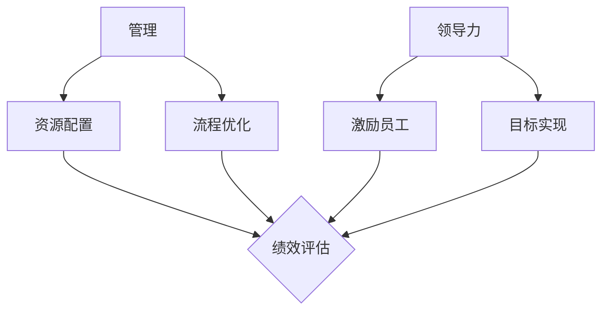

### 领导力模型介绍

领导力模型多种多样，其中最具代表性的包括Transformational Leadership、Servant Leadership和Situational Leadership。

#### Transformational Leadership

Transformational Leadership（变革型领导）强调领导者通过激励和启发员工来实现变革。其核心原理如下：

```plaintext
1. 激发员工愿景：领导者要能够描绘一个激励人心的未来愿景。
2. 激发员工热情：领导者通过激励和奖励机制来激发员工的积极性。
3. 培养信任：领导者要建立与员工的信任关系，以促进合作和共同进步。
```

#### Servant Leadership

Servant Leadership（服务型领导）强调领导者首先是一位服务者，关注员工的成长和福祉。其核心原理如下：

```plaintext
1. 倾听与沟通：领导者要倾听员工的需求和意见，建立有效的沟通机制。
2. 培养员工：领导者要关注员工的个人成长，提供培训和发展机会。
3. 培养团队：领导者要通过团队建设活动，增强团队凝聚力和协作精神。
```

#### Situational Leadership

Situational Leadership（情境型领导）强调领导者根据不同情境采取不同的领导风格。其核心原理如下：

```plaintext
1. 分析情境：领导者要分析团队成员的成熟度和任务的重要性。
2. 选择风格：根据情境选择最合适的领导风格。
3. 调整风格：领导者要能够根据情境的变化灵活调整领导风格。
```

### 领导风格与团队关系

不同的领导风格会对团队关系产生不同的影响。一个有效的领导风格应该能够激励员工，增强团队凝聚力，提高团队绩效。以下是几种常见的领导风格及其对团队关系的影响：

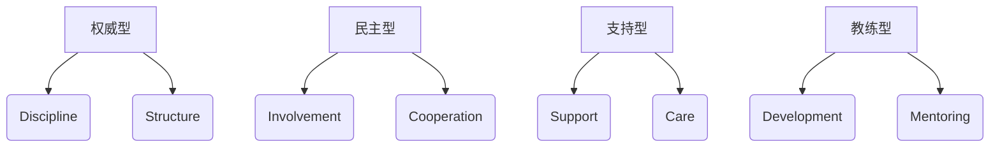

## 员工发展模型

### 员工发展体系概述

员工发展体系是一个系统化的过程，旨在通过培训、指导和个人发展计划，提高员工的能力和绩效。其核心组成部分包括：

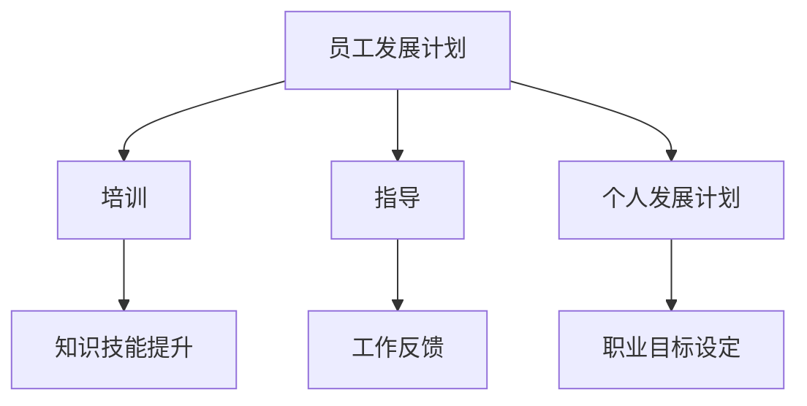

### 员工发展路径设计

#### 基础能力培养

基础能力培养包括技术能力和人际沟通技巧。技术能力提升可以通过以下步骤实现：

```plaintext
1. 设定具体目标：明确需要提升的技术技能。
2. 制定学习计划：包括学习资源、学习时间和评估方式。
3. 实践与反馈：通过实际操作和反馈来巩固和提高技能。
```

人际沟通技巧提升可以通过以下步骤实现：

```plaintext
1. 建立有效的沟通机制：包括倾听、表达和反馈。
2. 参加沟通技巧培训：如非暴力沟通、有效表达等。
3. 实践与反思：通过实际沟通场景的应用和反思来提高沟通能力。
```

#### 高级能力培养

高级能力培养包括领导力和管理能力。领导力培养可以通过以下步骤实现：

```plaintext
1. 设定领导力发展目标：明确需要提升的领导力维度。
2. 参加领导力培训：如变革型领导、服务型领导等。
3. 实践与反思：通过实际领导场景的应用和反思来提高领导力。
```

管理能力提升可以通过以下步骤实现：

```plaintext
1. 学习管理知识：包括团队管理、项目管理等。
2. 参与管理实践：通过实际管理任务来提高管理能力。
3. 寻求反馈：从上级、同事和下属那里获取反馈，持续改进。
```

### 员工发展评价与反馈

员工发展评价与反馈是员工发展体系的重要组成部分。通过定期的评价和反馈，可以帮助员工了解自己的发展状况，明确改进的方向。评价与反馈的过程包括：

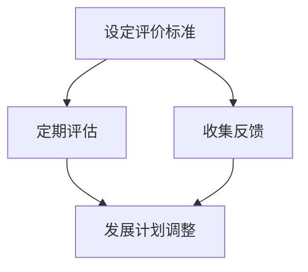

## 职业路径设计

### 职业发展目标设定

职业发展目标的设定是职业路径设计的起点。一个明确、具体和可实现的目标能够为员工提供方向和动力。设定职业发展目标可以通过以下步骤实现：

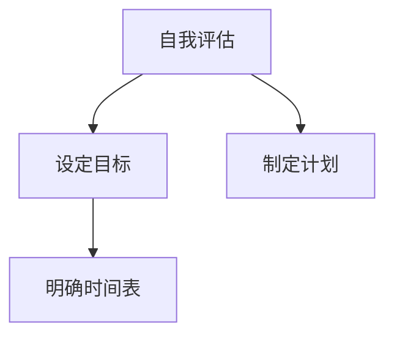

### 职业路径规划方法

职业路径规划方法包括以下步骤：

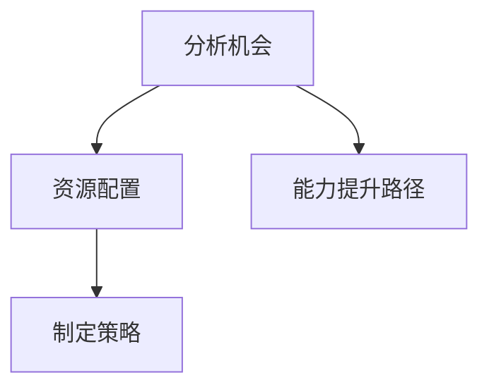

### 职业发展策略

职业发展策略包括以下几个方面：

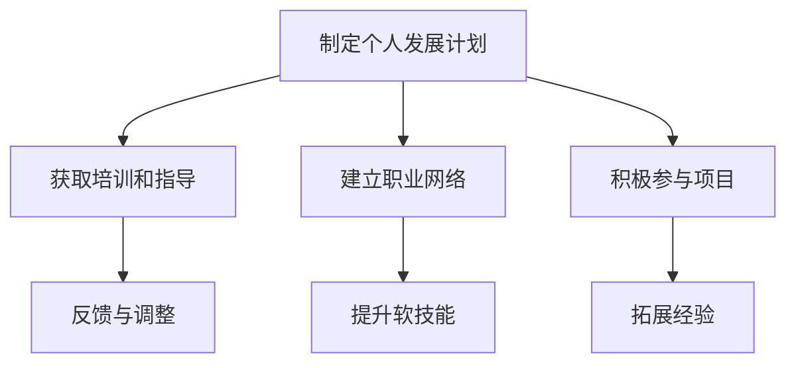

## 团队领导力

### 团队建设基础

团队建设是团队领导力的基础。一个高效的团队需要具备以下几个特征：

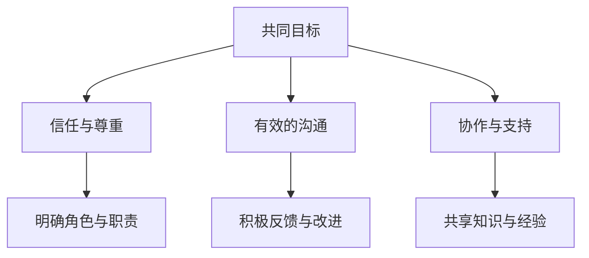

### 团队领导力模型

团队领导力模型包括以下几种：

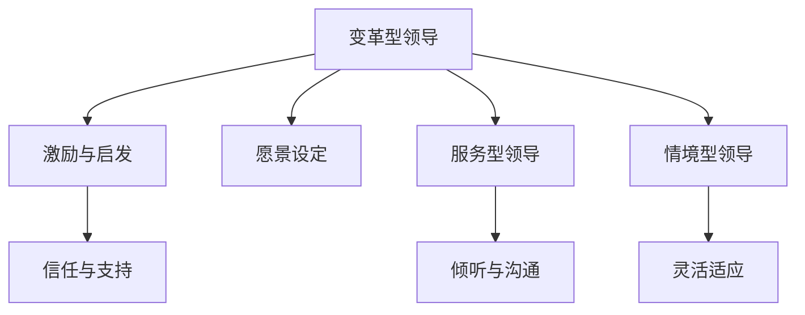

### 团队领导力提升实践

团队领导力提升可以通过以下实践实现：

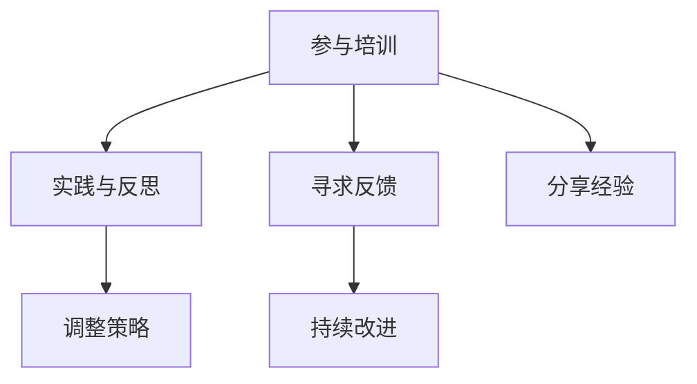

## 领导力提升实践

### 领导力发展计划制定

领导力发展计划包括以下步骤：

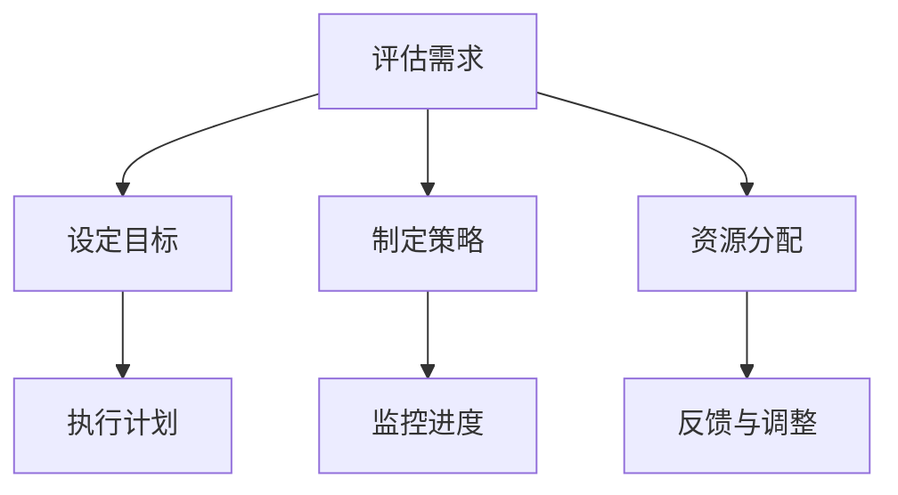

### 领导力发展工具与方法

领导力发展工具与方法包括：

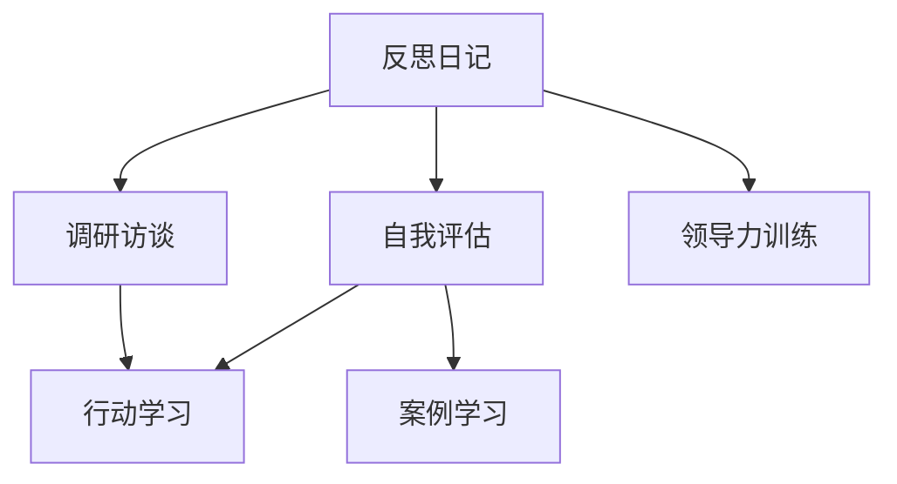

### 领导力发展案例分享

领导力发展案例分享可以帮助领导者学习和借鉴成功的领导经验。以下是几个领导力发展案例：

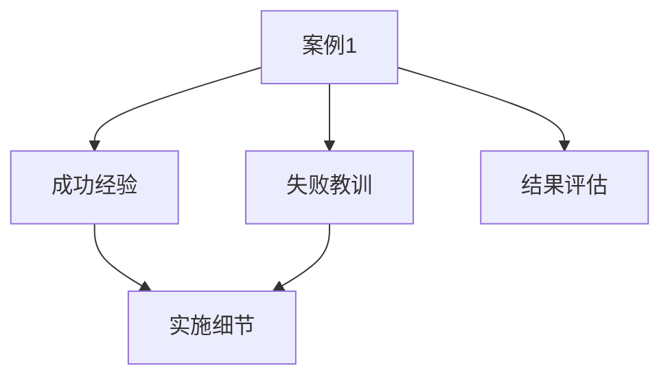

## 跨部门沟通与合作

### 跨部门沟通的重要性

跨部门沟通对于组织的协调和效率至关重要。有效的跨部门沟通能够促进信息共享，提高决策质量，减少冲突。以下是几个关键点：

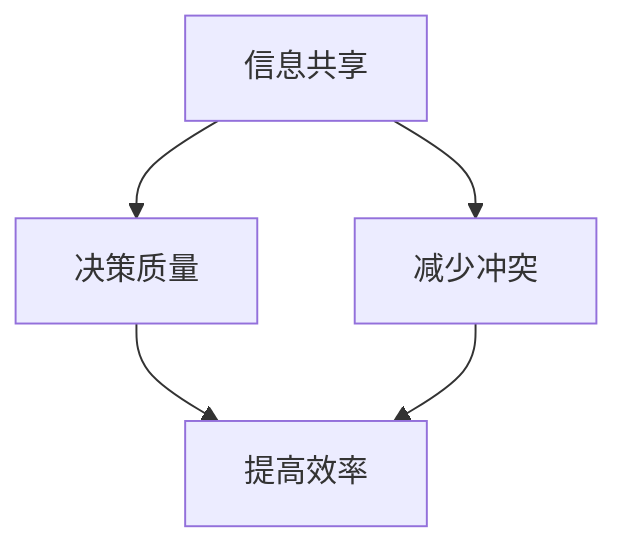

### 跨部门沟通障碍与解决策略

跨部门沟通障碍包括文化差异、职责不清和沟通不畅等。解决策略如下：

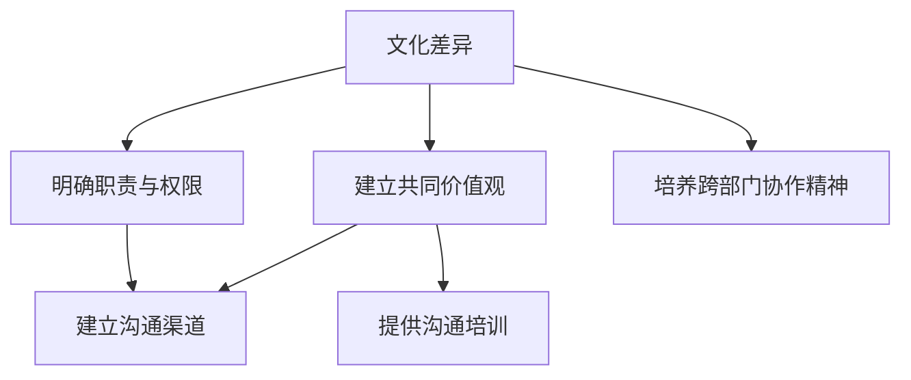

### 跨部门合作最佳实践

跨部门合作最佳实践包括：

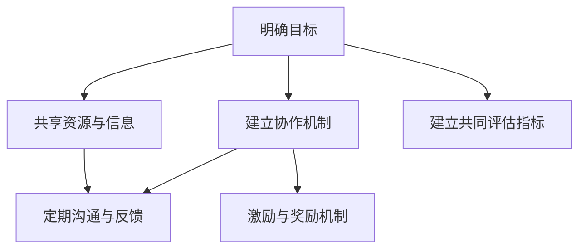

## 领导力与组织文化

### 组织文化对领导力的影响

组织文化对领导力有着深远的影响。积极的文化能够激励员工，促进创新，提高组织的整体效能。以下是几个关键点：

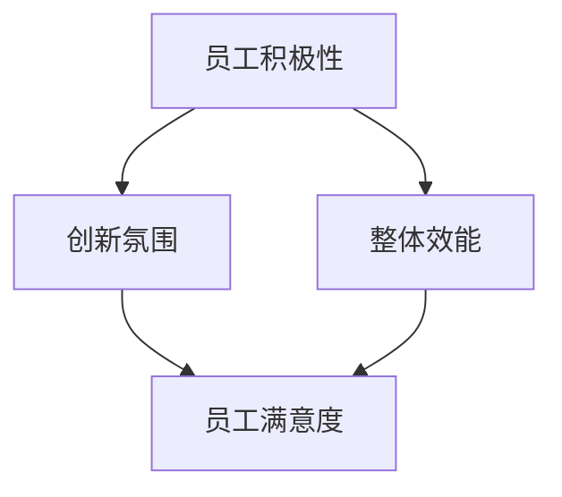

### 构建积极组织文化的策略

构建积极组织文化的策略包括：

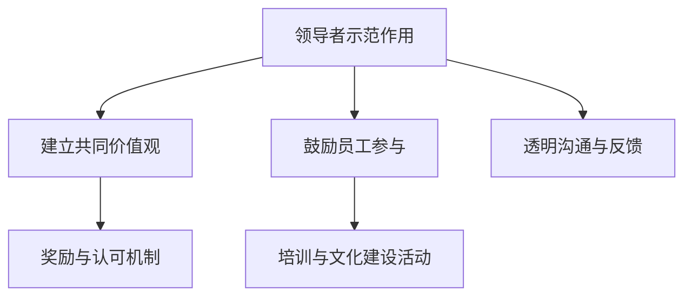

### 领导者在组织文化中的角色

领导者在组织文化中扮演着至关重要的角色。他们不仅是文化的传承者，更是文化的塑造者。以下是几个关键点：

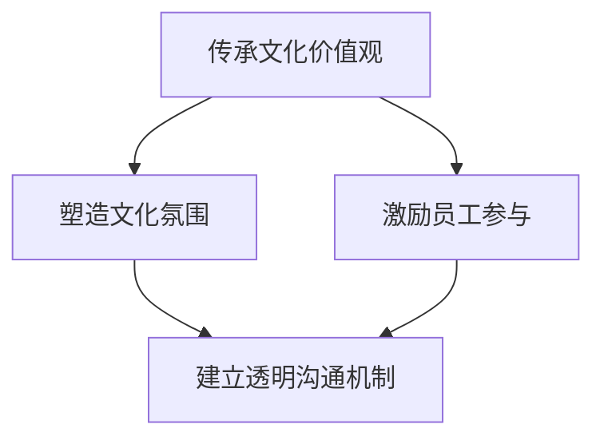

## 结论

本文通过深入分析领导力与员工发展的关系，探讨了如何设计有效的职业路径。领导力是推动员工发展的关键，而有效的职业路径设计则是实现组织和个人共同成长的重要手段。通过本文的探讨，我们希望读者能够理解领导力的核心概念，掌握员工发展的模型，并运用这些知识来设计出适合自己团队的职业路径。

## 作者信息

作者：AI天才研究院/AI Genius Institute & 禅与计算机程序设计艺术 /Zen And The Art of Computer Programming

## 最佳实践 tips、小结、注意事项、拓展阅读等内容

### 最佳实践 tips

1. 定期与员工进行一对一的沟通，了解他们的职业发展需求。
2. 建立一个开放、透明的沟通文化，鼓励员工提出意见和建议。
3. 为员工提供多样化的培训和发展机会，以提升他们的技能和知识。
4. 建立明确的职业发展路径，让员工看到未来的成长方向。

### 小结

有效的职业路径设计不仅能够提升员工的职业发展满意度，还能为组织培养出具备领导力的人才。通过理解领导力的核心概念和员工发展的模型，领导者可以更好地设计出适合团队的职业路径，促进组织和个人共同成长。

### 注意事项

1. 职业路径设计要结合组织的战略目标和业务需求。
2. 定期评估和调整职业路径，以适应不断变化的环境。
3. 关注员工的个性化需求，提供定制化的职业发展方案。

### 拓展阅读

1. 《领导力与团队管理：从个体到整体的转变》
2. 《员工发展计划：如何设计有效的培训与成长方案》
3. 《组织文化与团队绩效：打造高效的职场环境》

---

通过本文的探讨，我们希望读者能够对领导力与员工发展的关系有更深入的理解，并能够在实际工作中运用这些知识来设计出有效的职业路径，推动组织和个人共同成长。

