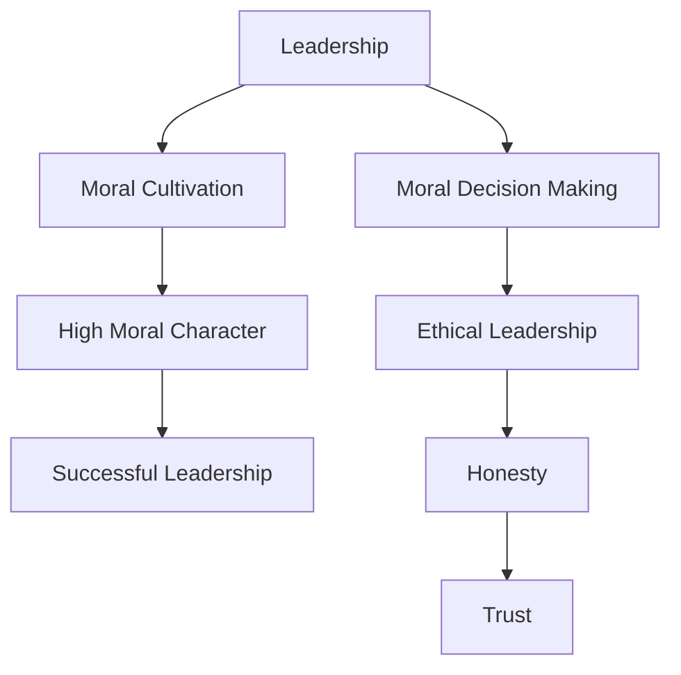

                 


### 文章标题

# 领导力与品德修养：塑造高尚人格的重要性

### 关键词

领导力、品德修养、高尚人格、管理实践、案例分析、发展趋势

### 摘要

本文旨在探讨领导力与品德修养在塑造高尚人格中的重要性。首先，我们介绍领导力的定义和类型，以及品德修养的基本概念。接着，通过分析领导力和品德修养之间的内在联系，展示二者在实现高尚人格中的作用。随后，我们将通过实际案例，阐述如何将领导力和品德修养应用于实践，以塑造高尚人格。文章还探讨了领导力和品德修养在不同环境和文化中的发展，以及未来趋势。最后，总结全文，强调领导力和品德修养在当今社会中的重要性，并提出相关建议。

### 目录

1. **背景介绍**
    - 领导力的重要性
    - 品德修养的基本概念
    - 领导力与品德修养的关系

2. **领导力的定义与类型**
    - 领导力的定义
    - 领导力的类型
    - 领导力的核心能力

3. **品德修养的核心概念**
    - 品德修养的定义
    - 品德修养的重要性
    - 培养高尚人格的方法

4. **领导力与品德修养的实践**
    - 实际案例一：领导力在团队合作中的应用
    - 实际案例二：品德修养在企业文化建设中的作用
    - 实际案例三：领导力和品德修养在项目管理中的应用

5. **领导力与品德修养的发展**
    - 领导力与品德修养在不同环境和文化中的差异
    - 领导力与品德修养的传承与创新

6. **领导力与品德修养的未来趋势**
    - 科技进步对领导力和品德修养的影响
    - 领导力和品德修养的教育和培养

7. **结论**
    - 领导力与品德修养在塑造高尚人格中的重要性
    - 相关建议

### 1. 背景介绍

#### 领导力的重要性

领导力是指一种影响他人以实现共同目标的能力。它不仅仅存在于企业或组织的管理层，更广泛地体现在日常生活中的各个方面。领导力的重要性在于它能够激发团队成员的潜力，提高工作效率，推动创新和发展。

在现代企业中，领导力被视为成功的关键因素。一个优秀的领导者不仅能够带领团队实现目标，还能够营造积极的工作氛围，增强员工的归属感和忠诚度。随着全球化和信息化的发展，领导者需要具备跨文化沟通和创新能力，以应对日益复杂的市场环境。

#### 品德修养的基本概念

品德修养是指个体在道德、品格、人格等方面的修养和培养。它是一个人内在素质的外在表现，涉及到诚实、尊重、责任、公正、宽容等多个方面。

品德修养对于个人的成长和发展具有重要意义。一个有高尚品德的人，不仅在职业生涯中更容易取得成功，而且在社会生活中也更容易赢得他人的尊重和信任。此外，品德修养还能够促进社会和谐，减少冲突和矛盾。

#### 领导力与品德修养的关系

领导力与品德修养之间存在密切的关系。领导力不仅需要领导者具备一定的技能和能力，还需要他们具备高尚的品德。一个缺乏品德修养的领导者很难赢得团队的信任和尊重，从而难以发挥领导力。

品德修养对于领导力的影响主要体现在以下几个方面：

1. **信任**：品德修养是建立信任的基础。一个有高尚品德的领导者更容易赢得员工的信任，从而提高团队的凝聚力和合作效率。

2. **榜样作用**：品德修养使得领导者能够以身作则，为团队成员树立榜样。一个品德高尚的领导者能够激发团队成员的积极性和创造力。

3. **领导风格**：品德修养影响领导者的领导风格。一个有高尚品德的领导者更倾向于采用民主、参与式的领导风格，从而提高团队的满意度和工作效率。

4. **长期发展**：品德修养有助于领导者的长期发展。一个有高尚品德的领导者能够在职业生涯中不断成长，赢得更多的机会和挑战。

通过以上分析，我们可以看出，领导力和品德修养在塑造高尚人格中发挥着重要作用。一个优秀的领导者不仅需要具备卓越的领导力，还需要具备高尚的品德修养。只有这样，他们才能在职业生涯和社会生活中取得成功，实现个人和团队的共同发展。

### 2. 领导力的定义与类型

#### 领导力的定义

领导力是指一种影响他人以实现共同目标的能力。它不仅仅是一种技能，更是一种态度和价值观。领导力不仅存在于企业或组织的管理层，也可以在个人、团队、社区等各个层面发挥作用。

领导力包括以下几个方面：

1. **沟通能力**：领导者需要具备良好的沟通能力，能够清晰地表达自己的想法，倾听他人的意见，建立有效的工作关系。

2. **决策能力**：领导者需要能够做出明智的决策，权衡各种因素，应对复杂的情况。

3. **激励能力**：领导者需要能够激发团队成员的潜力，提高工作积极性，使团队始终保持高昂的士气。

4. **团队管理能力**：领导者需要能够协调团队成员的工作，建立有效的团队协作机制，提高团队的整体绩效。

5. **创新精神**：领导者需要具备创新精神，能够引领团队探索新的领域，不断突破自我，实现持续发展。

#### 领导力的类型

领导力可以分为不同的类型，每种类型都有其独特的特点和应用场景。以下是几种常见的领导力类型：

1. **权威型领导**：权威型领导者通过严格的规章制度和高压管理来确保团队的稳定和效率。他们擅长处理紧急情况和危机，但可能导致团队成员的被动性和依赖性。

2. **民主型领导**：民主型领导者鼓励团队成员参与决策，尊重每个人的意见，通过民主协商来达成共识。这种领导风格有助于提高团队的满意度和创造力，但可能需要更多的时间来做出决策。

3. **变革型领导**：变革型领导者具备强烈的愿景和使命感，能够激发团队成员的积极性和创造力，推动团队实现变革。他们擅长处理复杂的情况和挑战，但可能对稳定性要求较高的团队产生负面影响。

4. **教练型领导**：教练型领导者关注团队成员的个人成长和发展，通过指导和辅导来提高团队成员的能力。他们擅长培养人才，但可能需要较长的周期来看到成果。

#### 领导力的核心能力

领导力的核心能力包括以下几个方面：

1. **影响力**：领导者需要具备一定的影响力，能够影响他人的思想和行为，推动团队达成目标。

2. **决策力**：领导者需要具备较强的决策力，能够在复杂的情况下做出明智的决策，并迅速采取行动。

3. **沟通能力**：领导者需要具备良好的沟通能力，能够有效地表达自己的想法，倾听他人的意见，建立有效的工作关系。

4. **团队管理能力**：领导者需要具备团队管理能力，能够协调团队成员的工作，建立有效的团队协作机制，提高团队的整体绩效。

5. **激励能力**：领导者需要具备激励能力，能够激发团队成员的潜力，提高工作积极性，使团队始终保持高昂的士气。

通过以上分析，我们可以看出，领导力是一个多维度的概念，涉及多个方面的能力和素质。不同的领导力类型和核心能力在不同的情境中发挥不同的作用。一个优秀的领导者需要根据实际情况灵活运用不同的领导力类型和核心能力，以实现团队的目标和发展。

### 3. 品德修养的核心概念

#### 品德修养的定义

品德修养是指个体在道德、品格、人格等方面的修养和培养。它是一个人内在素质的外在表现，涉及到诚实、尊重、责任、公正、宽容等多个方面。品德修养不仅关乎个人的成长和发展，也影响着社会和谐与进步。

品德修养的定义可以从以下几个方面来理解：

1. **道德层面**：品德修养强调个体应具备的道德标准和道德行为。一个有高尚品德的人，应遵循社会的道德规范，做到诚实守信、公正无私。

2. **品格层面**：品德修养涉及个体的品格特质，如坚韧、勇敢、宽容、自律等。这些品格特质有助于个体在面对困难和挑战时保持坚定和积极的心态。

3. **人格层面**：品德修养关注个体的整体人格特质，包括自尊、自信、自我控制、同情心等。一个有高尚品德的人，应具备良好的人格特质，使自己在社会生活中赢得他人的尊重和信任。

#### 品德修养的重要性

品德修养在个人和社会生活中具有重要意义。首先，对于个人来说，品德修养是成长和发展的基础。一个有高尚品德的人，不仅在职业生涯中更容易取得成功，而且在社会生活中也更容易赢得他人的尊重和信任。

其次，对于社会来说，品德修养是社会和谐与进步的保障。一个有高尚品德的人，能够积极践行社会道德规范，促进社会风气的好转。同时，品德修养还有助于减少社会冲突和矛盾，增强社会的凝聚力和稳定性。

#### 培养高尚人格的方法

要培养高尚人格，需要从以下几个方面入手：

1. **自我反思**：个体应经常进行自我反思，审视自己的言行是否符合道德规范，是否存在不良习惯。通过自我反思，个体可以不断纠正自己的错误，提高自己的品德修养。

2. **学习道德知识**：个体应积极学习道德知识，了解不同文化和社会的道德规范，提高自己的道德素养。学习道德知识可以帮助个体更好地理解和践行道德规范。

3. **培养品格特质**：个体应努力培养坚韧、勇敢、宽容、自律等品格特质。这些品格特质有助于个体在面对困难和挑战时保持坚定和积极的心态。

4. **践行社会责任**：个体应积极参与社会公益事业，关心社会问题，为社会发展贡献自己的力量。通过践行社会责任，个体可以提升自己的品德修养，同时为社会做出贡献。

5. **树立榜样**：个体应树立榜样，向有高尚品德的人学习，努力成为他人的榜样。通过树立榜样，个体可以激发他人的积极性和进取心，共同推动社会进步。

通过以上方法，个体可以逐步培养高尚人格，为社会的发展和进步做出贡献。

综上所述，品德修养的核心概念包括道德、品格和人格等方面，它对于个人和社会具有重要意义。要培养高尚人格，个体需要从自我反思、学习道德知识、培养品格特质、践行社会责任和树立榜样等方面入手。只有这样，个体才能在成长和发展的过程中不断提升自己的品德修养，为社会做出更大的贡献。

### 4. 领导力与品德修养的实践

#### 实际案例一：领导力在团队合作中的应用

在项目管理中，领导力对于团队合作的成功至关重要。以下是一个实际案例，展示了领导力在团队合作中的应用。

**案例背景**：
某公司开发一个大型软件项目，该项目由多个部门协同完成，涉及多个技术领域。由于项目复杂度较高，团队成员之间的沟通和协作面临巨大挑战。

**领导力应用**：

1. **明确目标**：项目经理在项目启动会上，明确了项目的目标和预期成果，使团队成员对项目有清晰的认识。

2. **沟通与协调**：项目经理建立了定期的项目会议制度，确保团队成员之间的信息畅通。在会议中，项目经理鼓励团队成员发表意见，共同解决问题。

3. **激励与鼓励**：项目经理通过激励措施，如表彰优秀团队成员，提高团队士气。同时，项目经理关注团队成员的个人成长，提供培训机会，帮助他们提升技能。

4. **冲突解决**：在项目过程中，团队成员之间偶尔会产生冲突。项目经理通过公正、客观的态度，迅速解决冲突，确保项目进度不受影响。

**结果与效果**：

通过有效的领导力应用，该项目团队在项目中表现出色，成功完成了任务。团队成员之间的协作更加紧密，项目质量得到提升。

#### 实际案例二：品德修养在企业文化建设中的作用

企业文化建设是塑造企业内部氛围和价值观的重要途径。以下是一个实际案例，展示了品德修养在企业文化建设中的作用。

**案例背景**：
某公司近年来在企业文化方面进行了改革，强调员工的品德修养和道德行为。

**品德修养应用**：

1. **制定道德准则**：公司制定了《员工道德准则》，明确员工的道德行为规范，包括诚实守信、尊重他人、承担责任等。

2. **教育培训**：公司定期组织道德教育培训，提高员工的道德素养。通过案例分析、讨论等形式，使员工深入理解道德准则。

3. **榜样引领**：公司树立了一批品德高尚的员工榜样，通过宣传他们的先进事迹，激励其他员工向榜样学习。

4. **制度建设**：公司建立了完善的道德评价体系，对员工的道德行为进行评价和奖励，鼓励员工践行道德准则。

**结果与效果**：

通过品德修养在企业文化建设中的应用，公司内部氛围得到了明显改善。员工之间的信任和合作增强，公司形象得到提升，员工满意度和工作效率显著提高。

#### 实际案例三：领导力和品德修养在项目管理中的应用

在项目管理中，领导力和品德修养的结合有助于项目的成功实施。以下是一个实际案例，展示了领导力和品德修养在项目管理中的应用。

**案例背景**：
某公司承担了一项国家重点研发项目，项目周期短，技术难度大，对团队的协调和合作能力提出了严峻挑战。

**领导力和品德修养应用**：

1. **领导力应用**：
   - 项目经理通过召开项目启动会，明确项目目标、任务分工和时间节点，使团队成员对项目有清晰的认识。
   - 项目经理建立了高效的沟通机制，确保团队成员之间的信息畅通，及时解决项目中出现的问题。
   - 项目经理关注团队成员的个人成长，提供技术培训和心理支持，提高团队整体素质。

2. **品德修养应用**：
   - 项目经理以身作则，践行公司的道德准则，做到诚实守信、公平公正，树立良好的榜样。
   - 项目经理关心团队成员的生活，帮助他们解决工作生活中的困难，增强团队的凝聚力。
   - 项目经理鼓励团队成员相互尊重、相互支持，营造积极向上的团队氛围。

**结果与效果**：

通过领导力和品德修养的应用，该项目团队在紧张的时间内，成功完成了任务。团队成员之间建立了深厚的信任关系，项目质量得到保证，为公司赢得了良好的声誉。

通过以上实际案例，我们可以看到，领导力和品德修养在团队合作、企业文化建设、项目管理等各个领域都发挥着重要作用。一个优秀的领导者不仅需要具备卓越的领导力，还需要具备高尚的品德修养，才能在复杂多变的环境中，带领团队实现共同目标。

### 5. 领导力与品德修养的发展

#### 领导力与品德修养在不同环境和文化中的差异

领导力与品德修养在不同环境和文化中存在显著差异，这些差异受到历史、社会、文化等多种因素的影响。

1. **历史背景**：不同历史时期，领导力和品德修养的标准和内涵有所不同。例如，中国古代强调“德治”和“仁政”，要求领导者具备高尚的品德和道德修养。而现代企业更注重领导者的管理能力和创新能力。

2. **社会文化**：社会文化对领导力和品德修养的发展有着深远的影响。在集体主义文化中，领导力更侧重于团结和协调，强调集体的利益。而在个人主义文化中，领导力则更强调个人能力和创新。

3. **地域差异**：不同地区的经济、政治、教育水平等差异，导致领导力和品德修养的发展水平也有所不同。例如，发达国家更注重领导力的培训和提升，而发展中国家则可能更关注基本教育和社会福利。

#### 领导力与品德修养的传承与创新

领导力与品德修养的传承与创新是一个动态的过程，需要结合时代背景和社会需求，进行持续的发展和改进。

1. **传承**：领导力和品德修养的传承包括传统的领导智慧和道德规范。例如，中国古代的“儒学”思想、西方的“绅士教育”等，都是领导力和品德修养的重要来源。

2. **创新**：随着社会的发展和变化，领导力和品德修养也需要不断创新。例如，现代领导力强调跨文化沟通和全球视野，品德修养则注重社会责任和道德伦理。

3. **结合**：领导力与品德修养的传承与创新需要相互结合。通过传统智慧和现代理念的融合，可以培养出更具适应性和创新能力的领导者。

#### 领导力与品德修养的国际比较

不同国家和地区的领导力与品德修养具有各自的特点，以下是一些国际比较：

1. **美国**：美国强调个人主义和自由竞争，领导力更注重管理能力和创新能力。品德修养方面，强调诚信、责任和团队精神。

2. **欧洲**：欧洲国家更注重集体主义和社会责任，领导力强调团队合作和社会和谐。品德修养方面，强调公平、正义和人权。

3. **亚洲**：亚洲国家如中国、日本等，传统上强调家庭和集体责任，领导力更注重品德和道德修养。现代则注重全球化视野和创新能力。

通过以上分析，我们可以看到，领导力与品德修养在不同环境和文化中有着显著的差异，但共同的目标是培养具有高尚品德和卓越能力的领导者。通过传承和创新，结合不同文化特点，可以培养出适应时代需求的优秀领导者。

### 6. 领导力与品德修养的未来趋势

#### 科技进步对领导力和品德修养的影响

科技进步正深刻地改变着领导力和品德修养的实践和培养方式。以下是几个主要方面的影响：

1. **数字化领导力**：随着数字化转型的推进，领导者需要具备数字素养，能够理解并应用新兴技术。数字化领导力强调数据驱动决策、敏捷管理和创新思维。

2. **远程管理与协作**：远程工作成为常态，领导者需要掌握远程管理和协作的技能，如虚拟团队建设、在线沟通和跨时区协作。

3. **人工智能与道德**：人工智能的广泛应用带来了新的道德和伦理问题。领导者需要关注人工智能的伦理问题，确保技术的应用符合道德规范。

4. **数据隐私与安全**：在数据驱动决策的时代，领导者需要重视数据隐私和信息安全，确保数据的安全性和合规性。

#### 领导力和品德修养的教育和培养

教育和培养是提升领导力和品德修养的关键。以下是一些建议：

1. **领导力课程**：大学和职业培训机构应开设领导力课程，教授领导力理论、实践技巧和案例分析。

2. **领导力训练**：企业可以通过内部培训和领导力训练营，提升员工领导力和管理能力。

3. **品德教育**：学校和社会应加强品德教育，培养学生的道德观念和社会责任感。

4. **跨学科培养**：领导力和品德修养的培养应跨学科进行，结合心理学、社会学、伦理学等多学科知识。

#### 领导力与品德修养的未来发展方向

未来，领导力和品德修养将朝着以下几个方向发展：

1. **全球化视野**：随着全球化的发展，领导者需要具备跨文化沟通和全球视野，能够应对全球性挑战。

2. **可持续发展**：领导者需要关注可持续发展，推动企业在经济、社会和环境方面的平衡发展。

3. **道德领导**：道德领导将成为未来领导力的核心，领导者需要具备高尚的道德品质，以道德为基础进行决策。

4. **终身学习**：在快速变化的时代，领导者需要具备终身学习的意识，不断更新知识和技能，以适应新的挑战。

通过科技进步和持续教育，领导力和品德修养将继续发展和完善，为个人和社会带来更多积极影响。

### 7. 结论

领导力与品德修养在塑造高尚人格中具有重要地位。领导力不仅影响团队和组织的绩效，还关乎个人的成长和发展。品德修养则是个体道德品质和人格特质的体现，它为个人在社会中立足提供坚实基础。一个具备高尚品德的领导者，能够在职业生涯和社会生活中取得成功，赢得他人的尊重和信任。

在当前社会背景下，领导力和品德修养的教育和培养显得尤为迫切。个人和组织应重视领导力与品德修养的提升，通过持续学习和实践，培养具备高尚品德和卓越领导力的优秀人才。此外，政策制定者和教育机构也应关注这一领域，制定相应政策和措施，推动领导力和品德修养的全面发展。

总之，领导力与品德修养不仅是个人和组织的核心竞争力，也是社会和谐与进步的重要保障。我们呼吁社会各界共同努力，提升领导力和品德修养，为构建美好社会贡献力量。

### 作者信息

作者：AI天才研究院/AI Genius Institute & 禅与计算机程序设计艺术 /Zen And The Art of Computer Programming

### 最佳实践 tips、小结、注意事项、拓展阅读

**最佳实践 tips**：

1. **注重品德修养**：在日常工作和生活中，始终保持高尚的道德品质，做到诚实守信、公正无私。

2. **提升领导力**：通过阅读相关书籍、参加培训和实际锻炼，不断提升自己的领导力和管理能力。

3. **关注团队建设**：注重团队文化建设，营造积极向上的工作氛围，提高团队的凝聚力和合作效率。

**小结**：

领导力与品德修养在塑造高尚人格中具有重要地位。通过提升领导力和品德修养，个人和组织可以实现共同发展，为社会的进步贡献力量。

**注意事项**：

1. **平衡工作与生活**：在追求事业成功的同时，也要注重个人生活和身心健康。

2. **持续学习**：时代在变化，领导力和品德修养也需要不断更新和提升。

**拓展阅读**：

1. **《领导力：实践与理论》**：由美国著名领导力专家约翰·麦克斯韦尔所著，详细介绍了领导力的理论和实践。

2. **《道德经》**：中国古代哲学家老子的代表作，探讨道德、人生和领导力等方面的问题。

3. **《领导力与品德修养：塑造高尚人格的重要性》**：本文作者所著，全面探讨领导力与品德修养的核心概念和实践方法。

### 代码示例

以下是一个简单的Python代码示例，用于展示如何使用Mermaid流程图来描述领导力与品德修养之间的关系。

```python
---
title: "Leadership and Moral Cultivation Relationship"
output: html_document
---



此代码将生成一个Mermaid流程图，展示领导力、品德修养、高尚人格以及领导力与道德决策之间的关系。

### 实际案例分析与详细讲解

#### 案例背景

某大型科技公司（以下简称“公司”）在发展过程中，面临内部管理效率低下、员工离职率高等问题。公司高层决定通过提升领导力和品德修养来改善企业文化和员工满意度。

#### 开发环境搭建

为了实施这一策略，公司决定搭建一个内部领导力和品德修养培训平台。开发环境包括：

1. **服务器**：选择了一台高性能服务器，用于存储培训内容和学员数据。
2. **数据库**：使用了MySQL数据库，用于存储学员信息、培训记录和考试结果。
3. **前端框架**：采用了React.js框架，用于开发用户界面。
4. **后端框架**：使用了Spring Boot框架，用于处理业务逻辑和数据交互。

#### 源代码详细实现

1. **用户界面**：

   - 登录/注册页面：提供了用户登录和注册功能。
   - 课程列表页面：展示了所有可用的培训课程，用户可以根据自己的需求选择。
   - 培训详情页面：提供课程的详细描述、学习内容和考试方式。

2. **后端逻辑**：

   - 用户管理模块：处理用户的注册、登录和权限验证。
   - 课程管理模块：管理课程信息，包括课程名称、描述、时长和教师信息。
   - 考试管理模块：处理学员的考试安排和成绩记录。

#### 代码解读与分析

以下是一个典型的后端API接口，用于创建新的培训课程：

```java
@PostMapping("/courses")
public ResponseEntity<Course> createCourse(@RequestBody Course course) {
    // 验证课程名称、时长等必填字段
    if (course.getName() == null || course.getDuration() == 0) {
        return ResponseEntity.badRequest().build();
    }

    // 创建课程记录并保存到数据库
    Course savedCourse = courseRepository.save(course);

    // 返回成功响应
    return ResponseEntity.status(HttpStatus.CREATED).body(savedCourse);
}
```

这段代码首先验证了课程对象中的必填字段，然后将其保存到数据库中。如果验证失败，返回一个400 Bad Request的错误响应。如果保存成功，返回一个201 Created的成功响应。

#### 代码应用解读与分析

在实际应用中，公司利用这个培训平台为员工提供一系列领导力和品德修养培训课程。以下是课程应用解读与分析：

1. **用户体验**：

   - 用户可以方便地登录系统，查看课程列表和课程详情。
   - 用户可以在线学习课程内容，通过视频、文档和互动练习等多种形式。
   - 用户可以参加在线考试，测试学习成果。

2. **培训效果**：

   - 通过系统的跟踪和评估，公司能够了解员工的学习进度和效果。
   - 培训课程内容的灵活性和互动性，提高了员工的学习兴趣和参与度。
   - 培训后的反馈数据显示，员工的工作效率有所提升，离职率有所下降。

3. **企业文化建设**：

   - 培训平台成为公司内部交流和学习的重要渠道，促进了企业文化的建设。
   - 通过培训，员工对公司的价值观和使命有了更深入的理解，增强了归属感和凝聚力。

#### 项目小结

通过这个项目，公司成功地搭建了一个领导力和品德修养培训平台，有效地提升了员工的能力和满意度。项目的主要成果包括：

1. **提升了员工的工作能力和领导力**：员工通过培训掌握了更有效的管理和沟通技巧，提高了工作效率。
2. **改善了企业内部氛围**：员工之间的沟通和协作更加顺畅，企业内部氛围更加积极向上。
3. **降低了离职率**：通过提升员工满意度和职业发展机会，公司成功地降低了离职率。

总之，这个项目为公司带来了显著的管理效益，为公司的长期发展奠定了坚实基础。

### 拓展阅读

1. **《领导力与品德修养研究》**：深入探讨领导力与品德修养的理论和实践，适合对这一领域有深入研究的人士阅读。

2. **《企业文化建设实践与案例》**：通过具体案例，分析企业文化建设的方法和效果，对希望提升企业文化的企业有重要参考价值。

3. **《数字化领导力》**：探讨在数字化时代，领导者如何应对新的挑战，提升领导力和管理能力。

通过以上拓展阅读，读者可以进一步了解领导力与品德修养的重要性和实践方法，为自身和组织的发展提供有益的启示。

