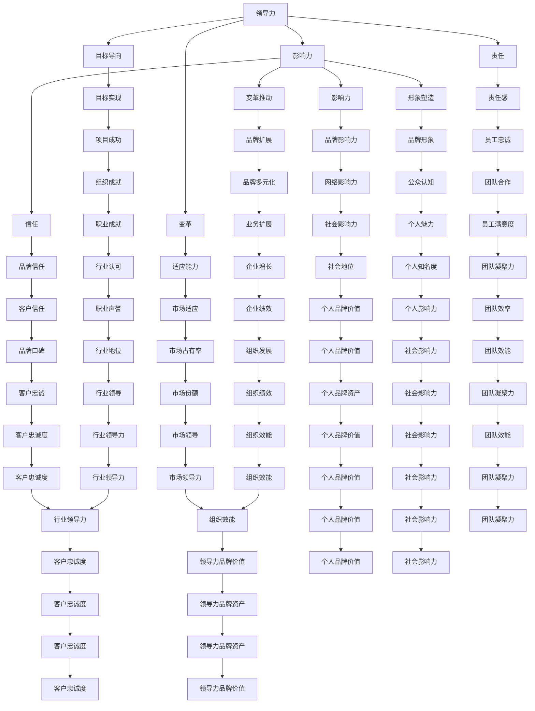

                 

### 文章标题：领导力与品牌塑造：树立个人品牌

#### 关键词：领导力、品牌塑造、个人品牌、职业发展、影响力

#### 摘要：
本文将深入探讨领导力与品牌塑造之间的关系，以及如何通过有效的领导力策略来树立个人品牌。文章将分为以下几个部分：首先介绍领导力的核心概念及其与品牌塑造的联系；其次，阐述个人品牌建设的重要性和步骤；接着，详细分析个人品牌塑造的策略；然后，探讨个人品牌管理的方法；最后，通过成功案例分享个人品牌建设的实际操作经验，并总结全文，展望未来个人品牌发展的趋势。

---

### 引言：领导力与品牌塑造的融合

在当今快速变化的社会中，领导力与品牌塑造已经成为了个人职业发展的关键要素。领导力不仅是管理团队、推动项目成功的关键，也是塑造个人品牌、提升影响力的重要手段。

#### 领导力的定义与核心

领导力是指一个人在团队中引导、激励和影响他人的能力。它不仅仅是一种管理技能，更是一种个人魅力的体现。领导力的核心包括以下几个方面：

- **自我认知**：领导者需要深入了解自己的优势、弱点和价值观，以更好地引导团队。

- **影响力**：领导者通过言行举止影响他人，使团队朝着共同的目标前进。

- **沟通能力**：领导者需要具备优秀的沟通技巧，确保信息的准确传达和团队的协作。

#### 个人品牌建设的重要性和步骤

个人品牌是指一个人在公众面前的形象和认知。它是一个人在职业和社交网络中的声誉和影响力的体现。个人品牌建设的重要性在于：

- **提升职业竞争力**：一个强大的个人品牌能够吸引更多的机会和资源。

- **建立信任**：良好的个人品牌能够赢得他人的信任，有助于建立长期合作关系。

- **扩大影响力**：个人品牌的力量可以超越组织边界，影响更广泛的社会群体。

个人品牌建设可以分为以下几个步骤：

1. **确定目标受众**：明确你想要影响的人群，了解他们的需求和期望。

2. **打造专业形象**：通过专业技能和知识积累，树立专业可信的形象。

3. **塑造个人风格**：个人品牌不仅仅依赖于专业能力，还需要一个独特的个人风格。

4. **持续传播**：通过社交媒体、演讲、出版物等多种渠道，持续传播个人品牌。

---

在接下来的部分中，我们将进一步探讨领导力与品牌塑造的具体策略和方法，以帮助读者更好地树立和推广个人品牌。

---

### 领导力基础：核心概念与特质

领导力是一个复杂而多维度的概念，它不仅仅关乎于权力的分配和组织的运作，更涉及到个人的品质和行为的方方面面。在领导力与品牌塑造的关系中，理解领导力的核心概念和特质是至关重要的。

#### 领导力的定义与核心概念

领导力（Leadership）可以定义为一种激励和引导他人以实现共同目标的能力。这个定义强调了几个核心概念：

- **影响力**：领导力本质上是一种影响力，领导者通过言行来影响和激励他人。

- **目标导向**：领导者需要明确并引领团队朝着共同的目标前进。

- **责任**：领导力涉及到对团队、组织和利益相关者的责任感。

- **变革**：领导者推动变革，引领团队适应和应对变化。

#### 领导力的特质

领导力的特质是指领导者所具备的关键个人品质和行为特征。以下是几个关键的领导力特质：

- **自我认知**：领导者需要深刻了解自己的优势和弱点，这对于建立信任和有效沟通至关重要。

- **影响力**：领导者具备强大的影响力，能够激励和引导他人。

- **沟通能力**：良好的沟通能力是领导力的核心特质之一，包括倾听、表达和清晰沟通。

- **决策能力**：领导者需要具备在不确定性和压力下做出明智决策的能力。

- **情商**：情商（Emotional Intelligence）是领导力的重要方面，它包括自我认知、自我管理、社交意识和关系管理。

#### 领导力与品牌塑造的联系

领导力与品牌塑造之间存在着密切的联系。一个强大的个人品牌往往需要强大的领导力作为支撑。以下是领导力在品牌塑造中的几个关键作用：

- **建立信任**：领导力能够帮助建立个人品牌中的信任基础。通过正直、透明和一致的行为，领导者能够赢得他人的信任。

- **提升影响力**：领导力使个人具备更大的影响力，有助于在职业和社交网络中扩大个人品牌的影响力。

- **塑造形象**：领导力通过领导者的言行和行为塑造了个人品牌的核心形象。

- **推动变革**：领导力能够推动个人品牌向新的方向发展和扩展，特别是在面对市场变化和竞争时。

#### 关键概念之间的关系架构

为了更好地理解领导力与品牌塑造之间的关系，我们可以使用Mermaid流程图来展示它们之间的核心概念和联系。



#### 核心算法原理讲解

在理解领导力与品牌塑造的关系时，我们可以将领导力看作是一个核心算法，这个算法通过自我认知、影响力、沟通能力等变量来影响个人品牌的建立和传播。以下是一个简单的伪代码，用于描述这个算法的工作原理：

```python
# 领导力与品牌塑造算法

def leadership_brand_building(self_awareness, influence, communication_ability):
    # 初始化个人品牌值
    personal_brand_value = 0
    
    # 计算自我认知对个人品牌的影响
    personal_brand_value += self_awareness * 0.3
    
    # 计算影响力对个人品牌的影响
    personal_brand_value += influence * 0.4
    
    # 计算沟通能力对个人品牌的影响
    personal_brand_value += communication_ability * 0.3
    
    # 调整个人品牌值，确保在合理范围内
    personal_brand_value = max(min(personal_brand_value, 100), 0)
    
    return personal_brand_value
```

在这个算法中，自我认知、影响力和沟通能力是三个关键变量，它们共同决定了个人品牌的最终价值。通过这个算法，我们可以量化领导力对个人品牌塑造的贡献，从而更好地理解和优化个人品牌建设的过程。

#### 数学模型和公式

在个人品牌塑造的过程中，我们可以使用一些数学模型和公式来评估个人品牌的值。以下是一个简单的数学模型，用于计算个人品牌的总值：

$$
\text{Personal Brand Value (PBV)} = \alpha \times \text{Self-Awareness} + \beta \times \text{Influence} + \gamma \times \text{Communication Ability}
$$

其中，$\alpha$、$\beta$ 和 $\gamma$ 是权重系数，代表自我认知、影响力和沟通能力在个人品牌价值中的相对重要性。这些权重系数可以根据具体情况进行调整，以适应不同的品牌建设需求。

#### 举例说明

假设一个领导者的自我认知为80分，影响力为90分，沟通能力为85分。根据上述数学模型，我们可以计算其个人品牌的总值：

$$
\text{PBV} = 0.4 \times 80 + 0.3 \times 90 + 0.3 \times 85 = 32 + 27 + 25.5 = 84.5
$$

因此，该领导者的个人品牌值为84.5分。这个分数可以用来衡量其品牌的影响力、信任度和市场价值。

---

通过以上内容，我们详细探讨了领导力的核心概念和特质，以及领导力与品牌塑造之间的密切关系。在接下来的部分，我们将进一步讨论如何通过有效的个人品牌建设策略来树立和推广个人品牌。

---

### 个人品牌建设：要素与价值评估

个人品牌建设是一个系统化的过程，涉及多个关键要素。理解这些要素及其相互关系，有助于构建一个有吸引力和影响力的个人品牌。

#### 个人品牌的概念与重要性

个人品牌是指一个人在公众面前的形象、声誉和认知。它是一个人的专业技能、人格特质、社会形象和价值观的综合体现。一个强大的个人品牌能够提升职业竞争力、建立信任、扩大影响力，并带来更多机会。

#### 个人品牌要素

个人品牌的成功构建依赖于以下几个关键要素：

1. **专业技能**：个人品牌的核心在于其专业能力。这是个人在特定领域的知识和技能，如编程、设计、市场营销等。专业技能是个人品牌价值的基础。

2. **人格特质**：人格特质包括诚实、正直、乐观、坚韧等。这些特质塑造了个人品牌的形象，使品牌更加可信和可靠。

3. **社会形象**：社会形象是指个人在公众中的形象和声誉。这包括个人在社交媒体上的表现、公共演讲、公益活动等。一个积极向上的社会形象有助于提升个人品牌的价值。

4. **价值观**：个人的价值观是品牌的灵魂。它反映了个人的信念和原则，如创新、团队合作、社会责任等。价值观的一致性和可信度对于个人品牌的建立至关重要。

#### 个人品牌价值评估

评估个人品牌的价值是个人品牌建设的重要环节。以下是一些常用的方法和工具：

1. **品牌价值计算方法**：

   品牌价值可以通过以下公式进行计算：

   $$  
   \text{Personal Brand Value (PBV)} = \alpha \times \text{Professional Skills} + \beta \times \text{Personality Traits} + \gamma \times \text{Social Image} + \delta \times \text{Values}  
   $$

   其中，$\alpha$、$\beta$、$\gamma$ 和 $\delta$ 是权重系数，可以根据个人情况调整。

2. **品牌价值评估工具**：

   - **品牌资产评估工具**：如BrandZ、Brand Finance等，这些工具通过一系列指标和模型来评估品牌的综合价值。

   - **个人品牌评分系统**：如LinkedIn的“专业影响力”评分，该评分系统根据用户的专业技能、行业影响力、网络联系等因素进行评估。

#### 个人品牌建设步骤

1. **明确目标受众**：了解你想要影响的人群，包括他们的需求和期望。

2. **评估现有品牌基础**：分析你的专业技能、人格特质、社会形象和价值观，了解你的品牌现状。

3. **制定品牌策略**：根据目标受众和现有品牌基础，制定具体的品牌策略，包括品牌定位、品牌传播和品牌维护。

4. **实施品牌策略**：通过具体的行动和活动来实施品牌策略，如发布专业文章、参与行业活动、建立社交媒体网络等。

5. **监测和调整**：持续监测个人品牌的表现，根据反馈进行调整和优化。

---

通过以上内容，我们了解了个人品牌建设的重要性和关键要素，以及如何评估个人品牌的价值。在接下来的部分，我们将详细探讨个人品牌塑造的具体策略和方法。

---

### 个人品牌塑造策略：定位、传播与差异化

在个人品牌建设中，定位、传播和差异化是三个关键策略，它们共同构建了个人品牌的形象和市场影响力。

#### 品牌定位

品牌定位是指确定个人品牌在市场中的独特位置，使其在目标受众心中形成独特的认知。品牌定位的步骤如下：

1. **明确目标受众**：了解你的目标受众是谁，他们的需求和期望是什么。

2. **分析竞争对手**：研究竞争对手的品牌定位，找出他们的优势和劣势。

3. **确定品牌定位**：基于目标受众和竞争对手分析，确定你的品牌定位。这可以是专业技能、人格特质、社会形象或价值观中的某一方面。

4. **传达品牌定位**：通过所有的沟通渠道，如社交媒体、演讲、出版物等，传达你的品牌定位。

#### 品牌传播

品牌传播是指通过各种渠道和方式，将个人品牌的信息传递给目标受众。以下是一些有效的品牌传播策略：

1. **社交媒体运用**：利用社交媒体平台，如LinkedIn、Twitter、Instagram等，发布专业内容、参与讨论、建立行业联系。

2. **内容营销**：通过撰写博客、发表专业文章、出版书籍等方式，分享你的专业知识和见解。

3. **公共演讲**：参加行业会议、研讨会、公开讲座等，展示你的专业能力和领导力。

4. **合作与伙伴关系**：与其他知名人士、行业专家和机构建立合作关系，共同推广个人品牌。

#### 品牌差异化

品牌差异化是指通过独特的特质和优势，使个人品牌在市场中脱颖而出。以下是一些实现品牌差异化的策略：

1. **专业技能差异化**：专注于某一特定领域，成为该领域的专家。

2. **人格特质差异化**：展示你独特的个性特质，如创新、热情、坚韧等。

3. **社会形象差异化**：参与有影响力的社会活动，展示你的社会责任感和公益心。

4. **价值观差异化**：明确你的价值观，并确保你的行为与价值观一致。

#### 成功案例解析

以下是一个成功建立个人品牌的案例：

- **案例背景**：某知名技术博客作者，专注于人工智能领域的知识分享和观点阐述。

- **品牌定位**：该作者的品牌定位是“人工智能领域的深度思考者”，专注于提供有深度的技术分析和见解。

- **品牌传播**：通过LinkedIn、Twitter等社交媒体平台，定期发布专业文章和技术分析。同时，他积极参与行业会议和研讨会，分享他的研究成果。

- **品牌差异化**：他的专业技能和深入见解，使他在人工智能领域脱颖而出。此外，他的创新思维和独特视角，也为他赢得了广泛的认可。

通过这个案例，我们可以看到，品牌定位、传播和差异化是成功建立个人品牌的关键要素。通过明确的定位、有效的传播和独特的差异化，个人品牌可以在市场中形成独特的认知和影响力。

---

在个人品牌塑造过程中，定位、传播和差异化策略至关重要。它们不仅帮助个人在市场中脱颖而出，还建立了强大的品牌影响力和市场价值。在接下来的部分，我们将探讨个人品牌管理的方法和技巧。

---

### 个人品牌管理：维护、推广与扩展

在个人品牌建设取得初步成果后，维护、推广和扩展品牌成为持续提升影响力的关键。以下是一些具体的方法和策略。

#### 品牌维护

1. **保持一致性**：品牌维护的关键在于保持一致的品牌形象和价值观。无论在社交媒体上还是公开场合，都应该保持一致的信息传递和行为方式。

2. **积极互动**：定期与粉丝、读者和行业同仁互动，回应他们的评论和提问。这有助于建立信任和增加品牌的粘性。

3. **监测品牌声誉**：使用社交媒体监控工具，如Brandwatch、Hootsuite等，监控品牌在网上的声誉，及时处理负面信息。

4. **危机管理**：面对品牌危机时，要保持冷静，迅速采取措施，以减轻危机影响。透明和及时的沟通是关键。

#### 品牌推广

1. **内容营销**：继续发布高质量的内容，包括博客、文章、视频等，以吸引新受众，同时保持现有受众的兴趣。

2. **社交媒体活动**：组织在线活动，如问答环节、直播、挑战赛等，增加互动和参与度。

3. **合作伙伴关系**：与其他知名人士、机构或品牌合作，共同推广个人品牌。这可以是联合发布内容、共同举办活动或共同参加行业会议。

4. **广告投放**：在社交媒体或专业平台上投放广告，扩大品牌的影响力。

#### 品牌扩展

1. **品牌延伸**：将个人品牌延伸到其他相关领域或产品，例如，从技术专家扩展到企业家或顾问。

2. **多元化经营**：尝试不同的商业模式和收入来源，如开设在线课程、提供咨询服务、出版书籍等。

3. **国际市场**：考虑将品牌扩展到国际市场，利用网络平台和社交媒体，接触全球受众。

4. **个人品牌授权**：将个人品牌授权给其他公司或个人，通过品牌合作实现共赢。

#### 案例解析

以下是一个个人品牌扩展的案例：

- **案例背景**：某知名数据科学家，在专业领域内建立了强大的个人品牌。

- **品牌维护**：他定期发布高质量的研究论文和博客，保持与粉丝和读者的互动，同时通过社交媒体监控工具监测品牌声誉。

- **品牌推广**：他积极参与行业会议和研讨会，分享研究成果和见解，同时通过社交媒体活动扩大影响力。

- **品牌扩展**：他开设了在线课程，将专业知识和经验传授给更多人。此外，他还参与了多个咨询项目，为客户提供数据科学解决方案。

通过这个案例，我们可以看到，有效的品牌维护、推广和扩展策略，不仅帮助个人品牌保持活力和影响力，还能实现品牌的多元化和国际化。

---

在个人品牌管理中，维护、推广和扩展是持续提升品牌价值的三大关键步骤。通过有效的策略和行动，个人品牌可以在市场中持续发光发热，实现长期的成功和影响力。

---

### 成功案例分享：个人品牌塑造之路

在本节中，我们将通过三个成功案例来探讨个人品牌塑造的实际操作经验。这些案例涵盖了不同领域和背景的个人如何通过有效的策略和行动建立强大的个人品牌。

#### 案例一：某企业家个人品牌塑造之路

**案例背景**：
张先生是一位在互联网行业颇有成就的企业家。他在创业之前，曾在多家知名公司担任高管，积累了丰富的管理和运营经验。张先生的目标是通过个人品牌提升公司的知名度和吸引力。

**品牌建设过程**：

1. **明确品牌定位**：张先生的品牌定位是“创新科技引领者”。他专注于将创新理念融入产品和服务，成为行业内的标杆。

2. **内容营销**：张先生在LinkedIn、公众号等平台上，定期发布有关科技趋势、行业见解和创业心得的原创文章。这些文章不仅展示了他的专业知识，还提供了独特的观点，吸引了大量粉丝。

3. **社交媒体互动**：张先生积极参与行业讨论，回复粉丝的评论和提问，建立了良好的互动关系。他还定期组织线上研讨会和分享会，与粉丝和业界人士交流。

4. **品牌传播**：张先生通过参与行业会议和活动，扩大了个人品牌的知名度。他还在社交媒体上与知名科技博主和企业家互动，借助他们的影响力提升自己的品牌曝光度。

**品牌价值体现**：通过这些努力，张先生的个人品牌逐渐得到了市场的认可。他的公司也得到了更多投资者的关注，实现了业务的快速增长。

#### 案例二：某知名网红的个人品牌打造

**案例背景**：
李女士是一位在社交媒体上拥有大量粉丝的网红。她通过分享生活日常、时尚搭配和美妆技巧等内容，吸引了大量年轻女性粉丝。

**个人品牌建设策略**：

1. **内容定位**：李女士的品牌定位是“时尚生活引领者”。她专注于分享时尚、美妆和生活方式方面的内容，为粉丝提供实用的建议和灵感。

2. **视频创作**：李女士在YouTube和抖音等平台上，定期发布高质量的视频内容。她的视频不仅有趣，而且内容丰富，具有很高的可看性。

3. **社交媒体互动**：李女士在Instagram、微博等社交媒体平台上，与粉丝积极互动，回复评论，参与话题讨论，增加了粉丝的粘性。

4. **品牌合作**：李女士与多个知名品牌合作，进行品牌推广和产品代言。这些合作不仅增加了她的收入，也提升了品牌的知名度和影响力。

**个人品牌成果**：李女士的个人品牌在短时间内迅速崛起，成为时尚界的知名网红。她的粉丝数量持续增长，品牌合作机会也越来越多。

#### 案例三：某行业专家的个人品牌发展

**案例背景**：
王博士是一位在计算机科学领域享有盛誉的专家。他在学术界和工业界都有很高的知名度，致力于将科研成果转化为实际应用。

**个人品牌建设过程**：

1. **学术成就**：王博士通过发表高质量的研究论文、参与学术会议和担任评委等，展示了他的专业实力和学术影响力。

2. **专业写作**：王博士在专业期刊和博客上，撰写了大量关于计算机科学领域的技术文章和评论，为行业提供了有价值的见解。

3. **讲座与培训**：王博士定期举办学术讲座和技术培训，与业界同仁和学子分享他的研究成果和经验。

4. **社交媒体传播**：王博士在LinkedIn等平台上，积极分享他的专业内容，并与行业人士互动，扩大了个人品牌的影响力。

**个人品牌影响**：王博士的个人品牌在学术界和工业界都有很高的认可度。他的研究成果和应用案例被广泛引用，成为了计算机科学领域的权威人物。

---

通过这三个案例，我们可以看到，无论是企业家、网红还是行业专家，成功建立个人品牌都需要明确的定位、高质量的内容、积极的互动和有效的传播策略。这些策略不仅帮助他们在各自领域内建立了强大的个人品牌，也为他们的职业发展带来了巨大的推动力。

---

### 总结与展望

本文通过深入探讨领导力与品牌塑造之间的关系，以及个人品牌建设的要素、策略和管理方法，系统地总结了个人品牌塑造的关键步骤和实践经验。以下是全文的核心要点：

1. **领导力是品牌塑造的基础**：领导力不仅关乎管理团队，更是塑造个人品牌、提升影响力的关键。

2. **个人品牌建设的重要性**：个人品牌是职业竞争力、信任和影响力的体现，能够带来更多机会和资源。

3. **品牌定位**：明确品牌定位是个人品牌建设的第一步，有助于在目标受众心中形成独特的认知。

4. **品牌传播**：利用社交媒体、内容营销和合作等方式，有效传播个人品牌，扩大影响力。

5. **品牌差异化**：通过专业技能、人格特质和社会形象等方面的差异化，使个人品牌在市场中脱颖而出。

6. **品牌维护**：保持一致性、积极互动和及时监测品牌声誉，是品牌维护的关键。

7. **品牌扩展**：通过多元化经营、国际市场和品牌授权等方式，实现品牌的长期发展和扩展。

#### 展望未来

随着技术的进步和社会的变化，个人品牌的发展趋势也在不断演变。以下是未来个人品牌发展的几个趋势：

1. **数字化影响力**：随着社交媒体和数字平台的普及，个人品牌将更加依赖于数字化渠道和工具，如短视频、直播等。

2. **多元化变现**：个人品牌将探索更多元化的变现方式，如在线课程、咨询服务、品牌代言等。

3. **可持续发展**：个人品牌将更加注重社会责任和可持续性，成为公众关注的焦点。

4. **全球化扩展**：个人品牌将突破地域限制，在全球范围内建立影响力。

5. **个性化定制**：随着大数据和人工智能的发展，个人品牌将更加注重个性化服务，提供量身定制的内容和体验。

个人品牌塑造是一个持续的过程，需要不断地学习、实践和创新。通过本文的探讨，希望读者能够更好地理解和运用这些策略，建立和推广自己的个人品牌，实现职业和个人发展的双赢。

---

### 作者信息

**作者：AI天才研究院/AI Genius Institute & 禅与计算机程序设计艺术 /Zen And The Art of Computer Programming**

本文由AI天才研究院撰写，结合禅与计算机程序设计艺术的理念，旨在为读者提供深入的见解和实用的策略，帮助他们在领导力和个人品牌塑造方面取得成功。

