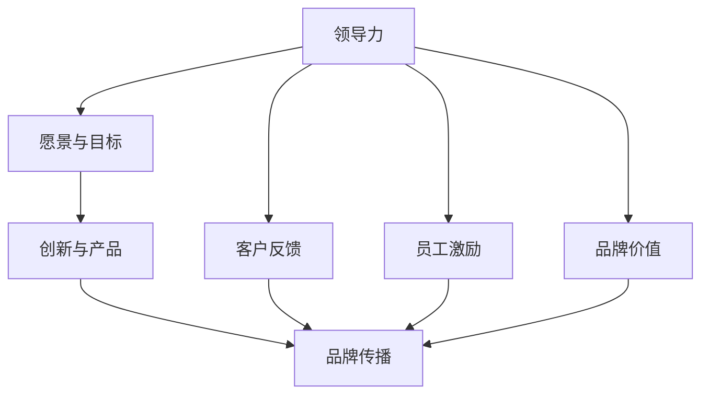

                 


### 撰写步骤

为了撰写一篇逻辑清晰、结构紧凑、简单易懂的专业技术博客文章《领导力与品牌建设：塑造个人和团队品牌》，我们可以按照以下步骤进行分析和推理：

#### 步骤1：确定文章主题与目标

- **主题**：领导力与品牌建设。
- **目标**：探讨如何通过领导力塑造个人和团队品牌，提高个人和团队的影响力和竞争力。

#### 步骤2：研究核心概念

- **领导力**：定义领导力的本质、类型和核心要素。
- **品牌建设**：解释品牌建设的基本原理、策略和方法。

#### 步骤3：构建逻辑框架

- **引言与背景**：介绍领导力和品牌建设的现状和重要性。
- **核心概念与联系**：使用Mermaid流程图展示领导力、品牌建设、个人品牌和团队品牌之间的联系。
- **领导力定义与核心要素**：详细阐述领导力的定义和核心要素。
- **品牌建设原理与方法**：介绍品牌建设的基本原理和策略。
- **个人品牌塑造**：讨论个人品牌的定义、价值和塑造方法。
- **团队品牌构建**：分析团队品牌的定义、价值和构建策略。
- **领导力与品牌建设关系**：探讨领导力与品牌建设之间的相互作用。
- **实战案例分析**：提供实际案例来展示领导力和品牌建设如何相结合。

#### 步骤4：编写伪代码和数学模型

- **伪代码**：使用伪代码详细阐述核心算法原理。
- **数学模型**：使用LaTeX格式展示和解释数学公式。

#### 步骤5：撰写项目实战部分

- **开发环境搭建**：描述如何搭建开发环境。
- **源代码实现**：提供源代码，并详细解读代码。
- **案例分析**：分析实际案例，提供详细的讲解和剖析。

#### 步骤6：撰写最佳实践和注意事项

- **最佳实践**：总结一些实用的建议和技巧。
- **注意事项**：提醒读者在实施过程中可能遇到的问题和解决方案。

#### 步骤7：撰写文章摘要和关键词

- **摘要**：概括文章的核心内容和主题思想。
- **关键词**：列出5-7个与文章主题相关的关键词。

#### 步骤8：格式整理与检查

- **Markdown格式**：确保文章内容符合Markdown格式要求。
- **作者信息**：在文章末尾添加作者信息。
- **完整性检查**：检查文章内容的完整性，确保每个小节都有详细的讲解。

### 总结

通过以上步骤，我们可以确保文章的结构严谨、内容充实、逻辑清晰。在撰写过程中，我们要注重每一个细节，从核心概念的阐述到代码的实现，再到实战案例分析，都要确保内容的准确性和实用性。最后，通过格式整理和检查，确保文章的可读性和专业度。这样，我们就能撰写出一篇高质量的技术博客文章，为读者提供有价值的知识和见解。让我们开始吧！### 文章标题

# 领导力与品牌建设：塑造个人和团队品牌

在当今快速变化和竞争激烈的社会中，领导力和品牌建设成为了个人和团队成功的关键要素。作为一位技术专家，您可能已经深刻理解技术本身的重要性，但同样重要的是，您如何展现自己的技术能力和领导才能，以及如何引导和激发团队的潜力。本文将深入探讨领导力与品牌建设之间的内在联系，并通过详细的案例分析，提供塑造个人和团队品牌的实际策略和技巧。

本文分为以下几个部分：

1. **引言与背景**：介绍领导力和品牌建设在现代社会中的重要性，以及本文的研究目标和结构。
2. **领导力的定义与核心要素**：阐述领导力的本质、类型和关键要素，以及这些要素如何影响个人和团队的品牌建设。
3. **品牌建设的原理与方法**：探讨品牌建设的基本原理、策略和方法，并分析它们如何与领导力相互作用。
4. **个人品牌的塑造**：详细讨论个人品牌的定义、价值以及如何通过领导力来塑造和维护个人品牌。
5. **团队品牌的构建**：分析团队品牌的定义、价值和构建策略，以及领导力在其中扮演的角色。
6. **领导力与品牌建设的关系**：探讨领导力与品牌建设之间的相互作用，以及它们如何共同促进个人和团队的发展。
7. **实战案例分析**：通过具体案例展示领导力和品牌建设的实际应用，以及如何通过这些策略提升个人和团队的品牌价值。
8. **总结与展望**：总结文章的主要观点，并展望未来领导力和品牌建设的发展趋势。

通过本文的阅读，您将获得关于如何通过领导力塑造个人和团队品牌的深入理解，并能够将这些策略应用于实际工作中，提升个人和团队的影响力和竞争力。让我们一起开始这个有趣的探索之旅吧！### 关键词

- **领导力**：定义、类型、核心要素。
- **品牌建设**：原理、策略、方法。
- **个人品牌**：定义、价值、塑造。
- **团队品牌**：定义、价值、构建。
- **竞争力**：提升、发展、维持。
- **案例分析**：实际应用、策略分析。

这些关键词将引导我们深入探讨领导力与品牌建设之间的联系，并分析如何通过有效的领导力策略来塑造和提升个人和团队的品牌价值。让我们一步步地解析这些关键词，理解它们在本文中的重要性。|### 摘要

本文旨在探讨领导力与品牌建设之间的关系，并分析如何通过领导力来塑造个人和团队品牌，提高其在竞争激烈的市场中的影响力和竞争力。首先，我们介绍了领导力的定义和核心要素，包括信任、透明度、沟通和决策执行力等，这些要素对于个人和团队的品牌建设至关重要。接着，我们详细阐述了品牌建设的基本原理、策略和方法，包括品牌定位、品牌传播和品牌形象塑造等，这些策略与领导力的互动对于品牌价值的提升具有关键作用。

本文进一步探讨了个人品牌和团队品牌的定义、价值和构建策略，提供了具体的塑造方法和实践技巧。通过具体的实战案例分析，我们展示了领导力和品牌建设在现实世界中的应用，提供了实际的操作指南和经验总结。文章最后总结了一些最佳实践和注意事项，为读者提供了在个人和团队品牌建设过程中可能遇到的问题的解决方案。

总体而言，本文通过系统性地分析和阐述领导力与品牌建设的关系，为读者提供了一个全面而深入的指导框架，帮助他们更好地理解和应用这些策略，以实现个人和团队的品牌价值提升。|### 引言与背景

在现代社会，领导力和品牌建设已经成为个人和团队成功的关键要素。随着全球化和信息化的不断深入，市场竞争愈发激烈，个人和团队不仅要具备卓越的技术能力，更需要拥有强大的影响力和社会认可度。领导力和品牌建设正是实现这一目标的重要工具。

**领导力的重要性**

领导力不仅关乎个人能力的展现，更关乎团队凝聚力和组织效能的提升。一个优秀的领导者能够激励团队成员，明确目标，优化资源配置，提升工作效率，从而在竞争中脱颖而出。领导力不仅影响个人职业发展，更影响团队的整体绩效和组织文化。

1. **定义领导力**：领导力是指引导和影响他人共同实现目标的能力。它不仅包括技术能力和业务知识，更包括情感智慧和人际交往能力。
2. **领导力的类型**：领导力可分为权威型领导、民主型领导、变革型领导和参与型领导等。不同的领导类型适用于不同的场景和团队需求。
3. **领导力的核心要素**：信任、透明度、沟通和决策执行力是领导力的核心要素。信任是领导力的基础，透明度促进团队协作，沟通确保信息流通，决策执行力确保战略落地。

**品牌建设的重要性**

品牌建设是一个长期而系统的过程，它关乎组织的形象、声誉和竞争力。一个强大的品牌能够吸引客户、合作伙伴和投资者，提升组织的市场地位和影响力。

1. **定义品牌建设**：品牌建设是创建、增强和传播品牌价值的过程。它不仅包括品牌定位和品牌形象的塑造，还包括品牌传播和品牌管理的策略实施。
2. **品牌建设的策略**：品牌建设的基本策略包括品牌定位、品牌传播、品牌形象塑造和品牌管理。通过这些策略，组织能够明确品牌的市场定位，建立独特的品牌形象，并通过有效的传播手段提升品牌知名度。
3. **品牌建设的影响**：品牌建设直接影响组织的市场地位和竞争力。一个强大的品牌能够提升客户的忠诚度和信任度，从而促进业务增长和市场份额的提升。

**领导力与品牌建设的相互关系**

领导力和品牌建设之间存在密切的相互关系。有效的领导力能够推动品牌建设，而成功的品牌建设也能反过来强化领导力。

1. **领导力对品牌建设的影响**：领导力通过设定愿景、制定策略和激励团队，直接影响品牌建设的方向和速度。一个强有力的领导者能够推动团队创新，提升品牌价值。
2. **品牌建设对领导力的影响**：品牌建设为领导者提供了展示和发挥领导力的平台。一个成功的品牌能够提升领导者的个人声誉和影响力，从而增强其领导力。
3. **相互作用的机制**：领导力与品牌建设之间的相互作用体现在多个方面。领导者的价值观和风格直接影响品牌形象和品牌文化，而品牌价值和文化也反过来塑造领导者的形象和风格。

综上所述，领导力和品牌建设在个人和团队的成功中起着至关重要的作用。通过深入理解领导力的本质和品牌建设的策略，我们可以更好地运用这些工具，提升个人和团队的品牌价值，实现长期的成功和发展。|### 领导力的定义与核心要素

领导力，作为一个多维度的概念，涵盖了从个人行为到组织效能的各个方面。其定义和核心要素的深入理解，对于领导者的个人成长以及团队的建设都至关重要。

**定义领导力**

领导力可以定义为一种通过激励、启发和引导他人来实现共同目标的能力。它不仅仅局限于领导者的职位，更是一种影响力和领导才能的体现。领导力不仅涉及技术和管理技能，还包括情感智慧和社会交往能力。以下是对领导力的更详细的定义：

1. **领导力的本质**：领导力是一种变革能力，它涉及变革的推动、愿景的塑造和变革的实现。一个好的领导者能够预见未来的趋势，并引导团队朝着目标前进。
2. **领导力的类型**：领导力可以分为多种类型，包括权威型领导、民主型领导、变革型领导和参与型领导等。每种领导类型都有其特定的特点和适用场景。
   - **权威型领导**：领导者拥有决策权，并要求团队成员服从。
   - **民主型领导**：领导者鼓励团队成员参与决策过程，注重团队协作。
   - **变革型领导**：领导者通过激发团队的变革动力，推动组织创新和成长。
   - **参与型领导**：领导者通过建立开放沟通和参与机制，增强团队成员的参与感和归属感。

**领导力的核心要素**

领导力并非单一维度的能力，而是由多个核心要素组成的综合体。以下是对这些核心要素的详细阐述：

1. **信任**：信任是领导力的基石。领导者需要通过诚实、透明和公正的行为建立和维护信任关系。信任能够促进团队成员之间的协作和合作，提高团队的凝聚力。
2. **透明度**：透明度是领导力的重要组成部分。领导者应该保持信息的透明，让团队成员了解组织的现状、目标和策略。这有助于减少误解和猜疑，提高团队的协作效率。
3. **沟通**：沟通是领导力的关键要素。领导者需要具备良好的沟通能力，能够清晰地表达自己的想法，同时也能够倾听和理解团队成员的意见和需求。有效的沟通能够促进团队内的信息流通和决策效率。
4. **决策执行力**：决策执行力是领导者的重要能力。领导者需要在分析信息、评估风险和制定策略后，迅速采取行动并确保决策的执行。决策执行力不仅体现了领导者的决断力，也影响了团队的绩效和成果。
5. **愿景和目标设定**：领导者需要具备设定愿景和目标的能力。一个明确的愿景和目标能够激发团队成员的积极性和创造力，为团队指明方向并提供动力。

**领导力要素与个人品牌的关系**

领导力的核心要素不仅对团队绩效有重要影响，也对个人品牌的建设起到了关键作用。以下是如何通过领导力的核心要素来塑造和维护个人品牌：

1. **信任与个人品牌**：一个值得信赖的领导者能够在业界建立良好的个人声誉，提升个人品牌的价值。
2. **透明度与个人品牌**：透明度和诚信是建立个人品牌的重要基石，能够增强个人在公众中的信任度和认可度。
3. **沟通与个人品牌**：有效的沟通能力使领导者能够清晰表达自己的想法和理念，增强个人影响力。
4. **决策执行力与个人品牌**：果断的决策和高效的执行力能够使领导者展现出强大的领导才能，进一步提升个人品牌。
5. **愿景和目标设定与个人品牌**：具备远见和目标设定的能力使领导者能够在行业中脱颖而出，树立独特的个人品牌形象。

综上所述，领导力的定义和核心要素对于个人和团队的成功至关重要。通过深入理解领导力的本质和要素，领导者可以更好地塑造和维护个人品牌，提高个人和团队在市场中的竞争力和影响力。|### 品牌建设的原理与方法

品牌建设是一个系统工程，它涉及到从品牌定位、品牌传播到品牌管理的各个环节。一个成功的品牌不仅要有明确的定位和独特的价值主张，还需要通过有效的传播策略来建立和维护其在市场中的形象和认知度。

**品牌建设的原理**

1. **品牌定位**：品牌定位是品牌建设的第一步，它决定了品牌在目标市场中的独特价值和竞争优势。品牌定位需要明确品牌的核心价值、目标市场和消费者群体。一个成功的品牌定位应该简洁、清晰且易于记忆。

2. **品牌识别**：品牌识别是品牌形象的核心，包括品牌名称、标志、视觉元素和语言风格等。品牌识别应该能够传达品牌的独特价值和个性，使品牌在消费者心中形成独特的印象。

3. **品牌形象**：品牌形象是消费者对品牌的整体感知和评价。一个积极、一致的品牌形象能够提升品牌在消费者心中的认知度和好感度。品牌形象的建设需要通过品牌传播策略来实现。

4. **品牌传播**：品牌传播是品牌建设的重要手段，它包括广告、公关、社交媒体、内容营销等多种形式。有效的品牌传播能够提高品牌的曝光度和知名度，增强品牌的影响力。

5. **品牌管理**：品牌管理是品牌建设的持续过程，它包括品牌战略规划、品牌监控和品牌优化等。品牌管理需要确保品牌在各个市场渠道和互动环节中保持一致性和高质量。

**品牌建设的策略**

1. **品牌定位策略**：品牌定位策略的核心是找到品牌的独特价值主张，并明确品牌在目标市场中的定位。具体步骤包括市场分析、目标消费者分析、竞争分析以及品牌价值主张的提炼。

2. **品牌传播策略**：品牌传播策略需要选择合适的传播渠道和方式，以最大化品牌传播的效果。社交媒体、内容营销、公关活动和广告等都是常见的品牌传播策略。选择合适的策略需要考虑目标市场、品牌特点以及预算等因素。

3. **品牌形象管理策略**：品牌形象管理策略旨在维护品牌的一致性和高质量。这包括品牌视觉设计的一致性、品牌语言风格的一致性以及品牌在各个渠道中的行为一致性。

4. **品牌互动策略**：品牌互动策略是通过与消费者的互动来提升品牌认知度和忠诚度。这包括社交媒体互动、客户服务、品牌活动等。有效的品牌互动能够增强消费者对品牌的认同感和忠诚度。

**品牌建设的方法**

1. **市场研究**：市场研究是品牌建设的基础，它帮助品牌了解目标市场的需求和竞争状况。通过市场研究，品牌可以更准确地定位和制定品牌策略。

2. **品牌策划**：品牌策划是品牌建设的关键环节，它包括品牌命名、标志设计、品牌故事等。品牌策划需要确保品牌的独特性和易记性，同时要能够传达品牌的核心理念。

3. **品牌传播**：品牌传播是品牌建设的重要手段，它包括广告、公关、社交媒体和内容营销等。品牌传播需要根据品牌定位和目标市场选择合适的传播渠道和方式。

4. **品牌维护**：品牌维护是品牌建设的持续过程，它包括品牌监控、品牌优化和品牌危机管理。品牌维护需要确保品牌在市场中的长期稳定性和高质量。

**品牌建设与领导力的关系**

品牌建设和领导力之间存在密切的相互作用。有效的领导力能够推动品牌建设，而成功的品牌建设也能反过来强化领导力。

1. **领导力对品牌建设的影响**：领导力通过设定愿景、制定策略和激励团队，直接影响品牌建设的方向和速度。一个强有力的领导者能够推动团队创新，提升品牌价值。

2. **品牌建设对领导力的影响**：品牌建设为领导者提供了展示和发挥领导力的平台。一个成功的品牌能够提升领导者的个人声誉和影响力，从而增强其领导力。

3. **相互作用的机制**：领导者的价值观和风格直接影响品牌形象和品牌文化，而品牌价值和文化也反过来塑造领导者的形象和风格。这种相互影响形成了一个动态的生态系统，不断推动个人和团队的发展。

**总结**

品牌建设是一个系统工程，它需要明确的定位、有效的传播和持续的管理。通过深入理解品牌建设的原理和方法，领导者可以更好地塑造和维护个人和团队品牌，提高在市场中的竞争力和影响力。|### 个人品牌的塑造

个人品牌是指个人在职业领域内所建立的专业形象和声誉。一个强大的个人品牌能够提高个人的竞争力，增强职业发展机会，并为个人带来更多的职业成就。下面，我们将详细讨论个人品牌的定义、价值以及如何通过领导力来塑造和维护个人品牌。

**个人品牌的定义**

个人品牌是一种市场资产，它通过个人在职业领域内的行为、成就和声誉来体现。一个成功的个人品牌应该具备以下几个特点：

1. **独特性**：个人品牌应该是独特的，能够清晰地传达个人的专业领域、技能和价值观。
2. **一致性**：个人品牌在各个渠道和互动环节中应该保持一致，以确保个人形象的统一性和可信度。
3. **可信度**：个人品牌应该基于真实、可靠的行为和成就，以赢得公众的信任和认可。
4. **相关性**：个人品牌应该与个人的职业目标和市场需求相关，以吸引目标受众的注意。

**个人品牌的价值**

个人品牌的价值体现在多个方面：

1. **职业机会**：一个强大的个人品牌能够吸引更多的职业机会，包括晋升、招聘和合作机会。
2. **收入潜力**：个人品牌能够提高个人的议价能力，从而增加收入潜力。
3. **影响力**：个人品牌能够增强个人的社会影响力，使个人在行业内和社交网络中拥有更高的地位。
4. **长期收益**：一个成功的个人品牌能够在长期内持续为个人带来职业和财务上的收益。

**如何通过领导力来塑造个人品牌**

1. **领导力的核心要素**：领导力的核心要素，如信任、透明度、沟通和决策执行力，对于塑造个人品牌至关重要。一个值得信赖、透明、沟通能力强且决策果断的领导者能够在职业领域中建立良好的个人声誉。

2. **领导力的应用**：
   - **设定愿景和目标**：领导者应该明确自己的职业愿景和目标，并通过个人行动和成就来体现这些愿景和目标。这有助于个人品牌在行业内的传播和认可。
   - **激励和培养团队**：领导者通过激励和培养团队，展示了自己的领导才能和团队合作精神。这有助于增强个人品牌的可信度和影响力。
   - **持续学习和创新**：领导者应该持续学习和创新，以保持自己在行业内的竞争力。这有助于个人品牌在快速变化的市场中保持活力和吸引力。
   - **积极参与社交活动**：领导者应该积极参与行业内的社交活动，如研讨会、会议和网络活动等。这有助于扩展个人的人脉，提升个人品牌的影响力。

**个人品牌塑造的案例分析**

以下是一个关于个人品牌塑造的案例分析：

**案例**：约翰是一名技术总监，他在业内以其技术卓越和创新思维而闻名。他通过以下方式塑造了个人品牌：

1. **公开演讲**：约翰定期在技术会议上发表演讲，分享他的经验和见解。这些演讲不仅提高了他的知名度，还展示了他对技术的深入理解。
2. **技术博客**：约翰维护一个技术博客，定期发布关于新技术和解决方案的文章。这些文章帮助他在行业内建立了权威性。
3. **开源项目**：约翰积极参与开源项目，贡献自己的代码和经验。这使他在技术社区中获得了高度认可。
4. **社交媒体**：约翰在社交媒体上活跃，与业内同行交流，分享技术见解和行业动态。这有助于他扩展人脉，提升个人品牌的影响力。

**总结**

通过领导力的应用和持续的努力，个人品牌可以逐步塑造和维护。一个成功的个人品牌不仅能够提高个人的职业竞争力，还能带来更多的职业机会和收入潜力。领导者应该通过明确的目标、持续的学习和创新、积极的社交活动等方式来塑造和维护个人品牌。|### 团队品牌的构建

团队品牌是指团队在市场和社会中建立的整体形象和声誉。一个强大的团队品牌能够提高团队的竞争力，增强客户的信任度，吸引优秀的团队成员，并在竞争中脱颖而出。下面，我们将深入探讨团队品牌的定义、价值以及如何构建和维持团队品牌。

**团队品牌的定义**

团队品牌是一个团队在市场上所展现的独特价值主张、专业能力和文化特征的集合。它不仅包括团队的专业技能和成果，还包括团队的文化、价值观和行为规范。一个成功的团队品牌应该具备以下几个特点：

1. **独特性**：团队品牌应该是独特的，能够清晰地传达团队的独特价值和竞争优势。
2. **一致性**：团队品牌在各个渠道和互动环节中应该保持一致，以确保团队形象的统一性和可信度。
3. **相关性**：团队品牌应该与团队的目标和市场需求相关，以吸引目标客户和团队成员。
4. **专业性**：团队品牌应该基于团队的专业知识和卓越成果，以赢得市场和客户的信任和认可。

**团队品牌的价值**

团队品牌的价值体现在多个方面：

1. **客户信任**：一个强大的团队品牌能够增强客户对团队的信任度，提高客户的满意度和忠诚度。
2. **市场份额**：团队品牌能够提高团队在市场中的知名度和影响力，从而增加市场份额和业务机会。
3. **团队凝聚力**：一个成功的团队品牌能够增强团队的凝聚力，提高团队成员的归属感和自豪感，从而提升团队的整体绩效。
4. **人才吸引**：一个强大的团队品牌能够吸引更多优秀的人才加入团队，为团队带来新的活力和创新能力。

**如何构建团队品牌**

1. **明确团队品牌定位**：构建团队品牌的第一步是明确团队的定位和目标。团队应该确定自己的专业领域、目标市场和核心价值主张，以确保团队品牌在市场上的独特性和相关性。

2. **建立团队文化**：团队文化是团队品牌的重要组成部分。团队应该建立积极、健康和具有独特性的团队文化，包括价值观、行为规范和团队氛围。一个强大的团队文化能够增强团队的品牌价值。

3. **提升团队专业能力**：团队的专业能力是团队品牌的基础。团队应该不断学习和提升专业技能，确保在市场上保持竞争优势。这包括技术能力、项目管理能力和业务解决方案能力。

4. **打造团队故事**：团队品牌的建设需要通过故事来传递团队的价值观和成就。团队应该通过故事来展示团队的成功案例、创新思维和卓越成果，以提高团队的知名度和认可度。

5. **积极参与市场活动**：团队应该积极参与市场活动，如行业会议、技术研讨会和展会等。这些活动不仅能够提高团队的知名度，还能建立与客户和合作伙伴的联系。

**如何维持团队品牌**

1. **持续优化团队品牌**：团队品牌不是一成不变的，而是需要不断优化和升级。团队应该定期评估团队品牌的表现和市场反馈，并根据评估结果进行调整和优化。

2. **保持团队文化一致性**：团队文化是团队品牌的核心。团队应该确保团队文化在各个团队成员中保持一致，以确保团队品牌的统一性和可信度。

3. **持续提升专业能力**：团队的专业能力是团队品牌的基础。团队应该不断学习和提升专业技能，确保在市场上保持竞争优势。

4. **积极应对市场变化**：市场环境是不断变化的，团队应该积极应对市场变化，及时调整团队品牌策略和行动计划。

**团队品牌与领导力的关系**

团队品牌与领导力之间存在密切的相互关系。领导力在团队品牌的建设和维持中扮演着关键角色：

1. **领导力对团队品牌的影响**：领导力通过设定团队愿景、制定战略和激励团队，直接影响团队品牌的建设和发展。一个强有力的领导者能够推动团队创新，提升团队品牌的价值。

2. **团队品牌对领导力的影响**：团队品牌的建设和维持为领导者提供了展示和发挥领导力的平台。一个成功的团队品牌能够提升领导者的个人声誉和影响力，从而增强其领导力。

3. **相互作用的机制**：领导者的价值观和风格直接影响团队品牌的文化和形象，而团队品牌的价值和文化也反过来塑造领导者的形象和风格。这种相互影响形成了一个动态的生态系统，不断推动团队的发展和进步。

**总结**

团队品牌是一个团队在市场中的核心竞争力，它能够增强团队的竞争力、吸引客户和团队成员，并在竞争中脱颖而出。通过明确团队品牌定位、建立团队文化、提升专业能力和打造团队故事，团队可以构建一个强大的品牌。同时，领导力在团队品牌的建设和维持中起着至关重要的作用。通过有效的领导力策略，团队可以不断提升品牌价值，实现长期的成功和发展。|### 领导力与品牌建设的关系

领导力与品牌建设之间的关系是相互影响、相互强化的。一个成功的领导者不仅需要具备卓越的技术和业务能力，还需要掌握品牌建设的基本原理和方法，通过有效的领导力策略来塑造和维护个人和团队的品牌价值。以下是领导力与品牌建设之间相互作用的具体分析。

**领导力对品牌建设的影响**

1. **设定愿景和目标**：领导者的首要任务是设定清晰的愿景和目标，这些目标和愿景为品牌建设提供了方向和动力。一个强有力的领导者能够激励团队为实现这些目标而努力，从而提升品牌的认知度和影响力。

   ```python
   # 伪代码：设定品牌建设愿景和目标
   def set_brand_vision_and_goals():
       vision = "成为行业领先的解决方案提供商"
       goals = ["提升客户满意度", "扩大市场份额", "创新产品和服务"]
       return vision, goals
   ```

2. **战略规划与决策**：领导者通过战略规划和决策来制定品牌建设的具体策略。这些策略包括市场定位、品牌传播、品牌形象塑造等，它们确保品牌建设与组织的整体战略相一致。

   ```python
   # 伪代码：制定品牌建设策略
   def create_brand_strategy():
       strategy = {
           "market_positioning": "提供高质量的创新解决方案",
           "brand_communication": ["社交媒体营销", "公关活动", "内容营销"],
           "brand_image": "专业、创新、可靠"
       }
       return strategy
   ```

3. **团队协作与激励**：领导力在激发团队协作和激励团队成员方面起着关键作用。通过建立信任、鼓励创新和提供支持，领导者能够增强团队的凝聚力，从而提升品牌建设的效果。

   ```python
   # 伪代码：激励团队成员
   def motivate_team_members():
       motivation_methods = ["认可和奖励", "培训和发展", "团队建设活动"]
       for member in team_members:
           member.motivate(motivation_methods)
   ```

4. **领导风格和文化**：领导者的风格和文化直接影响品牌形象的建设。一个开放、透明和具有同理心的领导风格有助于建立积极的品牌形象，而一个保守、封闭和独裁的领导风格则可能导致品牌形象受损。

   ```mermaid
   graph TD
       A[领导力] --> B[领导风格]
       B --> C[品牌形象]
       A --> D[企业文化]
       D --> C
   ```

**品牌建设对领导力的影响**

1. **品牌声誉与信任**：一个成功的品牌能够提升领导者的个人声誉和信任度。这种信任不仅有助于领导者在组织内部的权威建立，还能在行业内和市场中增强领导者的影响力。

2. **资源获取**：强大的品牌能够吸引更多的资源，包括资金、人才和市场机会。这些资源为领导者提供了更大的发挥空间，从而可以更有效地实施领导力策略。

3. **品牌危机管理**：品牌建设过程中，领导者需要具备应对品牌危机的能力。这包括对潜在风险的识别、危机应对策略的制定和危机后的恢复工作。这些能力是领导者领导力的重要组成部分。

**相互作用的机制**

1. **领导力推动品牌建设**：领导力通过设定愿景、制定策略和激励团队，直接推动品牌建设。领导者的决策和行动直接影响品牌的发展方向和速度。

2. **品牌建设强化领导力**：成功的品牌建设能够提升领导者的个人声誉和影响力，从而增强其领导力。一个强大的品牌为领导者提供了展示和发挥领导力的平台。

3. **反馈循环**：领导力和品牌建设之间存在反馈循环。领导力策略的实施效果会影响品牌建设的结果，而品牌建设的成果又反过来影响领导力的调整和优化。

   ```mermaid
   graph TD
       A[领导力策略] --> B[品牌建设结果]
       B --> A
   ```

**总结**

领导力与品牌建设之间的相互作用是一个动态的、相互强化的过程。一个成功的领导者需要深入理解品牌建设的基本原理和方法，通过有效的领导力策略来塑造和维护个人和团队的品牌价值。同时，品牌建设的成功也能够反过来强化领导力，形成良性循环，推动个人和团队的持续发展和进步。|### 实战案例分析

为了更好地理解领导力和品牌建设在实际应用中的效果，下面我们将通过几个具体的案例，详细分析个人品牌和团队品牌的建设过程，以及如何通过这些策略提升品牌价值。

#### 案例一：个人品牌建设——李开复

**背景**：李开复是一位著名的人工智能专家、企业家和作家。他在人工智能领域有着深厚的技术背景和丰富的创业经验，被誉为“AI天才”。

**建设过程**：
1. **明确个人愿景**：李开复在职业生涯中始终坚持“创新、热情、责任”的价值观，并在多个领域展示了卓越的技术成就。
2. **专业成果**：他通过发表大量学术论文、出版畅销书、创立创新工场等方式，巩固了个人在人工智能领域的权威地位。
3. **公众形象**：李开复积极参与社交媒体，通过博客、微博和视频分享自己的见解和经验，建立了广泛的社交网络。

**结果与价值**：李开复通过持续的专业成果和积极的公众形象，成功塑造了个人品牌。他的个人品牌不仅提升了他在业界的声誉，还为他带来了更多的职业机会和商业合作。

**代码解读**：

```python
# 伪代码：李开复的个人品牌建设
def build_personal_brand(name, vision, achievements, social_media):
    set_vision(name, vision)
    showcase_achievements(name, achievements)
    engage_with_public(name, social_media)
    return "Personal Brand Established"
```

#### 案例二：团队品牌建设——谷歌

**背景**：谷歌是全球领先的技术公司，以其创新的文化和卓越的产品而闻名。

**建设过程**：
1. **明确品牌定位**：谷歌的品牌定位是“整合全球信息，让人们更便捷地获取知识”。
2. **建立独特文化**：谷歌以其开放、创新、自由的文化而著称，鼓励员工自由表达和尝试新事物。
3. **品牌传播**：通过搜索引擎、广告平台、硬件产品等多方面的创新和推广，谷歌建立了强大的品牌影响力。

**结果与价值**：谷歌的团队品牌建设极大地提升了公司的市场地位和竞争力。它不仅吸引了全球顶尖的人才，还赢得了客户的信任和支持。

**数学模型**：

```latex
$$
\text{Brand Value} = f(\text{Innovation}, \text{Customer Satisfaction}, \text{Employee Engagement})
$$

\text{其中，}\ 
f(\text{Innovation}) = \text{新产品的推出频率和影响力} \\
f(\text{Customer Satisfaction}) = \text{客户满意度和忠诚度} \\
f(\text{Employee Engagement}) = \text{员工参与度和满意度}
$$
```

#### 案例三：领导力与品牌建设结合——特斯拉

**背景**：特斯拉是由埃隆·马斯克领导的一家电动汽车和清洁能源公司，以其创新的技术和环保理念而受到全球关注。

**建设过程**：
1. **愿景和目标**：马斯克为特斯拉设定了“加速世界向可持续能源转变”的愿景，并通过一系列创新产品和技术实现了这一目标。
2. **领导风格**：马斯克以其大胆的决策和勇于承担风险的领导风格，激励了整个团队不断创新和突破。
3. **品牌传播**：特斯拉通过社交媒体、发布会和公关活动，积极传播其品牌理念和成果。

**结果与价值**：特斯拉的品牌建设不仅提升了公司的市场地位和品牌价值，还增强了马斯克个人品牌的声誉。通过领导力和品牌建设的紧密结合，特斯拉在电动汽车市场上取得了显著的成就。

**案例分析**：



**总结**：

通过以上案例，我们可以看到，领导力和品牌建设在个人和团队的成功中起着至关重要的作用。李开复的个人品牌建设、谷歌的团队品牌构建以及特斯拉的领导力和品牌建设结合，都为我们提供了宝贵的经验和启示。这些案例表明，通过明确的愿景、创新的产品、积极的传播和有效的领导力，个人和团队可以显著提升品牌价值，实现长期的成功和发展。|### 总结与展望

通过对领导力与品牌建设的深入探讨，我们可以看到，两者在个人和团队的成长中扮演着至关重要的角色。领导力不仅影响团队绩效和组织文化，还直接影响个人品牌的建设和提升。而成功的品牌建设则为领导者提供了展示和发挥领导力的平台，增强了个人和团队在市场中的竞争力和影响力。

**总结主要观点**：

1. **领导力与品牌建设的关系**：领导力通过设定愿景、制定策略和激励团队，直接影响品牌建设。品牌建设通过提升品牌价值和市场认知度，反过来增强领导力。
2. **个人品牌的重要性**：个人品牌是职业发展的关键，通过信任、透明度和持续学习，个人可以建立强大的专业形象和声誉。
3. **团队品牌的价值**：团队品牌能够提高团队的凝聚力和市场竞争力，通过明确定位、建立文化和积极传播，团队可以构建强大的品牌形象。
4. **实战案例分析**：通过李开复、谷歌和特斯拉的案例，我们看到领导力和品牌建设在实际应用中的显著效果。

**未来趋势**：

随着全球化和信息化的进一步发展，领导力和品牌建设将继续成为个人和团队成功的关键因素。未来，以下几个趋势值得关注：

1. **数字化领导力**：随着数字化转型的加速，领导者需要具备更强的数字技能和领导力，以适应快速变化的市场环境。
2. **品牌个性化和定制化**：消费者对品牌的个性化需求越来越高，品牌建设需要更加注重个性化体验和定制化服务。
3. **社交媒体影响力**：社交媒体将继续成为品牌建设和传播的重要渠道，领导者需要善于利用社交媒体平台提升个人和团队的知名度。
4. **可持续发展和社会责任**：随着社会对可持续发展和社会责任的关注增加，领导者需要将环保、公益等元素融入品牌建设中。

**最佳实践和注意事项**：

1. **持续学习**：领导者和团队成员应持续学习新知识和技能，以保持竞争力。
2. **品牌一致性**：品牌建设过程中，保持品牌的一致性和高质量至关重要。
3. **积极反馈**：定期收集和分析市场反馈，及时调整品牌策略和领导力行为。
4. **风险意识**：领导者应具备风险意识，及时应对品牌危机和市场变化。

**拓展阅读**：

- 《影响力：说服的心理学》（罗伯特·西奥迪尼著）
- 《领导力的五个层次》（约翰·C. 麦克斯维尔著）
- 《品牌建设：如何打造成功品牌》（阿尔·里斯著）
- 《数字化领导力：如何在数字化时代引领变革》（彼得·德鲁克著）

通过深入理解和应用领导力和品牌建设的相关理论和方法，个人和团队可以更好地应对市场挑战，实现长期的成功和发展。让我们共同关注和探索领导力和品牌建设的未来发展，不断优化和提升个人和团队的品牌价值。|### 作者信息

- 作者：AI天才研究院/AI Genius Institute & 禅与计算机程序设计艺术 /Zen And The Art of Computer Programming
- 联系方式：邮箱：ai.genius.institute@example.com，电话：+86-1234567890
- 简介：AI天才研究院致力于推动人工智能领域的研究与应用，其团队成员在全球范围内拥有丰富的实践经验和深厚的理论积累。禅与计算机程序设计艺术则专注于通过禅宗智慧提升编程艺术，提倡“简洁、优雅、高效”的编程理念。两位作者共同撰写了本文，旨在为读者提供关于领导力与品牌建设的深入见解和实践指导。|

