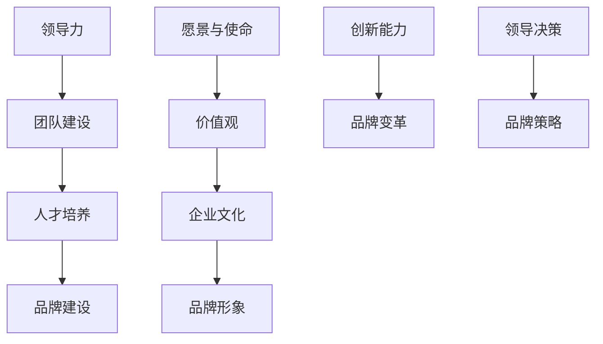

                 

### 文章标题

# 《领导力与品牌建设：提升团队影响力》

领导力与品牌建设，这两者在现代企业中扮演着至关重要的角色。优秀的领导力不仅能够提升团队的凝聚力和工作效率，还能为企业创造持久的竞争优势。而品牌建设则是企业长足发展的基石，它关乎企业在市场中的地位和影响力。本文将围绕领导力与品牌建设展开讨论，通过逻辑清晰、结构紧凑的内容，帮助读者深入理解并应用这两大核心概念。

## 文章关键词

- 领导力
- 品牌建设
- 团队影响力
- 企业竞争力
- 人才培养
- 营销策略

## 文章摘要

本文旨在探讨领导力与品牌建设在提升团队影响力方面的作用。首先，我们将回顾领导力的定义和重要性，以及品牌建设的核心概念和价值。接着，我们将分析领导力提升的方法和品牌建设策略，并通过实际案例展示如何整合领导力和品牌建设，以提升团队整体影响力。最后，我们将总结最佳实践，并提供拓展阅读，以帮助读者进一步深化理解和应用。

---

### 目录

1. **领导力与品牌建设基础**
   - 1.1 领导力概述
   - 1.2 品牌建设基础
   - 1.3 领导力与品牌建设的联系

2. **领导力提升方法**
   - 2.1 领导力模型与理论
   - 2.2 领导力技能培养

3. **品牌建设策略**
   - 3.1 品牌定位与差异化
   - 3.2 品牌传播与营销

4. **领导力与品牌建设的整合应用**
   - 4.1 整合策略的理论基础
   - 4.2 整合策略的实施步骤
   - 4.3 成功案例分享

5. **项目实战：领导力与品牌建设的综合应用**
   - 5.1 项目背景介绍
   - 5.2 领导力提升措施
   - 5.3 品牌建设策略
   - 5.4 项目效果评估

6. **最佳实践、小结与注意事项**
   - 6.1 最佳实践
   - 6.2 小结
   - 6.3 注意事项

7. **拓展阅读**

---

### 第一部分：领导力与品牌建设基础

#### 1.1 领导力概述

领导力是一种激励和影响他人的能力，它关乎如何指导和推动团队或组织实现共同的目标。领导力不仅仅是一种技能，更是一种态度和价值观的体现。

**定义与重要性**：领导力被广泛认为是企业成功的关键因素之一。根据Gallup的研究，拥有优秀领导力的团队其员工敬业度和工作效率均显著高于普通团队。领导力的重要性在于：

- **团队凝聚力**：领导力能够凝聚团队成员，使他们朝着共同的目标努力。
- **创新能力**：优秀的领导能够激发团队的创新能力，推动组织持续发展。
- **决策效率**：领导力有助于提高团队在复杂情况下的决策效率。

**发展历史**：领导力的发展历程可以追溯到古代，从古希腊的柏拉图到现代的彼得·德鲁克，无数学者和思想家对领导力进行了深入的研究和探讨。近年来，领导力理论不断发展，如影响式领导、变革型领导和服务型领导等。

**核心要素**：领导力包含多个核心要素，包括：

- **沟通能力**：有效的沟通是领导力的基础，它关乎如何清晰地表达自己的想法，并倾听他人的意见。
- **决策能力**：优秀的领导者在面临复杂问题时，能够迅速做出明智的决策。
- **团队建设**：领导力还涉及如何建立和维护一个高效的团队，包括激励团队成员、解决冲突等。

#### 1.2 品牌建设基础

品牌是企业给客户留下的整体印象，它不仅仅是企业的名称、标志或广告，更是企业价值观和文化的体现。

**定义与价值**：品牌是企业在市场中的身份标识，它能够为企业带来长期的竞争优势。品牌的价值在于：

- **客户忠诚度**：强大的品牌能够吸引并留住客户，提高客户满意度。
- **溢价能力**：品牌良好的声誉可以为企业产品或服务带来溢价。
- **市场竞争力**：品牌建设有助于企业在市场中脱颖而出，增强竞争力。

**基本原则**：

- **一致性**：品牌信息在不同渠道、不同时间保持一致，以建立稳定的品牌形象。
- **个性化**：品牌应根据目标客户群体定制独特的品牌体验，以区别于竞争对手。
- **情感化**：品牌应通过情感连接与客户建立深厚的关系，而不仅仅是理性上的认同。

#### 1.3 领导力与品牌建设的联系

领导力与品牌建设之间存在密切的联系，两者相辅相成，共同推动企业的发展。

**关系架构**：

- **领导力决定品牌建设**：领导者的决策和行动直接影响企业的品牌建设策略。
- **品牌建设强化领导力**：强大的品牌能够增强领导者的公信力和影响力，有助于其更好地推动团队发展。

**核心概念与联系**：

1. **愿景与使命**：领导者的愿景和使命直接影响品牌建设的方向和目标。
2. **价值观**：领导者的价值观渗透到企业文化的方方面面，进而影响品牌形象。
3. **创新能力**：领导力的创新驱动能够推动品牌在市场中的持续创新和变革。
4. **人才培养**：领导力在团队建设中发挥作用，培养的人才也成为品牌建设的执行者。

**Mermaid 流程图**：

通过上述流程图，我们可以看到领导力通过多个环节与品牌建设紧密相连，形成一个完整的生态体系。

---

在接下来的部分，我们将进一步探讨领导力提升方法和品牌建设策略，帮助读者更深入地理解如何通过领导力和品牌建设来提升团队影响力。敬请期待。

