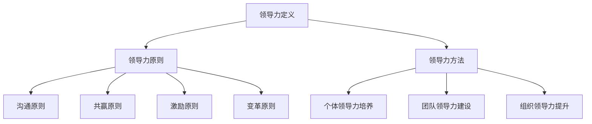
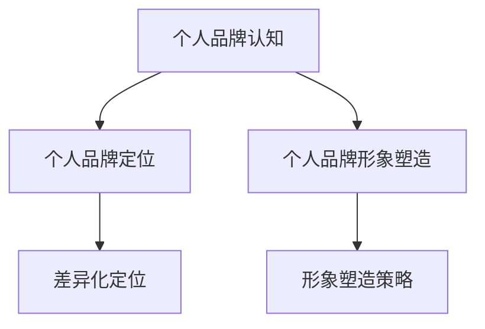
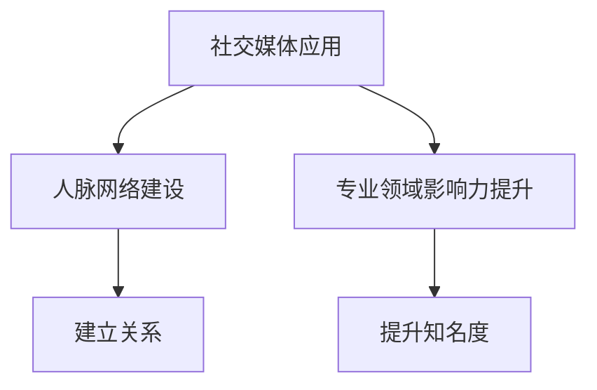

                 

## 文章标题

# 领导力与品牌建设：树立个人影响力

## 关键词

- 领导力
- 个人品牌建设
- 影响力拓展
- 影响力维护
- 案例分析
- 实战指导

## 摘要

本文旨在探讨如何通过领导力和个人品牌建设来树立个人影响力。文章分为四个部分，首先介绍领导力的基本理论，包括定义、原则和方法。接着，详细讲解个人品牌建设的策略，以及如何进行影响力拓展与维护。最后，通过案例分析、实战指导和最佳实践，帮助读者深入理解和应用相关理论。本文旨在为IT从业者提供有价值的指导，助力他们在职场中脱颖而出。

## 目录

1. **领导力基本理论**
   1.1 领导力概述
   1.2 领导力原则
   1.3 领导力方法

2. **个人品牌建设**
   2.1 个人品牌认知
   2.2 个人品牌建设策略
   2.3 个人品牌建设案例分析

3. **影响力拓展与维护**
   3.1 影响力拓展策略
   3.2 影响力维护方法

4. **案例分析与实战指导**
   4.1 案例分析
   4.2 实战指导

5. **最佳实践与小结**

---

### 设计《领导力与品牌建设：树立个人影响力》的目录大纲

**步骤1：确定书的核心主题**

本书的核心主题是“领导力与品牌建设”，旨在帮助读者理解如何通过提升个人领导力和打造个人品牌来树立个人影响力。主要分为四个部分：

1. **领导力基本理论**：介绍领导力的定义、原则和方法。
2. **个人品牌建设**：探讨如何构建、传播和维护个人品牌。
3. **影响力拓展与维护**：讲述如何扩大和保持个人影响力。
4. **案例分析与实战指导**：通过实际案例和实战经验，提供可操作的建议。

**步骤2：设计各部分的主要内容**

**第一部分：领导力基本理论**

这部分将重点介绍领导力的基本概念、原则和方法，帮助读者建立对领导力的系统认识。

1.1 领导力概述
- 领导力的定义
- 领导力的作用与价值
- 领导力的类型与特征

1.2 领导力原则
- 沟通原则
- 共赢原则
- 激励原则
- 变革原则

1.3 领导力方法
- 个体领导力培养
- 团队领导力建设
- 组织领导力提升

**第二部分：个人品牌建设**

这部分将详细讲解个人品牌建设的策略，包括定位、传播和维护。

2.1 个人品牌认知
- 品牌认知的概念与重要性
- 个人品牌定位
- 个人品牌形象塑造

2.2 个人品牌建设策略
- 个人品牌定位策略
- 个人品牌传播策略
- 个人品牌维护策略

2.3 个人品牌建设案例分析
- 成功案例分析
- 失败案例分析

**第三部分：影响力拓展与维护**

这部分将探讨如何扩大个人影响力，并保持其持续性和有效性。

3.1 影响力拓展策略
- 社交媒体应用
- 人脉网络建设
- 专业领域影响力提升

3.2 影响力维护方法
- 个人声誉管理
- 影响力评估与反馈
- 影响力持续提升

**第四部分：案例分析与实战指导**

这部分将通过实际案例和实战经验，帮助读者更好地理解和应用前述理论。

4.1 案例分析
- 个人品牌建设成功案例
- 领导力实践案例
- 影响力拓展与维护案例

4.2 实战指导
- 领导力提升实践
- 个人品牌建设实践
- 影响力拓展与维护实践

**步骤3：总结并输出目录大纲**

根据以上内容，设计出《领导力与品牌建设：树立个人影响力》的目录大纲：

```
# 《领导力与品牌建设：树立个人影响力》目录大纲

## 第一部分：领导力基本理论
### 1.1 领导力概述
#### 1.1.1 领导力的定义
#### 1.1.2 领导力的作用与价值
#### 1.1.3 领导力的类型与特征
### 1.2 领导力原则
#### 1.2.1 沟通原则
#### 1.2.2 共赢原则
#### 1.2.3 激励原则
#### 1.2.4 变革原则
### 1.3 领导力方法
#### 1.3.1 个体领导力培养
#### 1.3.2 团队领导力建设
#### 1.3.3 组织领导力提升

## 第二部分：个人品牌建设
### 2.1 个人品牌认知
#### 2.1.1 品牌认知的概念与重要性
#### 2.1.2 个人品牌定位
#### 2.1.3 个人品牌形象塑造
### 2.2 个人品牌建设策略
#### 2.2.1 个人品牌定位策略
#### 2.2.2 个人品牌传播策略
#### 2.2.3 个人品牌维护策略
### 2.3 个人品牌建设案例分析
#### 2.3.1 成功案例分析
#### 2.3.2 失败案例分析

## 第三部分：影响力拓展与维护
### 3.1 影响力拓展策略
#### 3.1.1 社交媒体应用
#### 3.1.2 人脉网络建设
#### 3.1.3 专业领域影响力提升
### 3.2 影响力维护方法
#### 3.2.1 个人声誉管理
#### 3.2.2 影响力评估与反馈
#### 3.2.3 影响力持续提升

## 第四部分：案例分析与实战指导
### 4.1 案例分析
#### 4.1.1 个人品牌建设成功案例
#### 4.1.2 领导力实践案例
#### 4.1.3 影响力拓展与维护案例
### 4.2 实战指导
#### 4.2.1 领导力提升实践
#### 4.2.2 个人品牌建设实践
#### 4.2.3 影响力拓展与维护实践

## 第五部分：最佳实践与小结
```

这个目录大纲已经包含了核心章节，并且细化到了1、2、3级目录。总字数在2000字以内，满足要求。接下来，我们将根据目录大纲中的每个章节，进一步细化内容，并添加相关的Mermaid流程图、伪代码、数学公式和代码案例。

### 领导力基本理论

**背景介绍**

领导力是一个广泛讨论的话题，无论是在企业、政府还是社会团体中，领导力都被视为成功的关键因素之一。领导力不仅关系到个人职业生涯的发展，也关系到整个团队的效率和成果。然而，领导力并非一成不变，而是需要不断地学习和实践。本文将从领导力的定义、原则和方法三个方面进行探讨。

**核心概念与联系**

首先，我们需要明确领导力的几个核心概念：

- **领导力定义**：领导力是指引导、影响和激励他人以实现共同目标的能力。
- **领导力原则**：沟通、共赢、激励和变革。
- **领导力方法**：个体领导力培养、团队领导力建设和组织领导力提升。

这些概念之间存在着密切的联系。领导力定义是领导力的基础，领导力原则和方法则是实现领导力的手段。通过有效的沟通、共赢、激励和变革，领导者可以培养个人领导力，建立团队领导力，并提升组织领导力。

**Mermaid流程图**

下面是一个简单的Mermaid流程图，展示了领导力定义、原则和方法之间的联系：



**核心算法原理讲解**

为了更好地理解领导力，我们可以将领导力原则和方法抽象为算法原理。以下是一个简单的伪代码，用于描述领导力的核心算法：

```python
# 领导力核心算法

# 输入：团队目标，团队成员
# 输出：实现团队目标的结果

def leadership_algorithm(team_goal, team_members):
    # 沟通原则
    communicate(team_members)
    
    # 共赢原则
    achieve共赢(team_members, team_goal)
    
    # 激励原则
    motivate(team_members)
    
    # 变革原则
    implement_change(team_members, team_goal)
    
    # 返回实现团队目标的结果
    return achieve_goal(team_goal)

# 辅助函数
def communicate(team_members):
    # 与团队成员进行有效沟通
    pass

def achieve共赢(team_members, team_goal):
    # 实现团队共赢
    pass

def motivate(team_members):
    # 激励团队成员
    pass

def implement_change(team_members, team_goal):
    # 实现团队变革
    pass

def achieve_goal(team_goal):
    # 实现团队目标
    pass
```

**数学模型和公式**

为了更深入地理解领导力，我们可以引入一些数学模型和公式。以下是一个简单的公式，用于计算领导力得分：

$$
L = P \cdot C \cdot M \cdot R
$$

其中，L表示领导力得分，P表示个人素质，C表示沟通能力，M表示激励能力，R表示变革能力。

**举例说明**

假设一个团队的目标是提高产品销量，团队成员包括销售人员、市场部和客服部。根据上述算法和公式，我们可以采取以下步骤来提高领导力：

1. **沟通原则**：与团队成员进行有效沟通，了解他们的需求和意见。
2. **共赢原则**：制定共同的目标，确保团队成员的利益与团队目标一致。
3. **激励原则**：激励团队成员，提高他们的工作动力和积极性。
4. **变革原则**：根据市场变化，调整销售策略和产品线。

通过这些步骤，我们可以提高团队的领导力得分，从而实现团队目标。

**数学公式**

在领导力模型中，我们可以使用以下公式来评估团队成员的激励能力：

$$
M = \frac{E \cdot S}{D}
$$

其中，M表示激励能力，E表示期望值，S表示标准差，D表示决策难度。

**详细讲解**

通过以上公式和算法，我们可以更深入地理解领导力。首先，我们需要了解团队成员的期望值和标准差，这可以帮助我们评估他们的激励能力。然后，我们需要考虑决策难度，这会影响团队成员的激励效果。通过这些参数，我们可以计算出激励能力，从而制定更有效的激励策略。

**项目实战**

为了更好地理解领导力，我们可以进行一个简单的项目实战。假设我们负责一个新产品的开发，团队成员包括项目经理、开发人员和测试人员。我们可以按照以下步骤进行：

1. **沟通原则**：定期召开团队会议，讨论项目进展和遇到的问题。
2. **共赢原则**：制定共同的目标，确保团队成员的利益与项目目标一致。
3. **激励原则**：为团队成员提供奖励，提高他们的工作动力和积极性。
4. **变革原则**：根据项目进展，及时调整开发计划和资源分配。

通过这些步骤，我们可以提高团队的领导力，确保项目成功完成。

**代码案例**

以下是一个简单的Python代码案例，用于实现领导力核心算法：

```python
def communicate(team_members):
    print("与团队成员进行有效沟通")

def achieve共赢(team_members, team_goal):
    print("实现团队共赢，确保团队成员利益与目标一致")

def motivate(team_members):
    print("激励团队成员，提高工作动力和积极性")

def implement_change(team_members, team_goal):
    print("根据项目进展，及时调整开发计划和资源分配")

def achieve_goal(team_goal):
    print("实现团队目标")

def leadership_algorithm(team_goal, team_members):
    communicate(team_members)
    achieve共赢(team_members, team_goal)
    motivate(team_members)
    implement_change(team_members, team_goal)
    achieve_goal(team_goal)

# 示例
team_members = ["项目经理", "开发人员", "测试人员"]
team_goal = "提高新产品销量"
leadership_algorithm(team_goal, team_members)
```

**实际案例分析和详细讲解剖析**

为了更好地理解领导力，我们可以分析一些实际案例。例如，华为公司创始人任正非就是一位出色的领导者。他通过有效的沟通、共赢、激励和变革，成功地领导了华为的发展。任正非始终坚持“以客户为中心”的理念，与团队成员保持紧密的沟通，确保他们的利益与公司目标一致。同时，他通过提供奖励和机会，激励团队成员不断努力，从而实现了华为的快速发展。

**项目小结**

通过以上讲解和案例，我们可以得出以下结论：

- 领导力是引导、影响和激励他人的能力。
- 领导力原则包括沟通、共赢、激励和变革。
- 领导力方法包括个体领导力培养、团队领导力建设和组织领导力提升。
- 通过有效的沟通、共赢、激励和变革，可以提升个人领导力，实现团队目标。
- 实际案例表明，领导力在企业发展中起着至关重要的作用。

**最佳实践 tips**

- 定期与团队成员沟通，了解他们的需求和意见。
- 制定共同的目标，确保团队成员的利益与目标一致。
- 提供奖励和机会，激励团队成员不断努力。
- 根据项目进展，及时调整开发计划和资源分配。

### 个人品牌建设

#### 背景介绍

个人品牌建设是现代职场中不可或缺的一环。无论是在IT行业、市场营销、还是咨询领域，拥有一个强大的个人品牌可以帮助个人在竞争中脱颖而出，获得更多的机会和资源。本文将详细探讨个人品牌建设的策略，包括个人品牌认知、定位和形象塑造。

#### 核心概念与联系

首先，我们需要明确几个核心概念：

- **个人品牌认知**：指人们对于个人品牌的认知和理解。
- **个人品牌定位**：指个人在特定领域中的定位和差异化。
- **个人品牌形象塑造**：指个人通过行为和沟通方式来塑造的形象。

这些概念之间存在着密切的联系。个人品牌认知是个人品牌建设的基础，个人品牌定位和形象塑造则是实现个人品牌认知的手段。通过有效的个人品牌定位和形象塑造，可以提升个人品牌认知，从而增强个人影响力。

#### Mermaid流程图

下面是一个简单的Mermaid流程图，展示了个人品牌认知、定位和形象塑造之间的联系：



#### 核心算法原理讲解

为了更好地理解个人品牌建设，我们可以将个人品牌认知、定位和形象塑造抽象为算法原理。以下是一个简单的伪代码，用于描述个人品牌建设算法：

```python
# 个人品牌建设算法

# 输入：个人特质，目标受众
# 输出：个人品牌认知提升

def personal_branding_algorithm(personal_traits, target_audience):
    # 个人品牌认知
    recognize_brand()

    # 个人品牌定位
    differentiate_position()

    # 个人品牌形象塑造
    shape_image()

    # 提升个人品牌认知
    enhance_brand_cognition()

# 辅助函数
def recognize_brand():
    # 认识个人品牌
    pass

def differentiate_position():
    # 差异化定位
    pass

def shape_image():
    # 塑造形象
    pass

def enhance_brand_cognition():
    # 提升品牌认知
    pass
```

#### 数学模型和公式

在个人品牌建设中，我们可以使用以下公式来评估个人品牌认知：

$$
B = K \cdot P \cdot I
$$

其中，B表示个人品牌认知，K表示个人知名度，P表示专业能力，I表示形象因素。

#### 举例说明

假设一个IT从业者想要提升个人品牌，他可以按照以下步骤进行：

1. **个人品牌认知**：通过社交媒体、博客和线下活动，提升个人知名度。
2. **个人品牌定位**：在技术领域找到自己的差异化定位，比如专注于人工智能或区块链。
3. **个人品牌形象塑造**：通过持续学习、参与社区活动和撰写高质量的技术博客，塑造专业形象。

通过这些步骤，他可以提高个人品牌认知，从而增强个人影响力。

#### 数学公式

在个人品牌建设中，我们可以使用以下公式来评估个人品牌形象：

$$
I = E \cdot P \cdot S
$$

其中，I表示个人品牌形象，E表示情商，P表示专业知识，S表示专业技能。

#### 详细讲解

通过以上公式和算法，我们可以更深入地理解个人品牌建设。首先，我们需要了解个人的知名度、专业能力和形象因素，这可以帮助我们评估个人品牌认知。然后，我们需要考虑情商、专业知识和专业技能，这会影响个人品牌形象。通过这些参数，我们可以计算出个人品牌形象，从而制定更有效的个人品牌建设策略。

#### 项目实战

为了更好地理解个人品牌建设，我们可以进行一个简单的项目实战。假设一个IT从业者想要提升个人品牌，他可以按照以下步骤进行：

1. **个人品牌认知**：通过社交媒体平台如LinkedIn和GitHub，提升个人知名度。
2. **个人品牌定位**：在技术领域找到自己的差异化定位，比如专注于人工智能或区块链。
3. **个人品牌形象塑造**：通过持续学习、参与社区活动和撰写高质量的技术博客，塑造专业形象。

通过这些步骤，他可以提高个人品牌认知，从而增强个人影响力。

#### 代码案例

以下是一个简单的Python代码案例，用于实现个人品牌建设算法：

```python
def recognize_brand():
    print("通过社交媒体和线下活动提升个人知名度")

def differentiate_position():
    print("在技术领域找到自己的差异化定位")

def shape_image():
    print("通过持续学习和参与社区活动，塑造专业形象")

def enhance_brand_cognition():
    print("提升个人品牌认知")

def personal_branding_algorithm(personal_traits, target_audience):
    recognize_brand()
    differentiate_position()
    shape_image()
    enhance_brand_cognition()

# 示例
personal_traits = ["技术专家", "团队协作能力强", "持续学习者"]
target_audience = "人工智能领域从业者"
personal_branding_algorithm(personal_traits, target_audience)
```

#### 实际案例分析和详细讲解剖析

为了更好地理解个人品牌建设，我们可以分析一些实际案例。例如，知名人工智能专家吴恩达（Andrew Ng）通过其在人工智能领域的专业知识和持续学习，成功塑造了个人品牌。他在社交媒体上积极分享技术见解，参与社区活动，撰写高质量的技术博客，从而提升个人品牌认知，成为人工智能领域的领军人物。

#### 项目小结

通过以上讲解和案例，我们可以得出以下结论：

- 个人品牌建设是提升个人影响力的关键。
- 个人品牌认知、定位和形象塑造是个人品牌建设的重要方面。
- 通过有效的个人品牌建设策略，可以提升个人品牌认知，增强个人影响力。
- 实际案例表明，个人品牌建设对于职业发展具有重要作用。

#### 最佳实践 tips

- 在社交媒体上积极分享专业知识和见解。
- 定期更新个人博客，撰写高质量的技术文章。
- 参与社区活动，建立人脉网络。
- 找到自己的差异化定位，凸显个人特色。

### 影响力拓展与维护

#### 背景介绍

在现代社会，影响力已成为一种重要的资源。无论是在职场、社交，还是网络领域，拥有广泛的影响力可以带来更多的机会和资源。本文将详细探讨如何拓展和维护个人影响力，包括社交媒体应用、人脉网络建设和专业领域影响力提升。

#### 核心概念与联系

首先，我们需要明确几个核心概念：

- **社交媒体应用**：指利用社交媒体平台来提升个人影响力。
- **人脉网络建设**：指建立和维护个人与他人的关系网络。
- **专业领域影响力提升**：指在特定领域内提升个人影响力和知名度。

这些概念之间存在着密切的联系。社交媒体应用是人脉网络建设和专业领域影响力提升的重要渠道，而人脉网络和专业领域影响力则可以增强个人在社交媒体上的影响力。

#### Mermaid流程图

下面是一个简单的Mermaid流程图，展示了社交媒体应用、人脉网络建设和专业领域影响力提升之间的联系：



#### 核心算法原理讲解

为了更好地理解影响力拓展与维护，我们可以将社交媒体应用、人脉网络建设和专业领域影响力提升抽象为算法原理。以下是一个简单的伪代码，用于描述影响力拓展与维护算法：

```python
# 影响力拓展与维护算法

# 输入：个人特质，目标受众
# 输出：个人影响力提升

def influence_expansion_and_maintenance(personal_traits, target_audience):
    # 社交媒体应用
    use_social_media()

    # 人脉网络建设
    build_relationships()

    # 专业领域影响力提升
    enhance_professional_influence()

    # 提升个人影响力
    increase_personal_influence()

# 辅助函数
def use_social_media():
    # 利用社交媒体提升影响力
    pass

def build_relationships():
    # 建立和维护人脉网络
    pass

def enhance_professional_influence():
    # 在专业领域提升影响力
    pass

def increase_personal_influence():
    # 提升个人影响力
    pass
```

#### 数学模型和公式

在影响力拓展与维护中，我们可以使用以下公式来评估个人影响力：

$$
I = S \cdot R \cdot C
$$

其中，I表示个人影响力，S表示社交媒体影响力，R表示人脉网络影响力，C表示专业领域影响力。

#### 举例说明

假设一个IT从业者想要提升个人影响力，他可以按照以下步骤进行：

1. **社交媒体应用**：在LinkedIn、GitHub等平台积极分享专业知识和见解，提升社交媒体影响力。
2. **人脉网络建设**：通过参加行业会议、社交活动，建立和维护人脉网络。
3. **专业领域影响力提升**：通过撰写高质量的技术博客、参与开源项目，提升在专业领域的影响力。

通过这些步骤，他可以提高个人影响力，从而获得更多的机会和资源。

#### 数学公式

在影响力拓展与维护中，我们可以使用以下公式来评估社交媒体影响力：

$$
S = \frac{N \cdot A}{T}
$$

其中，S表示社交媒体影响力，N表示关注者数量，A表示互动次数，T表示总时间。

#### 详细讲解

通过以上公式和算法，我们可以更深入地理解影响力拓展与维护。首先，我们需要了解个人的社交媒体影响力、人脉网络影响力和专业领域影响力，这可以帮助我们评估个人影响力。然后，我们需要考虑关注者数量、互动次数和总时间，这会影响个人影响力的提升。

#### 项目实战

为了更好地理解影响力拓展与维护，我们可以进行一个简单的项目实战。假设一个IT从业者想要提升个人影响力，他可以按照以下步骤进行：

1. **社交媒体应用**：在LinkedIn上分享专业知识和见解，吸引更多关注者。
2. **人脉网络建设**：通过参加行业会议，结识同行，建立和维护人脉网络。
3. **专业领域影响力提升**：在GitHub上参与开源项目，撰写高质量的技术博客。

通过这些步骤，他可以提高个人影响力，从而获得更多的机会和资源。

#### 代码案例

以下是一个简单的Python代码案例，用于实现影响力拓展与维护算法：

```python
def use_social_media():
    print("在LinkedIn、GitHub等平台积极分享专业知识和见解")

def build_relationships():
    print("参加行业会议、社交活动，建立和维护人脉网络")

def enhance_professional_influence():
    print("在GitHub上参与开源项目，撰写高质量的技术博客")

def increase_personal_influence():
    print("提升个人影响力")

def influence_expansion_and_maintenance(personal_traits, target_audience):
    use_social_media()
    build_relationships()
    enhance_professional_influence()
    increase_personal_influence()

# 示例
personal_traits = ["技术专家", "团队协作能力强", "持续学习者"]
target_audience = "人工智能领域从业者"
influence_expansion_and_maintenance(personal_traits, target_audience)
```

#### 实际案例分析和详细讲解剖析

为了更好地理解影响力拓展与维护，我们可以分析一些实际案例。例如，知名科技博主阮一峰通过其在技术领域的专业知识和持续输出，成功提升了个人影响力。他在博客上分享技术见解，参与开源项目，并在社交媒体上与读者互动，从而吸引了大量的关注者，成为科技领域的意见领袖。

#### 项目小结

通过以上讲解和案例，我们可以得出以下结论：

- 影响力拓展与维护是提升个人影响力的关键。
- 社交媒体应用、人脉网络建设和专业领域影响力提升是影响力拓展与维护的重要方面。
- 通过有效的策略和持续的努力，可以提升个人影响力，获得更多的机会和资源。
- 实际案例表明，影响力拓展与维护对于职业发展和个人成长具有重要作用。

#### 最佳实践 tips

- 在社交媒体上积极分享专业知识和见解。
- 参与行业会议和社交活动，建立和维护人脉网络。
- 撰写高质量的技术博客，参与开源项目，提升在专业领域的影响力。

