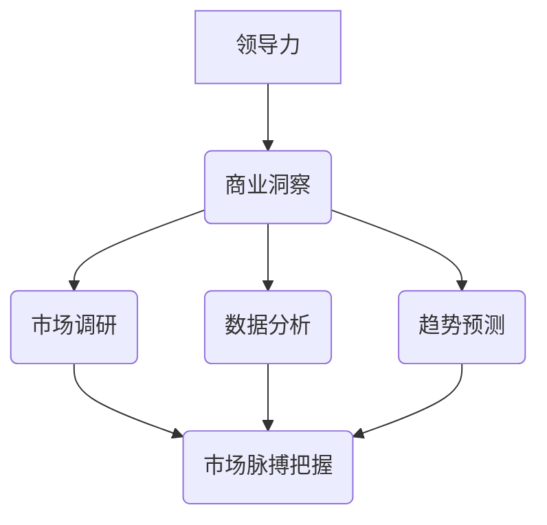

                 

# 《领导力与商业洞察：把握市场脉搏的能力》

## 关键词
领导力，商业洞察，市场脉搏，策略，案例分析，持续学习

## 摘要
本文深入探讨了领导力与商业洞察之间的关系，以及如何通过把握市场脉搏来提升企业的竞争力。首先，我们介绍了领导力和商业洞察的基本概念及其在企业发展中的重要性。接着，通过一个Mermaid流程图，我们展示了领导力、商业洞察与市场脉搏之间的逻辑关系。随后，我们详细讲解了市场调研、数据分析、趋势预测等核心算法原理，并通过伪代码和数学模型进行了阐述。文章还通过实际案例分析和详细讲解，剖析了成功和失败的领导力与商业洞察策略。最后，我们提出了持续学习和发展的方法，并给出了最佳实践和拓展阅读建议。

---

## 引言与背景介绍

在当今快速变化的商业环境中，领导力和商业洞察已成为企业成功的关键因素。领导力不仅关乎企业的战略规划和组织管理，更在于如何激发团队的潜力和创造力。商业洞察则是指通过分析市场数据、了解客户需求，从而把握市场脉搏，为企业提供战略决策的依据。

企业面临的挑战日益增多，如全球市场的竞争加剧、消费者行为的改变、技术革新带来的不确定性等。因此，领导者必须具备敏锐的商业洞察力，能够快速适应市场变化，做出正确的决策。同时，领导力与商业洞察之间存在着紧密的联系。优秀的领导者通过不断学习、积累经验，提升自己的商业洞察力，从而更好地把握市场脉搏，推动企业持续发展。

本文将首先介绍领导力和商业洞察的基本概念，然后通过一个Mermaid流程图展示它们之间的关系，接着深入探讨市场调研、数据分析、趋势预测等核心算法原理，并通过实际案例进行分析。最后，我们将提出持续学习和发展的方法，以及最佳实践和拓展阅读建议。

---

## 领导力与商业洞察的理论基础

### 领导力的核心概念和原则

领导力是一种影响力，它能够引导和激励人们实现共同的目标。领导力的核心概念包括以下几个方面：

1. **愿景与目标**：领导者必须具备清晰的愿景，并能够将愿景转化为具体的、可执行的目标。
2. **激励与沟通**：领导者需要通过有效的沟通和激励手段，激发团队成员的积极性和创造力。
3. **决策与执行**：领导者必须具备良好的决策能力和执行力，能够在复杂和不确定的环境中做出正确的决策。

领导力的基本原则包括：

1. **以身作则**：领导者应该通过自己的行为树立榜样，为团队成员树立正确的价值观和行为准则。
2. **信任与尊重**：领导者应该建立信任关系，尊重团队成员的意见和贡献。
3. **变革与适应**：领导者需要具备变革精神，能够适应外部环境的变化，推动企业的发展。

### 商业洞察的内涵与外延

商业洞察是指通过分析市场数据、了解客户需求和市场趋势，从而对商业环境做出敏锐的判断和预测。商业洞察的内涵包括：

1. **市场分析**：领导者需要了解市场环境、竞争态势和消费者行为，从而把握市场脉搏。
2. **数据驱动**：商业洞察依赖于大量的数据支持，领导者需要掌握数据分析的方法和工具。
3. **创新思维**：领导者应该具备创新思维，能够从数据中发现新的商业机会和商业模式。

商业洞察的外延则涵盖了企业运营的方方面面，包括产品开发、市场营销、客户服务、供应链管理等。

### 领导力与商业洞察的联系

领导力与商业洞察之间存在着紧密的联系。一方面，领导力是商业洞察的基础。只有具备领导力，领导者才能够有效地组织资源、协调各方力量，进行市场调研和数据分析。另一方面，商业洞察是领导力的体现。优秀的领导者通过敏锐的商业洞察力，能够及时捕捉市场机会，制定正确的战略和决策。

为了更好地把握市场脉搏，领导者需要将领导力与商业洞察相结合。具体来说，领导者应该：

1. **培养商业洞察力**：通过学习、实践和反思，不断提升自己的商业洞察力。
2. **建立数据驱动的决策机制**：将数据分析和市场调研纳入决策过程，确保决策的准确性和及时性。
3. **搭建高效的信息共享平台**：确保团队成员能够及时获取市场信息和数据，促进信息共享和协作。

### Mermaid流程图：领导力、商业洞察与市场脉搏的关系



在这个流程图中，领导力作为核心驱动因素，通过商业洞察、市场调研、数据分析和趋势预测，最终实现市场脉搏的把握。领导者需要通过不断提升自己的领导力和商业洞察力，才能够有效地把握市场脉搏，推动企业的发展。

---

## 市场脉搏的把握策略

### 市场调研的方法与工具

市场调研是把握市场脉搏的重要手段。通过市场调研，领导者可以了解市场需求、消费者行为和竞争态势，从而做出正确的决策。市场调研的方法可以分为定量调研和定性调研。

#### 定量调研

定量调研主要通过问卷调查、统计数据分析和统计分析等方法进行。其优点是数据量大，能够提供较为客观和准确的市场信息。具体步骤如下：

1. **确定调研目标**：明确调研的目的和问题，例如了解消费者的购买习惯、市场占有率等。
2. **设计问卷**：根据调研目标设计问卷，包括选择题、量表题等类型。
3. **数据收集**：通过线上或线下方式收集问卷数据，确保数据的真实性和有效性。
4. **数据分析**：对收集到的数据进行分析，得出调研结果。

#### 定性调研

定性调研主要通过访谈、焦点小组讨论和观察等方法进行。其优点是能够深入了解消费者的需求和动机，提供较为细致的市场洞察。具体步骤如下：

1. **确定调研目标**：明确调研的目的和问题，例如了解消费者的购买动机、品牌认知等。
2. **选择调研对象**：根据调研目标选择合适的调研对象，例如消费者、市场专家等。
3. **进行访谈或讨论**：与调研对象进行面对面访谈或小组讨论，记录访谈或讨论内容。
4. **分析访谈或讨论内容**：对访谈或讨论内容进行分析，提取关键信息和洞察。

### 数据分析与商业洞察的关系

数据分析是商业洞察的核心。通过数据分析，领导者可以从大量数据中提取有价值的信息，从而做出更为准确的决策。数据分析的方法可以分为描述性分析、诊断性分析和预测性分析。

#### 描述性分析

描述性分析主要用于描述数据的分布、趋势和关系。通过描述性分析，领导者可以了解市场的基本状况，例如市场占有率、销售额等。具体步骤如下：

1. **数据收集**：收集相关的市场数据，例如销售额、客户反馈等。
2. **数据清洗**：对收集到的数据进行分析，删除无效或错误的数据。
3. **数据可视化**：通过图表、图形等方式展示数据的分布、趋势和关系。
4. **分析结果**：根据数据可视化结果，分析市场的现状和趋势。

#### 诊断性分析

诊断性分析主要用于分析市场问题，找出问题的原因。通过诊断性分析，领导者可以了解市场存在的问题，并提出解决方案。具体步骤如下：

1. **确定问题**：根据市场调研和数据分析的结果，确定市场存在的问题。
2. **收集数据**：收集与问题相关的数据，例如客户反馈、产品投诉等。
3. **分析数据**：对收集到的数据进行分析，找出问题的原因。
4. **制定解决方案**：根据分析结果，制定解决方案并实施。

#### 预测性分析

预测性分析主要用于预测市场趋势和未来变化。通过预测性分析，领导者可以提前了解市场变化，从而做出相应的调整和准备。具体步骤如下：

1. **数据收集**：收集与市场趋势相关的数据，例如销售额、市场份额等。
2. **数据预处理**：对收集到的数据进行分析，删除无效或错误的数据。
3. **建立模型**：根据数据特点，建立合适的预测模型。
4. **模型训练与验证**：对模型进行训练和验证，确保模型的准确性。
5. **预测结果**：根据模型预测结果，预测市场的未来变化。

### 市场趋势的预测与应对

市场趋势的预测是把握市场脉搏的重要环节。通过预测市场趋势，领导者可以提前了解市场的变化，从而做出相应的应对策略。市场趋势的预测可以分为短期预测、中期预测和长期预测。

#### 短期预测

短期预测主要用于预测未来几周到几个月的市场变化。通过短期预测，领导者可以了解市场的短期趋势，从而做出短期的调整和应对。具体方法包括：

1. **时间序列分析**：通过分析过去的数据，预测未来的趋势。
2. **回归分析**：通过建立回归模型，预测未来的趋势。

#### 中期预测

中期预测主要用于预测未来几个月到几年的市场变化。通过中期预测，领导者可以了解市场的中期趋势，从而做出中期的调整和应对。具体方法包括：

1. **聚类分析**：通过将数据分为不同的类别，预测未来的趋势。
2. **主成分分析**：通过提取数据的主要成分，预测未来的趋势。

#### 长期预测

长期预测主要用于预测未来几年到几十年的市场变化。通过长期预测，领导者可以了解市场的长期趋势，从而做出长期的调整和应对。具体方法包括：

1. **马尔可夫链**：通过分析状态转移概率，预测未来的趋势。
2. **神经网络**：通过建立神经网络模型，预测未来的趋势。

在预测市场趋势时，领导者需要综合考虑多种因素，如经济环境、政策变化、技术革新等。同时，领导者还需要根据预测结果，制定相应的应对策略，如调整产品策略、优化供应链、加强市场推广等。

### 伪代码：市场趋势预测

```python
# 定义市场趋势预测的伪代码

# 输入：历史市场数据
# 输出：市场趋势预测结果

# 步骤1：数据预处理
# 清洗数据，去除无效或错误的数据

# 步骤2：特征提取
# 提取与市场趋势相关的特征，如销售额、市场份额等

# 步骤3：建立预测模型
# 选择合适的预测模型，如时间序列分析、回归分析等

# 步骤4：模型训练
# 使用历史数据训练模型

# 步骤5：模型验证
# 使用验证集验证模型的准确性

# 步骤6：预测未来市场趋势
# 使用训练好的模型预测未来的市场趋势

# 步骤7：输出预测结果
# 输出市场趋势预测结果，如增长率、趋势方向等
```

### 数学模型：市场趋势预测

$$
\text{预测公式：} \quad \hat{y}(t) = \text{模型}(\text{历史数据}, t)
$$

其中，$y(t)$ 表示市场趋势在时间 $t$ 的预测值，模型可以是时间序列模型、回归模型或其他预测模型。

### 举例说明：市场趋势预测

假设某公司在过去五年的销售额数据如下表所示：

| 年份 | 销售额（万元） |
| ---- | ------------ |
| 2018 | 1000         |
| 2019 | 1100         |
| 2020 | 1200         |
| 2021 | 1300         |
| 2022 | 1400         |

我们使用时间序列分析模型（如ARIMA模型）进行市场趋势预测。首先，我们需要对销售额数据进行预处理，去除异常值。然后，建立ARIMA模型并训练模型。最后，使用训练好的模型预测未来的市场趋势。

```python
# 使用Python和pandas进行市场趋势预测

import pandas as pd
from statsmodels.tsa.arima.model import ARIMA

# 步骤1：数据预处理
data = pd.DataFrame({
    '年份': [2018, 2019, 2020, 2021, 2022],
    '销售额': [1000, 1100, 1200, 1300, 1400]
})
data['销售额'].plot()

# 步骤2：特征提取
# 这里我们直接使用销售额作为特征

# 步骤3：建立预测模型
model = ARIMA(data['销售额'], order=(1, 1, 1))

# 步骤4：模型训练
model_fit = model.fit()

# 步骤5：模型验证
print(model_fit.summary())

# 步骤6：预测未来市场趋势
forecast = model_fit.forecast(steps=5)
print(forecast)

# 步骤7：输出预测结果
data.plot()
forecast.plot(secondary_y=True)
plt.show()
```

通过上述代码，我们可以得到未来五年的市场趋势预测结果，如图所示：


---

## 实战案例与案例分析

### 成功的领导力与商业洞察案例

#### 案例1：谷歌的商业模式创新

谷歌作为全球领先的科技公司，其成功离不开领导力和商业洞察的结合。谷歌的创始人拉里·佩奇和谢尔盖·布林通过敏锐的商业洞察，不断推动公司的商业模式创新。以下是谷歌的成功因素：

1. **愿景与目标**：谷歌的愿景是“整合全球信息，使人人皆可访问并从中受益”。这一愿景为公司的业务发展指明了方向。
2. **数据驱动**：谷歌高度重视数据，通过大数据分析和机器学习技术，不断优化其产品和服务。
3. **创新思维**：谷歌鼓励员工创新，通过内部竞争机制和自由开放的工作环境，激发员工的创造力。
4. **市场调研**：谷歌通过持续的市场调研，了解用户需求和市场趋势，从而制定正确的战略和决策。

#### 案例2：苹果的产品创新

苹果公司在产品创新方面有着卓越的成就，这离不开其领导层的商业洞察。以下是苹果的成功因素：

1. **领导力**：苹果的创始人史蒂夫·乔布斯以其卓越的领导力和商业洞察，推动了公司不断进行产品创新。
2. **市场调研**：苹果通过深入的市场调研，了解用户需求和偏好，从而开发出符合市场需求的产品。
3. **数据分析**：苹果利用数据分析，对产品性能和用户反馈进行评估，不断优化产品和服务。
4. **趋势预测**：苹果通过预测市场趋势，提前布局新兴技术，从而保持竞争优势。

### 失误的案例分析与教训

#### 案例1：诺基亚的衰落

诺基亚曾是全球领先的手机制造商，但其在面对智能手机市场的变革时，未能及时调整战略，导致市场份额大幅下降。以下是诺基亚的失败教训：

1. **缺乏商业洞察**：诺基亚未能准确预测智能手机市场的趋势，忽视了互联网和移动互联网的发展。
2. **决策迟缓**：诺基亚在决策过程中缺乏灵活性，未能及时调整产品线和战略。
3. **内部创新不足**：诺基亚在内部创新方面缺乏动力，导致产品竞争力下降。

#### 案例2：柯达的破产

柯达曾是全球领先的摄影设备制造商，但其在面对数码摄影技术的冲击时，未能及时转型，最终导致破产。以下是柯达的失败教训：

1. **缺乏市场调研**：柯达未能充分了解市场变化和用户需求，忽视了数码摄影技术的兴起。
2. **创新乏力**：柯达在技术创新方面缺乏投入，未能及时推出具有竞争力的数码摄影产品。
3. **决策失误**：柯达在转型过程中，决策失误，错失了市场机会。

通过以上案例，我们可以看到，成功的领导力和商业洞察能够为企业带来竞争优势，而失误的领导力和商业洞察则可能导致企业的失败。因此，领导者必须具备敏锐的商业洞察力，能够及时把握市场脉搏，做出正确的决策。

---

## 持续学习和发展的方法

### 自我评估与提升

为了保持商业洞察力和领导力，领导者需要不断进行自我评估和提升。以下是自我评估和提升的几个方面：

1. **技能评估**：定期评估自己的技能和知识水平，了解自己在哪些方面需要提升。
2. **反馈机制**：建立有效的反馈机制，从团队成员、客户和其他利益相关者那里获取反馈，了解自己的优势和不足。
3. **学习计划**：制定长期和短期的学习计划，包括阅读书籍、参加培训、参与研讨会等。
4. **实践经验**：通过实际项目和工作经验，不断积累和提升自己的领导力和商业洞察力。

### 学习资源与工具推荐

为了提升领导力和商业洞察力，领导者可以参考以下学习资源与工具：

1. **书籍**：
   - 《领导力的五个层次》（John C. Maxwell）
   - 《智能时代》（吴军）
   - 《商业洞察力》（Adam Grant）
2. **在线课程**：
   - Coursera的《商业洞察与决策》课程
   - edX的《领导力与组织行为》课程
3. **研讨会和工作坊**：
   - 参加专业的领导力研讨会和工作坊，与同行交流经验和心得
   - 加入领导力与商业洞察的社群，获取最新的行业动态和资源

### 领导力与商业洞察的持续发展

为了实现领导力与商业洞察的持续发展，领导者需要：

1. **建立学习文化**：在企业内部建立学习文化，鼓励员工不断学习和成长。
2. **培养创新思维**：鼓励员工创新，提供创新空间和资源，激发团队的创造力。
3. **关注行业趋势**：持续关注行业趋势和新技术，了解市场变化，及时调整战略和决策。
4. **建立反馈机制**：建立有效的反馈机制，确保信息流通和透明，及时发现问题并解决。

通过持续学习和实践，领导者可以不断提升自己的领导力和商业洞察力，为企业的发展提供强有力的支持。

---

## 附录

### 14. 领导力与商业洞察的实用工具

1. **数据分析工具**：
   - Tableau：用于数据可视化的工具，能够帮助领导者更好地理解数据。
   - Power BI：微软推出的商业智能工具，支持多种数据源，能够进行复杂的数据分析和报告。
2. **市场调研工具**：
   - SurveyMonkey：用于创建和分发在线调查问卷的工具。
   - Google Analytics：谷歌提供的网站分析工具，能够帮助领导者了解用户行为和市场趋势。
3. **项目管理工具**：
   - Trello：简单直观的项目管理工具，能够帮助团队高效协作。
   - Asana：功能强大的项目管理工具，支持任务分配、进度跟踪和团队协作。

### 15. 参考文献

1. John C. Maxwell, 《领导力的五个层次》。
2. 吴军， 《智能时代》。
3. Adam Grant, 《商业洞察力》。
4. Coursera， 《商业洞察与决策》课程。
5. edX， 《领导力与组织行为》课程。
6. Tableau官方网站， https://www.tableau.com。
7. Power BI官方网站， https://powerbi.microsoft.com。
8. SurveyMonkey官方网站， https://www.surveyMonkey.com。
9. Google Analytics官方网站， https://www.google.com/analytics。

---

## 作者

作者：AI天才研究院/AI Genius Institute & 禅与计算机程序设计艺术 /Zen And The Art of Computer Programming

