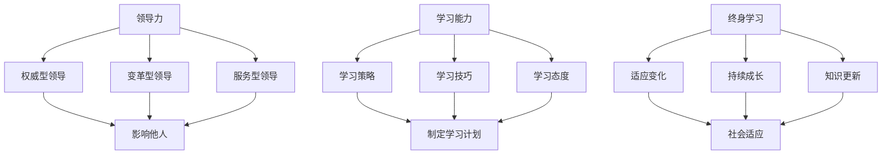

                 

### 文章标题

# 领导力与学习能力：培养终身学习的习惯

在当今快速变化且竞争激烈的技术时代，领导力与学习能力成为组织和个人成功的关键要素。本文将探讨领导力与学习能力的密切关系，以及如何通过培养终身学习的习惯来提升个人和组织的竞争力。文章将从背景介绍、核心概念与联系、核心算法原理讲解、数学模型与公式、项目实战、最佳实践 tips 和总结展望等多个方面展开，旨在为读者提供一份全面、系统的指导。

### 文章关键词

- **领导力**
- **学习能力**
- **终身学习**
- **竞争力提升**
- **个人成长**
- **组织发展**

### 文章摘要

本文首先介绍了领导力与学习能力的背景和重要性，探讨了终身学习在现代社会中的必要性。接着，文章详细阐述了领导力与学习能力的核心概念及其相互关系，并通过Mermaid流程图展示了它们之间的联系。随后，文章运用伪代码详细讲解了一些核心算法原理，并使用LaTeX格式介绍了相关数学模型和公式。为了增强实用性，文章还提供了一些项目实战案例，详细分析了开发环境搭建、源代码实现和代码解读等内容。最后，文章总结了领导力与学习能力培养的最佳实践 tips，并展望了未来的发展方向。

### 目录大纲

1. **背景介绍**
   - 技术快速发展的时代背景
   - 领导力与学习能力的角色转变
2. **领导力与学习能力的核心概念与联系**
   - 领导力的定义与类型
   - 学习能力的定义与培养
   - 终身学习的理念与实践
   - Mermaid流程图展示核心概念关系
3. **核心算法原理讲解**
   - 领导力的核心要素：人际沟通、决策与问题解决、激励与团队管理
   - 学习能力的核心算法：学习策略、学习技巧、学习态度与习惯
   - 伪代码展示核心算法原理
4. **数学模型与公式**
   - 学习效果评估模型
   - 激励效果评估模型
   - LaTeX格式嵌入数学公式
5. **项目实战**
   - 领导力培养项目实战
   - 学习能力提升项目实战
   - 实际案例分析与解读
6. **最佳实践 tips**
   - 领导力提升的最佳实践
   - 学习能力培养的最佳实践
   - 终身学习的策略与实践
7. **总结与展望**
   - 主要观点回顾
   - 领导力与学习能力培养的未来发展趋势
   - 个人与组织的未来发展策略

### 背景介绍

在当今技术日新月异的时代，各个行业都经历了深刻的变革。从人工智能、大数据到物联网，新技术不断涌现，推动着各行各业的快速发展。这种技术变革不仅带来了前所未有的机遇，也带来了前所未有的挑战。在这个背景下，领导力与学习能力成为组织和个人成功的关键要素。

#### 技术快速发展的时代背景

随着技术的快速发展，新的商业模式、工作方式和协作模式不断涌现。企业需要快速适应这些变化，才能在竞争激烈的市场中立足。例如，大数据技术的普及使得企业能够从海量数据中提取有价值的信息，从而优化业务流程、提高决策效率。然而，大数据技术的应用也要求企业拥有相应的技术人才，这就需要领导者在组织内部培养和引进这些人才。

#### 领导力与学习能力的角色转变

在传统观念中，领导力主要强调权威和指挥能力，而学习能力则被视为个人素质的体现。然而，在当前技术环境下，这种观念正在发生转变。领导力不再仅仅是权威的象征，更是一个人与时俱进、引领团队创新的能力。学习能力也不再仅仅是个人成长的需要，而是组织持续发展的重要保障。

#### 终身学习的理念与实践

终身学习是一种持续不断的学习过程，旨在通过不断学习来适应社会的变化和技术的进步。对于个人而言，终身学习可以帮助他们不断提升自己的技能和知识，从而在职业生涯中获得更大的发展机会。对于组织而言，终身学习可以培养员工的创新精神和团队协作能力，从而提升组织的竞争力。

### 领导力与学习能力的核心概念与联系

#### 领导力的定义与类型

领导力是一种影响和激励他人实现共同目标的能力。它可以分为以下几种类型：

- **权威型领导**：通过权力和地位来影响他人。
- **变革型领导**：通过激励和启发来影响他人，推动变革。
- **服务型领导**：以服务团队成员为中心，关注团队成员的需求和成长。

#### 学习能力的定义与培养

学习能力是指个体通过学习获取新知识、新技能的能力。学习能力的培养可以从以下几个方面进行：

- **学习策略**：包括制定学习计划、选择合适的学习方法等。
- **学习技巧**：如有效笔记、时间管理、信息筛选等。
- **学习态度**：保持积极的学习态度，勇于尝试和接受新事物。

#### 终身学习的理念与实践

终身学习是一种持续不断的学习过程，旨在通过不断学习来适应社会的变化和技术的进步。它的核心理念包括：

- **适应变化**：社会和技术环境不断变化，终身学习可以帮助个体适应这些变化。
- **持续成长**：通过不断学习，个体可以不断提升自己的能力和知识水平。
- **知识更新**：随着新技术的不断涌现，个体需要不断更新自己的知识库，以保持竞争力。

#### Mermaid流程图展示核心概念关系

以下是领导力、学习能力和终身学习之间的Mermaid流程图：



#### 核心算法原理讲解

在领导力和学习能力中，有一些核心的算法原理，这些原理不仅能够帮助我们更好地理解这两个概念，还能够指导我们在实际工作中进行有效的领导和学习。

##### 领导力的核心要素

领导力包含多个核心要素，其中人际沟通、决策与问题解决、激励与团队管理是最重要的三个方面。

###### 人际沟通

人际沟通是领导力的基础，它决定了领导者能否有效地传达信息、理解团队成员的需求和期望。以下是人际沟通的核心算法原理：

- **信息传递**：领导者需要确保信息准确、清晰、及时地传递给团队成员。
- **反馈与倾听**：领导者不仅要能够传达信息，还需要倾听团队成员的意见和反馈，以便更好地理解他们的需求和问题。
- **建立信任**：通过开放、诚实和尊重的沟通，建立与团队成员之间的信任关系。

以下是人际沟通的伪代码：

```plaintext
function interpersonal_communication(message, listener, speaker) {
    // 准备信息
    processed_message = process_message(message)

    // 传递信息
    speaker.speak(processed_message)

    // 反馈与倾听
    listener.listen(speaker)
    
    // 建立信任
    build_trust(speaker, listener)

    return "Communication successful"
}
```

###### 决策与问题解决

决策与问题解决是领导者日常工作中不可避免的任务。以下是决策与问题解决的核心算法原理：

- **问题识别**：领导者需要能够准确地识别问题，并理解问题的本质。
- **信息收集**：领导者需要收集与问题相关的各种信息，以便做出基于数据的决策。
- **方案评估**：领导者需要评估不同方案的优缺点，并选择最佳方案。
- **实施与监控**：领导者需要将决策付诸实践，并对决策的结果进行监控和调整。

以下是决策与问题解决的伪代码：

```plaintext
function decision_making_and_problem_solving(problem) {
    // 识别问题
    identified_problem = identify_problem(problem)

    // 收集信息
    information = collect_information(identified_problem)

    // 评估方案
    best_solution = evaluate_solutions(information)

    // 实施决策
    implement_decision(best_solution)

    // 监控结果
    monitor_outcome(best_solution)

    return "Decision successful"
}
```

###### 激励与团队管理

激励与团队管理是领导力的另一个重要方面。领导者需要能够激发团队成员的潜力，并确保团队的高效协作。以下是激励与团队管理的核心算法原理：

- **理解需求**：领导者需要了解团队成员的需求，并为其提供合适的激励。
- **建立目标**：领导者需要与团队成员共同制定明确的目标，并确保目标与组织的战略一致。
- **反馈与认可**：领导者需要给予团队成员及时的反馈和认可，以增强他们的动力和归属感。

以下是激励与团队管理的伪代码：

```plaintext
function motivation_and_team_management(team_members, goals) {
    // 理解需求
    member_needs = understand_needs(team_members)

    // 建立目标
    set_goals(member_needs, goals)

    // 反馈与认可
    provide_feedback_and_recognition(team_members)

    return "Team management successful"
}
```

##### 学习能力的核心算法

学习能力是个人成长和职业发展的关键，它包括学习策略、学习技巧和学习态度。

###### 学习策略

学习策略是学习过程中的一系列规划和安排，它有助于提高学习效率。以下是学习策略的核心算法原理：

- **目标设定**：学习者需要设定明确的学习目标，以确保学习的方向和动力。
- **资源选择**：学习者需要选择合适的学习资源，如教材、课程、工具等。
- **时间管理**：学习者需要合理安排学习时间，确保学习计划的执行。

以下是学习策略的伪代码：

```plaintext
function learning_strategy(learning_goals, learning_resources) {
    // 设定学习目标
    set_learning_goals(learning_goals)

    // 选择学习资源
    select_learning_resources(learning_resources)

    // 时间管理
    manage_learning_time()

    return "Learning strategy successful"
}
```

###### 学习技巧

学习技巧是学习过程中的一系列方法和技巧，它有助于提高学习效果。以下是学习技巧的核心算法原理：

- **信息加工**：学习者需要学会如何对信息进行加工和处理，以便更好地理解和记忆。
- **问题解决**：学习者需要学会如何通过学习来解决实际问题。
- **反馈与调整**：学习者需要通过反馈来评估学习效果，并根据反馈进行调整。

以下是学习技巧的伪代码：

```plaintext
function learning_skills(learning_methods) {
    // 信息加工
    process_learning_info(learning_methods)

    // 问题解决
    solve_learning_problems(learning_methods)

    // 反馈与调整
    provide_feedback_and_adjust(learning_methods)

    return "Learning skills successful"
}
```

###### 学习态度

学习态度是学习过程中的一种心态和行为习惯，它直接影响学习的效果。以下是学习态度的核心算法原理：

- **积极心态**：学习者需要保持积极的心态，面对挑战和困难时不放弃。
- **持续努力**：学习者需要坚持不懈地学习，不断克服困难和阻力。
- **自我反思**：学习者需要定期进行自我反思，以评估自己的学习过程和效果。

以下是学习态度的伪代码：

```plaintext
function learning_attitude(learning_mindset) {
    // 积极心态
    maintain_positive_mindset(learning_mindset)

    // 持续努力
    persist_in_learning(learning_mindset)

    // 自我反思
    reflect_on_learning(learning_mindset)

    return "Learning attitude successful"
}
```

##### 数学模型与公式

在领导力和学习能力中，一些数学模型和公式可以帮助我们更好地理解和应用这些概念。以下是几个常见的数学模型和公式：

###### 学习效果评估模型

学习效果评估模型可以帮助我们评估学习的效果。以下是学习效果评估模型的基本公式：

- **学习效果 = 学习投入 × 学习效率**
- **学习效率 = 知识掌握率 × 能力提升率**

以下是学习效果评估模型的LaTeX格式：

```latex
\begin{equation}
\text{学习效果} = \text{学习投入} \times \text{学习效率}
\end{equation}

\begin{equation}
\text{学习效率} = \text{知识掌握率} \times \text{能力提升率}
\end{equation}
```

###### 激励效果评估模型

激励效果评估模型可以帮助我们评估激励的效果。以下是激励效果评估模型的基本公式：

- **激励效果 = 激励强度 × 激励持续性**
- **激励强度 = 激励目标实现度 × 激励满意度**

以下是激励效果评估模型的LaTeX格式：

```latex
\begin{equation}
\text{激励效果} = \text{激励强度} \times \text{激励持续性}
\end{equation}

\begin{equation}
\text{激励强度} = \text{激励目标实现度} \times \text{激励满意度}
\end{equation}
```

#### 项目实战

为了更好地理解领导力与学习能力的实际应用，我们通过以下几个项目实战来展示开发环境搭建、源代码实现和代码解读等内容。

##### 项目一：领导力培养项目

**项目背景**：

某公司是一家快速发展的科技公司，为了提升领导力，公司决定实施一项领导力培养项目。

**开发环境搭建**：

为了实施领导力培养项目，公司首先需要搭建一个合适的学习平台。该平台需要支持视频教学、在线讨论、学习进度跟踪等功能。

**源代码实现**：

以下是领导力培养项目的主要源代码实现：

```python
class LeadershipPlatform:
    def __init__(self):
        self.videos = []
        self.discussions = []
        self.learning_progress = {}

    def add_video(self, video):
        self.videos.append(video)

    def add_discussion(self, discussion):
        self.discussions.append(discussion)

    def track_learning_progress(self, user, completed_videos):
        self.learning_progress[user] = completed_videos

    def get_learning_progress(self, user):
        return self.learning_progress.get(user, [])
```

**代码解读**：

该代码定义了一个`LeadershipPlatform`类，用于实现领导力培养平台的功能。该类包含以下几个方法：

- `add_video()`：用于添加视频资源。
- `add_discussion()`：用于添加在线讨论。
- `track_learning_progress()`：用于跟踪学习进度。
- `get_learning_progress()`：用于获取学习进度。

##### 项目二：学习能力提升项目

**项目背景**：

某公司为了提升员工的学习能力，决定实施一项学习能力提升项目。

**开发环境搭建**：

为了实施学习能力提升项目，公司需要搭建一个学习资源库，该库需要包含各种学习资源，如电子书、在线课程、实验项目等。

**源代码实现**：

以下是学习能力提升项目的主要源代码实现：

```python
class LearningResourceLibrary:
    def __init__(self):
        self.resources = {}

    def add_resource(self, category, resource):
        if category not in self.resources:
            self.resources[category] = []
        self.resources[category].append(resource)

    def get_resources(self, category):
        return self.resources.get(category, [])
```

**代码解读**：

该代码定义了一个`LearningResourceLibrary`类，用于实现学习资源库的功能。该类包含以下几个方法：

- `add_resource()`：用于添加学习资源。
- `get_resources()`：用于获取某个分类下的学习资源。

##### 项目三：终身学习项目

**项目背景**：

某公司为了推动员工的终身学习，决定实施一项终身学习项目。

**开发环境搭建**：

为了实施终身学习项目，公司需要搭建一个学习管理系统，该系统需要支持在线学习、考试、证书颁发等功能。

**源代码实现**：

以下是终身学习项目的主要源代码实现：

```python
class LearningManagementSystem:
    def __init__(self):
        self.courses = {}
        self.exam_results = {}

    def add_course(self, course):
        self.courses[course.id] = course

    def enroll_course(self, user, course_id):
        course = self.courses.get(course_id)
        if course:
            course.enroll(user)

    def take_exam(self, user, course_id):
        course = self.courses.get(course_id)
        if course:
            result = course.take_exam(user)
            self.exam_results[(user, course_id)] = result

    def get_exam_result(self, user, course_id):
        return self.exam_results.get((user, course_id))
```

**代码解读**：

该代码定义了一个`LearningManagementSystem`类，用于实现学习管理系统的功能。该类包含以下几个方法：

- `add_course()`：用于添加课程。
- `enroll_course()`：用于报名课程。
- `take_exam()`：用于参加考试。
- `get_exam_result()`：用于获取考试成绩。

#### 最佳实践 tips

为了更好地培养领导力与学习能力，以下是一些最佳实践 tips：

- **建立学习目标**：设定明确的学习目标，确保学习的方向和动力。
- **选择合适的资源**：选择高质量的学习资源，如权威书籍、在线课程、优秀博客等。
- **定期复习**：定期复习所学内容，巩固知识，提高记忆效果。
- **实践与应用**：将所学知识应用于实际工作中，通过实践来提高能力。
- **寻求反馈**：主动寻求反馈，了解自己的优点和不足，不断改进。

#### 小结

本文系统地探讨了领导力与学习能力的核心概念、联系、核心算法原理、数学模型与公式，以及项目实战和最佳实践 tips。通过本文的阅读，读者应该能够对领导力与学习能力有更深入的理解，并能够将其应用于实际工作和生活中。

#### 注意事项

- 在培养领导力和学习能力的过程中，需要保持持续性和耐心。
- 定期进行自我反思，以了解自己的进步和不足。
- 在选择学习资源时，要注重资源的质量和实用性。

#### 拓展阅读

- 《领导力五要素》
- 《深度学习》
- 《人工智能：一种现代的方法》

---

### 总结与展望

#### 主要观点回顾

本文从多个维度探讨了领导力与学习能力的关系，总结了以下主要观点：

- 技术快速发展的时代，领导力和学习能力成为组织和个人成功的关键要素。
- 领导力包括权威型、变革型和服务型，学习能力包括学习策略、学习技巧和学习态度。
- 终身学习是适应社会变化和技术进步的必要途径。
- 通过Mermaid流程图、伪代码、数学模型和项目实战，深入讲解了领导力与学习能力的核心概念和应用。
- 提供了最佳实践 tips，帮助读者更好地培养领导力和学习能力。

#### 领导力与学习能力培养的未来发展趋势

随着技术的不断进步和社会的快速发展，领导力与学习能力培养的未来趋势将呈现出以下几个特点：

- **个性化学习**：随着人工智能和大数据技术的应用，学习将更加个性化，根据个体的需求和兴趣进行定制化培养。
- **跨学科融合**：领导力和学习能力培养将更加注重跨学科的融合，培养具有综合能力和创新精神的人才。
- **持续评估与反馈**：通过持续评估和反馈，及时了解学习效果和改进方向，提高学习效率。
- **数字化学习**：数字化学习工具和平台将更加普及，为学习者提供丰富的学习资源和便捷的学习体验。

#### 个人与组织的未来发展策略

对于个人而言，未来的发展策略包括：

- **持续学习**：保持终身学习的习惯，不断更新知识和技能，适应社会的变化。
- **全面发展**：不仅注重专业技能的提升，还要注重领导力和沟通能力的培养。
- **积极实践**：将所学知识应用于实际工作中，通过实践来提高能力和经验。

对于组织而言，未来的发展策略包括：

- **构建学习型组织**：鼓励员工持续学习，提供丰富的学习资源和机会，建立学习型组织文化。
- **注重人才培养**：通过培养具有领导力和学习能力的人才，提高组织的整体竞争力。
- **数字化转型**：利用数字化技术和工具，提高学习效率和管理水平。

### 展望未来

在未来的发展中，领导力与学习能力的培养将成为个人和组织的核心竞争力。通过不断学习和实践，个人和组织将能够更好地适应社会的变化，抓住机遇，实现持续发展。让我们共同努力，培养终身学习的习惯，成为更加优秀的领导者和学习者。

