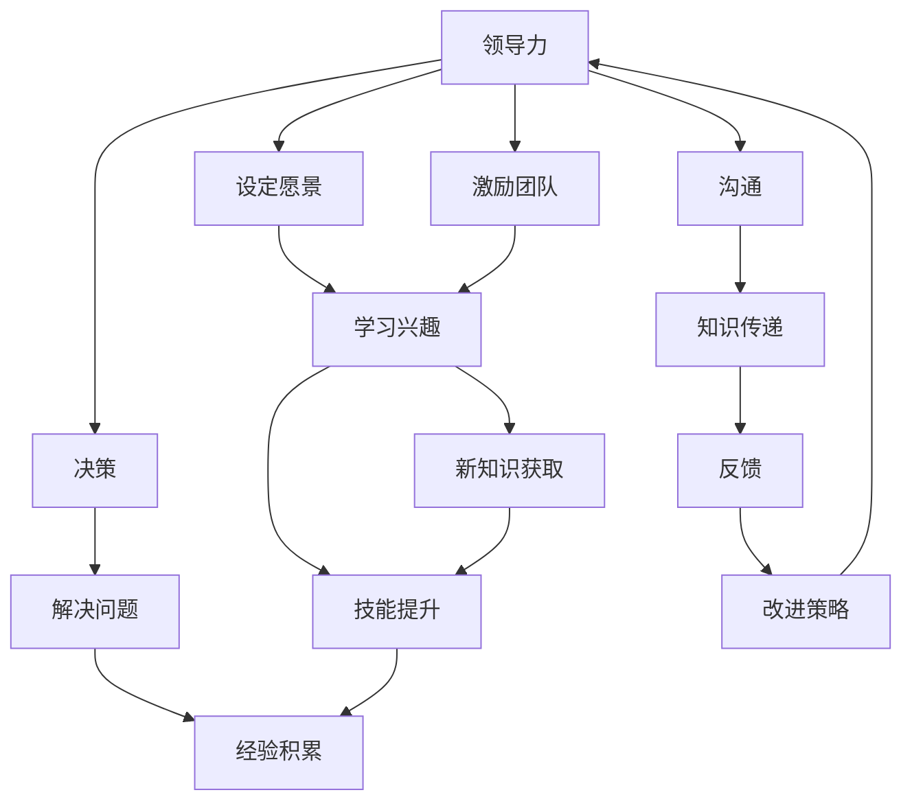

                 

### 文章标题：领导力与学习能力：持续成长的重要性

领导力与学习能力是现代职场中不可或缺的两大核心素质。领导力关乎个人或团队如何有效地达成目标，而学习能力则是个人和组织适应快速变化环境的关键。在IT行业，这两个素质尤为关键，因为技术日新月异，掌握最新的技术和理念已成为提升竞争力的必备条件。

本文将从以下几个方面探讨领导力与学习能力的重要性：

1. **背景介绍**：分析领导力与学习能力的起源及其在职场中的重要性。
2. **核心概念与联系**：深入解析领导力和学习能力的定义、特征及其相互作用。
3. **核心算法原理讲解**：介绍领导力与学习能力相关的理论模型，使用伪代码进行详细阐述。
4. **数学模型和公式讲解**：解释相关的数学模型和公式，并通过例子进行说明。
5. **项目实战**：通过具体案例展示如何在实际场景中应用领导力和学习能力。
6. **总结与展望**：总结本文的主要观点，并对未来进行展望。

### 文章关键词

- 领导力
- 学习能力
- IT行业
- 持续成长
- 职场竞争力
- 管理模型

### 文章摘要

本文探讨了领导力与学习能力在职场，特别是IT行业中的重要性。首先，我们介绍了领导力与学习能力的背景和核心概念，并通过流程图展示了它们之间的相互作用。接着，我们详细讲解了领导力与学习能力相关的理论模型和数学模型，使用伪代码和公式进行了阐述。随后，通过实际案例展示了如何将这些理论应用于实际工作中。最后，我们对本文的主要观点进行了总结，并展望了领导力与学习能力在未来职场中的发展趋势。

---

# 引言

在当今的快速变化的世界中，领导力和学习能力已经成为个人和组织成功的关键要素。领导力不仅关乎个人如何在团队中发挥作用，更关乎如何引导和激励他人实现共同目标。而学习能力则是个人和团队适应不断变化的环境、抓住新机遇、应对挑战的重要手段。

在IT行业，技术更新速度极快，新的编程语言、框架、工具和技术层出不穷。因此，对于IT从业者来说，拥有强大的领导力和学习能力尤为重要。领导力可以帮助团队更好地协作，提高效率，而学习能力则使个体能够迅速掌握新技术，保持竞争力。

本文将首先介绍领导力和学习能力的核心概念，然后通过流程图展示它们之间的相互作用。接着，我们将详细讲解领导力与学习能力相关的理论模型，使用伪代码和数学模型进行阐述。此外，本文还将通过实际案例展示如何将领导力与学习能力应用于实际工作中，以提升个人和团队的表现。最后，我们将总结本文的主要观点，并对未来进行展望。

## 核心概念与联系

### 领导力的定义与特征

领导力是一种引导、激励和影响他人达成目标的能力。它可以体现在个人、团队或组织层面。领导力的核心特征包括：

- **愿景**：领导者能够清晰定义团队的愿景和目标，并使其为团队成员所接受。
- **激励**：领导者能够激发团队成员的积极性，使其为实现共同目标而努力。
- **决策**：领导者能够在复杂和不确定的环境中进行有效的决策。
- **沟通**：领导者能够有效地与团队成员沟通，确保信息的准确传递和理解。

### 学习能力的定义与特征

学习能力是指个体或组织在获取、理解和应用新知识、技能和经验的过程中所展现出的能力。学习能力的核心特征包括：

- **适应性**：能够迅速适应新环境和变化。
- **反思**：能够通过反思和实践不断优化自己的知识和技能。
- **创新能力**：能够在新的挑战面前提出创新的解决方案。
- **持续学习**：保持对新知识、技能和经验的持续获取和更新。

### 领导力与学习能力的相互作用

领导力与学习能力之间存在密切的相互作用。领导力可以促进学习能力的提升，而学习能力则为领导力的发挥提供支持。

- **领导力促进学习能力**：通过设定明确的愿景和目标，领导者可以激发团队成员的学习兴趣和动力。此外，领导者通过积极的反馈和指导，可以帮助团队成员更好地理解和应用新知识。
  
- **学习能力支持领导力**：强大的学习能力使领导者能够快速掌握新的管理理念和技能，从而更好地应对复杂的管理挑战。同时，领导者通过持续学习，可以不断更新自己的知识和技能，保持竞争力。

### 流程图展示

为了更直观地展示领导力与学习能力之间的相互作用，我们可以使用Mermaid流程图来描述这一关系。以下是该流程图的文本表示：



通过这个流程图，我们可以看到领导力通过设定愿景、激励团队、决策和沟通等行为，可以促进团队成员的学习兴趣和动力。同时，学习能力通过获取新知识、提升技能、积累经验等行为，支持领导力的有效实施。

## 领导力模型与算法原理

领导力是复杂而又多层次的现象，不同的领导模型从不同角度解释领导力的本质和运作方式。以下介绍几种常见的领导力模型，并使用伪代码详细阐述其核心算法原理。

### transformational leadership 模型

Transformational leadership 模型强调领导者的个人愿景和价值观对团队成员的激励作用。该模型的核心算法是领导者通过变革型沟通和榜样作用，激发团队成员的内在动机和自我实现需求。

**伪代码：**

```plaintext
function transformational_leadership(team_members, leader):
    for member in team_members:
        member.vision = leader.vision
        member.values = leader.values
        member.motivation = leader motivate_member(member)
    return team_performance
```

**算法原理：**
1. 领导者明确传达愿景和价值观。
2. 领导者通过变革型沟通激励团队成员。
3. 领导者通过榜样作用影响团队成员。
4. 综合团队成员的表现，评估团队绩效。

### servant leadership 模型

Servant leadership 模型强调领导者作为“仆人”的角色，通过关心团队成员的需求和成长，提升团队的整体福祉。

**伪代码：**

```plaintext
function servant_leadership(team_members, leader):
    for member in team_members:
        leader.collect member's needs
        leader.address member's needs
        member.growth = leader support_member_growth(member)
    return team_well-being
```

**算法原理：**
1. 领导者收集团队成员的需求。
2. 领导者满足团队成员的需求。
3. 领导者支持团队成员的成长。
4. 评估团队的整体福祉。

### situational leadership 模型

Situational leadership 模型认为领导风格应根据不同情境灵活调整。该模型的核心算法是根据团队成员的成熟度，选择最合适的领导风格。

**伪代码：**

```plaintext
function situational_leadership(team_members, leader):
    for member in team_members:
        member.maturity = assess_member_maturity(member)
        if member.maturity == low:
            leader.style = directing
        else if member.maturity == medium:
            leader.style = coaching
        else if member.maturity == high:
            leader.style = supporting
    return team_performance
```

**算法原理：**
1. 评估团队成员的成熟度。
2. 根据成熟度选择合适的领导风格。
3. 应用选定的领导风格，指导团队成员。
4. 评估团队绩效。

### 领导力的数学模型与公式

除了上述模型，领导力还可以通过数学模型进行量化分析。以下介绍几种常用的数学模型和公式。

### 领导力指数模型

该模型通过计算领导力各维度（如沟通、决策、激励等）的权重和得分，评估领导力总体水平。

**公式：**

$$
Leadership \ Index = \sum_{i=1}^{n} w_i \times S_i
$$

其中，$w_i$ 是第 $i$ 个维度的权重，$S_i$ 是第 $i$ 个维度的得分。

**例子：**

假设领导力指数模型包括三个维度：沟通（权重 0.4）、决策（权重 0.3）和激励（权重 0.3）。领导者在沟通维度的得分为 8，决策维度的得分为 7，激励维度的得分为 6。

$$
Leadership \ Index = 0.4 \times 8 + 0.3 \times 7 + 0.3 \times 6 = 3.2 + 2.1 + 1.8 = 7.1
$$

### 领导效能模型

该模型通过计算领导力对组织绩效的影响，评估领导力的有效性。

**公式：**

$$
Effectiveness = f(Leadership \ Index, Organizational \ Performance)
$$

其中，$f$ 是一个函数，表示领导力指数与组织绩效之间的关系。

**例子：**

假设领导力指数为 7.1，组织绩效得分为 9。通过领导效能模型，我们可以评估领导力对组织绩效的影响。

$$
Effectiveness = f(7.1, 9)
$$

### 领导力绩效模型

该模型通过计算领导力对员工绩效的影响，评估领导力的有效性。

**公式：**

$$
Employee \ Performance = f(Leadership \ Index, Employee \ Engagement)
$$

其中，$f$ 是一个函数，表示领导力指数与员工参与度之间的关系。

**例子：**

假设领导力指数为 7.1，员工参与度为 8。通过领导力绩效模型，我们可以评估领导力对员工绩效的影响。

$$
Employee \ Performance = f(7.1, 8)
$$

通过这些数学模型和公式，我们可以更科学地评估领导力的水平和效果，从而为领导力的提升提供依据。

## 学习能力的理论模型

学习能力是个人和组织持续成长的关键因素。不同的学习理论从不同角度解释学习的过程和机制。以下是几种常见的学习能力理论模型，以及它们的算法原理和数学模型。

### 社会认知学习理论

社会认知学习理论强调观察、模仿和社交互动在学习过程中的作用。该理论模型的核心是观察者通过模仿榜样行为，并在实践中不断调整和改进。

**算法原理：**

```plaintext
function social_cognitive_learning(observer, model, environment):
    observer.observe(model)
    observer模仿 model行为
    observer实践并调整行为
    observer评估行为效果
    if 结果不理想:
        observer寻求反馈
        observer调整行为
    return observer学习后的行为
```

**数学模型：**

$$
Learning \ Effectiveness = f(Observation \ Rate, Feedback \ Rate, Practice \ Time)
$$

其中，$f$ 是一个函数，表示观察率、反馈率和实践时间对学习效果的影响。

### 经验学习理论

经验学习理论认为，学习是通过与环境交互，不断积累经验和知识的过程。该理论模型的核心是个体通过尝试、错误和反思，逐步优化自己的行为。

**算法原理：**

```plaintext
function experiential_learning(individual, environment):
    individual尝试行为
    individual观察行为效果
    individual反思并调整行为
    individual重复尝试和反思
    return individual学习后的行为
```

**数学模型：**

$$
Learning \ Progress = f(Trial \ Number, Error \ Rate, Reflection \ Time)
$$

其中，$f$ 是一个函数，表示尝试次数、错误率和反思时间对学习进度的影响。

### 投资学习理论

投资学习理论认为，学习是个人和组织的一种投资行为。该理论模型的核心是个体通过评估学习的成本和收益，做出是否继续学习的决策。

**算法原理：**

```plaintext
function investment_learning(individual, learning_opportunity):
    individual评估学习成本
    individual评估学习收益
    if 学习收益 > 学习成本:
        individual决定学习
    else:
        individual放弃学习
    return individual学习决策
```

**数学模型：**

$$
Learning \ Decision = f(Cost \ of \ Learning, Benefit \ of \ Learning)
$$

其中，$f$ 是一个函数，表示成本和收益对学习决策的影响。

### 学习能力的数学模型

除了上述理论模型，学习能力还可以通过数学模型进行量化分析。以下介绍几种常用的数学模型和公式。

### 学习曲线模型

学习曲线模型描述了学习者在完成任务时，所需时间和精力的变化趋势。该模型的核心公式是学习时间与任务完成率之间的关系。

**公式：**

$$
Learning \ Time = a \times (1 - Completion \ Rate)^b
$$

其中，$a$ 和 $b$ 是常数，$Completion \ Rate$ 是任务完成率。

**例子：**

假设学习曲线模型中的 $a = 100$，$b = 0.5$。如果任务完成率为 80%，则学习时间为：

$$
Learning \ Time = 100 \times (1 - 0.8)^0.5 = 100 \times 0.2^0.5 \approx 28.3
$$

### 学习效能模型

学习效能模型通过计算学习者在一段时间内所获得的知识和技能的提升，评估学习的效果。

**公式：**

$$
Learning \ Effectiveness = \frac{Knowledge \ Gained}{Learning \ Time}
$$

其中，$Knowledge \ Gained$ 是在一段时间内所获得的知识和技能的提升量。

**例子：**

假设一个学习者在一周内学习了新技能，并在这段时间内提升了 20% 的技能水平，学习时间为 40 小时。则学习效能模型为：

$$
Learning \ Effectiveness = \frac{20\%}{40 \ Hours} = 0.5\% \ per \ Hour
$$

通过这些数学模型和公式，我们可以更科学地评估学习的效果和效能，为个体和组织的持续成长提供数据支持。

## 项目实战：领导力与学习能力在实际场景中的应用

为了更好地理解领导力与学习能力在实际场景中的应用，我们将通过一个实际案例进行详细分析。这个案例涉及一个软件开发团队在新项目中的领导和学习过程。

### 项目背景

某科技公司接到一个大型软件开发项目，需要开发一款面向全球市场的企业级应用。该项目涉及多个模块，包括用户界面、后端服务、数据库管理、安全性和性能优化等。项目团队由10名成员组成，包括项目经理、开发人员、测试工程师和产品经理。

### 环境搭建

为了顺利启动项目，团队首先进行了环境搭建：

1. **硬件资源**：租用云服务器，配置高性能的硬件资源以支持开发、测试和部署。
2. **软件开发环境**：安装和配置必要的开发工具，如IDE、版本控制系统和持续集成工具。
3. **数据库环境**：搭建数据库服务器，配置数据库管理系统。
4. **网络环境**：设置VPN和安全措施，确保团队成员可以安全访问项目资源。

### 领导力在项目中的应用

在项目启动会上，项目经理通过以下方式展现了领导力：

1. **愿景传达**：项目经理向团队成员详细阐述了项目的目标和愿景，确保每个人都了解项目的价值和重要性。
   
2. **决策**：在项目初期，项目经理与团队成员共同讨论并制定项目计划，包括时间表、任务分配和资源调配。

3. **激励**：项目经理定期组织团队会议，分享项目进展和成功案例，激发团队成员的积极性。

4. **沟通**：项目经理通过日常站会、周报和邮件等方式，确保团队成员之间的沟通畅通，及时解决问题。

### 学习能力在项目中的应用

团队成员在项目过程中展现了强大的学习能力：

1. **适应性**：面对不断变化的需求和挑战，团队成员能够迅速调整自己的工作计划，适应新情况。

2. **反思**：团队成员在每次任务完成后，都会进行反思，总结经验教训，并提出改进措施。

3. **创新能力**：团队成员在开发过程中不断尝试新的技术和工具，以提高开发效率和代码质量。

4. **持续学习**：团队成员积极参加外部培训和学习活动，不断更新自己的知识和技能。

### 项目实战案例分析

以下是一个具体任务的实际案例分析：

**任务：优化用户界面**

1. **问题背景**：用户反馈界面加载速度较慢，用户体验不佳。

2. **领导力应用**：
   - 项目经理组织了一个特别小组，专注于优化用户界面。
   - 项目经理与特别小组进行了多次讨论，制定了详细的优化计划。

3. **学习能力应用**：
   - 特别小组成员通过研究现有技术和工具，找到了优化界面加载速度的方法。
   - 成员们通过实验和测试，不断调整和优化代码，最终成功提升了界面加载速度。

4. **结果与反思**：
   - 用户反馈界面加载速度提升了30%，用户满意度显著提高。
   - 特别小组在完成任务过程中，学习了新的优化技术，并将这些技术应用到后续任务中。

### 项目小结

通过这个实际案例，我们可以看到领导力和学习能力在项目中的重要性。领导力帮助团队明确目标、协调资源和解决问题，而学习能力使团队成员能够迅速适应新环境和变化，持续提升自己的技能和效率。只有将领导力与学习能力结合起来，团队才能在复杂的项目中取得成功。

## 总结与展望

本文通过详细探讨领导力和学习能力在职场中的重要性，阐述了这两个核心素质的基本概念、相互作用以及实际应用。我们介绍了领导力的几种常见模型，包括transformational leadership、servant leadership和situational leadership，并通过伪代码和数学模型进行了详细阐述。同时，我们也介绍了学习能力的主要理论模型，如社会认知学习理论、经验学习理论和投资学习理论。

在项目实战部分，我们通过一个具体案例展示了领导力和学习能力在实际软件开发项目中的应用，强调了这两个素质在应对复杂挑战中的重要性。通过良好的领导力和强大的学习能力，团队能够更高效地完成项目任务，提高整体绩效。

展望未来，随着技术的不断进步和职场环境的快速变化，领导力和学习能力的重要性将更加凸显。企业和个人需要不断适应新环境，提升自身素质，才能在激烈的市场竞争中立于不败之地。以下是一些未来的发展趋势和展望：

1. **个性化领导力**：未来的领导力将更加注重个性化和差异化，领导者需要根据团队成员的不同特点和需求，采取个性化的领导方式。

2. **数字化领导力**：随着数字化转型的加速，领导力也需要与数字化技术相结合，领导者需要具备数字素养，能够有效利用数字化工具提升管理效能。

3. **持续学习文化**：企业和组织需要建立持续学习的文化，鼓励员工不断学习和成长，从而提高整个组织的创新能力和竞争力。

4. **跨学科整合**：未来的职场将更加需要跨学科的知识和技能，领导者需要具备跨领域的视野和整合能力，能够应对复杂多变的环境。

总之，领导力与学习能力是现代职场中不可或缺的核心素质，只有不断提升这两个方面的能力，个人和组织才能在快速变化的环境中持续成长和取得成功。

### 附录

#### 附录A：相关资源与工具

1. **领导力与学习资源**：
   - 《领导力：如何成为卓越的领导者》：史蒂芬·科维（Stephen R. Covey）著，详细介绍了领导力的基本原理和实践方法。
   - 《深度学习：模式与策略》：约翰·霍普金斯（John Hopkins）著，提供了丰富的学习理论和实践策略。

2. **领导力与学习能力在线平台**：
   - Coursera：提供各种领导力与学习能力的在线课程。
   - EdX：提供由世界顶尖大学开设的领导力与学习课程。

3. **技术工具与平台**：
   - Git：版本控制系统，有助于团队协作和代码管理。
   - JIRA：项目管理和敏捷开发工具，用于任务跟踪和协作。

#### 附录B：案例代码解析

以下是对本文中提到的优化用户界面案例的代码解析：

```python
# 优化用户界面 - 代码示例

# 导入所需库
import flask
from flask_caching import Cache

# 配置缓存
cache = Cache(config={'CACHE_TYPE': 'simple'})

# 创建Flask应用
app = flask.Flask(__name__)

# 优化后的路由处理函数
@app.route('/user-interface')
@cache.cached(timeout=60)
def user_interface():
    # 这里是处理用户界面逻辑的代码
    # 包括前端渲染、后端数据处理等
    return flask.render_template('ui.html')

# 运行应用
if __name__ == '__main__':
    app.run(debug=True)
```

**代码解读**：

1. **导入库**：引入了Flask和Flask-Caching库，用于创建Web应用和配置缓存。

2. **配置缓存**：使用Flask-Caching配置了一个简单的内存缓存，设置缓存超时时间为60秒。

3. **创建Flask应用**：定义了一个Flask应用实例。

4. **优化后的路由处理函数**：使用`@cache.cached`装饰器，对路由处理函数进行了缓存优化。当用户访问`/user-interface`路由时，如果缓存存在有效数据，直接返回缓存内容，减少计算和数据库查询次数。

5. **运行应用**：在主程序中，使用`app.run(debug=True)`启动Flask应用，并进入调试模式。

通过这个代码示例，我们可以看到如何利用缓存技术优化用户界面的加载速度，提高用户体验。这只是一个简单的示例，实际项目中可能需要更复杂的优化策略和技术手段。

### 最佳实践 tips

1. **定期反思和总结**：定期对自己的工作和学习进行反思和总结，找出问题和改进空间。

2. **持续学习**：不断学习新的知识和技能，保持对行业动态的敏感度。

3. **构建学习型团队**：鼓励团队成员分享学习经验，建立共同学习和成长的氛围。

4. **优化工作流程**：定期审视和优化工作流程，提高工作效率和团队协作效果。

### 小结

本文探讨了领导力与学习能力在职场中的重要性，介绍了相关的理论模型和应用实例。通过不断学习和提升领导力，个人和团队可以在快速变化的环境中持续成长和取得成功。希望本文能为读者提供有价值的启示和指导。

### 拓展阅读

1. **《领导力心理学》**：约翰·梅耶（John Mayer）和布莱恩·布朗（Bryan Brown）著，详细介绍了领导力心理学的基本原理。

2. **《深度学习：从理论到实践》**：弗朗索瓦·肖莱（Francesco Corea）著，深入讲解了深度学习的理论基础和应用实践。

3. **《敏捷开发实践指南》**：杰夫·萨瑟兰（Jeff Sutherland）著，介绍了敏捷开发的核心理念和实践方法。

通过这些拓展阅读，读者可以更深入地了解领导力、学习能力和敏捷开发等领域的知识，为自己的职业发展提供更多指导。

