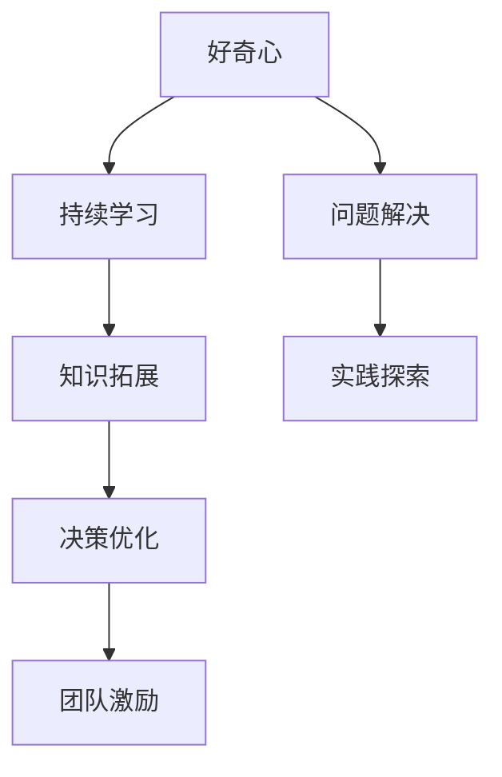

                 

# 领导力与学习：保持好奇心的重要性

## 关键词
- 领导力
- 学习
- 好奇心
- 决策
- 团队管理
- 成长

## 摘要
本文深入探讨了领导力与学习之间的关系，特别是好奇心在这一过程中的重要作用。通过分析领导力的定义、核心概念和影响因素，我们揭示了学习与领导力的内在联系。随后，我们探讨了好奇心在培养领导力中的关键作用，并通过具体案例和数学模型阐述了好奇心的培养策略和效果。本文旨在为读者提供一份关于如何通过保持好奇心来提升领导力和学习能力的全面指南。

---

### 引言

在快速变化的技术时代，领导力和学习能力成为企业成功和团队发展的关键因素。作为领导者，如何有效地管理团队、做出明智的决策，以及不断学习新的知识和技能，是持续保持竞争优势的关键。而好奇心，作为驱动学习与成长的重要动力，对领导力的提升具有不可忽视的作用。

本文将从以下几个方面进行探讨：

1. **领导力的定义与核心概念**：介绍领导力的基本定义、核心概念和影响因素。
2. **学习与领导力的关系**：分析学习对领导力提升的作用，以及领导力在学习中的重要性。
3. **好奇心的重要性**：探讨好奇心对领导力和学习的推动作用，并介绍好奇心的培养方法。
4. **好奇心与领导力的互动**：通过具体案例和数学模型，展示好奇心在提升领导力和学习能力中的具体应用。
5. **实践指南**：总结最佳实践，提供具体的方法和策略，帮助领导者培养好奇心，提升领导力和学习能力。

---

### 领导力的定义与核心概念

领导力是一个多维度的概念，它不仅包括个人素质，还涉及领导行为、团队管理和决策能力等多个方面。以下是对领导力的定义和核心概念的详细分析：

#### 领导力定义

领导力可以被定义为影响他人或团队，以实现共同目标的能力。它不仅涉及个人魅力和专业知识，还包括沟通、激励、决策和团队建设等多个方面。

#### 领导力核心概念

1. **影响力**：领导力本质上是影响力的体现。领导者通过自身的言行、价值观和行为榜样来影响他人。
2. **愿景**：领导者需要有清晰的愿景，能够激励团队朝着共同的目标努力。
3. **沟通**：有效的沟通是领导力的关键组成部分，它确保信息准确传达，促进团队合作。
4. **激励**：领导者需要能够激励团队成员，激发他们的潜能，并保持团队的士气。
5. **决策**：领导力还包括决策能力，领导者需要在复杂和不确定的环境中做出明智的决策。
6. **团队建设**：团队建设是领导力的另一个核心概念，它涉及建立信任、促进协作和提高团队效率。

#### 领导力的影响因素

领导力的发展受到多种因素的影响，包括个人背景、教育经历、工作经验和心理素质等。以下是一些具体的影响因素：

1. **个人背景**：领导者的家庭环境、文化背景和社会经历对其领导风格和理念产生影响。
2. **教育经历**：教育背景，特别是领导力和管理相关的课程，对领导能力的发展起到重要作用。
3. **工作经验**：实践经验是提升领导力的关键，通过实际工作中的挑战和反馈，领导者可以不断成长。
4. **心理素质**：自信、决心、适应性和情商等心理素质对领导力的发挥有重要影响。

---

### 学习与领导力的关系

学习是领导力发展的关键驱动力。一个领导者如果不具备持续学习的能力，很难在快速变化的环境中保持竞争力。以下从学习对领导力提升的作用和领导力对学习的重要性两个方面进行分析。

#### 学习对领导力提升的作用

1. **知识更新**：随着技术的快速发展，领导者需要不断学习新知识、新技能，以适应不断变化的环境。
2. **决策能力**：通过学习，领导者可以获得更多的信息和见解，从而在决策时更加准确和明智。
3. **团队激励**：领导者通过不断学习，可以更好地激励团队成员，帮助他们克服困难和挑战。
4. **创新能力**：学习可以激发领导者的创新能力，使他们能够提出新的想法和解决方案。

#### 领导力对学习的重要性

1. **学习氛围的营造**：领导者通过自身的言行和价值观，可以影响团队的学习氛围，鼓励成员积极参与学习和知识共享。
2. **资源分配**：领导者需要为团队成员提供学习资源和机会，帮助他们不断提升自身能力。
3. **学习效果的评估**：领导者需要对学习效果进行评估，确保学习活动能够带来实际的改进和提升。

#### 数学模型与公式

为了更直观地展示学习与领导力之间的关系，我们可以使用以下数学模型：

$$
L = f(S, M, C)
$$

其中：
- \(L\) 代表领导力
- \(S\) 代表学习
- \(M\) 代表激励
- \(C\) 代表沟通

这个公式表明，领导力是通过学习（\(S\)）、激励（\(M\)）和沟通（\(C\)）这三个因素共同作用的结果。通过这个模型，我们可以看到学习在领导力提升中的核心作用。

#### 举例说明

假设一个团队中的领导者（\(L\)）通过学习（\(S\)）掌握了新的项目管理技能，同时能够有效地激励（\(M\)）和沟通（\(C\)）团队成员，那么这个团队在项目执行中的表现（\(P\)）将会显著提升：

$$
P = f(L, S, M, C)
$$

通过这个例子，我们可以看到学习（\(S\)）如何通过提高领导力（\(L\)）来促进团队表现（\(P\)）的提升。

---

### 好奇心的重要性

好奇心是推动学习与成长的重要动力。对于领导者来说，保持好奇心不仅有助于提升自身的知识储备和决策能力，还可以激发团队的创新和活力。以下从好奇心对领导力和学习的推动作用和培养好奇心的方法两个方面进行探讨。

#### 好奇心对领导力和学习的推动作用

1. **知识拓展**：好奇心使领导者愿意探索新的领域和知识，从而拓宽视野，提高综合素质。
2. **问题解决**：好奇心驱使领导者在面对挑战时主动寻找解决方案，培养解决问题的能力。
3. **决策优化**：好奇心使领导者能够从多个角度审视问题，从而做出更加全面和明智的决策。
4. **团队激励**：领导者通过展示好奇心，可以激励团队成员积极参与学习和创新，提升团队的整体实力。

#### 培养好奇心的方法

1. **持续学习**：不断学习新的知识和技能，保持对未知领域的探索和求知欲望。
2. **提问与讨论**：积极提问和参与讨论，从不同角度思考问题，激发思维活力。
3. **实践探索**：通过实践探索，将理论知识应用于实际场景，提高问题解决能力。
4. **保持开放心态**：对新的想法和观点持开放态度，勇于接受挑战和变化，不断突破自我。

#### Mermaid 流程图

以下是一个简单的 Mermaid 流程图，展示了好奇心如何推动学习和领导力的提升：

通过这个流程图，我们可以清晰地看到好奇心在学习和领导力提升过程中的作用。

---

### 好奇心与领导力的互动

好奇心不仅是学习与成长的动力，也是提升领导力的重要途径。以下通过具体案例和数学模型，展示好奇心在提升领导力和学习能力中的具体应用。

#### 案例一：好奇心驱动下的创新决策

假设一个公司的领导者（\(L\)）在面对市场变化时，通过保持好奇心（\(H\)）积极探索新的商业模式，最终提出了一个创新的解决方案（\(S\)）。这个解决方案不仅提高了公司的竞争力，还激发了团队成员的创新热情（\(I\)）。

$$
L = f(H, S, I)
$$

在这个案例中，好奇心（\(H\)）通过促进创新决策（\(S\)）和激发团队创新（\(I\)），显著提升了领导力（\(L\)）。

#### 案例二：好奇心驱动下的团队管理

另一个案例是，一个团队的领导者（\(L\)）通过保持好奇心（\(H\)），积极了解团队成员的兴趣和特长，从而制定出更加有效的团队管理策略（\(M\)）。这个策略不仅提升了团队的整体效率，还增强了团队成员的归属感（\(A\)）。

$$
M = f(H, L, A)
$$

在这个案例中，好奇心（\(H\)）通过优化团队管理策略（\(M\)）和增强团队归属感（\(A\)），促进了领导力（\(L\)）的提升。

#### 数学模型与公式

为了更系统地分析好奇心对领导力和学习的影响，我们可以使用以下数学模型：

$$
L = f(H, S, M, C)
$$

其中：
- \(L\) 代表领导力
- \(H\) 代表好奇心
- \(S\) 代表创新决策
- \(M\) 代表团队管理
- \(C\) 代表沟通

这个模型表明，领导力是通过好奇心（\(H\)）、创新决策（\(S\)）、团队管理（\(M\)）和沟通（\(C\)）共同作用的结果。通过这个模型，我们可以看到好奇心在提升领导力和学习能力中的核心作用。

---

### 实践指南

以下是一些关于如何通过保持好奇心来提升领导力和学习能力的实践指南：

#### 1. 持续学习

- **定期阅读**：安排时间阅读相关书籍、文章和最新资讯，保持知识的更新。
- **参加培训**：参加各类培训课程，学习新的技能和知识。
- **交流与讨论**：积极参与行业交流，与同行分享经验，互相学习。

#### 2. 提问与思考

- **主动提问**：在面对问题时，主动寻求解决方案，不断提问和探索。
- **批判性思维**：培养批判性思维，对已有知识和观点进行质疑和思考。

#### 3. 实践探索

- **实际操作**：将理论知识应用于实际场景，通过实践检验和完善知识。
- **项目实践**：参与实际项目，通过解决具体问题来提升领导力和学习能力。

#### 4. 保持开放心态

- **接受新观念**：对新的想法和观点持开放态度，勇于接受挑战和变化。
- **持续反思**：定期对自己的行为和决策进行反思，从经验中学习和成长。

#### 小结

通过保持好奇心，领导者可以不断提升自身的知识储备、决策能力和团队管理能力，从而在竞争激烈的市场中保持优势。同时，好奇心也是驱动团队学习和创新的重要动力。因此，培养好奇心是提升领导力和学习能力的关键。

---

### 注意事项与拓展阅读

在培养好奇心和提升领导力的过程中，需要注意以下几点：

1. **平衡工作与学习**：合理安排时间，确保工作和学习之间的平衡。
2. **避免信息过载**：在获取知识时，要有选择性地关注关键信息，避免信息过载。
3. **实践与理论相结合**：将所学知识应用于实际工作中，通过实践来检验和完善理论。

关于进一步的学习和研究，读者可以参考以下拓展阅读：

- 《如何阅读一本书》 - 莫提默·J. 艾德勒
- 《深度工作》 - 卡尔·纽波特
- 《精益创业》 - 埃里克·莱斯
- 《创新者的窘境》 - 克莱顿·克里斯坦森

通过这些书籍，读者可以进一步深入了解学习与领导力的相关理论和实践。

---

### 结论

本文通过详细探讨领导力、学习与好奇心之间的关系，揭示了好奇心在提升领导力和学习能力中的关键作用。通过分析领导力的定义、核心概念和影响因素，我们了解了学习对领导力提升的重要性。同时，通过具体案例和数学模型，我们展示了好奇心如何驱动学习和领导力的提升。

保持好奇心不仅有助于领导者不断提升自身的知识储备和决策能力，还可以激发团队的创新和活力。因此，培养好奇心是提升领导力和学习能力的关键。希望本文能为读者提供有价值的启示，帮助他们在实践中更好地运用好奇心，实现个人和团队的成长。

---

### 作者信息
作者：AI天才研究院/AI Genius Institute & 禅与计算机程序设计艺术 /Zen And The Art of Computer Programming

