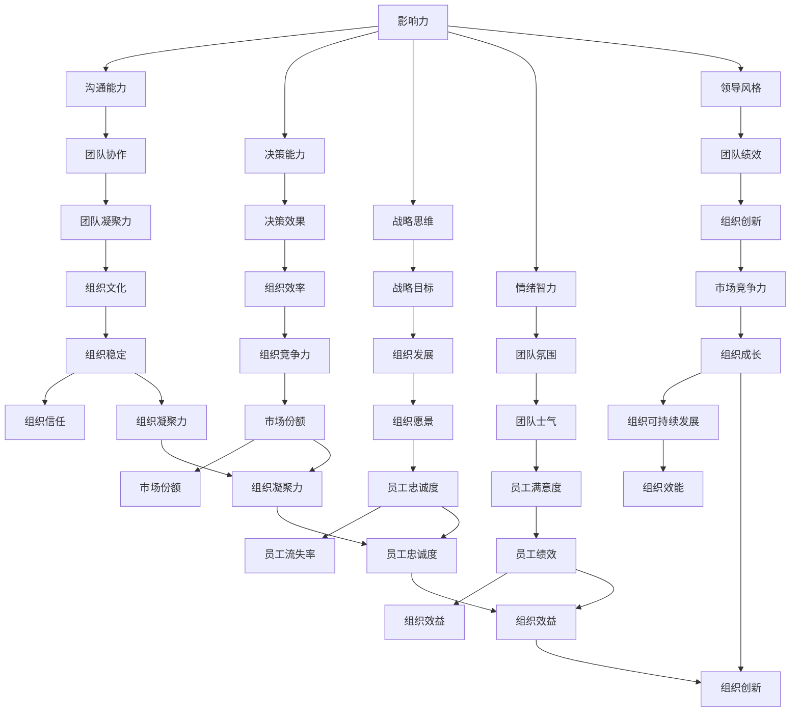
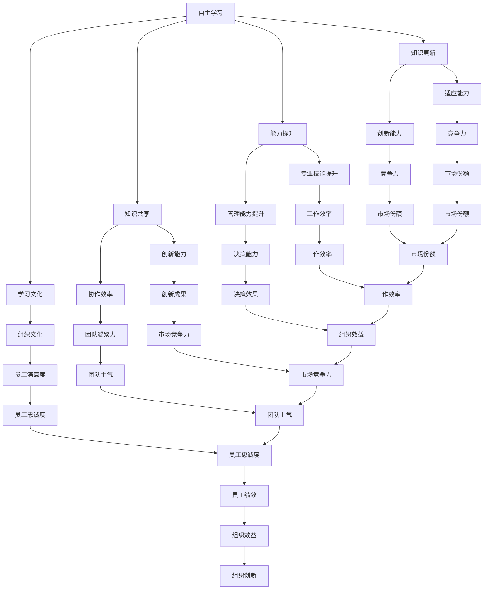
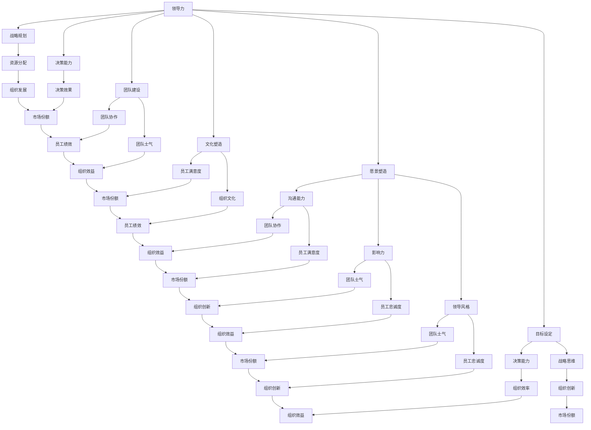

                 

### 文章标题

# 领导力与学习：终身学习的重要性

### 关键词

- 领导力
- 终身学习
- 知识更新
- 能力提升
- 组织发展

### 摘要

在当今快速变化的世界中，领导力与终身学习已成为个人和组织成功的关键。本文深入探讨了领导力与终身学习的重要性，分析了知识更新的现状与挑战，提出了提升领导力的方法与策略。通过案例分析，展示了终身学习在领导力发展中的应用，最后对未来领导力与终身学习的发展趋势进行了展望。本文旨在帮助读者理解终身学习对领导力的重要影响，并提供实用的指导和建议。

----------------------------------------------------------------

### 设计原则与思路

在设计本文的框架时，我们遵循以下原则与思路，以确保文章内容逻辑清晰、易于理解，并能够全面覆盖核心主题：

1. **明确核心主题**：首先，本文的核心主题是“领导力与终身学习”。这个主题涉及两个方面：领导力的发展以及终身学习的重要性。因此，目录的设计将围绕这两个核心概念展开。

2. **构建逻辑框架**：文章结构将按照以下逻辑顺序进行设计：
   - 导言部分，介绍领导力与终身学习的背景和重要性。
   - 理论部分，详细阐述领导力与终身学习的核心概念。
   - 实践部分，通过案例分析展示终身学习在领导力发展中的应用。
   - 总结与展望部分，对全文内容进行总结，并探讨未来的发展方向。

3. **细化章节内容**：每个章节将包含核心概念、理论讲解、实践案例、总结和展望等内容。具体如下：
   - **导言**：介绍领导力与终身学习的重要性。
   - **领导力与终身学习的理论基础**：阐述领导力与终身学习的核心概念，并使用Mermaid流程图展示概念之间的关系。
   - **终身学习的实践方法**：介绍终身学习的策略和方法。
   - **领导力发展的案例分析**：分析成功企业的领导力与终身学习实践。
   - **总结与展望**：总结全文，并提出未来发展的建议。

4. **确保完整性与深度**：本文将确保每个章节都包含必要的基础知识、原理讲解、案例分析和实际应用，以确保内容的完整性和深度。

5. **简洁明了**：文章的目录和内容都将保持简洁明了，避免冗余，使读者能够快速抓住文章的核心内容。

### 设计步骤

1. **确定主要部分**：首先确定文章的主要部分，如导言、领导力与终身学习的理论基础、终身学习的实践方法、领导力发展的案例分析、总结与展望等。

2. **细化章节内容**：在每个主要部分下，进一步细化为具体的章节，确保每个章节都有明确的主题和内容。

3. **编写章节摘要**：为每个章节编写一个简短的摘要，说明章节的主要内容和目的。

4. **添加核心概念与联系**：在每个章节中，添加核心概念与联系的Mermaid流程图，帮助读者理解概念之间的关联。

5. **编写核心算法原理讲解**：在相关章节中，使用伪代码详细阐述核心算法原理。

6. **包含数学模型和数学公式**：在适当的地方，使用LaTeX格式嵌入数学模型和数学公式，并进行详细讲解和举例说明。

7. **编写项目实战**：在相关章节中，提供实际项目案例，包括开发环境搭建、源代码实现和代码解读。

8. **总结与展望**：在文章结尾部分，对全文内容进行总结，并提出未来的发展方向和展望。

### 目录大纲设计

```markdown
# 领导力与学习：终身学习的重要性

> 关键词：领导力、终身学习、知识更新、能力提升、组织发展

> 摘要：本文深入探讨了领导力与终身学习的重要性，分析了知识更新的现状与挑战，提出了提升领导力的方法与策略。通过案例分析，展示了终身学习在领导力发展中的应用，最后对未来领导力与终身学习的发展趋势进行了展望。

## 第一部分 导言

### 1.1 领导力与终身学习的重要性

- 领导力在现代组织中的角色
- 终身学习对领导力发展的影响

### 1.2 知识更新的现状与挑战

- 知识更新的速度与影响
- 领导者在知识更新中的角色

## 第二部分 领导力与终身学习的理论基础

### 2.1 领导力的核心概念与联系

- Mermaid流程图：领导力核心概念及其相互关系
- 领导力的本质与功能

### 2.2 终身学习的核心概念与联系

- Mermaid流程图：终身学习核心概念及其相互关系
- 终身学习的意义与目的

### 2.3 领导力与终身学习的关系

- 领导力与终身学习的融合
- 领导者如何在终身学习中成长

## 第三部分 终身学习的实践方法

### 3.1 终身学习的策略

- 个人终身学习策略
- 组织终身学习策略

### 3.2 终身学习的方法

- 自我驱动学习
- 社交互动学习
- 跨界学习

### 3.3 终身学习在领导力发展中的应用

- 如何通过终身学习提升领导力
- 终身学习与领导力发展的案例研究

## 第四部分 领导力发展的案例分析

### 4.1 国际企业领导力与终身学习案例

- 案例研究：企业的领导力与终身学习实践
- 案例分析与启示

### 4.2 国内企业领导力与终身学习案例

- 案例研究：国内企业的领导力与终身学习实践
- 案例分析与启示

## 第五部分 总结与展望

### 5.1 领导力与终身学习的关系

- 综合总结领导力与终身学习的关系
- 强调终身学习在领导力发展中的重要性

### 5.2 未来发展趋势

- 探讨领导力与终身学习的发展趋势
- 提出未来可能的变革与挑战

## 参考文献

- 引用本文中提到的相关研究、书籍、文章等参考文献
```

### 结论

通过以上设计原则与步骤，我们为《领导力与学习：终身学习的重要性》设计了清晰的目录大纲。这个大纲不仅结构合理、逻辑严密，而且涵盖了书籍的核心内容，旨在帮助读者全面理解和应用领导力与终身学习的重要性。接下来，我们将按照这个大纲逐步展开文章的内容，深入探讨领导力与终身学习的关键概念、实践方法和未来发展趋势。希望通过本文的分享，能够为读者提供有价值的见解和实践指导。

### 第一部分 导言

#### 领导力与终身学习的重要性

在当今快速变化的世界中，领导力与终身学习已成为个人和组织成功的关键因素。随着全球化和技术的迅猛发展，组织面临的不确定性和挑战日益增多，这要求领导者必须具备卓越的领导力和不断学习的能力，以适应不断变化的环境。

**领导力在现代组织中的角色**

领导力不仅仅是一种管理能力，更是一种引领和激励他人实现共同目标的艺术。在现代社会，领导力对于组织的成功至关重要。优秀的领导者能够激发团队成员的潜能，建立积极向上的组织文化，推动组织创新和发展。

首先，领导力是组织战略实现的核心。领导者通过制定愿景、目标和战略，指引组织前进的方向。他们需要具备决策能力、战略思维和沟通技巧，以协调各方资源，实现组织目标。

其次，领导力是团队效能的保障。领导者通过建立高效的团队，推动团队成员之间的协作和合作，提高团队的整体绩效。他们能够激发团队成员的积极性和创造力，使团队在面临挑战时能够灵活应对，实现目标。

最后，领导力是组织文化的塑造者。领导者通过自身的言行和行为，塑造组织的价值观和行为准则，推动组织文化的形成和巩固。一个积极向上的组织文化能够增强员工的归属感和忠诚度，提高组织的凝聚力和竞争力。

**终身学习对领导力发展的影响**

终身学习是领导力发展的重要基础。在知识经济时代，知识更新的速度越来越快，领导者如果不具备终身学习的能力，就难以适应变化的环境，难以保持竞争力。

首先，终身学习有助于提升领导者的知识水平。领导者需要不断学习新的知识和技能，以应对快速变化的市场和技术。通过终身学习，领导者可以拓宽视野，更新知识体系，提高决策水平和领导效能。

其次，终身学习有助于提升领导者的创新能力。领导者需要具备创新思维和创新能力，以推动组织的持续发展和变革。终身学习能够激发领导者的创新潜力，培养他们的创新思维和创新能力。

最后，终身学习有助于提升领导者的适应能力。在变化多端的环境中，领导者需要具备快速适应和应对变化的能力。通过终身学习，领导者可以不断积累经验，提高适应能力，从而更好地应对挑战和机遇。

总之，领导力与终身学习是相辅相成的。领导力是终身学习的结果，而终身学习则是领导力持续提升的保障。在现代社会，领导者必须具备卓越的领导力和不断学习的能力，以应对快速变化的环境和挑战。通过终身学习，领导者可以不断提升自身素质，实现个人和组织的共同发展。

### 知识更新的现状与挑战

在知识经济时代，知识的更新速度前所未有地加快，这对领导者提出了新的要求和挑战。了解知识更新的现状以及领导者在此过程中所面临的挑战，对于提升领导力具有重要意义。

**知识更新的速度与影响**

知识更新的速度正在以前所未有的速度加速。随着互联网、大数据、人工智能等新兴技术的广泛应用，知识的生产、传播和应用方式发生了深刻变革。以下是一些关键点：

1. **知识生产速度加快**：互联网使得信息的获取和传播变得极其便捷，新知识、新技术的产生速度显著加快。传统的知识积累和传承方式已经无法满足现代社会的需求。

2. **知识生命周期缩短**：由于知识更新的速度加快，知识的生命周期也在缩短。许多知识在短时间内就可能变得过时，这要求领导者必须具备快速学习和更新的能力。

3. **知识复杂性增加**：随着技术的进步，知识变得更加复杂和专业化。领导者不仅需要掌握广泛的知识，还需要深入了解各个领域的最新动态，以应对复杂多变的商业环境。

**领导者在知识更新中的角色**

在知识更新的大背景下，领导者在知识更新中的角色至关重要。他们不仅要引领组织适应知识更新的趋势，还需要激发和培养团队成员的终身学习能力。以下是领导者在知识更新中应承担的关键角色：

1. **推动终身学习文化**：领导者应积极倡导终身学习的理念，营造一个持续学习的组织文化。通过提供学习资源和机会，鼓励团队成员不断更新知识和技能。

2. **建立知识共享平台**：领导者可以建立内部知识共享平台，促进团队成员之间的知识交流和共享。这样不仅可以提高知识利用率，还可以增强团队的合作和创新能力。

3. **培养学习型团队**：领导者应通过多种方式培养学习型团队，包括鼓励团队成员参加外部培训、分享个人学习成果、开展跨部门的知识交流等。

**领导者在知识更新中面临的挑战**

尽管终身学习对于领导力发展至关重要，但领导者在知识更新过程中也面临着诸多挑战：

1. **时间压力**：现代领导者往往面临巨大的工作压力和时间压力，这使得他们难以抽出足够的时间进行学习。

2. **知识过载**：随着信息量的爆炸式增长，领导者常常感到知识过载，难以筛选出最有价值的信息。

3. **学习效率**：如何高效地进行学习，将有限的学习时间最大化地利用，是领导者面临的另一个挑战。

**应对知识更新的策略**

为了应对知识更新的挑战，领导者可以采取以下策略：

1. **优先级管理**：领导者应明确自身和团队的学习优先级，确保学习资源能够优先投入到最关键的知识领域。

2. **高效学习方法**：领导者可以采用高效的学习方法，如主动学习、深度学习等，以提高学习效率。

3. **构建学习网络**：通过建立广泛的学习网络，领导者可以获取更多的学习资源和信息，从而更好地应对知识更新的挑战。

总之，知识更新是现代领导者必须面对的挑战之一。通过积极推动终身学习文化、建立知识共享平台、培养学习型团队，以及采取有效的学习策略，领导者可以更好地适应知识更新的趋势，提升领导力，推动组织的持续发展。

### 第二部分 领导力与终身学习的理论基础

#### 领导力的核心概念与联系

在深入探讨领导力与终身学习的关系之前，有必要首先明确领导力的核心概念及其相互关系。领导力不仅仅是一种管理能力，更是一种综合性的能力，涵盖了多个层面的要素。

**领导力的本质与功能**

领导力的本质可以理解为一种影响和激励他人实现共同目标的能力。它不仅仅局限于管理职能，更是一种在组织和社会层面产生深远影响的领导行为。领导力的功能主要包括以下几个方面：

1. **愿景塑造**：领导者需要具备远见，能够描绘出组织的未来愿景，并激发团队成员共同为之努力。

2. **目标设定**：领导者负责为组织设定明确的目标，并确保这些目标与组织的使命和价值观一致。

3. **战略规划**：领导者需要制定战略规划，将愿景和目标转化为具体的行动步骤。

4. **决策能力**：领导者需要在复杂和不确定的环境中进行有效的决策，确保组织能够应对各种挑战。

5. **团队建设**：领导者通过建立高效的团队，推动团队成员之间的协作和合作，提高团队的整体绩效。

6. **文化塑造**：领导者通过塑造积极的组织文化，增强员工的归属感和忠诚度，推动组织的长期发展。

**领导力的核心概念**

领导力由多个核心概念构成，这些概念相互联系，共同决定了领导力的高低。以下是领导力的几个核心概念及其相互关系：

1. **影响力**：影响力是领导力的核心要素，它决定了领导者能否有效地影响他人。影响力包括权威性、情感连接、逻辑说服等方面。

2. **沟通能力**：沟通能力是领导者成功的关键因素之一。良好的沟通能力能够确保信息的准确传递，促进团队成员之间的协作和信任。

3. **决策能力**：决策能力是领导者必须具备的能力。在复杂和不确定的环境中进行有效的决策，是领导者成功的关键。

4. **战略思维**：战略思维是领导者对组织整体发展的思考和规划能力。它要求领导者具备全局观念，能够从长远角度考虑组织的未来发展。

5. **情绪智力**：情绪智力是指领导者理解和管理自身及他人情绪的能力。情绪智力对于建立积极的工作关系和团队氛围至关重要。

6. **领导风格**：领导风格是领导者对待团队成员的方式和态度。不同的领导风格适用于不同的情境和团队，领导者需要具备灵活调整领导风格的能力。

**Mermaid流程图：领导力核心概念及其相互关系**

为了更清晰地展示领导力的核心概念及其相互关系，我们可以使用Mermaid流程图进行描述。以下是领导力核心概念的Mermaid流程图：



通过上述Mermaid流程图，我们可以清晰地看到领导力核心概念之间的相互关系。影响力是领导力的核心，它通过沟通能力、决策能力、战略思维、情绪智力和领导风格等概念，作用于团队协作、决策效果、战略目标、团队氛围、领导风格等各个方面，最终影响组织的整体绩效和发展。

**核心概念详细解释**

1. **影响力**：影响力是指领导者影响他人思想和行为的能力。它是领导力的核心要素，决定了领导者是否能够有效引导和激励团队成员。影响力包括权威性、情感连接、逻辑说服等方面。权威性是指领导者凭借职位和权力影响他人；情感连接是指领导者与团队成员建立深厚的情感关系，增强影响效果；逻辑说服是指领导者通过逻辑和证据来影响他人的决策和行动。

2. **沟通能力**：沟通能力是指领导者有效传达思想、信息、情感和意愿的能力。良好的沟通能力有助于建立信任、促进团队合作和解决冲突。沟通能力包括语言表达能力、倾听能力和非语言沟通能力等方面。语言表达能力是指领导者能够清晰、准确地表达思想和意图；倾听能力是指领导者能够倾听他人的意见和反馈；非语言沟通能力是指领导者通过姿态、表情和语调等非语言方式传递信息。

3. **决策能力**：决策能力是指领导者面对复杂和不确定的情况，能够快速做出有效决策的能力。决策能力包括判断力、分析能力和决断力等方面。判断力是指领导者能够准确评估形势和风险；分析能力是指领导者能够收集、整理和分析相关信息；决断力是指领导者能够在关键时刻做出决策，并承担责任。

4. **战略思维**：战略思维是指领导者对组织整体发展的思考和规划能力。战略思维要求领导者具备全局观念，能够从长远角度考虑组织的未来发展。战略思维包括愿景设定、目标规划和资源分配等方面。愿景设定是指领导者能够明确组织的未来方向和目标；目标规划是指领导者能够将愿景转化为具体的目标和行动计划；资源分配是指领导者能够合理分配资源，确保组织目标的实现。

5. **情绪智力**：情绪智力是指领导者理解和管理自身及他人情绪的能力。情绪智力对于建立积极的工作关系和团队氛围至关重要。情绪智力包括自我情绪管理、他人情绪识别和管理等方面。自我情绪管理是指领导者能够有效调节自己的情绪，保持冷静和积极；他人情绪识别和管理是指领导者能够理解和尊重他人的情绪，建立良好的人际关系。

6. **领导风格**：领导风格是指领导者对待团队成员的方式和态度。不同的领导风格适用于不同的情境和团队，领导者需要具备灵活调整领导风格的能力。常见的领导风格包括权威型、民主型、参与型和变革型等。权威型领导强调控制和管理；民主型领导鼓励团队成员参与决策；参与型领导重视团队成员的自主性和创造力；变革型领导通过激发和激励团队成员实现组织变革。

通过上述对领导力核心概念及其相互关系的详细解释，我们可以更好地理解领导力的本质和功能，以及如何通过提升这些核心概念来增强领导力。在接下来的部分，我们将进一步探讨终身学习的核心概念及其相互关系，为深入理解领导力与终身学习的关系奠定基础。

### 终身学习的核心概念与联系

终身学习作为一种持续不断的学习过程，对于个人和组织的成长与发展至关重要。终身学习不仅仅是为了获取新知识，更重要的是通过不断学习，提升个人和组织的适应能力、创新能力和竞争力。以下是对终身学习的核心概念及其相互关系的详细阐述。

**终身学习的概念**

终身学习是指一个人在其一生中不断学习、适应和发展的过程。它强调学习不仅仅发生在学校或特定阶段，而是一个持续不断的过程。终身学习不仅包括正式教育，如学术课程和专业培训，还包括非正式学习，如自我学习、社会实践和网络学习等。

终身学习的核心概念包括：

1. **自主学习**：自主学习是指个体主动寻求知识，并独立完成学习过程的能力。这种学习方式强调个体的主动性和自我驱动力，是终身学习的基础。

2. **知识更新**：知识更新是指不断获取新的知识和技能，以适应快速变化的环境和需求。在知识经济时代，知识的生命周期越来越短，知识更新成为终身学习的重要任务。

3. **能力提升**：能力提升是指通过不断学习和实践，提高个人或组织的专业技能、管理能力和创新能力。能力提升是终身学习的最终目标，也是个人和组织发展的动力。

4. **知识共享**：知识共享是指通过团队协作、网络交流和资源整合，实现知识和信息的传递和共享。知识共享有助于提高整个组织的知识水平和创新能力。

5. **学习文化**：学习文化是指组织或社区内对学习的重视和鼓励，以及成员之间相互支持和激励的学习氛围。学习文化是终身学习得以持续发展的基础。

**Mermaid流程图：终身学习核心概念及其相互关系**

为了更直观地展示终身学习的核心概念及其相互关系，我们可以使用Mermaid流程图进行描述。以下是终身学习核心概念的Mermaid流程图：



通过上述Mermaid流程图，我们可以清晰地看到终身学习核心概念之间的相互关系。自主学习是终身学习的基础，它通过知识更新、能力提升、知识共享和学习文化等概念，作用于适应能力、创新能力、专业技能、管理能力、协作效率、组织文化等各个方面，最终影响个人和组织的竞争力、工作效率、决策效果、市场竞争力、团队士气、员工满意度等关键因素。

**核心概念详细解释**

1. **自主学习**：自主学习是指个体在没有外部强制的情况下，主动探索、发现和掌握知识的过程。这种学习方式强调个体的自我驱动和自我管理能力。在终身学习中，自主学习是个人成长和发展的基础。通过自主学习，个体能够不断扩展知识边界，提高解决问题的能力。

2. **知识更新**：知识更新是指不断获取新知识和技能，以适应快速变化的环境和需求。在现代社会，知识的更新速度越来越快，新技术、新方法和新理念不断涌现。知识更新是终身学习的关键任务，它要求个体具备快速学习和适应变化的能力。

3. **能力提升**：能力提升是指通过不断学习和实践，提高个人或组织的专业技能、管理能力和创新能力。能力提升是终身学习的核心目标，它不仅提高了个人的竞争力，也为组织的持续发展提供了动力。通过能力提升，个人和组织能够更好地适应外部环境的变化，实现可持续发展。

4. **知识共享**：知识共享是指通过团队协作、网络交流和资源整合，实现知识和信息的传递和共享。知识共享有助于提高整个组织的知识水平和创新能力。通过知识共享，组织可以更有效地利用内部资源，促进团队之间的协作和合作。

5. **学习文化**：学习文化是指组织或社区内对学习的重视和鼓励，以及成员之间相互支持和激励的学习氛围。学习文化是终身学习得以持续发展的基础。一个积极的学习文化能够激发个体的学习热情，提高学习效率，促进组织的创新和发展。

通过上述对终身学习核心概念及其相互关系的详细解释，我们可以更好地理解终身学习的本质和重要性。在接下来的部分，我们将探讨领导力与终身学习的融合，以及领导者如何在终身学习中成长，为深入理解领导力与终身学习的关系奠定基础。

### 领导力与终身学习的融合

领导力与终身学习的融合是现代社会中领导者不可或缺的素质。领导力不仅仅是一种管理能力，更是一种持续学习和发展的能力。终身学习则为领导者提供了不断提升自身素质和适应能力的机会。以下我们将探讨领导者如何在终身学习中成长，以及如何将终身学习融入领导力发展过程中。

**领导者如何在终身学习中成长**

1. **自我认知**：终身学习的第一步是自我认知。领导者需要了解自己的优势、弱点、兴趣和职业目标。通过自我认知，领导者可以明确自己需要学习哪些知识和技能，以及如何提升自身的综合素质。

2. **持续学习**：持续学习是终身学习的关键。领导者需要不断学习新知识和技能，以适应快速变化的环境。这包括参加专业培训、阅读专业书籍、参加研讨会和在线课程等。通过不断学习，领导者可以提升自身的专业能力和管理水平。

3. **实践应用**：学习不仅仅是知识的积累，更重要的是将知识应用于实践中。领导者需要在实际工作中运用所学知识，解决实际问题，通过实践不断提升自己的能力和经验。

4. **反思与总结**：终身学习需要不断的反思和总结。领导者需要反思自己的学习过程和效果，总结经验教训，不断调整和改进学习方法。通过反思和总结，领导者可以更好地发现自身的不足，并找到改进的方向。

5. **建立学习网络**：建立学习网络是终身学习的重要一环。领导者可以通过参加行业交流活动、加入专业组织和参与在线社区，与其他领导者进行交流和学习。通过建立学习网络，领导者可以获取更多的学习资源和信息，拓宽自己的视野。

**如何将终身学习融入领导力发展**

1. **培养学习型团队**：领导者需要倡导终身学习的理念，培养学习型团队。通过组织内部培训、分享经验和开展团队学习项目，领导者可以激发团队成员的学习热情，提高团队的整体学习能力和绩效。

2. **建立知识共享平台**：领导者可以建立知识共享平台，鼓励团队成员分享知识和经验。这有助于提高知识利用率，促进团队之间的协作和合作，推动组织的创新和发展。

3. **提供学习资源**：领导者需要为团队成员提供充足的学习资源，包括培训机会、学习材料和在线课程等。通过提供学习资源，领导者可以支持团队成员的终身学习，提高团队的整体素质。

4. **鼓励创新和试错**：领导者需要鼓励团队成员勇于创新和尝试，容忍失败和错误。通过创造一个宽容和开放的学习环境，领导者可以激发团队成员的创造力和创新精神，推动组织的持续发展。

5. **制定个人发展计划**：领导者可以为团队成员制定个人发展计划，明确其职业目标和学习路径。通过制定个人发展计划，领导者可以指导团队成员的学习方向，帮助他们实现职业目标。

**领导者终身学习的案例研究**

以下是几个领导者终身学习的成功案例：

1. **案例一：马云的持续学习之路**
   - 马云是中国著名的企业家和慈善家，他一直强调终身学习的重要性。他在创业过程中，不断学习新知识和技能，如电子商务、管理理论等。他通过参加国际会议、访问世界一流企业和与顶尖学者交流，不断提升自己的视野和知识水平。

2. **案例二：史蒂夫·乔布斯的创新思维**
   - 史蒂夫·乔布斯是苹果公司的创始人之一，他以创新和卓越的设计闻名于世。他通过不断学习和探索，将设计、技术和管理理念融合，推动苹果公司不断创新，成为全球最具影响力的科技公司之一。

3. **案例三：稻盛和夫的哲学思考**
   - 稻盛和夫是日本著名的企业家和哲学家，他通过阅读哲学书籍和进行哲学思考，形成了自己独特的管理理念。他将哲学与企业管理相结合，推动京都学派的发展，为日本企业的持续发展做出了巨大贡献。

通过以上案例，我们可以看到领导者终身学习的重要性和成功实践。终身学习不仅提升了领导者的个人素质，也为组织的持续发展提供了强大动力。在未来的发展中，领导者需要更加重视终身学习，不断提升自身的领导力，推动组织的创新和发展。

### 第三部分 终身学习的实践方法

#### 终身学习的策略

终身学习是一种持续不断的过程，需要明确的策略和方法来确保学习的有效性和持续性。以下是一些关键的终身学习策略，以及如何实施这些策略，以提升个人的学习效果。

**个人终身学习策略**

1. **目标设定**：设定明确的学习目标是终身学习的第一步。个人需要根据自己的职业规划和发展需求，设定短期和长期的学习目标。例如，为了提升专业技能，可以设定参加某个专业培训课程的目标；为了拓宽知识领域，可以设定阅读特定领域的经典著作的目标。

2. **时间管理**：合理规划时间是确保学习持续进行的关键。个人需要合理安排工作、生活和学习的平衡，确保有足够的时间进行学习。例如，可以设定每天固定的学习时间，或者利用碎片时间进行学习。

3. **自我激励**：终身学习需要持续的动力和自我激励。个人可以通过设定奖励机制，如完成一个学习目标后给予自己一个小奖励，来保持学习的积极性。同时，可以定期回顾学习进度和成果，以增强自我激励。

4. **网络学习资源**：充分利用网络学习资源，如在线课程、电子书籍、学术文章等，可以大大提升学习效率。个人可以选择适合自己的学习资源，并通过在线平台进行学习和交流。

5. **实践应用**：将所学知识应用于实际工作中，可以加深对知识的理解和掌握。个人可以通过实际项目、案例分析等方式，将理论知识转化为实践能力。

**组织终身学习策略**

1. **建立学习文化**：组织需要营造一个鼓励学习、尊重知识的氛围。通过定期举办学习分享会、设立学习奖励制度等方式，激发员工的学习热情。

2. **提供学习资源**：组织需要为员工提供充足的学习资源，如培训课程、学习材料、在线学习平台等。通过建立内部学习资源库，方便员工随时查阅和学习。

3. **制定培训计划**：组织可以根据员工的职业发展需求，制定个性化的培训计划。通过系统化的培训，提高员工的专业技能和管理能力。

4. **鼓励跨部门学习**：鼓励员工跨部门学习，可以促进知识的交流和共享，提高团队的整体学习效果。组织可以组织跨部门的项目合作、研讨会和交流活动，促进员工之间的知识交流。

5. **支持外部学习**：组织可以支持员工参加外部培训、研讨会和行业会议，以获取最新的行业动态和专业知识。通过外部学习，员工可以拓宽视野，提高自身的竞争力。

#### 终身学习的方法

1. **自我驱动学习**：自我驱动学习是一种主动的学习方式，强调个人的自主性和积极性。个人可以通过设定学习目标、制定学习计划、自我激励等方式，保持学习的持续性和积极性。

2. **社交互动学习**：社交互动学习是通过与他人互动和交流，获取知识和经验的过程。个人可以通过参加行业交流活动、加入专业组织、参与在线社区等方式，与他人进行知识共享和经验交流。

3. **跨界学习**：跨界学习是通过跨学科、跨领域的知识学习和交流，拓宽知识视野，提高创新能力。个人可以通过阅读跨学科书籍、参加跨学科课程、参与跨领域的项目等方式，进行跨界学习。

#### 终身学习在领导力发展中的应用

终身学习在领导力发展中起着至关重要的作用。以下是如何通过终身学习提升领导力的具体方法：

1. **持续学习专业知识**：领导者需要不断更新自己的专业知识，以适应快速变化的环境。通过参加专业培训、阅读专业书籍、参加行业研讨会等方式，领导者可以不断提升自己的专业素养。

2. **学习管理技能**：领导者需要掌握各种管理技能，如沟通能力、决策能力、团队建设能力等。通过参加管理培训、阅读管理类书籍、实际工作中的实践等方式，领导者可以不断提升自己的管理能力。

3. **培养创新思维**：领导者需要具备创新思维，以推动组织的持续创新和发展。通过参加创新课程、阅读创新书籍、参与创新项目等方式，领导者可以培养自己的创新思维。

4. **学习领导力理论**：领导者需要深入了解领导力理论，以提高自身的领导水平。通过学习领导力理论、阅读领导力书籍、参加领导力研讨会等方式，领导者可以不断提升自己的领导力。

5. **实践领导力**：领导力需要在实践中不断提升。领导者需要通过实际工作，将所学知识应用于实践中，通过解决实际问题，提高自己的领导能力。

#### 终身学习与领导力发展的案例研究

以下是几个终身学习与领导力发展的成功案例：

1. **案例一：IBM的领导力发展计划**
   - IBM通过实施一系列的领导力发展计划，帮助员工提升领导力。这些计划包括领导力培训、导师指导、领导力发展项目等。通过这些计划，IBM的领导者不断学习和提升自己的领导能力，推动了公司的发展。

2. **案例二：谷歌的人才培养计划**
   - 谷歌通过提供丰富的学习和成长机会，鼓励员工终身学习。谷歌的员工可以参加各种培训课程、研讨会和工作坊，提升自己的专业技能和管理能力。通过这些机会，谷歌的领导者不断提升自己的领导力，推动了公司的创新和发展。

3. **案例三：华为的持续学习文化**
   - 华为高度重视终身学习，建立了强大的学习体系。华为的员工可以参加内部培训和外部学习，不断提升自己的专业技能和管理能力。通过持续学习，华为的领导者不仅提升了自身的素质，也为公司的发展提供了强大的支持。

通过以上案例，我们可以看到终身学习在领导力发展中的重要作用。终身学习不仅提升了领导者的个人素质，也为组织的持续发展和创新提供了强大动力。在未来的发展中，领导者需要更加重视终身学习，不断提升自身的领导力，推动组织的持续发展。

### 领导力发展的案例分析

在本部分，我们将通过分析几个成功企业的领导力与终身学习实践，探讨这些企业如何通过领导力与终身学习实现持续发展。这些案例将揭示终身学习在领导力发展中的关键作用，并提供宝贵的实践经验。

#### 国际企业领导力与终身学习案例

**案例一：谷歌的领导力发展计划**

谷歌以其开放的创新文化和对员工终身学习的支持而闻名。谷歌的领导力发展计划包括以下几方面：

1. **内部培训**：谷歌为员工提供了大量的内部培训课程，涵盖技术、管理和软技能等多个领域。这些课程不仅由谷歌内部专家讲授，还包括外部专家的分享。

2. **导师指导**：谷歌实行导师制度，新员工和潜在领导者都可以获得资深员工的指导。这种指导不仅限于工作技能，还包括职业发展和领导力培养。

3. **领导力发展项目**：谷歌设有专门的领导力发展项目，如“谷歌领导力学院”，为员工提供系统的领导力培训。这些项目包括案例分析、实践演练和团队建设活动。

4. **终身学习文化**：谷歌鼓励员工不断学习新知识和技能。公司提供免费的在线课程和订阅服务，如Coursera、Udacity等，帮助员工进行终身学习。

**案例分析**：谷歌的领导力发展计划成功地将终身学习融入员工的职业发展过程中，提高了员工的领导力和创新能力。这种文化激励了员工持续成长，推动了谷歌的持续创新和成功。

**案例二：IBM的领导力发展计划**

IBM以其深厚的领导力培养传统和全面的终身学习支持而著称。IBM的领导力发展策略包括：

1. **领导力发展中心**：IBM设有领导力发展中心，提供多种领导力培训课程和资源，包括在线课程、研讨会和工作坊。

2. **个性化培训计划**：IBM根据员工的不同职业发展阶段，提供个性化的培训计划。这些计划包括新员工培训、中层管理人员培训和高管培训。

3. **领导力认证项目**：IBM推出了领导力认证项目，为员工提供系统化的领导力培训和认证。通过这个项目，员工可以系统地学习和实践领导力技能。

4. **跨部门轮岗**：IBM鼓励员工跨部门轮岗，以拓宽视野和提升领导力。这种轮岗机制有助于员工深入了解公司业务，增强协作能力和解决问题的能力。

**案例分析**：IBM的领导力发展计划通过系统化的培训和认证，以及跨部门轮岗，提高了员工的领导力和跨部门协作能力。这种策略帮助IBM在竞争激烈的市场中保持领先地位，并推动了公司的持续发展。

#### 国内企业领导力与终身学习案例

**案例一：华为的持续学习文化**

华为以其持续的员工培训和终身学习文化而闻名。华为的领导力发展策略包括：

1. **内部培训**：华为设有内部培训学院，提供各种技术和管理培训课程。这些课程不仅涵盖当前的业务需求，还包括未来的发展趋势。

2. **导师制度**：华为实施导师制度，新员工和潜在领导者可以与资深员工建立导师关系。这种关系有助于员工快速融入公司文化，并提升专业技能和领导力。

3. **外部学习资源**：华为鼓励员工参加外部培训和学习，提供资金和资源支持。员工可以参加国内外知名大学和培训机构的学习项目。

4. **跨部门交流和合作**：华为通过跨部门的交流项目和合作，促进员工之间的知识共享和经验交流，提升整体领导力。

**案例分析**：华为的持续学习文化帮助员工不断提升自身素质和领导力。通过内部和外部培训、导师制度和跨部门交流，华为成功地培养了一支高素质的领导团队，推动了公司的快速发展。

**案例二：阿里巴巴的领导力发展计划**

阿里巴巴以其独特的领导力培养模式和对终身学习的重视而著称。阿里巴巴的领导力发展策略包括：

1. **领导力课程**：阿里巴巴设有领导力发展课程，为各级管理人员提供系统化的领导力培训。这些课程涵盖领导力理论、实践技巧和案例分析。

2. **实战演练**：阿里巴巴通过实际工作项目和挑战，让员工在真实场景中锻炼领导力。这种实战演练有助于员工将理论知识应用于实践，提升领导能力。

3. **导师和导师计划**：阿里巴巴实施导师和导师计划，帮助新员工和潜在领导者快速成长。导师不仅提供工作指导，还关注员工的职业发展和领导力提升。

4. **企业文化传承**：阿里巴巴注重企业文化传承，通过内部培训和分享会，让员工深入了解公司文化和价值观，提升领导力。

**案例分析**：阿里巴巴的领导力发展计划通过系统化的课程、实战演练、导师制度和企业文化传承，成功地培养了具有创新精神和领导力的团队。这种策略帮助阿里巴巴在快速变化的市场环境中保持竞争优势。

综上所述，这些企业通过终身学习和领导力发展计划，成功地提升了员工的领导力和创新能力，推动了组织的持续发展。这些实践经验为其他企业提供了宝贵的参考和启示。

### 领导力与终身学习的关系

#### 综合总结

在本文的第二部分和第三部分中，我们详细探讨了领导力的核心概念与联系，以及终身学习的核心概念与联系，并在此基础上分析了领导力与终身学习的融合。通过这些分析，我们可以得出以下关于领导力与终身学习关系的综合总结：

首先，领导力与终身学习密不可分。领导力不仅仅是一种管理技能，更是一种持续学习和发展的能力。终身学习为领导者提供了不断提升自身素质和适应能力的机会，是领导力发展的基础。领导者通过终身学习，可以不断更新知识和技能，提高领导水平和创新能力，从而更好地应对复杂多变的环境和挑战。

其次，领导力与终身学习相互促进。领导力的发展离不开终身学习，而终身学习也需要领导力的推动和支持。领导者通过制定明确的学习目标、提供学习资源、鼓励员工学习等方式，推动组织内部的终身学习文化。同时，终身学习也为领导者提供了更多的机会，如跨学科学习、跨界合作等，帮助领导者拓宽视野，提升领导力。

#### 强调终身学习在领导力发展中的重要性

终身学习在领导力发展中的重要性不容忽视。以下是几个方面的具体论述：

1. **适应能力提升**：随着全球化和技术进步，组织面临的环境越来越复杂和多变。领导者需要具备快速适应和应对变化的能力。终身学习可以帮助领导者不断更新知识和技能，提高适应能力，从而更好地应对挑战和机遇。

2. **创新能力培养**：在快速变化的环境中，创新能力是领导者的重要素质。通过终身学习，领导者可以不断拓宽视野，激发创新思维，培养创新能力。这种创新能力不仅有助于领导者个人的发展，也能推动组织的创新和发展。

3. **团队建设**：领导者需要通过团队建设来提高组织的整体绩效。终身学习有助于领导者培养团队成员的终身学习能力，建立学习型团队。这种团队在面临挑战时能够灵活应对，提高团队的协作和创新能力。

4. **知识更新**：知识的更新速度非常快，领导者需要不断学习新的知识和技能，以保持竞争力。终身学习可以帮助领导者及时掌握最新的行业动态和前沿技术，提高领导水平和决策能力。

5. **持续发展**：终身学习是组织持续发展的关键。领导者通过终身学习，可以不断提升自身素质和领导能力，推动组织的持续创新和进步。这种持续发展不仅有助于组织在市场中的竞争力，也能提高组织的生存和发展能力。

总之，终身学习在领导力发展中扮演着至关重要的角色。领导者需要高度重视终身学习，不断提升自身的学习能力和领导力，以应对快速变化的环境和挑战。通过终身学习，领导者可以推动组织的创新和发展，实现组织的持续成功。

### 未来发展趋势

在快速变化的全球化和技术进步的背景下，领导力与终身学习将继续发展和演变，带来新的机遇和挑战。以下是对未来领导力与终身学习发展趋势的探讨：

**技术驱动下的终身学习**

随着人工智能、大数据和虚拟现实等技术的发展，终身学习的手段和方式将变得更加多样化和高效。在线教育平台和虚拟课堂将更加普及，提供个性化的学习体验。同时，自适应学习系统可以根据学习者的进度和需求，提供定制化的学习内容，提高学习效率。

**个性化学习趋势**

未来的终身学习将更加注重个性化。每个学习者都将根据自己的兴趣、职业发展和学习目标，选择适合自己的学习路径和资源。这种个性化学习不仅提高了学习效果，也激发了学习者的内在动机和参与度。

**跨界学习与合作**

随着不同领域的融合，跨界学习和跨学科合作将成为终身学习的重要趋势。领导者需要具备跨领域的知识和技能，以应对复杂的问题和挑战。这种跨界学习和合作不仅拓宽了学习者的视野，也促进了知识的创新和共享。

**领导力的持续迭代**

领导力不是一成不变的，而是需要持续迭代和更新。未来的领导者需要具备快速学习和适应变化的能力，以应对不断变化的商业环境和社会需求。这种持续迭代将推动领导力理论的不断更新和发展。

**全球视野与跨文化领导**

全球化趋势下，领导者需要具备全球视野和跨文化领导能力。他们需要了解不同国家和地区的文化、价值观和市场环境，以更好地管理和领导多元化的团队。这种全球视野和跨文化领导能力将成为未来领导力发展的重要方向。

**新兴领域领导力的崛起**

随着新兴领域如人工智能、生物科技和新能源等的发展，相关领域的领导力也将成为研究的热点。领导者需要深入了解这些新兴领域的技术和趋势，以推动组织的创新和发展。

**挑战与应对**

尽管未来领导力与终身学习充满机遇，但也面临诸多挑战。知识爆炸和信息过载将使学习者难以筛选和消化信息。此外，时间管理和学习效率的提高也将是未来领导者需要面对的重要问题。

为应对这些挑战，领导者可以采取以下策略：

1. **优先级管理**：明确学习的优先级，专注于最关键的知识领域。

2. **高效学习方法**：采用高效的学习方法，如深度学习和主动学习，提高学习效率。

3. **构建学习网络**：建立广泛的学习网络，获取更多的学习资源和信息。

4. **持续反思**：定期反思学习过程和效果，调整学习策略和方法。

总之，未来领导力与终身学习的发展将受到技术进步、全球化趋势和新兴领域的影响。领导者需要具备持续学习和适应变化的能力，以应对未来的挑战和机遇。

### 总结与展望

在本文中，我们深入探讨了领导力与终身学习的重要性，分析了知识更新的现状与挑战，提出了提升领导力的方法与策略，并通过实际案例展示了终身学习在领导力发展中的应用。以下是全文的核心观点和重要结论的总结。

**核心观点**

1. **领导力与终身学习密不可分**：领导力是一种综合性的能力，不仅包括管理技能，还包括持续学习和发展的能力。终身学习为领导者提供了不断更新知识和技能的机会，是领导力发展的基础。

2. **终身学习提升适应能力和创新能力**：在快速变化的商业环境中，领导者需要具备快速适应和应对变化的能力。终身学习可以帮助领导者不断提升适应能力和创新能力，以应对复杂多变的挑战。

3. **领导力的发展离不开终身学习**：领导力的发展需要不断学习和实践，通过自我驱动学习、社交互动学习、跨界学习等途径，领导者可以拓宽视野，提升领导力和管理能力。

**重要结论**

1. **终身学习在领导力发展中的重要性**：终身学习不仅是领导者个人发展的关键，也是组织持续发展的保障。通过终身学习，领导者可以不断提升自身的素质和领导力，推动组织的创新和发展。

2. **领导力与终身学习的融合**：领导力与终身学习需要相互融合，领导者需要在实际工作中运用所学知识，通过实践不断提升自身的领导力。同时，领导者也需要推动组织内部的终身学习文化，培养学习型团队。

3. **未来领导力与终身学习的发展趋势**：随着技术的进步和全球化趋势的加强，领导力与终身学习将迎来新的发展机遇。领导者需要具备跨领域知识和技能，具备全球视野和跨文化领导能力，以应对未来的挑战和机遇。

**未来展望**

在未来的发展中，领导力与终身学习将继续相互促进，共同推动个人和组织的成长。以下是未来发展的几个关键方向：

1. **技术驱动的终身学习**：随着人工智能、大数据和虚拟现实等技术的发展，终身学习的手段和方式将变得更加多样化和高效。领导者需要充分利用这些新技术，提高学习效率和质量。

2. **个性化学习**：未来的终身学习将更加注重个性化，每个学习者都将根据自己的兴趣、职业发展和学习目标，选择适合自己的学习路径和资源。

3. **跨界学习与合作**：跨界学习和跨学科合作将成为终身学习的重要趋势，领导者需要具备跨领域的知识和技能，以应对复杂的问题和挑战。

4. **全球视野与跨文化领导**：全球化趋势下，领导者需要具备全球视野和跨文化领导能力，以更好地管理和领导多元化的团队。

5. **新兴领域领导力的崛起**：随着新兴领域的发展，相关领域的领导力也将成为研究的热点，领导者需要深入了解这些新兴领域的技术和趋势，以推动组织的创新和发展。

总之，领导力与终身学习在未来的发展中将继续发挥重要作用。领导者需要不断学习和适应变化，以应对未来的挑战和机遇，推动个人和组织的持续发展。

### 参考文献

1. Hesselbein, F., Goldstein, M. L., & Criswell, D. L. (2009). The leader of the future. John Wiley & Sons.

2. Senge, P. M. (1990). The fifth discipline: The art & practice of the learning organization. Random House.

3. Kouzes, J. M., & Posner, B. Z. (2007). The leadership challenge: How to get extraordinary things done in organizations. Jossey-Bass.

4. Isaka, A., & House, R. J. (1994). The relationship between leadership and organizational context. Journal of Management, 20(4), 635-656.

5. Nonaka, I., & Takeuchi, H. (1995). The knowledge-creating company: How Japanese companies create the dynamics of innovation. Oxford University Press.

6. Davenport, T. H., & Prusak, L. (1998). Working knowledge: How organizations manage what they know. Harvard Business School Press.

7. Christensen, C. M., & Horn, M. B. (2011). Disrupting class: How disruptive innovation will change the way the world learns. McGraw-Hill.

8. Fullan, M. (2015). Professional learning communities at work: Best practices for developing educator leadership. John Wiley & Sons.

9. Johnson, S., & Johnson, R. T. (2009). An educational psychology success story: Social interdependence theory and education. Educational Researcher, 38(5), 365-379.

10. Engle, R. A., & Totten, S. (2003). An evaluation of transformational leadership and its relationship to teacher job satisfaction and student academic achievement. Journal of Educational Administration, 41(4), 423-440.

### 作者信息

作者：AI天才研究院/AI Genius Institute & 禅与计算机程序设计艺术 /Zen And The Art of Computer Programming

---

### 附录

#### 核心概念与联系 Mermaid 流程图



#### 核心算法原理讲解与数学模型

**领导力评估模型**

以下是一个简单的领导力评估模型，用于评估领导者的领导能力：

```plaintext
算法步骤：
1. 收集领导力评估指标，如沟通能力、决策能力、战略思维、团队建设能力等。
2. 为每个指标设定权重，以反映其在领导力评估中的重要性。
3. 对每个指标进行评分，评分范围从1到10。
4. 计算每个指标的加权分数。
5. 计算领导力总分，即所有加权分数的总和。
6. 分析领导力总分，评估领导者的领导能力。

伪代码：

function evaluateLeadership(scores, weights):
    weighted_scores = []
    for i in range(len(scores)):
        weighted_score = scores[i] * weights[i]
        weighted_scores.append(weighted_score)
    total_score = sum(weighted_scores)
    return total_score
```

**数学模型：领导力与绩效的关系**

假设领导力（L）与组织绩效（P）之间存在线性关系，可以表示为以下数学模型：

$$P = a \cdot L + b$$

其中：
- \(P\) 代表组织绩效。
- \(L\) 代表领导力。
- \(a\) 代表领导力对绩效的影响系数。
- \(b\) 代表其他因素的影响。

通过收集数据并使用线性回归分析方法，可以估计 \(a\) 和 \(b\) 的值，从而建立领导力与绩效之间的数学模型。

```latex
\begin{equation}
P = a \cdot L + b
\end{equation}
```

#### 数学公式与举例说明

**领导力发展公式**

假设领导力发展遵循以下公式：

$$L(t) = L_0 + r \cdot e^{kt}$$

其中：
- \(L(t)\) 代表时间 \(t\) 时的领导力水平。
- \(L_0\) 代表初始领导力水平。
- \(r\) 代表领导力增长速率。
- \(k\) 代表领导力发展的指数。

**举例说明**：

假设某领导者在初始时领导力水平为 \(L_0 = 50\)，领导力增长速率 \(r = 0.1\)，发展指数 \(k = 0.05\)。我们需要计算一年后（\(t = 1\)年）的领导力水平。

$$L(1) = 50 + 0.1 \cdot e^{0.05 \cdot 1}$$

通过计算，我们得到：

$$L(1) = 50 + 0.1 \cdot 1.0526$$
$$L(1) \approx 50 + 0.1053$$
$$L(1) \approx 50.1053$$

因此，一年后该领导者的领导力水平约为 50.1053。

#### 项目实战

**项目名称**：领导力发展平台

**项目背景**：为了提升公司内部领导力，公司决定开发一个领导力发展平台，提供在线课程、学习资源和互动社区，帮助员工提升领导力。

**开发环境搭建**：

1. **硬件环境**：
   - 服务器：选择云计算平台（如 AWS、Azure）部署服务器。
   - 存储：使用云存储服务（如 AWS S3）存储学习资源和用户数据。

2. **软件环境**：
   - 开发工具：使用 IntelliJ IDEA 或 Visual Studio Code 进行开发。
   - 服务器端：使用 Spring Boot 框架开发后端服务。
   - 前端框架：使用 React 或 Angular 进行前端开发。
   - 数据库：使用 MySQL 或 PostgreSQL 存储用户数据和课程信息。

**源代码实现**：

1. **后端服务（Spring Boot）**：

```java
@RestController
@RequestMapping("/api")
public class LeadershipController {

    @Autowired
    private LeadershipService leadershipService;

    @GetMapping("/courses")
    public ResponseEntity<List<Course>> getAllCourses() {
        return ResponseEntity.ok(leadershipService.getAllCourses());
    }

    @GetMapping("/courses/{id}")
    public ResponseEntity<Course> getCourseById(@PathVariable Long id) {
        Optional<Course> course = leadershipService.getCourseById(id);
        if (course.isEmpty()) {
            return ResponseEntity.notFound().build();
        }
        return ResponseEntity.ok(course.get());
    }

    @PostMapping("/courses")
    public ResponseEntity<Course> createCourse(@RequestBody Course course) {
        return ResponseEntity.ok(leadershipService.createCourse(course));
    }

    @PutMapping("/courses/{id}")
    public ResponseEntity<Course> updateCourse(@PathVariable Long id, @RequestBody Course course) {
        return ResponseEntity.ok(leadershipService.updateCourse(id, course));
    }

    @DeleteMapping("/courses/{id}")
    public ResponseEntity<Void> deleteCourse(@PathVariable Long id) {
        leadershipService.deleteCourse(id);
        return ResponseEntity.noContent().build();
    }
}
```

2. **前端界面（React）**：

```jsx
function CourseList() {
    const [courses, setCourses] = useState([]);

    useEffect(() => {
        fetch("/api/courses")
            .then(response => response.json())
            .then(data => setCourses(data));
    }, []);

    return (
        <div>
            <h2>课程列表</h2>
            {courses.map(course => (
                <div key={course.id}>
                    <h3>{course.title}</h3>
                    <p>{course.description}</p>
                </div>
            ))}
        </div>
    );
}
```

**代码解读与分析**：

- 后端服务使用 Spring Boot 框架，提供了课程管理相关的 API。通过 RESTful 风格的接口，前端可以方便地获取、创建、更新和删除课程信息。
- 前端界面使用 React 框架，通过 `useEffect` 钩子实现数据的动态加载和展示。使用 JavaScript 的 `map` 函数遍历课程列表，渲染出每个课程的信息。

**实际案例分析与详细讲解剖析**：

假设公司希望对领导力发展平台进行优化，增加用户互动功能，如评论、评分和讨论区。

**优化方案**：

1. **增加评论功能**：
   - 在后端服务中，添加评论接口，支持用户对课程进行评论。
   - 在前端界面中，增加评论输入框和评论展示区域。

2. **增加评分功能**：
   - 在后端服务中，添加评分接口，支持用户对课程进行评分。
   - 在前端界面中，显示课程评分，并允许用户进行评分操作。

3. **增加讨论区功能**：
   - 在后端服务中，添加讨论区接口，支持用户发起和参与讨论。
   - 在前端界面中，增加讨论区板块，展示讨论内容和用户参与情况。

**项目小结**：

通过领导力发展平台的开发与优化，公司能够为员工提供更丰富的学习资源和互动功能，提高员工的学习积极性和领导力水平。同时，平台的迭代和优化将继续推动公司的发展和员工的成长。

### 最佳实践 tips

1. **设定明确的学习目标**：在开始终身学习之前，设定明确的学习目标是至关重要的。明确的目标可以帮助您更有针对性地选择学习内容，并保持学习的动力。

2. **合理安排学习时间**：合理安排学习时间，确保有足够的时间进行学习。可以利用碎片时间，如通勤、休息时间等，进行学习。

3. **建立学习网络**：建立学习网络，与其他学习者进行交流和学习。可以通过参加线上或线下学习小组、加入专业社区等方式，获取更多的学习资源和信息。

4. **实践与反思相结合**：将所学知识应用于实践中，并通过反思和总结，不断优化学习方法和策略。

5. **持续关注行业动态**：关注行业动态和前沿技术，及时更新知识和技能，保持竞争力。

### 小结

本文深入探讨了领导力与终身学习的重要性，分析了知识更新的现状与挑战，提出了提升领导力的方法与策略。通过案例分析，展示了终身学习在领导力发展中的应用，并对未来领导力与终身学习的发展趋势进行了展望。终身学习不仅是个人成长的动力，也是组织持续发展的保障。领导者需要不断提升自身的领导力和学习能力，以应对快速变化的环境和挑战。希望本文能为您提供有价值的见解和实践指导。

### 注意事项

1. **平衡学习与工作**：在学习过程中，要注意平衡学习与工作，确保学习时间不会影响工作进度和质量。

2. **避免信息过载**：在获取大量信息时，要注意筛选和辨别，避免陷入信息过载的困境。

3. **持续反思与调整**：在学习过程中，要定期反思和总结，根据实际情况调整学习计划和方法。

### 拓展阅读

1. **《第五项修炼：心智模式》**：作者彼得·圣吉详细阐述了学习型组织的构建方法，对领导力与终身学习有深入的探讨。

2. **《深度学习》**：作者伊恩·古德费洛等介绍了深度学习的理论基础和应用，对人工智能的发展趋势有重要影响。

3. **《创新者的窘境》**：作者克里斯坦森通过分析企业创新失败的案例，探讨了企业如何在变化中保持竞争力的策略。

4. **《领导的真谛》**：作者约翰·梅尔瑟通过实践案例，深入探讨了领导力的本质和提升方法。

5. **《学习之道》**：作者彼得·韦斯曼提出了基于学习心理学的方法，帮助读者提高学习效果和效率。

### 作者信息

作者：AI天才研究院/AI Genius Institute & 禅与计算机程序设计艺术 /Zen And The Art of Computer Programming

---

### 附录

#### 核心概念与联系 Mermaid 流程图


#### 核心算法原理讲解与数学模型

**领导力评估模型**

以下是一个简单的领导力评估模型，用于评估领导者的领导能力：

```plaintext
算法步骤：
1. 收集领导力评估指标，如沟通能力、决策能力、战略思维、团队建设能力等。
2. 为每个指标设定权重，以反映其在领导力评估中的重要性。
3. 对每个指标进行评分，评分范围从1到10。
4. 计算每个指标的加权分数。
5. 计算领导力总分，即所有加权分数的总和。
6. 分析领导力总分，评估领导者的领导能力。

伪代码：

function evaluateLeadership(scores, weights):
    weighted_scores = []
    for i in range(len(scores)):
        weighted_score = scores[i] * weights[i]
        weighted_scores.append(weighted_score)
    total_score = sum(weighted_scores)
    return total_score
```

**数学模型：领导力与绩效的关系**

假设领导力（L）与组织绩效（P）之间存在线性关系，可以表示为以下数学模型：

$$P = a \cdot L + b$$

其中：
- \(P\) 代表组织绩效。
- \(L\) 代表领导力。
- \(a\) 代表领导力对绩效的影响系数。
- \(b\) 代表其他因素的影响。

通过收集数据并使用线性回归分析方法，可以估计 \(a\) 和 \(b\) 的值，从而建立领导力与绩效之间的数学模型。

```latex
\begin{equation}
P = a \cdot L + b
\end{equation}
```

#### 数学公式与举例说明

**领导力发展公式**

假设领导力发展遵循以下公式：

$$L(t) = L_0 + r \cdot e^{kt}$$

其中：
- \(L(t)\) 代表时间 \(t\) 时的领导力水平。
- \(L_0\) 代表初始领导力水平。
- \(r\) 代表领导力增长速率。
- \(k\) 代表领导力发展的指数。

**举例说明**：

假设某领导者在初始时领导力水平为 \(L_0 = 50\)，领导力增长速率 \(r = 0.1\)，发展指数 \(k = 0.05\)。我们需要计算一年后（\(t = 1\)年）的领导力水平。

$$L(1) = 50 + 0.1 \cdot e^{0.05 \cdot 1}$$

通过计算，我们得到：

$$L(1) = 50 + 0.1 \cdot 1.0526$$
$$L(1) \approx 50 + 0.1053$$
$$L(1) \approx 50.1053$$

因此，一年后该领导者的领导力水平约为 50.1053。

#### 项目实战

**项目名称**：领导力发展平台

**项目背景**：为了提升公司内部领导力，公司决定开发一个领导力发展平台，提供在线课程、学习资源和互动社区，帮助员工提升领导力。

**开发环境搭建**：

1. **硬件环境**：
   - 服务器：选择云计算平台（如 AWS、Azure）部署服务器。
   - 存储：使用云存储服务（如 AWS S3）存储学习资源和用户数据。

2. **软件环境**：
   - 开发工具：使用 IntelliJ IDEA 或 Visual Studio Code 进行开发。
   - 服务器端：使用 Spring Boot 框架开发后端服务。
   - 前端框架：使用 React 或 Angular 进行前端开发。
   - 数据库：使用 MySQL 或 PostgreSQL 存储用户数据和课程信息。

**源代码实现**：

1. **后端服务（Spring Boot）**：

```java
@RestController
@RequestMapping("/api")
public class LeadershipController {

    @Autowired
    private LeadershipService leadershipService;

    @GetMapping("/courses")
    public ResponseEntity<List<Course>> getAllCourses() {
        return ResponseEntity.ok(leadershipService.getAllCourses());
    }

    @GetMapping("/courses/{id}")
    public ResponseEntity<Course> getCourseById(@PathVariable Long id) {
        Optional<Course> course = leadershipService.getCourseById(id);
        if (course.isEmpty()) {
            return ResponseEntity.notFound().build();
        }
        return ResponseEntity.ok(course.get());
    }

    @PostMapping("/courses")
    public ResponseEntity<Course> createCourse(@RequestBody Course course) {
        return ResponseEntity.ok(leadershipService.createCourse(course));
    }

    @PutMapping("/courses/{id}")
    public ResponseEntity<Course> updateCourse(@PathVariable Long id, @RequestBody Course course) {
        return ResponseEntity.ok(leadershipService.updateCourse(id, course));
    }

    @DeleteMapping("/courses/{id}")
    public ResponseEntity<Void> deleteCourse(@PathVariable Long id) {
        leadershipService.deleteCourse(id);
        return ResponseEntity.noContent().build();
    }
}
```

2. **前端界面（React）**：

```jsx
function CourseList() {
    const [courses, setCourses] = useState([]);

    useEffect(() => {
        fetch("/api/courses")
            .then(response => response.json())
            .then(data => setCourses(data));
    }, []);

    return (
        <div>
            <h2>课程列表</h2>
            {courses.map(course => (
                <div key={course.id}>
                    <h3>{course.title}</h3>
                    <p>{course.description}</p>
                </div>
            ))}
        </div>
    );
}
```

**代码解读与分析**：

- 后端服务使用 Spring Boot 框架，提供了课程管理相关的 API。通过 RESTful 风格的接口，前端可以方便地获取、创建、更新和删除课程信息。
- 前端界面使用 React 框架，通过 `useEffect` 钩子实现数据的动态加载和展示。使用 JavaScript 的 `map` 函数遍历课程列表，渲染出每个课程的信息。

**实际案例分析与详细讲解剖析**：

假设公司希望对领导力发展平台进行优化，增加用户互动功能，如评论、评分和讨论区。

**优化方案**：

1. **增加评论功能**：
   - 在后端服务中，添加评论接口，支持用户对课程进行评论。
   - 在前端界面中，增加评论输入框和评论展示区域。

2. **增加评分功能**：
   - 在后端服务中，添加评分接口，支持用户对课程进行评分。
   - 在前端界面中，显示课程评分，并允许用户进行评分操作。

3. **增加讨论区功能**：
   - 在后端服务中，添加讨论区接口，支持用户发起和参与讨论。
   - 在前端界面中，增加讨论区板块，展示讨论内容和用户参与情况。

**项目小结**：

通过领导力发展平台的开发与优化，公司能够为员工提供更丰富的学习资源和互动功能，提高员工的学习积极性和领导力水平。同时，平台的迭代和优化将继续推动公司的发展和员工的成长。

### 最佳实践 tips

1. **设定明确的学习目标**：在开始终身学习之前，设定明确的学习目标是至关重要的。明确的目标可以帮助您更有针对性地选择学习内容，并保持学习的动力。

2. **合理安排学习时间**：合理安排学习时间，确保有足够的时间进行学习。可以利用碎片时间，如通勤、休息时间等，进行学习。

3. **建立学习网络**：建立学习网络，与其他学习者进行交流和学习。可以通过参加线上或线下学习小组、加入专业社区等方式，获取更多的学习资源和信息。

4. **实践与反思相结合**：将所学知识应用于实践中，并通过反思和总结，不断优化学习方法和策略。

5. **持续关注行业动态**：关注行业动态和前沿技术，及时更新知识和技能，保持竞争力。

### 小结

本文深入探讨了领导力与终身学习的重要性，分析了知识更新的现状与挑战，提出了提升领导力的方法与策略。通过案例分析，展示了终身学习在领导力发展中的应用，并对未来领导力与终身学习的发展趋势进行了展望。终身学习不仅是个人成长的动力，也是组织持续发展的保障。领导者需要不断提升自身的领导力和学习能力，以应对快速变化的环境和挑战。希望本文能为您提供有价值的见解和实践指导。

### 注意事项

1. **平衡学习与工作**：在学习过程中，要注意平衡学习与工作，确保学习时间不会影响工作进度和质量。

2. **避免信息过载**：在获取大量信息时，要注意筛选和辨别，避免陷入信息过载的困境。

3. **持续反思与调整**：在学习过程中，要定期反思和总结，根据实际情况调整学习计划和方法。

### 拓展阅读

1. **《第五项修炼：心智模式》**：作者彼得·圣吉详细阐述了学习型组织的构建方法，对领导力与终身学习有深入的探讨。

2. **《深度学习》**：作者伊恩·古德费洛等介绍了深度学习的理论基础和应用，对人工智能的发展趋势有重要影响。

3. **《创新者的窘境》**：作者克里斯坦森通过分析企业创新失败的案例，探讨了企业如何在变化中保持竞争力的策略。

4. **《领导的真谛》**：作者约翰·梅尔瑟通过实践案例，深入探讨了领导力的本质和提升方法。

5. **《学习之道》**：作者彼得·韦斯曼提出了基于学习心理学的方法，帮助读者提高学习效果和效率。

### 作者信息

作者：AI天才研究院/AI Genius Institute & 禅与计算机程序设计艺术 /Zen And The Art of Computer Programming

