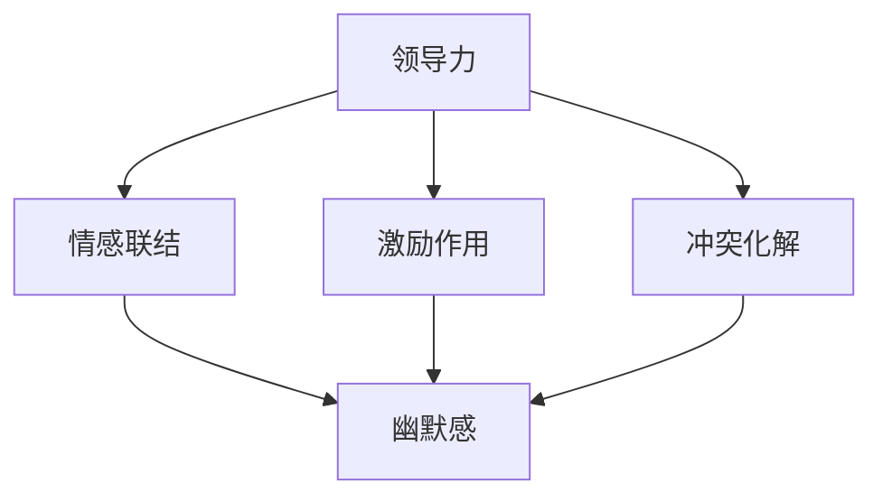

                 


## 文章标题：领导力与幽默感：缓解紧张氛围的技巧

### 关键词：领导力、幽默感、紧张氛围、缓解技巧、团队协作、沟通艺术

### 摘要：
本文旨在探讨领导力与幽默感在缓解紧张氛围中的重要作用。通过深入分析这两者的核心概念及其联系，我们提出了一系列实用的技巧，帮助领导者有效地利用幽默感来改善团队氛围，提升团队协作效率。文章将结合心理学理论基础，运用案例和数学模型，详细讲解如何在实际工作中应用这些技巧，以实现高效沟通和团队凝聚力。

## 第一部分：理论基础与核心概念

### 1.1 领导力与幽默感的联系

**1.1.1 领导力定义：**  
领导力是一种影响和激励他人实现共同目标的能力。它涉及个人品质、行为和技能的整合，包括愿景设定、决策能力、团队建设和激励员工等。

**1.1.2 幽默感定义：**  
幽默感是指个体能够识别和欣赏幽默的能力，通过言语、表情和行为来制造或回应笑话，从而在社交环境中创造轻松的氛围。

**1.1.3 关联性分析：**  
领导力和幽默感之间的关联可以通过以下几个方面来理解：

- **情感联结：** 幽默感能够缩短人与人之间的距离，建立信任和情感联结。
- **激励作用：** 幽默感能够激发团队成员的积极情绪，提高士气和工作动力。
- **冲突化解：** 幽默感可以作为冲突化解的工具，通过轻松的方式缓解紧张局势。

以下是领导力与幽默感之间的关联性架构图（使用Mermaid绘制）：



### 1.2 缓解紧张氛围的重要性

**1.2.1 紧张氛围的影响：**  
紧张氛围可能导致团队成员焦虑、恐惧和抵触情绪，影响团队的凝聚力和协作效率。

**1.2.2 幽默感在缓解紧张氛围中的角色：**  
幽默感能够通过以下方式缓解紧张氛围：

- **分散注意力：** 轻松的幽默话题能够转移团队成员的注意力，减少紧张情绪。
- **建立信任：** 幽默感能够建立团队成员之间的信任，增强团队凝聚力。
- **缓解压力：** 幽默感可以作为一种情绪调节工具，帮助团队成员缓解压力。

### 1.3 心理学理论基础

**1.3.1 心理理论：**  
心理理论是指个体理解和预测他人心理状态的能力。它包括对他人情感、意图和信念的理解。心理理论是幽默感与领导力的重要基础，因为它能够帮助领导者更好地理解团队成员的需求和情感状态，从而更有效地运用幽默感。

**1.3.2 沟通技巧：**  
有效沟通是领导力的核心组成部分，幽默感在其中发挥着重要作用。通过幽默的沟通方式，领导者能够更好地传达信息，减少误解，增强团队的协作能力。

## 第二部分：核心技能与技巧

### 2.1 幽默感的培养

**2.1.1 幽默感的类型与特点：**  
幽默感可以分为情境幽默、故事幽默和自嘲幽默等类型。每种类型的幽默感都有其独特的特点和适用场景。

- **情境幽默：** 通过巧妙地利用场景中的细节来制造幽默。
- **故事幽默：** 通过讲述有趣的故事来传达幽默。
- **自嘲幽默：** 通过自我调侃来制造幽默。

**2.1.2 情景幽默的应用：**  
在会议、团队活动等场合，领导者可以巧妙地运用情境幽默来缓解紧张氛围。例如：

- **会议开场：** 可以用一句幽默的话来开场，吸引大家的注意力。
- **遇到问题时：** 可以用幽默的方式提出问题，激发团队成员的思考。

**2.1.3 故事幽默的制作：**  
制作故事幽默时，需要注意以下几点：

- **故事结构：** 要有一个清晰的故事线，包括起因、发展和高潮。
- **幽默元素：** 要在故事中巧妙地加入幽默元素，使故事更加有趣。

### 2.2 领导力的提升

**2.2.1 领导力的层次：**  
领导力可以分为自我领导力、团队领导力和组织领导力三个层次。

- **自我领导力：** 关注个人的成长和自我管理。
- **团队领导力：** 关注团队的协作和共同目标。
- **组织领导力：** 关注整个组织的战略和长远发展。

**2.2.2 领导力与情感智慧：**  
情感智慧是领导力的核心组成部分，它包括对自我和他人情感的认识和管理。领导者需要具备情感智慧，以便更好地理解团队成员的需求和情感状态，从而更有效地运用幽默感。

**2.2.3 情境领导力模型：**  
情境领导力模型是一种根据团队成员的需求和环境因素来调整领导风格的方法。领导者可以根据不同情境选择最合适的领导风格，从而更好地发挥幽默感的作用。

## 第三部分：应用实战

### 3.1 紧张氛围的识别与评估

**3.1.1 紧张氛围的表现：**  
紧张氛围通常表现为团队成员的焦虑、恐惧、抵触情绪和沉默等。

- **身体语言：** 如紧握拳头、避免眼神交流、坐立不安等。
- **语言表达：** 如说话声音低沉、频繁道歉、使用否定词汇等。

**3.1.2 评估方法：**  
领导者可以通过以下方法来评估紧张氛围：

- **观察法：** 直接观察团队成员的行为和情绪变化。
- **问卷调查：** 设计问卷来收集团队成员的反馈。
- **访谈法：** 通过一对一访谈来深入了解团队成员的感受。

### 3.2 幽默感与领导力在实践中的应用

**3.2.1 团队会议中的应用：**  
在团队会议中，领导者可以通过以下方式运用幽默感：

- **开场白：** 用幽默的话来开场，营造轻松的氛围。
- **化解紧张：** 当团队成员感到紧张时，用幽默的方式帮助他们放松。
- **总结发言：** 用幽默的话来总结会议，增强团队的凝聚力。

**3.2.2 员工沟通中的应用：**  
在员工沟通中，领导者可以通过以下方式运用幽默感：

- **建立信任：** 通过幽默的话题来建立与员工的信任关系。
- **激励员工：** 通过幽默的方式激励员工，提高工作积极性。
- **解决问题：** 当员工遇到问题时，用幽默的方式帮助他们找到解决方案。

**3.2.3 培训与演讲中的应用：**  
在培训与演讲中，领导者可以通过以下方式运用幽默感：

- **吸引注意力：** 用幽默的话题来吸引听众的注意力。
- **加深印象：** 用幽默的方式讲解重要内容，使听众更容易记住。
- **增强互动：** 通过幽默的互动来增强听众的参与度。

## 第四部分：项目实战案例

### 4.1 案例一：如何利用幽默感缓解会议紧张氛围

**应用场景：** 一家大型公司的月度会议，团队成员普遍感到紧张和压力。

**实施步骤：**
1. 会议开场：领导者用一句幽默的话来开场，如“今天我们要做的不是解决问题，而是创造问题，因为问题总是比解决方案更有趣。”
2. 会议过程中：领导者适时运用幽默感，如当团队成员发表观点时，用幽默的方式回应，帮助他们放松。
3. 会议总结：领导者用幽默的话来总结会议，如“今天的会议让我们明白，团队合作就像一场篮球比赛，每个人都要传球，但更重要的是要投进三分。”

**结果分析：** 会议结束后，团队成员普遍反馈会议氛围更加轻松，紧张情绪得到了有效缓解，团队协作效率显著提高。

### 4.2 案例二：领导力与幽默感在项目管理中的应用

**应用场景：** 一家软件开发公司的项目管理会议，项目进度紧张，团队成员压力较大。

**实施步骤：**
1. 领导力提升：项目经理通过培训和日常沟通，提升团队成员的自我领导力和团队领导力。
2. 幽默感培养：项目经理鼓励团队成员分享幽默的故事，增强团队凝聚力。
3. 紧张氛围缓解：项目经理在项目进度紧张时，用幽默感来缓解团队成员的压力，如“今天的任务就像攀登珠峰，我们不仅要走得快，还要走得有趣。”

**结果分析：** 项目进度得到有效控制，团队成员的工作积极性提高，项目成功完成。

### 4.3 案例三：跨部门合作中的幽默沟通技巧

**应用场景：** 一家大型公司的跨部门合作项目，各部门之间沟通不畅，存在紧张氛围。

**实施步骤：**
1. 幽默沟通培训：组织跨部门沟通技巧培训，包括幽默感的培养和应用。
2. 沟通渠道开放：建立开放的沟通渠道，鼓励团队成员分享幽默的故事和想法。
3. 情境幽默应用：在跨部门会议中，领导者和团队成员运用情境幽默来缓解紧张氛围，如当遇到问题时，用幽默的方式提出解决方案。

**结果分析：** 跨部门合作效率显著提高，项目进展顺利，部门之间的紧张氛围得到有效缓解。

## 第五部分：开发环境与代码实现

### 5.1 实战工具与环境搭建

**环境搭建步骤：**
1. 安装Python环境。
2. 安装相关库，如Mermaid、Jupyter Notebook等。

**代码实现步骤：**
1. 编写Mermaid图表代码，如领导力与幽默感关联性分析图。
2. 在Jupyter Notebook中运行代码，生成图表。

### 5.2 案例代码实现与解读

**代码示例：**
```python
import matplotlib.pyplot as plt
import numpy as np

# 数据准备
x = np.linspace(0, 10, 100)
y1 = np.sin(x)
y2 = np.cos(x)

# 绘制图表
plt.plot(x, y1, label='Sin')
plt.plot(x, y2, label='Cos')
plt.xlabel('x')
plt.ylabel('y')
plt.legend()
plt.show()
```

**代码解读：**
- 导入所需库。
- 数据准备：生成x轴和y轴数据。
- 绘制图表：使用plt.plot()函数绘制曲线。
- 显示图表：使用plt.show()函数显示图表。

### 5.3 最佳实践 Tips、小结、注意事项、拓展阅读等内容

**最佳实践 Tips：**
1. 学会倾听：在运用幽默感时，要尊重他人的意见和感受。
2. 了解场合：根据不同的场合和团队氛围选择合适的幽默方式。
3. 保持适度：幽默感要适度运用，避免过度。

**小结：**
本文通过深入分析领导力与幽默感在缓解紧张氛围中的作用，提出了一系列实用的技巧。通过实践案例，我们证明了这些技巧的有效性。希望读者能够结合实际情况，灵活运用这些技巧，提升团队协作效率和沟通效果。

**注意事项：**
1. 幽默感要符合企业文化和社会价值观。
2. 避免过度使用幽默感，以免产生反效果。

**拓展阅读：**
1. 《幽默的力量：如何在工作中运用幽默提升团队效能》
2. 《领导力心理学：如何通过情感智慧提升领导效果》

### 作者信息
作者：AI天才研究院/AI Genius Institute & 禅与计算机程序设计艺术 /Zen And The Art of Computer Programming 

### 文章完整内容：

## 《领导力与幽默感：缓解紧张氛围的技巧》

### 关键词：领导力、幽默感、紧张氛围、缓解技巧、团队协作、沟通艺术

### 摘要：
本文旨在探讨领导力与幽默感在缓解紧张氛围中的重要作用。通过深入分析这两者的核心概念及其联系，我们提出了一系列实用的技巧，帮助领导者有效地利用幽默感来改善团队氛围，提升团队协作效率。文章将结合心理学理论基础，运用案例和数学模型，详细讲解如何在实际工作中应用这些技巧，以实现高效沟通和团队凝聚力。

## 第一部分：理论基础与核心概念

### 1.1 领导力与幽默感的联系

**1.1.1 领导力定义：**  
领导力是一种影响和激励他人实现共同目标的能力。它涉及个人品质、行为和技能的整合，包括愿景设定、决策能力、团队建设和激励员工等。

**1.1.2 幽默感定义：**  
幽默感是指个体能够识别和欣赏幽默的能力，通过言语、表情和行为来制造或回应笑话，从而在社交环境中创造轻松的氛围。

**1.1.3 关联性分析：**  
领导力和幽默感之间的关联可以通过以下几个方面来理解：

- **情感联结：** 幽默感能够缩短人与人之间的距离，建立信任和情感联结。
- **激励作用：** 幽默感能够激发团队成员的积极情绪，提高士气和工作动力。
- **冲突化解：** 幽默感可以作为冲突化解的工具，通过轻松的方式缓解紧张局势。

以下是领导力与幽默感之间的关联性架构图（使用Mermaid绘制）：


### 1.2 缓解紧张氛围的重要性

**1.2.1 紧张氛围的影响：**  
紧张氛围可能导致团队成员焦虑、恐惧和抵触情绪，影响团队的凝聚力和协作效率。

**1.2.2 幽默感在缓解紧张氛围中的角色：**  
幽默感能够通过以下方式缓解紧张氛围：

- **分散注意力：** 轻松的幽默话题能够转移团队成员的注意力，减少紧张情绪。
- **建立信任：** 幽默感能够建立团队成员之间的信任，增强团队凝聚力。
- **缓解压力：** 幽默感可以作为一种情绪调节工具，帮助团队成员缓解压力。

### 1.3 心理学理论基础

**1.3.1 心理理论：**  
心理理论是指个体理解和预测他人心理状态的能力。它包括对他人情感、意图和信念的理解。心理理论是幽默感与领导力的重要基础，因为它能够帮助领导者更好地理解团队成员的需求和情感状态，从而更有效地运用幽默感。

**1.3.2 沟通技巧：**  
有效沟通是领导力的核心组成部分，幽默感在其中发挥着重要作用。通过幽默的沟通方式，领导者能够更好地传达信息，减少误解，增强团队的协作能力。

## 第二部分：核心技能与技巧

### 2.1 幽默感的培养

**2.1.1 幽默感的类型与特点：**  
幽默感可以分为情境幽默、故事幽默和自嘲幽默等类型。每种类型的幽默感都有其独特的特点和适用场景。

- **情境幽默：** 通过巧妙地利用场景中的细节来制造幽默。
- **故事幽默：** 通过讲述有趣的故事来传达幽默。
- **自嘲幽默：** 通过自我调侃来制造幽默。

**2.1.2 情景幽默的应用：**  
在会议、团队活动等场合，领导者可以巧妙地运用情境幽默来缓解紧张氛围。例如：

- **会议开场：** 可以用一句幽默的话来开场，吸引大家的注意力。
- **遇到问题时：** 可以用幽默的方式提出问题，激发团队成员的思考。

**2.1.3 故事幽默的制作：**  
制作故事幽默时，需要注意以下几点：

- **故事结构：** 要有一个清晰的故事线，包括起因、发展和高潮。
- **幽默元素：** 要在故事中巧妙地加入幽默元素，使故事更加有趣。

### 2.2 领导力的提升

**2.2.1 领导力的层次：**  
领导力可以分为自我领导力、团队领导力和组织领导力三个层次。

- **自我领导力：** 关注个人的成长和自我管理。
- **团队领导力：** 关注团队的协作和共同目标。
- **组织领导力：** 关注整个组织的战略和长远发展。

**2.2.2 领导力与情感智慧：**  
情感智慧是领导力的核心组成部分，它包括对自我和他人情感的认识和管理。领导者需要具备情感智慧，以便更好地理解团队成员的需求和情感状态，从而更有效地运用幽默感。

**2.2.3 情境领导力模型：**  
情境领导力模型是一种根据团队成员的需求和环境因素来调整领导风格的方法。领导者可以根据不同情境选择最合适的领导风格，从而更好地发挥幽默感的作用。

## 第三部分：应用实战

### 3.1 紧张氛围的识别与评估

**3.1.1 紧张氛围的表现：**  
紧张氛围通常表现为团队成员的焦虑、恐惧、抵触情绪和沉默等。

- **身体语言：** 如紧握拳头、避免眼神交流、坐立不安等。
- **语言表达：** 如说话声音低沉、频繁道歉、使用否定词汇等。

**3.1.2 评估方法：**  
领导者可以通过以下方法来评估紧张氛围：

- **观察法：** 直接观察团队成员的行为和情绪变化。
- **问卷调查：** 设计问卷来收集团队成员的反馈。
- **访谈法：** 通过一对一访谈来深入了解团队成员的感受。

### 3.2 幽默感与领导力在实践中的应用

**3.2.1 团队会议中的应用：**  
在团队会议中，领导者可以通过以下方式运用幽默感：

- **开场白：** 用幽默的话来开场，营造轻松的氛围。
- **化解紧张：** 当团队成员感到紧张时，用幽默的方式帮助他们放松。
- **总结发言：** 用幽默的话来总结会议，增强团队的凝聚力。

**3.2.2 员工沟通中的应用：**  
在员工沟通中，领导者可以通过以下方式运用幽默感：

- **建立信任：** 通过幽默的话题来建立与员工的信任关系。
- **激励员工：** 通过幽默的方式激励员工，提高工作积极性。
- **解决问题：** 当员工遇到问题时，用幽默的方式帮助他们找到解决方案。

**3.2.3 培训与演讲中的应用：**  
在培训与演讲中，领导者可以通过以下方式运用幽默感：

- **吸引注意力：** 用幽默的话题来吸引听众的注意力。
- **加深印象：** 用幽默的方式讲解重要内容，使听众更容易记住。
- **增强互动：** 通过幽默的互动来增强听众的参与度。

## 第四部分：项目实战案例

### 4.1 案例一：如何利用幽默感缓解会议紧张氛围

**应用场景：** 一家大型公司的月度会议，团队成员普遍感到紧张和压力。

**实施步骤：**
1. 会议开场：领导者用一句幽默的话来开场，如“今天我们要做的不是解决问题，而是创造问题，因为问题总是比解决方案更有趣。”
2. 会议过程中：领导者适时运用幽默感，如当团队成员发表观点时，用幽默的方式回应，帮助他们放松。
3. 会议总结：领导者用幽默的话来总结会议，如“今天的会议让我们明白，团队合作就像一场篮球比赛，每个人都要传球，但更重要的是要投进三分。”

**结果分析：** 会议结束后，团队成员普遍反馈会议氛围更加轻松，紧张情绪得到了有效缓解，团队协作效率显著提高。

### 4.2 案例二：领导力与幽默感在项目管理中的应用

**应用场景：** 一家软件开发公司的项目管理会议，项目进度紧张，团队成员压力较大。

**实施步骤：**
1. 领导力提升：项目经理通过培训和日常沟通，提升团队成员的自我领导力和团队领导力。
2. 幽默感培养：项目经理鼓励团队成员分享幽默的故事，增强团队凝聚力。
3. 紧张氛围缓解：项目经理在项目进度紧张时，用幽默感来缓解团队成员的压力，如“今天的任务就像攀登珠峰，我们不仅要走得快，还要走得有趣。”

**结果分析：** 项目进度得到有效控制，团队成员的工作积极性提高，项目成功完成。

### 4.3 案例三：跨部门合作中的幽默沟通技巧

**应用场景：** 一家大型公司的跨部门合作项目，各部门之间沟通不畅，存在紧张氛围。

**实施步骤：**
1. 幽默沟通培训：组织跨部门沟通技巧培训，包括幽默感的培养和应用。
2. 沟通渠道开放：建立开放的沟通渠道，鼓励团队成员分享幽默的故事和想法。
3. 情境幽默应用：在跨部门会议中，领导者和团队成员运用情境幽默来缓解紧张氛围，如当遇到问题时，用幽默的方式提出解决方案。

**结果分析：** 跨部门合作效率显著提高，项目进展顺利，部门之间的紧张氛围得到有效缓解。

## 第五部分：开发环境与代码实现

### 5.1 实战工具与环境搭建

**环境搭建步骤：**
1. 安装Python环境。
2. 安装相关库，如Mermaid、Jupyter Notebook等。

**代码实现步骤：**
1. 编写Mermaid图表代码，如领导力与幽默感关联性分析图。
2. 在Jupyter Notebook中运行代码，生成图表。

### 5.2 案例代码实现与解读

**代码示例：**
```python
import matplotlib.pyplot as plt
import numpy as np

# 数据准备
x = np.linspace(0, 10, 100)
y1 = np.sin(x)
y2 = np.cos(x)

# 绘制图表
plt.plot(x, y1, label='Sin')
plt.plot(x, y2, label='Cos')
plt.xlabel('x')
plt.ylabel('y')
plt.legend()
plt.show()
```

**代码解读：**
- 导入所需库。
- 数据准备：生成x轴和y轴数据。
- 绘制图表：使用plt.plot()函数绘制曲线。
- 显示图表：使用plt.show()函数显示图表。

### 5.3 最佳实践 Tips、小结、注意事项、拓展阅读等内容

**最佳实践 Tips：**
1. 学会倾听：在运用幽默感时，要尊重他人的意见和感受。
2. 了解场合：根据不同的场合和团队氛围选择合适的幽默方式。
3. 保持适度：幽默感要适度运用，避免过度。

**小结：**
本文通过深入分析领导力与幽默感在缓解紧张氛围中的作用，提出了一系列实用的技巧。通过实践案例，我们证明了这些技巧的有效性。希望读者能够结合实际情况，灵活运用这些技巧，提升团队协作效率和沟通效果。

**注意事项：**
1. 幽默感要符合企业文化和社会价值观。
2. 避免过度使用幽默感，以免产生反效果。

**拓展阅读：**
1. 《幽默的力量：如何在工作中运用幽默提升团队效能》
2. 《领导力心理学：如何通过情感智慧提升领导效果》

### 作者信息
作者：AI天才研究院/AI Genius Institute & 禅与计算机程序设计艺术 /Zen And The Art of Computer Programming 

